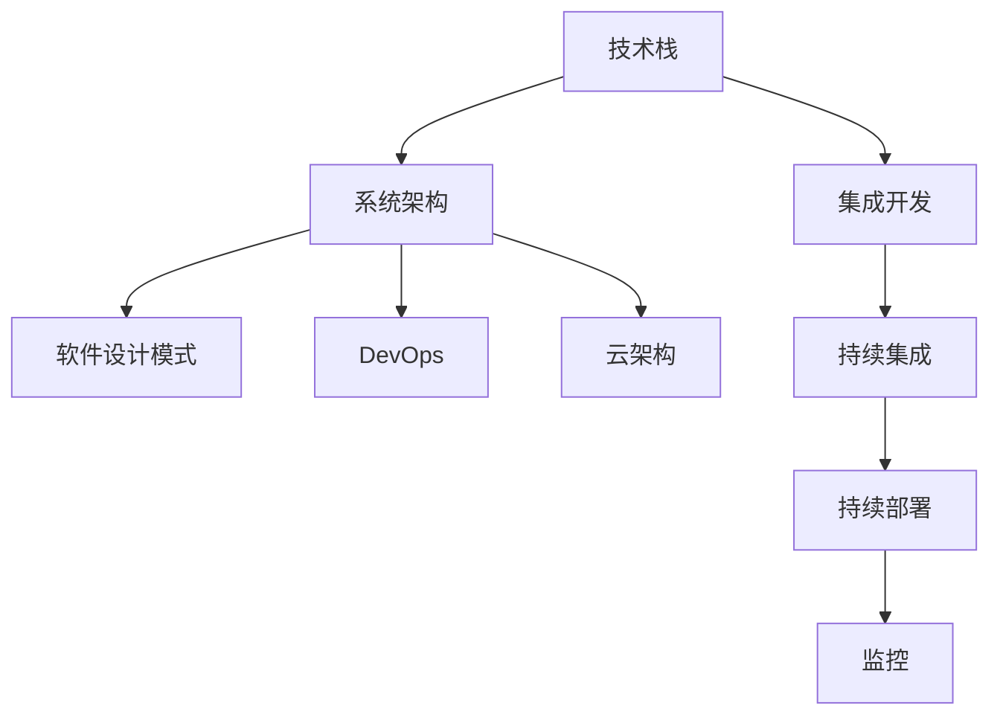

                 

# 从全栈开发到技术架构师的进阶

在快速变化的科技行业中，从全栈开发到技术架构师是一个重要的职业进阶路径。本文将探讨全栈开发者在追求技术卓越和领导力提升过程中所需要掌握的关键概念、技能以及成功经验，旨在为有意成为技术架构师的全栈开发者提供一个明确且实用的指南。

## 1. 背景介绍

### 1.1 问题由来
全栈开发人员的职业生涯通常始于前端或后端开发，随后由于项目需求的变化，逐渐需要掌握多种技术栈，包括但不限于前端技术（如HTML、CSS、JavaScript）、后端技术（如Python、Java、Node.js）、数据库（如MySQL、MongoDB）、以及云服务（如AWS、Google Cloud、Azure）等。随着技术复杂性的增加，全栈开发者发现自己不仅需要解决编码问题，还需管理项目、团队以及技术选型等任务，这便为成为技术架构师奠定了基础。

### 1.2 问题核心关键点
技术架构师的关键职责包括设计、实施和管理复杂系统的架构，确保系统的高可用性、可扩展性和安全性。以下是技术架构师需要具备的核心能力：
1. **系统设计**：理解业务需求，设计和选择最优技术栈。
2. **技术选型**：根据业务需求和技术趋势，合理选择新技术。
3. **系统性能**：优化系统性能，确保高效运行。
4. **系统安全**：构建安全防护机制，防范数据泄露和攻击。
5. **团队管理**：领导技术团队，促进知识共享和协作。

### 1.3 问题研究意义
从全栈开发到技术架构师的转型是职业发展的必然选择。掌握架构技能不仅能提升个人技术水平，还能带来更广阔的职业发展空间和更高的薪资水平。技术架构师在企业中往往具有较高的决策权，对业务和技术都有深刻理解，是推动企业技术创新和业务发展的重要角色。

## 2. 核心概念与联系

### 2.1 核心概念概述

为了更好地理解技术架构师的职业路径，我们先介绍几个关键概念：

- **技术栈**：指开发项目所需的各种技术集合，包括编程语言、框架、库、工具等。
- **系统架构**：定义系统的组件、组件间关系、数据流和通信协议等。
- **软件设计模式**：针对软件设计过程中常见问题提出的解决方案。
- **DevOps**：集成开发、持续集成、持续部署、监控等技术，确保软件快速、可靠地交付。
- **云架构**：利用云平台资源，构建分布式、可扩展的系统。

这些概念之间具有密切的联系，构成了技术架构师的工作基础。

### 2.2 核心概念原理和架构的 Mermaid 流程图



这个流程图展示了技术栈、系统架构、设计模式、DevOps以及云架构之间的关系，其中技术栈是系统架构的实现手段，软件设计模式提供了最佳实践，DevOps确保了持续交付和系统监控，云架构则扩展了系统的规模和弹性。

## 3. 核心算法原理 & 具体操作步骤

### 3.1 算法原理概述

技术架构师的工作核心是设计和实现系统的架构。通常，架构设计包含以下步骤：

1. **需求分析**：与业务团队紧密合作，理解业务需求，确定系统的功能和非功能要求。
2. **技术选型**：根据需求选择合适的技术栈，评估其适用性和可扩展性。
3. **架构设计**：构建系统的逻辑和物理架构，确定组件间的交互方式。
4. **原型开发**：实现架构设计，构建原型或样例系统。
5. **迭代优化**：根据反馈迭代改进架构，提升系统性能和可维护性。

### 3.2 算法步骤详解

以下是一个典型的架构设计步骤：

1. **需求梳理**：与业务团队沟通，明确业务需求、用户角色和场景。
2. **技术评估**：列出候选技术栈，评估其优缺点、兼容性、扩展性。
3. **架构设计**：使用UML（统一建模语言）等工具，设计系统的逻辑架构和物理架构。
4. **原型实现**：根据设计文档，选择适当的技术栈，实现系统原型。
5. **性能测试**：使用负载测试、压力测试等方法，评估系统的性能和稳定性。
6. **优化调整**：根据测试结果，优化架构设计，改进系统性能。

### 3.3 算法优缺点

技术架构设计具有以下优点：

1. **提升系统性能**：通过合理选择技术栈和架构设计，提升系统性能，优化用户体验。
2. **促进技术演进**：随着业务和技术的发展，架构设计能够支持系统的长期演进。
3. **降低开发成本**：通过预定义架构和组件，减少重复开发和维护成本。

同时，架构设计也存在以下缺点：

1. **设计复杂**：架构设计需要深入理解业务和技术，设计复杂且耗时。
2. **适应性差**：一旦设计完成，调整成本较高，难以应对快速变化的需求。
3. **决策风险**：架构设计依赖于架构师的判断和经验，决策不当可能导致系统性能下降或失败。

### 3.4 算法应用领域

技术架构设计广泛应用于各种领域，包括但不限于以下场景：

- **金融行业**：构建高性能的交易系统、风控系统、反欺诈系统。
- **电商行业**：构建高可用性的购物系统、推荐系统、库存管理系统。
- **互联网行业**：构建高并发的社交网络、视频平台、游戏平台。
- **医疗行业**：构建电子病历系统、影像诊断系统、健康管理平台。

## 4. 数学模型和公式 & 详细讲解 & 举例说明

### 4.1 数学模型构建

系统架构设计通常涉及多方面的指标，如性能、可用性、扩展性、安全性等。我们可以使用一些量化模型来衡量这些指标。

以系统性能为例，我们可以使用以下模型来衡量：

$$
\text{系统性能} = \frac{\text{响应时间}}{\text{请求数}} \times \text{并发用户数}
$$

这个模型反映了系统响应时间和请求数之间的关系，帮助评估系统性能。

### 4.2 公式推导过程

对于系统性能的衡量，我们需要明确一些关键参数：

- **响应时间**：系统处理请求所需的时间。
- **请求数**：系统在单位时间内接收的请求数量。
- **并发用户数**：同时在线使用的用户数。

假设一个系统在1秒内响应10个请求，有100个并发用户，则系统性能计算如下：

$$
\text{系统性能} = \frac{1}{1} \times 100 = 100 \text{ 请求/秒}
$$

这个公式帮助我们理解系统性能的计算方法，适用于衡量不同场景下的系统性能。

### 4.3 案例分析与讲解

考虑一个电商平台的订单系统，其架构设计需要考虑高性能、高可用性和可扩展性。以下是几个关键指标：

1. **响应时间**：订单处理时间，通常应控制在1秒以内。
2. **请求数**：每秒处理的订单数，目标为每秒1000个订单。
3. **并发用户数**：同时在线的用户数，目标为10000个。

根据上述公式，系统性能应达到：

$$
\text{系统性能} = \frac{1}{1} \times 10000 = 10000 \text{ 请求/秒}
$$

通过优化订单系统的架构设计，如采用缓存、负载均衡、分布式数据库等技术，可以提升系统性能，满足业务需求。

## 5. 项目实践：代码实例和详细解释说明

### 5.1 开发环境搭建

开发环境搭建通常包括以下步骤：

1. **安装开发工具**：如IntelliJ IDEA、Visual Studio Code、Sublime Text等。
2. **配置环境变量**：设置JDK路径、Maven或Gradle配置文件等。
3. **安装依赖库**：如Spring Boot、Hibernate、MySQL等。
4. **配置版本控制**：如Git，用于版本管理和协作开发。

### 5.2 源代码详细实现

以下是一个简单的Spring Boot项目实现，展示了一个Web服务的基本架构：

```java
@SpringBootApplication
public class Application {
    public static void main(String[] args) {
        SpringApplication.run(Application.class, args);
    }
}

@RestController
@RequestMapping("/api")
public class UserController {
    @Autowired
    private UserService userService;

    @GetMapping("/users")
    public List<User> getUsers() {
        return userService.getAllUsers();
    }

    @GetMapping("/users/{id}")
    public User getUserById(@PathVariable Long id) {
        return userService.getUserById(id);
    }

    // 其他API实现...
}
```

### 5.3 代码解读与分析

上述代码中，我们使用Spring Boot框架构建了一个简单的RESTful API，展示了用户管理的API接口。

- `@SpringBootApplication`注解：用于启动Spring Boot应用。
- `@RestController`注解：表示该类为控制器，处理HTTP请求。
- `@RequestMapping`注解：映射请求路径。
- `@Autowired`注解：自动注入依赖，如`UserService`。
- `@GetMapping`注解：处理GET请求。
- `@PathVariable`注解：获取URL路径变量。

### 5.4 运行结果展示

运行上述代码，启动Spring Boot应用，访问`http://localhost:8080/api/users`可以获取所有用户信息。

## 6. 实际应用场景

### 6.1 微服务架构

微服务架构是一种基于服务划分的架构模式，旨在提高系统的灵活性、可扩展性和可用性。微服务架构将系统拆分为多个小型、独立的服务，每个服务负责特定的业务功能。

- **优势**：
  - **灵活性**：每个服务可以独立部署和扩展。
  - **可扩展性**：可以根据需求动态添加或删除服务。
  - **高可用性**：单个服务的故障不会影响整个系统。

- **挑战**：
  - **复杂性增加**：服务数量增多，管理复杂度增加。
  - **通信开销**：服务间通信需要额外的时间和网络带宽。
  - **数据一致性**：分布式系统中需要考虑数据一致性问题。

### 6.2 容器化部署

容器化是将应用程序及其依赖打包在容器中的技术，用于确保应用在不同环境中一致运行。Docker是常用的容器化工具。

- **优势**：
  - **一致性**：确保应用在不同环境中一致运行。
  - **快速部署**：容器可以快速启动和停止。
  - **资源隔离**：多个应用可以共享同一台服务器，提高资源利用率。

- **挑战**：
  - **学习成本**：需要学习Docker和容器化技术。
  - **网络管理**：容器间通信需要额外管理。
  - **性能影响**：容器会增加额外的管理开销。

### 6.3 云架构

云架构是指利用云平台资源构建分布式、可扩展的系统。云平台如AWS、Google Cloud、Azure等。

- **优势**：
  - **高可用性**：云平台提供基础设施即服务，保证高可用性。
  - **可扩展性**：云平台支持弹性伸缩，根据需求动态扩展。
  - **成本效益**：按需支付，节约硬件和维护成本。

- **挑战**：
  - **安全性**：云平台需保证数据安全和隐私。
  - **复杂性**：云平台需综合考虑安全、成本、性能等因素。
  - **依赖性**：对云平台依赖较高，需持续维护和优化。

## 7. 工具和资源推荐

### 7.1 学习资源推荐

- **书籍**：
  - 《深入理解Java虚拟机》：深入了解Java虚拟机原理和优化。
  - 《Spring Boot实战》：学习Spring Boot框架的实际应用。
  - 《Kubernetes权威指南》：学习Kubernetes容器编排。

- **在线课程**：
  - Coursera《Algorithms, Part I》：学习算法和数据结构。
  - Udacity《Full Stack Web Developer Nanodegree》：全面学习前端、后端开发和DevOps。
  - edX《Microservices: From Staging to Production》：学习微服务架构设计。

- **技术社区**：
  - Stack Overflow：解决编程问题，交流技术经验。
  - GitHub：开源项目分享和协作。
  - DZone：技术文章、教程和社区讨论。

### 7.2 开发工具推荐

- **IDE**：
  - IntelliJ IDEA：Java开发的首选IDE。
  - Visual Studio Code：支持多种编程语言，易于扩展。
  - Sublime Text：轻量级编辑器，支持插件。

- **版本控制**：
  - Git：分布式版本控制系统，支持协作开发。
  - GitLab/GitHub：代码托管和协作平台。

- **项目管理**：
  - JIRA/Trello：任务管理工具，跟踪项目进度。
  - Asana：团队协作工具，提高效率。

### 7.3 相关论文推荐

- **软件架构**：
  - "On Architectural Stylization" by C. Kessler et al.（2010）。
  - "Architectural Design Patterns for Software Architecture Research" by P. Cerdeira et al.（2011）。

- **云架构**：
  - "Cloud Computing: Concepts, Technology and Architecture" by S. Grobler et al.（2009）。
  - "Design Patterns for Cloud Computing" by D. Kandel et al.（2012）。

## 8. 总结：未来发展趋势与挑战

### 8.1 研究成果总结

本文介绍了从全栈开发到技术架构师进阶的关键概念、算法原理和实际操作步骤，涵盖了系统设计、架构选型、DevOps、云架构等多个方面。通过系统梳理和实践分享，帮助读者全面掌握技术架构师所需的关键技能。

### 8.2 未来发展趋势

技术架构师职业的未来发展趋势主要包括以下几点：

1. **技术栈不断更新**：新技术和工具层出不穷，技术架构师需不断学习新的技术栈。
2. **架构设计自动化**：工具如Infrastructure as Code（IaC）将使架构设计更加高效和可重复。
3. **人工智能融合**：AI技术在架构设计中的应用将进一步提升系统性能和用户体验。
4. **云原生架构**：云原生架构将成为企业架构设计的标配，提升系统的灵活性和可扩展性。
5. **微服务架构演进**：微服务架构将不断发展，解决传统架构的问题，提升系统可维护性和可扩展性。

### 8.3 面临的挑战

尽管技术架构师职业前景广阔，但面临的挑战也逐渐增多：

1. **技术更新速度快**：需不断学习新技术，跟踪技术发展趋势。
2. **架构设计复杂**：大型系统架构设计复杂，需综合考虑多种因素。
3. **团队管理难度大**：需管理不同技术背景的团队，促进协作和知识共享。
4. **系统安全和隐私**：需设计安全性高的架构，防范数据泄露和攻击。
5. **性能优化挑战**：需不断优化系统性能，确保高效运行。

### 8.4 研究展望

未来的技术架构师需关注以下研究领域：

1. **自动化工具**：研究自动化工具如IaC，提高架构设计的效率和可重复性。
2. **模型驱动架构**：探索模型驱动架构（MDA），提升系统设计的标准化和一致性。
3. **人工智能集成**：研究AI在架构设计中的应用，提升系统智能和自适应性。
4. **混合架构**：研究混合架构（如Serverless、Hybrid Cloud），提升系统的灵活性和可扩展性。
5. **系统安全**：研究系统安全的最新技术和工具，提升系统的安全性。

## 9. 附录：常见问题与解答

### Q1: 如何平衡架构设计和灵活性？

**A**: 在架构设计中，需综合考虑业务需求和系统可扩展性。首先进行架构设计，然后根据业务需求和反馈进行迭代优化。可使用微服务架构和容器化部署等技术，提高系统的灵活性和可扩展性。

### Q2: 如何提高系统的性能？

**A**: 可通过以下方法提高系统性能：
1. 缓存优化：使用缓存技术如Redis，减少数据库访问。
2. 负载均衡：使用负载均衡器如Nginx，均衡请求负载。
3. 数据库优化：使用索引、分片等技术，提升数据库性能。
4. 分布式系统：使用分布式架构如微服务，提升系统可扩展性。

### Q3: 如何保证系统的安全性？

**A**: 保证系统安全需从以下几个方面入手：
1. 数据加密：对敏感数据进行加密存储和传输。
2. 访问控制：使用身份认证和授权机制，确保数据访问安全。
3. 安全监控：使用安全监控工具如WAF（Web应用防火墙），防范攻击。
4. 漏洞管理：定期进行漏洞扫描和安全测试，及时修复漏洞。

### Q4: 如何构建高效的后端服务？

**A**: 构建高效后端服务需从以下几个方面入手：
1. 数据库优化：使用索引、分片等技术，提升数据库性能。
2. 缓存优化：使用缓存技术如Redis，减少数据库访问。
3. 分布式系统：使用分布式架构如微服务，提升系统可扩展性。
4. 异步处理：使用消息队列如RabbitMQ，提升系统处理效率。

### Q5: 如何管理多团队协作？

**A**: 管理多团队协作需从以下几个方面入手：
1. 使用项目管理工具：如JIRA/Trello，跟踪项目进度和任务。
2. 定期沟通：定期组织团队会议，沟通项目进展和问题。
3. 知识共享：建立知识库，分享最佳实践和技术经验。
4. 团队建设：组织团队建设活动，提升团队凝聚力和协作能力。

---

作者：禅与计算机程序设计艺术 / Zen and the Art of Computer Programming

