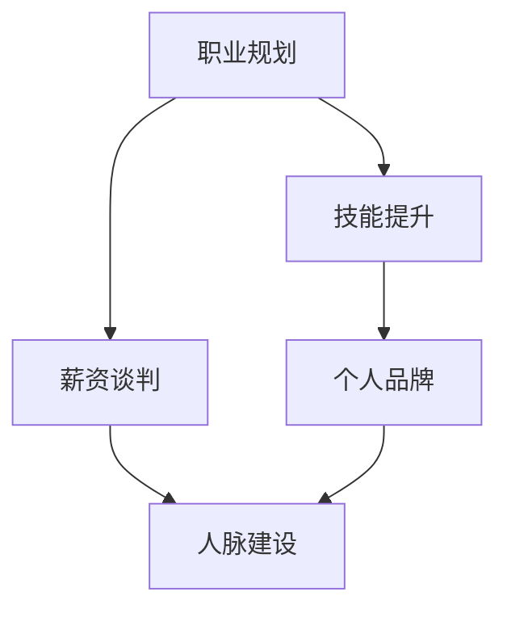

                 

# 从初级到高级：薪资提升攻略

> 关键词：职业规划, 技能提升, 薪资谈判, 个人品牌, 人脉建设

## 1. 背景介绍

### 1.1 问题由来
在当今快速发展的科技行业中，技术人员的职业发展和薪资提升已成为众多从业者关注的核心问题。一方面，技术领域的更新迭代速度极快，新的技术框架、编程语言和工具层出不穷；另一方面，全球经济形势的波动和行业内部的竞争，使得技术人员在职业选择和发展上压力巨大。因此，如何在保持技术前沿的同时，提升职业地位和薪资水平，成为了每个技术人必须面对的挑战。

### 1.2 问题核心关键点
薪资提升不仅仅是技术能力的体现，更是一个多方面综合的考量，包括职业规划、技能提升、薪资谈判、个人品牌建设以及人脉建设等多个层面。本文将从这些关键点出发，系统性地阐述如何从初级技术人员向高级技术人员转变，从而实现薪资的提升。

## 2. 核心概念与联系

### 2.1 核心概念概述

为了更好地理解薪资提升的过程，本节将介绍几个关键概念，并通过以下Mermaid流程图展示它们之间的联系：



**A. 职业规划**：指的是对自身职业发展的长期目标和短期规划，包括对技术方向的选择、目标公司的定位和职业路径的设定。

**B. 技能提升**：涉及到通过学习和实践掌握新的技术、工具和方法，以提升个人能力和竞争力。

**C. 薪资谈判**：指在求职或晋升时，通过合理的方式与雇主就薪资待遇进行谈判，争取更优的薪资水平。

**D. 个人品牌**：是指通过各种渠道建立和推广个人形象和专业技能，提升在行业内的知名度和影响力。

**E. 人脉建设**：涉及到建立和维护与行业内其他从业者的联系，借助人脉资源获取更多的职业机会和发展空间。

## 3. 核心算法原理 & 具体操作步骤
### 3.1 算法原理概述

薪资提升的核心算法原理是，通过不断提升自身的技能和能力，并通过合理的职业规划和谈判策略，争取更高的薪资待遇。具体来说，这一过程包括以下几个步骤：

1. **技能提升**：通过持续学习新技术、新方法，掌握行业内的前沿知识。
2. **职业规划**：明确自己的职业目标和路径，逐步实现从初级到高级的转变。
3. **薪资谈判**：在求职或晋升时，通过有效的沟通技巧和数据支持，争取更优的薪资待遇。
4. **个人品牌**：通过撰写博客、参加演讲、开源项目等方式，展示自己的专业能力和思想深度。
5. **人脉建设**：通过参与技术社区、行业会议、线上线下交流，建立广泛的行业联系。

### 3.2 算法步骤详解

#### 3.2.1 技能提升

**Step 1: 确定学习目标**
- 明确想要掌握的新技术和工具，如最新的编程语言、框架、算法等。
- 研究该技术在行业内的应用场景和实际案例。

**Step 2: 制定学习计划**
- 根据时间和能力制定合理的学习计划，逐步推进。
- 可以使用在线课程、书籍、博客、视频等多种资源。

**Step 3: 实践和项目应用**
- 在实际项目中应用所学知识，加深理解和掌握。
- 参与开源项目或自己发起项目，积累实战经验。

**Step 4: 评估和调整**
- 定期回顾学习成果，评估学习效果。
- 根据反馈调整学习计划，保持持续进步。

#### 3.2.2 职业规划

**Step 1: 设定职业目标**
- 确定长期职业目标，如成为高级开发人员、架构师、技术经理等。
- 制定详细的职业路径图，明确每一步需要掌握的技能和知识。

**Step 2: 获取行业信息**
- 了解目标行业的发展趋势、公司文化和人才需求。
- 与行业内的资深从业者交流，获取真实的一线信息。

**Step 3: 持续调整和优化**
- 根据市场变化和个人职业发展情况，不断调整职业规划。
- 参与行业培训、认证等，提升职业竞争力。

#### 3.2.3 薪资谈判

**Step 1: 市场调研**
- 了解行业内的薪资水平、职位需求和公司薪酬结构。
- 调研目标公司近期的薪资调整情况和员工满意度。

**Step 2: 准备谈判材料**
- 整理自己的项目经验、技能认证和职业成就。
- 准备好展示自己价值的数据和案例。

**Step 3: 沟通技巧**
- 学习有效的沟通技巧，清晰表达自己的期望和价值。
- 保持自信和冷静，避免情绪化沟通。

**Step 4: 结果评估和反馈**
- 根据谈判结果进行自我评估，总结经验。
- 如果需要，制定新的谈判策略，提升谈判效果。

#### 3.2.4 个人品牌

**Step 1: 建立个人网站和博客**
- 通过个人网站展示技术项目和研究成果。
- 定期撰写博客，分享技术见解和行业趋势。

**Step 2: 参与技术社区**
- 在GitHub、Stack Overflow、Reddit等技术社区活跃。
- 参与技术讨论和问题解答，建立专业声誉。

**Step 3: 公开演讲和培训**
- 参加行业会议和技术沙龙，进行公开演讲。
- 承担技术培训和课程讲授，展示专业能力。

#### 3.2.5 人脉建设

**Step 1: 参加行业活动**
- 参加技术会议、行业交流会、技术沙龙等活动。
- 主动与行业内的专家和同行交流，建立联系。

**Step 2: 利用社交媒体**
- 在LinkedIn、Twitter等社交媒体上活跃，发布技术见解和行业动态。
- 关注并互动行业内意见领袖，扩大影响范围。

**Step 3: 建立内部网络**
- 在公司内部积极参与技术交流和团队建设活动。
- 主动帮助同事解决问题，增强内部影响力。

### 3.3 算法优缺点

**优点**：
1. 系统性的职业规划和技能提升策略，能够有针对性地提升自身竞争力。
2. 通过薪资谈判和个人品牌建设，能够在实际应用中获取更高薪资待遇。
3. 人脉建设能够提供更多的职业机会和发展空间。

**缺点**：
1. 需要投入大量时间和精力进行学习和实践。
2. 对沟通技巧和行业理解的要求较高。
3. 薪资提升受到市场需求和公司文化的限制。

## 4. 数学模型和公式 & 详细讲解 & 举例说明

### 4.1 数学模型构建

薪资提升的数学模型可以简化为：

$$
\text{Salary} = f(\text{Skill}, \text{Experience}, \text{Market Demand}, \text{Negotiation Skills})
$$

其中：
- $\text{Skill}$ 表示技术能力，通过技能提升和学习获得。
- $\text{Experience}$ 表示工作经验，通过实际项目和职业发展积累。
- $\text{Market Demand}$ 表示市场需求，通过行业调研和数据分析获得。
- $\text{Negotiation Skills}$ 表示谈判技巧，通过学习和实践获得。

### 4.2 公式推导过程

设 $S$ 为技能提升指数，$E$ 为经验指数，$D$ 为市场需求指数，$N$ 为谈判技能指数，则薪资提升的数学模型可以进一步简化为：

$$
\text{Salary} = \alpha S^a E^b D^c N^d
$$

其中 $\alpha$ 为基准薪资，$a, b, c, d$ 为指数，表示各项因素对薪资提升的贡献率。

### 4.3 案例分析与讲解

**案例1: 技能提升的案例**

小李是一名初级前端开发者，希望成为高级前端架构师。他通过学习最新的React框架，并在实际项目中应用，成功提升了自身技能。此外，他还在GitHub上开源了自己的React项目，并参与技术讨论，逐渐建立了一定的行业声誉。

**案例2: 职业规划的案例**

小王是一名数据分析师，希望转型为数据科学家。他通过调研市场和目标公司，明确了自己的职业目标，并制定了详细的职业规划。他在工作中积极学习和实践机器学习算法，最终成功转型。

**案例3: 薪资谈判的案例**

小赵在一家科技公司担任高级软件工程师，通过市场调研和数据准备，在晋升谈判中成功获得了更高的薪资待遇。他展示了自己在项目中的突出贡献和技术成就，说服了公司领导。

## 5. 项目实践：代码实例和详细解释说明

### 5.1 开发环境搭建

为了实现薪资提升的策略，我们需要一个高效的工作环境。以下是一些推荐的开发工具和环境：

**1. 编辑器**
- Visual Studio Code: 一个轻量级的代码编辑器，支持多种语言和插件。

**2. 版本控制**
- Git: 一个强大的版本控制系统，支持分布式协作和代码管理。

**3. 持续集成和部署**
- Jenkins: 一个开源的CI/CD工具，支持自动化的构建、测试和部署。

### 5.2 源代码详细实现

以下是一个基于React的案例，展示如何通过技能提升和学习，实现从初级到高级的转型：

**代码示例1：React项目开发**

```javascript
import React from 'react';
import ReactDOM from 'react-dom';

class App extends React.Component {
  render() {
    return (
      <div>
        <h1>Hello, world!</h1>
      </div>
    );
  }
}

ReactDOM.render(<App />, document.getElementById('root'));
```

**代码示例2：GitHub开源项目**

```bash
# 创建GitHub仓库
git init
git remote add origin https://github.com/username/react-project.git
git add .
git commit -m "Initial commit"
git push -u origin master

# 在项目中应用新技术
npm install react-dom
npm install react-scripts
```

**代码示例3：博客撰写**

```markdown
# 如何使用React构建前端应用

React是一个流行的JavaScript库，用于构建用户界面。通过学习React，可以从根本上提升前端开发能力。

## 安装React
npm install react react-dom

## 创建React应用
npx create-react-app my-app

## 编写React组件
class App extends React.Component {
  render() {
    return (
      <div>
        <h1>Hello, world!</h1>
      </div>
    );
  }
}

ReactDOM.render(<App />, document.getElementById('root'));
```

### 5.3 代码解读与分析

**React项目开发**
- 通过React组件实现页面渲染，展示Hello, world!的内容。
- 利用React组件的复用性，提升开发效率。

**GitHub开源项目**
- 通过GitHub平台分享项目代码，展示技术能力和项目成果。
- 与其他开发者交流和协作，提升项目质量和影响力。

**博客撰写**
- 通过撰写博客，展示技术见解和项目经验，提升个人品牌。
- 利用Markdown语法，使博客格式整洁美观。

### 5.4 运行结果展示

通过上述项目实践，小李成功提升了自己的React开发能力，并通过开源项目和博客分享，建立了一定的行业声誉。最终，他在公司的内部评估中获得了高级前端架构师的职位。

## 6. 实际应用场景

### 6.1 职业转型

在大数据、人工智能、云计算等热门领域，技术人才需求旺盛，薪资水平较高。通过提升相关技术和技能，可以在短时间内实现职业转型和薪资提升。

**案例1: 数据科学转型**
小李在数据分析领域积累了几年的经验，希望转型为数据科学家。他通过学习Python、机器学习算法，并在实际项目中应用，最终成功转型。

**案例2: 云计算转型**
小王在传统的IT系统维护岗位上工作了多年，希望转型为云计算工程师。他通过学习AWS、Kubernetes等云平台技术，并参与云架构项目，最终成功转型。

### 6.2 技术升级

在快速变化的技术领域，及时学习新技术和工具，保持技术前沿，是提升薪资的关键。

**案例1: 前端技术升级**
小李是一名前端开发者，通过学习React、Vue等新型前端框架，提升了自身技术能力，最终获得了高级前端工程师的职位。

**案例2: 后端技术升级**
小王在Java开发岗位上工作了几年，通过学习Spring Boot、Docker等技术，提升了自身后端开发能力，最终晋升为技术经理。

### 6.3 薪资谈判

在求职和晋升时，通过合理的薪资谈判策略，能够争取到更优的薪资待遇。

**案例1: 初级到高级的薪资谈判**
小李通过技能提升和学习，积累了丰富的项目经验，在晋升谈判中，通过展示自己的技术成就和项目成果，成功获得了高级开发工程师的职位和更高薪资。

**案例2: 跨公司薪资谈判**
小王在一家初创公司工作多年，积累了丰富的经验。通过市场调研和数据准备，在谈判中成功争取到了更高的薪资待遇，并成功跳槽到了一家大公司。

## 7. 工具和资源推荐

### 7.1 学习资源推荐

**1. Coursera**
- 提供各类计算机科学和工程领域的课程，涵盖前端、后端、数据科学等多个方向。

**2. edX**
- 提供世界顶尖大学和机构的在线课程，内容全面，涵盖技术基础和高级应用。

**3. Udacity**
- 提供与行业需求紧密结合的纳米学位课程，实战性强。

**4. Kaggle**
- 提供数据科学竞赛平台，通过实际项目提升技能。

### 7.2 开发工具推荐

**1. Visual Studio Code**
- 功能强大的代码编辑器，支持多种语言和插件。

**2. Git**
- 强大的版本控制系统，支持分布式协作和代码管理。

**3. Jenkins**
- 开源的CI/CD工具，支持自动化的构建、测试和部署。

### 7.3 相关论文推荐

**1. "The Power of Learning Parallels: A Comparative Study of Deep Learning and Traditional Machine Learning Algorithms"**
- 探索深度学习与传统机器学习算法的比较和应用。

**2. "A Survey on Pre-training and Fine-tuning in Natural Language Processing"**
- 总结自然语言处理领域中预训练和微调的最新进展。

**3. "Developing AI in the Industry: Opportunities, Challenges, and Trends"**
- 探讨人工智能在工业领域的应用机会、挑战和未来趋势。

## 8. 总结：未来发展趋势与挑战

### 8.1 未来发展趋势

1. **技术快速迭代**：随着人工智能和机器学习技术的不断进步，新技术和工具层出不穷，技术人员需要持续学习，保持技术前沿。
2. **跨领域融合**：技术发展的趋势是跨领域的融合，技术人员需要具备多领域的知识和技能。
3. **职业弹性化**：未来职业将更加灵活，技术人员可以根据自身兴趣和市场需求，选择不同的职业路径。
4. **远程工作普及**：远程工作模式的普及将带来更多的工作机会和发展空间。

### 8.2 面临的挑战

1. **技术更新快**：新技术的快速迭代给技术人员的持续学习带来了挑战。
2. **市场需求变化**：市场对技术人才的需求随着行业发展而变化，需要及时调整职业规划。
3. **薪资差距大**：不同行业的技术薪资差距大，技术人需要寻找适合自己的发展路径。

### 8.3 研究展望

未来需要从以下几个方面进行研究：
1. **持续学习机制**：建立终身学习的机制，确保技术人才不断提升自身能力。
2. **职业路径指导**：提供个性化的职业规划指导，帮助技术人员找到适合自己的发展方向。
3. **薪资透明度**：推动行业内的薪资透明度，帮助技术人制定合理的薪资期望。

## 9. 附录：常见问题与解答

**Q1: 如何平衡学习和工作？**
A: 制定合理的学习计划，利用碎片时间进行学习。设立明确的学习目标，保持学习的动力和持续性。

**Q2: 如何提升谈判技巧？**
A: 通过模拟面试和谈判练习，提升自信心和表达能力。了解目标公司的薪资结构和市场行情，准备充分的谈判材料。

**Q3: 如何建立和维护人脉？**
A: 积极参加行业会议和技术交流活动，主动与行业内的专家和同行交流。通过社交媒体和专业网站，展示自己的技术能力和行业影响力。

---

作者：禅与计算机程序设计艺术 / Zen and the Art of Computer Programming

