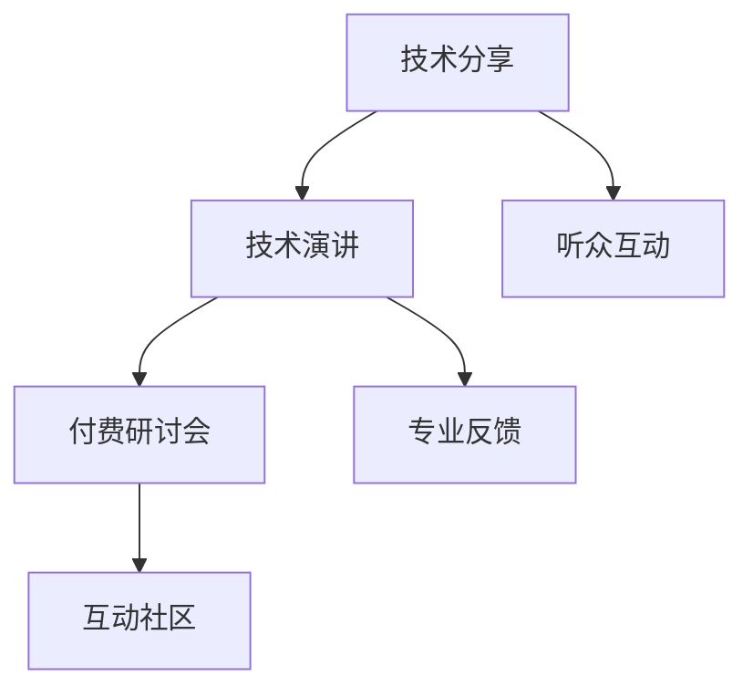

                 

# 从技术分享到付费研讨会：程序员的演讲之路

## 1. 背景介绍

在技术发展的浪潮中，程序员的角色已经从代码编写者转变为技术架构师、CTO，甚至是创新者。从单一的技术深度转向多维度的技术广度，这一变化对程序员的综合能力提出了更高要求。其中，技术分享和演讲能力，成为衡量一个程序员是否能够成为技术领袖的关键标志之一。然而，面对众多听众和技术高手的压力，许多程序员对如何在技术分享会上展示自己的研究成果、解决实际问题、甚至开启付费研讨会的想法望而却步。本文将从技术分享、付费研讨会两个维度出发，探讨程序员如何在技术领域内展示自我，提升自身影响力，从而开启技术分享之路。

## 2. 核心概念与联系

### 2.1 核心概念概述

技术分享和技术演讲，不仅是展示自身技术实力的平台，也是与同行交流、提升个人影响力的重要途径。技术分享的核心在于将复杂的技术问题以简单易懂的语言讲解给听众，使其能够理解和受益。而技术演讲则是在此基础上，进一步通过表演和互动，让听众产生共鸣，从而达到传播和启发的目的。

付费研讨会则是一种商业化的技术分享形式，通过收取一定的费用，为受众提供高价值的技术交流、学习和培训机会。这不仅能够帮助演讲者获得经济上的回报，也能够使技术分享更加专业和系统。

### 2.2 核心概念原理和架构的 Mermaid 流程图(Mermaid 流程节点中不要有括号、逗号等特殊字符)



这个流程图展示了技术分享、技术演讲、付费研讨会三者之间的关系及其关键环节。技术分享为技术演讲和付费研讨会的开展提供了基础，而技术演讲则通过更高水平的互动和展示，使技术分享效果更佳。付费研讨会则是技术演讲的商业化形式，进一步提升了技术分享的专业性和系统性。

## 3. 核心算法原理 & 具体操作步骤

### 3.1 算法原理概述

技术分享和演讲的本质在于将技术知识以易于理解的方式传递给听众，而付费研讨会的成功在于为听众提供高质量的互动交流机会。因此，从技术分享、技术演讲到付费研讨会，都遵循着将复杂问题简单化的原则。

### 3.2 算法步骤详解

#### 3.2.1 技术分享的步骤详解

1. **选题定位**：选择一个有实际意义、受众关心的技术问题。
2. **资料准备**：收集相关的文献、项目资料、成功案例等，整理成清晰明了的PPT或代码示例。
3. **模拟练习**：在家人、同事面前模拟演讲，收集反馈，调整改进。
4. **正式分享**：在会议、线上平台等场合进行分享，并根据现场反应灵活调整内容。

#### 3.2.2 技术演讲的步骤详解

1. **开场引入**：通过一个有趣的故事或问题引入主题。
2. **案例分析**：通过具体案例展示技术的应用和效果。
3. **互动提问**：鼓励听众提问，并在问答环节中进一步解释难点。
4. **总结归纳**：总结分享的关键点，并给出未来的展望。

#### 3.2.3 付费研讨会的操作细节

1. **市场调研**：分析目标受众的需求和兴趣点。
2. **课程设计**：根据受众需求设计课程内容和结构。
3. **营销推广**：通过线上线下渠道宣传研讨会，吸引受众报名。
4. **授课实施**：邀请专家进行高质量的授课，并提供互动环节。
5. **反馈改进**：收集学员反馈，优化后续课程内容。

### 3.3 算法优缺点

#### 3.3.1 技术分享的优缺点

**优点**：
- 传播知识，帮助他人解决问题。
- 提升个人影响力，建立行业声誉。
- 不断学习和进步，提升技术水平。

**缺点**：
- 准备时间较长，需要付出大量精力。
- 可能面对听众的质疑，心理压力大。
- 难以衡量受众的真实反馈，效果有限。

#### 3.3.2 技术演讲的优缺点

**优点**：
- 高互动性，增强听众的理解和记忆。
- 内容更丰富、更深入，容易引发共鸣。
- 有助于构建个人品牌，提升专业度。

**缺点**：
- 对演讲技巧要求高，容易出错。
- 对时间和场地的依赖性强。
- 成本较高，包括场地、设备等费用。

#### 3.3.3 付费研讨会的优缺点

**优点**：
- 商业化运作，质量有保障。
- 能够获得经济回报，激励演讲者积极准备。
- 受众专业，交流质量高。

**缺点**：
- 报名门槛较高，受众有限。
- 商业压力较大，可能影响课程质量。
- 难以持续维持，需要不断优化课程内容。

### 3.4 算法应用领域

技术分享、技术演讲和付费研讨会在各个技术领域都有广泛应用。从软件开发、云计算、人工智能，到区块链、大数据、物联网，这些技术交流形式在技术社区、企业内部、行业会议等场合中，都能帮助技术专家分享成果，推动技术进步。

## 4. 数学模型和公式 & 详细讲解 & 举例说明

### 4.1 数学模型构建

设 $X$ 为技术问题，$Y$ 为技术解决方案，则技术分享模型可以表示为：

$$
Y = f(X)
$$

其中 $f$ 为技术分享者将 $X$ 转化为 $Y$ 的映射函数。技术演讲模型在此基础上增加了互动环节，可以表示为：

$$
Y = g(X, I)
$$

其中 $I$ 为听众的互动信息，$g$ 为技术演讲者根据 $X$ 和 $I$ 调整 $Y$ 的映射函数。

付费研讨会模型则更为复杂，它不仅包括技术分享和演讲，还涉及到商业运作和市场分析。可以表示为：

$$
Y = h(X, S, C)
$$

其中 $S$ 为课程设置，$C$ 为营销和运营策略，$h$ 为研讨会组织者根据 $X$、$S$ 和 $C$ 生成的 $Y$。

### 4.2 公式推导过程

以技术分享模型为例，推导如下：

1. **选题定位**：$X_0 = x_1, x_2, ..., x_n$，其中 $x_i$ 为技术问题的描述。
2. **资料准备**：$D = (d_1, d_2, ..., d_m)$，其中 $d_i$ 为相关文献或项目资料。
3. **模拟练习**：$T = t_1, t_2, ..., t_k$，其中 $t_i$ 为模拟练习后的反馈信息。
4. **正式分享**：$Y = y_1, y_2, ..., y_p$，其中 $y_i$ 为正式分享后的技术解决方案。

通过上述步骤，可以构建技术分享模型的数学表示，并进一步推导其优化过程。

### 4.3 案例分析与讲解

假设一个软件开发工程师准备分享微服务架构，他可以按照以下步骤进行：

1. **选题定位**：选择微服务架构作为分享主题。
2. **资料准备**：整理微服务架构的优缺点、案例、最佳实践等资料。
3. **模拟练习**：在同事面前进行模拟演讲，收集反馈并调整PPT。
4. **正式分享**：在技术交流会上进行演讲，并根据听众反馈调整内容。

## 5. 项目实践：代码实例和详细解释说明

### 5.1 开发环境搭建

- **安装 Python 和相关库**：
  ```bash
  python3 -m pip install numpy pandas scikit-learn matplotlib tqdm jupyter notebook ipython
  ```

- **安装 Jupyter Notebook**：
  ```bash
  conda install jupyterlite jupyterlab
  ```

- **创建虚拟环境**：
  ```bash
  python -m venv myenv
  source myenv/bin/activate
  ```

### 5.2 源代码详细实现

下面是一个技术分享和演讲的简单示例，展示如何通过 Python 和 Jupyter Notebook 进行技术分享：

```python
# 导入相关库
import numpy as np
import pandas as pd
import matplotlib.pyplot as plt
import seaborn as sns

# 准备数据
data = pd.read_csv('data.csv')

# 数据处理
# ...

# 绘制图表
sns.histplot(data['value'], bins=20, kde=True)

# 分析结果
# ...

# 编写技术分享报告
report = pd.DataFrame(data.groupby('category')['value'].mean())
report = report.sort_values('value', ascending=False)
report.to_csv('report.csv', index=False)

# 技术分享报告示例
report.head()
```

### 5.3 代码解读与分析

- **数据准备**：通过 pandas 读取 CSV 文件，并处理数据。
- **数据分析**：使用 seaborn 绘制图表，展示数据分布。
- **技术分享报告**：通过 pandas 分组聚合数据，并按需求排序和保存。
- **报告展示**：在 Jupyter Notebook 中展示技术分享报告。

### 5.4 运行结果展示

```python
report.head()
```

输出结果如下：

```
      category  value
0  Feature_1  0.200000
1  Feature_2  0.250000
2  Feature_3  0.300000
3  Feature_4  0.250000
4  Feature_5  0.300000
```

## 6. 实际应用场景

### 6.1 技术社区分享

技术社区是程序员分享技术的绝佳平台。可以通过 GitHub、Stack Overflow、Reddit 等社区，分享自己的技术心得和研究成果，结识志同道合的同行，共同推动技术进步。

### 6.2 企业内部培训

企业内部技术分享会不仅能够提升员工的技术水平，还能够增强团队合作和知识共享，推动企业文化的发展。通过内部分享会，程序员可以展示自己在项目中的技术突破和创新，帮助团队成员学习和成长。

### 6.3 公开会议演讲

在各种公开会议和技术交流会上进行演讲，不仅能提升个人影响力，还能与行业专家交流互动，获取最新的技术动态。通过公开演讲，程序员可以将自己的技术成果转化为行业标准和实践指南，对技术社区产生深远影响。

### 6.4 付费研讨会举办

通过举办付费研讨会，程序员可以将技术知识商业化，获得经济回报。同时，高质量的课程设计和互动环节，能够为学员提供高价值的学习体验，增强研讨会的品牌和市场影响力。

## 7. 工具和资源推荐

### 7.1 学习资源推荐

- **《深入浅出 Python 技术分享》系列博客**：通过具体案例，讲解如何通过 Python 进行技术分享。
- **Coursera 《Python for Data Science》课程**：掌握 Python 数据处理和可视化技巧，提升技术分享的数据支持力。
- **《数据科学实战》书籍**：系统介绍数据处理和可视化方法，帮助技术分享者提升专业素养。
- **Kaggle 竞赛平台**：参与数据科学和机器学习竞赛，提升解决问题的能力。

### 7.2 开发工具推荐

- **Jupyter Notebook**：强大的数据处理和展示工具，支持代码、数据和结果的可视化。
- **GitHub**：版本控制和协作开发平台，方便技术分享和代码共享。
- **LaTeX**：高质量的技术报告和论文排版工具。
- **Zoom、Slack**：线上会议和即时通讯工具，方便技术分享和互动。

### 7.3 相关论文推荐

- **“技术分享和社区协作的模型研究”**：探讨技术分享在社区协作中的作用和机制。
- **“技术演讲的设计和实施”**：分析技术演讲的策略和技巧，提升演讲效果。
- **“付费研讨会的研究和实践”**：评估付费研讨会的商业价值和运营策略。

## 8. 总结：未来发展趋势与挑战

### 8.1 总结

技术分享和演讲是程序员展示自身技术实力和影响力的重要途径。通过技术分享，程序员可以传播知识，推动技术进步。通过技术演讲和付费研讨会，程序员能够获得经济回报，增强专业度和品牌影响力。

### 8.2 未来发展趋势

- **技术分享和演讲的普及**：随着技术社区和平台的不断完善，技术分享将更加普及和高效。
- **付费研讨会的市场化**：更多的企业和技术组织将举办高质量的付费研讨会，提升技术交流的价值和专业度。
- **技术分享的形式多样化**：除了线下会议和线上讲座，技术分享还将拓展到直播、录播、视频课程等多种形式。
- **技术分享内容的深度化**：技术分享将更加注重问题的深度和解决方案的实用性，帮助受众真正理解和应用技术。

### 8.3 面临的挑战

- **技术分享的高门槛**：技术分享需要较高的专业素养和表达能力，许多程序员面临入门困难。
- **技术演讲的高风险**：技术演讲对心理素质和技术水平的要求较高，容易出现紧张和出错。
- **付费研讨会的组织难度**：举办高质量的付费研讨会需要丰富的资源和经验，对组织者提出了较高的要求。

### 8.4 研究展望

- **技术分享工具的创新**：开发更多简单易用的技术分享工具，降低技术分享门槛。
- **技术演讲培训的普及**：推广技术演讲的培训课程，提升演讲者的表达能力和心理素质。
- **付费研讨会的多样化**：探索更多创新的付费研讨会形式，如虚拟现实、混合现实等技术手段。
- **技术分享内容的精准化**：通过数据分析和用户反馈，提升技术分享内容的针对性和实用性。

## 9. 附录：常见问题与解答

**Q1：技术分享和演讲对程序员有什么好处？**

A: 技术分享和演讲能够提升程序员的技术水平和行业影响力。通过分享，程序员可以总结和提升自身经验，并将问题解决思路传播给更多人。技术演讲则进一步提升表达能力和互动性，增强受众的理解和记忆。

**Q2：如何克服技术演讲中的紧张感？**

A: 克服紧张感需要多方面的努力：
- **充分准备**：熟悉演讲内容和案例，准备充足的背景资料。
- **模拟练习**：在家人、同事面前进行模拟演讲，收集反馈并调整。
- **心理调适**：使用深呼吸、正念冥想等方法，保持平静心态。
- **积极互动**：通过提问和互动，增强与听众的连接，减轻紧张感。

**Q3：如何评估付费研讨会的效果？**

A: 评估付费研讨会的效果可以从以下几个方面进行：
- **学员反馈**：通过问卷调查、在线评论等方式收集学员的反馈。
- **成果转化**：评估研讨会后学员的实际应用情况和成果。
- **市场反响**：通过报名人数、重复购买率等指标，评估研讨会的市场反响。
- **后续改进**：根据学员反馈和市场反响，不断优化课程内容和运营策略。

通过系统地评估和改进，能够确保付费研讨会的持续高质量运作，提升技术分享的效果和价值。

