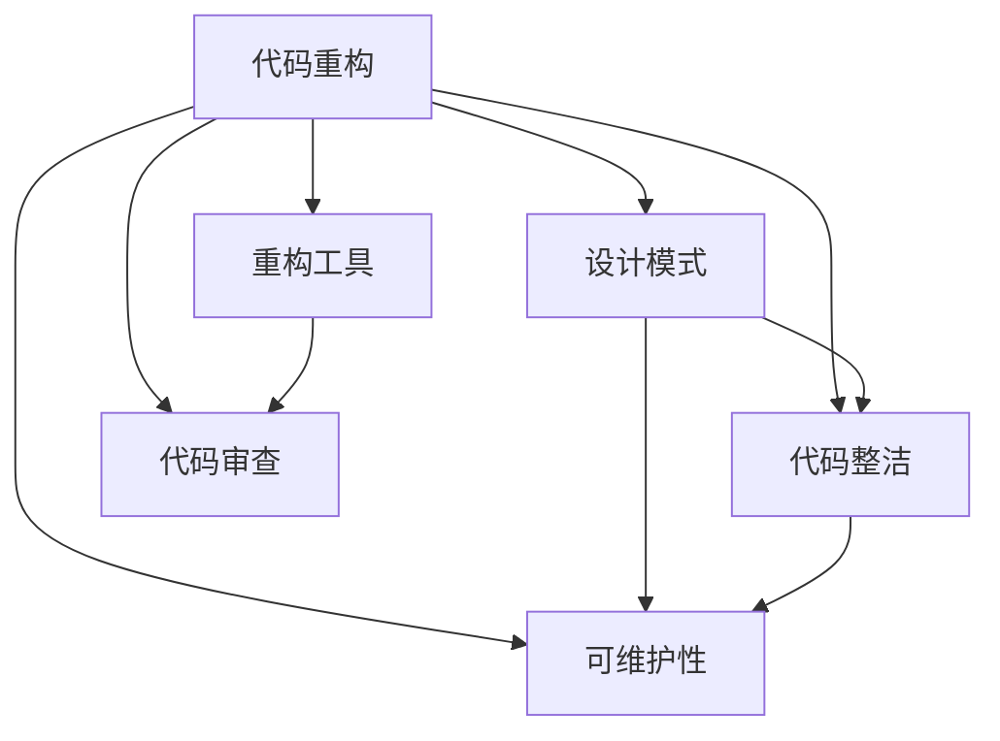

                 

# 代码重构技术：改善既有代码的设计

> 关键词：代码重构,设计模式,代码整洁,可维护性,重构工具,代码审查

## 1. 背景介绍

在软件开发中，重构（Refactoring）是指在不改变软件功能的前提下，通过改善代码结构和设计，提高代码的可读性、可维护性和可扩展性。重构是软件开发的一项重要活动，它不仅能提升代码质量，还能预防潜在的代码退化问题。

然而，重构并不是一项轻松的工作。它需要深厚的技术积累、丰富的实践经验和对代码的深刻理解。本文将系统介绍代码重构的核心概念、重构原理、常见模式和工具，并通过案例分析和项目实践，详细阐述如何实施和评估重构效果，帮助开发者提升代码质量，降低技术债务。

## 2. 核心概念与联系

### 2.1 核心概念概述

为更好地理解代码重构，本节将介绍几个关键概念：

- 代码重构（Refactoring）：通过改善代码结构和设计，提升代码可读性、可维护性和可扩展性的过程。重构不仅关注代码形式的改善，更关注代码内部逻辑的优化。
- 设计模式（Design Pattern）：指在软件设计过程中，针对常见问题的解决方式。设计模式分为创建型、结构型和行为型三种，是重构的重要参考。
- 代码整洁（Clean Code）：指代码结构的清晰、紧凑、易懂和简洁，能够降低代码复杂度，提升代码的可维护性。
- 可维护性（Maintainability）：指代码能够被有效地维护和修改，减少修改带来的风险和成本。
- 重构工具（Refactoring Tools）：辅助开发者实施重构的工具和框架，如IntelliJ IDEA、VSCode等。
- 代码审查（Code Review）：由同行代码审查技术方案，评估重构的合理性和效果，及时发现和修复代码问题。

这些概念之间的逻辑关系可以通过以下Mermaid流程图来展示：



这个流程图展示了我代码重构的关键概念及其之间的关系：

1. 代码重构通过改善代码结构和设计，提升代码可读性和可维护性。
2. 设计模式为重构提供具体的解决方案，优化代码内部逻辑。
3. 代码整洁是重构的目标，简洁的代码易于理解和维护。
4. 可维护性是重构的衡量标准，优秀的代码应具备良好的可维护性。
5. 重构工具支持开发者高效实施重构，提升重构效率。
6. 代码审查确保重构效果，及时发现和修复代码问题。

## 3. 核心算法原理 & 具体操作步骤
### 3.1 算法原理概述

代码重构的本质是通过改善代码结构和设计，提升代码的可读性和可维护性。其核心原理包括：

- 抽象和封装：将复杂问题分解为可管理的小问题，并使用封装技术将其包装起来。
- 单一职责原则：每个函数、类或模块应只负责一个职责，避免职责交叉。
- 依赖倒置原则：高层模块不应依赖低层模块，应依赖抽象接口。
- 开闭原则：软件对象应对外界变化开放，对内部变化关闭。

通过这些设计原则和重构技术，开发者可以提升代码质量，降低技术债务，提高软件开发的效率和质量。

### 3.2 算法步骤详解

代码重构的过程一般包括以下几个关键步骤：

**Step 1: 确定重构目标**
- 识别代码中存在的问题，如复杂度、耦合度、可读性、可维护性等。
- 制定重构计划，明确重构的目标和范围。

**Step 2: 分析代码**
- 对目标代码进行详细分析，找出其中的设计缺陷和重构机会。
- 确定重构的最佳方案，包括使用哪些设计模式、进行哪些结构调整等。

**Step 3: 实施重构**
- 使用重构工具或手动进行代码重构，如重命名变量、提取方法、重构类结构等。
- 重构过程中应遵循设计原则，确保代码结构的合理性和可维护性。

**Step 4: 验证重构效果**
- 通过代码审查和测试，验证重构后代码的可用性和性能是否满足预期。
- 对比重构前后的代码质量和功能，评估重构效果。

**Step 5: 持续改进**
- 定期进行代码重构，及时发现和修复代码问题。
- 积累重构经验，不断提升代码质量和开发效率。

### 3.3 算法优缺点

代码重构的优势包括：
1. 提升代码质量：改善代码结构和设计，提高代码可读性和可维护性。
2. 降低技术债务：减少代码中的技术债务，提升软件的长期可持续性。
3. 提高开发效率：通过重构简化代码逻辑，降低后续开发和维护成本。
4. 提升团队协作：规范代码风格和结构，提升团队协作效率和代码质量。

代码重构的劣势包括：
1. 重构成本较高：重构需要投入时间和精力，尤其在大规模代码库中进行。
2. 重构风险较高：重构过程中可能引入新问题，影响代码的稳定性。
3. 重构效果不明显：重构不一定能立即提升代码性能，效果需要逐步显现。
4. 重构需要经验：重构需要深厚的技术积累和丰富的实践经验。

尽管存在这些劣势，但重构仍然是提升代码质量和提升软件可维护性的重要手段。

### 3.4 算法应用领域

代码重构在软件开发中有着广泛的应用，涵盖了各种不同的编程语言和开发环境。以下是几个常见的应用领域：

- 前端开发：重构代码以提升性能、减少bug、改善用户体验。
- 后端开发：重构代码以提升可维护性、降低技术债务、提高代码可扩展性。
- 移动开发：重构代码以优化性能、提升用户体验、增强代码可维护性。
- 嵌入式开发：重构代码以优化资源使用、提升代码可读性、改善代码结构。
- 游戏开发：重构代码以提升游戏性能、减少bug、优化用户体验。

## 4. 数学模型和公式 & 详细讲解 & 举例说明
### 4.1 数学模型构建

在代码重构中，数学模型并不是一个必需的部分，但通过数学模型，我们可以更好地理解重构效果。例如，可以使用代码复杂度（Cyclomatic Complexity）和耦合度（Coupling Degree）等指标来评估重构前后的代码质量。

### 4.2 公式推导过程

代码复杂度（Cyclomatic Complexity）是一个衡量代码复杂度的指标，用于评估代码的可读性和可维护性。其计算公式如下：

$$
Cyclomatic\ Complexity = E - N + 2P - T
$$

其中，$E$为程序中的所有判断（包括if、switch等），$N$为程序中的所有函数，$P$为程序的入口数，$T$为程序中的所有函数嵌套数。

### 4.3 案例分析与讲解

以下通过一个简单的代码示例，阐述如何通过重构提升代码质量和可维护性。

假设我们有一个Python函数，用于计算矩形的面积：

```python
def rectangle_area(length, width):
    if length <= 0 or width <= 0:
        return 0
    else:
        return length * width
```

这个函数的代码结构复杂，可读性差。通过重构，我们可以将其改写为：

```python
def rectangle_area(length, width):
    if length <= 0 or width <= 0:
        raise ValueError('Invalid dimensions')
    return length * width
```

首先，我们将原来的if语句改写为raise ValueError，以提升代码可读性和可维护性。同时，我们将代码复杂度从原来的2降低到1，提升代码质量。

## 5. 项目实践：代码实例和详细解释说明
### 5.1 开发环境搭建

在进行代码重构实践前，我们需要准备好开发环境。以下是使用Python进行代码重构的常见环境配置流程：

1. 安装Python：从官网下载并安装Python 3.x版本。
2. 安装开发工具：安装PyCharm、VSCode等开发工具，用于代码编辑和调试。
3. 安装重构工具：安装Pylint、Flake8等代码质量检查工具，用于代码风格检查和质量评估。

### 5.2 源代码详细实现

接下来，我们将对一个简单的Python程序进行代码重构。

假设我们有一个计算三角形面积的函数：

```python
def triangle_area(base, height):
    if base <= 0 or height <= 0:
        return 0
    else:
        return 0.5 * base * height
```

首先，我们可以使用Pylint等工具进行代码质量检查，找出需要改进的地方。然后，我们可以根据检查结果，逐一进行代码重构。

以下是一个重构后的示例代码：

```python
def triangle_area(base, height):
    if base <= 0 or height <= 0:
        raise ValueError('Invalid dimensions')
    return 0.5 * base * height
```

### 5.3 代码解读与分析

在重构过程中，我们遵循了以下几个设计原则：

1. 简化代码逻辑：将if语句改写为raise ValueError，以提升代码可读性。
2. 提升代码质量：将代码复杂度从原来的2降低到1，提升代码质量。
3. 增强代码可维护性：通过raise ValueError，提高代码的可维护性和可读性。

## 6. 实际应用场景
### 6.1 项目重构

在实际项目中，代码重构是一项重要的开发活动。以下是一些常见的项目重构场景：

- 代码清理：清理代码中的技术债务，如去除冗余代码、优化循环结构等。
- 功能拆分：将复杂的函数、类或模块拆分为更小的、功能单一的部分，以提升代码可读性和可维护性。
- 接口设计：重构接口设计，使其更加简洁、易用、灵活。
- 数据结构优化：优化数据结构，提升代码性能和可读性。
- 异常处理：优化异常处理机制，提高代码健壮性和可读性。

### 6.2 开源项目重构

开源项目也常常需要进行代码重构，以提升代码质量和用户体验。以下是一些常见的开源项目重构场景：

- 代码风格统一：统一开源项目的代码风格，提升代码可读性和可维护性。
- 性能优化：优化开源项目的性能，提升用户体验和系统稳定性。
- 功能增强：增强开源项目的功能，满足用户需求。
- 代码重构：根据用户反馈，进行代码重构，提升代码质量和用户体验。

### 6.3 持续集成与持续部署（CI/CD）

在CI/CD流程中，代码重构也是一个重要的环节。以下是一些常见的CI/CD重构场景：

- 代码质量检查：在CI/CD流程中，加入代码质量检查，及时发现和修复代码问题。
- 代码重构自动化：将代码重构自动化集成到CI/CD流程中，提升重构效率。
- 版本控制：通过版本控制工具，记录重构历史，便于追溯和对比。

## 7. 工具和资源推荐
### 7.1 学习资源推荐

为了帮助开发者系统掌握代码重构的理论基础和实践技巧，这里推荐一些优质的学习资源：

1. 《重构：改善既有代码的设计》书籍：由Martin Fowler撰写，详细介绍代码重构的原理和实践方法，是重构领域的经典之作。
2. 《Clean Code》书籍：由Robert C. Martin撰写，深入浅出地介绍了代码整洁的实践方法，是重构实践的必备指南。
3. 《Refactoring: Improving the Design of Existing Code》书籍：由Martin Fowler撰写，系统介绍了代码重构的实践方法，是重构领域的权威参考书。
4. Coursera《Clean Code》课程：由Martin Fowler等专家主讲，系统介绍了代码整洁的实践方法，是重构实践的优秀资源。
5. Codecademy《Python Code Refactoring》课程：详细介绍了Python代码重构的实践方法，是重构实践的优秀资源。

通过对这些资源的学习实践，相信你一定能够快速掌握代码重构的精髓，并用于解决实际的代码问题。

### 7.2 开发工具推荐

高效的开发离不开优秀的工具支持。以下是几款用于代码重构开发的常用工具：

1. PyCharm：功能强大的开发工具，支持代码重构、代码质量检查等特性，是重构实践的优秀工具。
2. VSCode：轻量级的代码编辑器，支持代码重构、代码质量检查等特性，是重构实践的优秀工具。
3. Pylint：Python代码质量检查工具，支持代码风格检查、代码质量评估等特性，是重构实践的优秀工具。
4. Flake8：Python代码质量检查工具，支持代码风格检查、代码质量评估等特性，是重构实践的优秀工具。
5. IntelliJ IDEA：功能强大的Java开发工具，支持代码重构、代码质量检查等特性，是重构实践的优秀工具。

合理利用这些工具，可以显著提升代码重构的开发效率，加快创新迭代的步伐。

### 7.3 相关论文推荐

代码重构是软件开发领域的重要研究方向。以下是几篇奠基性的相关论文，推荐阅读：

1. 《Refactoring: Improving the Design of Existing Code》：Martin Fowler的经典之作，详细介绍代码重构的原理和实践方法。
2. 《Clean Code: A Handbook of Agile Software Craftsmanship》：Robert C. Martin的经典之作，深入浅出地介绍了代码整洁的实践方法。
3. 《The Future of Software Architecture Design and Evolution: An Empirical Study on Software Architecture Evolution in Open-Source Systems》：研究开源系统中的代码重构规律，提供有价值的实证研究。
4. 《Improving Software Quality with Continuous Code Refactoring》：研究连续性代码重构对软件质量的影响，提供有价值的实践指导。
5. 《Design Patterns: Elements of Reusable Object-Oriented Software》：介绍设计模式的基本概念和实践方法，是重构实践的重要参考。

这些论文代表了大语言模型微调技术的发展脉络。通过学习这些前沿成果，可以帮助研究者把握学科前进方向，激发更多的创新灵感。

## 8. 总结：未来发展趋势与挑战
### 8.1 总结

本文对代码重构的核心概念、重构原理、常见模式和工具进行了全面系统的介绍。首先，阐述了代码重构在软件开发中的重要性和必要性，明确了重构的目标和具体步骤。其次，通过数学模型和公式推导，详细讲解了代码质量和可维护性的衡量指标。最后，通过案例分析和项目实践，详细阐述了如何实施和评估代码重构效果，帮助开发者提升代码质量，降低技术债务。

通过本文的系统梳理，可以看到，代码重构是提升软件质量和开发效率的重要手段。开发者在实施代码重构时，需要根据具体项目和代码特点，选择合适的重构策略和工具，确保重构效果显著，同时降低重构成本和风险。

### 8.2 未来发展趋势

展望未来，代码重构技术将呈现以下几个发展趋势：

1. 自动化重构：随着AI技术的进步，自动化重构工具将越来越智能，能够根据代码质量评估结果，自动进行代码重构，提升重构效率。
2. 智能重构：基于机器学习和数据挖掘技术，智能识别代码中的问题，提出合理的重构方案，提升重构效果。
3. 持续重构：在CI/CD流程中，将代码重构自动化集成，实现持续性代码重构，保持代码质量的高水平。
4. 云端重构：将代码重构服务云端化，通过API接口提供重构服务，提升重构的可访问性和便捷性。
5. 社区协作：借助开源社区的力量，共享重构经验和技术，加速代码重构的普及和提升。

这些趋势展示了代码重构技术未来的广阔前景。自动化和智能化重构将是重构技术发展的重要方向，将进一步提升开发效率和代码质量。

### 8.3 面临的挑战

尽管代码重构技术已经取得了显著成果，但在迈向更加智能化、自动化的重构过程中，它仍面临着诸多挑战：

1. 重构成本较高：自动化和智能化重构仍需要投入大量时间和资源，尤其在大规模代码库中进行。
2. 重构风险较高：自动化和智能化重构可能引入新问题，影响代码的稳定性。
3. 重构效果不明显：自动化和智能化重构不一定能立即提升代码性能，效果需要逐步显现。
4. 重构需要经验：自动化和智能化重构需要深厚的技术积累和丰富的实践经验。

尽管存在这些挑战，但重构技术仍在不断发展，有望在未来得到更好的解决和优化。

### 8.4 研究展望

面向未来，代码重构技术需要在以下几个方面寻求新的突破：

1. 自动化重构：提升重构工具的智能水平，实现自动重构和智能化优化。
2. 机器学习辅助：引入机器学习技术，优化重构方案，提高重构效果。
3. 持续集成与持续部署：将重构集成到CI/CD流程中，实现持续性重构和质量保证。
4. 代码质量评估：引入数据挖掘和机器学习技术，优化代码质量评估指标和方法。
5. 社区协作：借助开源社区的力量，共享重构经验和技术，提升重构水平。

这些研究方向的探索，必将引领代码重构技术迈向更高的台阶，为软件开发和代码管理带来新的机遇和挑战。只有勇于创新、敢于突破，才能不断提升代码质量和开发效率。

## 9. 附录：常见问题与解答
**Q1：代码重构是否适用于所有项目？**

A: 代码重构适用于大多数项目，特别是对于代码质量较低、技术债务较多的项目。但重构需要投入时间和资源，对于一些紧急的项目，可能需要先修复bug或实现新功能，再考虑重构。

**Q2：重构过程中如何避免引入新问题？**

A: 重构过程中应遵循设计原则，确保重构后的代码质量不低于重构前。同时，应使用重构工具和代码审查机制，及时发现和修复重构过程中引入的新问题。

**Q3：重构工具和代码审查是否必要？**

A: 重构工具和代码审查是提升代码质量和重构效果的重要手段。它们不仅能够提升重构效率，还能确保重构效果的可靠性和稳定性。

**Q4：重构后代码的可读性和可维护性如何评估？**

A: 重构后代码的可读性和可维护性可以通过代码质量评估工具、代码审查和用户反馈等方式进行评估。常用的评估指标包括代码复杂度、耦合度、可读性等。

**Q5：重构过程中如何保持代码的稳定性？**

A: 重构过程中应分阶段进行，逐步更新代码，确保每个阶段的重构效果稳定可靠。同时，应使用重构工具和版本控制工具，记录重构历史，便于追溯和对比。

通过本文的系统梳理，可以看到，代码重构是提升代码质量和开发效率的重要手段。开发者在实施代码重构时，需要根据具体项目和代码特点，选择合适的重构策略和工具，确保重构效果显著，同时降低重构成本和风险。

---

作者：禅与计算机程序设计艺术 / Zen and the Art of Computer Programming

