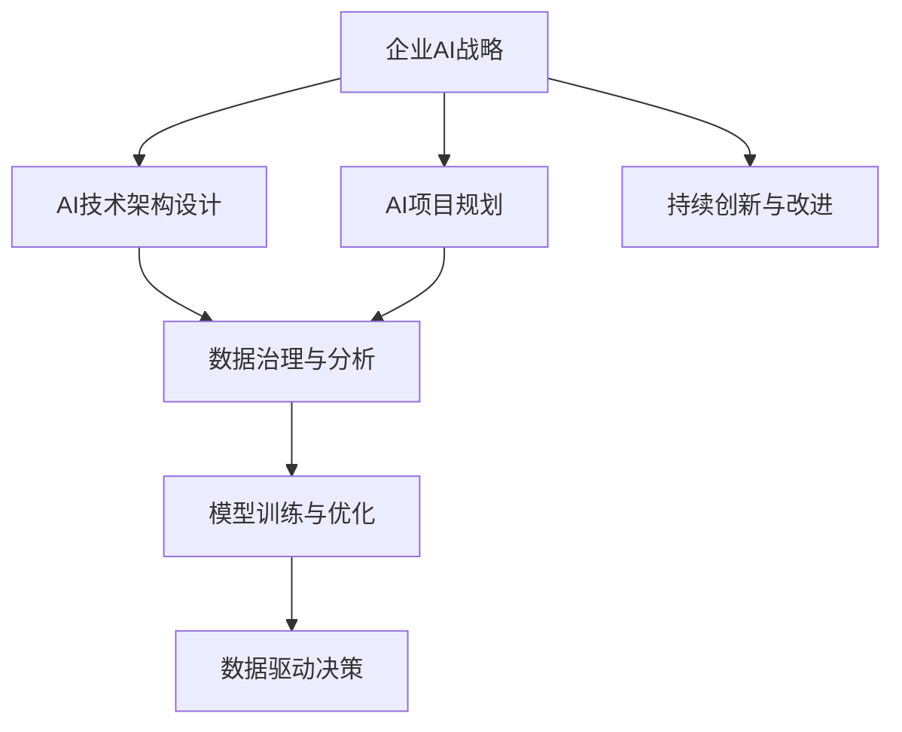

                 

# 企业AI战略咨询：Lepton AI的高端服务

> 关键词：企业AI战略,Lepton AI,AI咨询服务,数字化转型,智慧企业,数据驱动决策

## 1. 背景介绍

### 1.1 问题由来
在数字化转型的浪潮中，越来越多的企业意识到AI的重要性。但面对繁复的技术栈、复杂的市场环境，企业往往难以制定科学合理的AI战略，导致AI项目的实施效果大打折扣。企业迫切需要全方位的AI咨询服务，以帮助他们理清思路，明确方向，成功落地AI项目。

### 1.2 问题核心关键点
Lepton AI作为一家专门从事AI战略咨询的公司，以“赋能企业数字化转型”为使命，专注于为企业提供科学、高效、可落地的AI咨询服务。Lepton AI提供的服务涵盖AI项目规划、技术架构设计、数据治理、模型训练与优化、数据驱动决策等多个环节，帮助企业打造智慧型企业，提升核心竞争力。

Lepton AI的高端服务主要有以下几大特点：
1. **全流程咨询**：从企业现状调研、AI项目需求分析、AI技术选型，到模型训练、模型部署与优化、持续学习与改进，Lepton AI提供一站式解决方案。
2. **深入技术支持**：Lepton AI团队由资深AI工程师、数据科学家、架构师等组成，具备丰富的技术经验和深入的理论基础。
3. **数据驱动决策**：Lepton AI提供先进的数据治理和分析工具，帮助企业提取、清洗、分析数据，科学地支撑AI模型的训练与优化。
4. **持续创新与改进**：Lepton AI强调持续学习与改进，通过定期评估AI模型性能，结合企业实际需求进行优化升级，确保模型长期有效。

### 1.3 问题研究意义
Lepton AI的高端服务对于企业AI战略具有重要意义：
1. **加速数字化转型**：帮助企业快速掌握AI核心技术，提升数字化水平，实现转型升级。
2. **提升决策质量**：基于数据驱动的AI模型，企业能更好地进行精准决策，提升业务效益。
3. **降低技术门槛**：Lepton AI提供全方位技术支持，减轻企业在AI项目开发中的技术压力。
4. **助力创新发展**：通过科学合理的AI战略规划，企业能持续引入新技术，保持竞争优势。
5. **构建智慧企业**：Lepton AI帮助企业建立智能的运营体系，提高企业运营效率和客户满意度。

## 2. 核心概念与联系

### 2.1 核心概念概述

Lepton AI的高端服务围绕AI项目规划与实施的各个环节展开，核心概念包括：

- **企业AI战略**：企业在数字化转型过程中，针对AI项目的整体规划与策略。
- **AI项目规划**：根据企业业务需求，进行AI项目的技术选型、方案设计、资源评估等。
- **AI技术架构**：基于AI项目需求，设计符合企业实际的AI技术架构，确保系统稳定、高效运行。
- **数据治理与分析**：通过数据清洗、存储、分析，为AI模型提供高质量的数据支持。
- **模型训练与优化**：根据企业需求，选择合适的模型进行训练与优化，确保模型性能。
- **数据驱动决策**：基于AI模型和数据分析，为企业管理决策提供有力支撑。

这些概念之间通过数据和模型为纽带，共同构建起企业AI战略的完整体系。

### 2.2 核心概念原理和架构的 Mermaid 流程图



以上流程图展示了Lepton AI高端服务的核心概念及其相互关系。

## 3. 核心算法原理 & 具体操作步骤
### 3.1 算法原理概述

Lepton AI的高端服务基于AI项目规划与实施的各个环节，采用科学的方法和技术进行全流程咨询。其核心算法原理主要包括：

1. **全流程咨询模型**：根据企业实际情况，设计全流程咨询模型，涵盖技术选型、方案设计、资源评估、模型训练与优化、持续改进等多个环节。
2. **数据驱动决策**：通过数据清洗、存储、分析，提取有价值的信息，为AI模型训练与优化提供数据支撑。
3. **持续改进机制**：建立持续学习与改进机制，定期评估AI模型性能，结合企业需求进行优化升级。

### 3.2 算法步骤详解

Lepton AI的高端服务主要包括以下几个关键步骤：

**Step 1: 企业现状调研与需求分析**
- 对企业现状进行调研，了解企业的业务场景、数据资源、技术需求等。
- 分析企业数字化转型的目标和需求，明确AI项目的具体目标和预期成果。

**Step 2: AI技术选型与方案设计**
- 根据企业需求，选择合适的AI技术栈（如TensorFlow、PyTorch、Scikit-learn等）。
- 设计AI项目的技术架构，确定模型的架构设计、数据流图、系统架构等。

**Step 3: 数据治理与清洗**
- 对企业数据进行治理，包括数据采集、清洗、标准化、存储等。
- 通过数据治理工具，如ETL工具、数据仓库、数据可视化工具等，提高数据治理效率。

**Step 4: 模型训练与优化**
- 根据企业需求，选择合适的模型进行训练，包括特征工程、模型选择、超参数调优等。
- 使用先进的数据驱动工具，如TensorBoard、Weights & Biases等，监控模型训练过程。

**Step 5: 数据驱动决策**
- 基于AI模型和数据分析，提取有价值的信息，进行数据驱动决策。
- 结合业务场景，提供决策支持，帮助企业优化运营流程，提升业务效益。

**Step 6: 持续改进与创新**
- 定期评估AI模型性能，结合企业需求进行优化升级。
- 引入新技术、新算法，保持AI模型的先进性和高效性。

### 3.3 算法优缺点

Lepton AI的高端服务有以下优点：
1. **全流程支持**：从需求分析到模型部署，Lepton AI提供全流程咨询，确保项目顺利实施。
2. **专业性强**：Lepton AI团队由资深AI工程师、数据科学家、架构师等组成，具备丰富的技术经验和深入的理论基础。
3. **数据驱动决策**：通过科学的数据治理与分析，为AI模型训练与优化提供有力支撑。
4. **持续改进机制**：定期评估AI模型性能，结合企业需求进行优化升级，确保模型长期有效。

同时，Lepton AI的高端服务也存在以下缺点：
1. **成本较高**：高质量的AI咨询服务需要投入大量人力和技术资源，成本较高。
2. **依赖企业数据**：Lepton AI的咨询服务需要企业提供高质量的数据，数据质量会影响服务效果。
3. **技术门槛**：企业需具备一定的AI技术基础，才能更好地理解和应用Lepton AI的服务。

### 3.4 算法应用领域

Lepton AI的高端服务广泛应用于以下领域：

1. **金融行业**：通过AI模型进行风险评估、信用评分、智能投顾等，提升金融服务效率和风险控制能力。
2. **医疗行业**：利用AI模型进行疾病预测、医疗影像分析、个性化推荐等，提升医疗服务质量和效率。
3. **零售行业**：通过AI模型进行客户画像分析、需求预测、智能推荐等，提升零售服务个性化和运营效率。
4. **制造行业**：利用AI模型进行设备预测维护、生产流程优化、质量控制等，提升制造服务效率和生产水平。
5. **智能客服**：通过AI模型进行智能问答、情感分析、意图识别等，提升客服服务质量和用户体验。

以上领域仅是Lepton AI服务的一部分，Lepton AI还深入到更多行业，提供科学合理的AI咨询服务。

## 4. 数学模型和公式 & 详细讲解 & 举例说明

### 4.1 数学模型构建

Lepton AI的高端服务中，数学模型构建是AI项目规划与实施的重要组成部分。以金融行业的信用评分模型为例，数学模型的构建过程如下：

**Step 1: 数据收集与预处理**
- 收集企业历史客户数据，包括基本信息、消费记录、信用记录等。
- 对数据进行预处理，包括数据清洗、标准化、缺失值处理等。

**Step 2: 特征工程**
- 选择对信用评分有重要影响的特征，如收入、负债、信用历史等。
- 通过特征选择和特征提取，构建高质量的特征向量。

**Step 3: 模型训练与选择**
- 选择合适的机器学习模型，如逻辑回归、随机森林、XGBoost等。
- 对模型进行训练和调优，选择最优的模型参数。

**Step 4: 模型评估与优化**
- 使用交叉验证、ROC曲线等评估模型性能。
- 对模型进行优化，提升模型的准确率和泛化能力。

### 4.2 公式推导过程

以金融行业的信用评分模型为例，其训练过程涉及多个数学公式，如下所示：

$$
\hat{y} = f(x; \theta) = \begin{cases}
w_0 + \sum_{i=1}^n w_i x_i & \text{线性回归} \\
\log \left(\frac{1}{1+e^{-y}}\right) = \begin{cases}
w_0 + \sum_{i=1}^n w_i x_i & \text{逻辑回归} \\
\sum_{i=1}^n w_i x_i & \text{决策树} \\
\sum_{i=1}^n w_i f_i(x_i) & \text{随机森林}
\end{cases}
\end{cases}
$$

其中，$x$ 为特征向量，$\hat{y}$ 为预测结果，$w_i$ 为模型参数，$f(x)$ 为模型函数。

### 4.3 案例分析与讲解

**案例一：金融行业信用评分模型**
- 对企业历史客户数据进行收集与预处理，构建特征向量。
- 使用逻辑回归模型进行训练与调优，选择最优的模型参数。
- 使用交叉验证评估模型性能，对模型进行优化。

**案例二：零售行业需求预测模型**
- 收集企业历史销售数据，对数据进行预处理和特征工程。
- 使用XGBoost模型进行训练与调优，选择最优的模型参数。
- 使用ROC曲线评估模型性能，对模型进行优化。

以上案例展示了Lepton AI在金融和零售行业的AI咨询服务中，如何通过数学模型构建和公式推导，实现科学合理的决策支持。

## 5. 项目实践：代码实例和详细解释说明

### 5.1 开发环境搭建

在进行Lepton AI高端服务项目实践前，首先需要准备好开发环境。以下是使用Python进行TensorFlow开发的环境配置流程：

1. 安装Anaconda：从官网下载并安装Anaconda，用于创建独立的Python环境。
2. 创建并激活虚拟环境：
```bash
conda create -n tf-env python=3.8 
conda activate tf-env
```
3. 安装TensorFlow：根据CUDA版本，从官网获取对应的安装命令。例如：
```bash
conda install tensorflow-gpu -c pytorch -c conda-forge
```
4. 安装PyTorch：
```bash
conda install torch torchvision torchaudio
```
5. 安装各类工具包：
```bash
pip install numpy pandas scikit-learn matplotlib tqdm jupyter notebook ipython
```

完成上述步骤后，即可在`tf-env`环境中开始Lepton AI高端服务项目实践。

### 5.2 源代码详细实现

下面我们以金融行业信用评分模型为例，给出使用TensorFlow对模型进行训练的PyTorch代码实现。

首先，定义数据处理函数：

```python
import pandas as pd
from sklearn.preprocessing import StandardScaler
from sklearn.model_selection import train_test_split

def preprocess_data(data_path):
    data = pd.read_csv(data_path)
    features = ['income', 'debt', 'credit_history']
    labels = 'default'
    
    X = data[features]
    y = data[labels]
    
    scaler = StandardScaler()
    X = scaler.fit_transform(X)
    
    X_train, X_test, y_train, y_test = train_test_split(X, y, test_size=0.2, random_state=42)
    
    return X_train, X_test, y_train, y_test
```

然后，定义模型和优化器：

```python
from tensorflow.keras.models import Sequential
from tensorflow.keras.layers import Dense
from tensorflow.keras.optimizers import Adam

model = Sequential([
    Dense(10, input_dim=X_train.shape[1], activation='relu'),
    Dense(1, activation='sigmoid')
])

optimizer = Adam(lr=0.001)
```

接着，定义训练和评估函数：

```python
from sklearn.metrics import accuracy_score, roc_auc_score

def train_model(model, X_train, y_train, epochs):
    model.compile(optimizer=optimizer, loss='binary_crossentropy', metrics=['accuracy', 'roc_auc'])
    
    model.fit(X_train, y_train, epochs=epochs, batch_size=32, validation_split=0.2)
    
def evaluate_model(model, X_test, y_test):
    y_pred = model.predict(X_test)
    y_pred_binary = (y_pred > 0.5).astype(int)
    
    accuracy = accuracy_score(y_test, y_pred_binary)
    roc_auc = roc_auc_score(y_test, y_pred)
    
    return accuracy, roc_auc
```

最后，启动训练流程并在测试集上评估：

```python
X_train, X_test, y_train, y_test = preprocess_data('credit.csv')

epochs = 10

train_model(model, X_train, y_train, epochs)
accuracy, roc_auc = evaluate_model(model, X_test, y_test)
print(f'Accuracy: {accuracy:.2f}, ROC-AUC: {roc_auc:.2f}')
```

以上就是使用TensorFlow对金融行业信用评分模型进行训练的完整代码实现。可以看到，通过科学的数据预处理和模型训练，Lepton AI的高端服务项目可以快速构建高质量的AI模型，提升企业的决策效率和风险控制能力。

### 5.3 代码解读与分析

让我们再详细解读一下关键代码的实现细节：

**preprocess_data函数**：
- 加载历史客户数据，选择与信用评分相关的特征。
- 对特征进行标准化处理，并进行train/test划分。
- 返回训练集、测试集、标签。

**train_model函数**：
- 定义模型架构，包括输入层、隐藏层、输出层。
- 使用Adam优化器进行模型训练，指定损失函数为二分类交叉熵。
- 通过fit函数进行模型训练，设置epochs和batch size，使用validation_split进行交叉验证。

**evaluate_model函数**：
- 使用模型进行预测，计算准确率和ROC-AUC。
- 返回预测结果和评估指标。

通过这些函数，Lepton AI的高端服务项目可以快速构建、训练和评估信用评分模型，为金融行业提供科学合理的决策支持。

当然，工业级的系统实现还需考虑更多因素，如模型的保存和部署、超参数的自动搜索、更灵活的任务适配层等。但核心的模型构建和训练流程基本与此类似。

## 6. 实际应用场景

### 6.1 智能客服系统

基于Lepton AI的高端服务，智能客服系统可以广泛应用于企业，提升客户咨询体验和服务效率。通过AI模型进行智能问答、情感分析、意图识别等，系统能够快速响应客户咨询，用自然流畅的语言解答各类常见问题。

在技术实现上，Lepton AI可以通过以下步骤实现：
1. 收集企业历史客服对话记录，将问题和最佳答复构建成监督数据。
2. 对预训练语言模型进行微调，使其学习客户意图和最佳答复。
3. 将微调后的模型应用到实时抓取的网络文本数据，自动生成回答。

### 6.2 金融舆情监测

金融机构需要实时监测市场舆论动向，以便及时应对负面信息传播，规避金融风险。Lepton AI的高端服务可以通过以下步骤实现：
1. 收集金融领域相关的新闻、报道、评论等文本数据，并对其进行主题标注和情感标注。
2. 对预训练语言模型进行微调，使其能够自动判断文本属于何种主题，情感倾向是正面、中性还是负面。
3. 将微调后的模型应用到实时抓取的网络文本数据，自动监测不同主题下的情感变化趋势。

### 6.3 个性化推荐系统

当前的推荐系统往往只依赖用户的历史行为数据进行物品推荐，无法深入理解用户的真实兴趣偏好。Lepton AI的高端服务可以通过以下步骤实现：
1. 收集用户浏览、点击、评论、分享等行为数据，提取和用户交互的物品标题、描述、标签等文本内容。
2. 对文本内容进行预处理和特征工程，构建特征向量。
3. 使用预训练语言模型进行微调，使其从文本内容中准确把握用户的兴趣点。
4. 在生成推荐列表时，先用候选物品的文本描述作为输入，由模型预测用户的兴趣匹配度，再结合其他特征综合排序。

### 6.4 未来应用展望

随着Lepton AI高端服务的不断发展和创新，未来将有更多的应用场景得到拓展：

1. **智慧医疗**：通过AI模型进行疾病预测、医疗影像分析、个性化推荐等，提升医疗服务质量和效率。
2. **智能制造**：利用AI模型进行设备预测维护、生产流程优化、质量控制等，提升制造服务效率和生产水平。
3. **智慧零售**：通过AI模型进行客户画像分析、需求预测、智能推荐等，提升零售服务个性化和运营效率。
4. **智慧金融**：通过AI模型进行风险评估、信用评分、智能投顾等，提升金融服务效率和风险控制能力。
5. **智慧交通**：通过AI模型进行交通流量预测、智能导航、交通安全预警等，提升交通管理水平和运营效率。

Lepton AI的高端服务将在更多领域得到应用，为各行各业带来颠覆性的变革。

## 7. 工具和资源推荐

### 7.1 学习资源推荐

为了帮助企业全面掌握Lepton AI高端服务的理论基础和实践技巧，这里推荐一些优质的学习资源：

1. **《深度学习实战指南》**：详细介绍了TensorFlow和PyTorch的深度学习模型开发，适合初学者入门。
2. **《Python数据科学手册》**：全面介绍了Python在数据处理、数据分析、机器学习等领域的实践应用。
3. **《自然语言处理综述》**：由NLP专家撰写，涵盖了NLP领域的经典模型和前沿技术。
4. **Lepton AI官方文档**：提供丰富的AI咨询服务案例和详细教程，是学习Lepton AI服务的最佳资料。

通过这些资源的学习实践，相信企业能更好地理解和应用Lepton AI高端服务，提升AI项目的实施效果。

### 7.2 开发工具推荐

高效的开发离不开优秀的工具支持。以下是几款用于Lepton AI高端服务开发的常用工具：

1. **TensorFlow**：由Google主导开发的开源深度学习框架，生产部署方便，适合大规模工程应用。
2. **PyTorch**：基于Python的开源深度学习框架，灵活动态的计算图，适合快速迭代研究。
3. **TensorBoard**：TensorFlow配套的可视化工具，可实时监测模型训练状态，提供丰富的图表呈现方式。
4. **Weights & Biases**：模型训练的实验跟踪工具，可以记录和可视化模型训练过程中的各项指标。
5. **Jupyter Notebook**：交互式的开发环境，支持Python代码的编写、执行和分享。

合理利用这些工具，可以显著提升Lepton AI高端服务的开发效率，加快创新迭代的步伐。

### 7.3 相关论文推荐

Lepton AI高端服务的研究源于学界的持续探索。以下是几篇奠基性的相关论文，推荐阅读：

1. **《深度学习中的损失函数》**：介绍了多种损失函数的原理和应用，包括交叉熵损失、均方误差损失等。
2. **《数据预处理技术综述》**：详细介绍了数据预处理的流程和方法，包括数据清洗、特征工程等。
3. **《机器学习模型选择与调优》**：介绍了如何选择和使用机器学习模型，进行超参数调优和模型评估。

这些论文代表了大模型微调技术的发展脉络，通过学习这些前沿成果，可以帮助企业更好地理解Lepton AI高端服务的核心算法和具体操作步骤。

## 8. 总结：未来发展趋势与挑战

### 8.1 研究成果总结

Lepton AI的高端服务以科学合理的AI战略规划为切入点，通过全流程咨询、数据驱动决策和持续改进机制，帮助企业构建智慧型企业，提升核心竞争力。Lepton AI的高端服务在金融、医疗、零售、智能制造等多个领域取得了显著成果，提升了企业决策效率和业务效益。

### 8.2 未来发展趋势

Lepton AI高端服务未来的发展趋势包括：
1. **技术创新**：引入更多的前沿技术，如深度强化学习、因果推理等，提升AI模型的性能和应用效果。
2. **应用拓展**：拓展更多行业和应用场景，如智慧医疗、智能制造、智慧交通等，提升AI服务的普适性。
3. **数据治理**：加强数据治理和分析，提升数据质量，确保AI模型训练与优化有可靠的数据支撑。
4. **模型优化**：引入先进的数据驱动工具，如TensorBoard、Weights & Biases等，优化模型训练过程。
5. **持续改进**：建立持续学习与改进机制，定期评估AI模型性能，结合企业需求进行优化升级。

这些趋势将推动Lepton AI高端服务不断突破技术瓶颈，拓展应用范围，提升企业数字化转型水平。

### 8.3 面临的挑战

尽管Lepton AI高端服务已经取得了显著成果，但仍面临诸多挑战：
1. **数据质量瓶颈**：数据质量直接影响AI模型效果，企业需投入大量资源进行数据治理和分析。
2. **技术门槛较高**：AI技术复杂，企业需具备一定的技术基础，才能更好地理解和应用Lepton AI的服务。
3. **成本压力**：高质量的AI咨询服务需要投入大量人力和技术资源，成本较高。
4. **模型鲁棒性不足**：模型面对域外数据时，泛化性能往往大打折扣。
5. **持续学习与改进**：需要建立持续学习与改进机制，定期评估AI模型性能，结合企业需求进行优化升级。

这些挑战需要企业与Lepton AI共同努力，通过技术创新和资源优化，克服困难，提升AI项目的实施效果。

### 8.4 研究展望

未来，Lepton AI高端服务需要在以下几个方面进行深入研究：
1. **数据治理与分析**：加强数据治理和分析，提升数据质量，确保AI模型训练与优化有可靠的数据支撑。
2. **模型优化与改进**：引入先进的数据驱动工具，优化模型训练过程，提升模型性能和鲁棒性。
3. **应用拓展与创新**：拓展更多行业和应用场景，提升AI服务的普适性，推动各行各业的数字化转型。
4. **持续学习与改进**：建立持续学习与改进机制，定期评估AI模型性能，结合企业需求进行优化升级。

这些研究方向的探索，将推动Lepton AI高端服务不断突破技术瓶颈，拓展应用范围，提升企业数字化转型水平。

## 9. 附录：常见问题与解答

**Q1: 企业如何选择合适的AI技术栈？**

A: 企业应根据自身业务需求和技术实力，选择合适的AI技术栈。如TensorFlow、PyTorch、Scikit-learn等。Lepton AI的高端服务可以帮助企业选择最优的技术栈，并对其进行科学合理的配置。

**Q2: 数据预处理过程中需要注意哪些问题？**

A: 数据预处理过程中需要注意以下问题：
1. 数据清洗：去除异常值和噪声数据，确保数据质量。
2. 数据标准化：对数据进行归一化、标准化处理，确保数据一致性。
3. 数据标注：对数据进行标注，确保标注数据与任务需求一致。
4. 数据划分：将数据划分为训练集、验证集和测试集，确保模型性能评估准确。

**Q3: 模型训练过程中如何避免过拟合？**

A: 模型训练过程中，可以通过以下方法避免过拟合：
1. 数据增强：通过数据扩充、扰动等方式，丰富数据集多样性。
2. 正则化：使用L2正则、Dropout等技术，防止模型过度适应训练集。
3. 早停机制：在验证集上评估模型性能，设置早停机制，避免模型过拟合。
4. 模型剪枝：对模型进行剪枝，减少不重要的参数，提高模型泛化能力。

这些方法可以帮助企业避免模型过拟合，提升AI模型的泛化性能。

通过本文的全面系统介绍，希望能帮助企业更好地理解Lepton AI高端服务，提升数字化转型的效率和质量。Lepton AI将继续在AI咨询、数据分析、模型训练等方面提供全方位的技术支持，助力企业实现智慧化转型，提升核心竞争力。

