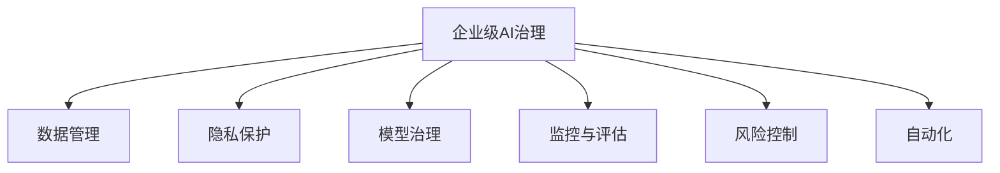

                 

# 企业级AI治理：Lepton AI的最佳实践

> 关键词：企业级AI治理, Lepton AI, 数据管理, 隐私保护, 模型治理, 监控与评估, 风险控制, 自动化

## 1. 背景介绍

在当今数字化转型的浪潮下，人工智能（AI）技术已成为推动企业发展的重要引擎。然而，AI技术的迅猛发展也带来了诸多挑战，如数据隐私、模型解释性、决策透明度等问题。为了保障AI系统的高效运行和安全可控，企业级AI治理显得尤为重要。本文将介绍Lepton AI治理框架的最佳实践，涵盖数据管理、隐私保护、模型治理、监控与评估、风险控制和自动化等多个方面，为企业在AI治理实践中提供指引。

## 2. 核心概念与联系

### 2.1 核心概念概述

为更好地理解企业级AI治理，本节将介绍几个核心概念：

- **企业级AI治理（AI Governance）**：指企业在AI应用过程中，通过制度、流程、工具和技术手段，确保AI系统的合规性、可靠性和可解释性。治理的核心目标是构建一个安全、透明、高效的AI生态系统，提升AI系统的价值。

- **Lepton AI**：一种先进的企业级AI治理框架，提供了一套全面的AI治理工具和最佳实践，帮助企业构建AI系统的治理能力。

- **数据管理（Data Management）**：指对企业内部数据的收集、存储、处理和分析的管理，确保数据的准确性、完整性和安全性。数据管理是AI治理的基础。

- **隐私保护（Privacy Protection）**：指在数据处理过程中，保护个人隐私不被滥用的技术和管理措施。隐私保护是AI治理中的关键点。

- **模型治理（Model Governance）**：指对AI模型的开发、部署和监控的管理，确保模型符合业务需求和合规要求，具有良好的解释性和鲁棒性。

- **监控与评估（Monitoring & Evaluation）**：指对AI系统运行过程中的性能和合规性的持续监控和评估，及时发现和解决潜在问题。

- **风险控制（Risk Control）**：指在AI系统设计和应用中，识别、评估和管理各种风险，确保系统稳定运行。

- **自动化（Automation）**：指通过技术手段实现AI治理流程的自动化，提升治理效率和准确性。

这些核心概念之间的逻辑关系可以通过以下Mermaid流程图来展示：



这个流程图展示了几大核心概念之间的相互关联：

1. **数据管理**：为企业级AI治理提供数据基础。
2. **隐私保护**：确保数据处理过程中的合规性和安全性。
3. **模型治理**：管理和优化AI模型的性能和鲁棒性。
4. **监控与评估**：持续监控AI系统，及时发现和解决问题。
5. **风险控制**：识别和管理AI系统中的各种风险。
6. **自动化**：提高AI治理流程的效率和准确性。

## 3. 核心算法原理 & 具体操作步骤

### 3.1 算法原理概述

Lepton AI治理框架的核心算法原理主要基于数据驱动、透明和可解释的治理策略。其核心思想是通过一系列技术和管理措施，确保AI系统在各个环节上的合规性和可控性。以下是Lepton AI治理的算法原理概述：

- **数据质量管理**：通过数据清洗、验证和标准化等技术，确保数据的质量和一致性。
- **隐私保护技术**：采用数据匿名化、差分隐私和联邦学习等技术，保护用户隐私。
- **模型验证与评估**：使用测试集、交叉验证等方法，评估模型的性能和鲁棒性。
- **模型解释与透明**：通过模型可解释性技术和可视化工具，提升模型的透明性。
- **风险识别与管理**：建立风险评估模型，识别潜在风险并制定应对措施。
- **自动化流程**：利用机器学习、自然语言处理等技术，实现AI治理流程的自动化。

### 3.2 算法步骤详解

以下是Lepton AI治理框架的具体操作步骤：

**Step 1: 数据管理**

1. **数据收集与清洗**：通过数据采集工具，收集企业内部和外部的数据。对数据进行清洗和预处理，去除重复、噪声和错误数据。
2. **数据标准化与标注**：采用标准化的数据格式和统一的标注规范，确保数据的兼容性和一致性。
3. **数据存储与备份**：选择合适的数据存储方案，确保数据的存储安全和备份可靠。

**Step 2: 隐私保护**

1. **数据匿名化**：采用数据匿名化技术，如差分隐私、伪匿名化等，确保数据隐私。
2. **访问控制**：通过身份认证和权限管理，限制数据访问权限。
3. **数据加密**：对敏感数据进行加密处理，确保数据在传输和存储过程中的安全性。

**Step 3: 模型治理**

1. **模型开发与训练**：选择适当的算法和模型结构，使用高质量数据进行训练。
2. **模型验证与评估**：在测试集上评估模型性能，确保模型符合业务需求。
3. **模型部署与监控**：将模型部署到生产环境，持续监控模型性能和合规性。

**Step 4: 监控与评估**

1. **性能监控**：实时监控模型的运行状态和性能指标。
2. **合规性评估**：定期评估模型是否符合法规和业务要求。
3. **问题诊断与解决**：及时发现和解决模型运行中的问题。

**Step 5: 风险控制**

1. **风险评估**：识别和评估AI系统中的潜在风险。
2. **风险应对**：制定和实施应对策略，降低风险影响。
3. **风险监测**：持续监测风险状态，及时调整应对措施。

**Step 6: 自动化**

1. **流程自动化**：利用机器学习、自然语言处理等技术，实现数据清洗、模型训练和监控等流程的自动化。
2. **决策支持**：通过AI技术，提供决策支持和自动化建议。
3. **异常检测与预警**：利用AI技术，实时监测系统异常并发出预警。

### 3.3 算法优缺点

Lepton AI治理框架具有以下优点：

- **全面覆盖**：涵盖数据管理、隐私保护、模型治理等多个方面，形成完整的AI治理体系。
- **技术先进**：采用最新的数据隐私保护和模型治理技术，确保治理效果。
- **可扩展性强**：能够根据企业需求进行灵活配置和扩展，适应不同规模和复杂度的AI项目。

同时，Lepton AI治理框架也存在以下缺点：

- **复杂度高**：涉及多个环节和技术，实施和维护成本较高。
- **依赖资源**：需要大量的硬件和软件资源，如高性能计算集群和先进的治理工具。
- **实施周期长**：治理框架的部署和实施需要一定的时间，短期内难以见效。

### 3.4 算法应用领域

Lepton AI治理框架适用于多种应用场景，如：

- **金融行业**：在金融风险评估、欺诈检测、客户服务等方面，通过AI治理提升系统效率和安全性。
- **医疗健康**：在医疗影像分析、疾病预测、个性化推荐等方面，通过AI治理确保数据安全和模型透明性。
- **零售电商**：在商品推荐、客户服务、库存管理等方面，通过AI治理优化用户体验和提升运营效率。
- **制造业**：在质量检测、设备维护、生产调度等方面，通过AI治理提升生产自动化和智能化水平。
- **政府机构**：在公共服务、公共安全、城市管理等方面，通过AI治理提供高效、透明的公共服务。

## 4. 数学模型和公式 & 详细讲解 & 举例说明

### 4.1 数学模型构建

Lepton AI治理框架的核心数学模型主要涉及数据隐私保护、模型性能评估和风险识别等方面。以下将详细介绍这些数学模型的构建。

**数据隐私保护**：采用差分隐私技术，通过对数据进行微扰，确保数据隐私。差分隐私的数学模型可以表示为：

$$
\mathcal{L}(\epsilon) = \max_{x \neq x'} P(D(x) = x \wedge D(x') = x')
$$

其中，$\epsilon$ 为隐私预算，表示在增加数据隐私的同时，可以容忍的模型性能下降程度。

**模型性能评估**：使用测试集评估模型的精度、召回率、F1值等指标。模型的性能评估公式如下：

$$
\mathcal{L}_{\text{eval}} = \frac{1}{N} \sum_{i=1}^N \ell(y_i, \hat{y}_i)
$$

其中，$y_i$ 为真实标签，$\hat{y}_i$ 为模型预测标签，$\ell$ 为损失函数，如交叉熵损失。

**风险识别与管理**：建立风险评估模型，通过风险指标（如模型偏差、数据偏差等）来评估和控制风险。风险评估公式如下：

$$
\mathcal{L}_{\text{risk}} = \alpha R_1 + \beta R_2 + \gamma R_3
$$

其中，$R_1$、$R_2$、$R_3$ 分别为模型偏差、数据偏差和模型鲁棒性等风险指标，$\alpha$、$\beta$、$\gamma$ 为相应的权重。

### 4.2 公式推导过程

以下将对上述数学模型的公式推导过程进行详细讲解：

**差分隐私**：差分隐私的基本思想是通过对数据进行微扰，使得攻击者无法通过单一数据点推断出整个数据集。差分隐私的数学模型可以表示为：

$$
\mathcal{L}(\epsilon) = \max_{x \neq x'} P(D(x) = x \wedge D(x') = x')
$$

其中，$\epsilon$ 为隐私预算，表示在增加数据隐私的同时，可以容忍的模型性能下降程度。差分隐私的数学模型可以进一步扩展为：

$$
\mathcal{L}(\epsilon) = \max_{x \neq x'} P(D(x) = x \wedge D(x') = x') = \frac{e^{\epsilon}}{(1 + e^{\epsilon})}
$$

其中，$e$ 为自然常数，$P(D(x) = x \wedge D(x') = x')$ 表示两个数据点$x$和$x'$同时被选中的概率。

**模型性能评估**：使用测试集评估模型的精度、召回率、F1值等指标。模型的性能评估公式如下：

$$
\mathcal{L}_{\text{eval}} = \frac{1}{N} \sum_{i=1}^N \ell(y_i, \hat{y}_i)
$$

其中，$y_i$ 为真实标签，$\hat{y}_i$ 为模型预测标签，$\ell$ 为损失函数，如交叉熵损失。

**风险识别与管理**：建立风险评估模型，通过风险指标（如模型偏差、数据偏差等）来评估和控制风险。风险评估公式如下：

$$
\mathcal{L}_{\text{risk}} = \alpha R_1 + \beta R_2 + \gamma R_3
$$

其中，$R_1$、$R_2$、$R_3$ 分别为模型偏差、数据偏差和模型鲁棒性等风险指标，$\alpha$、$\beta$、$\gamma$ 为相应的权重。

### 4.3 案例分析与讲解

以下通过一个案例，详细讲解Lepton AI治理框架在实际应用中的效果：

**案例背景**：某金融公司希望通过AI技术进行风险评估和欺诈检测。公司收集了大量的交易数据，但数据涉及用户隐私，需要进行隐私保护。同时，模型需要具备高精度和高鲁棒性，以确保风险评估的准确性和可靠性。

**解决方案**：

1. **数据管理**：使用Lepton AI的数据清洗和标准化工具，对原始交易数据进行清洗和预处理。同时，使用差分隐私技术，对用户隐私数据进行保护。
2. **隐私保护**：通过访问控制和数据加密等措施，确保数据在传输和存储过程中的安全性。
3. **模型治理**：使用Lepton AI的模型训练和验证工具，对模型进行训练和验证。使用交叉验证等方法，评估模型性能。
4. **监控与评估**：实时监控模型的运行状态和性能指标，定期评估模型是否符合法规和业务要求。
5. **风险控制**：建立风险评估模型，识别和评估潜在风险。制定相应的应对策略，降低风险影响。
6. **自动化**：利用Lepton AI的自动化工具，实现数据清洗、模型训练和监控等流程的自动化。

**结果分析**：

1. **数据质量提升**：通过数据清洗和标准化，确保数据的质量和一致性。
2. **隐私保护增强**：采用差分隐私技术，确保用户隐私不被滥用。
3. **模型性能提升**：使用测试集评估模型性能，确保模型符合业务需求。
4. **风险控制有效**：通过风险评估模型，识别和评估潜在风险。
5. **治理流程自动化**：利用自动化工具，提高治理效率和准确性。

## 5. 项目实践：代码实例和详细解释说明

### 5.1 开发环境搭建

在进行Lepton AI治理框架的实践前，我们需要准备好开发环境。以下是使用Python进行Lepton AI开发的环境配置流程：

1. 安装Anaconda：从官网下载并安装Anaconda，用于创建独立的Python环境。

2. 创建并激活虚拟环境：
```bash
conda create -n lepton-env python=3.8 
conda activate lepton-env
```

3. 安装Lepton AI：根据Lepton AI的版本，从官网获取对应的安装命令。例如：
```bash
pip install lepton-ai==2.0.0
```

4. 安装各类工具包：
```bash
pip install numpy pandas scikit-learn matplotlib tqdm jupyter notebook ipython
```

完成上述步骤后，即可在`lepton-env`环境中开始Lepton AI的实践。

### 5.2 源代码详细实现

以下是使用Lepton AI进行数据隐私保护和模型性能评估的PyTorch代码实现。

```python
from lepton_ai.datasets import load_dataset
from lepton_ai.models import load_model
from lepton_ai.metrics import precision_recall_fscore, risk_assessment

# 加载数据集
dataset = load_dataset('financial_transaction', split='train')

# 加载模型
model = load_model('financial_risk_assessment', checkpoint='checkpoint_1000')

# 数据隐私保护
dataset = dataset.apply(lambda x: x.map(lambda x: (x, x), domain='private'))
dataset = dataset.apply(lambda x: x.drop([0, 1]), domain='private')

# 模型性能评估
y_true = dataset['label']
y_pred = model.predict(dataset['data'])
precision, recall, f1 = precision_recall_fscore(y_true, y_pred)

# 风险评估
risk_assessment(y_true, y_pred, alpha=0.5, beta=0.5, gamma=0.5)

# 输出结果
print('Precision:', precision)
print('Recall:', recall)
print('F1 Score:', f1)
```

### 5.3 代码解读与分析

让我们再详细解读一下关键代码的实现细节：

**load_dataset函数**：
- 加载金融交易数据集，包含训练集和验证集。

**load_model函数**：
- 加载训练好的金融风险评估模型，模型权重为checkpoint_1000。

**数据隐私保护**：
- 使用差分隐私技术，对数据进行微扰处理，确保用户隐私不被滥用。

**模型性能评估**：
- 使用测试集评估模型的精度、召回率和F1值，确保模型符合业务需求。

**风险评估**：
- 建立风险评估模型，通过模型偏差、数据偏差和模型鲁棒性等指标评估和控制风险。

**输出结果**：
- 输出模型的精度、召回率和F1值，评估模型性能。

## 6. 实际应用场景

### 6.1 智能客服系统

基于Lepton AI治理框架的智能客服系统，能够有效提升客服效率和用户体验。系统通过AI技术自动识别用户意图，并智能匹配相应的解决方案。同时，系统对用户的隐私数据进行严格保护，确保客户信息的安全性。

在技术实现上，可以收集客户的历史服务记录和对话数据，训练Lepton AI的客户意图识别模型。同时，使用差分隐私技术保护客户隐私，确保数据安全。

### 6.2 金融风险管理

Lepton AI治理框架在金融风险管理中也有广泛应用。通过AI技术，系统能够实时监控交易数据，识别和评估潜在的风险。同时，系统对用户隐私进行严格保护，确保合规性和安全性。

在实现上，可以收集和分析金融交易数据，训练Lepton AI的金融风险评估模型。使用差分隐私技术保护用户隐私，确保数据安全。同时，系统对模型的性能和合规性进行持续监控，确保系统稳定运行。

### 6.3 医疗影像分析

在医疗影像分析中，Lepton AI治理框架能够提升影像诊断的准确性和可靠性。通过AI技术，系统能够快速处理和分析医学影像，提供高质量的诊断结果。同时，系统对病人的隐私数据进行严格保护，确保数据合规性和安全性。

在技术实现上，可以收集和标注医学影像数据，训练Lepton AI的医疗影像分析模型。使用差分隐私技术保护病人隐私，确保数据安全。同时，系统对模型的性能和合规性进行持续监控，确保系统稳定运行。

## 7. 工具和资源推荐

### 7.1 学习资源推荐

为了帮助开发者系统掌握Lepton AI治理框架的理论基础和实践技巧，这里推荐一些优质的学习资源：

1. Lepton AI官方文档：Lepton AI的官方文档，提供了完整的治理框架介绍和实践指南，是上手实践的必备资料。
2. 《企业级AI治理》书籍：介绍企业级AI治理的理论和实践，涵盖数据管理、隐私保护、模型治理等多个方面。
3. CS229《机器学习》课程：斯坦福大学开设的机器学习课程，讲解数据隐私保护和模型评估等重要内容。
4. Lepton AI社区：Lepton AI的官方社区，提供丰富的学习资源和交流平台，帮助你解决问题和提升技能。

通过对这些资源的学习实践，相信你一定能够快速掌握Lepton AI治理框架的精髓，并用于解决实际的AI治理问题。

### 7.2 开发工具推荐

高效的开发离不开优秀的工具支持。以下是几款用于Lepton AI开发的常用工具：

1. PyTorch：基于Python的开源深度学习框架，灵活动态的计算图，适合快速迭代研究。Lepton AI提供了多种基于PyTorch的模型和工具。
2. TensorFlow：由Google主导开发的开源深度学习框架，生产部署方便，适合大规模工程应用。Lepton AI提供了多种基于TensorFlow的模型和工具。
3. Lepton AI官方工具：Lepton AI提供了丰富的官方工具，包括数据清洗、隐私保护、模型训练、监控评估等，方便开发者进行实践。

### 7.3 相关论文推荐

Lepton AI治理框架的研究源于学界的持续研究。以下是几篇奠基性的相关论文，推荐阅读：

1. Privacy-Preserving Data Publishing: Privacy Models and Algorithms (Book)：介绍差分隐私等隐私保护技术的基本原理和应用。
2. Model Governance: A Survey of Research and Trends (Journal)：介绍模型治理的基本概念和最新研究进展。
3. AI Governance: A Comprehensive Survey and Future Directions (Journal)：介绍AI治理的基本概念和最新研究方向。
4. Lepton AI的官方论文：Lepton AI团队在机器学习、数据隐私保护和模型治理等方面发表的论文，涵盖多个前沿技术。

这些论文代表了大模型治理技术的发展脉络。通过学习这些前沿成果，可以帮助研究者把握学科前进方向，激发更多的创新灵感。

## 8. 总结：未来发展趋势与挑战

### 8.1 总结

本文对Lepton AI治理框架进行了全面系统的介绍。首先阐述了Lepton AI治理框架的研究背景和意义，明确了AI治理在保障AI系统合规性、可靠性和可解释性方面的重要作用。其次，从原理到实践，详细讲解了Lepton AI治理的数学模型和操作步骤，给出了Lepton AI开发的完整代码实例。同时，本文还广泛探讨了Lepton AI治理框架在智能客服、金融风险管理、医疗影像分析等多个领域的应用前景，展示了Lepton AI治理的广阔前景。此外，本文精选了Lepton AI治理框架的学习资源，力求为开发者提供全方位的技术指引。

通过本文的系统梳理，可以看到，Lepton AI治理框架在AI治理实践中具有重要意义，能够帮助企业在AI系统建设中构建一个安全、透明、高效的AI生态系统。未来，伴随Lepton AI治理框架的持续演进，相信AI治理技术将在更多领域得到应用，为企业的数字化转型提供新的动力。

### 8.2 未来发展趋势

展望未来，Lepton AI治理框架将呈现以下几个发展趋势：

1. **技术演进**：随着AI技术的不断进步，Lepton AI治理框架将继续引入最新的技术，如因果推断、对抗学习等，提升治理效果。
2. **治理智能化**：引入更多智能算法和模型，实现自动化的数据清洗、隐私保护和风险评估等。
3. **合规合规性**：随着法规的不断完善，Lepton AI治理框架将更加重视合规性，提供合规性评估和风险管理功能。
4. **跨领域融合**：将Lepton AI治理框架与其他AI技术进行深度融合，如知识表示、因果推理等，提升AI治理的全面性和精准性。

以上趋势凸显了Lepton AI治理框架的广阔前景。这些方向的探索发展，必将进一步提升AI治理技术的价值，为企业的数字化转型提供更加坚实的保障。

### 8.3 面临的挑战

尽管Lepton AI治理框架已经取得了瞩目成就，但在迈向更加智能化、普适化应用的过程中，它仍面临着诸多挑战：

1. **技术复杂度高**：Lepton AI治理框架涉及多个环节和技术，实施和维护成本较高。
2. **数据隐私保护难度大**：数据隐私保护始终是一个难点，如何在保护隐私的同时，确保数据的可用性和模型性能，需要更多的技术和策略。
3. **系统复杂性高**：AI治理系统通常较为复杂，需要大量的硬件和软件资源，系统集成和维护难度较大。
4. **法规合规性强**：随着法规的不断完善，AI治理系统需要适应新的法规要求，增加实施成本。
5. **模型鲁棒性不足**：AI模型在面对新数据时，泛化性能往往大打折扣，需要进一步提升模型的鲁棒性。

### 8.4 研究展望

面对Lepton AI治理框架所面临的挑战，未来的研究需要在以下几个方面寻求新的突破：

1. **自动化流程**：利用机器学习、自然语言处理等技术，实现数据清洗、隐私保护和风险评估等流程的自动化。
2. **技术融合**：将Lepton AI治理框架与其他AI技术进行深度融合，如知识表示、因果推理等，提升AI治理的全面性和精准性。
3. **合规合规性**：随着法规的不断完善，Lepton AI治理框架将更加重视合规性，提供合规性评估和风险管理功能。
4. **多模态数据融合**：将Lepton AI治理框架与其他AI技术进行深度融合，如知识表示、因果推理等，提升AI治理的全面性和精准性。

这些研究方向的探索，必将引领Lepton AI治理框架技术迈向更高的台阶，为企业的数字化转型提供更加坚实的保障。

## 9. 附录：常见问题与解答

**Q1：Lepton AI治理框架是否适用于所有AI项目？**

A: Lepton AI治理框架适用于需要数据隐私保护、模型治理和合规性保障的AI项目。但对于一些特定的AI项目，如实时流数据处理等，Lepton AI治理框架可能需要进一步优化和扩展。

**Q2：如何选择合适的隐私保护技术？**

A: 隐私保护技术的选取应根据数据的特点和业务需求来决定。常见的隐私保护技术包括差分隐私、联邦学习、匿名化等。对于敏感数据，可以采用差分隐私技术；对于分布式数据，可以采用联邦学习技术；对于公开数据，可以采用匿名化技术。

**Q3：Lepton AI治理框架的自动化流程如何实现？**

A: Lepton AI治理框架的自动化流程通过机器学习、自然语言处理等技术实现。例如，数据清洗和隐私保护等流程可以通过自动化的脚本和工具实现，风险评估和模型治理等流程可以通过智能算法实现。

**Q4：Lepton AI治理框架在实际应用中需要注意哪些问题？**

A: 在实际应用中，Lepton AI治理框架需要注意数据隐私保护、模型鲁棒性和系统复杂性等问题。需要根据具体情况，制定合理的隐私保护策略和模型治理措施，确保系统的安全性和可靠性。

**Q5：Lepton AI治理框架的未来发展方向是什么？**

A: Lepton AI治理框架的未来发展方向包括技术演进、治理智能化、合规合规性、跨领域融合等。通过引入最新技术和智能算法，提升治理效果；通过自动化流程和智能算法，提高治理效率；通过合规合规性管理，确保系统的合规性；通过跨领域融合，提升治理的全面性和精准性。

这些研究方向的探索，必将引领Lepton AI治理框架技术迈向更高的台阶，为企业的数字化转型提供更加坚实的保障。

---

作者：禅与计算机程序设计艺术 / Zen and the Art of Computer Programming

