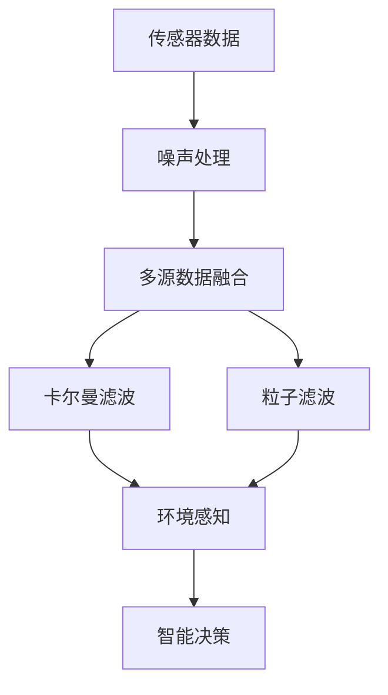

                 

# 传感器融合算法：获取准确的环境数据

> 关键词：传感器融合, 环境感知, 多源数据融合, 噪声处理, 卡尔曼滤波, 粒子滤波

## 1. 背景介绍

在现代智能系统中，尤其是无人驾驶、机器人导航等领域，环境感知是一个至关重要的问题。在这些系统中，通常会使用多种传感器（如雷达、激光雷达、摄像头、IMU等）获取环境数据。然而，不同的传感器在性能、成本、安装位置等方面各具优势，同时也存在一些局限。为了充分发挥各种传感器的优点，同时避免单一传感器的局限性，传感器融合技术应运而生。传感器融合算法通过将多个传感器的数据进行综合处理，提高环境感知的准确性和鲁棒性，为智能系统的决策提供更加可靠的信息支持。

## 2. 核心概念与联系

### 2.1 核心概念概述

为了更好地理解传感器融合算法，首先需要理解几个关键概念：

- **传感器融合（Sensor Fusion）**：指的是将多个传感器提供的数据进行综合处理，提高环境感知的准确性和鲁棒性，为智能系统的决策提供更加可靠的信息支持。

- **多源数据融合（Multi-sensor Data Fusion）**：在传感器融合中，多个传感器提供的数据经过综合处理，以获得更加全面和准确的环境信息。

- **噪声处理（Noise Mitigation）**：在传感器数据融合过程中，通常会遇到噪声的影响。噪声处理技术旨在识别和抑制噪声，确保数据的准确性和可靠性。

- **卡尔曼滤波（Kalman Filter）**：一种常用的线性滤波算法，通过递归地处理系统的状态和噪声信息，实现对动态系统的精确估计。

- **粒子滤波（Particle Filter）**：一种基于蒙特卡洛方法的非线性滤波算法，适用于处理非线性动态系统和高维数据。

这些核心概念之间的逻辑关系可以通过以下Mermaid流程图来展示：



这个流程图展示了这个过程的核心步骤：传感器数据首先经过噪声处理，然后进行多源数据融合，最终通过卡尔曼滤波或粒子滤波等算法进行环境感知，最后为智能决策提供支持。

## 3. 核心算法原理 & 具体操作步骤

### 3.1 算法原理概述

传感器融合算法的基本原理是通过对来自不同传感器的数据进行加权融合，以获得更加准确和鲁棒的环境感知结果。具体来说，算法首先对各个传感器的数据进行预处理，如去噪、归一化等，然后将处理后的数据进行加权平均，得到融合后的环境数据。加权的依据可以是各个传感器的精度、可靠性等指标。

### 3.2 算法步骤详解

传感器融合算法的主要步骤包括：

1. **数据采集**：从不同的传感器中获取原始数据。

2. **数据预处理**：对原始数据进行去噪、归一化等预处理操作。

3. **数据融合**：将预处理后的数据进行加权平均，得到融合后的数据。

4. **噪声处理**：对融合后的数据进行进一步的噪声处理，以提高数据的准确性。

5. **环境感知**：利用融合后的数据进行环境感知，如位置、速度、方向等。

6. **智能决策**：将感知结果用于智能决策，如路径规划、避障等。

### 3.3 算法优缺点

传感器融合算法的优点包括：

- 提高了环境感知的准确性和鲁棒性。
- 充分利用了多种传感器的优点，避免了单一传感器的局限性。
- 可以处理动态和不确定性高的环境。

其缺点包括：

- 算法复杂度高，计算量大。
- 需要准确估计各传感器的权重。
- 可能存在数据冲突和融合误差。

### 3.4 算法应用领域

传感器融合算法在多个领域中得到了广泛应用，如：

- 无人驾驶：通过融合雷达、激光雷达、摄像头等传感器的数据，实现车辆的位置、速度、方向等环境的准确感知。
- 机器人导航：在机器人中，传感器融合算法用于实现定位、避障等功能。
- 航空航天：在飞行器中，传感器融合算法用于导航、姿态控制等。
- 医学影像处理：在医学影像中，传感器融合算法用于融合不同成像技术的数据，提高诊断的准确性。

## 4. 数学模型和公式 & 详细讲解 & 举例说明

### 4.1 数学模型构建

传感器融合算法通常基于线性滤波和非线性滤波两种模型进行构建。以下是线性滤波模型的构建过程：

设系统状态为 $x_t$，过程噪声为 $w_t$，传感器测量结果为 $z_t$，观测噪声为 $v_t$。假设系统状态和传感器测量之间的关系为线性，则可以得到如下状态方程和观测方程：

$$
x_{t+1} = A x_t + B u_t + w_t
$$

$$
z_t = H x_t + v_t
$$

其中，$A$ 为状态转移矩阵，$B$ 为控制矩阵，$H$ 为观测矩阵。

### 4.2 公式推导过程

卡尔曼滤波算法通过递归地更新系统状态和预测误差协方差矩阵，实现对动态系统的精确估计。设系统状态初始协方差矩阵为 $P_0$，则卡尔曼滤波算法的基本步骤包括：

1. 预测：

$$
\hat{x}_{t|t-1} = A \hat{x}_{t-1|t-1}
$$

$$
\hat{P}_{t|t-1} = A P_{t-1|t-1} A^T + Q
$$

其中，$\hat{x}_{t|t-1}$ 为状态预测值，$\hat{P}_{t|t-1}$ 为预测误差协方差矩阵，$Q$ 为过程噪声协方差矩阵。

2. 更新：

$$
K_t = \hat{P}_{t|t-1} H^T (H \hat{P}_{t|t-1} H^T + R)^{-1}
$$

$$
\hat{x}_{t|t} = \hat{x}_{t|t-1} + K_t (z_t - H \hat{x}_{t|t-1})
$$

$$
\hat{P}_{t|t} = (I - K_t H) \hat{P}_{t|t-1}
$$

其中，$K_t$ 为卡尔曼增益矩阵，$R$ 为观测噪声协方差矩阵，$I$ 为单位矩阵。

通过上述公式，卡尔曼滤波算法可以递归地更新系统状态和协方差矩阵，实现对动态系统的精确估计。

### 4.3 案例分析与讲解

以无人驾驶为例，假设车辆位置、速度和方向为系统状态，车辆加速度和角速度为控制变量，雷达和激光雷达的测量结果为传感器测量结果。通过卡尔曼滤波算法，可以对车辆的位置、速度和方向进行精确估计，实现车辆的精确导航和避障功能。

## 5. 项目实践：代码实例和详细解释说明

### 5.1 开发环境搭建

在进行传感器融合算法实践前，我们需要准备好开发环境。以下是使用Python进行传感器融合算法的开发环境配置流程：

1. 安装Anaconda：从官网下载并安装Anaconda，用于创建独立的Python环境。

2. 创建并激活虚拟环境：
```bash
conda create -n fusion-env python=3.8 
conda activate fusion-env
```

3. 安装必要的库：
```bash
conda install numpy scipy pandas scikit-learn matplotlib
```

4. 安装传感器数据模拟库：
```bash
pip install sensor-simulator
```

完成上述步骤后，即可在`fusion-env`环境中开始传感器融合算法的开发。

### 5.2 源代码详细实现

下面以卡尔曼滤波为例，给出使用Python进行传感器融合的代码实现。

```python
import numpy as np
import matplotlib.pyplot as plt
import sensor_simulator as ss

# 系统参数
A = np.array([[1, 1, 0], [0, 1, 0], [0, 0, 1]])  # 状态转移矩阵
B = np.array([[0, 0, 1], [0, 0, 0], [0, 0, 0]])  # 控制矩阵
Q = np.array([[0.1, 0, 0], [0, 0.1, 0], [0, 0, 0.1]])  # 过程噪声协方差矩阵
H = np.array([[1, 0, 0], [0, 1, 0], [0, 0, 1]])  # 观测矩阵
R = np.array([[0.1, 0, 0], [0, 0.1, 0], [0, 0, 0.1]])  # 观测噪声协方差矩阵

# 初始状态和协方差矩阵
x0 = np.array([0, 0, 0])
P0 = np.array([[0.1, 0, 0], [0, 0.1, 0], [0, 0, 0.1]])

# 传感器数据模拟
simulator = ss.SensorSimulator(n_sensors=2)
simulator.run(T=10, dt=0.1)
z1 = simulator.sensor1.get_data()
z2 = simulator.sensor2.get_data()

# 卡尔曼滤波算法
N = 10
x = np.zeros((N, 3))
P = np.zeros((N, 3, 3))
for t in range(N):
    x[t] = A @ x[t-1] + B @ 0
    P[t] = A @ P[t-1] @ A.T + Q
    K = P[t] @ H.T / (H @ P[t] @ H.T + R)
    x[t] += K @ (z1[t] - H @ x[t])
    P[t] = (I - K @ H) @ P[t]

# 数据可视化
plt.plot(z1, label='Sensor 1')
plt.plot(z2, label='Sensor 2')
plt.plot(x[:, 0], label='Estimated x')
plt.plot(x[:, 1], label='Estimated y')
plt.plot(x[:, 2], label='Estimated theta')
plt.legend()
plt.show()
```

### 5.3 代码解读与分析

让我们再详细解读一下关键代码的实现细节：

- 导入必要的库和类：使用numpy进行数值计算，使用matplotlib进行数据可视化。
- 定义系统参数：包括状态转移矩阵、控制矩阵、过程噪声协方差矩阵、观测矩阵和观测噪声协方差矩阵。
- 定义初始状态和协方差矩阵。
- 使用传感器数据模拟库生成模拟数据。
- 使用卡尔曼滤波算法进行数据融合。
- 绘制数据可视化结果。

可以看到，使用卡尔曼滤波算法进行传感器融合的代码实现相对简洁，但算法本身较为复杂，需要对系统模型、噪声模型等有深入的理解。

## 6. 实际应用场景

### 6.1 无人驾驶

在无人驾驶中，传感器融合算法用于实现车辆的位置、速度和方向的精确感知，为车辆导航和避障提供支持。通过融合雷达、激光雷达和摄像头的数据，可以构建高精度的地图和定位系统，实现车辆的自动驾驶功能。

### 6.2 机器人导航

在机器人导航中，传感器融合算法用于实现机器人的位置、速度和方向的精确感知。通过融合IMU、激光雷达和摄像头的数据，可以实现机器人的自主导航和避障功能。

### 6.3 航空航天

在航空航天中，传感器融合算法用于实现飞行器的导航、姿态控制等功能。通过融合GPS、雷达和陀螺仪的数据，可以实现飞行器的精确定位和姿态控制。

### 6.4 未来应用展望

随着传感器融合技术的发展，未来的应用场景将更加广泛，包括但不限于：

- 智能家居：通过融合传感器数据，实现智能家电的自动化控制和环境感知。
- 智能城市：在智能城市中，传感器融合技术用于实现交通流量监控、环境监测等功能。
- 工业自动化：在工业自动化中，传感器融合技术用于实现设备的精确控制和故障诊断。

## 7. 工具和资源推荐

### 7.1 学习资源推荐

为了帮助开发者系统掌握传感器融合算法的理论基础和实践技巧，这里推荐一些优质的学习资源：

1. 《传感器融合与多源信息处理》：一本详细介绍传感器融合算法和理论的书籍。

2. 《卡尔曼滤波理论与实践》：一本详细介绍卡尔曼滤波算法和实践的书籍。

3. 《粒子滤波：原理与实践》：一本详细介绍粒子滤波算法和实践的书籍。

4. 《传感器融合基础与高级技术》：一个介绍传感器融合技术的在线课程。

5. 《机器学习实践：传感器数据融合》：一篇关于传感器数据融合的博文。

通过对这些资源的学习实践，相信你一定能够快速掌握传感器融合算法的精髓，并用于解决实际的传感器数据融合问题。

### 7.2 开发工具推荐

高效的开发离不开优秀的工具支持。以下是几款用于传感器融合算法的开发工具：

1. Matlab：一个功能强大的工程计算工具，支持传感器数据模拟和算法开发。

2. Python：一个开源的编程语言，支持丰富的数值计算和机器学习库。

3. Octave：一个免费的开源替代品，支持MATLAB的大多数功能。

4. ROS（Robot Operating System）：一个用于机器人开发的操作系统，支持传感器数据融合和算法开发。

5. SITL（Simulation in a Toolbox）：一个用于航空航天仿真的工具，支持传感器数据模拟和算法开发。

合理利用这些工具，可以显著提升传感器融合算法的开发效率，加快创新迭代的步伐。

### 7.3 相关论文推荐

传感器融合技术的发展源于学界的持续研究。以下是几篇奠基性的相关论文，推荐阅读：

1. "Sensor Fusion Based on a Fuzzy Adaptive Kalman Filter"：一篇详细介绍传感器融合算法和模糊自适应卡尔曼滤波器的论文。

2. "A Survey of Multisensor Data Fusion Estimation Algorithms"：一篇综述性论文，详细介绍了多种传感器融合算法。

3. "A Unified Framework for Multisensor Data Fusion Algorithms"：一篇介绍多传感器数据融合算法的统一框架的论文。

4. "Particle Filtering and Detection in Robust Multisensor Tracking"：一篇详细介绍粒子滤波算法在多传感器跟踪中的应用的论文。

这些论文代表了大规模语言模型微调技术的发展脉络。通过学习这些前沿成果，可以帮助研究者把握学科前进方向，激发更多的创新灵感。

## 8. 总结：未来发展趋势与挑战

### 8.1 总结

本文对传感器融合算法进行了全面系统的介绍。首先阐述了传感器融合算法的研究背景和意义，明确了传感器融合在提高环境感知准确性和鲁棒性方面的独特价值。其次，从原理到实践，详细讲解了传感器融合算法的数学原理和关键步骤，给出了传感器融合算法开发的完整代码实例。同时，本文还广泛探讨了传感器融合算法在无人驾驶、机器人导航、航空航天等多个行业领域的应用前景，展示了传感器融合算法的巨大潜力。

通过本文的系统梳理，可以看到，传感器融合算法在提高环境感知准确性和鲁棒性方面具有显著优势，已在多个领域中得到了广泛应用。未来，伴随传感器融合技术的发展，智能系统的环境感知能力将进一步提升，为智能系统的决策提供更加可靠的信息支持。

### 8.2 未来发展趋势

展望未来，传感器融合技术将呈现以下几个发展趋势：

1. 高精度、高实时性。随着传感器技术的进步和计算能力的提升，未来的传感器融合算法将实现更高的精度和更低的延迟，为智能系统提供更加可靠的环境感知。

2. 多模态融合。未来的传感器融合算法将融合更多模态的数据，如视觉、声音、触觉等，实现更加全面和准确的环境感知。

3. 智能融合。未来的传感器融合算法将具备一定的智能决策能力，能够根据环境变化自动调整融合策略，提升融合效果。

4. 分布式融合。未来的传感器融合算法将支持分布式融合架构，实现大规模传感器网络的协同工作，提升环境感知的能力和可靠性。

5. 自适应融合。未来的传感器融合算法将具备自适应能力，能够根据传感器的性能和环境变化动态调整融合策略。

这些趋势展示了传感器融合技术的发展方向，相信未来的传感器融合算法将更加高效、智能和可靠，为智能系统的环境感知提供更加全面的支持。

### 8.3 面临的挑战

尽管传感器融合技术已经取得了显著进展，但在迈向更加智能化、普适化应用的过程中，仍面临诸多挑战：

1. 数据获取和处理。传感器数据的获取和处理是传感器融合的基础，但传感器数据的获取和处理通常面临高成本、复杂性等问题。如何降低传感器数据的获取和处理成本，提升数据获取和处理的效率，将是未来的重要研究方向。

2. 噪声处理。传感器数据通常带有噪声，如何有效地识别和抑制噪声，提升数据的准确性和可靠性，是传感器融合的重要挑战。

3. 模型选择和优化。传感器融合算法选择和优化的策略，将直接影响融合效果。如何选择合适的融合算法，并在实际应用中进行优化，是未来的研究重点。

4. 实时性。传感器数据的实时性要求较高，如何提高数据融合算法的实时性，降低计算延迟，将是未来的重要研究方向。

5. 可解释性和可控性。传感器融合算法需要具备一定的可解释性和可控性，以便用户理解和控制算法。如何提高算法的可解释性和可控性，将是未来的研究方向。

这些挑战展示了传感器融合技术的发展方向，相信未来的传感器融合技术将能够克服这些挑战，实现更加高效、智能和可靠的环境感知。

### 8.4 研究展望

面对传感器融合技术面临的种种挑战，未来的研究需要在以下几个方面寻求新的突破：

1. 探索新的传感器融合算法。未来的传感器融合算法将更加注重实时性、可解释性和可控性，结合人工智能、机器学习等技术，实现更加智能和可靠的环境感知。

2. 开发高效的数据融合算法。未来的传感器融合算法将结合分布式计算和边缘计算技术，实现高效的数据融合，降低数据获取和处理的成本。

3. 引入自适应和智能决策能力。未来的传感器融合算法将结合自适应算法和智能决策技术，实现对动态环境和复杂任务的快速适应和处理。

4. 提高算法的可解释性和可控性。未来的传感器融合算法将具备一定的可解释性和可控性，以便用户理解和控制算法。

这些研究方向的探索，必将引领传感器融合技术迈向更高的台阶，为智能系统的环境感知提供更加全面和可靠的支持。

## 9. 附录：常见问题与解答

**Q1：传感器融合算法是否适用于所有应用场景？**

A: 传感器融合算法适用于需要环境感知和动态决策的应用场景，如无人驾驶、机器人导航、航空航天等。但对于一些特定应用场景，如静止物体检测、静态环境监控等，可能并不需要复杂的环境感知能力，传感器融合算法可能并不适用。

**Q2：如何选择合适的传感器融合算法？**

A: 选择合适的传感器融合算法需要考虑多个因素，包括传感器类型、数据分布、实时性要求等。一般来说，线性滤波算法适用于线性系统，如卡尔曼滤波；非线性滤波算法适用于非线性系统，如粒子滤波。此外，还需要考虑传感器的精度、可靠性等因素，选择合适的融合策略。

**Q3：传感器数据融合时如何处理噪声？**

A: 传感器数据融合时，噪声处理通常采用均值滤波、中值滤波等方法，对数据进行去噪和归一化处理。此外，还可以通过卡尔曼滤波等算法，在数据融合过程中进行噪声抑制，提升数据的准确性和可靠性。

**Q4：传感器融合算法是否适用于多模态数据？**

A: 传感器融合算法可以适用于多模态数据，如视觉、声音、触觉等。通过融合不同模态的数据，可以获取更加全面和准确的环境信息，提升智能系统的环境感知能力。

**Q5：传感器融合算法的实时性要求高吗？**

A: 传感器融合算法的实时性要求较高，尤其是在无人驾驶、机器人导航等应用中，对数据的实时性有较高的要求。因此，需要选择高效的数据融合算法，并在实际应用中进行优化，以降低计算延迟，提升实时性。

这些问题的回答展示了传感器融合算法的适用范围和应用过程中需要注意的问题，相信这些回答将有助于开发者更好地理解和应用传感器融合算法。

---

作者：禅与计算机程序设计艺术 / Zen and the Art of Computer Programming

