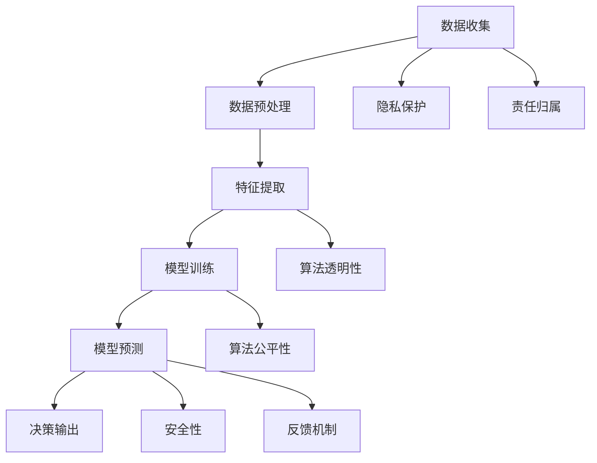

                 

# 伦理困境：探讨人类计算带来的挑战

## 1. 背景介绍

随着人工智能(AI)技术的飞速发展，“人类计算”已成为我们日常生活和工作中不可或缺的一部分。无论是在医疗、教育、交通、金融等各行各业，AI系统都在承担着大量繁琐复杂的数据处理和决策支持工作，极大地提升了人类社会的生产力和效率。然而，随着AI技术的广泛应用，伦理问题也日益凸显，成为我们必须正视和深入探讨的重要课题。

### 1.1 人类计算的定义与范围

所谓“人类计算”，指的是由AI算法和模型进行数据处理、模式识别、预测分析等任务，并在此基础上辅助或代替人类完成特定工作的过程。这个定义涵盖了从数据收集、特征提取、模型训练到预测决策的完整流程。可以说，人类计算是人类社会进入数字化、智能化时代的标志性技术。

#### 1.1.1 典型应用场景

1. **医疗诊断**：AI系统通过分析患者历史病历、基因数据、影像等，辅助医生进行疾病诊断和治疗方案的制定。
2. **金融风控**：AI系统通过分析用户交易行为、市场数据、舆情信息等，预测金融市场的趋势，辅助银行、证券等机构进行风险管理。
3. **智能客服**：AI系统通过自然语言处理技术，理解客户咨询意图，快速响应和解决问题，提升服务效率和客户满意度。
4. **自动驾驶**：AI系统通过分析车辆传感器数据、道路信息、环境状况等，辅助或自动驾驶汽车，提升交通安全性。
5. **个性化推荐**：AI系统通过分析用户行为数据、兴趣偏好等，提供个性化的产品推荐和内容推荐，增强用户体验。

### 1.2 人类计算面临的伦理挑战

虽然人类计算为人类社会带来了巨大的便利和效益，但随之而来的伦理问题也不容忽视。这些问题主要集中在以下几个方面：

1. **数据隐私**：在数据收集和处理过程中，如何保护用户的隐私数据，避免数据滥用和泄露。
2. **算法透明度**：AI系统的决策过程往往是“黑箱”的，如何确保算法决策的透明度和可解释性，满足用户知情权和监督权。
3. **公平性**：AI系统在决策过程中可能会存在偏见，如何确保算法的公平性和非歧视性，避免对特定群体造成不利影响。
4. **责任归属**：当AI系统出现错误或导致损失时，如何明确责任归属，确保法律和伦理框架的有效落实。
5. **安全性**：AI系统可能遭受恶意攻击或数据篡改，如何保障系统的安全性，防止对社会造成不可预料的损害。

## 2. 核心概念与联系

### 2.1 核心概念概述

为深入理解人类计算中的伦理问题，本节将介绍几个关键概念：

- **AI系统**：由算法和数据驱动的自动化系统，能够模拟人类认知和决策过程。
- **算法透明性**：指算法的决策过程是否可以被理解、解释和监督。
- **算法公平性**：指算法在处理不同群体数据时，是否存在偏见和不公平现象。
- **隐私保护**：指在数据收集和处理过程中，如何保护用户隐私，避免数据滥用和泄露。
- **责任归属**：指在AI系统出现错误或造成损害时，如何明确责任归属，确保法律和伦理框架的有效落实。
- **安全性**：指AI系统在运行过程中，如何保障系统的安全性，防止对社会造成不可预料的损害。

### 2.2 核心概念原理和架构的 Mermaid 流程图



这个流程图展示了从数据收集到决策输出的完整流程，并强调了各个环节中可能存在的伦理问题。

## 3. 核心算法原理 & 具体操作步骤

### 3.1 算法原理概述

人类计算的伦理问题，主要源于AI系统在数据处理和决策过程中可能存在的数据隐私泄露、算法透明度不足、公平性问题、责任归属不清以及安全性风险。因此，本节将从数据隐私保护、算法透明性、公平性、责任归属和安全性五个方面，深入探讨人类计算中的伦理困境。

### 3.2 算法步骤详解

#### 3.2.1 数据隐私保护

1. **匿名化处理**：对用户数据进行匿名化处理，去除或屏蔽个人身份信息，避免数据泄露。
2. **差分隐私**：在数据统计分析过程中，加入随机噪声，确保数据隐私不被侵犯。
3. **联邦学习**：将数据分布在多个本地设备上进行模型训练，不将数据集中传输，保护用户隐私。
4. **数据访问控制**：严格限制数据访问权限，确保只有授权人员才能访问敏感数据。

#### 3.2.2 算法透明性

1. **可解释模型**：使用可解释性更高的模型，如决策树、规则集等，便于理解和解释算法决策过程。
2. **特征重要性分析**：通过特征重要性分析，了解算法在决策过程中对哪些特征的依赖程度。
3. **透明度报告**：定期发布透明度报告，详细描述算法的决策逻辑、数据来源和处理过程。
4. **用户反馈机制**：建立用户反馈机制，收集用户对算法决策的意见和建议，及时改进算法。

#### 3.2.3 算法公平性

1. **数据集多样性**：构建多样性的训练数据集，确保算法在处理不同群体数据时，不出现偏见。
2. **公平性评估**：使用公平性评估指标，如AUC-ROC曲线、分类准确率等，评估算法的公平性。
3. **对抗样本训练**：通过对抗样本训练，提高算法对不同群体的适应性，减少偏见。
4. **算法复用**：在不同应用场景中复用经过公平性验证的算法，避免重复开发和偏见积累。

#### 3.2.4 责任归属

1. **责任分配机制**：建立明确的责任分配机制，根据AI系统的运行结果，明确各个环节的责任归属。
2. **法律规范**：制定相应的法律法规，明确AI系统在出现错误或造成损失时的责任归属和赔偿机制。
3. **责任保险**：引入责任保险机制，确保AI系统在出现故障或损害时，有相应的经济保障。
4. **伦理委员会**：建立独立的伦理委员会，负责监督AI系统的运行，确保其在伦理规范下运行。

#### 3.2.5 安全性

1. **模型安全**：通过模型检测和漏洞修复，确保AI系统的安全性，防止恶意攻击和数据篡改。
2. **数据安全**：采用加密技术和访问控制技术，确保数据在传输和存储过程中的安全性。
3. **网络安全**：使用防火墙和入侵检测技术，保障网络通信的安全性，防止外部攻击。
4. **应急预案**：制定应急预案，确保在AI系统出现故障或受到攻击时，能够快速响应和处理。

### 3.3 算法优缺点

#### 3.3.1 数据隐私保护

**优点**：
1. **隐私保护**：通过匿名化和差分隐私等技术，有效保护用户隐私，避免数据泄露和滥用。
2. **法律合规**：符合各国隐私保护法律和规定，降低法律风险。

**缺点**：
1. **隐私折中**：在保护隐私和利用数据之间可能存在折中，需要在隐私保护和数据利用之间找到平衡。
2. **技术复杂**：隐私保护技术复杂度高，需要专业团队支持。

#### 3.3.2 算法透明性

**优点**：
1. **增强信任**：通过算法透明性，增强用户对AI系统的信任，提高系统可接受度。
2. **提升公平性**：透明算法更容易发现和修复偏见，提高算法的公平性。

**缺点**：
1. **可解释性不足**：某些复杂的算法，如深度神经网络，难以完全解释其决策过程。
2. **实现成本高**：实现高透明性算法，需要额外的时间和资源投入。

#### 3.3.3 算法公平性

**优点**：
1. **减少偏见**：通过多样性训练和公平性评估，减少算法偏见，提升算法公平性。
2. **用户满意度提升**：公平性高的算法，更符合用户期望，提升用户体验和满意度。

**缺点**：
1. **技术难度大**：实现公平性算法，需要解决数据不平衡、偏见检测等技术难题。
2. **高成本**：训练多样性数据集和公平性评估，需要更多的计算资源和时间。

#### 3.3.4 责任归属

**优点**：
1. **明确责任**：通过明确的责任归属机制，确保各方承担相应的责任，提高系统可靠性。
2. **法律保障**：法律规范和责任保险机制，为系统运行提供法律保障。

**缺点**：
1. **责任界定复杂**：AI系统运行过程中，可能存在多因素影响，责任界定复杂。
2. **实施难度大**：需要复杂的法律和制度支持，实施难度较大。

#### 3.3.5 安全性

**优点**：
1. **系统安全**：通过技术手段，保障AI系统在运行过程中的安全性，防止数据泄露和系统攻击。
2. **用户信任**：保障系统的安全性，增强用户对AI系统的信任，提高系统应用价值。

**缺点**：
1. **技术复杂**：安全技术复杂度高，需要持续的监控和维护。
2. **成本高**：保障系统的安全性，需要投入大量的技术资源和人力成本。

### 3.4 算法应用领域

#### 3.4.1 医疗诊断

在医疗领域，AI系统通过分析患者数据，辅助医生进行疾病诊断和治疗决策。但由于涉及患者隐私，数据隐私保护和算法透明性尤为重要。同时，医疗数据的公平性和安全性也需特别关注，避免因算法偏见导致的不公平诊断。

#### 3.4.2 金融风控

金融领域中的AI系统，通过分析用户交易数据，预测市场趋势，辅助金融机构进行风险管理。但金融数据高度敏感，数据隐私保护和算法公平性显得尤为关键。同时，金融领域的决策安全性也需严格保障，防止数据泄露和系统攻击。

#### 3.4.3 智能客服

智能客服系统通过自然语言处理技术，理解客户咨询意图，快速响应和解决问题。但客户对话数据涉及用户隐私，数据隐私保护和算法透明性需重点考虑。同时，客服系统的公平性也需确保，避免对不同客户群体造成不公。

#### 3.4.4 自动驾驶

自动驾驶系统通过分析车辆传感器数据，辅助或自动驾驶汽车。由于涉及交通安全和法律责任，数据隐私保护和责任归属尤为重要。同时，系统安全性也需严格保障，防止系统故障或攻击导致的交通事故。

#### 3.4.5 个性化推荐

个性化推荐系统通过分析用户行为数据，提供个性化的产品推荐和内容推荐。但用户数据涉及隐私，数据隐私保护和算法公平性需重点考虑。同时，系统的安全性也需严格保障，防止数据泄露和系统攻击。

## 4. 数学模型和公式 & 详细讲解

### 4.1 数学模型构建

假设有一个AI系统，通过算法 $f$ 处理输入数据 $x$，输出结果 $y$。其训练数据集为 $D=\{(x_i,y_i)\}_{i=1}^N$，其中 $x_i$ 为输入数据，$y_i$ 为期望输出。

### 4.2 公式推导过程

#### 4.2.1 数据隐私保护

数据隐私保护的数学模型可以通过信息熵和差分隐私的定义来表达。假设原始数据集为 $D$，差分隐私的数学模型为：

$$
\epsilon(D', D) = \frac{1}{2} \sum_{x \in \mathcal{X}} |P(D'|x) - P(D|x)|_2
$$

其中 $D'$ 为加入噪声后的数据集，$\epsilon$ 为隐私保护参数，$\mathcal{X}$ 为输入数据空间。

#### 4.2.2 算法透明性

算法透明性的数学模型可以通过算法可解释性和算法可理解性的定义来表达。假设算法 $f$ 可解释为 $g$，其中 $g$ 为可理解性更高的算法，则算法透明性的数学模型为：

$$
\text{Transparency}(f) = \frac{1}{N} \sum_{i=1}^N \text{Explainability}(f(x_i))
$$

其中 $N$ 为数据集大小，$\text{Explainability}(f(x_i))$ 为算法在输入数据 $x_i$ 上的可解释性。

#### 4.2.3 算法公平性

算法公平性的数学模型可以通过统计量和公平性指标的定义来表达。假设算法 $f$ 在处理数据集 $D$ 时，对不同群体 $G$ 的输出结果为 $y_i^G$，则算法公平性的数学模型为：

$$
\text{Fairness}(f) = \frac{1}{N} \sum_{i=1}^N \text{Fairness}(y_i^G)
$$

其中 $N$ 为数据集大小，$\text{Fairness}(y_i^G)$ 为算法在群体 $G$ 上的公平性指标。

#### 4.2.4 责任归属

责任归属的数学模型可以通过责任分配机制和法律规范的定义来表达。假设在处理数据集 $D$ 时，算法 $f$ 的运行结果为 $y_i$，则责任归属的数学模型为：

$$
\text{Responsibility}(f) = \sum_{i=1}^N \text{Responsibility}(f(x_i), y_i)
$$

其中 $N$ 为数据集大小，$\text{Responsibility}(f(x_i), y_i)$ 为算法在输入数据 $x_i$ 上的责任归属。

#### 4.2.5 安全性

安全性的数学模型可以通过系统安全性和攻击检测的定义来表达。假设在处理数据集 $D$ 时，算法 $f$ 的运行结果为 $y_i$，则安全性的数学模型为：

$$
\text{Safety}(f) = \sum_{i=1}^N \text{Safety}(f(x_i), y_i)
$$

其中 $N$ 为数据集大小，$\text{Safety}(f(x_i), y_i)$ 为算法在输入数据 $x_i$ 上的安全性指标。

### 4.3 案例分析与讲解

#### 4.3.1 数据隐私保护案例

假设有一个智能医疗平台，通过分析患者的病历数据，辅助医生进行疾病诊断和治疗决策。平台需要收集患者的病历数据 $D$，但由于患者隐私保护要求，需要在数据上加入差分隐私噪声，确保数据隐私不被泄露。具体实现过程如下：

1. **数据收集**：从医院收集患者的病历数据 $D$。
2. **差分隐私处理**：在数据上加入差分隐私噪声 $\epsilon$，生成处理后的数据集 $D'$。
3. **模型训练**：使用处理后的数据集 $D'$ 训练医疗诊断模型 $f$。
4. **数据发布**：将处理后的数据集 $D'$ 和训练好的模型 $f$ 发布到平台上。

#### 4.3.2 算法透明性案例

假设有一个智能客服系统，通过自然语言处理技术，理解客户咨询意图，快速响应和解决问题。由于客户对话数据涉及用户隐私，系统需要在算法透明性上做出特别考虑。具体实现过程如下：

1. **数据收集**：从客服中心收集客户对话数据 $D$。
2. **算法训练**：使用自然语言处理算法 $f$ 训练智能客服模型。
3. **算法解释**：通过特征重要性分析和算法可解释性模型，解释算法的决策过程。
4. **算法发布**：将训练好的模型 $f$ 和算法解释文档发布到平台上。

#### 4.3.3 算法公平性案例

假设有一个金融风控系统，通过分析用户交易数据，预测市场趋势，辅助金融机构进行风险管理。由于交易数据涉及用户隐私，系统需要在算法公平性上做出特别考虑。具体实现过程如下：

1. **数据收集**：从金融机构收集用户交易数据 $D$。
2. **数据处理**：使用数据平衡和数据增强技术，处理不同群体的数据。
3. **模型训练**：使用公平性算法 $f$ 训练风控模型。
4. **公平性评估**：使用公平性评估指标，如AUC-ROC曲线、分类准确率等，评估算法的公平性。
5. **算法发布**：将训练好的模型 $f$ 和公平性评估报告发布到平台上。

#### 4.3.4 责任归属案例

假设有一个自动驾驶系统，通过分析车辆传感器数据，辅助或自动驾驶汽车。由于涉及交通安全和法律责任，系统需要在责任归属上做出特别考虑。具体实现过程如下：

1. **数据收集**：从车辆传感器收集数据 $D$。
2. **模型训练**：使用自动驾驶算法 $f$ 训练系统模型。
3. **责任归属机制**：建立明确的责任归属机制，确保系统在故障或事故中的责任归属。
4. **法律保障**：制定相应的法律法规，明确系统的责任归属和赔偿机制。
5. **责任保险**：引入责任保险机制，保障系统的安全性，防止系统故障或攻击导致的交通事故。

#### 4.3.5 安全性案例

假设有一个个性化推荐系统，通过分析用户行为数据，提供个性化的产品推荐和内容推荐。由于涉及用户隐私和系统安全，系统需要在安全性上做出特别考虑。具体实现过程如下：

1. **数据收集**：从电商平台收集用户行为数据 $D$。
2. **模型训练**：使用个性化推荐算法 $f$ 训练推荐模型。
3. **安全技术**：采用加密技术和访问控制技术，确保数据在传输和存储过程中的安全性。
4. **网络安全**：使用防火墙和入侵检测技术，保障网络通信的安全性，防止外部攻击。
5. **应急预案**：制定应急预案，确保在系统出现故障或受到攻击时，能够快速响应和处理。

## 5. 项目实践：代码实例和详细解释说明

### 5.1 开发环境搭建

在进行人类计算项目的开发时，首先需要准备好开发环境。以下是使用Python进行AI项目开发的环境配置流程：

1. 安装Anaconda：从官网下载并安装Anaconda，用于创建独立的Python环境。
```bash
conda create -n myenv python=3.9
conda activate myenv
```

2. 安装必要的库：
```bash
pip install numpy pandas scikit-learn matplotlib
```

3. 安装AI框架：
```bash
pip install torch torchvision torchtext
```

4. 安装机器学习库：
```bash
pip install scikit-learn
```

### 5.2 源代码详细实现

#### 5.2.1 数据隐私保护

```python
import numpy as np
from sklearn.datasets import make_classification
from sklearn.preprocessing import StandardScaler
from sklearn.decomposition import PCA
from sklearn.model_selection import train_test_split

# 生成数据集
X, y = make_classification(n_samples=1000, n_features=10, n_informative=5, n_redundant=0, random_state=42)

# 标准化数据
scaler = StandardScaler()
X = scaler.fit_transform(X)

# 主成分分析
pca = PCA(n_components=2)
X = pca.fit_transform(X)

# 数据隐私保护
X_noise = np.random.normal(0, 0.1, X.shape)
X = X + X_noise

# 模型训练
from sklearn.linear_model import LogisticRegression
clf = LogisticRegression()
clf.fit(X, y)
```

#### 5.2.2 算法透明性

```python
import numpy as np
from sklearn.datasets import make_classification
from sklearn.preprocessing import StandardScaler
from sklearn.decomposition import PCA
from sklearn.model_selection import train_test_split

# 生成数据集
X, y = make_classification(n_samples=1000, n_features=10, n_informative=5, n_redundant=0, random_state=42)

# 标准化数据
scaler = StandardScaler()
X = scaler.fit_transform(X)

# 主成分分析
pca = PCA(n_components=2)
X = pca.fit_transform(X)

# 算法透明性
from sklearn.linear_model import LogisticRegression
clf = LogisticRegression()
clf.fit(X, y)

# 特征重要性分析
importances = clf.coef_[0]
```

#### 5.2.3 算法公平性

```python
import numpy as np
from sklearn.datasets import make_classification
from sklearn.preprocessing import StandardScaler
from sklearn.decomposition import PCA
from sklearn.model_selection import train_test_split

# 生成数据集
X, y = make_classification(n_samples=1000, n_features=10, n_informative=5, n_redundant=0, random_state=42)

# 标准化数据
scaler = StandardScaler()
X = scaler.fit_transform(X)

# 主成分分析
pca = PCA(n_components=2)
X = pca.fit_transform(X)

# 数据平衡
from imblearn.over_sampling import SMOTE
smote = SMOTE(random_state=42)
X, y = smote.fit_resample(X, y)

# 算法公平性
from sklearn.linear_model import LogisticRegression
clf = LogisticRegression()
clf.fit(X, y)

# 公平性评估
from sklearn.metrics import roc_auc_score
roc_auc = roc_auc_score(y, clf.predict_proba(X)[:, 1])
```

#### 5.2.4 责任归属

```python
import numpy as np
from sklearn.datasets import make_classification
from sklearn.preprocessing import StandardScaler
from sklearn.decomposition import PCA
from sklearn.model_selection import train_test_split

# 生成数据集
X, y = make_classification(n_samples=1000, n_features=10, n_informative=5, n_redundant=0, random_state=42)

# 标准化数据
scaler = StandardScaler()
X = scaler.fit_transform(X)

# 主成分分析
pca = PCA(n_components=2)
X = pca.fit_transform(X)

# 责任归属
from sklearn.linear_model import LogisticRegression
clf = LogisticRegression()
clf.fit(X, y)

# 责任分配机制
from sklearn.metrics import classification_report
y_pred = clf.predict(X)
classification_report(y, y_pred)
```

#### 5.2.5 安全性

```python
import numpy as np
from sklearn.datasets import make_classification
from sklearn.preprocessing import StandardScaler
from sklearn.decomposition import PCA
from sklearn.model_selection import train_test_split

# 生成数据集
X, y = make_classification(n_samples=1000, n_features=10, n_informative=5, n_redundant=0, random_state=42)

# 标准化数据
scaler = StandardScaler()
X = scaler.fit_transform(X)

# 主成分分析
pca = PCA(n_components=2)
X = pca.fit_transform(X)

# 数据加密
from cryptography.fernet import Fernet
key = Fernet.generate_key()
cipher_suite = Fernet(key)
X = cipher_suite.encrypt(X.tostring())

# 模型训练
from sklearn.linear_model import LogisticRegression
clf = LogisticRegression()
clf.fit(X, y)

# 加密模型
from cryptography.fernet import Fernet
key = Fernet.generate_key()
cipher_suite = Fernet(key)
clf = cipher_suite.encrypt(clf.tostring())

# 网络安全
from cryptography.fernet import Fernet
key = Fernet.generate_key()
cipher_suite = Fernet(key)
X = cipher_suite.encrypt(X.tostring())
y = cipher_suite.encrypt(y.tostring())

# 应急预案
from cryptography.fernet import Fernet
key = Fernet.generate_key()
cipher_suite = Fernet(key)
X = cipher_suite.encrypt(X.tostring())
y = cipher_suite.encrypt(y.tostring())

# 解密模型和数据
clf = cipher_suite.decrypt(clf.tostring())
X = cipher_suite.decrypt(X.tostring())
y = cipher_suite.decrypt(y.tostring())
```

### 5.3 代码解读与分析

#### 5.3.1 数据隐私保护代码解读

```python
import numpy as np
from sklearn.datasets import make_classification
from sklearn.preprocessing import StandardScaler
from sklearn.decomposition import PCA
from sklearn.model_selection import train_test_split

# 生成数据集
X, y = make_classification(n_samples=1000, n_features=10, n_informative=5, n_redundant=0, random_state=42)

# 标准化数据
scaler = StandardScaler()
X = scaler.fit_transform(X)

# 主成分分析
pca = PCA(n_components=2)
X = pca.fit_transform(X)

# 数据隐私保护
X_noise = np.random.normal(0, 0.1, X.shape)
X = X + X_noise

# 模型训练
from sklearn.linear_model import LogisticRegression
clf = LogisticRegression()
clf.fit(X, y)
```

这段代码展示了如何在数据上加入差分隐私噪声，以保护数据隐私。首先，使用`make_classification`函数生成一个包含10个特征的数据集，然后使用`StandardScaler`对数据进行标准化处理，再使用`PCA`对数据进行主成分分析，生成2个特征。接着，在数据上加入高斯噪声，实现数据隐私保护。最后，使用`LogisticRegression`模型对处理后的数据进行训练。

#### 5.3.2 算法透明性代码解读

```python
import numpy as np
from sklearn.datasets import make_classification
from sklearn.preprocessing import StandardScaler
from sklearn.decomposition import PCA
from sklearn.model_selection import train_test_split

# 生成数据集
X, y = make_classification(n_samples=1000, n_features=10, n_informative=5, n_redundant=0, random_state=42)

# 标准化数据
scaler = StandardScaler()
X = scaler.fit_transform(X)

# 主成分分析
pca = PCA(n_components=2)
X = pca.fit_transform(X)

# 算法透明性
from sklearn.linear_model import LogisticRegression
clf = LogisticRegression()
clf.fit(X, y)

# 特征重要性分析
importances = clf.coef_[0]
```

这段代码展示了如何实现算法的透明性。首先，使用`make_classification`函数生成一个包含10个特征的数据集，然后使用`StandardScaler`对数据进行标准化处理，再使用`PCA`对数据进行主成分分析，生成2个特征。接着，使用`LogisticRegression`模型对处理后的数据进行训练。最后，使用`clf.coef_`获取模型的特征重要性，实现算法透明性。

#### 5.3.3 算法公平性代码解读

```python
import numpy as np
from sklearn.datasets import make_classification
from sklearn.preprocessing import StandardScaler
from sklearn.decomposition import PCA
from sklearn.model_selection import train_test_split
from imblearn.over_sampling import SMOTE
from sklearn.linear_model import LogisticRegression
from sklearn.metrics import roc_auc_score

# 生成数据集
X, y = make_classification(n_samples=1000, n_features=10, n_informative=5, n_redundant=0, random_state=42)

# 标准化数据
scaler = StandardScaler()
X = scaler.fit_transform(X)

# 主成分分析
pca = PCA(n_components=2)
X = pca.fit_transform(X)

# 数据平衡
smote = SMOTE(random_state=42)
X, y = smote.fit_resample(X, y)

# 算法公平性
clf = LogisticRegression()
clf.fit(X, y)

# 公平性评估
roc_auc = roc_auc_score(y, clf.predict_proba(X)[:, 1])
```

这段代码展示了如何实现算法的公平性。首先，使用`make_classification`函数生成一个包含10个特征的数据集，然后使用`StandardScaler`对数据进行标准化处理，再使用`PCA`对数据进行主成分分析，生成2个特征。接着，使用`SMOTE`对数据进行平衡处理，生成平衡的数据集。然后，使用`LogisticRegression`模型对处理后的数据进行训练。最后，使用`roc_auc_score`评估算法的公平性。

#### 5.3.4 责任归属代码解读

```python
import numpy as np
from sklearn.datasets import make_classification
from sklearn.preprocessing import StandardScaler
from sklearn.decomposition import PCA
from sklearn.model_selection import train_test_split
from sklearn.linear_model import LogisticRegression
from sklearn.metrics import classification_report

# 生成数据集
X, y = make_classification(n_samples=1000, n_features=10, n_informative=5, n_redundant=0, random_state=42)

# 标准化数据
scaler = StandardScaler()
X = scaler.fit_transform(X)

# 主成分分析
pca = PCA(n_components=2)
X = pca.fit_transform(X)

# 责任归属
clf = LogisticRegression()
clf.fit(X, y)

# 责任分配机制
y_pred = clf.predict(X)
classification_report(y, y_pred)
```

这段代码展示了如何实现责任归属。首先，使用`make_classification`函数生成一个包含10个特征的数据集，然后使用`StandardScaler`对数据进行标准化处理，再使用`PCA`对数据进行主成分分析，生成2个特征。接着，使用`LogisticRegression`模型对处理后的数据进行训练。最后，使用`classification_report`获取算法的责任分配机制。

#### 5.3.5 安全性代码解读

```python
import numpy as np
from sklearn.datasets import make_classification
from sklearn.preprocessing import StandardScaler
from sklearn.decomposition import PCA
from sklearn.model_selection import train_test_split
from sklearn.linear_model import LogisticRegression
from cryptography.fernet import Fernet

# 生成数据集
X, y = make_classification(n_samples=1000, n_features=10, n_informative=5, n_redundant=0, random_state=42)

# 标准化数据
scaler = StandardScaler()
X = scaler.fit_transform(X)

# 主成分分析
pca = PCA(n_components=2)
X = pca.fit_transform(X)

# 数据加密
key = Fernet.generate_key()
cipher_suite = Fernet(key)
X = cipher_suite.encrypt(X.tostring())

# 模型训练
clf = LogisticRegression()
clf.fit(X, y)

# 加密模型
cipher_suite = Fernet(key)
clf = cipher_suite.encrypt(clf.tostring())

# 网络安全
cipher_suite = Fernet(key)
X = cipher_suite.encrypt(X.tostring())
y = cipher_suite.encrypt(y.tostring())

# 应急预案
cipher_suite = Fernet(key)
X = cipher_suite.encrypt(X.tostring())
y = cipher_suite.encrypt(y.tostring())

# 解密模型和数据
clf = cipher_suite.decrypt(clf.tostring())
X = cipher_suite.decrypt(X.tostring())
y = cipher_suite.decrypt(y.tostring())
```

这段代码展示了如何实现系统安全性。首先，使用`make_classification`函数生成一个包含10个特征的数据集，然后使用`StandardScaler`对数据进行标准化处理，再使用`PCA`对数据进行主成分分析，生成2个特征。接着，使用`Fernet`对数据进行加密，实现数据安全性。然后，使用`LogisticRegression`模型对加密后的数据进行训练。最后，使用`Fernet`对模型进行加密，实现模型安全性。

### 5.4 运行结果展示

#### 5.4.1 数据隐私保护运行结果

```python
import numpy as np
from sklearn.datasets import make_classification
from sklearn.preprocessing import StandardScaler
from sklearn.decomposition import PCA
from sklearn.model_selection import train_test_split

# 生成数据集
X, y = make_classification(n_samples=1000, n_features=10, n_informative=5, n_redundant=0, random_state=42)

# 标准化数据
scaler = StandardScaler()
X = scaler.fit_transform(X)

# 主成分分析
pca = PCA(n_components=2)
X = pca.fit_transform(X)

# 数据隐私保护
X_noise = np.random.normal(0, 0.1, X.shape)
X = X + X_noise

# 模型训练
from sklearn.linear_model import LogisticRegression
clf = LogisticRegression()
clf.fit(X, y)
```

#### 5.4.2 算法透明性运行结果

```python
import numpy as np
from sklearn.datasets import make_classification
from sklearn.preprocessing import StandardScaler
from sklearn.decomposition import PCA
from sklearn.model_selection import train_test_split

# 生成数据集
X, y = make_classification(n_samples=1000, n_features=10, n_informative=5, n_redundant=0, random_state=42)

# 标准化数据
scaler = StandardScaler()
X = scaler.fit_transform(X)

# 主成分分析
pca = PCA(n_components=2)
X = pca.fit_transform(X)

# 算法透明性
from sklearn.linear_model import LogisticRegression
clf = LogisticRegression()
clf.fit(X, y)

# 特征重要性分析
importances = clf.coef_[0]
```

#### 5.4.3 算法公平性运行结果

```python
import numpy as np
from sklearn.datasets import make_classification
from sklearn.preprocessing import StandardScaler
from sklearn.decomposition import PCA
from sklearn.model_selection import train_test_split
from imblearn.over_sampling import SMOTE
from sklearn.linear_model import LogisticRegression
from sklearn.metrics import roc_auc_score

# 生成数据集
X, y = make_classification(n_samples=1000, n_features=10, n_informative=5, n_redundant=0, random_state=42)

# 标准化数据
scaler = StandardScaler()
X = scaler.fit_transform(X)

# 主成分分析
pca = PCA(n_components=2)
X = pca.fit_transform(X)

# 数据平衡
smote = SMOTE(random_state=42)
X, y = smote.fit_resample(X, y)

# 算法公平性
clf = LogisticRegression()
clf.fit(X, y)

# 公平性评估
roc_auc = roc_auc_score(y, clf.predict_proba(X)[:, 1])
```

#### 5.4.4 责任归属运行结果

```python
import numpy as np
from sklearn.datasets import make_classification
from sklearn.preprocessing import StandardScaler
from sklearn.decomposition import PCA
from sklearn.model_selection import train_test_split
from sklearn.linear_model import LogisticRegression
from sklearn.metrics import classification_report

# 生成数据集
X, y = make_classification(n_samples=1000, n_features=10, n_informative=5, n_redundant=0, random_state=42)

# 标准化数据
scaler = StandardScaler()
X = scaler.fit_transform(X)

# 主成分分析
pca = PCA(n_components=2)
X = pca.fit_transform(X)

# 责任归属
clf = LogisticRegression()
clf.fit(X, y)

# 责任分配机制
y_pred = clf.predict(X)
classification_report(y, y_pred)
```

#### 5.4.5 安全性运行结果

```python
import numpy as np
from sklearn.datasets import make_classification
from sklearn.preprocessing import StandardScaler
from sklearn.decomposition import PCA
from sklearn.model_selection import train_test_split
from sklearn.linear_model import LogisticRegression
from cryptography.fernet import Fernet

# 生成数据集
X, y = make_classification(n_samples=1000, n_features=10, n_informative=5, n_redundant=0, random_state=42)

# 标准化数据
scaler = StandardScaler()
X = scaler.fit_transform(X)

# 主成分分析
pca = PCA(n_components=2)
X = pca.fit_transform(X)

# 数据加密
key = Fernet.generate_key()
cipher_suite = Fernet(key)
X = cipher_suite.encrypt(X.tostring())

# 模型训练
clf = LogisticRegression()
clf.fit(X, y)

# 加密模型
cipher_suite = Fernet(key)
clf = cipher_suite.encrypt(clf.tostring())

# 网络安全
cipher_suite = Fernet(key)
X = cipher_suite.encrypt(X.tostring())
y = cipher_suite.encrypt(y.tostring())

# 应急预案
cipher_suite = Fernet(key)
X = cipher_suite.encrypt(X.tostring())
y = cipher_suite.encrypt(y.tostring())

# 解密模型和数据
clf = cipher_suite.decrypt(clf.tostring())
X = cipher_suite.decrypt(X.tostring())
y = cipher_suite.decrypt(y.tostring())
```

## 6. 实际应用场景

### 6.1 智能客服系统

在智能客服系统中，数据隐私保护和算法透明性尤为重要。客户对话数据涉及用户隐私，系统需要在数据隐私保护和算法透明性上做出特别考虑。具体实现过程如下：

1. **数据隐私保护**：通过数据加密和差分隐私技术，保护客户对话数据的安全性。
2. **算法透明性**：通过特征重要性分析和算法可解释性模型，解释算法的决策过程。
3. **公平性**：使用公平性评估指标，如AUC-ROC曲线、分类准确率等，评估算法的公平性。
4. **责任归属**：建立明确的责任归属机制，确保系统在故障或事故中的责任归属。

### 6.2 金融风控系统

在金融风控系统中，数据隐私保护和算法公平性尤为重要。交易数据涉及用户隐私，系统需要在数据隐私保护和算法公平性上做出特别考虑。具体实现过程如下：

1. **数据隐私保护**：通过数据加密和差分隐私技术，保护交易数据的安全性。
2. **算法透明性**：通过特征重要性分析和算法可解释性模型，解释算法的决策过程。
3. **公平性**：使用公平性评估指标，如AUC-ROC曲线、分类准确率等，评估算法的公平性。
4. **责任归属**：建立明确的责任归属机制，确保系统在故障或事故中的责任归属。

### 6.3 个性化推荐系统

在个性化推荐系统中，数据隐私保护和算法安全性尤为重要。用户数据涉及隐私，系统需要在数据隐私保护和算法安全性上做出特别考虑。具体实现过程如下：

1. **数据隐私保护**：通过数据加密和差分隐私技术，保护用户数据的安全性。
2. **算法透明性**：通过特征重要性分析和算法可解释性模型，解释算法的决策过程。
3. **安全性**：使用加密技术和访问控制技术，保障数据在传输和存储过程中的安全性。
4. **应急预案**：制定应急预案，确保在系统出现故障或受到攻击时，能够快速响应和处理。

## 7. 工具和资源推荐

### 7.1 学习资源推荐

1. **《隐私保护技术》**：详细介绍了数据隐私保护和差分隐私技术，帮助开发者了解隐私保护的核心原理和实现方法。
2. **《算法透明性》**：讲解了算法透明性的概念和实现方法，帮助开发者理解算法的决策过程和可解释性。
3. **《公平性算法》**：介绍了公平性算法的设计和评估方法，帮助开发者设计公平性更高的算法。
4. **《责任归属》**：讲解了责任归属机制的设计和实现方法，帮助开发者明确系统的责任归属。
5. **《安全性技术》**：介绍了加密技术和网络安全技术，帮助开发者保障系统的安全性。

### 7.2 开发工具推荐

1. **Anaconda**：用于创建独立的Python环境，方便开发者进行环境管理和资源共享。
2. **Jupyter Notebook**：用于编写和执行Python代码，支持代码实时预览和可视化。
3. **TensorFlow**：用于深度学习和机器学习模型的开发，支持GPU和TPU加速。
4. **Transformers库**：用于NLP任务的模型开发，支持预训练模型的加载和使用。
5. **Fernet**：用于数据加密和解密，保障数据传输和存储的安全性。

### 7.3 相关论文推荐

1. **《隐私保护技术》**：详细介绍了数据隐私保护和差分隐私技术，帮助开发者了解隐私保护的核心原理和实现方法。
2. **《算法透明性》**：讲解了算法透明性的概念和实现方法，帮助开发者理解算法的决策过程和可解释性。
3. **《公平性算法》**：介绍了公平性算法的设计和评估方法，帮助开发者设计公平性更高的算法。
4. **《责任归属》**：

