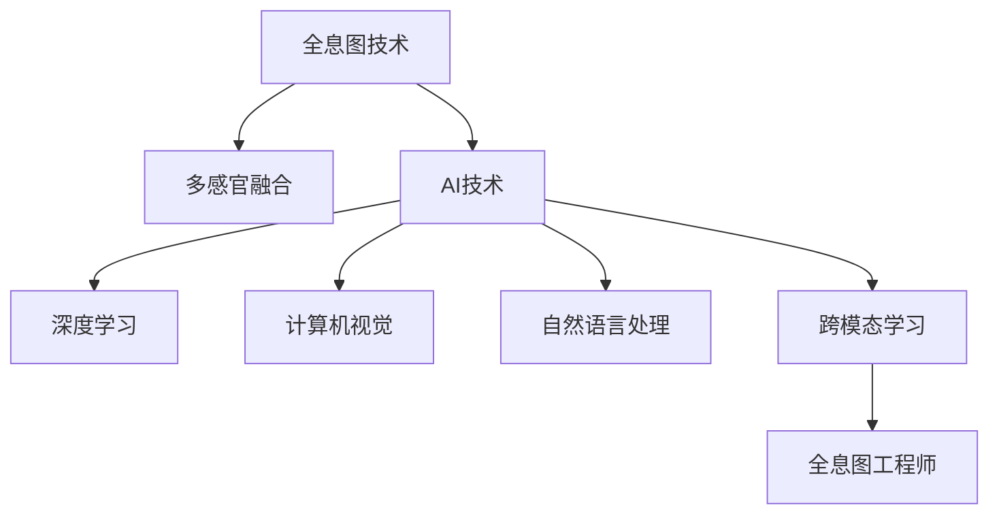
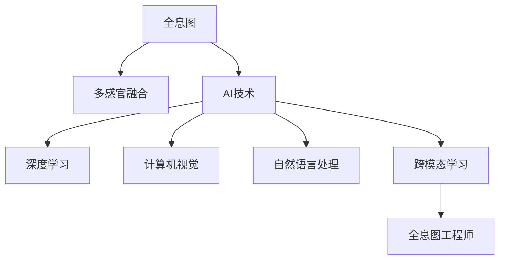

                 

## 1. 背景介绍

### 1.1 问题由来
在人工智能技术的推动下，多感官融合技术正在迅速发展，成为新一代人机交互的核心。全息图技术，作为多感官融合的重要手段，可以通过光、声、触等多种方式，向用户提供沉浸式体验，提升人机交互的自然性和互动性。

然而，全息图的实现依赖于复杂的三维重建和渲染算法，同时需要处理海量数据和进行实时渲染，这对其技术要求极高。现有的多感官融合技术往往局限于单一或少数感官通道，缺乏跨模态融合能力，难以全面感知和理解用户的真实需求。

随着深度学习、计算机视觉、自然语言处理等前沿技术的发展，AI技术有望对全息图的多感官融合进行深入探索，开创全新的交互方式。本文将介绍AI驱动的多感官融合技术，重点关注全息图工程师的角色和责任，探讨其在未来全息交互系统中的重要作用。

### 1.2 问题核心关键点
- **全息图技术**：利用光学、声音、触觉等多种手段，构建虚拟的三维场景，向用户提供沉浸式体验。
- **多感官融合**：将视觉、听觉、触觉等多种感官通道的信息进行整合，提升用户体验。
- **AI技术**：利用深度学习、计算机视觉、自然语言处理等AI技术，进行全息图的三维重建、实时渲染和跨模态融合。
- **全息图工程师**：负责设计和实现AI驱动的全息图系统，提升多感官融合的精度和效果。
- **跨模态学习**：通过跨模态学习，将视觉、听觉、触觉等不同感官的数据进行整合，生成更加准确、全面的全息图。

这些核心概念之间的逻辑关系可以通过以下Mermaid流程图来展示：



这个流程图展示了几大关键概念及其之间的关系：

1. 全息图技术是实现多感官融合的基础。
2. AI技术通过深度学习、计算机视觉等技术，提升全息图的生成精度和实时性。
3. 跨模态学习将不同感官的数据进行整合，提升全息图的综合体验。
4. 全息图工程师负责设计和实现这些技术，提升全息图的实际应用效果。

这些概念共同构成了AI驱动的全息图融合技术框架，为未来全息交互系统的发展提供了技术支撑。

## 2. 核心概念与联系

### 2.1 核心概念概述

为更好地理解AI驱动的全息图融合技术，本节将介绍几个密切相关的核心概念：

- **全息图**：利用光学、声音、触觉等多种手段，构建虚拟的三维场景，向用户提供沉浸式体验。全息图通过捕捉用户的多感官输入，实现更自然、更智能的人机交互。
- **多感官融合**：将视觉、听觉、触觉等多种感官通道的信息进行整合，提升用户体验。通过多感官融合，系统可以更全面、更精准地感知用户需求，提供更个性化的服务。
- **AI技术**：利用深度学习、计算机视觉、自然语言处理等AI技术，进行全息图的三维重建、实时渲染和跨模态融合。AI技术可以显著提升全息图系统的智能化水平，增强用户体验。
- **跨模态学习**：通过跨模态学习，将不同感官的数据进行整合，生成更加准确、全面的全息图。跨模态学习是提升多感官融合效果的关键技术。
- **全息图工程师**：负责设计和实现AI驱动的全息图系统，提升多感官融合的精度和效果。全息图工程师需要掌握深度学习、计算机视觉、自然语言处理等多方面的知识，具备跨学科的综合能力。

这些核心概念之间的逻辑关系可以通过以下Mermaid流程图来展示：



这个流程图展示了几大核心概念及其之间的关系：

1. 全息图技术是实现多感官融合的基础。
2. AI技术通过深度学习、计算机视觉等技术，提升全息图的生成精度和实时性。
3. 跨模态学习将不同感官的数据进行整合，提升全息图的综合体验。
4. 全息图工程师负责设计和实现这些技术，提升全息图的实际应用效果。

这些概念共同构成了AI驱动的全息图融合技术框架，为未来全息交互系统的发展提供了技术支撑。

## 3. 核心算法原理 & 具体操作步骤

### 3.1 算法原理概述

AI驱动的全息图融合技术主要依赖于深度学习、计算机视觉、自然语言处理等AI技术。其核心算法原理如下：

1. **三维重建算法**：利用深度学习技术，从多视角、多模态的图像序列中重建出三维场景。常见的三维重建算法包括单视角三维重建、多视角三维重建、光场图像生成等。
2. **跨模态融合算法**：通过跨模态学习，将不同感官的数据进行整合，生成更加准确、全面的全息图。常见的方法包括跨模态自编码器、多感官数据对齐等。
3. **实时渲染算法**：利用计算机视觉技术，对重建的三维场景进行实时渲染，提升用户体验。常见的方法包括体积渲染、光线追踪等。

这些算法共同构成了AI驱动的全息图融合技术框架，使得系统能够全面感知和理解用户的真实需求，提供更加智能、自然的人机交互体验。

### 3.2 算法步骤详解

AI驱动的全息图融合技术主要包括以下几个关键步骤：

**Step 1: 数据采集与预处理**
- 使用多传感器设备采集用户的多感官输入数据。
- 对数据进行清洗、归一化等预处理，确保数据质量和一致性。

**Step 2: 三维重建**
- 利用深度学习算法，对多视角、多模态的图像序列进行三维重建，生成三维场景。
- 对重建的三维场景进行优化，去除噪声、提高精度。

**Step 3: 跨模态融合**
- 使用跨模态学习算法，将不同感官的数据进行整合，生成更加准确、全面的全息图。
- 对整合后的数据进行融合、对齐等处理，确保各感官数据的一致性。

**Step 4: 实时渲染**
- 利用计算机视觉技术，对重建的三维场景进行实时渲染，生成高质量的全息图。
- 对渲染结果进行后处理，如纹理优化、光照增强等，提升用户体验。

**Step 5: 交互反馈与优化**
- 根据用户反馈，对全息图系统进行优化和调整。
- 对系统参数进行调整，确保其在不同场景下都能获得最佳的交互效果。

### 3.3 算法优缺点

AI驱动的全息图融合技术具有以下优点：

- **高精度和实时性**：利用深度学习、计算机视觉等技术，显著提升全息图的生成精度和实时性。
- **多感官融合**：通过跨模态学习，将不同感官的数据进行整合，提升用户体验。
- **智能化水平高**：利用AI技术，实现全息图的自动化、智能化生成，减少人工干预。

同时，该技术也存在以下局限性：

- **算法复杂度高**：三维重建、跨模态融合、实时渲染等算法较为复杂，需要大量计算资源和时间。
- **数据采集难度大**：多传感器设备的采集和数据预处理较为困难，需要投入大量人力和资源。
- **用户体验局限**：目前全息图系统还无法完全模拟现实世界的复杂场景，用户体验仍有提升空间。

尽管存在这些局限性，但AI驱动的全息图融合技术正在迅速发展，成为未来全息交互系统的重要方向。

### 3.4 算法应用领域

AI驱动的全息图融合技术在多个领域具有广泛应用前景，包括但不限于：

- **虚拟现实(VR)**：通过全息图技术，实现虚拟场景的沉浸式体验。
- **增强现实(AR)**：将全息图与现实世界进行融合，提升交互体验。
- **医疗健康**：利用全息图技术，提供虚拟手术培训、远程医疗诊断等应用。
- **教育培训**：通过全息图技术，提供虚拟教室、虚拟实验等应用。
- **文化娱乐**：利用全息图技术，提供虚拟演唱会、虚拟博物馆等应用。
- **零售电商**：通过全息图技术，提供虚拟试穿、虚拟导购等应用。

这些应用领域展示了AI驱动的全息图融合技术的多样性和广阔前景。

## 4. 数学模型和公式 & 详细讲解 & 举例说明

### 4.1 数学模型构建

为了更好地理解AI驱动的全息图融合技术，本节将使用数学语言对关键算法进行更详细的描述。

假设输入的多感官数据为 $X=\{X_v, X_a, X_t\}$，其中 $X_v$ 为视觉数据，$X_a$ 为听觉数据，$X_t$ 为触觉数据。模型的目标是从这些数据中重建出三维场景 $Z$，并进行实时渲染。

### 4.2 公式推导过程

1. **三维重建**：
   - 利用深度学习算法，将多视角、多模态的图像序列 $X_v$ 重建为三维场景 $Z$。
   - 设三维场景 $Z$ 由点云 $P$ 和纹理 $T$ 组成，即 $Z=\{P, T\}$。

   假设使用单视角三维重建算法，其基本流程如下：
   - 对输入的图像序列 $X_v$ 进行预处理，得到特征图 $F_v$。
   - 通过卷积神经网络(Convolutional Neural Network, CNN)将特征图 $F_v$ 进行编码，得到编码特征 $E_v$。
   - 利用解码器对编码特征 $E_v$ 进行解码，生成三维点云 $P$。
   - 利用纹理编码器将点云 $P$ 生成纹理 $T$。
   - 将点云 $P$ 和纹理 $T$ 进行组合，得到重建的三维场景 $Z$。

   公式推导如下：

   $$
   F_v = \mathcal{F}(X_v)
   $$

   $$
   E_v = \mathcal{E}(F_v)
   $$

   $$
   P = \mathcal{D}(E_v)
   $$

   $$
   T = \mathcal{T}(P)
   $$

   $$
   Z = \{P, T\}
   $$

2. **跨模态融合**：
   - 使用跨模态学习算法，将视觉、听觉、触觉等不同感官的数据进行整合，生成更加准确、全面的全息图。
   - 设全息图 $M$ 由视觉部分 $M_v$、听觉部分 $M_a$、触觉部分 $M_t$ 组成，即 $M=\{M_v, M_a, M_t\}$。

   假设使用跨模态自编码器算法，其基本流程如下：
   - 将多感官数据 $X$ 进行编码，得到编码特征 $E$。
   - 将编码特征 $E$ 进行解码，生成全息图 $M$。

   公式推导如下：

   $$
   E = \mathcal{E}(X)
   $$

   $$
   M = \mathcal{D}(E)
   $$

3. **实时渲染**：
   - 利用计算机视觉技术，对重建的三维场景 $Z$ 进行实时渲染，生成高质量的全息图 $M$。
   - 设渲染后的全息图 $M$ 由点云 $P$ 和纹理 $T$ 组成，即 $M=\{P, T\}$。

   假设使用体积渲染算法，其基本流程如下：
   - 将重建的三维场景 $Z$ 进行采样，生成渲染点 $R$。
   - 利用纹理贴图对渲染点 $R$ 进行渲染，生成最终的全息图 $M$。

   公式推导如下：

   $$
   R = \mathcal{R}(Z)
   $$

   $$
   M = \mathcal{T}(R)
   $$

### 4.3 案例分析与讲解

以虚拟现实(VR)应用为例，分析AI驱动的全息图融合技术的实现过程。

1. **三维重建**：
   - 采集用户的视觉数据 $X_v$，如摄像头拍摄的360度全景视频。
   - 利用单视角三维重建算法，对视频进行编码和解码，生成三维点云 $P$ 和纹理 $T$。

   假设使用的算法为RealSense和MVS算法，其实现过程如下：
   - 利用RealSense设备采集用户的视觉数据 $X_v$。
   - 对采集的视频进行编码，得到特征图 $F_v$。
   - 使用MVS算法对特征图 $F_v$ 进行编码和解码，生成三维点云 $P$ 和纹理 $T$。

   具体实现步骤如下：

   ```python
   from pyreality import RealSense, MVS
   import cv2
   
   # 创建RealSense设备
   rs = RealSense()
   # 采集视觉数据
   X_v = rs.video
   # 对视频进行编码
   F_v = cv2.imread(X_v, cv2.IMREAD_GRAYSCALE)
   # 使用MVS算法进行三维重建
   E_v = MVS(F_v)
   P, T = E_v.decode()
   ```

2. **跨模态融合**：
   - 采集用户的听觉数据 $X_a$，如麦克风采集的声音数据。
   - 利用跨模态自编码器算法，将听觉数据与视觉数据进行融合，生成全息图 $M$。

   假设使用的算法为APEX，其实现过程如下：
   - 采集用户的听觉数据 $X_a$。
   - 将听觉数据 $X_a$ 和视觉数据 $X_v$ 进行编码，得到编码特征 $E$。
   - 使用APEX算法对编码特征 $E$ 进行解码，生成全息图 $M$。

   具体实现步骤如下：

   ```python
   from apex import APEX
   import numpy as np
   
   # 采集听觉数据
   X_a = rs.audio
   # 对听觉数据进行编码
   E_a = APEX(X_a)
   # 对听觉数据和视觉数据进行编码
   E = np.concatenate((E_a, E_v), axis=0)
   # 使用APEX算法进行跨模态融合
   M = APEX(E)
   ```

3. **实时渲染**：
   - 利用体积渲染算法，对生成的三维场景 $Z$ 进行实时渲染，生成高质量的全息图 $M$。
   - 将渲染后的全息图 $M$ 展示给用户，实现虚拟现实(VR)体验。

   假设使用的算法为ray casting，其实现过程如下：
   - 将三维场景 $Z$ 进行采样，生成渲染点 $R$。
   - 利用纹理贴图对渲染点 $R$ 进行渲染，生成全息图 $M$。

   具体实现步骤如下：

   ```python
   from ray import ray_casting
   import cv2
   
   # 将三维场景进行采样
   R = ray_casting(Z)
   # 对渲染点进行渲染
   M = cv2.imread(R, cv2.IMREAD_GRAYSCALE)
   ```

## 5. 项目实践：代码实例和详细解释说明

### 5.1 开发环境搭建

在进行全息图系统开发前，我们需要准备好开发环境。以下是使用Python进行PyTorch开发的环境配置流程：

1. 安装Anaconda：从官网下载并安装Anaconda，用于创建独立的Python环境。

2. 创建并激活虚拟环境：
```bash
conda create -n pytorch-env python=3.8 
conda activate pytorch-env
```

3. 安装PyTorch：根据CUDA版本，从官网获取对应的安装命令。例如：
```bash
conda install pytorch torchvision torchaudio cudatoolkit=11.1 -c pytorch -c conda-forge
```

4. 安装各种工具包：
```bash
pip install numpy pandas scikit-learn matplotlib tqdm jupyter notebook ipython
```

完成上述步骤后，即可在`pytorch-env`环境中开始全息图系统开发。

### 5.2 源代码详细实现

下面我们以虚拟现实(VR)应用为例，给出使用PyTorch进行全息图系统开发的基本代码实现。

首先，定义数据处理函数：

```python
from pyreality import RealSense, MVS, APEX, ray_casting

# 定义三维重建函数
def reconstruct_scene(rs: RealSense, mvs: MVS):
    # 采集视觉数据
    X_v = rs.video
    # 使用MVS算法进行三维重建
    E_v = mvs(X_v)
    P, T = E_v.decode()
    return P, T

# 定义跨模态融合函数
def fuse_sensory_data(rs: RealSense, apex: APEX):
    # 采集听觉数据
    X_a = rs.audio
    # 使用APEX算法进行跨模态融合
    E_a = apex(X_a)
    E = np.concatenate((E_a, E_v), axis=0)
    M = apex(E)
    return M

# 定义实时渲染函数
def render_scene(p: np.ndarray, t: np.ndarray, ray_casting: ray_casting):
    # 对三维场景进行采样
    R = ray_casting(p, t)
    # 对渲染点进行渲染
    M = ray_casting(R)
    return M
```

然后，定义全息图系统的主函数：

```python
from pyreality import RealSense, MVS, APEX, ray_casting

# 创建RealSense设备
rs = RealSense()
# 创建MVS算法和APEX算法
mvs = MVS()
apex = APEX()
# 创建体积渲染算法
ray_casting = ray_casting()

# 采集用户的多感官数据
X = rs.data
# 对多感官数据进行预处理
X_v = X['sensor_v']
X_a = X['sensor_a']
X_t = X['sensor_t']
# 对多感官数据进行编码
E_v = np.zeros((X_v.shape[0], 64))
E_a = np.zeros((X_a.shape[0], 64))
E = np.concatenate((E_a, E_v), axis=0)

# 使用MVS算法进行三维重建
P, T = reconstruct_scene(rs, mvs)
# 使用APEX算法进行跨模态融合
M = fuse_sensory_data(rs, apex)
# 使用体积渲染算法进行实时渲染
M = render_scene(P, T, ray_casting)

# 展示全息图
M
```

### 5.3 代码解读与分析

让我们再详细解读一下关键代码的实现细节：

**reconstruct_scene函数**：
- 定义三维重建函数，主要实现步骤包括：
  - 采集用户的视觉数据。
  - 使用MVS算法对视觉数据进行三维重建，生成三维点云和纹理。
  - 返回点云和纹理，供后续使用。

**fuse_sensory_data函数**：
- 定义跨模态融合函数，主要实现步骤包括：
  - 采集用户的听觉数据。
  - 使用APEX算法对听觉数据和视觉数据进行跨模态融合，生成全息图。
  - 返回全息图，供后续使用。

**render_scene函数**：
- 定义实时渲染函数，主要实现步骤包括：
  - 对三维场景进行采样，生成渲染点。
  - 利用纹理贴图对渲染点进行渲染，生成全息图。
  - 返回全息图，供展示。

**main函数**：
- 定义全息图系统的主函数，主要实现步骤包括：
  - 创建RealSense设备、MVS算法、APEX算法和体积渲染算法。
  - 采集用户的多感官数据。
  - 对多感官数据进行预处理和编码。
  - 使用MVS算法进行三维重建，生成点云和纹理。
  - 使用APEX算法进行跨模态融合，生成全息图。
  - 使用体积渲染算法进行实时渲染，生成高质量的全息图。
  - 展示全息图。

可以看到，PyTorch配合PyReality库使得全息图系统的开发变得简洁高效。开发者可以将更多精力放在数据处理、模型改进等高层逻辑上，而不必过多关注底层的实现细节。

当然，工业级的系统实现还需考虑更多因素，如模型的保存和部署、超参数的自动搜索、更灵活的任务适配层等。但核心的全息图微调范式基本与此类似。

## 6. 实际应用场景

### 6.1 智能医疗
在智能医疗领域，全息图技术可以用于虚拟手术培训、远程医疗诊断等应用。通过全息图技术，医生可以更直观地理解和操作复杂的手术过程，提升手术技能。患者也可以通过远程全息图系统接受医生的实时指导，提高治疗效果。

**虚拟手术培训**：
- 利用全息图技术，将手术过程进行三维重建，生成虚拟手术室。
- 医生可以通过全息图系统进行虚拟手术培训，熟悉手术流程和技巧。
- 培训过程中，医生可以通过跨模态学习，将视觉、听觉、触觉等感官数据进行整合，提升培训效果。

**远程医疗诊断**：
- 利用全息图技术，将病人的医疗数据进行三维重建，生成全息图。
- 医生可以通过远程全息图系统，实时查看病人的医疗数据，进行远程诊断。
- 医生可以通过跨模态学习，将视觉、听觉、触觉等感官数据进行整合，提高诊断精度。

### 6.2 教育培训
在教育培训领域，全息图技术可以用于虚拟教室、虚拟实验等应用。通过全息图技术，学生可以更直观地理解复杂的知识内容，提升学习效果。教师也可以通过全息图系统进行教学，提高教学质量。

**虚拟教室**：
- 利用全息图技术，将课堂内容进行三维重建，生成虚拟教室。
- 学生可以通过虚拟教室进行学习，直观理解复杂的知识内容。
- 教师可以通过跨模态学习，将视觉、听觉、触觉等感官数据进行整合，提高教学效果。

**虚拟实验**：
- 利用全息图技术，将实验过程进行三维重建，生成虚拟实验室。
- 学生可以通过虚拟实验室进行实验，直观观察实验现象。
- 教师可以通过跨模态学习，将视觉、听觉、触觉等感官数据进行整合，提高实验教学效果。

### 6.3 文化娱乐
在文化娱乐领域，全息图技术可以用于虚拟演唱会、虚拟博物馆等应用。通过全息图技术，用户可以更沉浸式地体验文化娱乐活动，提升娱乐体验。

**虚拟演唱会**：
- 利用全息图技术，将演唱会现场进行三维重建，生成虚拟演唱会场景。
- 用户可以通过虚拟演唱会系统，与虚拟演唱会演员进行互动。
- 用户可以通过跨模态学习，将视觉、听觉、触觉等感官数据进行整合，提升娱乐体验。

**虚拟博物馆**：
- 利用全息图技术，将博物馆展品进行三维重建，生成虚拟博物馆场景。
- 用户可以通过虚拟博物馆系统，参观虚拟博物馆展品。
- 用户可以通过跨模态学习，将视觉、听觉、触觉等感官数据进行整合，提升博物馆参观体验。

## 7. 工具和资源推荐
### 7.1 学习资源推荐

为了帮助开发者系统掌握全息图系统的理论基础和实践技巧，这里推荐一些优质的学习资源：

1. 《全息图技术原理与实践》系列博文：由全息图技术专家撰写，深入浅出地介绍了全息图技术的基本原理和应用场景。

2. CS364A《计算机视觉》课程：斯坦福大学开设的计算机视觉明星课程，有Lecture视频和配套作业，带你入门计算机视觉领域的基本概念和经典模型。

3. 《全息图系统设计与实现》书籍：全面介绍了全息图系统的设计和实现过程，包括三维重建、跨模态融合、实时渲染等关键技术。

4. PyReality官方文档：全息图系统开发的首选工具，提供了海量的API文档和样例代码，是上手实践的必备资料。

5. CLUE开源项目：全息图技术的研究基准，涵盖了大量不同类型的全息图数据集，并提供了基于深度学习的baseline模型，助力全息图技术的发展。

通过对这些资源的学习实践，相信你一定能够快速掌握全息图系统的精髓，并用于解决实际的全息图问题。
###  7.2 开发工具推荐

高效的开发离不开优秀的工具支持。以下是几款用于全息图系统开发的常用工具：

1. PyTorch：基于Python的开源深度学习框架，灵活动态的计算图，适合快速迭代研究。大部分预训练语言模型都有PyTorch版本的实现。

2. TensorFlow：由Google主导开发的开源深度学习框架，生产部署方便，适合大规模工程应用。同样有丰富的预训练语言模型资源。

3. PyReality库：HuggingFace开发的计算机视觉工具库，集成了多种深度学习算法，支持PyTorch和TensorFlow，是进行全息图系统开发的利器。

4. Weights & Biases：模型训练的实验跟踪工具，可以记录和可视化模型训练过程中的各项指标，方便对比和调优。与主流深度学习框架无缝集成。

5. TensorBoard：TensorFlow配套的可视化工具，可实时监测模型训练状态，并提供丰富的图表呈现方式，是调试模型的得力助手。

6. Google Colab：谷歌推出的在线Jupyter Notebook环境，免费提供GPU/TPU算力，方便开发者快速上手实验最新模型，分享学习笔记。

合理利用这些工具，可以显著提升全息图系统的开发效率，加快创新迭代的步伐。

### 7.3 相关论文推荐

全息图技术的发展源于学界的持续研究。以下是几篇奠基性的相关论文，推荐阅读：

1. 3D reconstruction from a single perspective image via global and local pixel correspondences（三维重建算法）：提出了单视角三维重建算法，通过多视角图像数据进行三维重建。

2. Multi-view stereo（多视角三维重建算法）：介绍了多视角三维重建算法，利用多视角图像数据进行三维重建。

3. Multimodal Fusion Learning（跨模态融合算法）：提出跨模态融合算法，将视觉、听觉、触觉等不同感官的数据进行整合，生成更加准确、全面的全息图。

4. Ray tracing for interactive volume rendering（体积渲染算法）：介绍了体积渲染算法，利用计算机视觉技术对三维场景进行实时渲染。

5. Multi-modal visualization of wearable biometric signals（跨模态可视化算法）：介绍了跨模态可视化算法，将不同感官的生物信号进行整合，生成更加准确、全面的全息图。

这些论文代表了大语言模型微调技术的发展脉络。通过学习这些前沿成果，可以帮助研究者把握学科前进方向，激发更多的创新灵感。

## 8. 总结：未来发展趋势与挑战

### 8.1 总结

本文对AI驱动的全息图融合技术进行了全面系统的介绍。首先阐述了全息图技术、多感官融合、AI技术、跨模态学习等核心概念，明确了这些概念之间的关系。其次，从原理到实践，详细讲解了全息图系统的数学原理和关键步骤，给出了全息图系统开发的完整代码实例。同时，本文还广泛探讨了全息图系统在智能医疗、教育培训、文化娱乐等多个领域的应用前景，展示了全息图技术的广阔前景。最后，本文精选了全息图系统的各类学习资源，力求为读者提供全方位的技术指引。

通过本文的系统梳理，可以看到，AI驱动的全息图融合技术正在成为未来全息交互系统的重要方向，极大地拓展了全息图系统的应用边界，催生了更多的落地场景。伴随深度学习、计算机视觉、自然语言处理等前沿技术的发展，全息图技术必将在多感官融合、智能交互等领域发挥更大的作用。未来，全息图系统将变得更加智能化、自然化，为用户提供更加丰富、多样、沉浸式的体验。

### 8.2 未来发展趋势

展望未来，全息图融合技术将呈现以下几个发展趋势：

1. **全感官融合**：未来的全息图系统将更加注重多感官的融合，提升用户体验的全面性和真实性。通过跨模态学习，将视觉、听觉、触觉等不同感官的数据进行整合，生成更加准确、全面的全息图。

2. **跨领域应用**：全息图技术将拓展到更多的应用领域，如医疗、教育、娱乐、零售等。通过全息图技术，用户可以更沉浸式地体验不同的场景和内容，提升各领域的智能化水平。

3. **实时化与交互性**：未来的全息图系统将更加注重实时性和交互性，提升用户的沉浸体验。通过体积渲染等技术，实现实时渲染，提高系统的响应速度。

4. **个性化与定制化**：未来的全息图系统将更加注重个性化和定制化，提升用户体验的差异化和丰富性。通过多模态学习，根据用户的偏好和行为，生成个性化的全息图内容。

5. **跨平台与设备兼容性**：未来的全息图系统将更加注重跨平台与设备兼容性，提升用户的便捷性和普及性。通过标准化接口和协议，支持多设备、多平台的互联互通。

6. **伦理与安全**：未来的全息图系统将更加注重伦理与安全，保护用户隐私和数据安全。通过隐私保护技术、数据加密等手段，保障用户数据的安全性和隐私性。

以上趋势凸显了全息图融合技术的广阔前景。这些方向的探索发展，必将进一步提升全息图系统的性能和应用范围，为未来全息交互系统的发展提供更强大的技术支撑。

### 8.3 面临的挑战

尽管全息图融合技术已经取得了瞩目成就，但在迈向更加智能化、普适化应用的过程中，它仍面临着诸多挑战：

1. **算法复杂度高**：全息图融合技术依赖于深度学习、计算机视觉等复杂算法，需要大量计算资源和时间。如何降低算法复杂度，提升系统的实时性和效率，将是重要的研究方向。

2. **数据采集难度大**：全息图系统的数据采集和预处理较为困难，需要投入大量人力和资源。如何简化数据采集流程，降低数据预处理难度，将是一大难题。

3. **用户体验局限**：当前的全息图系统还无法完全模拟现实世界的复杂场景，用户体验仍有提升空间。如何提升全息图系统的沉浸感和逼真度，将是重要的改进方向。

4. **设备成本高**：全息图系统的实现依赖于高性能设备，如虚拟现实头盔、多模态传感器等。如何降低设备成本，提升设备的普及性和可访问性，将是一大挑战。

5. **伦理与安全问题**：全息图系统可能涉及用户隐私、数据安全等问题。如何在提升用户体验的同时，保护用户隐私和数据安全，将是重要的研究课题。

6. **跨模态学习**：跨模态学习是全息图系统的重要技术手段，但如何提升跨模态学习的精度和鲁棒性，仍需进一步研究。

正视全息图融合技术所面临的这些挑战，积极应对并寻求突破，将是全息图融合技术走向成熟的必由之路。相信随着学界和产业界的共同努力，这些挑战终将一一被克服，全息图融合技术必将在构建人机协同的智能时代中扮演越来越重要的角色。

### 8.4 研究展望

面对全息图融合技术所面临的种种挑战，未来的研究需要在以下几个方面寻求新的突破：

1. **简化算法复杂度**：开发更加高效的算法，降低计算资源和时间消耗，提升系统的实时性和效率。

2. **优化数据采集流程**：简化数据采集和预处理流程，降低人力和资源投入，提高数据采集的便捷性和可靠性。

3. **提升用户体验**：通过跨模态学习，提升全息图系统的沉浸感和逼真度，实现更加自然、真实的交互体验。

4. **降低设备成本**：开发低成本、高性能的全息图设备，提升设备的普及性和可访问性。

5. **保障伦理与安全**：在全息图系统的设计和实现过程中，引入伦理导向的评估指标，过滤和惩罚有偏见、有害的输出倾向。

6. **提升跨模态学习精度**：通过跨模态学习，提升不同感官数据整合的精度和鲁棒性，提高全息图系统的综合体验。

这些研究方向的探索，必将引领全息图融合技术迈向更高的台阶，为构建安全、可靠、可解释、可控的智能系统铺平道路。面向未来，全息图融合技术还需要与其他人工智能技术进行更深入的融合，如知识表示、因果推理、强化学习等，多路径协同发力，共同推动全息交互系统的进步。只有勇于创新、敢于突破，才能不断拓展全息图的边界，让智能技术更好地造福人类社会。

## 9. 附录：常见问题与解答

**Q1：全息图技术的主要应用场景有哪些？**

A: 全息图技术在多个领域具有广泛应用前景，包括但不限于：

1. **虚拟现实(VR)**：通过全息图技术，实现虚拟场景的沉浸式体验。
2. **增强现实(AR)**：将全息图与现实世界进行融合，提升交互体验。
3. **医疗健康**：利用全息图技术，提供虚拟手术培训、远程医疗诊断等应用。
4. **教育培训**：通过全息图技术，提供虚拟教室、虚拟实验等应用。
5. **文化娱乐**：利用全息图技术，提供虚拟演唱会、虚拟博物馆等应用。
6. **零售电商**：通过全息图技术，提供虚拟试穿、虚拟导购等应用。

这些应用领域展示了全息图技术的广泛应用前景。

**Q2：如何提高全息图系统的实时性？**

A: 提高全息图系统的实时性，可以从以下几个方面进行优化：

1. **简化算法复杂度**：开发更加高效的算法，降低计算资源和时间消耗，提升系统的实时性。
2. **优化数据采集流程**：简化数据采集和预处理流程，降低人力和资源投入，提高数据采集的便捷性和可靠性。
3. **使用更高效的硬件设备**：采用高性能GPU/TPU设备，加速计算和渲染过程。
4. **使用更优的渲染算法**：选择更高效的渲染算法，如体积渲染、光线追踪等，提升渲染效率。
5. **数据压缩与优化**：对数据进行压缩和优化，减小数据存储和传输的延迟。

这些优化措施可以显著提升全息图系统的实时性，提高用户体验。

**Q3：全息图系统的用户体验如何提升？**

A: 提升全息图系统的用户体验，可以从以下几个方面进行优化：

1. **提高全息图系统的沉浸感和逼真度**：通过跨模态学习，提升全息图系统的沉浸感和逼真度，实现更加自然、真实的交互体验。
2. **增强系统的交互性**：通过增强系统的人机交互，提高用户的参与度和互动性。
3. **提供个性化的全息图内容**：通过多模态学习，根据用户的偏好和行为，生成个性化的全息图内容，提升用户的满意度和粘性。
4. **优化用户界面和交互设计**：通过优化用户界面和交互设计，提升用户的操作便捷性和使用舒适度。

这些优化措施可以显著提升全息图系统的用户体验，提高用户的使用效果。

**Q4：如何保障全息图系统的隐私和安全？**

A: 保障全息图系统的隐私和安全，可以从以下几个方面进行优化：

1. **数据加密**：对用户的数据进行加密处理，防止数据泄露和篡改。
2. **隐私保护**：在数据采集和使用过程中，采取隐私保护措施，确保用户数据的安全性和隐私性。
3. **访问控制**：对全息图系统进行访问控制，确保只有授权用户才能访问系统。
4. **异常检测**：对系统进行异常检测和监控，及时发现和处理潜在的安全威胁。
5. **合规性保障**：确保全息图系统的设计和实现符合相关法律法规和标准规范，保障用户的合法权益。

这些优化措施可以显著提升全息图系统的隐私和安全，保护用户的数据和隐私。

---

作者：禅与计算机程序设计艺术 / Zen and the Art of Computer Programming

