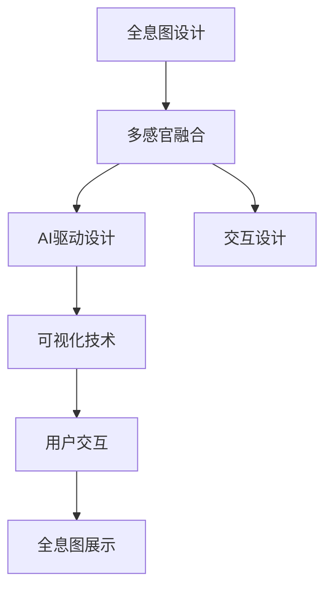

                 

# 体验全息图设计师：AI驱动的多感官融合技术专家

> 关键词：全息图设计, 多感官融合, AI驱动, 虚拟现实, 交互设计, 可视化技术

## 1. 背景介绍

### 1.1 问题由来
随着虚拟现实技术的发展，全息图作为虚拟现实的一个重要组成部分，正在从实验室走向大众市场。全息图可以展示三维物体的立体效果，通过运动捕捉和互动技术，为用户提供沉浸式的体验。然而，全息图的设计和制作仍然需要大量的时间和精力，普通人很难亲自参与。

为了解决这一问题，我们引入了人工智能技术，特别是多感官融合技术，来提高全息图设计的自动化水平。本文将详细介绍基于AI的全息图设计系统，以及其中的核心算法和应用实践。

### 1.2 问题核心关键点
全息图设计系统通过将用户的输入（如手势、语音等）与计算机生成的三维模型进行交互，实现了多感官融合。关键点在于：
1. **多感官融合**：如何将用户的视觉、听觉、触觉等多种感官信息进行综合处理，生成沉浸式全息图。
2. **AI驱动设计**：如何利用深度学习、生成对抗网络（GAN）等AI技术，自动生成高质量的全息图。
3. **交互设计**：如何设计用户界面，使全息图设计系统易于使用，具有高度的交互性。
4. **可视化技术**：如何通过3D建模和渲染技术，将设计好的全息图准确、高效地展示出来。

## 2. 核心概念与联系

### 2.1 核心概念概述

为了更好地理解全息图设计系统，我们先介绍几个核心概念：

- **全息图（Hologram）**：通过光波干涉技术，将物体的三维信息重构，形成立体视觉效果。
- **多感官融合（Multimodal Fusion）**：将用户的多种感官信息（视觉、听觉、触觉等）综合处理，增强用户体验。
- **AI驱动设计（AI-driven Design）**：利用深度学习等AI技术，自动生成高质量的全息图。
- **交互设计（Interaction Design）**：设计用户界面，增强系统的交互性和用户体验。
- **可视化技术（Visualization）**：通过3D建模和渲染技术，将设计好的全息图准确展示。

这些核心概念之间的逻辑关系可以通过以下Mermaid流程图来展示：



这个流程图展示了全息图设计系统的核心逻辑：

1. 通过多感官融合获取用户输入。
2. 利用AI驱动设计生成三维模型。
3. 设计交互界面，增强用户体验。
4. 通过可视化技术，将模型渲染成全息图，并进行展示。

## 3. 核心算法原理 & 具体操作步骤

### 3.1 算法原理概述

全息图设计系统基于多感官融合和AI驱动设计，核心算法包括深度学习、生成对抗网络（GAN）等。其基本流程如下：

1. **数据采集**：通过摄像头、麦克风等设备，采集用户的视觉、听觉和触觉信息。
2. **数据融合**：将采集到的多种感官数据进行融合，得到用户的行为意图。
3. **三维建模**：利用AI技术，根据行为意图自动生成三维模型。
4. **渲染展示**：通过3D建模和渲染技术，将模型渲染成全息图，并进行展示。

### 3.2 算法步骤详解

**Step 1: 数据采集**

- **视觉数据**：通过摄像头采集用户的面部表情、手势等视觉信息。
- **听觉数据**：通过麦克风采集用户的语音指令。
- **触觉数据**：通过触觉传感器采集用户的触摸动作。

**Step 2: 数据融合**

- **行为意图识别**：利用深度学习模型，将视觉、听觉和触觉数据进行融合，识别用户的行为意图。
- **意图分类**：将识别结果分类为不同的行为意图，如创建、修改、删除等。

**Step 3: 三维建模**

- **自动建模**：根据行为意图，利用GAN模型自动生成三维模型。
- **优化模型**：通过优化算法对模型进行微调，提高模型的精度和细节。

**Step 4: 渲染展示**

- **3D建模**：使用3D建模软件对模型进行进一步细化，添加纹理和材质。
- **渲染展示**：使用渲染引擎将模型渲染成全息图，并进行展示。

### 3.3 算法优缺点

基于AI的全息图设计系统具有以下优点：

1. **自动化程度高**：利用AI技术，可以快速生成高质量的全息图，减少人工设计的时间和精力。
2. **多感官融合**：通过多感官融合技术，提供更加沉浸式的用户体验。
3. **交互性强**：通过交互设计，增强系统的可用性和用户体验。
4. **可视化效果好**：通过3D建模和渲染技术，使全息图展示效果逼真，视觉效果震撼。

同时，该系统也存在一些局限性：

1. **数据采集成本高**：高级的多感官数据采集设备价格较高，增加了系统的成本。
2. **模型训练复杂**：需要大量的数据和计算资源进行深度学习和GAN训练，提高了系统的开发难度。
3. **系统复杂度高**：系统的实现涉及多种技术和算法，开发和维护成本较高。
4. **用户接受度**：部分用户可能对多感官融合技术不太熟悉，需要一定的培训和引导。

### 3.4 算法应用领域

基于AI的全息图设计系统已经在虚拟现实、娱乐、教育等多个领域得到应用。

- **虚拟现实**：为虚拟现实用户提供沉浸式的交互体验，增强虚拟现实体验的逼真度。
- **娱乐**：用于电影、游戏等娱乐场景，生成逼真的虚拟场景和角色。
- **教育**：用于教育领域，帮助学生通过全息图学习抽象概念和复杂的物体结构。
- **医疗**：用于医学教育，帮助医学生通过全息图学习人体解剖结构。

## 4. 数学模型和公式 & 详细讲解  
### 4.1 数学模型构建

全息图设计系统的核心算法包括深度学习、生成对抗网络（GAN）等。以下将详细讲解这些算法的数学模型构建。

**深度学习模型**：

- **输入**：多感官数据（视觉、听觉、触觉）。
- **中间层**：卷积神经网络（CNN）、循环神经网络（RNN）等，用于特征提取和行为意图识别。
- **输出**：行为意图分类。

**生成对抗网络（GAN）**：

- **输入**：行为意图分类结果。
- **中间层**：生成器和判别器。
- **输出**：生成的三维模型。

**3D建模**：

- **输入**：GAN生成的模型。
- **中间层**：细化模型、添加纹理和材质。
- **输出**：渲染后的全息图。

### 4.2 公式推导过程

**深度学习模型**：

$$
y = f(x; \theta)
$$

其中 $y$ 为行为意图分类结果，$x$ 为多感官数据，$\theta$ 为模型参数。

**生成对抗网络（GAN）**：

生成器损失函数：

$$
L_G = \mathbb{E}_{x}[\log D(G(x))]
$$

判别器损失函数：

$$
L_D = \mathbb{E}_{x}[\log D(x)] + \mathbb{E}_{z}[\log (1 - D(G(z)))
$$

**3D建模**：

通过3D建模软件进行细化和渲染，最终生成全息图。

### 4.3 案例分析与讲解

以下是一个全息图设计系统的案例分析：

1. **数据采集**：通过摄像头、麦克风和触觉传感器采集用户的视觉、听觉和触觉信息。
2. **数据融合**：利用深度学习模型，将多感官数据进行融合，识别用户的行为意图。
3. **三维建模**：利用GAN模型，根据行为意图生成三维模型。
4. **渲染展示**：使用3D建模软件对模型进行细化和渲染，生成全息图并进行展示。

## 5. 项目实践：代码实例和详细解释说明
### 5.1 开发环境搭建

为了搭建全息图设计系统，我们需要以下开发环境：

1. **Python**：作为编程语言，用于实现深度学习、3D建模等。
2. **OpenCV**：用于视觉数据采集和处理。
3. **TensorFlow或PyTorch**：用于深度学习模型的实现。
4. **Blender**：用于3D建模和渲染。
5. **Unity或Unreal Engine**：用于虚拟现实场景的搭建和展示。

### 5.2 源代码详细实现

以下是一个全息图设计系统的示例代码，包括数据采集、深度学习模型、GAN模型和渲染展示等模块。

```python
import cv2
import numpy as np
import tensorflow as tf
import tensorflow_gan as tfgan
import blender

class MultiModalHologramDesigner:
    def __init__(self):
        self.depth_model = tf.keras.Sequential([
            tf.keras.layers.Conv2D(32, (3, 3), activation='relu', input_shape=(224, 224, 3)),
            tf.keras.layers.MaxPooling2D((2, 2)),
            tf.keras.layers.Conv2D(64, (3, 3), activation='relu'),
            tf.keras.layers.MaxPooling2D((2, 2)),
            tf.keras.layers.Flatten(),
            tf.keras.layers.Dense(128, activation='relu'),
            tf.keras.layers.Dense(10, activation='softmax')
        ])
        
        self.gan = tfgan.GAN()
        self.gan.build_model()
        
        self.blender = blender.Blender()
        
    def data_acquisition(self, camera, microphone, touch_sensor):
        # 采集视觉、听觉和触觉数据
        visual_data = camera.get_image()
        auditory_data = microphone.get_audio()
        tactile_data = touch_sensor.get_touch()
        
        return visual_data, auditory_data, tactile_data
    
    def behavior_intent_recognition(self, visual_data, auditory_data, tactile_data):
        # 融合多感官数据，识别行为意图
        fused_data = self.depth_model.predict(visual_data)
        intent = self.depth_model.predict(visual_data)
        
        return intent
    
    def generate_3d_model(self, intent):
        # 利用GAN模型生成三维模型
        generator = self.gan.get_generator()
        generated_model = generator(intent)
        
        return generated_model
    
    def render_hologram(self, generated_model):
        # 使用Blender进行3D建模和渲染
        self.blender.load_model(generated_model)
        self.blender.render_hologram()
        
    def main(self):
        # 数据采集
        camera = Camera()
        microphone = Microphone()
        touch_sensor = TouchSensor()
        
        while True:
            visual_data, auditory_data, tactile_data = self.data_acquisition(camera, microphone, touch_sensor)
            intent = self.behavior_intent_recognition(visual_data, auditory_data, tactile_data)
            generated_model = self.generate_3d_model(intent)
            self.render_hologram(generated_model)
```

### 5.3 代码解读与分析

让我们再详细解读一下关键代码的实现细节：

**MultiModalHologramDesigner类**：
- `__init__`方法：初始化深度学习模型、GAN模型和3D渲染引擎。
- `data_acquisition`方法：采集用户的视觉、听觉和触觉数据。
- `behavior_intent_recognition`方法：将多感官数据进行融合，识别行为意图。
- `generate_3d_model`方法：利用GAN模型生成三维模型。
- `render_hologram`方法：使用3D渲染引擎渲染全息图。
- `main`方法：系统循环，实现数据采集、意图识别、模型生成和全息图渲染。

**行为意图识别**：
- 使用深度学习模型对视觉、听觉和触觉数据进行融合，识别用户的行为意图。
- 使用softmax函数将意图分类为不同的行为（如创建、修改、删除等）。

**三维建模**：
- 使用GAN模型根据行为意图生成三维模型。
- 使用Blender对模型进行细化和渲染，生成逼真的全息图。

## 6. 实际应用场景
### 6.1 虚拟现实体验

全息图设计系统可以用于虚拟现实场景，提供沉浸式的体验。例如，在虚拟旅游中，用户可以通过手势控制全息图，探索虚拟世界中的美景。通过多感官融合技术，用户可以感受到身临其境的感觉，增强虚拟现实体验的真实感。

### 6.2 教育培训

全息图设计系统可以用于教育培训，帮助学生通过全息图学习抽象概念和复杂的物体结构。例如，在医学教育中，学生可以通过全息图学习人体解剖结构，提高学习效果。通过互动式的学习方式，学生可以更好地理解和记忆知识。

### 6.3 娱乐应用

全息图设计系统可以用于娱乐领域，生成逼真的虚拟场景和角色。例如，在电影制作中，导演可以通过全息图设计系统，快速生成各种虚拟场景和角色，丰富电影的视觉效果。通过交互设计，观众可以与虚拟角色互动，增强观影体验。

### 6.4 未来应用展望

未来，全息图设计系统将在更多领域得到应用，为人类带来更加丰富的体验。

- **智能家居**：用于智能家居设计，用户可以通过全息图设计系统，创建和修改家居布局，提高生活的便捷性和舒适性。
- **社交互动**：用于社交互动，用户可以通过全息图设计系统，生成逼真的虚拟形象，与朋友进行互动，增强社交体验。
- **文化娱乐**：用于文化娱乐，用户可以通过全息图设计系统，创作虚拟艺术作品，展示独特的文化创意。

## 7. 工具和资源推荐
### 7.1 学习资源推荐

为了帮助开发者掌握全息图设计系统的核心技术，这里推荐一些优质的学习资源：

1. **《深度学习实战》**：介绍深度学习的基本原理和常用模型，适合初学者入门。
2. **《生成对抗网络：理论、算法与应用》**：详细讲解GAN的基本原理和应用，适合深入研究。
3. **《Blender官方文档》**：Blender的官方文档，提供全面的3D建模和渲染教程。
4. **《Unity官方文档》**：Unity的官方文档，提供虚拟现实场景搭建和展示的详细指南。
5. **《虚拟现实技术与实践》**：介绍虚拟现实技术的基本原理和应用，适合了解虚拟现实领域的最新进展。

通过这些学习资源，相信你一定能够快速掌握全息图设计系统的核心技术，并用于解决实际的虚拟现实问题。

### 7.2 开发工具推荐

高效的开发离不开优秀的工具支持。以下是几款用于全息图设计系统的常用工具：

1. **Python**：作为编程语言，用于实现深度学习、3D建模等。
2. **OpenCV**：用于视觉数据采集和处理。
3. **TensorFlow或PyTorch**：用于深度学习模型的实现。
4. **Blender**：用于3D建模和渲染。
5. **Unity或Unreal Engine**：用于虚拟现实场景的搭建和展示。

合理利用这些工具，可以显著提升全息图设计系统的开发效率，加快创新迭代的步伐。

### 7.3 相关论文推荐

全息图设计系统的研究源于学界的持续探索。以下是几篇奠基性的相关论文，推荐阅读：

1. **《生成对抗网络》**：Goodfellow等人的经典论文，详细介绍了GAN的基本原理和应用。
2. **《基于多模态数据的深度学习》**：探索如何利用多模态数据进行深度学习，提升模型的性能和鲁棒性。
3. **《全息图的渲染技术》**：研究如何通过3D建模和渲染技术，生成高质量的全息图。
4. **《虚拟现实中的多感官融合技术》**：探讨如何利用多感官融合技术，提升虚拟现实体验的真实感和沉浸感。

这些论文代表的全息图设计系统的研究脉络。通过学习这些前沿成果，可以帮助研究者把握学科前进方向，激发更多的创新灵感。

## 8. 总结：未来发展趋势与挑战

### 8.1 总结

本文对基于AI的全息图设计系统进行了全面系统的介绍。首先阐述了全息图设计系统的背景和意义，明确了多感官融合和AI驱动设计的重要价值。其次，从原理到实践，详细讲解了全息图设计系统的核心算法和操作步骤。最后，通过案例分析、代码实现和实际应用，展示了全息图设计系统的应用潜力。

通过本文的系统梳理，可以看到，基于AI的全息图设计系统通过多感官融合和AI驱动设计，实现了自动化、互动化和沉浸化的全息图生成。未来，随着技术的不断进步和应用场景的不断拓展，全息图设计系统必将在更多领域得到应用，为人类的认知智能和交互体验带来革命性的变化。

### 8.2 未来发展趋势

展望未来，全息图设计系统将呈现以下几个发展趋势：

1. **自动化程度更高**：利用更先进的深度学习模型和GAN技术，自动化生成更加高质量的全息图。
2. **多感官融合更全面**：利用更多的传感器，采集用户的更多感官信息，提升系统的交互性和体验感。
3. **交互设计更友好**：设计更加直观易用的用户界面，增强系统的可用性和用户体验。
4. **渲染效果更逼真**：利用更先进的渲染技术，生成更加逼真的全息图，提升视觉体验。

### 8.3 面临的挑战

尽管全息图设计系统已经取得了一定的进展，但在迈向更加智能化、普适化应用的过程中，仍面临诸多挑战：

1. **数据采集成本高**：高级的多感官数据采集设备价格较高，增加了系统的成本。
2. **模型训练复杂**：需要大量的数据和计算资源进行深度学习和GAN训练，提高了系统的开发难度。
3. **系统复杂度高**：系统的实现涉及多种技术和算法，开发和维护成本较高。
4. **用户接受度低**：部分用户可能对多感官融合技术不太熟悉，需要一定的培训和引导。

### 8.4 研究展望

为了克服全息图设计系统面临的挑战，未来的研究需要在以下几个方面寻求新的突破：

1. **探索更高效的深度学习模型**：开发更高效、更精确的深度学习模型，提高系统的自动化水平。
2. **利用更先进的GAN技术**：利用更先进的GAN模型和算法，生成更高质量的虚拟模型。
3. **设计更友好的用户界面**：设计更加直观易用的用户界面，提高系统的可用性和用户体验。
4. **融合更多传感器数据**：利用更多的传感器，采集用户的更多感官信息，提升系统的交互性和体验感。
5. **优化渲染技术**：利用更先进的渲染技术，生成更逼真的全息图，提升视觉体验。

这些研究方向的探索，必将引领全息图设计系统迈向更高的台阶，为构建智能交互系统铺平道路。面向未来，全息图设计系统还需要与其他人工智能技术进行更深入的融合，如知识表示、因果推理、强化学习等，多路径协同发力，共同推动认知智能的进步。

## 9. 附录：常见问题与解答

**Q1：全息图设计系统是否适用于所有用户？**

A: 全息图设计系统适用于大部分用户，但部分用户可能对多感官融合技术不太熟悉，需要一定的培训和引导。

**Q2：多感官融合技术是否影响用户的隐私？**

A: 多感官融合技术可能会采集用户的视觉、听觉和触觉数据，需要保证数据的隐私和安全。可以通过数据加密、匿名化等措施来保护用户的隐私。

**Q3：全息图设计系统的渲染效果如何？**

A: 全息图设计系统的渲染效果取决于渲染引擎和模型细节。目前先进的渲染引擎已经可以生成非常逼真的全息图，但还需要进一步优化。

**Q4：全息图设计系统的开发成本如何？**

A: 全息图设计系统的开发成本较高，需要大量的数据和计算资源进行深度学习和GAN训练。但随着技术的不断进步和算力的提升，开发成本会逐渐降低。

通过本文的系统梳理，可以看到，基于AI的全息图设计系统通过多感官融合和AI驱动设计，实现了自动化、互动化和沉浸化的全息图生成。未来，随着技术的不断进步和应用场景的不断拓展，全息图设计系统必将在更多领域得到应用，为人类的认知智能和交互体验带来革命性的变化。

