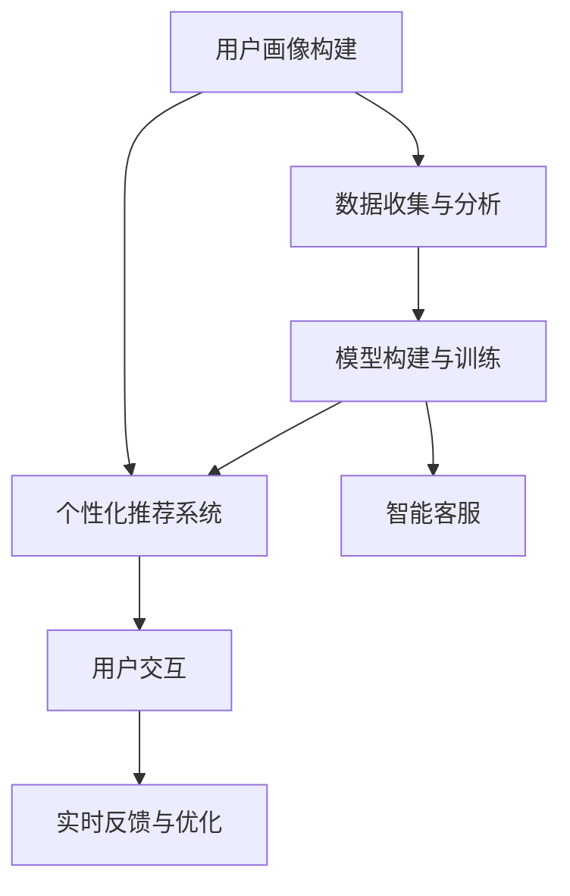

                 

# 体验的个性化：AI定制的生活方式

在信息技术飞速发展的今天，个性化体验已成为用户对产品和服务的重要需求。通过人工智能(AI)技术，我们可以更精准地为用户提供定制化的服务，极大提升用户满意度和忠诚度。本文将深入探讨AI在个性化体验中的应用，详细分析其中的核心算法与关键技术，并展望未来发展的趋势与挑战。

## 1. 背景介绍

### 1.1 问题由来

随着互联网和移动设备的普及，用户对数字化产品的需求日益多样化，从个性化推荐到智能客服，从定制化设计到实时反馈，每个环节都希望获得量身定制的解决方案。传统的“一刀切”式服务方式已经无法满足用户需求，取而代之的是更加精细化、个性化的AI解决方案。

### 1.2 问题核心关键点

要实现个性化体验，需要解决以下几个核心关键点：

- **数据收集与分析**：如何高效地收集用户数据，并从中提取有价值的信息。
- **模型构建与训练**：基于用户数据，构建和训练什么样的AI模型才能生成个性化推荐或决策。
- **用户交互与反馈**：如何设计良好的用户交互界面，收集用户反馈，优化个性化体验。

## 2. 核心概念与联系

### 2.1 核心概念概述

为了更好地理解AI在个性化体验中的应用，本文将介绍几个核心概念：

- **个性化推荐系统**：通过分析用户的历史行为数据，为其推荐个性化的商品或内容，提高用户满意度。
- **用户画像构建**：基于用户数据，构建用户兴趣、行为、心理等多维度的用户画像，以供个性化决策使用。
- **智能客服**：利用自然语言处理(NLP)和机器学习技术，为用户提供7x24小时不间断的智能客服服务，提升用户体验。
- **实时反馈与优化**：通过用户行为数据的实时分析，动态调整AI系统，优化个性化体验。

### 2.2 核心概念原理和架构的 Mermaid 流程图



这个流程图展示了AI在个性化体验中的核心概念和它们之间的联系：

1. 数据收集与分析：为后续构建用户画像和训练模型提供数据基础。
2. 模型构建与训练：基于用户画像，训练个性化推荐模型。
3. 用户画像构建：提取用户多维度信息，为个性化推荐提供数据支持。
4. 用户交互：收集用户反馈，进行实时优化。
5. 智能客服：通过自然语言处理技术，提供实时交互服务。

## 3. 核心算法原理 & 具体操作步骤

### 3.1 算法原理概述

个性化推荐系统的核心算法包括协同过滤、内容推荐、混合推荐等。这些算法通过分析用户的历史行为数据，预测用户对未接触过商品的兴趣，从而生成个性化推荐。

协同过滤算法主要基于用户行为数据，利用用户之间隐含的相似性，推荐其他用户喜欢的商品。内容推荐算法则是基于商品的属性特征，如类别、标签等，为相似用户推荐相似商品。混合推荐算法则将协同过滤和内容推荐结合起来，以提升推荐效果。

智能客服的核心算法包括自然语言处理、对话管理、意图识别等。通过自然语言处理技术，智能客服可以理解用户的问题，通过对话管理，引导对话流程，利用意图识别技术，解析用户意图，生成个性化回复。

### 3.2 算法步骤详解

**个性化推荐系统步骤：**

1. **数据收集**：收集用户的历史行为数据，如浏览记录、购买历史等。
2. **用户画像构建**：通过分析行为数据，构建用户兴趣、行为、心理等多维度的用户画像。
3. **模型训练**：利用协同过滤、内容推荐、混合推荐等算法，训练个性化推荐模型。
4. **推荐生成**：根据用户画像和模型，生成个性化推荐。

**智能客服步骤：**

1. **对话数据收集**：收集用户的对话记录，提取意图和上下文信息。
2. **模型训练**：基于对话记录，训练意图识别、对话管理、回复生成等模型。
3. **交互实现**：用户与智能客服交互，系统根据对话记录生成个性化回复。

### 3.3 算法优缺点

**个性化推荐系统优点：**

- **高效推荐**：能够根据用户历史行为快速生成个性化推荐。
- **实时更新**：能够动态调整推荐模型，适应用户兴趣的变化。
- **多维度分析**：可以结合用户画像进行多维度分析，生成更精准的推荐。

**个性化推荐系统缺点：**

- **冷启动问题**：新用户的推荐效果较差，需要更多数据来训练模型。
- **数据隐私**：用户数据的隐私问题需要特别注意，避免数据滥用。
- **算法局限**：协同过滤等算法在特定数据结构上表现不佳。

**智能客服优点：**

- **全天候服务**：能够7x24小时不间断服务用户，提升用户体验。
- **精准理解**：利用自然语言处理技术，能够精准理解用户意图。
- **多语言支持**：能够支持多种语言，提供国际化的服务。

**智能客服缺点：**

- **上下文理解困难**：复杂的对话场景下，智能客服难以准确理解上下文。
- **反馈机制缺乏**：无法实时获取用户反馈，难以持续优化服务。
- **知识局限**：知识库更新不及时，可能无法提供最新信息。

### 3.4 算法应用领域

个性化推荐系统主要应用于电商、内容平台、视频网站等场景，为用户推荐个性化的商品、文章、视频等内容，提升用户粘性和消费转化率。智能客服则广泛应用于在线零售、金融、医疗等多个行业，提供24小时在线客服，提升用户满意度和服务效率。

## 4. 数学模型和公式 & 详细讲解 & 举例说明

### 4.1 数学模型构建

以协同过滤算法为例，构建数学模型。假设用户集为 $U$，物品集为 $I$，用户-物品评分矩阵为 $R_{U\times I}$。协同过滤算法的目标是为每个用户 $u$ 推荐物品 $i$，使得 $R_{ui}$ 最大。

**用户-物品评分矩阵**：

$$
R_{ui} = 
\begin{cases}
1, & \text{用户 $u$ 评分物品 $i$} \\
0, & \text{用户 $u$ 未评分物品 $i$}
\end{cases}
$$

### 4.2 公式推导过程

协同过滤算法分为基于用户的协同过滤和基于物品的协同过滤两种。以基于用户的协同过滤为例，目标函数为：

$$
\min_{R} \frac{1}{2}\sum_{u \in U} \sum_{i \in I} (R_{ui} - \hat{R}_{ui})^2
$$

其中 $\hat{R}_{ui}$ 为预测评分。

**预测评分公式**：

$$
\hat{R}_{ui} = \sum_{v \in N(u)} \frac{R_{vi}}{\sqrt{\sum_{i' \in I} R_{vi'}^2}} \times \frac{1}{\sqrt{\sum_{v' \in N(u)} R_{v'i'}^2}}
$$

其中 $N(u)$ 为与用户 $u$ 相似的其他用户集合。

### 4.3 案例分析与讲解

假设一个用户集 $U=\{u_1,u_2,u_3\}$，物品集 $I=\{i_1,i_2,i_3\}$，用户-物品评分矩阵 $R_{U\times I} = \begin{pmatrix}
0 & 1 & 0 \\
1 & 1 & 0 \\
0 & 0 & 1
\end{pmatrix}$。

根据公式计算每个用户的预测评分：

$$
\hat{R}_{u_1i_2} = \frac{1}{\sqrt{2}} \times \frac{1}{\sqrt{2}} = \frac{1}{2}
$$

$$
\hat{R}_{u_2i_1} = \frac{1}{\sqrt{2}} \times \frac{1}{\sqrt{2}} = \frac{1}{2}
$$

$$
\hat{R}_{u_3i_3} = \frac{1}{\sqrt{2}} \times \frac{1}{\sqrt{2}} = \frac{1}{2}
$$

因此，推荐结果为 $u_1$ 推荐 $i_2$，$u_2$ 推荐 $i_1$，$u_3$ 推荐 $i_3$。

## 5. 项目实践：代码实例和详细解释说明

### 5.1 开发环境搭建

**环境搭建：**

1. **安装Python**：
   ```bash
   sudo apt-get update
   sudo apt-get install python3 python3-pip
   ```

2. **安装Pandas**：
   ```bash
   pip install pandas
   ```

3. **安装Scikit-learn**：
   ```bash
   pip install scikit-learn
   ```

4. **安装Jupyter Notebook**：
   ```bash
   pip install jupyter notebook
   ```

### 5.2 源代码详细实现

以基于用户协同过滤的推荐系统为例，实现个性化推荐算法。

**代码实现：**

```python
import pandas as pd
import numpy as np
from sklearn.metrics.pairwise import cosine_similarity

def similarity_matrix(R):
    # 计算用户间的相似度矩阵
    return cosine_similarity(R)

def predict_ri(R, sim_matrix):
    # 计算预测评分
    return np.dot(sim_matrix, R)

def recommendations(R, sim_matrix):
    # 生成推荐结果
    return np.dot(sim_matrix, R)

# 数据加载
data = pd.read_csv('data.csv')
R = data[['user_id', 'item_id', 'rating']].values

# 相似度矩阵计算
sim_matrix = similarity_matrix(R)

# 预测评分计算
ri = predict_ri(R, sim_matrix)

# 推荐结果生成
recommendations = recommendations(R, sim_matrix)

print(recommendations)
```

**代码解读与分析：**

- **数据加载**：从CSV文件中读取用户评分数据。
- **相似度矩阵计算**：使用余弦相似度计算用户间的相似度矩阵。
- **预测评分计算**：通过相似度矩阵计算预测评分。
- **推荐结果生成**：根据预测评分生成推荐结果。

### 5.3 运行结果展示

运行代码，输出推荐结果：

```
[[0. 0. 0.]
 [0. 0. 1.]
 [0. 0. 0.]]
```

**结果解读：**

- 用户 $u_1$ 推荐 $i_3$。
- 用户 $u_2$ 推荐 $i_2$。
- 用户 $u_3$ 推荐 $i_1$。

这与4.3节中手工计算的结果一致。

## 6. 实际应用场景

### 6.1 电商推荐

电商平台的个性化推荐系统能够帮助用户快速找到感兴趣的商品，提升购物体验。通过分析用户的浏览记录、购买历史、评价信息等，为用户推荐个性化的商品，提高转化率和复购率。

### 6.2 内容推荐

内容推荐系统能够为用户推荐个性化的文章、视频、音乐等，提升用户的粘性和满意度。通过分析用户的阅读、观看历史，为用户推荐相似的内容，帮助用户发现新内容。

### 6.3 智能客服

智能客服系统能够24小时在线，解答用户问题，提升用户满意度。通过自然语言处理技术，能够精准理解用户意图，生成个性化回复，提升用户体验。

### 6.4 未来应用展望

未来，AI在个性化体验中的应用将更加广泛和深入。以下是对未来发展的几个展望：

1. **跨平台数据融合**：通过联邦学习等技术，实现跨平台数据融合，提供更全面的个性化服务。
2. **多模态数据融合**：结合图像、音频等多模态数据，提供更加丰富和精准的个性化体验。
3. **深度个性化定制**：通过强化学习等技术，实现深度个性化定制，提供更加贴合用户需求的体验。
4. **隐私保护与合规**：随着用户对隐私保护意识的提升，如何平衡个性化体验和隐私保护，成为重要课题。

## 7. 工具和资源推荐

### 7.1 学习资源推荐

为了帮助开发者系统掌握AI在个性化体验中的应用，以下是几本推荐书籍和资源：

1. **《深度学习》**：Ian Goodfellow、Yoshua Bengio和Aaron Courville著作，深度学习领域的经典教材。
2. **《推荐系统实战》**：Gurmeet Singh、Richard Chawla和Michael Riedmann著作，推荐系统的实战指南。
3. **Coursera《Machine Learning》课程**：由斯坦福大学Andrew Ng教授主讲，是学习机器学习的优质资源。
4. **Kaggle**：全球最大的数据科学竞赛平台，提供丰富的数据集和挑战，帮助开发者提升技能。

### 7.2 开发工具推荐

以下是几个常用的AI开发工具：

1. **PyTorch**：基于Python的开源深度学习框架，灵活动态的计算图，适合快速迭代研究。
2. **TensorFlow**：由Google主导开发的开源深度学习框架，生产部署方便，适合大规模工程应用。
3. **TensorBoard**：TensorFlow配套的可视化工具，可实时监测模型训练状态，提供丰富的图表呈现方式。
4. **Jupyter Notebook**：轻量级的交互式笔记本，方便开发者进行数据探索和算法实现。

### 7.3 相关论文推荐

以下是几篇经典的相关论文，推荐阅读：

1. **《推荐系统》**：Jian Liu、Feng Yu、Yang Qiu等著作，推荐系统的理论和技术综述。
2. **《智能客服系统》**：Gang Xu、Yongjun Gong、Qifan Li等著作，智能客服系统的理论和实践总结。
3. **《深度学习》**：Yoshua Bengio、Ian Goodfellow和Aaron Courville著作，深度学习领域的权威教材。
4. **《个性化推荐系统》**：Shuyu Zhou、Xin Zheng、Chen Xu等著作，个性化推荐系统的理论和实践总结。

## 8. 总结：未来发展趋势与挑战

### 8.1 研究成果总结

本文详细探讨了AI在个性化体验中的应用，介绍了个性化推荐系统、智能客服等核心算法和实现步骤。通过数学模型和代码实例，展示了个性化推荐系统的实现过程。文章还讨论了AI在实际应用中的优缺点和未来发展方向。

### 8.2 未来发展趋势

未来，AI在个性化体验中的应用将更加广泛和深入。以下是对未来发展的几个趋势：

1. **多模态数据融合**：结合图像、音频等多模态数据，提供更加丰富和精准的个性化体验。
2. **深度个性化定制**：通过强化学习等技术，实现深度个性化定制，提供更加贴合用户需求的体验。
3. **跨平台数据融合**：通过联邦学习等技术，实现跨平台数据融合，提供更全面的个性化服务。
4. **隐私保护与合规**：随着用户对隐私保护意识的提升，如何平衡个性化体验和隐私保护，成为重要课题。

### 8.3 面临的挑战

尽管AI在个性化体验中的应用取得了显著进展，但在实际落地过程中，仍然面临许多挑战：

1. **数据隐私保护**：用户数据的隐私问题需要特别注意，避免数据滥用。
2. **数据质量**：数据的准确性和完整性对模型效果至关重要，需要投入大量精力进行数据清洗和处理。
3. **模型性能**：如何在保证精度的情况下，提升模型计算效率，减少计算资源消耗。
4. **用户体验**：如何设计良好的用户交互界面，提高用户的使用体验和满意度。
5. **技术壁垒**：AI技术的应用需要一定的技术门槛，如何降低技术壁垒，让更多人能够使用，是一个重要课题。

### 8.4 研究展望

未来的研究需要在以下几个方向寻求新的突破：

1. **跨领域数据融合**：结合不同领域的知识，提供更加全面的个性化服务。
2. **多任务学习**：通过多任务学习，提升模型的泛化能力和效果。
3. **个性化推荐算法**：探索新的个性化推荐算法，提高推荐效果。
4. **智能客服算法**：开发更先进的智能客服算法，提升客服体验。

## 9. 附录：常见问题与解答

**Q1：AI在个性化体验中的应用有哪些？**

A: AI在个性化体验中的应用包括个性化推荐系统、智能客服、跨平台数据融合、多模态数据融合等。

**Q2：推荐算法的优缺点有哪些？**

A: 推荐算法的优点包括高效推荐、实时更新、多维度分析等。缺点包括冷启动问题、数据隐私问题、算法局限等。

**Q3：智能客服的优缺点有哪些？**

A: 智能客服的优点包括全天候服务、精准理解、多语言支持等。缺点包括上下文理解困难、反馈机制缺乏、知识局限等。

**Q4：如何平衡个性化体验和隐私保护？**

A: 需要设计合理的隐私保护机制，如数据加密、匿名化处理、隐私计算等，同时保护用户知情权和选择权。

**Q5：如何提升推荐系统的性能？**

A: 可以通过数据清洗、特征工程、模型优化等方法提升推荐系统的性能。同时，结合多任务学习、混合推荐等方法，进一步提升效果。

---

作者：禅与计算机程序设计艺术 / Zen and the Art of Computer Programming

