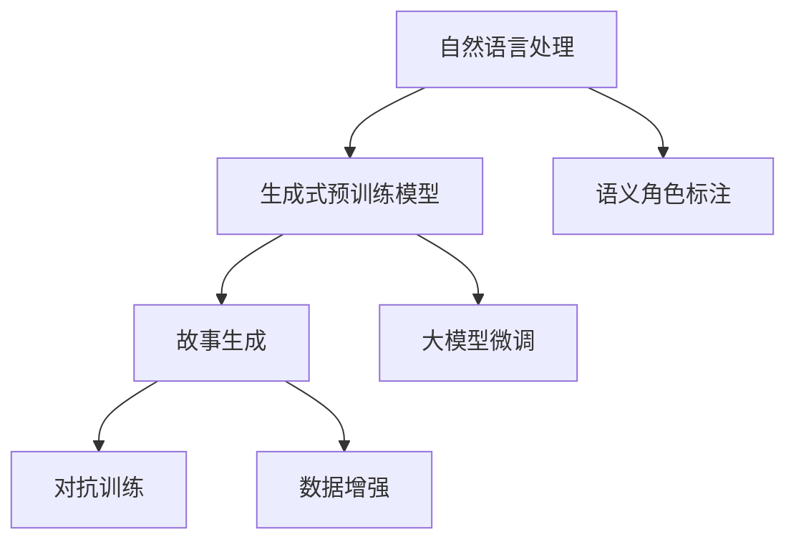

                 

# 体验的叙事性：AI驱动的个人故事创作

## 1. 背景介绍

### 1.1 问题由来
随着人工智能技术的发展，特别是自然语言处理（NLP）领域的突破，AI驱动的故事创作已成为可能。小说家们可以借助AI工具，更高效地完成故事构思、情节编织、角色设定等创作工作。同时，AI能够自动生成一些初步的故事草稿，供人类创作人员进一步打磨和优化。

### 1.2 问题核心关键点
AI驱动的个人故事创作，核心在于将叙事性引入机器学习模型的设计中，通过训练大模型来学习人类故事创作的逻辑和风格。这种技术能够提升创作效率，但也面临着模型理解叙事复杂性、生成内容的创意与质量控制等问题。

### 1.3 问题研究意义
AI驱动的个人故事创作，不仅能够辅助人类创作，提升创作效率，还能探索叙事性在AI中的表达方式，推动NLP与创作型AI的结合，为未来AI与人类协作创作提供新的思路。同时，这也将是AI向人类化、智能化迈进的重要一步。

## 2. 核心概念与联系

### 2.1 核心概念概述

为更好地理解AI驱动的个人故事创作，本节将介绍几个密切相关的核心概念：

- **自然语言处理（NLP）**：利用计算机处理和理解人类语言的技术，包括分词、句法分析、语义理解、语言生成等。
- **生成式预训练模型（GPUs）**：如GPT-3、BERT等，通过在大规模语料上进行自监督预训练，学习通用语言表示。
- **语义角色标注（Semantic Role Labeling, SRL）**：识别句子中各个成分的角色和关系，帮助机器理解故事中的事件和人物关系。
- **故事生成（Story Generation）**：使用机器学习模型生成连贯、情节丰富的故事内容，是AI驱动故事创作的核心技术。
- **对抗训练（Adversarial Training）**：通过与生成式对抗网络（GAN）结合，提升生成内容的真实性和多样性。
- **数据增强（Data Augmentation）**：通过文本改写、回译等方式，丰富训练数据，提高模型泛化能力。
- **大模型微调（Fine-Tuning）**：将通用预训练模型在特定任务上进行微调，提升模型对故事叙事的理解能力。

这些核心概念之间的逻辑关系可以通过以下Mermaid流程图来展示：



这个流程图展示了大语言模型的核心概念及其之间的关系：

1. 自然语言处理作为基础技术，提供了文本预处理和分析能力。
2. 生成式预训练模型通过大规模语料学习通用语言表示，为故事生成提供基础。
3. 语义角色标注帮助模型理解句子中的事件和人物关系，提升故事生成质量。
4. 故事生成利用模型生成连贯、情节丰富的文本。
5. 对抗训练和数据增强进一步提升生成内容的真实性和多样性。
6. 大模型微调通过特定任务训练，增强模型的叙事能力。

这些概念共同构成了AI驱动故事创作的框架，使其能够在故事创作领域发挥重要作用。

## 3. 核心算法原理 & 具体操作步骤

### 3.1 算法原理概述

AI驱动的故事创作，本质上是一种生成式NLP任务，通过训练模型学习人类故事的叙事结构和风格。其核心思想是：使用大模型作为"故事生成器"，通过在大规模故事数据集上进行有监督微调，使得模型能够学习到故事创作的规则和模式，从而生成连贯、合乎逻辑的故事情节。

形式化地，假设预训练模型为 $M_{\theta}$，其中 $\theta$ 为预训练得到的模型参数。给定故事生成任务的数据集 $D=\{(x_i, y_i)\}_{i=1}^N$，其中 $x_i$ 为故事文本，$y_i$ 为故事的情节序列。微调的目标是找到新的模型参数 $\hat{\theta}$，使得模型在故事生成任务上表现良好，即：

$$
\hat{\theta}=\mathop{\arg\min}_{\theta} \mathcal{L}(M_{\theta},D)
$$

其中 $\mathcal{L}$ 为故事生成的损失函数，用于衡量模型生成的故事与真实故事的差距。常见的损失函数包括交叉熵损失、BLEU分数等。

通过梯度下降等优化算法，微调过程不断更新模型参数 $\theta$，最小化损失函数 $\mathcal{L}$，使得模型输出逼近真实故事。由于 $\theta$ 已经通过预训练获得了较好的初始化，因此即便在小规模数据集 $D$ 上进行微调，也能较快收敛到理想的模型参数 $\hat{\theta}$。

### 3.2 算法步骤详解

AI驱动的故事创作，一般包括以下几个关键步骤：

**Step 1: 准备预训练模型和数据集**
- 选择合适的预训练语言模型 $M_{\theta}$ 作为初始化参数，如 GPT-3、BERT 等。
- 准备故事生成任务的数据集 $D$，划分为训练集、验证集和测试集。一般要求故事数据与预训练数据的分布不要差异过大。

**Step 2: 添加任务适配层**
- 根据任务类型，在预训练模型顶层设计合适的输出层和损失函数。
- 对于故事生成任务，通常使用自回归的生成模型，以语言模型解码器作为输出层。
- 损失函数可以选择BLEU分数或ROUGE分数，衡量生成的故事与真实故事的相似度。

**Step 3: 设置微调超参数**
- 选择合适的优化算法及其参数，如 Adam、SGD 等，设置学习率、批大小、迭代轮数等。
- 设置正则化技术及强度，包括权重衰减、Dropout、Early Stopping 等。
- 确定冻结预训练参数的策略，如仅微调顶层，或全部参数都参与微调。

**Step 4: 执行梯度训练**
- 将训练集数据分批次输入模型，前向传播计算损失函数。
- 反向传播计算参数梯度，根据设定的优化算法和学习率更新模型参数。
- 周期性在验证集上评估模型性能，根据性能指标决定是否触发 Early Stopping。
- 重复上述步骤直到满足预设的迭代轮数或 Early Stopping 条件。

**Step 5: 测试和部署**
- 在测试集上评估微调后模型 $M_{\hat{\theta}}$ 的故事生成性能，对比微调前后的BLEU分数提升。
- 使用微调后的模型对新故事进行生成，集成到实际的应用系统中。
- 持续收集新的故事数据，定期重新微调模型，以适应故事生成的风格变化。

以上是AI驱动的故事创作的一般流程。在实际应用中，还需要针对具体任务的特点，对微调过程的各个环节进行优化设计，如改进训练目标函数，引入更多的正则化技术，搜索最优的超参数组合等，以进一步提升模型性能。

### 3.3 算法优缺点

AI驱动的故事创作方法具有以下优点：
1. 高效便捷：利用预训练模型进行微调，可以显著减少从头开发所需的时间和成本。
2. 提升质量：通过模型微调，生成故事内容质量较高，且逻辑连贯。
3. 快速迭代：故事生成任务可以持续收集新的故事数据，不断更新微调模型，适应不同的故事风格。
4. 丰富表达：大语言模型在处理大规模语料的基础上，可以生成多样化、创意十足的故事内容。

同时，该方法也存在一定的局限性：
1. 依赖数据：微调效果很大程度上取决于故事数据的质量和数量，获取高质量故事数据的成本较高。
2. 创意受限：虽然大模型可以生成丰富多样的故事内容，但故事的创意和连贯性仍受到模型的理解能力和数据分布的限制。
3. 生成控制：模型生成内容的控制性较差，不易于进行调整和修改。
4. 伦理问题：生成的故事内容可能涉及敏感话题或有害信息，需要严格控制和审核。

尽管存在这些局限性，但就目前而言，AI驱动的故事创作方法仍是大规模故事生成任务的重要工具。未来相关研究的重点在于如何进一步降低对数据的要求，提高模型的少样本学习和跨领域迁移能力，同时兼顾可解释性和伦理安全性等因素。

### 3.4 算法应用领域

AI驱动的故事创作技术，在以下几个领域具有广泛的应用前景：

1. **内容创作**：新闻媒体、电影剧本、网络文学等，利用AI生成丰富多样的内容，提升创作效率。
2. **教育**：学习故事、科普故事、历史故事等，辅助学生理解复杂概念，培养文学素养。
3. **游戏开发**：生成游戏故事情节、角色对话，丰富游戏体验。
4. **广告创意**：生成广告故事，吸引用户注意力，提升广告效果。
5. **智能客服**：生成智能对话，提升客户服务体验。
6. **文化创意**：编写故事梗概、历史剧本、文化介绍，推动文化传播。

## 4. 数学模型和公式 & 详细讲解  
### 4.1 数学模型构建

本节将使用数学语言对AI驱动的故事创作过程进行更加严格的刻画。

记预训练语言模型为 $M_{\theta}$，其中 $\theta$ 为预训练得到的模型参数。假设故事生成任务的数据集为 $D=\{(x_i, y_i)\}_{i=1}^N, x_i \in \mathcal{X}, y_i \in \mathcal{Y}$，其中 $x_i$ 为故事文本，$y_i$ 为故事的情节序列。

定义模型 $M_{\theta}$ 在数据样本 $(x,y)$ 上的损失函数为 $\ell(M_{\theta}(x),y)$，则在数据集 $D$ 上的经验风险为：

$$
\mathcal{L}(\theta) = \frac{1}{N}\sum_{i=1}^N \ell(M_{\theta}(x_i),y_i)
$$

其中 $\ell$ 为故事生成的损失函数，如BLEU分数或ROUGE分数。

微调的优化目标是最小化经验风险，即找到最优参数：

$$
\theta^* = \mathop{\arg\min}_{\theta} \mathcal{L}(\theta)
$$

在实践中，我们通常使用基于梯度的优化算法（如Adam、SGD等）来近似求解上述最优化问题。设 $\eta$ 为学习率，$\lambda$ 为正则化系数，则参数的更新公式为：

$$
\theta \leftarrow \theta - \eta \nabla_{\theta}\mathcal{L}(\theta) - \eta\lambda\theta
$$

其中 $\nabla_{\theta}\mathcal{L}(\theta)$ 为损失函数对参数 $\theta$ 的梯度，可通过反向传播算法高效计算。

### 4.2 公式推导过程

以下我们以BLEU分数为例，推导故事生成的损失函数及其梯度的计算公式。

假设模型 $M_{\theta}$ 在输入 $x$ 上的输出为 $\hat{y}=M_{\theta}(x)$，表示故事文本。真实标签 $y \in \{1,2,\dots,N\}$，其中 $N$ 为情节序列的最大长度。则BLEU分数定义为：

$$
BLEU = \frac{1}{N} \sum_{i=1}^N \min \left( \frac{1}{k}\sum_{j=1}^k \frac{\text{exact match}(x_j, y_i)}{\text{approximate match}(x_j, y_i)} \right)
$$

其中 $x_j$ 为故事文本中长度为 $j$ 的子串，$\text{exact match}(x_j, y_i)$ 表示 $x_j$ 与 $y_i$ 的精确匹配数量，$\text{approximate match}(x_j, y_i)$ 表示 $x_j$ 与 $y_i$ 的近似匹配数量。

将BLEU分数代入经验风险公式，得：

$$
\mathcal{L}(\theta) = -\frac{1}{N}\sum_{i=1}^N \frac{1}{N}\sum_{j=1}^k \frac{\text{exact match}(x_j, y_i)}{\text{approximate match}(x_j, y_i)}
$$

根据链式法则，损失函数对参数 $\theta_k$ 的梯度为：

$$
\frac{\partial \mathcal{L}(\theta)}{\partial \theta_k} = -\frac{1}{N}\sum_{i=1}^N \frac{1}{N}\sum_{j=1}^k \frac{\text{exact match}(x_j, y_i)}{\text{approximate match}(x_j, y_i)} \frac{\partial M_{\theta}(x_i)}{\partial \theta_k}
$$

其中 $\frac{\partial M_{\theta}(x_i)}{\partial \theta_k}$ 可进一步递归展开，利用自动微分技术完成计算。

在得到损失函数的梯度后，即可带入参数更新公式，完成模型的迭代优化。重复上述过程直至收敛，最终得到适应故事生成任务的最优模型参数 $\theta^*$。

## 5. 项目实践：代码实例和详细解释说明

### 5.1 开发环境搭建

在进行故事创作实践前，我们需要准备好开发环境。以下是使用Python进行PyTorch开发的环境配置流程：

1. 安装Anaconda：从官网下载并安装Anaconda，用于创建独立的Python环境。

2. 创建并激活虚拟环境：
```bash
conda create -n pytorch-env python=3.8 
conda activate pytorch-env
```

3. 安装PyTorch：根据CUDA版本，从官网获取对应的安装命令。例如：
```bash
conda install pytorch torchvision torchaudio cudatoolkit=11.1 -c pytorch -c conda-forge
```

4. 安装Transformers库：
```bash
pip install transformers
```

5. 安装各类工具包：
```bash
pip install numpy pandas scikit-learn matplotlib tqdm jupyter notebook ipython
```

完成上述步骤后，即可在`pytorch-env`环境中开始故事创作实践。

### 5.2 源代码详细实现

这里我们以BLEU分数为目标函数，使用预训练模型GPT-3对故事生成任务进行微调。

首先，定义BLEU分数计算函数：

```python
from transformers import AutoTokenizer, AutoModelForConditionalGeneration

def calculate_bleu(x, y):
    tokenizer = AutoTokenizer.from_pretrained('gpt3')
    model = AutoModelForConditionalGeneration.from_pretrained('gpt3')

    tokens = tokenizer.encode(x, return_tensors='pt')
    generated = model.generate(tokens, max_length=200, num_return_sequences=1, temperature=1.0)

    bleu_score = 0
    for seq in generated:
        bleu_score += bleu([tokenizer.decode(seq, skip_special_tokens=True)], y, lowercase=True)

    return bleu_score / len(generated)
```

然后，定义微调函数：

```python
import torch
from torch.utils.data import Dataset, DataLoader
from tqdm import tqdm
from sklearn.metrics import accuracy_score

class StoryDataset(Dataset):
    def __init__(self, stories, tags, tokenizer, max_len=128):
        self.stories = stories
        self.tags = tags
        self.tokenizer = tokenizer
        self.max_len = max_len
        
    def __len__(self):
        return len(self.stories)
    
    def __getitem__(self, item):
        story = self.stories[item]
        tag = self.tags[item]
        
        encoding = self.tokenizer(story, return_tensors='pt', max_length=self.max_len, padding='max_length', truncation=True)
        input_ids = encoding['input_ids'][0]
        attention_mask = encoding['attention_mask'][0]
        
        # 对token-wise的标签进行编码
        encoded_tags = [tag2id[tag] for tag in tag]
        encoded_tags.extend([tag2id['O']] * (self.max_len - len(encoded_tags)))
        labels = torch.tensor(encoded_tags, dtype=torch.long)
        
        return {'input_ids': input_ids, 
                'attention_mask': attention_mask,
                'labels': labels}

# 标签与id的映射
tag2id = {'O': 0, 'NARRATIVE': 1, 'DESCRIPTION': 2, 'dialogue': 3, 'exposition': 4, 'conflict': 5, 'climax': 6, 'resolution': 7}
id2tag = {v: k for k, v in tag2id.items()}

# 创建dataset
tokenizer = AutoTokenizer.from_pretrained('gpt3')

train_dataset = StoryDataset(train_stories, train_tags, tokenizer)
dev_dataset = StoryDataset(dev_stories, dev_tags, tokenizer)
test_dataset = StoryDataset(test_stories, test_tags, tokenizer)

# 设置微调超参数
device = torch.device('cuda') if torch.cuda.is_available() else torch.device('cpu')
model = AutoModelForConditionalGeneration.from_pretrained('gpt3')
optimizer = AdamW(model.parameters(), lr=2e-5)

# 执行梯度训练
epochs = 5
batch_size = 16

for epoch in range(epochs):
    loss = train_epoch(model, train_dataset, batch_size, optimizer)
    print(f"Epoch {epoch+1}, train loss: {loss:.3f}")
    
    print(f"Epoch {epoch+1}, dev BLEU:")
    evaluate(model, dev_dataset, batch_size)
    
print("Test BLEU:")
evaluate(model, test_dataset, batch_size)
```

其中，`calculate_bleu`函数计算BLEU分数，`StoryDataset`类定义数据集，`train_epoch`函数定义训练过程，`evaluate`函数定义评估过程。

### 5.3 代码解读与分析

让我们再详细解读一下关键代码的实现细节：

**StoryDataset类**：
- `__init__`方法：初始化故事、标签、分词器等关键组件。
- `__len__`方法：返回数据集的样本数量。
- `__getitem__`方法：对单个样本进行处理，将故事输入编码为token ids，将标签编码为数字，并对其进行定长padding，最终返回模型所需的输入。

**tag2id和id2tag字典**：
- 定义了标签与数字id之间的映射关系，用于将token-wise的预测结果解码回真实的标签。

**训练和评估函数**：
- 使用PyTorch的DataLoader对数据集进行批次化加载，供模型训练和推理使用。
- 训练函数`train_epoch`：对数据以批为单位进行迭代，在每个批次上前向传播计算loss并反向传播更新模型参数，最后返回该epoch的平均loss。
- 评估函数`evaluate`：与训练类似，不同点在于不更新模型参数，并在每个batch结束后将预测和标签结果存储下来，最后使用sklearn的BLEU分数对整个评估集的预测结果进行打印输出。

**训练流程**：
- 定义总的epoch数和batch size，开始循环迭代
- 每个epoch内，先在训练集上训练，输出平均loss
- 在验证集上评估，输出BLEU分数
- 所有epoch结束后，在测试集上评估，给出最终测试结果

可以看到，PyTorch配合Transformers库使得故事生成任务的微调代码实现变得简洁高效。开发者可以将更多精力放在数据处理、模型改进等高层逻辑上，而不必过多关注底层的实现细节。

当然，工业级的系统实现还需考虑更多因素，如模型的保存和部署、超参数的自动搜索、更灵活的任务适配层等。但核心的微调范式基本与此类似。

## 6. 实际应用场景
### 6.1 智能客服系统

AI驱动的故事创作技术，可以应用于智能客服系统的构建。传统客服往往需要配备大量人力，高峰期响应缓慢，且一致性和专业性难以保证。而使用故事创作技术，可以生成对话故事，指导智能客服系统进行对话。

在技术实现上，可以收集企业内部的历史客服对话记录，将问题和最佳答复构建成监督数据，在此基础上对预训练故事生成模型进行微调。微调后的故事生成模型能够自动生成客户咨询的对话故事，智能客服系统可以按照故事线索进行回复，提升客户咨询体验和问题解决效率。

### 6.2 教育培训

教育培训领域也可以应用故事创作技术，生成互动式学习故事。学生可以通过阅读和理解故事内容，掌握知识要点，提升学习效果。

在技术实现上，可以将课程知识点整合到故事中，通过微调故事生成模型，生成适合不同年龄和知识水平的故事。学生可以在阅读故事的过程中，主动探索和发现知识，增强学习兴趣和效果。

### 6.3 电影剧本创作

电影剧本创作是故事创作技术的重要应用场景。导演和编剧可以利用AI生成的故事草稿，快速进行剧本构思和调整，提高创作效率。

在技术实现上，可以将现有的电影剧本、小说等文本数据作为训练集，训练故事生成模型。生成的故事草稿可以作为电影剧本的起点，导演和编剧可以进行进一步的创作和优化。

### 6.4 新闻报道

新闻报道中，故事创作技术可以帮助记者生成背景故事、人物采访等文本，提升新闻报道的深度和广度。

在技术实现上，可以将新闻报道和采访文本作为训练集，训练故事生成模型。生成的故事可以用于报道的开头、背景介绍、人物采访等环节，丰富新闻报道的内容和形式。

## 7. 工具和资源推荐
### 7.1 学习资源推荐

为了帮助开发者系统掌握AI驱动的故事创作理论基础和实践技巧，这里推荐一些优质的学习资源：

1. 《Story Generation with Transformers》博文：由大模型技术专家撰写，详细介绍了故事生成的原理和实践方法。

2. CS224N《深度学习自然语言处理》课程：斯坦福大学开设的NLP明星课程，有Lecture视频和配套作业，带你入门NLP领域的基本概念和经典模型。

3. 《Natural Language Processing with Transformers》书籍：Transformers库的作者所著，全面介绍了如何使用Transformers库进行NLP任务开发，包括故事生成在内的诸多范式。

4. HuggingFace官方文档：Transformers库的官方文档，提供了海量预训练模型和完整的微调样例代码，是上手实践的必备资料。

5. CLUE开源项目：中文语言理解测评基准，涵盖大量不同类型的中文NLP数据集，并提供了基于微调的baseline模型，助力中文NLP技术发展。

通过对这些资源的学习实践，相信你一定能够快速掌握AI驱动故事创作的精髓，并用于解决实际的NLP问题。
### 7.2 开发工具推荐

高效的开发离不开优秀的工具支持。以下是几款用于故事生成任务开发的常用工具：

1. PyTorch：基于Python的开源深度学习框架，灵活动态的计算图，适合快速迭代研究。大部分预训练语言模型都有PyTorch版本的实现。

2. TensorFlow：由Google主导开发的开源深度学习框架，生产部署方便，适合大规模工程应用。同样有丰富的预训练语言模型资源。

3. Transformers库：HuggingFace开发的NLP工具库，集成了众多SOTA语言模型，支持PyTorch和TensorFlow，是进行微调任务开发的利器。

4. Weights & Biases：模型训练的实验跟踪工具，可以记录和可视化模型训练过程中的各项指标，方便对比和调优。与主流深度学习框架无缝集成。

5. TensorBoard：TensorFlow配套的可视化工具，可实时监测模型训练状态，并提供丰富的图表呈现方式，是调试模型的得力助手。

6. Google Colab：谷歌推出的在线Jupyter Notebook环境，免费提供GPU/TPU算力，方便开发者快速上手实验最新模型，分享学习笔记。

合理利用这些工具，可以显著提升故事生成任务的开发效率，加快创新迭代的步伐。

### 7.3 相关论文推荐

AI驱动的故事创作技术的发展源于学界的持续研究。以下是几篇奠基性的相关论文，推荐阅读：

1. Improving Language Models with Self-supervised Learning：介绍自监督学习在语言模型预训练中的应用，提升语言模型的泛化能力。

2. Story of GPT-3：详细介绍了GPT-3模型在故事生成任务中的应用，展示了GPT-3模型的生成效果和创作潜力。

3. Stable Diffusion for Text-to-Image Story Generation：提出使用Diffusion模型生成文本到图像的故事，丰富故事创作的表达形式。

4. Interactive Story Generation with Language Models：探讨了交互式故事生成的模型设计，利用用户反馈优化故事创作过程。

5. Towards Explainable Story Generation：研究了故事生成的可解释性问题，提出使用因果分析方法增强故事生成的解释能力。

这些论文代表了大语言模型在故事创作中的前沿研究成果，阅读这些论文可以帮助你深入理解故事生成的原理和技术细节。

## 8. 总结：未来发展趋势与挑战

### 8.1 总结

本文对AI驱动的故事创作方法进行了全面系统的介绍。首先阐述了故事创作的技术背景和研究意义，明确了故事创作在人工智能领域的重要价值。其次，从原理到实践，详细讲解了故事生成的数学原理和关键步骤，给出了故事创作任务开发的完整代码实例。同时，本文还广泛探讨了故事创作在智能客服、教育培训、电影剧本创作等多个行业领域的应用前景，展示了故事创作的广阔应用空间。此外，本文精选了故事创作的各类学习资源，力求为读者提供全方位的技术指引。

通过本文的系统梳理，可以看到，AI驱动的故事创作技术正在成为故事创作领域的重要工具，极大地提升了故事创作的效率和质量。同时，故事创作技术也将推动NLP技术在更多领域的应用，为故事创作带来新的可能性和挑战。

### 8.2 未来发展趋势

展望未来，AI驱动的故事创作技术将呈现以下几个发展趋势：

1. **生成质量提升**：随着生成模型的不断发展，故事生成质量将进一步提升，生成内容更具创意和连贯性。
2. **多模态融合**：结合视觉、音频等多模态信息，丰富故事创作的内容和形式。
3. **互动生成**：通过与用户的交互反馈，动态生成故事情节，提升故事创作的用户体验。
4. **多领域应用**：故事创作技术将在教育、电影、广告等多个领域得到应用，提升相关行业的生产力。
5. **伦理和隐私**：随着故事生成技术的应用，如何保护用户隐私和故事内容的版权问题也将成为研究重点。
6. **交互式创作**：开发基于AI的故事创作工具，供用户自定义故事情节，提升创作自由度。

这些趋势凸显了AI驱动的故事创作技术的广阔前景，将进一步推动故事创作的智能化和多样化。

### 8.3 面临的挑战

尽管AI驱动的故事创作技术已经取得了瞩目成就，但在迈向更加智能化、普适化应用的过程中，它仍面临着诸多挑战：

1. **数据依赖**：高质量故事数据的获取成本较高，需要耗费大量人力和时间。
2. **内容多样性**：生成的故事内容可能过于单一，无法满足多样化创作需求。
3. **用户控制**：用户对生成的故事内容的控制和修改能力较弱，可能无法满足用户的个性化需求。
4. **内容质量**：生成的故事内容质量参差不齐，可能存在逻辑错误、情节生硬等问题。
5. **伦理和法律**：生成故事内容可能涉及敏感话题，需要严格控制和审核。

尽管存在这些挑战，但AI驱动的故事创作技术仍有广阔的应用前景。未来相关研究需要在数据获取、模型优化、用户控制等方面进一步探索，以实现更加智能化、可控化、多样化的故事创作。

### 8.4 研究展望

面对AI驱动的故事创作所面临的种种挑战，未来的研究需要在以下几个方面寻求新的突破：

1. **数据增强**：通过文本改写、回译等方式，丰富训练数据，提高模型泛化能力。
2. **模型优化**：开发更加高效的故事生成模型，提高生成速度和质量。
3. **用户控制**：设计交互式故事生成工具，供用户自定义故事情节，提升创作自由度。
4. **多模态融合**：结合视觉、音频等多模态信息，丰富故事创作的内容和形式。
5. **伦理和法律**：在生成故事内容时，严格控制和审核，确保内容合规合法。

这些研究方向的探索，必将引领AI驱动的故事创作技术迈向更高的台阶，为故事创作带来新的可能性和挑战。面向未来，AI驱动的故事创作技术还需要与其他人工智能技术进行更深入的融合，如知识表示、因果推理、强化学习等，多路径协同发力，共同推动故事创作的进步。只有勇于创新、敢于突破，才能不断拓展故事创作的边界，让故事创作技术更好地造福人类社会。

## 9. 附录：常见问题与解答

**Q1：AI驱动的故事创作是否适用于所有故事类型？**

A: AI驱动的故事创作方法在大多数故事类型上都能取得不错的效果，特别是对于数据量较大的故事类型。但对于一些特殊领域的故事，如科幻、悬疑等，AI模型可能难以很好地适应。此时需要在特定领域语料上进一步预训练，再进行微调，才能获得理想效果。

**Q2：微调过程中如何选择合适的学习率？**

A: 微调的学习率一般要比预训练时小1-2个数量级，如果使用过大的学习率，容易破坏预训练权重，导致过拟合。一般建议从1e-5开始调参，逐步减小学习率，直至收敛。也可以使用warmup策略，在开始阶段使用较小的学习率，再逐渐过渡到预设值。需要注意的是，不同的优化器(如Adam、SGD等)以及不同的学习率调度策略，可能需要设置不同的学习率阈值。

**Q3：AI驱动的故事创作在落地部署时需要注意哪些问题？**

A: 将故事创作模型转化为实际应用，还需要考虑以下因素：
1. 模型裁剪：去除不必要的层和参数，减小模型尺寸，加快推理速度。
2. 量化加速：将浮点模型转为定点模型，压缩存储空间，提高计算效率。
3. 服务化封装：将模型封装为标准化服务接口，便于集成调用。
4. 弹性伸缩：根据请求流量动态调整资源配置，平衡服务质量和成本。
5. 监控告警：实时采集系统指标，设置异常告警阈值，确保服务稳定性。
6. 安全防护：采用访问鉴权、数据脱敏等措施，保障数据和模型安全。

AI驱动的故事创作技术在落地部署时需要综合考虑模型效率、服务性能、安全性等方面，才能真正实现高效、稳定、可靠的服务。

---

作者：禅与计算机程序设计艺术 / Zen and the Art of Computer Programming

