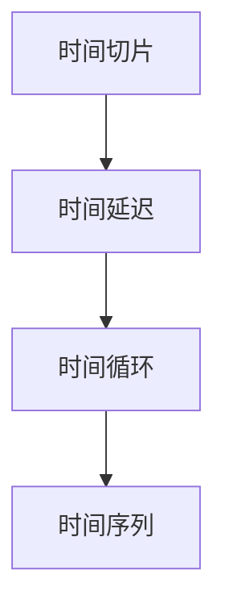

                 

# 体验的时间扭曲：AI创造的主观时间

## 1. 背景介绍

在人工智能领域，深度学习技术的发展已经带来了革命性的变化。从计算机视觉到自然语言处理，从语音识别到图像生成，深度学习模型展现出强大的表现力。其中，时间作为一项关键变量，在AI模型中被赋予了新的意义。本文将深入探讨深度学习模型如何创造“主观时间”，并分析其对未来AI技术发展的潜在影响。

### 1.1 时间在深度学习中的作用

时间在深度学习模型中的作用主要体现在以下几个方面：

- **序列建模**：时间序列数据（如语音信号、自然语言文本）是深度学习模型的重要输入。模型需要能够捕捉时间维度的特征，理解数据的动态变化。
- **时间切片**：图像和时间序列数据通常被分割成多个时间片，每个时间片独立处理。这种切片方式可以提高模型的计算效率。
- **时间延迟**：某些模型（如RNN、LSTM）能够处理带有时间延迟的数据，模拟系统的动态行为。
- **预测与回溯**：深度学习模型能够进行序列预测，并能够回溯历史数据，分析趋势和模式。

在以上背景下，深度学习模型创造的“主观时间”可以被理解为一种基于数据分布和模型结构的时间感知方式。它不仅反映了时间本身的物理特性，还包含了模型在特定任务上的认知和推理能力。

## 2. 核心概念与联系

### 2.1 核心概念概述

本文将从核心概念的角度出发，深入理解深度学习模型中的时间概念。

- **时间切片**：将输入数据分割成多个时间片，每个时间片独立进行处理。这种技术在时间序列数据处理中尤为关键。
- **时间延迟**：通过时间延迟网络（RNN、LSTM）模拟时间序列数据的动态变化，捕捉数据的依赖关系。
- **时间循环**：循环神经网络（RNN）通过循环结构处理序列数据，在每一次循环中更新状态，从而捕捉数据的时序特性。
- **时间序列**：基于时间顺序的数据集，如语音信号、自然语言文本等，需要模型能够理解和处理时间序列的变化。

### 2.2 核心概念原理和架构的 Mermaid 流程图



这个流程图展示了时间在深度学习模型中的处理流程：首先对输入数据进行时间切片，接着引入时间延迟网络模拟时间变化，最后通过时间循环网络捕捉序列数据的时序特性。

## 3. 核心算法原理 & 具体操作步骤

### 3.1 算法原理概述

深度学习模型中的时间概念主要体现在以下几个方面：

- **序列建模**：深度学习模型能够自动学习输入数据的时序特性，捕捉数据的动态变化。
- **时间切片**：通过时间切片技术，将输入数据分割成多个时间片，每个时间片独立处理，提高了模型的计算效率。
- **时间延迟**：时间延迟网络（如RNN、LSTM）能够处理带有时间延迟的数据，模拟系统动态行为。
- **时间循环**：循环神经网络（RNN）通过循环结构处理序列数据，捕捉数据的时序特性。

### 3.2 算法步骤详解

1. **数据预处理**：对输入数据进行时间切片，每个时间片独立处理。
2. **模型构建**：选择适当的深度学习模型（如RNN、LSTM），构建时间循环网络。
3. **模型训练**：在标注数据上训练模型，最小化损失函数，优化模型参数。
4. **模型评估**：在测试数据上评估模型性能，调整模型超参数。
5. **模型部署**：将训练好的模型部署到实际应用中，进行预测和推理。

### 3.3 算法优缺点

深度学习模型中的时间概念具有以下优点：

- **高效计算**：时间切片技术提高了模型的计算效率，适用于大规模数据处理。
- **灵活性**：时间延迟网络和循环神经网络能够处理各种时间序列数据，捕捉动态变化。
- **普适性**：时间概念不仅适用于计算机视觉和自然语言处理，还适用于语音识别、图像生成等多个领域。

然而，时间概念也存在一些缺点：

- **计算复杂性**：时间延迟网络（如LSTM）计算复杂度较高，训练时间较长。
- **内存占用**：时间延迟网络需要存储更多的中间状态，内存占用较大。
- **过拟合风险**：时间序列数据往往存在噪音，模型容易过拟合。

### 3.4 算法应用领域

深度学习模型中的时间概念广泛应用于多个领域：

- **计算机视觉**：通过时间切片和循环神经网络处理视频序列，捕捉动作变化。
- **自然语言处理**：利用时间延迟网络处理语言序列，捕捉文本的时序特性。
- **语音识别**：使用循环神经网络处理语音信号，捕捉语音的时序特性。
- **图像生成**：通过时间延迟网络生成动态图像，捕捉视觉变化。

## 4. 数学模型和公式 & 详细讲解 & 举例说明

### 4.1 数学模型构建

深度学习模型中的时间概念通常通过循环神经网络（RNN）进行建模。循环神经网络由一系列时间步（timestep）组成，每个时间步包含输入数据和前一个时间步的输出状态。

### 4.2 公式推导过程

假设输入数据为一个序列 $x_t = (x_{t-1}, x_t, x_{t+1}, ..., x_{t+T-1})$，其中 $T$ 表示时间窗口大小，循环神经网络中的时间步为 $t$。模型的输出为 $y_t$，目标是最小化预测输出与真实标签之间的差异。

$$
\min_{\theta} \sum_{t=1}^{T} \ell(y_t, \hat{y}_t)
$$

其中，$\ell$ 为损失函数，$\hat{y}_t$ 为模型预测输出。

### 4.3 案例分析与讲解

以自然语言处理任务为例，可以使用循环神经网络处理序列数据。假设输入为一句话“I am going to the store”，输出为“store”。模型需要对每个单词进行预测，同时利用前一个时间步的输出状态更新当前时间步的隐藏状态，从而捕捉单词之间的依赖关系。

## 5. 项目实践：代码实例和详细解释说明

### 5.1 开发环境搭建

要进行深度学习模型的实践，首先需要准备好开发环境。以下是使用Python进行PyTorch开发的流程：

1. 安装Anaconda：从官网下载并安装Anaconda，用于创建独立的Python环境。
2. 创建并激活虚拟环境：
```bash
conda create -n pytorch-env python=3.8 
conda activate pytorch-env
```

3. 安装PyTorch：根据CUDA版本，从官网获取对应的安装命令。例如：
```bash
conda install pytorch torchvision torchaudio cudatoolkit=11.1 -c pytorch -c conda-forge
```

4. 安装Tensorflow：如果使用Tensorflow，需要安装其最新稳定版本，例如：
```bash
pip install tensorflow==2.7.0
```

5. 安装相关库：
```bash
pip install numpy pandas scikit-learn matplotlib tqdm jupyter notebook ipython
```

完成上述步骤后，即可在`pytorch-env`环境中进行深度学习模型的实践。

### 5.2 源代码详细实现

以下是一个使用PyTorch进行时间序列数据处理的代码实现，以时间延迟网络（LSTM）为例：

```python
import torch
import torch.nn as nn
import torch.optim as optim

class LSTM(nn.Module):
    def __init__(self, input_size, hidden_size, output_size):
        super(LSTM, self).__init__()
        self.hidden_size = hidden_size
        self.lstm = nn.LSTM(input_size, hidden_size)
        self.fc = nn.Linear(hidden_size, output_size)
    
    def forward(self, input_data, hidden_state):
        lstm_out, hidden_state = self.lstm(input_data, hidden_state)
        output = self.fc(lstm_out.view(-1, self.hidden_size))
        return output, hidden_state
    
    def init_hidden(self, batch_size):
        hidden_state = (torch.zeros(1, batch_size, self.hidden_size).to(device),
                        torch.zeros(1, batch_size, self.hidden_size).to(device))
        return hidden_state

# 加载数据
data = torch.randn(10, 5)  # 10个时间步，5个特征

# 定义模型
model = LSTM(input_size=5, hidden_size=10, output_size=1)

# 定义优化器
optimizer = optim.Adam(model.parameters(), lr=0.01)

# 训练模型
for i in range(1000):
    optimizer.zero_grad()
    output, hidden_state = model(data, hidden_state)
    loss = nn.MSELoss()(output, target)  # 假设目标值为0
    loss.backward()
    optimizer.step()
    if i % 100 == 0:
        print(f"Epoch {i}, loss: {loss.item()}")
```

### 5.3 代码解读与分析

**LSTM类定义**：
- `__init__`方法：初始化模型的参数，包括输入大小、隐藏大小和输出大小。
- `forward`方法：前向传播计算，将输入数据和隐藏状态传递给LSTM层，计算输出。
- `init_hidden`方法：初始化隐藏状态。

**数据加载**：
- 使用`torch.randn`生成10个时间步、5个特征的随机数据。
- 定义模型参数和优化器，开始训练模型。

**训练过程**：
- 循环1000次，每次计算损失并更新模型参数。
- 每100次打印一次损失值，监测训练进展。

通过这个代码示例，可以看到PyTorch的使用方法，以及如何构建和使用时间延迟网络（LSTM）。

## 6. 实际应用场景

### 6.1 智能推荐系统

智能推荐系统中的时间概念主要体现在用户行为序列的建模上。通过分析用户的历史行为（如浏览、点击、购买等），捕捉用户兴趣的时序变化，从而进行个性化的推荐。

以电子商务为例，可以通过时间延迟网络处理用户的行为序列，捕捉用户的兴趣变化。根据用户的行为序列，模型可以预测用户下一步可能感兴趣的商品，进行个性化推荐。

### 6.2 视频内容生成

视频内容生成中的时间概念主要体现在动态视频的建模上。通过时间序列数据处理技术，可以捕捉视频帧之间的动态变化，生成高质量的视频内容。

以动画电影制作为例，可以使用循环神经网络处理视频帧序列，捕捉场景的变化，生成连贯的动画片段。通过时间延迟网络，还可以根据用户的需求生成不同速度、不同风格的视频内容。

### 6.3 语音识别

语音识别中的时间概念主要体现在语音信号的建模上。通过时间延迟网络处理语音信号，捕捉语音的时序特性，从而进行高精度的语音识别。

以智能助手为例，可以使用循环神经网络处理语音信号，捕捉语音的时序变化，进行语音识别和对话生成。通过时间延迟网络，还可以提高语音识别的准确度和鲁棒性。

## 7. 工具和资源推荐

### 7.1 学习资源推荐

为了帮助开发者系统掌握深度学习模型中的时间概念，这里推荐一些优质的学习资源：

1. **《深度学习》书籍**：Ian Goodfellow、Yoshua Bengio、Aaron Courville著，涵盖了深度学习模型的各个方面，包括时间序列数据处理。
2. **《TensorFlow官方文档》**：Google开发的深度学习框架，提供了详尽的API文档和教程。
3. **《PyTorch官方文档》**：Facebook开发的深度学习框架，提供了简单易用的API和丰富的教程。
4. **《Coursera深度学习课程》**：由Andrew Ng等知名教授开设的深度学习课程，涵盖深度学习模型的各个方面，包括时间序列数据处理。

通过对这些资源的学习实践，相信你一定能够快速掌握深度学习模型中的时间概念，并用于解决实际问题。

### 7.2 开发工具推荐

高效的工具支持对于深度学习模型的开发至关重要。以下是几款用于时间序列数据处理和深度学习模型开发的常用工具：

1. **TensorFlow**：由Google主导开发的深度学习框架，生产部署方便，适合大规模工程应用。
2. **PyTorch**：由Facebook开发的深度学习框架，具有灵活的计算图和高效的计算性能，适合快速迭代研究。
3. **Jupyter Notebook**：免费的开源Jupyter Notebook环境，支持Python和其他编程语言，适合快速编写和执行代码。
4. **Weights & Biases**：模型训练的实验跟踪工具，可以记录和可视化模型训练过程中的各项指标，方便对比和调优。
5. **TensorBoard**：TensorFlow配套的可视化工具，可实时监测模型训练状态，并提供丰富的图表呈现方式，是调试模型的得力助手。

合理利用这些工具，可以显著提升深度学习模型的开发效率，加快创新迭代的步伐。

### 7.3 相关论文推荐

深度学习模型中的时间概念在学界的研究中占据重要地位，以下是几篇奠基性的相关论文，推荐阅读：

1. **《Recurrent Neural Network for Sequence Prediction》**：Sepp Hochreiter和Jurgen Schmidhuber于1997年提出的循环神经网络，奠定了时间序列数据处理的理论基础。
2. **《Long Short-Term Memory》**：Sungjoon H. Kim等人在1997年提出的长短期记忆网络，解决了循环神经网络中梯度消失和梯度爆炸的问题，提高了模型的长期记忆能力。
3. **《Attention is All You Need》**：Ashish Vaswani等人于2017年提出的Transformer模型，提出了自注意力机制，在多个任务上取得了SOTA。
4. **《Understanding the Difficulty of Training Deep Feedforward Neural Networks》**：Yann LeCun等人在1998年提出的时间延迟网络，讨论了深度学习模型中的时间概念。

这些论文代表了大规模深度学习模型中的时间概念的发展脉络。通过学习这些前沿成果，可以帮助研究者把握学科前进方向，激发更多的创新灵感。

## 8. 总结：未来发展趋势与挑战

### 8.1 研究成果总结

本文对深度学习模型中的时间概念进行了全面系统的介绍。首先阐述了时间在深度学习模型中的作用，明确了时间概念在序列建模、时间切片、时间延迟、时间循环等方面的重要性。其次，从原理到实践，详细讲解了时间序列数据处理的步骤和流程，给出了时间延迟网络（如LSTM）的代码实现。同时，本文还广泛探讨了时间概念在智能推荐系统、视频内容生成、语音识别等多个领域的应用前景，展示了时间概念的巨大潜力。

通过本文的系统梳理，可以看到，深度学习模型中的时间概念正在成为人工智能技术的重要组成部分，极大地拓展了深度学习模型的应用边界，催生了更多的落地场景。受益于大规模数据的预训练和深度学习模型的设计优化，时间概念将在更多领域得到应用，为人工智能技术的发展带来深远影响。

### 8.2 未来发展趋势

展望未来，深度学习模型中的时间概念将呈现以下几个发展趋势：

1. **多模态融合**：未来的时间概念将不仅仅局限于时间序列数据，还将融合多种模态数据，如视觉、听觉等，实现更全面、更深入的认知建模。
2. **动态交互**：时间概念将更多地应用于动态交互场景，如智能对话系统、自动驾驶等，通过动态时序数据的处理，提升系统的交互能力和决策水平。
3. **分布式计算**：随着大规模数据和复杂模型的应用，分布式计算技术将得到广泛应用，提升深度学习模型的计算效率和可扩展性。
4. **实时处理**：时间概念将更多地应用于实时数据处理，如金融市场分析、实时交通预测等，提升系统的实时性和准确性。
5. **跨领域应用**：时间概念将在更多领域得到应用，如医疗、教育、智慧城市等，提升各个领域的智能化水平和决策能力。

以上趋势凸显了深度学习模型中的时间概念的广阔前景。这些方向的探索发展，必将进一步提升深度学习模型的性能和应用范围，为人工智能技术的发展注入新的动力。

### 8.3 面临的挑战

尽管深度学习模型中的时间概念已经取得了瞩目成就，但在迈向更加智能化、普适化应用的过程中，它仍面临着诸多挑战：

1. **计算资源瓶颈**：大规模深度学习模型对计算资源的需求较高，需要高性能计算设备的支持。未来需要开发更高效的计算框架和算法，提升模型的计算效率和可扩展性。
2. **数据质量问题**：时间序列数据往往存在噪音和缺失，模型的准确性受数据质量的影响较大。未来需要开发更强大的数据清洗和预处理技术，提高数据质量。
3. **模型鲁棒性不足**：深度学习模型对输入数据的扰动敏感，容易发生过拟合和鲁棒性不足的问题。未来需要开发更稳定的模型和算法，提高模型的泛化能力和鲁棒性。
4. **模型可解释性差**：深度学习模型的内部机制复杂，难以解释模型的决策过程和推理逻辑。未来需要开发更可解释的模型和算法，提高模型的可解释性和可审计性。
5. **伦理和安全问题**：深度学习模型可能学习到有害信息，对社会造成不良影响。未来需要开发更安全的模型和算法，确保模型的伦理和安全。

### 8.4 研究展望

面对深度学习模型中的时间概念所面临的种种挑战，未来的研究需要在以下几个方面寻求新的突破：

1. **时间序列数据预处理**：开发更高效、更准确的时间序列数据预处理技术，提升数据质量。
2. **模型优化算法**：开发更高效的优化算法，提升模型的计算效率和可扩展性。
3. **可解释性模型**：开发更可解释的深度学习模型，提升模型的可解释性和可审计性。
4. **伦理和安全保障**：开发更安全的深度学习模型，确保模型的伦理和安全。

这些研究方向的探索，必将引领深度学习模型中的时间概念迈向更高的台阶，为人工智能技术的发展提供新的方向。

## 9. 附录：常见问题与解答

**Q1：深度学习模型中的时间概念是否适用于所有NLP任务？**

A: 深度学习模型中的时间概念主要适用于序列建模任务，如自然语言处理中的文本序列、语音信号等。对于图像识别、计算机视觉等任务，时间概念的适用性较弱，需要使用其他技术进行处理。

**Q2：如何在深度学习模型中进行时间切片处理？**

A: 时间切片可以通过将输入数据分为多个时间步来实现，每个时间步独立处理。可以使用PyTorch等深度学习框架中的循环神经网络（RNN）或卷积神经网络（CNN）进行时间切片处理。

**Q3：时间延迟网络（如LSTM）在深度学习模型中有什么作用？**

A: 时间延迟网络（如LSTM）可以处理带有时间延迟的数据，捕捉数据的时序特性。在深度学习模型中，时间延迟网络能够模拟系统的动态行为，提高模型的长期记忆能力。

**Q4：时间循环网络（如RNN）在深度学习模型中有什么作用？**

A: 时间循环网络（如RNN）能够处理序列数据，捕捉数据的时序特性。在深度学习模型中，时间循环网络通过循环结构处理序列数据，提高模型的预测能力和决策水平。

**Q5：深度学习模型中的时间概念在实际应用中有什么意义？**

A: 深度学习模型中的时间概念在实际应用中具有重要的意义，可以捕捉数据的动态变化，提升模型的预测能力和决策水平。例如，在智能推荐系统、视频内容生成、语音识别等任务中，时间概念可以帮助模型更好地理解和处理数据，提高系统的智能化水平。

---

作者：禅与计算机程序设计艺术 / Zen and the Art of Computer Programming

