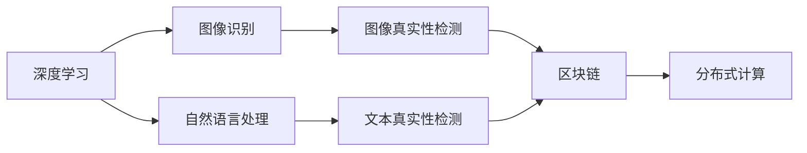

                 

# 体验真实性验证：AI时代的authenticity检测

> 关键词：真实性验证，AI时代，authenticity检测，深度学习，图像识别，自然语言处理，区块链，分布式计算

## 1. 背景介绍

在数字时代，信息的真实性成为了重要的考量因素。无论是在社交媒体上发布的内容，还是在电商平台上购买的商品，真实性验证的重要性不言而喻。然而，随着互联网和人工智能技术的迅猛发展，信息造假和假冒伪劣产品层出不穷，如何有效鉴别真实性，成为了一个亟待解决的问题。

本文将介绍基于人工智能的authenticity检测方法，特别是深度学习在图像识别、自然语言处理等领域的应用。我们将从理论基础、算法原理、项目实践等多个角度进行系统讲解，力求为读者提供深入的见解和实用的工具推荐。

## 2. 核心概念与联系

### 2.1 核心概念概述

authenticity检测是指使用人工智能技术，自动识别和验证信息、物品等的真实性。涉及的核心概念包括：

- **深度学习**：一种机器学习技术，通过多层次的神经网络结构，自动学习数据特征，进行分类、回归等任务。
- **图像识别**：利用深度学习模型，对图像内容进行自动分类、对象检测、场景理解等操作。
- **自然语言处理**：通过深度学习模型，处理和理解自然语言文本，如情感分析、文本分类、问答系统等。
- **区块链**：一种分布式数据库技术，通过加密和共识机制，确保数据的安全性和不可篡改性。
- **分布式计算**：利用多台计算机的协同工作，提高计算效率，解决单个计算机难以处理的复杂问题。

这些概念之间的联系和相互作用，构成了authenticity检测的核心技术框架。通过深度学习进行图像和文本分析，结合区块链和分布式计算技术，可以有效提升真实性验证的准确性和效率。

### 2.2 核心概念原理和架构的 Mermaid 流程图(Mermaid 流程节点中不要有括号、逗号等特殊字符)



这张流程图展示了深度学习、图像识别、自然语言处理、区块链和分布式计算在authenticity检测中的应用。深度学习模型对图像和文本进行特征提取，结合区块链和分布式计算技术，实现真实性验证。

## 3. 核心算法原理 & 具体操作步骤

### 3.1 算法原理概述

authenticity检测的核心算法原理包括以下几个方面：

- **数据预处理**：对原始数据进行去噪、归一化等预处理操作，以提高模型的鲁棒性和泛化能力。
- **特征提取**：使用深度学习模型提取数据中的关键特征，如颜色、形状、文本情感、语言风格等。
- **模型训练**：使用标注数据训练深度学习模型，学习真实与伪造数据之间的区别特征。
- **真实性评估**：将待验证的数据输入训练好的模型，根据输出结果评估其真实性。

### 3.2 算法步骤详解

authenticity检测的算法步骤主要包括以下几个环节：

1. **数据收集与预处理**：收集不同领域的数据，如电商产品图片、社交媒体文本等，并对数据进行清洗、归一化等预处理操作。
2. **特征提取与建模**：使用卷积神经网络(CNN)、循环神经网络(RNN)或Transformer等深度学习模型，对数据进行特征提取和建模。
3. **模型训练与验证**：使用标注数据对模型进行训练，并在验证集上评估模型性能，调整超参数，直到模型收敛。
4. **真实性检测与评估**：将待检测数据输入训练好的模型，得到真实性评估结果，并结合区块链和分布式计算技术，进行数据的去重、一致性验证等操作。

### 3.3 算法优缺点

**优点**：

- **高准确性**：深度学习模型具有较强的特征提取能力，能够准确识别图像、文本中的真实性信息。
- **高效性**：分布式计算技术可以显著提高算力，加速模型训练和推理。
- **安全性**：区块链技术确保数据在传输和存储过程中的安全性和不可篡改性。

**缺点**：

- **高昂成本**：深度学习模型的训练和推理需要高性能计算资源，成本较高。
- **数据依赖**：模型性能依赖于标注数据的质量和数量，标注数据的获取和处理难度较大。
- **模型复杂性**：深度学习模型结构复杂，难以解释，可能存在黑箱问题。

### 3.4 算法应用领域

authenticity检测技术在多个领域都有广泛应用：

- **电商商品验证**：利用图像识别技术，检测商品的真实性，防止假冒伪劣商品的流通。
- **社交媒体内容检测**：使用自然语言处理技术，检测社交媒体内容中的虚假信息和假冒账号。
- **金融欺诈识别**：通过分析交易记录和文本数据，识别金融欺诈行为。
- **版权保护**：利用深度学习模型，检测图像和文本的版权信息，防止侵权行为。

## 4. 数学模型和公式 & 详细讲解 & 举例说明

### 4.1 数学模型构建

authenticity检测的数学模型主要包括深度学习模型和区块链模型两部分：

- **深度学习模型**：通常使用卷积神经网络(CNN)或递归神经网络(RNN)进行特征提取和分类。
- **区块链模型**：使用分布式账本技术，记录和验证数据来源和传输路径。

### 4.2 公式推导过程

以图像识别为例，卷积神经网络的基本公式为：

$$
H = \sigma(W_2\sigma(W_1X + b_1) + b_2)
$$

其中，$X$ 为输入图像，$W_1, W_2$ 为卷积核参数，$b_1, b_2$ 为偏置项，$\sigma$ 为激活函数。

在authenticity检测中，我们通常使用softmax函数对输出结果进行归一化处理：

$$
P(y|X) = \frac{e^{W_y^T\sigma(W_x^TX + b_x)}}{\sum_{j=1}^K e^{W_j^T\sigma(W_x^TX + b_x)}}
$$

其中，$y$ 为真实性类别，$K$ 为类别总数。

### 4.3 案例分析与讲解

以电商商品验证为例，我们可以使用卷积神经网络对商品图片进行特征提取，然后通过softmax函数对图片是否为真品进行分类。同时，可以使用区块链技术记录和验证商品来源和交易信息，确保数据的可信度。

## 5. 项目实践：代码实例和详细解释说明

### 5.1 开发环境搭建

authenticity检测的开发环境搭建包括以下几个步骤：

1. **安装Python和相关库**：安装Anaconda，并使用conda创建虚拟环境。
2. **安装深度学习框架**：使用pip安装TensorFlow、PyTorch等深度学习框架。
3. **安装区块链库**：使用pip安装Bitcoin、Ethereum等区块链库。
4. **安装分布式计算库**：使用pip安装Dask、Apache Spark等分布式计算库。

### 5.2 源代码详细实现

以下是使用TensorFlow进行电商商品验证的示例代码：

```python
import tensorflow as tf
from tensorflow.keras.layers import Conv2D, MaxPooling2D, Flatten, Dense

# 构建卷积神经网络模型
model = tf.keras.Sequential([
    Conv2D(32, (3, 3), activation='relu', input_shape=(64, 64, 3)),
    MaxPooling2D((2, 2)),
    Conv2D(64, (3, 3), activation='relu'),
    MaxPooling2D((2, 2)),
    Flatten(),
    Dense(64, activation='relu'),
    Dense(2, activation='softmax')
])

# 编译模型
model.compile(optimizer='adam', loss='categorical_crossentropy', metrics=['accuracy'])

# 加载数据
train_data = ...
val_data = ...
test_data = ...

# 训练模型
model.fit(train_data, epochs=10, validation_data=val_data)

# 评估模型
model.evaluate(test_data)
```

### 5.3 代码解读与分析

代码中，我们首先使用TensorFlow构建了一个简单的卷积神经网络模型，包括卷积层、池化层和全连接层。然后，我们使用softmax函数对输出结果进行归一化处理，得到真实性分类结果。最后，我们加载数据，训练模型，并在测试集上评估模型性能。

## 6. 实际应用场景

authenticity检测技术在多个实际应用场景中得到了广泛应用：

### 6.1 电商商品验证

电商平台上存在大量的假冒伪劣商品，商家通过盗用真品图片、模仿品牌风格等方式进行欺骗。利用深度学习技术，电商公司可以对商品图片进行自动验证，防止假冒商品流通。例如，Amazon就使用了深度学习模型对商品图片进行真伪判断，显著提高了商品的质量和用户体验。

### 6.2 社交媒体内容检测

社交媒体上充斥着大量的虚假信息和假冒账号，严重影响用户的信任和安全。利用自然语言处理技术，社交平台可以对用户发布的内容进行自动检测，识别虚假信息和恶意账号。例如，Facebook使用深度学习模型对用户评论进行情感分析，及时发现和删除虚假账号和恶意信息。

### 6.3 金融欺诈识别

金融领域存在大量的欺诈行为，如信用卡盗刷、虚假交易等。利用深度学习技术，金融机构可以对交易记录和文本数据进行自动分析，识别欺诈行为。例如，Visa使用深度学习模型对信用卡交易进行实时监控，及时发现和阻止欺诈行为。

### 6.4 版权保护

版权是知识产权的重要组成部分，保护版权是每个创作者的基本权利。利用深度学习技术，版权机构可以对作品进行自动检测，防止盗版和侵权行为。例如，谷歌使用深度学习模型对图像和文本进行版权识别，确保作品的合法使用。

## 7. 工具和资源推荐

### 7.1 学习资源推荐

为了帮助读者系统掌握authenticity检测的理论基础和实践技巧，我们推荐以下学习资源：

1. **《深度学习》（Ian Goodfellow等著）**：全面介绍了深度学习的基本概念和算法原理，适合初学者和进阶读者。
2. **《自然语言处理综论》（Daniel Jurafsky等著）**：涵盖了自然语言处理的各个方面，包括文本分类、情感分析等任务。
3. **《区块链技术》（Andreas M. Antonopoulos著）**：介绍了区块链技术的原理和应用，适合了解区块链技术的基本概念。
4. **《分布式计算》（Anirudh D. Devleker著）**：讲解了分布式计算的原理和实现方法，适合了解分布式计算的基本概念。
5. **Kaggle平台**：提供了大量的authenticity检测相关的数据集和竞赛，适合实践和练习。

### 7.2 开发工具推荐

以下是几款用于authenticity检测开发的常用工具：

1. **TensorFlow**：谷歌开发的深度学习框架，支持GPU加速，适合大规模深度学习模型的训练和推理。
2. **PyTorch**：Facebook开发的深度学习框架，支持动态图和GPU加速，适合快速迭代研究。
3. **Ethereum**：全球领先的区块链平台，支持智能合约开发，适合区块链技术的应用。
4. **Apache Spark**：Apache基金会开发的分布式计算框架，支持大规模数据的处理和分析。

### 7.3 相关论文推荐

authenticity检测技术的研究和应用是当前的热门话题，以下是几篇奠基性的相关论文，推荐阅读：

1. **《Deep Learning for Intelligent Tutoring Systems》**：探讨了深度学习在智能辅导系统中的应用，提出了基于深度学习的学生反馈分析方法。
2. **《A Survey on Image Authentication》**：综述了图像识别中的真实性检测技术，包括深度学习模型的应用。
3. **《Natural Language Processing for Fraud Detection》**：探讨了自然语言处理技术在金融欺诈检测中的应用，提出了基于文本情感分析的欺诈识别方法。
4. **《Blockchain Technology for Digital Copyright Protection》**：探讨了区块链技术在版权保护中的应用，提出了基于区块链的数字版权管理系统。

## 8. 总结：未来发展趋势与挑战

### 8.1 研究成果总结

authenticity检测技术在深度学习、区块链和分布式计算技术的推动下，取得了显著进展。深度学习模型在图像和文本特征提取方面表现优异，区块链技术提供了数据安全和一致性保障，分布式计算技术提高了算力和效率。

### 8.2 未来发展趋势

未来，authenticity检测技术将呈现以下几个发展趋势：

1. **多模态融合**：将图像、文本、语音等多种模态的数据融合，实现更为全面和精确的真实性检测。
2. **联邦学习**：利用分布式计算和隐私保护技术，在不泄露用户隐私的前提下，进行模型训练和数据共享。
3. **实时检测**：结合边缘计算和移动计算技术，实现实时、高效的authenticity检测。
4. **自适应学习**：利用在线学习算法，根据用户行为和环境变化，动态调整模型参数，提高模型的适应性和鲁棒性。
5. **跨领域应用**：将authenticity检测技术应用于更多领域，如医疗、教育、政府等，提升数据安全和可靠性。

### 8.3 面临的挑战

尽管authenticity检测技术取得了不少进展，但在实际应用中仍面临以下挑战：

1. **数据隐私和安全**：真实性检测需要大量的数据支持，如何保护用户隐私和数据安全，是一个亟待解决的问题。
2. **模型复杂度**：深度学习模型结构复杂，难以解释，可能存在黑箱问题，如何提高模型的透明性和可解释性，仍需进一步研究。
3. **计算资源消耗**：深度学习模型需要大量的计算资源，如何降低计算成本，提高算力效率，是一个重要研究方向。
4. **模型鲁棒性**：现实世界中的数据分布复杂，模型可能存在过拟合或鲁棒性不足的问题，如何提高模型的泛化能力和鲁棒性，仍需进一步探索。

### 8.4 研究展望

未来，我们可以从以下几个方向进一步研究authenticity检测技术：

1. **跨模态融合**：将深度学习与传统信号处理、图像处理等技术相结合，提升多模态数据的融合能力。
2. **联邦学习与隐私保护**：利用联邦学习技术，在不泄露用户隐私的情况下，进行模型训练和数据共享。
3. **自适应学习与在线学习**：结合在线学习算法，根据用户行为和环境变化，动态调整模型参数，提高模型的适应性和鲁棒性。
4. **分布式计算与边缘计算**：利用分布式计算和边缘计算技术，实现实时、高效的authenticity检测。
5. **跨领域应用与交叉学科**：将authenticity检测技术应用于更多领域，如医疗、教育、政府等，提升数据安全和可靠性，推动交叉学科的发展。

## 9. 附录：常见问题与解答

**Q1: 什么是authenticity检测？**

A: authenticity检测是指使用人工智能技术，自动识别和验证信息、物品等的真实性。它包括图像识别、自然语言处理、区块链等多个领域的技术，能够有效提升信息、商品等的可信度。

**Q2: authenticity检测在电商领域的应用是什么？**

A: 在电商领域，authenticity检测主要应用于商品验证。利用深度学习模型对商品图片进行自动检测，防止假冒伪劣商品的流通。例如，Amazon就使用了深度学习模型对商品图片进行真伪判断，显著提高了商品的质量和用户体验。

**Q3: 如何进行authenticity检测的特征提取？**

A: authenticity检测的特征提取通常使用深度学习模型，如卷积神经网络、循环神经网络等。这些模型能够自动学习数据中的关键特征，如颜色、形状、文本情感等。

**Q4: 什么是联邦学习？**

A: 联邦学习是一种分布式机器学习方法，多个参与方在本地训练模型，并将模型参数汇总到一个中心服务器上进行更新，从而实现模型训练和数据共享，同时保护用户隐私。

**Q5: 如何提高authenticity检测的模型鲁棒性？**

A: 提高authenticity检测的模型鲁棒性，可以从以下几个方面入手：

1. **数据增强**：利用数据增强技术，对训练数据进行扩充，提高模型的泛化能力。
2. **正则化**：引入L2正则化、Dropout等技术，防止模型过拟合。
3. **对抗训练**：利用对抗样本，增强模型对攻击的鲁棒性。
4. **迁移学习**：利用其他领域的知识，迁移学习到当前任务中，提高模型的泛化能力。

作者：禅与计算机程序设计艺术 / Zen and the Art of Computer Programming

