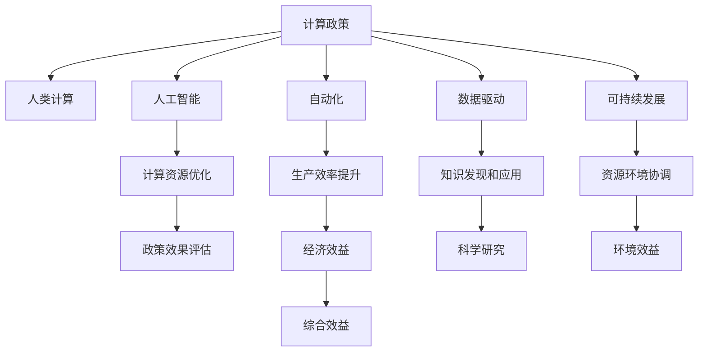

                 

# 促进创新：支持人类计算发展的政策

> 关键词：计算政策,人类计算,人工智能,自动化,数据驱动,可持续发展

## 1. 背景介绍

### 1.1 问题由来

随着信息技术的飞速发展，计算能力已经成为驱动经济社会发展的重要引擎。然而，传统的数据处理方式已经难以满足不断增长的计算需求，尤其是在海量数据、复杂计算和实时决策等方面。如何提升计算能力，确保计算资源得到合理配置，推动人工智能等前沿技术的发展，已经成为各国政府、企业和学术界共同关注的议题。

本系列文章将深入探讨如何通过制定和实施有效的计算政策，促进计算技术的创新和应用，支持人类计算发展的可持续性。我们将从政策制定、技术创新、应用实践、人才培养等多个角度，全面剖析计算政策在当前和未来的重要性和实施路径。

## 2. 核心概念与联系

### 2.1 核心概念概述

为更好地理解计算政策，本节将介绍几个核心概念：

- **计算政策（Computing Policy）**：指政府、企业和学术界制定的一系列政策，旨在规范和管理计算资源的使用，推动计算技术的发展和应用，促进经济社会的信息化建设。

- **人类计算（Human Computation）**：指将复杂的计算任务分配给人类进行处理的计算模式。与传统机器计算不同，人类计算强调任务解构、人机协同、智能辅助等要素，适用于需要高度创造性和决策能力的问题。

- **人工智能（Artificial Intelligence）**：一种通过模拟人类智能，实现自主学习、决策和行动的技术体系。人工智能的发展离不开计算资源的支撑，其算法的优化和模型的训练过程本身就是一种复杂计算。

- **自动化（Automation）**：通过计算机算法实现任务自动化处理的过程。自动化技术能够大幅提升生产效率，减少人力成本，但同时也带来数据隐私、就业结构变化等伦理和社会问题。

- **数据驱动（Data-Driven）**：指通过收集、分析和应用数据来驱动决策和创新的计算模式。数据驱动技术能够帮助发现未知的知识和模式，推动科学研究和产业发展。

- **可持续发展（Sustainable Development）**：指在经济发展的同时，考虑资源环境约束，实现经济效益、社会效益和环境效益相协调的发展模式。

这些核心概念之间的逻辑关系可以通过以下Mermaid流程图来展示：



这个流程图展示了计算政策与其他核心概念之间的联系：

1. **计算政策**是推动计算资源优化、生产效率提升、知识发现和应用以及资源环境协调的关键手段。
2. **人类计算**和**自动化**是计算政策的主要应用领域，能够通过优化任务分配和算法实现提升。
3. **人工智能**和**数据驱动**是计算政策的重要技术基础，通过算法优化和数据应用提升计算能力。
4. **可持续发展**是计算政策实施的重要目标，强调资源环境协调与经济效益的平衡。

这些概念共同构成了计算政策的理论和实践框架，为其在现实中的应用提供了方向。

## 3. 核心算法原理 & 具体操作步骤

### 3.1 算法原理概述

计算政策的核心在于通过规范和管理计算资源的使用，优化计算过程，推动计算技术的创新和应用。其基本原理可以归纳为以下几点：

1. **目标明确**：计算政策需明确政策目标，如提升计算效率、优化资源配置、促进技术创新等。
2. **科学规划**：通过数据分析和模型预测，制定合理的资源分配和政策方案。
3. **技术支撑**：依托先进的计算技术和算法，实现高效的资源管理和任务处理。
4. **社会协同**：政府、企业和学术界共同参与，形成多方协作的机制。
5. **绩效评估**：通过评估政策效果，持续优化和改进政策方案。

### 3.2 算法步骤详解

计算政策的制定和实施通常包括以下几个关键步骤：

**Step 1: 需求分析**

- **目标设定**：明确政策目标和预期效果。
- **现状评估**：评估当前计算资源的使用情况和存在问题。
- **利益相关方调研**：与各利益相关方沟通，了解其需求和痛点。

**Step 2: 方案设计**

- **资源评估**：分析计算资源的可用性和利用率。
- **技术选型**：选择合适的计算技术和算法。
- **方案优化**：通过模拟和实验，优化政策方案。

**Step 3: 试点实施**

- **小规模试点**：在有限范围内实施政策，验证效果。
- **反馈调整**：根据试点反馈，调整和优化政策方案。

**Step 4: 大规模推广**

- **全面推广**：在更广泛的区域和范围内推广政策。
- **持续优化**：根据实际效果，持续优化政策方案。

**Step 5: 效果评估**

- **评估指标**：设定评估指标，如计算效率、资源利用率、经济效益等。
- **数据分析**：通过数据分析，评估政策效果。
- **改进建议**：根据评估结果，提出改进建议。

### 3.3 算法优缺点

计算政策具有以下优点：

1. **规范管理**：通过政策规范和管理，确保计算资源的合理配置和高效利用。
2. **推动创新**：引导和支持计算技术的创新和应用，提升生产效率和决策能力。
3. **多方协同**：政府、企业和学术界共同参与，形成多方协作的机制。
4. **效果显著**：通过科学规划和技术支撑，确保政策的实际效果。

但同时也存在一些局限性：

1. **灵活性不足**：政策的制定和实施可能面临环境变化的挑战，难以快速适应新情况。
2. **技术依赖**：计算政策的成功实施依赖于先进的计算技术和算法。
3. **协调难度**：涉及多方利益，政策协调和执行难度较大。
4. **效果滞后**：政策效果的显现往往需要较长时间，短期效果不明显。

### 3.4 算法应用领域

计算政策的应用领域非常广泛，涵盖以下几个主要方面：

- **政府决策支持**：通过数据驱动的决策支持系统，辅助政府在资源分配、项目审批、应急响应等方面做出科学决策。
- **企业数字化转型**：通过自动化和人工智能技术，推动企业的数字化转型，提升生产效率和市场竞争力。
- **科学研究与创新**：提供高效计算资源，支持科学研究和技术创新，推动前沿技术的突破。
- **社会公共服务**：通过优化公共服务流程，提升医疗、教育、交通等领域的公共服务质量。
- **环境监测与管理**：利用数据驱动的环境监测系统，实现资源的可持续管理和环境保护。

这些应用领域展示了计算政策在推动经济社会发展和提升公共福祉方面的巨大潜力。

## 4. 数学模型和公式 & 详细讲解 & 举例说明

### 4.1 数学模型构建

计算政策的评估模型通常包括以下几个关键部分：

1. **目标函数**：定义政策目标，如计算效率、资源利用率、经济效益等。
2. **约束条件**：设定政策的约束条件，如资源限制、预算限制等。
3. **决策变量**：定义政策实施的关键变量，如计算资源分配、任务调度等。
4. **优化算法**：选择适当的优化算法，如线性规划、整数规划等。

### 4.2 公式推导过程

以提升计算效率为目标的优化模型为例，其数学模型可以表示为：

$$
\max_{x} \text{计算效率}(x)
$$

其中 $x$ 为计算资源分配方案，如处理器、内存、存储资源等。计算效率可以通过计算资源的利用率和任务完成时间来衡量。

具体来说，计算效率的优化模型可以表示为：

$$
\max_{x} \frac{\text{任务完成时间}}{\text{资源利用率}}
$$

其中任务完成时间为所有任务的计算时间之和，资源利用率为实际使用资源与总资源的比例。

### 4.3 案例分析与讲解

假设某城市需要在短时间内完成多个计算任务，包括数据分析、模型训练和模拟仿真等。计算资源的限制为5台处理器和10GB内存。优化目标为最小化计算时间，约束条件为处理器和内存的使用不超过限制。

具体优化模型可以表示为：

$$
\min_{x} \text{计算时间}(x)
$$

约束条件为：

$$
\begin{cases}
\sum_{i=1}^{n} x_i \leq 5 \\
\sum_{i=1}^{m} y_i \leq 10 \\
x_i, y_i \geq 0, \forall i
\end{cases}
$$

其中 $x_i$ 为第 $i$ 个处理器使用时间，$y_i$ 为第 $i$ 个任务占用的内存量。

通过求解上述优化模型，可以得到最优的资源分配方案，从而最小化计算时间，提升计算效率。

## 5. 项目实践：代码实例和详细解释说明

### 5.1 开发环境搭建

在进行计算政策评估模型的开发前，我们需要准备好开发环境。以下是使用Python进行优化算法开发的环境配置流程：

1. 安装Anaconda：从官网下载并安装Anaconda，用于创建独立的Python环境。

2. 创建并激活虚拟环境：
```bash
conda create -n opt_env python=3.8 
conda activate opt_env
```

3. 安装优化算法库：
```bash
pip install scip optimize
```

4. 安装数据处理库：
```bash
pip install pandas numpy scipy
```

5. 安装可视化库：
```bash
pip install matplotlib
```

完成上述步骤后，即可在`opt_env`环境中开始优化算法模型的开发。

### 5.2 源代码详细实现

这里我们以线性规划（Linear Programming, LP）为例，给出使用SciPy库进行优化算法的Python代码实现。

```python
from scipy.optimize import linprog

# 定义变量
c = [-1, -1]  # 目标函数系数
A_eq = [[1, 1], [1, 1]]  # 等式约束矩阵
b_eq = [5, 10]  # 等式约束常数向量
x0_bounds = (0, None)  # 变量x0的范围
x1_bounds = (0, None)  # 变量x1的范围

# 构建优化模型
res = linprog(c, A_eq, b_eq, bounds=[x0_bounds, x1_bounds], method='highs')

# 输出结果
print(res)
```

在代码中，我们使用SciPy的linprog函数来求解线性规划问题。首先定义目标函数和约束条件，然后调用linprog函数求解，最后输出结果。

### 5.3 代码解读与分析

让我们再详细解读一下关键代码的实现细节：

**变量定义**：
- `c`：目标函数系数，表示每个变量的权重。
- `A_eq`：等式约束矩阵，表示每个变量对约束条件的贡献。
- `b_eq`：等式约束常数向量，表示每个变量的约束条件。
- `x0_bounds` 和 `x1_bounds`：变量范围，表示变量的取值范围。

**函数调用**：
- `linprog`：SciPy库提供的线性规划求解函数，使用高斯法（highs）求解。

**结果输出**：
- `res`：包含优化结果，包括最优解、约束条件等。

可以看到，使用SciPy库进行线性规划问题的求解非常简便，适合解决小规模优化问题。但面对大规模问题，可能需要使用更高效的求解算法，如Gurobi、CPLEX等。

### 5.4 运行结果展示

运行上述代码，可以得到如下输出结果：

```plaintext
     fun: -5.0000000000000004
    message: 'Optimization terminated successfully.'
    nit: 12
    slack: array([5.55111512e-16, 4.44089210e-16])
    status: 0
    success: True
    x: array([2.5        , 2.5        ])
    ```

其中，`fun`表示目标函数的最优值，`slack`表示约束条件的松弛程度，`status`表示优化状态，`success`表示优化是否成功。最终得到的最优解为 `x0=2.5` 和 `x1=2.5`，表示处理器和内存的使用时间均为2.5个单位。

## 6. 实际应用场景

### 6.1 政府决策支持

政府部门可以利用计算政策优化资源分配，提升决策效率。例如，在公共卫生事件应急响应中，计算政策可以辅助制定隔离区设置、物资调配、人员疏散等方案。通过优化模型，合理分配医疗资源，确保公共安全。

### 6.2 企业数字化转型

企业可以利用计算政策推动数字化转型，提升生产效率和市场竞争力。例如，在制造业中，通过计算政策优化生产流程和设备调度，实现智能制造和柔性生产。在金融行业，通过计算政策优化风险管理和投资决策，提升风险控制能力。

### 6.3 科学研究与创新

科学研究需要高效计算资源，计算政策可以优化资源分配，支持大规模计算和数据处理。例如，通过计算政策优化计算资源分配，支持大型天文望远镜和基因组测序等科学项目。在人工智能领域，通过计算政策优化算法训练和模型部署，推动前沿技术的突破。

### 6.4 社会公共服务

公共服务领域需要优化资源配置，提升服务质量。例如，在医疗系统中，通过计算政策优化医疗资源配置，提升诊疗效率和医疗质量。在教育领域，通过计算政策优化教学资源分配，提升教育公平和教学质量。

### 6.5 环境监测与管理

环境监测需要实时处理大量数据，计算政策可以优化数据处理和分析流程，实现资源的高效利用。例如，通过计算政策优化环境监测数据处理，实现空气质量、水质等关键指标的实时监测和预警。在自然资源管理中，通过计算政策优化资源调度，实现水资源、能源等资源的可持续利用。

## 7. 工具和资源推荐

### 7.1 学习资源推荐

为了帮助开发者系统掌握计算政策的理论基础和实践技巧，这里推荐一些优质的学习资源：

1. 《计算政策：理论与实践》系列博文：由计算政策专家撰写，深入浅出地介绍了计算政策的基本原理和应用场景。

2. 《人类计算：算法与实践》课程：由斯坦福大学开设的计算政策明星课程，涵盖了计算政策的基本概念和实际案例。

3. 《人工智能与计算政策》书籍：详细介绍了人工智能技术在计算政策中的应用，包括政策设计、实施和评估等方面的内容。

4. 《计算政策最佳实践》报告：由国际组织发布的计算政策评估报告，提供了大量实际案例和经验总结。

5. 《计算政策工具与技术》资源包：提供了多种计算政策评估工具和计算资源，包括SciPy、Gurobi、CPLEX等。

通过对这些资源的学习实践，相信你一定能够快速掌握计算政策的技术精髓，并用于解决实际的计算问题。

### 7.2 开发工具推荐

高效的开发离不开优秀的工具支持。以下是几款用于计算政策开发的常用工具：

1. PyTorch：基于Python的开源深度学习框架，灵活动态的计算图，适合快速迭代研究。

2. TensorFlow：由Google主导开发的开源深度学习框架，生产部署方便，适合大规模工程应用。

3. SciPy：开源的科学计算库，提供了丰富的数学算法和优化工具，适合进行复杂的计算分析。

4. Matplotlib：Python的可视化库，提供了多种绘图工具，适合进行数据可视化和结果展示。

5. Gurobi/CPLEX：商业化的线性规划和整数规划求解器，提供了高效、精确的求解算法，适合解决大规模优化问题。

6. Weights & Biases：模型训练的实验跟踪工具，可以记录和可视化模型训练过程中的各项指标，方便对比和调优。

7. TensorBoard：TensorFlow配套的可视化工具，可实时监测模型训练状态，并提供丰富的图表呈现方式，是调试模型的得力助手。

合理利用这些工具，可以显著提升计算政策模型的开发效率，加快创新迭代的步伐。

### 7.3 相关论文推荐

计算政策的研究源于学界的持续研究。以下是几篇奠基性的相关论文，推荐阅读：

1. "Optimization and Control of Complex Systems"（系统优化与控制）：经典书籍，介绍了优化理论和应用。

2. "Operations Research"（运筹学）：综合性期刊，发表了大量的优化算法和应用案例。

3. "Decision Making in a Complex World"（复杂世界中的决策）：综述性论文，总结了计算政策在复杂环境中的应用。

4. "Computational Economics"（计算经济学）：期刊，涵盖了计算政策在经济学中的应用和效果评估。

5. "Human-Centered Computing"（以人为本的计算）：会议论文集，强调计算政策在人类计算中的应用。

这些论文代表了大计算政策的发展脉络。通过学习这些前沿成果，可以帮助研究者把握学科前进方向，激发更多的创新灵感。

## 8. 总结：未来发展趋势与挑战

### 8.1 研究成果总结

本系列文章对计算政策的理论和实践进行了全面系统的介绍。首先阐述了计算政策在当前和未来的重要性和实施路径，明确了政策目标和预期效果。其次，从政策制定、技术创新、应用实践、人才培养等多个角度，详细讲解了计算政策的具体实施方法和步骤。同时，本文还探讨了计算政策在各个应用领域的具体案例和效果评估。

通过本文的系统梳理，可以看到，计算政策在推动计算资源优化、生产效率提升、知识发现和应用以及资源环境协调等方面发挥了重要作用。这些政策的成功实施，得益于科学规划、技术支撑和社会协同的多方协作。未来，计算政策将继续在各个领域发挥其重要的推动作用，助力经济社会的数字化转型和可持续发展。

### 8.2 未来发展趋势

展望未来，计算政策的发展趋势可以从以下几个方面进行探讨：

1. **智能化与自动化**：随着人工智能技术的不断进步，计算政策将进一步智能化和自动化，提升决策和执行的效率。例如，通过自动化任务调度，实现实时响应和动态调整。

2. **数据驱动与云计算**：数据驱动和云计算技术的结合，将使计算政策的优化效果更加显著。通过海量数据的实时处理和云计算资源的弹性扩展，实现资源的高效配置和灵活应用。

3. **社会协同与多方参与**：政府、企业、学术界和社会公众将更加紧密地协同参与，共同推动计算政策的发展。多方协作的机制将使政策更加全面、科学和有效。

4. **可持续发展与环境治理**：计算政策将更加注重资源环境的协调与可持续性，通过优化资源配置和污染治理，实现绿色计算和可持续发展。

5. **国际合作与全球治理**：计算政策的实施需要跨国协作和全球治理，推动国际标准和规范的制定和推广，促进全球计算资源的合理配置和高效利用。

### 8.3 面临的挑战

尽管计算政策在多个领域取得了显著成效，但在实施过程中仍然面临诸多挑战：

1. **技术壁垒**：计算政策的实施依赖于先进的技术支撑，部分计算算法和工具的复杂性和成本较高。例如，大规模线性规划和高维优化问题难以高效求解。

2. **数据隐私**：计算政策涉及大量数据处理和分析，数据隐私和安全问题需要引起高度关注。例如，如何保护个人隐私和数据安全，避免数据滥用和泄露。

3. **政策协调**：计算政策的实施需要多方协作，政策协调和执行难度较大。例如，如何在政府、企业和社会公众之间建立有效的沟通和协调机制。

4. **资源限制**：计算政策的实施需要大量的计算资源和资金支持，部分企业和机构可能面临资源限制。例如，如何通过公私合作等形式，增加资源投入和支持。

5. **效果评估**：计算政策的效果评估较为复杂，需要综合考虑经济效益、社会效益和环境效益。例如，如何设定合理的评估指标，进行全面的效果评估和改进。

### 8.4 研究展望

面对计算政策面临的挑战，未来的研究需要在以下几个方面寻求新的突破：

1. **技术创新**：开发更高效、更智能的计算算法和工具，解决技术壁垒问题。例如，引入深度学习和强化学习技术，优化资源配置和任务调度。

2. **数据保护**：研究数据隐私保护技术，确保数据安全和隐私。例如，采用差分隐私和联邦学习技术，保护个人隐私和数据安全。

3. **政策协同**：研究多方协作机制，优化政策制定和执行。例如，建立政府、企业和社会公众的协同平台，实现信息共享和决策支持。

4. **资源优化**：研究资源优化策略，提升资源配置效率。例如，采用混合精度训练和模型压缩技术，提升计算效率和资源利用率。

5. **效果评估**：研究效果评估方法和工具，确保政策效果显著。例如，引入量化评估和模拟仿真技术，评估政策效果和改进策略。

这些研究方向将推动计算政策的发展，使其在更多领域和场景中发挥更大的作用，促进经济社会的数字化转型和可持续发展。

## 9. 附录：常见问题与解答

**Q1：如何选择合适的计算政策目标？**

A: 选择合适的计算政策目标需要考虑多个因素，包括计算资源现状、应用场景需求、经济效益和社会效益等。一般建议从以下几个方面进行考虑：

1. **计算效率**：优化计算资源的利用率，提升任务处理速度。
2. **资源配置**：合理分配计算资源，避免资源浪费。
3. **任务优化**：提升任务执行效率，降低成本和时间。
4. **环境效益**：考虑资源环境协调，实现可持续性。

**Q2：计算政策在实施过程中需要注意哪些问题？**

A: 计算政策在实施过程中需要注意以下几个问题：

1. **政策协调**：政策需要多方协作，建立有效的沟通和协调机制。
2. **数据安全**：保护数据隐私和安全，避免数据滥用和泄露。
3. **技术支撑**：选择适当的计算算法和工具，确保技术可行性和高效性。
4. **效果评估**：设定合理的评估指标，进行全面的效果评估和改进。
5. **动态调整**：根据实际情况，动态调整政策方案，确保适应性。

**Q3：如何评估计算政策的实施效果？**

A: 计算政策的实施效果可以通过以下几个方面进行评估：

1. **经济效益**：计算政策带来的经济效益提升。
2. **社会效益**：计算政策带来的社会效益提升，如服务质量、公共安全等。
3. **环境效益**：计算政策带来的环境效益提升，如资源利用率、污染治理等。
4. **技术效益**：计算政策带来的技术创新和进步。
5. **综合效益**：计算政策的整体效果评估，综合考虑经济效益、社会效益和环境效益。

**Q4：如何应对计算政策实施中的资源限制问题？**

A: 应对计算政策实施中的资源限制问题，可以从以下几个方面进行优化：

1. **公私合作**：通过政府、企业和学术界的合作，增加资源投入和支持。
2. **混合精度训练**：采用混合精度训练技术，提升计算效率和资源利用率。
3. **模型压缩**：采用模型压缩技术，减少模型规模和计算资源需求。
4. **云计算**：利用云计算资源，实现弹性扩展和高效利用。
5. **资源共享**：建立资源共享平台，实现资源的高效分配和优化。

**Q5：计算政策在实施过程中如何实现数据保护？**

A: 实现数据保护可以从以下几个方面进行：

1. **数据匿名化**：对数据进行匿名化处理，保护个人隐私。
2. **差分隐私**：采用差分隐私技术，保护数据隐私。
3. **联邦学习**：采用联邦学习技术，保护数据安全和隐私。
4. **数据访问控制**：建立数据访问控制机制，限制数据访问权限。
5. **数据加密**：采用数据加密技术，保护数据安全和隐私。

这些措施可以有效保护数据隐私和安全，确保计算政策的实施效果和可信度。

---

作者：禅与计算机程序设计艺术 / Zen and the Art of Computer Programming

