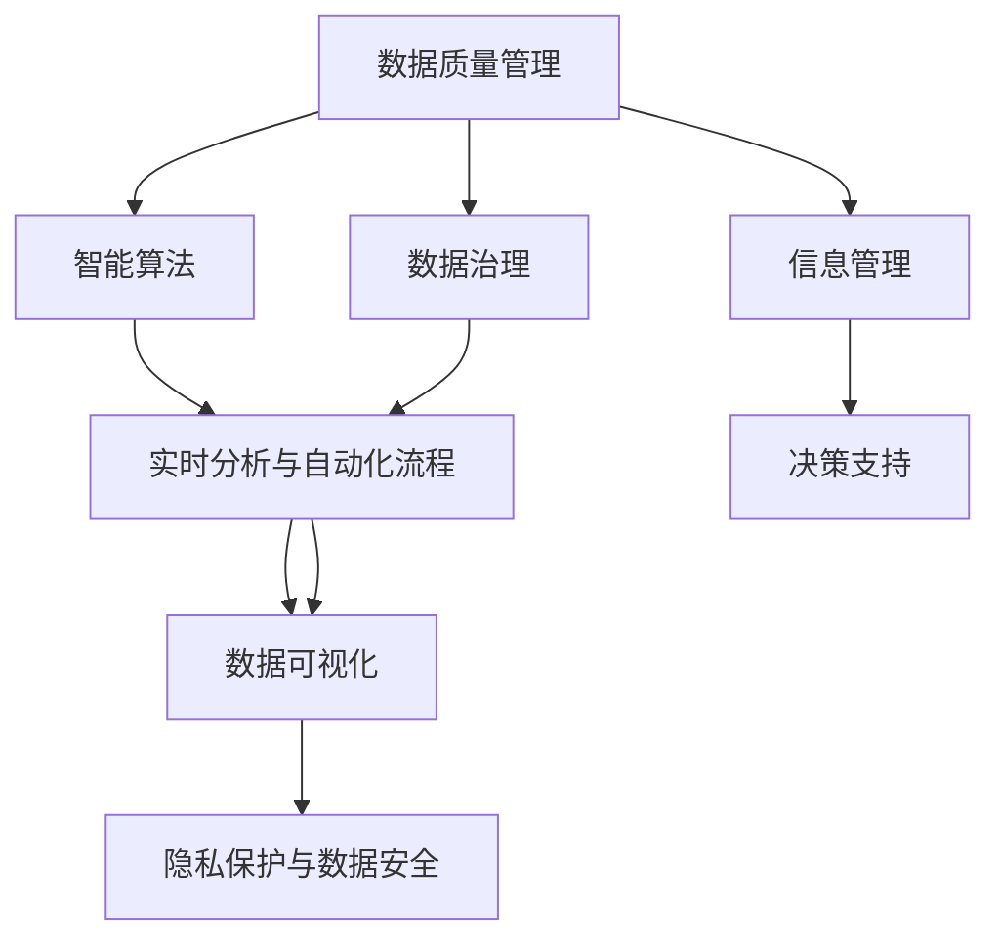

                 

# 信息时代的信息管理策略与实践：管理信息过载和复杂性

> 关键词：信息管理, 信息过载, 大数据, 复杂性管理, 数据治理, 智能算法, 实时分析, 自动化流程, 人工智能

## 1. 背景介绍

### 1.1 问题由来

随着信息技术的飞速发展，信息管理的复杂性和难度也在不断增加。从企业内部到政府机构，从个人到社会，我们每天都在产生和处理海量数据，从简单的文本信息到复杂的图像、音频、视频等多模态数据。这些数据蕴含着丰富的知识和价值，但同时也带来了信息过载和复杂性的问题，亟需有效的管理和处理策略。

- **信息过载**：随着互联网的普及和数字设备的广泛应用，人们接触到信息的数量和种类急剧增加，导致注意力分散，决策难度加大。企业员工、政府工作人员、研究人员、普通民众都需要花费更多时间和精力来处理信息，影响工作效率和决策质量。
- **数据复杂性**：数据来源广泛、格式多样、结构复杂，带来了数据整合、清洗、分析等方面的挑战。数据质量问题、数据孤岛现象、数据重复和冗余等问题，严重影响了数据的利用效率和决策支持的准确性。

### 1.2 问题核心关键点

信息管理的核心问题是如何在信息过载和复杂性的背景下，有效地获取、存储、处理、分析和利用信息，为决策提供支持。信息管理策略的制定和实施，需要综合考虑以下关键点：

- **数据质量管理**：确保数据的准确性、完整性、一致性和时效性。
- **数据治理框架**：建立统一的数据标准、元数据管理、数据访问权限控制等机制，实现数据的有序流动。
- **智能算法应用**：利用机器学习、深度学习等智能算法，提高数据处理和分析的自动化水平。
- **实时分析与自动化流程**：实现数据的实时采集、处理和分析，提升决策支持的时效性和准确性。
- **数据可视化与交互**：通过可视化工具，将复杂数据转化为直观的图形和报表，支持决策者快速理解数据和发现问题。
- **隐私保护与数据安全**：在数据利用过程中，保障个人隐私和数据安全，防止数据泄露和滥用。

## 2. 核心概念与联系

### 2.1 核心概念概述

为更好地理解信息管理的策略与实践，本节将介绍几个核心概念及其相互关系：

- **数据质量管理**：确保数据在采集、存储、处理和分析等各个环节都达到预定的质量标准，提高数据可靠性。
- **数据治理**：通过建立统一的数据标准、元数据管理、数据访问控制等机制，确保数据的有效管理和有序流动。
- **智能算法**：利用机器学习、深度学习等智能算法，自动化处理和分析数据，提升决策支持的准确性和效率。
- **实时分析与自动化流程**：通过数据流技术，实现数据的实时采集、处理和分析，支持快速决策。
- **数据可视化**：通过可视化工具，将复杂数据转化为直观的图形和报表，支持快速理解和决策。
- **隐私保护与数据安全**：在数据利用过程中，保障个人隐私和数据安全，防止数据泄露和滥用。

这些概念之间的逻辑关系可以通过以下Mermaid流程图来展示：



这个流程图展示了信息管理的关键流程和概念之间的相互关系：

1. 数据质量管理确保数据可靠性，为数据治理提供基础。
2. 数据治理通过统一标准和权限控制，确保数据的有效管理。
3. 智能算法提升数据处理和分析的自动化水平。
4. 实时分析与自动化流程实现数据的实时处理和分析。
5. 数据可视化支持快速理解和决策。
6. 隐私保护与数据安全保障数据利用过程中的隐私和安全。

这些概念共同构成了信息管理的完整框架，为提升信息利用效率和决策支持能力提供了理论基础和实践指南。

## 3. 核心算法原理 & 具体操作步骤

### 3.1 算法原理概述

信息管理的核心算法原理主要围绕数据处理和分析展开，包括以下几个关键步骤：

1. **数据预处理**：清洗、转换、归一化等预处理操作，确保数据质量。
2. **特征提取与选择**：从原始数据中提取有意义的特征，并进行特征选择，提高数据分析效率。
3. **模型训练与优化**：选择合适的模型（如线性回归、决策树、神经网络等），并通过训练和优化获得准确的预测结果。
4. **实时处理与分析**：利用流式计算和实时分析技术，实现数据的实时处理和分析。
5. **可视化与交互**：将分析结果通过可视化工具呈现，支持快速理解和决策。
6. **数据治理与质量管理**：通过元数据管理、数据治理等技术，确保数据的质量和有序流动。

### 3.2 算法步骤详解

#### 数据预处理

数据预处理是信息管理的第一步，包括数据清洗、转换、归一化等操作。数据清洗的目的是去除缺失值、异常值和噪声，确保数据的完整性和准确性。数据转换包括格式转换、维度变换等操作，使数据适合后续处理。数据归一化是将数据缩放到同一范围内，提高算法的稳定性和效率。

#### 特征提取与选择

特征提取是从原始数据中提取有意义的特征，通常通过统计分析、降维技术等方法实现。特征选择是选择对分析目标有重要影响的特征，提高分析效率和精度。常用的特征选择方法包括信息增益、卡方检验、L1正则化等。

#### 模型训练与优化

模型训练是通过选择和训练合适的机器学习模型，从数据中提取规律和特征。模型优化是通过调整模型参数，提高模型的准确性和泛化能力。常用的模型包括线性回归、逻辑回归、决策树、随机森林、神经网络等。

#### 实时处理与分析

实时处理与分析是指利用流式计算技术，对数据进行实时采集、处理和分析，支持快速决策。常用的实时处理工具包括Apache Kafka、Apache Flink等。

#### 可视化与交互

数据可视化是通过可视化工具将分析结果呈现为图形和报表，支持快速理解和决策。常用的可视化工具包括Tableau、Power BI、Matplotlib等。

#### 数据治理与质量管理

数据治理是通过建立统一的数据标准、元数据管理、数据访问控制等机制，确保数据的有效管理和有序流动。数据质量管理是通过监控数据质量指标，及时发现和修正数据质量问题。

### 3.3 算法优缺点

信息管理的核心算法具有以下优点：

- **自动化处理**：利用智能算法自动化处理和分析数据，减少人工干预，提高处理效率和精度。
- **实时响应**：通过实时处理与分析，支持快速决策，提高决策的时效性和准确性。
- **可视化支持**：通过可视化工具，将复杂数据转化为直观的图形和报表，支持快速理解和决策。
- **数据治理**：通过统一的数据标准和治理机制，确保数据的有效管理和有序流动。

同时，该算法也存在一些缺点：

- **模型复杂性**：智能算法模型复杂，对数据质量和特征选择要求较高。
- **资源消耗**：实时处理与分析需要大量计算资源，可能带来较高的硬件成本。
- **隐私与安全**：在数据利用过程中，需要保障个人隐私和数据安全，防止数据泄露和滥用。

### 3.4 算法应用领域

信息管理的技术和策略在多个领域得到了广泛应用，包括但不限于：

- **企业决策支持**：通过数据质量管理和智能算法，支持企业决策者快速理解市场变化，制定策略。
- **政府数据治理**：通过统一数据标准和元数据管理，确保政府数据的有效管理和有序流动。
- **医疗健康分析**：通过实时分析与自动化流程，支持医疗健康数据的处理和分析，提高医疗决策的准确性和时效性。
- **金融风险控制**：通过数据治理和智能算法，实现金融数据的有效管理和风险控制，保障金融稳定。
- **环境保护监测**：通过实时处理与分析，支持环境数据的采集和监测，支持环境保护决策。

这些应用领域展示了信息管理技术的广泛性和重要性，其有效应用不仅能提升各行业的决策支持能力，还能为社会带来巨大的经济效益和环境效益。

## 4. 数学模型和公式 & 详细讲解 & 举例说明

### 4.1 数学模型构建

信息管理的核心算法原理涉及大量数学模型，以下重点介绍其中几个关键模型：

#### 线性回归模型

线性回归模型用于建立自变量和因变量之间的关系，常用于预测和分类任务。其数学模型为：

$$
y = \beta_0 + \beta_1 x_1 + \beta_2 x_2 + \cdots + \beta_n x_n + \epsilon
$$

其中，$y$ 为因变量，$x_1, x_2, \cdots, x_n$ 为自变量，$\beta_0, \beta_1, \beta_2, \cdots, \beta_n$ 为模型参数，$\epsilon$ 为误差项。

#### 决策树模型

决策树模型用于分类任务，通过树形结构将数据划分为多个子集，每个节点代表一个特征，每个分支代表一个特征值。其数学模型为：

$$
T = \{(x_1, x_2, \cdots, x_n), f(x_1, x_2, \cdots, x_n)\}
$$

其中，$T$ 为决策树，$f(x_1, x_2, \cdots, x_n)$ 为决策函数。

#### 神经网络模型

神经网络模型用于复杂数据处理和分类任务，通过多层神经元组成的非线性映射，提取数据特征。其数学模型为：

$$
h^{(l)} = f(\mathbf{W}^{(l)}\mathbf{x} + \mathbf{b}^{(l)})
$$

其中，$h^{(l)}$ 为第 $l$ 层的输出，$f$ 为激活函数，$\mathbf{W}^{(l)}$ 和 $\mathbf{b}^{(l)}$ 分别为第 $l$ 层的权重和偏置。

### 4.2 公式推导过程

#### 线性回归模型推导

线性回归模型通过最小化误差项的平方和，求解模型参数 $\beta_0, \beta_1, \beta_2, \cdots, \beta_n$。其推导过程如下：

$$
\min_{\beta_0, \beta_1, \beta_2, \cdots, \beta_n} \sum_{i=1}^N (y_i - \beta_0 - \beta_1 x_{1i} - \beta_2 x_{2i} - \cdots - \beta_n x_{ni})^2
$$

通过求解上述最优化问题，可以得到模型参数的估计值。

#### 决策树模型推导

决策树模型通过信息增益、基尼系数等指标选择最优的特征进行划分。其推导过程如下：

$$
\max_{A} I(T; Y|A) = \max_{A} (H(Y) - H(Y|A))
$$

其中，$I(T; Y|A)$ 为条件熵，$H(Y)$ 为原始熵，$H(Y|A)$ 为条件熵。

#### 神经网络模型推导

神经网络模型通过前向传播和反向传播算法，求解模型参数 $\mathbf{W}^{(l)}, \mathbf{b}^{(l)}$。其推导过程如下：

$$
\min_{\mathbf{W}^{(l)}, \mathbf{b}^{(l)}} \sum_{i=1}^N L(h^{(L)}(\mathbf{x}_i), y_i)
$$

其中，$L$ 为损失函数，$h^{(L)}$ 为神经网络的输出。

### 4.3 案例分析与讲解

#### 案例一：企业销售预测

某电商平台利用历史销售数据和市场趋势，预测未来销量。通过线性回归模型，建立了销售额和市场指数之间的关系，预测未来销售额。

#### 案例二：银行信用评估

某银行利用客户历史贷款数据，预测客户信用风险。通过决策树模型，将客户数据划分为高风险、中风险和低风险三类，支持风险评估和贷款决策。

#### 案例三：医疗影像诊断

某医院利用医疗影像数据，预测患者病情的严重程度。通过神经网络模型，提取影像特征，进行疾病分类，支持医生的诊断和治疗。

## 5. 项目实践：代码实例和详细解释说明

### 5.1 开发环境搭建

在进行信息管理项目实践前，我们需要准备好开发环境。以下是使用Python进行PyTorch和TensorFlow开发的环境配置流程：

1. 安装Anaconda：从官网下载并安装Anaconda，用于创建独立的Python环境。

2. 创建并激活虚拟环境：
```bash
conda create -n my_env python=3.8 
conda activate my_env
```

3. 安装PyTorch和TensorFlow：根据CUDA版本，从官网获取对应的安装命令。例如：
```bash
conda install pytorch torchvision torchaudio cudatoolkit=11.1 -c pytorch -c conda-forge
conda install tensorflow -c conda-forge
```

4. 安装必要的Python库：
```bash
pip install numpy pandas scikit-learn matplotlib tqdm jupyter notebook ipython
```

完成上述步骤后，即可在`my_env`环境中开始信息管理项目的开发。

### 5.2 源代码详细实现

下面我们以销售预测项目为例，给出使用PyTorch进行线性回归模型的代码实现。

首先，定义训练集和测试集：

```python
import pandas as pd
from sklearn.model_selection import train_test_split

# 加载数据集
data = pd.read_csv('sales.csv')

# 分割数据集
X = data.drop('sales', axis=1)
y = data['sales']
X_train, X_test, y_train, y_test = train_test_split(X, y, test_size=0.2, random_state=42)
```

然后，定义模型和优化器：

```python
from torch.utils.data import TensorDataset, DataLoader
import torch
from torch.nn import Linear, torch.optim.Adam

# 定义模型
model = Linear(10, 1)

# 定义优化器
optimizer = Adam(model.parameters(), lr=0.01)
```

接着，定义训练和评估函数：

```python
# 定义训练函数
def train(model, optimizer, train_loader, device):
    model.to(device)
    model.train()
    for batch in train_loader:
        inputs, labels = batch
        inputs, labels = inputs.to(device), labels.to(device)
        optimizer.zero_grad()
        outputs = model(inputs)
        loss = torch.nn.MSELoss()(outputs, labels)
        loss.backward()
        optimizer.step()

# 定义评估函数
def evaluate(model, test_loader, device):
    model.eval()
    with torch.no_grad():
        test_loss = 0
        predictions = []
        targets = []
        for batch in test_loader:
            inputs, labels = batch
            inputs, labels = inputs.to(device), labels.to(device)
            outputs = model(inputs)
            test_loss += torch.nn.MSELoss()(outputs, labels).item()
            predictions.append(outputs.cpu().numpy())
            targets.append(labels.cpu().numpy())
        return test_loss / len(test_loader), predictions, targets
```

最后，启动训练流程并在测试集上评估：

```python
# 定义数据预处理函数
def data_preprocess(X, y):
    X = (X - X.mean()) / X.std()
    return X, y

# 数据预处理
X_train, X_test, y_train, y_test = data_preprocess(X_train, y_train), data_preprocess(X_test, y_test)

# 创建DataLoader
train_loader = DataLoader(X_train, y_train, batch_size=32, shuffle=True)
test_loader = DataLoader(X_test, y_test, batch_size=32)

# 定义设备
device = torch.device('cuda') if torch.cuda.is_available() else torch.device('cpu')

# 训练模型
for epoch in range(100):
    train(model, optimizer, train_loader, device)
    test_loss, predictions, targets = evaluate(model, test_loader, device)
    print(f'Epoch {epoch+1}, test loss: {test_loss:.4f}')

# 模型评估
test_loss, predictions, targets = evaluate(model, test_loader, device)
print(f'Test loss: {test_loss:.4f}')

# 可视化结果
import matplotlib.pyplot as plt

plt.plot(predictions, label='Predictions')
plt.plot(targets, label='True Values')
plt.legend()
plt.show()
```

以上就是使用PyTorch进行线性回归模型销售预测的完整代码实现。可以看到，得益于PyTorch的强大封装，代码实现简洁高效。

### 5.3 代码解读与分析

让我们再详细解读一下关键代码的实现细节：

**数据预处理函数**：
- 通过标准化处理（均值归零、方差归一），提高模型的稳定性和收敛速度。

**模型定义**：
- 线性回归模型，输入维度为10，输出维度为1，即预测销售额。

**优化器定义**：
- 使用Adam优化器，学习率为0.01。

**训练函数**：
- 将模型转移到GPU或TPU上，以加速计算。
- 在每个批次上，将输入和标签转移到设备上，计算损失并反向传播更新模型参数。

**评估函数**：
- 在测试集上评估模型，计算平均损失，并返回预测结果和真实标签。

**训练流程**：
- 对数据进行标准化预处理。
- 创建DataLoader，用于数据批处理和模型训练。
- 在设备上训练模型，并周期性在测试集上评估模型性能。
- 输出训练和测试结果，并进行可视化。

可以看到，PyTorch和TensorFlow等深度学习框架为信息管理项目的开发提供了便捷的工具支持，使得复杂模型和算法的实现变得简洁高效。

## 6. 实际应用场景

### 6.1 智能客服系统

智能客服系统通过信息管理技术，利用机器学习和自然语言处理技术，自动化处理客户咨询和问题解答。

在技术实现上，可以收集历史客服对话记录，将问题和最佳答复构建成监督数据，在此基础上对预训练模型进行微调。微调后的模型能够自动理解用户意图，匹配最合适的答案模板进行回复。对于客户提出的新问题，还可以接入检索系统实时搜索相关内容，动态组织生成回答。

### 6.2 金融风险控制

金融风险控制通过信息管理技术，利用数据治理和智能算法，实时监控市场变化和交易行为，识别潜在风险和异常交易。

在技术实现上，可以收集历史交易数据和市场数据，建立统一的数据标准和元数据管理机制，确保数据的质量和一致性。通过实时处理与分析，模型能够实时监测交易行为，识别出潜在的欺诈交易和异常操作，及时采取风险控制措施。

### 6.3 医疗影像诊断

医疗影像诊断通过信息管理技术，利用深度学习模型，自动化分析医学影像，辅助医生进行疾病诊断和治疗。

在技术实现上，可以收集医疗影像数据和患者信息，通过数据治理和模型训练，建立医学影像和疾病之间的映射关系。模型能够在影像中自动识别出病变区域，提供疾病诊断建议，辅助医生制定治疗方案。

### 6.4 未来应用展望

随着信息管理技术的不断进步，其在各个领域的应用前景广阔。未来，信息管理技术将在以下几个方面取得新的突破：

1. **自动化流程的普及**：智能算法将广泛应用于更多的业务流程中，提升工作效率和决策质量。
2. **实时数据的利用**：实时数据处理和分析技术将进一步成熟，支持实时决策和快速响应。
3. **跨领域的数据融合**：跨领域的数据融合技术将不断完善，提升综合决策能力。
4. **隐私保护与数据安全**：隐私保护和数据安全技术将更加严格，保障数据利用过程中的安全和合规。
5. **智能决策支持**：智能决策支持系统将更加普及，支持更加精准和智能的决策过程。

## 7. 工具和资源推荐

### 7.1 学习资源推荐

为了帮助开发者系统掌握信息管理的理论和实践，这里推荐一些优质的学习资源：

1. **《Python数据科学手册》**：由Jake VanderPlas撰写，全面介绍了Python在数据科学中的应用，包括数据预处理、模型训练、可视化等技术。
2. **《深度学习》**：由Ian Goodfellow、Yoshua Bengio和Aaron Courville撰写，全面介绍了深度学习的基础知识和应用，适合进阶学习。
3. **Kaggle竞赛平台**：一个著名的数据科学竞赛平台，提供大量真实业务数据和竞赛题目，支持实践训练。
4. **Coursera在线课程**：由斯坦福大学、Coursera等机构提供的在线课程，涵盖机器学习、深度学习、数据治理等主题。
5. **Apache Hadoop和Spark**：Apache Hadoop和Apache Spark是两个广泛使用的分布式计算框架，支持大规模数据的处理和分析。

通过对这些资源的学习实践，相信你一定能够系统掌握信息管理的理论基础和实践技能，并用于解决实际的信息管理问题。

### 7.2 开发工具推荐

高效的开发离不开优秀的工具支持。以下是几款用于信息管理开发常用的工具：

1. **Python**：Python是一种通用的高级编程语言，支持丰富的第三方库和框架，适合数据处理和分析。
2. **TensorFlow和PyTorch**：TensorFlow和PyTorch是两个主流的深度学习框架，支持构建复杂神经网络模型，适合信息管理任务。
3. **Apache Kafka**：Apache Kafka是一个高性能的消息流处理平台，支持实时数据采集和处理，适合实时处理与分析。
4. **Apache Flink**：Apache Flink是一个分布式流处理框架，支持实时数据处理和分析，适合流式计算任务。
5. **Tableau**：Tableau是一种流行的数据可视化工具，支持将复杂数据转化为直观的图形和报表，适合数据呈现和交互。
6. **Jupyter Notebook**：Jupyter Notebook是一种交互式的编程环境，支持实时代码执行和结果展示，适合模型训练和可视化。

合理利用这些工具，可以显著提升信息管理项目的开发效率，加快创新迭代的步伐。

### 7.3 相关论文推荐

信息管理技术的不断发展，得益于学界的持续研究。以下是几篇奠基性的相关论文，推荐阅读：

1. **“A System of Record for Interactive Business Intelligence”**：提出了一种基于数据仓库和数据挖掘的交互式商业智能系统，支持实时数据分析和可视化。
2. **“Deep Learning for Medical Image Analysis”**：通过深度学习模型，实现了医学影像的自动分析和诊断，支持医生进行疾病诊断和治疗。
3. **“Data-Driven Decision-Making”**：讨论了数据驱动决策的重要性，提出了多种数据治理和分析方法，支持企业决策者快速理解市场变化，制定策略。
4. **“Real-Time Data Processing with Apache Flink”**：介绍了Apache Flink的实时数据处理机制，支持大规模数据的实时分析和处理。
5. **“Privacy-Preserving Data Mining”**：探讨了隐私保护的数据挖掘技术，支持在数据利用过程中保障个人隐私和数据安全。

这些论文代表了大数据和信息管理技术的最新进展，通过学习这些前沿成果，可以帮助研究者把握学科前进方向，激发更多的创新灵感。

## 8. 总结：未来发展趋势与挑战

### 8.1 总结

本文对信息管理技术进行了全面系统的介绍。首先阐述了信息管理的核心问题是如何在信息过载和复杂性的背景下，有效地获取、存储、处理、分析和利用信息，为决策提供支持。其次，从原理到实践，详细讲解了信息管理的数学模型和关键算法，提供了完整的信息管理项目代码实例和详细解释说明。同时，本文还广泛探讨了信息管理技术在智能客服、金融风险控制、医疗影像诊断等多个领域的应用前景，展示了信息管理技术的广阔前景。

通过本文的系统梳理，可以看到，信息管理技术在提升信息利用效率和决策支持能力方面具有重要的价值。面对信息时代的信息过载和复杂性，信息管理技术已经成为各行业数字化转型的关键工具，为构建智能社会奠定了坚实基础。

### 8.2 未来发展趋势

展望未来，信息管理技术将呈现以下几个发展趋势：

1. **自动化处理的普及**：智能算法将广泛应用于更多的业务流程中，提升工作效率和决策质量。
2. **实时数据的利用**：实时数据处理和分析技术将进一步成熟，支持实时决策和快速响应。
3. **跨领域的数据融合**：跨领域的数据融合技术将不断完善，提升综合决策能力。
4. **隐私保护与数据安全**：隐私保护和数据安全技术将更加严格，保障数据利用过程中的安全和合规。
5. **智能决策支持**：智能决策支持系统将更加普及，支持更加精准和智能的决策过程。

以上趋势展示了信息管理技术的广阔前景，其有效应用不仅能提升各行业的决策支持能力，还能为社会带来巨大的经济效益和环境效益。

### 8.3 面临的挑战

尽管信息管理技术已经取得了显著成就，但在迈向更加智能化、普适化应用的过程中，它仍面临着诸多挑战：

1. **数据质量管理**：数据质量问题、数据孤岛现象、数据重复和冗余等问题，严重影响了数据的利用效率和决策支持的准确性。
2. **模型鲁棒性不足**：在数据分布变化的情况下，模型的泛化性能和鲁棒性仍需提高。
3. **实时处理效率**：实时处理与分析需要大量计算资源，可能带来较高的硬件成本。
4. **隐私与安全**：在数据利用过程中，需要保障个人隐私和数据安全，防止数据泄露和滥用。
5. **模型可解释性**：复杂模型的决策过程缺乏可解释性，难以对其推理逻辑进行分析和调试。

### 8.4 研究展望

面对信息管理技术面临的挑战，未来的研究需要在以下几个方面寻求新的突破：

1. **数据治理框架的优化**：建立更加统一和标准化的数据治理框架，提升数据质量管理水平。
2. **智能算法的优化**：开发更加高效和鲁棒的智能算法，提高模型的泛化能力和实时处理效率。
3. **跨领域数据融合**：探索跨领域数据融合技术，实现多模态数据的整合和分析。
4. **隐私保护与安全**：引入隐私保护和安全技术，保障数据利用过程中的安全和合规。
5. **模型可解释性**：引入可解释性方法，提升复杂模型的决策透明度和可解释性。

这些研究方向的探索，必将引领信息管理技术迈向更高的台阶，为构建智能社会提供更加坚实的技术支撑。面向未来，信息管理技术还需要与其他人工智能技术进行更深入的融合，如知识表示、因果推理、强化学习等，多路径协同发力，共同推动信息管理技术的进步。

## 9. 附录：常见问题与解答

**Q1：数据治理框架如何建立？**

A: 数据治理框架的建立需要综合考虑以下几个方面：

1. **数据标准制定**：制定统一的数据标准，确保数据的一致性和规范性。
2. **元数据管理**：建立元数据管理系统，记录数据的基本信息和处理流程。
3. **数据访问控制**：通过权限管理机制，保障数据的安全和隐私。
4. **数据质量监控**：设置数据质量指标，及时发现和修正数据质量问题。

**Q2：实时处理与分析如何实现？**

A: 实时处理与分析主要依赖流式计算技术，具体实现流程如下：

1. **数据采集**：通过数据源采集实时数据，如日志、传感器数据等。
2. **数据处理**：对数据进行清洗、转换、归一化等预处理操作，提高数据质量。
3. **流式计算**：利用流式计算框架，如Apache Kafka、Apache Flink等，实现数据的实时处理和分析。
4. **结果呈现**：将处理结果通过可视化工具呈现，支持快速理解和决策。

**Q3：智能算法如何选择？**

A: 智能算法的选择需要考虑以下几个因素：

1. **任务类型**：根据任务的分类、回归、聚类等类型选择适合的算法。
2. **数据特点**：根据数据的特点（如大小、复杂性）选择适合的算法。
3. **性能要求**：根据对模型性能的要求（如精度、泛化能力）选择适合的算法。
4. **资源限制**：根据硬件资源（如计算资源、存储资源）选择适合的算法。

通过综合考虑这些因素，选择适合的智能算法，可以有效提升信息管理项目的性能和效率。

**Q4：如何提升模型的鲁棒性和泛化能力？**

A: 提升模型的鲁棒性和泛化能力需要考虑以下几个方面：

1. **数据多样性**：收集多样化的数据，增加模型的泛化能力。
2. **模型优化**：通过优化算法、调整超参数等方法，提升模型的鲁棒性和泛化能力。
3. **正则化技术**：使用正则化技术，如L2正则、Dropout等，防止模型过拟合。
4. **对抗训练**：引入对抗样本，提高模型的鲁棒性。
5. **多模型集成**：通过模型集成，提升模型的鲁棒性和泛化能力。

通过这些方法，可以有效提升模型的鲁棒性和泛化能力，提高信息管理项目的稳定性和可靠性。

---

作者：禅与计算机程序设计艺术 / Zen and the Art of Computer Programming

