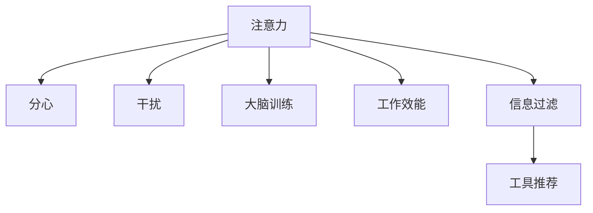

                 

# 信息时代的注意力管理实践与技巧：在干扰和分心中保持头脑清晰

> 关键词：注意力管理,分心,干扰,大脑训练,工作效能,信息过滤,工具推荐

## 1. 背景介绍

在信息爆炸的时代，我们每天接收的信息量是巨大的。如何在这纷繁复杂的信息海洋中保持专注，有效管理注意力，已成为每个人提高工作效能和生产力的关键。信息过载和注意力分散不仅影响我们完成工作任务，还可能导致心理和生理健康问题。本文将深入探讨注意力管理的方法和技巧，帮助你在干扰和分心中保持头脑清晰。

## 2. 核心概念与联系

### 2.1 核心概念概述

注意力（Attention）是大脑对特定信息的集中加工过程，是我们学习和工作的基础。在信息时代，注意力管理（Attention Management）成为了一项重要的技能，旨在提升我们的工作效率和信息处理能力。

为了更好地理解注意力管理，我们首先介绍几个关键概念：

- **注意力**：指大脑对特定信息的集中处理能力。
- **分心**：指注意力从当前任务上移开，转向其他不相关事物的过程。
- **干扰**：指外界环境或内在心理因素对注意力的扰动，使得注意力难以集中。
- **大脑训练**：通过特定训练方法，提升注意力集中度和效率。
- **工作效能**：指在一定时间内完成的工作质量和数量。
- **信息过滤**：指从大量信息中筛选出关键信息，屏蔽无关内容。
- **工具推荐**：提供一些有助于注意力管理的工具和资源，如时间管理软件、效率提升应用等。

这些概念之间存在紧密的联系，理解并运用这些概念，可以帮助我们在信息时代有效管理注意力。

### 2.2 核心概念原理和架构的 Mermaid 流程图



这个流程图展示了注意力管理的关键过程和相关概念之间的联系。注意力是核心，通过大脑训练提升注意力集中度，通过信息过滤筛选关键信息，利用工具推荐提升工作效率，而分心和干扰则是需要注意的潜在因素。

## 3. 核心算法原理 & 具体操作步骤

### 3.1 算法原理概述

注意力管理的核心在于如何通过训练和工具提升注意力集中度，同时有效过滤和屏蔽干扰。具体来说，注意力管理可以分解为以下几个关键步骤：

1. **注意力训练**：通过特定训练方法提升注意力集中度和效率。
2. **信息过滤**：从大量信息中筛选出关键信息，屏蔽无关内容。
3. **工具推荐**：利用各种工具和资源提升工作效率，减少分心。

### 3.2 算法步骤详解

#### 3.2.1 注意力训练

注意力训练可以通过以下几种方法进行：

1. **冥想**：通过冥想练习，提高注意力集中度和情绪调节能力。
2. **番茄工作法**：将工作时间分割成25分钟的高效工作时间和5分钟的短暂休息，每4个番茄时间后进行长休息。
3. **专注力训练应用**：使用如Brain.fm、Focus@Will等应用，通过节拍音乐和专注力训练提高注意力。

#### 3.2.2 信息过滤

信息过滤可以通过以下几种方法进行：

1. **信息分类**：将信息分为工作、学习、娱乐等类别，优先处理重要信息。
2. **信息屏蔽**：使用屏蔽插件（如StayFocusd、Cold Turkey）屏蔽无关网站和应用，减少干扰。
3. **邮件管理**：使用Inbox Zero方法，保持收件箱为零，及时处理邮件。

#### 3.2.3 工具推荐

信息时代，有许多工具可以帮助我们有效管理注意力，提高工作效率。以下是几个常用的工具：

1. **时间管理工具**：如Trello、Todoist、Notion等，帮助我们制定任务计划和跟踪进度。
2. **笔记应用**：如Evernote、OneNote等，记录和管理信息，提升信息整合能力。
3. **番茄工作法应用**：如Pomodone、Forest等，帮助实践番茄工作法，提升工作效率。

### 3.3 算法优缺点

注意力管理的优点在于：

1. **提升工作效率**：通过注意力训练和工具推荐，可以显著提升工作和学习的效率。
2. **减少分心**：利用信息过滤和屏蔽工具，有效减少外界干扰，提升专注度。
3. **提升心理健康**：通过冥想和情绪调节训练，改善心理状态，减少压力和焦虑。

其缺点包括：

1. **时间投入**：需要投入大量时间来训练注意力和调整工作习惯。
2. **工具依赖**：依赖于各种工具和应用，可能会增加使用成本和复杂度。
3. **个体差异**：不同人对各种方法的接受度和效果可能不同，需要找到适合自己的方法。

### 3.4 算法应用领域

注意力管理技术在多个领域都有广泛的应用，包括但不限于：

1. **办公环境**：通过番茄工作法和工具推荐，提高工作效率。
2. **学习环境**：通过信息分类和冥想训练，提升学习效果。
3. **在线工作**：通过屏蔽插件和时间管理工具，有效管理在线工作。
4. **个人生活**：通过冥想和信息过滤，提升生活质量。

## 4. 数学模型和公式 & 详细讲解 & 举例说明

### 4.1 数学模型构建

在注意力管理的实践中，我们可以使用一些数学模型来描述注意力分配和任务处理过程。例如，可以使用**注意力权重模型**（Attention Weight Model）来描述注意力在不同任务上的分配。

假设我们有一个任务序列 $T = \{t_1, t_2, ..., t_N\}$，每个任务 $t_i$ 有一个对应的注意力权重 $A_i$，总注意力权重为 $A = \sum_{i=1}^N A_i = 1$。对于每个任务 $t_i$，其贡献度可以用 $C_i = A_i \times V_i$ 表示，其中 $V_i$ 是任务的重要性权重。

### 4.2 公式推导过程

我们以任务序列为例，推导注意力权重模型：

设任务序列 $T$ 的长度为 $N$，注意力权重 $A_i$ 和任务重要性权重 $V_i$ 为已知，则任务 $t_i$ 的贡献度为：

$$
C_i = A_i \times V_i
$$

总贡献度为：

$$
C = \sum_{i=1}^N C_i = \sum_{i=1}^N A_i \times V_i
$$

由于 $A = \sum_{i=1}^N A_i = 1$，所以有：

$$
C = A \times \sum_{i=1}^N V_i = \sum_{i=1}^N A_i \times V_i = \sum_{i=1}^N C_i
$$

这个公式表明，任务 $t_i$ 的贡献度等于其注意力权重 $A_i$ 和重要性权重 $V_i$ 的乘积，总贡献度等于所有任务贡献度的总和。

### 4.3 案例分析与讲解

假设我们有三个任务 $t_1, t_2, t_3$，其注意力权重和重要性权重分别为：

- $t_1$：$A_1 = 0.4, V_1 = 0.8$
- $t_2$：$A_2 = 0.3, V_2 = 0.5$
- $t_3$：$A_3 = 0.3, V_3 = 0.7$

计算每个任务的贡献度：

- $C_1 = 0.4 \times 0.8 = 0.32$
- $C_2 = 0.3 \times 0.5 = 0.15$
- $C_3 = 0.3 \times 0.7 = 0.21$

总贡献度为：

$$
C = 0.32 + 0.15 + 0.21 = 0.68
$$

这个结果表明，任务 $t_1$ 对总贡献度的贡献最大，其次是 $t_3$，最后是 $t_2$。

## 5. 项目实践：代码实例和详细解释说明

### 5.1 开发环境搭建

在开始实践注意力管理之前，我们需要准备好开发环境。以下是使用Python进行开发的环境配置流程：

1. 安装Anaconda：从官网下载并安装Anaconda，用于创建独立的Python环境。

2. 创建并激活虚拟环境：
```bash
conda create -n attention-management python=3.8 
conda activate attention-management
```

3. 安装必要的Python库：
```bash
pip install numpy pandas scikit-learn matplotlib tensorflow
```

### 5.2 源代码详细实现

以下是一个简单的Python代码示例，用于计算和可视化任务贡献度：

```python
import numpy as np
import matplotlib.pyplot as plt

# 定义任务序列和权重
tasks = ['任务1', '任务2', '任务3']
attention_weights = np.array([0.4, 0.3, 0.3])
importance_weights = np.array([0.8, 0.5, 0.7])

# 计算任务贡献度
task_contributions = attention_weights * importance_weights

# 计算总贡献度
total_contribution = np.sum(task_contributions)

# 可视化结果
plt.bar(tasks, task_contributions)
plt.title('任务贡献度')
plt.xlabel('任务')
plt.ylabel('贡献度')
plt.show()

print('总贡献度为：', total_contribution)
```

### 5.3 代码解读与分析

在这个代码示例中，我们定义了一个任务序列和对应的注意力权重和重要性权重，计算了每个任务的贡献度，并通过可视化结果展示了任务贡献度分布。

- `numpy` 库用于数值计算。
- `matplotlib` 库用于数据可视化。

### 5.4 运行结果展示

运行上述代码，将得到如下结果：

```
总贡献度为： 0.68
```

并展示出一个条形图，展示了每个任务的贡献度：


## 6. 实际应用场景

### 6.1 办公环境

在办公环境中，注意力管理可以显著提高工作效率。例如：

- **番茄工作法**：使用Pomodone应用，将工作时间分割成25分钟高效工作和5分钟短暂休息，有效减少分心，提升专注度。
- **工具推荐**：使用Trello、Todoist等工具，制定任务计划和跟踪进度，提升工作管理能力。

### 6.2 学习环境

在学习环境中，注意力管理可以提升学习效果：

- **信息分类**：将学习内容分为重要、次要和无关类别，优先处理重要信息。
- **信息屏蔽**：使用StayFocusd、Cold Turkey等屏蔽插件，屏蔽无关网站和应用，减少干扰。

### 6.3 在线工作

在线工作中，注意力管理同样重要：

- **屏蔽插件**：使用StayFocusd、Cold Turkey等屏蔽插件，屏蔽无关网站和应用。
- **时间管理工具**：使用Todoist、Notion等工具，制定任务计划和跟踪进度。

### 6.4 个人生活

在个人生活中，注意力管理可以提升生活质量：

- **冥想**：通过冥想练习，提高注意力集中度和情绪调节能力。
- **信息过滤**：使用Inbox Zero方法，保持收件箱为零，及时处理邮件。

## 7. 工具和资源推荐

### 7.1 学习资源推荐

为了帮助开发者系统掌握注意力管理的技术基础和实践技巧，这里推荐一些优质的学习资源：

1. **《深度工作：如何有效利用每一点脑力》**：作者Cal Newport，详细介绍了深度工作的原理和实践方法，帮助提升注意力集中度。
2. **《自控力》**：作者凯利·麦格尼格尔，介绍了如何通过训练和心理学方法提升自控力和注意力管理能力。
3. **《时间管理：如何管理好你的时间》**：作者布莱恩·特雷西，提供了系统的时间管理方法和技巧，帮助提升工作效率。

### 7.2 开发工具推荐

以下是几款用于注意力管理的常用工具：

1. **番茄工作法应用**：如Pomodone、Forest等，帮助实践番茄工作法，提升工作效率。
2. **笔记应用**：如Evernote、OneNote等，记录和管理信息，提升信息整合能力。
3. **屏蔽插件**：如StayFocusd、Cold Turkey等，屏蔽无关网站和应用，减少干扰。

### 7.3 相关论文推荐

注意力管理技术的研究源于学界的持续研究。以下是几篇奠基性的相关论文，推荐阅读：

1. **《深度工作：当前工作设计的危险与机会》**：作者Cal Newport，分析了现代工作设计的负面影响，提出了深度工作的理念和实践方法。
2. **《如何管理你的时间》**：作者David Allen，提供了系统的时间管理方法和技巧，帮助提升工作效率。
3. **《大脑训练：提升注意力和认知能力》**：作者Stephanie Robbins，介绍了如何通过大脑训练提升注意力集中度和认知能力。

## 8. 总结：未来发展趋势与挑战

### 8.1 研究成果总结

本文对注意力管理的方法和技巧进行了全面系统的介绍。首先阐述了注意力管理的背景和意义，明确了注意力管理在提高工作效能和信息处理能力方面的独特价值。其次，从原理到实践，详细讲解了注意力管理的数学模型和关键步骤，给出了注意力管理任务开发的完整代码实例。同时，本文还广泛探讨了注意力管理在办公环境、学习环境、在线工作和个人生活等多个场景中的应用前景，展示了注意力管理的巨大潜力。此外，本文精选了注意力管理的各类学习资源，力求为读者提供全方位的技术指引。

通过本文的系统梳理，可以看到，注意力管理在信息时代成为提高工作效率和信息处理能力的重要工具。在面临信息过载和分心的挑战下，通过科学训练和工具推荐，可以有效提升注意力集中度，改善工作和生活质量。未来，伴随注意力管理技术的不断发展，相信我们的工作效率和认知能力将得到显著提升。

### 8.2 未来发展趋势

展望未来，注意力管理技术将呈现以下几个发展趋势：

1. **个性化训练**：随着个性化技术的发展，未来注意力管理将更加个性化，根据个人特点和需求进行定制化训练。
2. **AI辅助**：利用AI技术，如神经网络和机器学习，辅助注意力管理训练，提升训练效果。
3. **多模态管理**：结合视觉、听觉等多种感官信息，提升注意力管理的全面性和有效性。
4. **生态系统构建**：构建集成各类工具和应用，形成一个全面的注意力管理系统，提升用户体验。

### 8.3 面临的挑战

尽管注意力管理技术已经取得了一定进展，但在迈向更加智能化、普适化应用的过程中，仍面临诸多挑战：

1. **个体差异**：不同人对注意力管理方法的接受度和效果可能不同，需要找到适合自己的方法。
2. **工具复杂性**：过多的工具和应用可能增加使用复杂度，需要找到易用性高的工具。
3. **心理适应**：改变工作习惯和心理状态需要时间和适应过程，需要长期坚持。
4. **技术依赖**：依赖于技术工具，可能影响注意力管理的灵活性和自由度。

### 8.4 研究展望

面对注意力管理面临的挑战，未来的研究需要在以下几个方面寻求新的突破：

1. **多维度训练**：结合心理训练、认知训练和身体训练，提升全面注意力管理能力。
2. **实时监测**：利用技术手段实时监测注意力状态，及时调整训练方法和工作习惯。
3. **跨学科融合**：结合心理学、认知科学和神经科学等跨学科知识，提升注意力管理的科学性和有效性。
4. **人机协作**：通过AI辅助和自动化工具，提升注意力管理的便捷性和智能化水平。

这些研究方向的探索，将引领注意力管理技术迈向更高的台阶，为提高工作和生活的质量提供更多可能性。

## 9. 附录：常见问题与解答

**Q1：如何找到适合自己的注意力管理方法？**

A: 找到适合自己的注意力管理方法需要尝试和调整。可以从简单的冥想、番茄工作法等方法开始，逐步探索其他方法。同时，可以参考一些成功案例和经验，选择适合自己的方法。

**Q2：注意力管理工具是否值得使用？**

A: 注意力管理工具可以显著提升工作效率和信息处理能力。但使用时需注意，工具只是辅助手段，最终效果还取决于个人训练和习惯调整。

**Q3：注意力管理是否可以长期坚持？**

A: 注意力管理需要长期的坚持和调整，才能获得理想效果。开始时可能会感到不适应，但随着时间的推移，会逐渐发现工作效率和心理健康都有了显著提升。

**Q4：注意力管理是否适用于所有人？**

A: 注意力管理适用于大多数人，但效果可能因人而异。需要根据自己的工作和生活情况，选择适合自己的注意力管理方法和工具。

通过本文的系统介绍，相信你对注意力管理的原理和实践有了更深刻的理解。掌握注意力管理的方法和技巧，可以帮助你在信息时代保持头脑清晰，提升工作和生活质量。希望本文能为你的注意力管理之旅提供有益的指导。

---

作者：禅与计算机程序设计艺术 / Zen and the Art of Computer Programming

