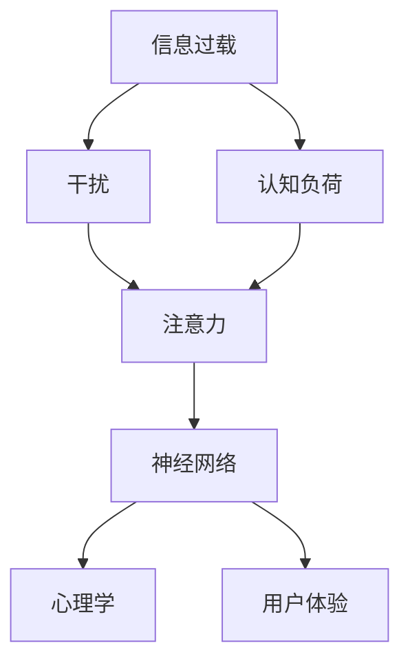

                 

# 信息时代的注意力管理技术：在干扰和信息过载中保持专注

> 关键词：注意力管理,信息过载,干扰,专注,人工智能,认知计算,神经网络,心理学,用户体验

## 1. 背景介绍

### 1.1 问题由来

随着信息技术的高速发展，我们正处在一个信息爆炸的时代。智能手机的普及，社交网络的兴起，以及互联网的深度整合，使得信息充斥在我们生活的方方面面。这种信息过载不仅让我们无从选择，更使我们的注意力变得碎片化，难以集中精力进行深度的认知工作。如何在这个信息大潮中保持专注，成为了一个亟待解决的问题。

### 1.2 问题核心关键点

注意力管理技术的核心在于帮助人们识别、选择并集中注意力于关键信息上，从而提高效率，降低认知负荷。在信息过载和干扰频发的时代，注意力管理技术尤为重要。

该技术结合了心理学原理和人工智能技术，通过自动化的方式帮助用户筛选、过滤和管理注意力。具体而言，它包含以下几个关键要素：

- **信息过滤**：通过智能算法过滤掉无关信息，减少干扰。
- **注意力预测**：基于用户行为和偏好预测其注意力焦点，提供个性化推荐。
- **注意力提醒**：在关键时刻提醒用户，增强注意力集中度。
- **认知负荷监测**：实时监测用户的认知负荷状态，提供相应的减轻策略。

这些技术手段能够显著提高用户在信息时代的工作效率和生产力，让注意力管理成为可能。

## 2. 核心概念与联系

### 2.1 核心概念概述

为更好地理解信息时代的注意力管理技术，本节将介绍几个密切相关的核心概念：

- **信息过载**：指在短时间内接收到的信息超出个体处理能力，导致认知负荷过重，注意力分散的现象。
- **认知负荷**：指个体在处理信息时所承受的认知负担，包括记忆、注意、决策等方面的负担。
- **干扰**：指外界因素对个体认知过程的干扰，包括噪音、社交媒体通知等。
- **注意力**：指个体在特定时间内聚焦于某个任务或信息的能力，是认知过程的重要组成部分。
- **神经网络**：一种模拟人脑神经元网络的计算模型，常用于信息处理和认知任务。
- **心理学**：研究人类认知和行为科学的学科，为注意力管理技术提供了理论基础。
- **用户体验**：指个体对产品或服务的整体感知和满意度，是注意力管理技术追求的目标。

这些核心概念之间的逻辑关系可以通过以下Mermaid流程图来展示：



这个流程图展示了大语言模型的核心概念及其之间的关系：

1. 信息过载导致认知负荷过重，进而影响注意力。
2. 神经网络技术用于信息处理和注意力预测。
3. 心理学提供了理论基础和用户行为的洞察。
4. 用户体验是注意力管理技术追求的最终目标。

## 3. 核心算法原理 & 具体操作步骤
### 3.1 算法原理概述

注意力管理技术的核心算法主要基于神经网络架构，通过学习和预测用户的行为模式，自动实现信息过滤、注意力提醒等功能。其基本原理可以概括为以下几个步骤：

1. **数据收集**：收集用户的操作行为、历史记录和生理数据，如点击、阅读、眼动轨迹、心率等。
2. **特征提取**：使用神经网络提取用户行为特征，构建高维度的特征空间。
3. **注意力预测**：训练模型预测用户在某个时间点上的注意力焦点，提供个性化推荐。
4. **信息过滤**：基于预测结果过滤无关信息，减少干扰。
5. **注意力提醒**：在关键时刻提醒用户，增强注意力集中度。
6. **认知负荷监测**：实时监测用户的认知负荷状态，提供相应的减轻策略。

### 3.2 算法步骤详解

注意力管理技术的算法实现通常包括以下关键步骤：

**Step 1: 数据预处理**

- 收集用户的历史数据和行为记录，清洗并处理缺失值和异常值。
- 将数据转换为神经网络所需的格式，如矩阵、向量等。
- 使用数据增强技术，提高模型的泛化能力。

**Step 2: 特征工程**

- 设计特征提取算法，构建高维度的特征空间。
- 选择合适的特征，去除冗余和噪声。
- 对特征进行归一化和标准化处理。

**Step 3: 模型训练**

- 选择合适的神经网络模型，如卷积神经网络(CNN)、循环神经网络(RNN)等。
- 划分训练集、验证集和测试集，设置训练轮数和学习率等超参数。
- 使用反向传播算法更新模型参数，最小化损失函数。

**Step 4: 模型评估**

- 在测试集上评估模型性能，计算准确率、召回率、F1值等指标。
- 分析模型的预测结果，优化特征工程和模型结构。
- 使用交叉验证技术，提升模型的泛化能力。

**Step 5: 上线应用**

- 将训练好的模型部署到实际环境中，实现实时预测和推理。
- 使用A/B测试等方法评估实际效果，持续优化模型性能。
- 定期收集用户反馈和数据，更新模型和策略。

以上是注意力管理技术的核心算法步骤。在实际应用中，还需要根据具体场景，对各步骤进行优化设计，如改进特征提取方法，引入更多的用户行为数据，优化模型结构和训练策略等。

### 3.3 算法优缺点

注意力管理技术具有以下优点：
1. 自动化程度高。通过神经网络自动实现信息过滤和注意力预测，节省了大量人工干预的时间和精力。
2. 个性化推荐。能够根据用户的行为模式提供个性化信息，减少干扰，提高用户体验。
3. 实时反馈。通过实时监测和调整，能够快速响应用户需求，提升工作效率。
4. 可扩展性强。适用于多种设备和平台，如手机、电脑、智能穿戴设备等。

同时，该技术也存在一些局限性：
1. 数据隐私风险。用户行为数据的收集和处理可能涉及隐私问题，需确保数据安全。
2. 模型复杂度高。神经网络模型训练复杂，需要大量计算资源和时间。
3. 预测准确性受限。模型预测结果可能受数据质量和特征提取方法的影响，准确性存在不确定性。
4. 依赖用户反馈。模型的优化和改进需要依赖用户的反馈和数据，需持续迭代优化。

尽管存在这些局限性，但就目前而言，注意力管理技术在提升用户工作效率和体验方面具有重要价值，值得进一步研究和应用。

### 3.4 算法应用领域

注意力管理技术已经在多个领域得到了广泛应用，例如：

- **智能助理**：如Siri、小爱同学等，通过自然语言交互，辅助用户完成任务。
- **内容推荐**：如Netflix、Amazon等电商平台，通过个性化推荐，提升用户购物体验。
- **广告投放**：如Facebook、Google等广告平台，通过精准投放，提升广告效果。
- **社交媒体**：如Twitter、Instagram等平台，通过信息过滤和注意力提醒，减少用户信息过载。
- **生产调度**：如制造业、物流等企业，通过注意力管理，提高生产效率和调度准确性。

除了上述这些经典应用外，注意力管理技术还在金融、医疗、教育等诸多领域展现出了广阔的应用前景。随着技术的不断演进和应用场景的拓展，相信注意力管理技术将在更多的领域中发挥重要作用。

## 4. 数学模型和公式 & 详细讲解  
### 4.1 数学模型构建

本节将使用数学语言对信息时代注意力管理技术的核心算法进行更加严格的刻画。

设用户的历史数据集为 $D=\{(x_i,y_i)\}_{i=1}^N, x_i \in \mathcal{X}, y_i \in \mathcal{Y}$，其中 $x_i$ 表示用户的历史行为数据，$y_i$ 表示用户是否关注该信息。

定义神经网络模型 $M_{\theta}(x_i)$，其中 $\theta$ 为模型参数。设注意力预测任务的目标为预测用户是否关注某条信息，即 $y_i \in \{0,1\}$。

定义注意力预测任务的损失函数为 $\ell(M_{\theta}(x_i),y_i)$，经验风险为：

$$
\mathcal{L}(\theta) = \frac{1}{N} \sum_{i=1}^N \ell(M_{\theta}(x_i),y_i)
$$

其中 $\ell$ 为交叉熵损失函数，即：

$$
\ell(y_i, \hat{y}_i) = -y_i\log \hat{y}_i - (1-y_i)\log (1-\hat{y}_i)
$$

模型训练的优化目标是最小化经验风险，即：

$$
\theta^* = \mathop{\arg\min}_{\theta} \mathcal{L}(\theta)
$$

使用梯度下降等优化算法，求解上述最优化问题。

### 4.2 公式推导过程

以下我们以二分类任务为例，推导注意力预测任务的数学模型。

假设用户的历史行为数据 $x_i$ 表示为向量 $x \in \mathbb{R}^n$，神经网络模型 $M_{\theta}$ 的输出为 $\hat{y}=M_{\theta}(x) \in [0,1]$。

根据交叉熵损失函数，注意力预测任务的损失函数为：

$$
\ell(y_i, \hat{y}_i) = -y_i\log \hat{y}_i - (1-y_i)\log (1-\hat{y}_i)
$$

将其代入经验风险公式，得：

$$
\mathcal{L}(\theta) = -\frac{1}{N}\sum_{i=1}^N [y_i\log M_{\theta}(x_i)+(1-y_i)\log(1-M_{\theta}(x_i))]
$$

根据链式法则，损失函数对参数 $\theta_k$ 的梯度为：

$$
\frac{\partial \mathcal{L}(\theta)}{\partial \theta_k} = -\frac{1}{N}\sum_{i=1}^N [(y_i - \hat{y}_i)\frac{\partial M_{\theta}(x_i)}{\partial \theta_k}]
$$

其中 $\frac{\partial M_{\theta}(x_i)}{\partial \theta_k}$ 可通过反向传播算法高效计算。

在得到损失函数的梯度后，即可带入参数更新公式，完成模型的迭代优化。重复上述过程直至收敛，最终得到适应用户注意力预测的任务模型 $M_{\theta^*}$。

## 5. 项目实践：代码实例和详细解释说明
### 5.1 开发环境搭建

在进行注意力管理技术开发前，我们需要准备好开发环境。以下是使用Python进行TensorFlow开发的环境配置流程：

1. 安装Anaconda：从官网下载并安装Anaconda，用于创建独立的Python环境。

2. 创建并激活虚拟环境：
```bash
conda create -n attention-management python=3.8 
conda activate attention-management
```

3. 安装TensorFlow：根据CUDA版本，从官网获取对应的安装命令。例如：
```bash
conda install tensorflow -c pytorch -c conda-forge
```

4. 安装各类工具包：
```bash
pip install numpy pandas scikit-learn matplotlib tqdm jupyter notebook ipython
```

完成上述步骤后，即可在`attention-management`环境中开始注意力管理技术的开发实践。

### 5.2 源代码详细实现

下面我们以智能助理的注意力管理为例，给出使用TensorFlow进行注意力管理的PyTorch代码实现。

首先，定义智能助理的任务：

```python
from tensorflow.keras.models import Sequential
from tensorflow.keras.layers import Dense, Dropout
from tensorflow.keras.optimizers import Adam

class SmartAssistant:
    def __init__(self, input_dim, output_dim):
        self.input_dim = input_dim
        self.output_dim = output_dim
        self.model = self.build_model()
    
    def build_model(self):
        model = Sequential([
            Dense(128, input_dim=self.input_dim, activation='relu'),
            Dropout(0.5),
            Dense(self.output_dim, activation='sigmoid')
        ])
        model.compile(optimizer=Adam(0.001), loss='binary_crossentropy', metrics=['accuracy'])
        return model
```

然后，定义数据预处理和特征提取函数：

```python
import pandas as pd
from sklearn.preprocessing import StandardScaler
from tensorflow.keras.preprocessing.text import Tokenizer
from tensorflow.keras.preprocessing.sequence import pad_sequences

def load_data(file_path):
    data = pd.read_csv(file_path)
    texts = data['text']
    labels = data['label']
    tokenizer = Tokenizer(num_words=10000)
    tokenizer.fit_on_texts(texts)
    sequences = tokenizer.texts_to_sequences(texts)
    padded_sequences = pad_sequences(sequences, maxlen=100)
    scaler = StandardScaler()
    padded_sequences = scaler.fit_transform(padded_sequences)
    return padded_sequences, labels

def prepare_data():
    train_data, train_labels = load_data('train.csv')
    test_data, test_labels = load_data('test.csv')
    return train_data, train_labels, test_data, test_labels
```

接着，训练模型并进行预测：

```python
def train_model(train_data, train_labels, test_data, test_labels):
    model = SmartAssistant(input_dim=100, output_dim=1)
    model.fit(train_data, train_labels, epochs=10, batch_size=32, validation_data=(test_data, test_labels))
    predictions = model.predict(test_data)
    return predictions

# 加载数据
train_data, train_labels, test_data, test_labels = prepare_data()

# 训练模型
predictions = train_model(train_data, train_labels, test_data, test_labels)

# 输出预测结果
print(predictions)
```

以上就是使用TensorFlow进行注意力管理的完整代码实现。可以看到，TensorFlow提供了丰富的Keras API，使得注意力管理技术的开发变得相对简洁高效。

### 5.3 代码解读与分析

让我们再详细解读一下关键代码的实现细节：

**SmartAssistant类**：
- `__init__`方法：初始化模型输入维度和输出维度。
- `build_model`方法：构建神经网络模型，使用Dense层和Dropout层。

**load_data函数**：
- 加载数据集，并使用Tokenizer将文本转换为序列。
- 使用pad_sequences对序列进行填充，并使用StandardScaler对数据进行归一化处理。

**prepare_data函数**：
- 将数据集分为训练集和测试集，返回训练数据、标签、测试数据和标签。

**train_model函数**：
- 实例化SmartAssistant类，训练模型。
- 使用fit方法进行模型训练，计算预测结果。

**训练流程**：
- 使用train_model函数训练模型，输出预测结果。
- 打印预测结果，验证模型性能。

可以看到，TensorFlow配合Keras API使得注意力管理技术的开发变得相对简单高效。开发者可以将更多精力放在数据预处理、模型改进等高层逻辑上，而不必过多关注底层的实现细节。

当然，工业级的系统实现还需考虑更多因素，如模型的保存和部署、超参数的自动搜索、更灵活的任务适配层等。但核心的注意力管理范式基本与此类似。

## 6. 实际应用场景
### 6.1 智能客服系统

基于注意力管理技术的智能客服系统，可以通过分析用户的对话历史和行为，预测其关注点，及时提供个性化服务和帮助。具体实现如下：

1. **数据收集**：收集用户的历史对话记录、点击历史、浏览记录等。
2. **特征提取**：提取对话内容、时间戳、用户行为等特征。
3. **注意力预测**：训练模型预测用户关注的关键词、意图等。
4. **信息过滤**：根据预测结果过滤无关信息，提高客服响应效率。
5. **注意力提醒**：在关键时刻提醒客服人员，提升服务质量。

### 6.2 在线学习平台

在线学习平台通过分析学生的学习行为和成绩，预测其学习兴趣和难点，提供个性化的学习资源和推荐。具体实现如下：

1. **数据收集**：收集学生的课程学习记录、测试成绩、学习时长等。
2. **特征提取**：提取学习内容、学习时间、成绩等特征。
3. **注意力预测**：训练模型预测学生的学习兴趣和难点。
4. **信息过滤**：根据预测结果过滤无关内容，提高学习效率。
5. **注意力提醒**：在关键时刻提醒学生，提升学习效果。

### 6.3 内容推荐系统

内容推荐系统通过分析用户的历史行为和偏好，预测其感兴趣的内容，提供个性化的推荐。具体实现如下：

1. **数据收集**：收集用户的历史浏览记录、评分、收藏等。
2. **特征提取**：提取浏览内容、时间、评分等特征。
3. **注意力预测**：训练模型预测用户对不同内容的兴趣程度。
4. **信息过滤**：根据预测结果过滤无关内容，提升推荐效果。
5. **注意力提醒**：在关键时刻提醒用户，提高用户黏性。

### 6.4 未来应用展望

随着技术的发展，基于注意力管理技术的应用场景将进一步拓展。

- **医疗健康**：基于患者的历史健康数据和行为，预测其健康状态和需求，提供个性化的健康管理方案。
- **金融理财**：基于用户的消费记录和投资行为，预测其风险偏好和投资需求，提供个性化的理财建议。
- **智能家居**：基于用户的日常行为和偏好，预测其行为模式，提供个性化的家居控制和智能推荐。
- **城市治理**：基于市民的投诉记录和行为，预测其关注点和需求，提供个性化的公共服务。

此外，随着深度学习和大数据技术的不断演进，注意力管理技术将变得更加智能和高效，能够更好地适应各种复杂场景，提升用户体验和生产力。

## 7. 工具和资源推荐
### 7.1 学习资源推荐

为了帮助开发者系统掌握注意力管理技术的理论基础和实践技巧，这里推荐一些优质的学习资源：

1. **《深度学习入门：基于Python的理论与实现》**：讲解深度学习的基本理论和实践技巧，适合初学者入门。
2. **《TensorFlow实战Google深度学习框架》**：详细介绍了TensorFlow的使用方法和案例，适合深入学习。
3. **《人工智能基础》**：全面介绍了人工智能的各个方面，包括认知计算、神经网络等。
4. **Coursera《深度学习》课程**：斯坦福大学开设的深度学习课程，涵盖理论基础和实践技巧，适合系统学习。
5. **Kaggle机器学习竞赛**：提供丰富的数据集和模型训练实战机会，提升实践能力。

通过对这些资源的学习实践，相信你一定能够快速掌握注意力管理技术的精髓，并用于解决实际的认知问题。

### 7.2 开发工具推荐

高效的开发离不开优秀的工具支持。以下是几款用于注意力管理技术开发的常用工具：

1. **TensorFlow**：由Google主导开发的深度学习框架，生产部署方便，适合大规模工程应用。
2. **Keras**：基于TensorFlow的高层API，适合快速迭代研究。
3. **PyTorch**：由Facebook开发的深度学习框架，灵活动态的计算图，适合快速迭代研究。
4. **Scikit-learn**：Python的机器学习库，提供了丰富的模型选择和评估方法。
5. **Numpy**：Python的科学计算库，提供了高效的数组操作和数学计算功能。

合理利用这些工具，可以显著提升注意力管理技术的开发效率，加快创新迭代的步伐。

### 7.3 相关论文推荐

注意力管理技术的发展源于学界的持续研究。以下是几篇奠基性的相关论文，推荐阅读：

1. **Attention Is All You Need**：提出Transformer结构，开启了NLP领域的预训练大模型时代。
2. **TensorFlow 2.0》**：介绍了TensorFlow 2.0的新特性和使用方法，适合深入学习。
3. **Deep Learning with Python》**：讲解了深度学习的理论和实践技巧，适合初学者和进阶者。
4. **Attention Mechanism in Neural Networks**：介绍注意力机制的基本原理和应用场景，适合深入理解。
5. **Cognitive Load Theory in Educational Technology》**：讲解了认知负荷理论在教育技术中的应用，适合理论研究和实践应用。

这些论文代表了大语言模型微调技术的发展脉络。通过学习这些前沿成果，可以帮助研究者把握学科前进方向，激发更多的创新灵感。

## 8. 总结：未来发展趋势与挑战

### 8.1 总结

本文对信息时代的注意力管理技术进行了全面系统的介绍。首先阐述了注意力管理技术的背景和重要性，明确了其帮助用户识别、选择并集中注意力于关键信息上的独特价值。其次，从原理到实践，详细讲解了注意力管理技术的数学模型和关键步骤，给出了注意力管理任务开发的完整代码实例。同时，本文还广泛探讨了注意力管理技术在智能客服、在线学习、内容推荐等多个行业领域的应用前景，展示了其巨大的潜力。

通过本文的系统梳理，可以看到，注意力管理技术在提升用户工作效率和体验方面具有重要价值，值得进一步研究和应用。

### 8.2 未来发展趋势

展望未来，注意力管理技术将呈现以下几个发展趋势：

1. **自动化程度提高**：随着神经网络技术的不断发展，自动化程度将进一步提高，模型训练和优化将更加智能高效。
2. **个性化推荐增强**：基于更多用户行为数据和智能算法，个性化推荐将更加精准，提升用户体验。
3. **实时反馈和调整**：通过实时监测用户行为和状态，及时调整注意力管理策略，提升系统灵活性和适应性。
4. **多模态信息融合**：融合文本、语音、图像等多模态信息，提升系统对复杂场景的理解能力。
5. **边缘计算应用**：在物联网和智能穿戴设备等边缘计算环境下，注意力管理技术将进一步普及和优化。
6. **跨领域应用拓展**：在金融、医疗、教育等多个领域中，注意力管理技术将发挥越来越重要的作用。

以上趋势凸显了注意力管理技术的广阔前景。这些方向的探索发展，必将进一步提升用户的工作效率和生产力，让注意力管理技术成为人工智能时代的重要工具。

### 8.3 面临的挑战

尽管注意力管理技术已经取得了瞩目成就，但在迈向更加智能化、普适化应用的过程中，它仍面临着诸多挑战：

1. **数据隐私和安全**：用户行为数据的收集和处理可能涉及隐私问题，需确保数据安全。
2. **模型复杂度**：神经网络模型训练复杂，需要大量计算资源和时间。
3. **预测准确性**：模型预测结果可能受数据质量和特征提取方法的影响，准确性存在不确定性。
4. **用户体验设计**：如何设计直观、易用的用户界面，提升用户体验，还需要更多的工程实践。

尽管存在这些挑战，但就目前而言，注意力管理技术在提升用户工作效率和体验方面具有重要价值，值得进一步研究和应用。

### 8.4 研究展望

面对注意力管理技术面临的种种挑战，未来的研究需要在以下几个方面寻求新的突破：

1. **改进特征提取方法**：优化特征提取算法，提升模型对复杂场景的理解能力。
2. **优化模型结构**：引入更多先验知识，提升模型的泛化能力和鲁棒性。
3. **探索无监督和半监督学习**：摆脱对大规模标注数据的依赖，利用自监督学习、主动学习等无监督和半监督范式，最大限度利用非结构化数据，实现更加灵活高效的注意力管理。
4. **跨领域应用探索**：将注意力管理技术应用于更多垂直行业，提升各领域的生产力。
5. **深度融合心理学和认知科学**：结合心理学和认知科学，提升系统的理解和应用能力。

这些研究方向的探索，必将引领注意力管理技术迈向更高的台阶，为构建智能、高效、可解释的认知系统铺平道路。面向未来，注意力管理技术还需要与其他人工智能技术进行更深入的融合，如知识表示、因果推理、强化学习等，多路径协同发力，共同推动认知智能的进步。只有勇于创新、敢于突破，才能不断拓展注意力管理技术的边界，让智能技术更好地造福人类社会。

## 9. 附录：常见问题与解答

**Q1：注意力管理技术是否适用于所有认知任务？**

A: 注意力管理技术在处理需要高度集中注意力的认知任务时，表现尤为突出。但对于一些无需高度集中的任务，注意力管理技术可能反而会适得其反，造成过度干预。因此，注意力管理技术需要根据具体任务和场景进行灵活应用。

**Q2：注意力管理技术如何保证用户的隐私安全？**

A: 在数据收集和处理过程中，应遵循数据隐私保护的相关法律法规，如GDPR等。同时，采用数据脱敏、差分隐私等技术，保护用户隐私。确保数据的使用符合用户的知情权和选择权。

**Q3：注意力管理技术是否需要大量的计算资源？**

A: 神经网络模型训练复杂，需要大量计算资源和时间。但对于已训练好的模型，其推理过程相对简单，不需要过多计算资源。因此，在实际应用中，应根据任务需求选择合适的模型结构和训练策略。

**Q4：注意力管理技术如何提升用户体验？**

A: 通过个性化的信息推荐和注意力提醒，帮助用户聚焦于重要信息，减少干扰，提升工作效率和体验。同时，应设计直观、易用的用户界面，提升系统的可用性和易用性。

**Q5：注意力管理技术是否需要持续优化？**

A: 随着用户行为和环境的变化，注意力管理技术需要持续优化和改进。应定期收集用户反馈和数据，更新模型和策略，以适应新的场景和需求。

通过本文的系统梳理，可以看到，注意力管理技术在提升用户工作效率和体验方面具有重要价值，值得进一步研究和应用。在未来的发展中，我们期待更多的技术突破和创新，将注意力管理技术推向更高的台阶，构建更加智能、高效、可解释的认知系统。

