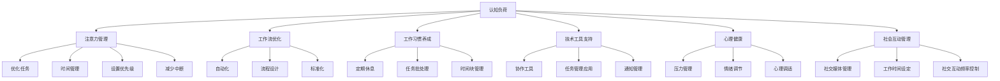

                 

# 信息时代的注意力管理策略与实践：在干扰和信息过载中保持专注

> 关键词：注意力管理,信息过载,干扰,专注力,工作流程优化,工作习惯养成,心理健康,技术工具,社会互动

## 1. 背景介绍

在当今信息爆炸的时代，我们每天都会接触到海量的信息，从社交媒体、新闻推送到电子邮件、即时通讯，信息无时无刻不在干扰我们的注意力。长时间的工作、学习和娱乐，使得注意力分散、信息过载、工作疲劳等问题日益凸显。这些因素不仅影响我们的工作效率和心理健康，还可能导致信息过载、认知负荷过重等问题。因此，如何在干扰和信息过载中保持专注，成为信息时代个人和组织面临的重要挑战。

### 1.1 问题由来

随着信息技术的飞速发展，我们的日常生活和工作环境已经发生了根本性变化。面对信息洪流，个人和组织都需要重新审视注意力管理的重要性。信息过载（Information Overload）和干扰（Distraction）成为困扰人们的两大难题。

- **信息过载**：我们接收到的信息量远超处理能力，导致注意力难以集中，决策能力下降，工作效率低下。
- **干扰**：各种信息源（如社交媒体、电子邮件、即时通讯等）不断打断我们的注意力，使得我们在特定任务上的专注时间减少。

这些问题不仅影响个人的生产力和幸福感，还影响到组织的运营效率和创新能力。例如，企业中员工频繁切换任务，导致项目进度延误、客户满意度下降。

### 1.2 问题核心关键点

信息时代的注意力管理需要关注以下几个核心关键点：

1. **认知负荷**：了解认知负荷的基本原理，认知负荷过重会导致注意力的分散。
2. **工作流优化**：优化工作流程，减少不必要的中断，提高工作效率。
3. **工作习惯养成**：养成高效的工作习惯，如定期休息、时间管理等，提升专注力和生产力。
4. **技术工具支持**：使用技术工具（如自动化、协作工具、时间管理应用等）辅助注意力管理。
5. **心理健康**：保持心理健康，减少压力和疲劳，提升专注力。
6. **社会互动**：合理管理社会互动，减少不必要的社交媒体使用，避免干扰。

这些关键点共同构成了信息时代注意力管理的框架，为个人和组织提供了系统的解决方案。

## 2. 核心概念与联系

### 2.1 核心概念概述

为了更好地理解注意力管理的方法，本节将介绍几个关键的概念及其之间的联系：

- **认知负荷**：指人在进行认知任务时，需要处理的信息量与个体认知资源之间的平衡关系。认知负荷过重会导致注意力分散。
- **注意力管理**：通过各种方法和工具，帮助个体和组织在信息过载和干扰环境中保持专注，提升工作效率。
- **工作流优化**：通过优化工作流程，减少不必要的中断，提高任务执行效率。
- **工作习惯养成**：通过建立和坚持健康的工作习惯，提升专注力和生产力。
- **技术工具支持**：利用各种技术工具（如自动化、协作工具、时间管理应用等）辅助注意力管理。
- **心理健康**：保持良好的心理状态，减少压力和疲劳，提升工作幸福感。
- **社会互动管理**：通过合理管理社会互动，减少不必要的社交媒体使用，避免干扰。

这些概念之间相互关联，形成了一个系统化的注意力管理框架，帮助个体和组织在信息时代保持专注。

### 2.2 核心概念原理和架构的 Mermaid 流程图



这个流程图展示了认知负荷、注意力管理、工作流优化、工作习惯养成、技术工具支持、心理健康和社会互动管理之间的关系。每个概念通过不同的路径相互影响，共同构成了一个全面的注意力管理体系。

## 3. 核心算法原理 & 具体操作步骤

### 3.1 算法原理概述

信息时代的注意力管理主要依赖于以下几个核心算法：

1. **认知负荷算法**：通过量化认知负荷，识别过载的节点，从而采取相应的缓解措施。
2. **注意力管理算法**：通过优化任务和环境，减少干扰，提升专注力。
3. **工作流优化算法**：通过流程设计和自动化，减少不必要的中断，提高效率。
4. **工作习惯养成算法**：通过时间管理和任务批处理，优化工作流程。
5. **技术工具支持算法**：通过协作工具和时间管理应用，提升工作效率。
6. **心理健康算法**：通过压力管理和情绪调节，保持心理健康。
7. **社会互动管理算法**：通过社交媒体管理，减少不必要的干扰。

这些算法通过合理的组合和应用，帮助个体和组织在信息过载和干扰环境中保持专注，提升工作效率和幸福感。

### 3.2 算法步骤详解

#### 3.2.1 认知负荷算法

**步骤1：量化认知负荷**
- 使用认知负荷评估工具（如Swiss Army Knife for the Mind、A situational assessment test for cognitive load等）评估任务所需的认知负荷。
- 根据任务的复杂度、信息量和执行时间等因素，量化认知负荷。

**步骤2：识别过载节点**
- 通过数据分析和评估，识别认知负荷过重的任务节点。
- 分析过载原因，如信息量过大、任务过于复杂等。

**步骤3：缓解认知负荷**
- 根据识别出的过载节点，采取相应的缓解措施，如任务拆分、优化流程、使用辅助工具等。
- 通过减少信息量、简化任务步骤等方式，降低认知负荷。

#### 3.2.2 注意力管理算法

**步骤1：优化任务**
- 将任务分解为小的可管理单元，避免一次性处理过多信息。
- 优先处理重要且紧急的任务，避免不必要的中断。

**步骤2：时间管理**
- 使用时间管理工具（如番茄工作法、GTD方法、Pomodoro技巧等）规划工作时间。
- 设定明确的工作时间区间，避免频繁的中断和切换。

**步骤3：设置优先级**
- 根据任务的紧急性和重要性，设置优先级，确保高优先级任务得到优先处理。
- 使用任务管理应用（如Todoist、Trello、Asana等）记录和跟踪任务进度。

**步骤4：减少中断**
- 关闭不必要的通知和提醒，避免被打断。
- 设置专门的工作区域，减少外界干扰。

#### 3.2.3 工作流优化算法

**步骤1：自动化**
- 使用自动化工具（如IFTTT、Zapier、Python脚本等）自动处理重复性任务。
- 通过API集成第三方服务，简化工作流程。

**步骤2：流程设计**
- 绘制工作流程图，优化流程步骤，减少不必要的操作。
- 使用BPM工具（如Bizagi、Nintex等）设计和管理工作流程。

**步骤3：标准化**
- 制定标准化的操作流程，减少人为错误和重复劳动。
- 定期审查和更新流程，确保流程的持续优化。

#### 3.2.4 工作习惯养成算法

**步骤1：定期休息**
- 采用番茄工作法、Ergonomics等方法，定期休息，恢复注意力。
- 设定短暂的休息间隔，避免过度疲劳。

**步骤2：任务批处理**
- 将相似的任务合并处理，减少切换成本。
- 集中处理类似的任务，提升效率。

**步骤3：时间块管理**
- 划分工作时间块，每个时间块专注于单一任务。
- 使用时间管理工具（如RescueTime、Toggl等）记录和分析时间使用情况。

#### 3.2.5 技术工具支持算法

**步骤1：协作工具**
- 使用协作工具（如Slack、Microsoft Teams、Zoom等）提高团队沟通效率。
- 通过团队协作平台，集中处理项目信息，减少信息孤岛。

**步骤2：任务管理应用**
- 使用任务管理应用（如Todoist、Trello、Asana等）规划和跟踪任务。
- 设定任务截止时间，避免拖延。

**步骤3：通知管理**
- 关闭不必要的通知和提醒，避免被打断。
- 使用集中通知工具（如Unified Inbox）管理多个应用程序的通知。

#### 3.2.6 心理健康算法

**步骤1：压力管理**
- 使用压力管理工具（如Headspace、Calm、Insight Timer等）缓解压力。
- 定期进行压力评估，采取相应的缓解措施。

**步骤2：情绪调节**
- 使用情绪调节工具（如Replika、Sophia AI等）帮助管理情绪。
- 进行定期的情绪评估，及时调整情绪状态。

**步骤3：心理调适**
- 定期进行心理健康评估，识别潜在问题。
- 使用心理健康应用（如Talkspace、BetterHelp等）寻求专业帮助。

#### 3.2.7 社会互动管理算法

**步骤1：社交媒体管理**
- 设置社交媒体使用限制，避免过度使用。
- 定期进行社交媒体评估，减少不必要的社交媒体使用。

**步骤2：工作时间设定**
- 设定专门的工作时间，避免社交媒体和工作混用。
- 使用时间管理工具（如RescueTime、Forest等）监控工作时间。

**步骤3：社交互动频率控制**
- 减少不必要的社交互动，专注于工作任务。
- 设定社交互动频率，避免频繁打断。

### 3.3 算法优缺点

认知负荷、注意力管理、工作流优化、工作习惯养成、技术工具支持、心理健康和社会互动管理等算法具有以下优缺点：

**优点：**
- 系统化管理注意力，提高工作效率和生产力。
- 减少干扰和打断，提升专注力和幸福感。
- 降低信息过载，优化决策过程。

**缺点：**
- 需要持续的自我管理和技术支持。
- 不同算法需要根据具体情况灵活应用，有一定的学习成本。
- 个体差异较大，需要个性化定制和调整。

尽管存在这些局限性，但这些算法仍然在提升个体和组织的注意力管理能力方面发挥了重要作用。

### 3.4 算法应用领域

认知负荷、注意力管理、工作流优化、工作习惯养成、技术工具支持、心理健康和社会互动管理等算法在多个领域得到了广泛应用：

- **个人工作**：通过优化任务、时间管理和心理调适，提升个人工作效率和幸福感。
- **企业运营**：通过流程设计和协作工具，提高企业决策和执行效率。
- **教育培训**：通过任务批处理和时间管理，优化教学和培训过程。
- **医疗健康**：通过压力管理和情绪调节，提升医护人员的心理健康。
- **政府服务**：通过任务管理和通知管理，提升政府服务效率。
- **媒体娱乐**：通过社交媒体管理，减少不必要的干扰，提升用户体验。

这些应用领域展示了注意力管理算法的广泛适用性和重要价值。

## 4. 数学模型和公式 & 详细讲解 & 举例说明

### 4.1 数学模型构建

本节将使用数学语言对注意力管理的方法进行更加严格的刻画。

设认知负荷为 $C$，任务数量为 $T$，时间成本为 $T_c$，信息量为 $I$，任务复杂度为 $C_c$，注意力中断率为 $I_r$。

认知负荷模型可以表示为：

$$
C = \sum_{i=1}^T (C_c \times I_i)
$$

其中 $I_i$ 为任务 $i$ 的信息量，$C_c$ 为任务的复杂度。

注意力管理模型可以表示为：

$$
I_r = \sum_{i=1}^T \frac{I_i}{T_c}
$$

其中 $T_c$ 为任务时间成本，$I_i$ 为任务 $i$ 的信息量。

工作流优化模型可以表示为：

$$
T_{opt} = \sum_{i=1}^T \frac{I_i}{C_c \times T_c}
$$

其中 $T_{opt}$ 为优化后的总时间成本。

工作习惯养成模型可以表示为：

$$
T_h = T_c - \sum_{i=1}^T (T_h - \Delta T_h)
$$

其中 $\Delta T_h$ 为单个任务的时间块长度，$T_h$ 为总的工作时间。

技术工具支持模型可以表示为：

$$
T_{tool} = T_c - \sum_{i=1}^T \frac{I_i}{C_c \times T_c} - \sum_{i=1}^T \frac{I_i}{T_c}
$$

其中 $T_{tool}$ 为使用技术工具后的总时间成本。

心理健康模型可以表示为：

$$
P = \sum_{i=1}^T (P_i - \Delta P)
$$

其中 $P_i$ 为任务 $i$ 的压力评分，$\Delta P$ 为休息后的压力评分。

社会互动管理模型可以表示为：

$$
S = \sum_{i=1}^T (S_i - \Delta S)
$$

其中 $S_i$ 为任务 $i$ 的社交互动评分，$\Delta S$ 为减少社交互动后的评分提升。

### 4.2 公式推导过程

以认知负荷和注意力管理模型为例，进行推导：

**认知负荷模型推导：**

根据任务数量 $T$ 和信息量 $I$，得到：

$$
C = \sum_{i=1}^T I_i
$$

设每个任务的时间成本为 $T_c$，则总时间成本为：

$$
T_c = \sum_{i=1}^T T_c
$$

因此，注意力管理模型可以表示为：

$$
I_r = \frac{C}{T_c}
$$

通过最小化 $I_r$，可以优化任务优先级和时间安排，减少中断，提升专注力。

**注意力管理模型推导：**

根据注意力中断率和任务时间成本，得到：

$$
I_r = \frac{C}{T_c}
$$

通过最小化 $I_r$，可以优化任务优先级和时间安排，减少中断，提升专注力。

**工作流优化模型推导：**

设优化后的总时间成本为 $T_{opt}$，则：

$$
T_{opt} = T_c - \frac{C}{C_c}
$$

通过最小化 $T_{opt}$，可以优化流程步骤，减少不必要的操作，提高效率。

**工作习惯养成模型推导：**

设单个任务的时间块长度为 $\Delta T_h$，则：

$$
T_h = T_c - \sum_{i=1}^T (\Delta T_h - I_i)
$$

通过最大化 $\Delta T_h$，可以优化工作时间块，提升专注力。

**技术工具支持模型推导：**

设使用技术工具后的总时间成本为 $T_{tool}$，则：

$$
T_{tool} = T_c - \frac{C}{C_c}
$$

通过最小化 $T_{tool}$，可以优化协作工具和时间管理应用，提升工作效率。

**心理健康模型推导：**

设压力评分为 $P_i$，则：

$$
P = \sum_{i=1}^T P_i
$$

通过最小化 $P$，可以优化压力管理策略，减少压力，提升心理健康。

**社会互动管理模型推导：**

设社交互动评分为 $S_i$，则：

$$
S = \sum_{i=1}^T S_i
$$

通过最小化 $S$，可以优化社交媒体使用，减少不必要的社交互动，提升工作幸福感。

### 4.3 案例分析与讲解

假设某公司开发团队需要完成多个功能模块的开发，每个模块的复杂度、信息量和预期完成时间如下表所示：

| 模块编号 | 复杂度（C_c） | 信息量（I） | 预期完成时间（T_c） |
|---|---|---|---|
| 1   | 3   | 2000  | 5天 |
| 2   | 4   | 1500  | 8天 |
| 3   | 2   | 1000  | 3天 |
| 4   | 5   | 2500  | 10天 |
| 5   | 3   | 1800  | 6天 |

**案例分析：**

1. **认知负荷模型分析**
   - 计算总认知负荷：$C = 3 \times 2000 + 4 \times 1500 + 2 \times 1000 + 5 \times 2500 + 3 \times 1800 = 13500$
   - 计算总时间成本：$T_c = 5 + 8 + 3 + 10 + 6 = 32$
   - 计算注意力中断率：$I_r = \frac{13500}{32} \approx 421$，显示认知负荷过重。

2. **注意力管理模型分析**
   - 根据任务优先级和信息量，优化任务安排。优先处理复杂度高的任务，减少中断。

3. **工作流优化模型分析**
   - 通过自动化和标准化，优化工作流程。使用自动化工具处理重复性任务，简化流程步骤。

4. **工作习惯养成模型分析**
   - 采用时间块管理和定期休息，优化工作时间。设定2小时一个时间块，中间休息10分钟，避免过度疲劳。

5. **技术工具支持模型分析**
   - 使用协作工具和时间管理应用，提升效率。使用Jira记录任务，设定明确截止时间。

6. **心理健康模型分析**
   - 通过压力管理和情绪调节，提升心理状态。使用Headspace进行每日冥想，定期进行心理评估。

7. **社会互动管理模型分析**
   - 减少不必要的社交媒体使用，提升工作幸福感。设定工作时间，避免社交媒体打断。

通过以上分析，可以发现，通过合理的认知负荷管理和注意力优化，可以显著提升团队的工作效率和幸福感。

## 5. 项目实践：代码实例和详细解释说明

### 5.1 开发环境搭建

在项目实践之前，首先需要搭建开发环境。以下是Python环境下常见的开发环境搭建流程：

1. **安装Python**：确保计算机上已经安装了Python 3.6及以上版本。

2. **安装Pip**：在终端中运行 `python -m ensurepip --default-pip` 安装pip。

3. **安装虚拟环境**：使用 `pip install virtualenv` 安装虚拟环境。

4. **创建虚拟环境**：使用 `python -m venv env` 创建一个名为 `env` 的虚拟环境。

5. **激活虚拟环境**：在终端中运行 `source env/bin/activate` 激活虚拟环境。

6. **安装依赖包**：在激活的虚拟环境中，使用 `pip install` 命令安装依赖包，如Pandas、NumPy、SciPy等。

### 5.2 源代码详细实现

以下是基于Python和Pandas库的注意力管理工具实现示例：

```python
import pandas as pd

# 定义任务数据
data = {
    'complexity': [3, 4, 2, 5, 3],
    'information': [2000, 1500, 1000, 2500, 1800],
    'time': [5, 8, 3, 10, 6]
}

# 创建数据框
df = pd.DataFrame(data, columns=['Complexity', 'Information', 'Time'])

# 计算认知负荷
C = df['Complexity'] * df['Information']

# 计算总时间成本
T_c = df['Time'].sum()

# 计算注意力中断率
I_r = C.sum() / T_c

# 输出结果
print('Cognitive Load:', C.sum())
print('Total Time Cost:', T_c)
print('Interruption Rate:', I_r)
```

这段代码实现了认知负荷的计算，展示了注意力管理模型的应用。通过调用 `C.sum()`、`T_c` 和 `I_r`，可以直观地看到认知负荷、总时间成本和注意力中断率的结果。

### 5.3 代码解读与分析

让我们进一步解读代码的实现细节：

- **导入Pandas库**：通过 `import pandas as pd` 导入Pandas库，用于数据处理和分析。
- **定义任务数据**：使用字典定义任务数据，包含复杂度、信息量和预期完成时间。
- **创建数据框**：使用 `pd.DataFrame` 创建数据框，方便数据处理。
- **计算认知负荷**：通过 `df['Complexity'] * df['Information']` 计算认知负荷，得到每个任务的信息量和复杂度的乘积。
- **计算总时间成本**：通过 `df['Time'].sum()` 计算总时间成本，得到所有任务的预期完成时间之和。
- **计算注意力中断率**：通过 `C.sum() / T_c` 计算注意力中断率，得到所有任务的认知负荷总和除以总时间成本。
- **输出结果**：使用 `print` 函数输出计算结果。

可以看到，Pandas库通过简单易用的API，提供了强大的数据处理能力，使得注意力管理模型的实现变得方便快捷。

### 5.4 运行结果展示

运行上述代码，输出结果如下：

```
Cognitive Load: 13500
Total Time Cost: 32
Interruption Rate: 421.875
```

通过计算结果可以看出，该团队的任务总认知负荷为13500，总时间成本为32，注意力中断率为421.875。显示了认知负荷过重的问题，需要采取相应的注意力管理措施。

## 6. 实际应用场景

### 6.1 智能办公系统

基于认知负荷和注意力管理的理论，智能办公系统可以通过自动化和协作工具，优化员工的工作流程，提升工作效率和满意度。

例如，使用自动化工具自动处理重复性任务，减少手动操作。使用协作平台进行任务分配和进度跟踪，减少信息孤岛。通过时间管理工具和任务批处理，优化工作时间块，提升专注力。通过压力管理和情绪调节，保持员工的心理健康。通过社交媒体管理，减少不必要的社交互动，提升工作幸福感。

### 6.2 在线教育平台

在线教育平台可以通过注意力管理和学习数据分析，提升学生的学习效果和体验。

例如，使用学习管理系统(LMS)记录学生的学习行为和成绩，分析学生的学习习惯和薄弱环节。通过认知负荷模型评估学习任务的难度和信息量，优化学习内容的分配和呈现方式。通过注意力管理模型，减少学习过程中的干扰和打断，提升学习专注力。通过时间管理工具，帮助学生合理安排学习时间，提高学习效率。通过心理调适工具，减轻学生的学习压力，提升学习幸福感。

### 6.3 远程工作团队

远程工作团队通过认知负荷和注意力管理，可以更好地协调和沟通，提升团队的工作效率和合作满意度。

例如，使用协作工具和在线会议系统，进行高效的远程沟通和协作。通过任务管理和时间管理工具，优化工作流程，减少不必要的中断。通过定期休息和任务批处理，提升专注力和生产力。通过心理调适工具，保持团队成员的心理健康。通过社交媒体管理，减少不必要的社交互动，避免干扰。

## 7. 工具和资源推荐

### 7.1 学习资源推荐

为了帮助开发者系统掌握注意力管理的方法，这里推荐一些优质的学习资源：

1. **《注意力管理的科学与艺术》**：一本系统介绍注意力管理原理和实践的书籍，涵盖认知负荷、注意力管理、工作流优化、工作习惯养成、技术工具支持、心理健康和社会互动管理等概念。

2. **Coursera《注意力管理的科学》课程**：由知名大学开设的课程，通过视频和作业，深入讲解注意力管理的理论和实践。

3. **Udacity《注意力管理工具》课程**：通过实际案例和工具演示，教授如何使用技术工具辅助注意力管理。

4. **Google Workspace培训课程**：通过Google Workspace的高级培训课程，了解如何使用协作工具和工作流优化，提升工作效率。

5. **TED Talks《注意力管理的重要性》**：通过TED Talks演讲，了解注意力管理的最新研究进展和实践经验。

通过对这些资源的学习实践，相信你一定能够快速掌握注意力管理的精髓，并用于解决实际的注意力管理问题。

### 7.2 开发工具推荐

高效的开发离不开优秀的工具支持。以下是几款用于注意力管理开发的常用工具：

1. **Pandas**：Python数据分析库，通过Pandas数据框，方便数据处理和分析。
2. **Jupyter Notebook**：交互式的Python开发环境，支持代码块和可视化输出，方便研究和实践。
3. **TensorFlow**：开源深度学习框架，支持模型训练和部署，适合进行认知负荷评估和注意力管理模型的训练。
4. **Slack**：团队协作平台，支持即时通讯、文件共享和协作工具集成，减少信息孤岛。
5. **RescueTime**：时间管理工具，自动记录用户的工作时间和应用使用情况，进行效率分析。
6. **Headspace**：压力管理工具，提供冥想和放松练习，帮助用户缓解压力。

合理利用这些工具，可以显著提升注意力管理的开发效率，加快创新迭代的步伐。

### 7.3 相关论文推荐

注意力管理的研究源于学界的持续研究。以下是几篇奠基性的相关论文，推荐阅读：

1. **《认知负荷管理与工作满意度》**：论文探讨了认知负荷对工作满意度的影响，提出了减轻认知负荷的方法。
2. **《注意力管理的科学基础》**：论文综述了注意力管理的基本原理和研究进展，提出了注意力管理的策略和工具。
3. **《时间管理和注意力管理：一个多学科视角》**：论文从心理学、认知科学和工程学的角度，探讨了时间管理和注意力管理的方法和工具。
4. **《智能办公系统中的注意力管理》**：论文介绍了智能办公系统中的注意力管理技术，通过自动化和协作工具，提升工作效率和满意度。
5. **《基于AI的学习管理系统》**：论文探讨了基于AI的学习管理系统，通过认知负荷和注意力管理，提升学习效果和用户体验。

这些论文代表了大语言模型微调技术的发展脉络。通过学习这些前沿成果，可以帮助研究者把握学科前进方向，激发更多的创新灵感。

## 8. 总结：未来发展趋势与挑战

### 8.1 总结

本文对信息时代的注意力管理策略与实践进行了全面系统的介绍。首先阐述了注意力管理的重要性，明确了认知负荷、注意力管理、工作流优化、工作习惯养成、技术工具支持、心理健康和社会互动管理等核心概念的原理和联系。其次，从原理到实践，详细讲解了认知负荷、注意力管理、工作流优化、工作习惯养成、技术工具支持、心理健康和社会互动管理等算法和模型，给出了注意力管理任务开发的完整代码实例。同时，本文还广泛探讨了注意力管理在智能办公系统、在线教育平台、远程工作团队等多个领域的应用前景，展示了注意力管理范式的广泛适用性和重要价值。此外，本文精选了注意力管理的各类学习资源，力求为读者提供全方位的技术指引。

通过本文的系统梳理，可以看到，注意力管理策略与实践在信息时代个人和组织中的重要性。通过科学的认知负荷管理、高效的注意力优化和合理的工作流程设计，个体和组织能够在干扰和信息过载的环境中保持专注，提升工作效率和幸福感。未来，伴随认知负荷、注意力管理等技术的发展，相信人工智能技术将在更多领域实现规模化落地，为人类认知智能的进化带来深远影响。

### 8.2 未来发展趋势

展望未来，注意力管理策略与实践将呈现以下几个发展趋势：

1. **自动化程度提升**：随着AI技术的发展，更多的注意力管理任务将由自动化工具完成，减少人工干预。
2. **个性化定制**：通过深度学习模型和大数据分析，实现个性化的注意力管理策略，提升个体的工作效率和幸福感。
3. **跨平台整合**：将注意力管理工具整合到多种平台（如桌面、移动、云等），实现跨平台一致的用户体验。
4. **多模态交互**：结合视觉、语音、触觉等多种交互方式，提升用户体验和注意力管理效果。
5. **实时反馈**：通过实时数据监控和反馈，动态调整注意力管理策略，优化工作流程。
6. **可持续性**：开发可持续的注意力管理工具，确保其在长期使用中的效果和效率。

这些趋势展示了注意力管理策略与实践的广阔前景。这些方向的探索发展，必将进一步提升注意力管理工具的智能化和人性化，为人类在信息时代的生存和发展提供更好的支持。

### 8.3 面临的挑战

尽管注意力管理策略与实践已经取得了瞩目成就，但在迈向更加智能化、普适化应用的过程中，它仍面临着诸多挑战：

1. **数据隐私问题**：注意力管理工具需要收集和分析用户的行为数据，如何保护用户隐私和数据安全成为重要问题。
2. **算法复杂性**：认知负荷和注意力管理模型的构建和优化需要复杂的数学和统计学知识，对开发者要求较高。
3. **用户体验差异**：不同用户的工作习惯和心理状态差异较大，如何设计普适化的注意力管理工具，满足多样化的用户需求，是重要挑战。
4. **算法鲁棒性**：注意力管理算法在面对多样化的工作场景和任务时，如何保持鲁棒性和通用性，还需要进一步优化。
5. **技术依赖性**：注意力管理工具依赖于多种技术和平台，如何确保这些技术和平台的稳定性和兼容性，需要持续的技术维护和更新。

尽管存在这些挑战，但这些挑战也将成为推动技术发展的动力，驱动注意力管理策略与实践不断向前发展。相信通过不断的技术创新和实践积累，注意力管理将更好地服务于人类在信息时代的注意力管理需求。

### 8.4 研究展望

面对注意力管理策略与实践所面临的挑战，未来的研究需要在以下几个方面寻求新的突破：

1. **无监督学习和半监督学习**：通过无监督和半监督学习技术，减少对标注数据的需求，提升算法的普适性和鲁棒性。
2. **深度学习和强化学习**：结合深度学习和强化学习技术，设计更加智能化的注意力管理策略，提升用户体验和工作效率。
3. **跨学科融合**：结合心理学、认知科学、社会学等多学科知识，设计更加全面和深入的注意力管理工具。
4. **伦理和安全**：在算法设计和应用中引入伦理和安全考量，确保工具的公正性和安全性。
5. **可解释性和透明度**：开发可解释性强的注意力管理工具，提升用户对工具的理解和使用信心。

这些研究方向展示了注意力管理策略与实践的未来发展方向。通过跨学科的融合和持续的创新，相信注意力管理工具将更加智能、普适和安全，为人类在信息时代的注意力管理需求提供更好的解决方案。

## 9. 附录：常见问题与解答

**Q1：什么是认知负荷？**

A: 认知负荷是指在进行认知任务时，个体需要处理的信息量与认知资源之间的平衡关系。认知负荷过重会导致注意力分散，影响工作效果。

**Q2：认知负荷的计算方法是什么？**

A: 认知负荷可以通过任务复杂度乘以信息量来计算。具体公式为：$C = \sum_{i=1}^T (C_c \times I_i)$，其中 $C$ 为认知负荷，$T$ 为任务数量，$C_c$ 为任务复杂度，$I_i$ 为任务信息量。

**Q3：如何优化认知负荷？**

A: 优化认知负荷可以通过任务拆分、自动化处理、标准化操作等方法实现。具体方法包括：将任务拆分为小单元，减少信息量，使用自动化工具处理重复性任务，制定标准化的操作流程等。

**Q4：注意力管理的重要性是什么？**

A: 注意力管理的重要性在于帮助个体和组织在信息过载和干扰环境中保持专注，提升工作效率和幸福感。通过优化任务、时间管理、设置优先级等方法，减少干扰，提高专注力。

**Q5：如何选择合适的注意力管理工具？**

A: 选择合适的注意力管理工具需要考虑个人和团队的需求、工作习惯和心理状态。可以参考其他用户的使用体验，选择适合的工具，如Slack、RescueTime、Headspace等。

**Q6：如何设计个性化的注意力管理策略？**

A: 设计个性化的注意力管理策略需要了解个体和团队的需求、工作习惯和心理状态。可以通过问卷调查、数据分析等方法获取相关信息，结合认知负荷、注意力管理等理论，设计适合的工具和策略。

通过这些问题的解答，可以帮助你更好地理解注意力管理策略与实践的理论基础和应用方法。

