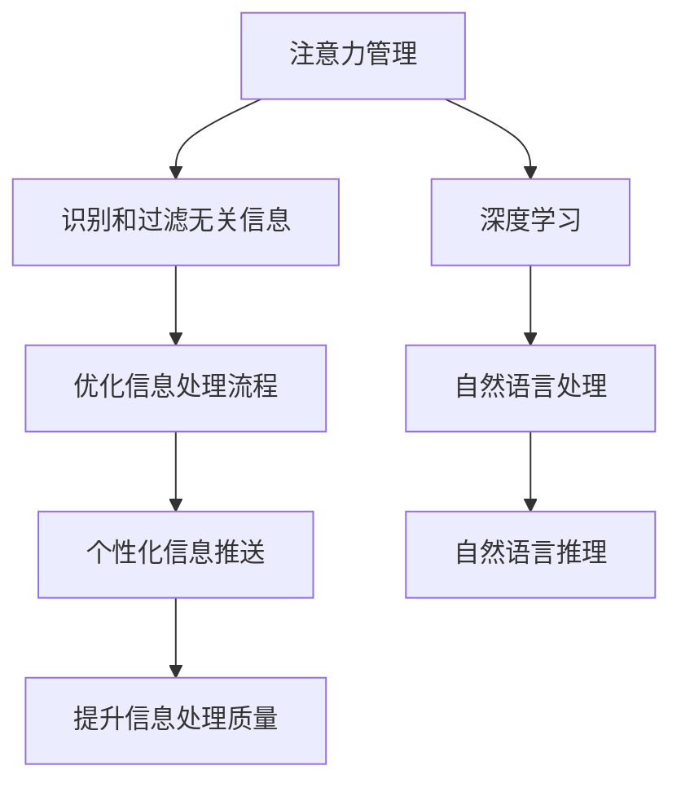

                 

## 1. 背景介绍

### 1.1 问题由来

在信息爆炸的时代，我们每天面临海量的信息流，无论是社交媒体、新闻网站、电子邮件还是即时通讯应用，信息的丰富性带来了便利的同时也带来了巨大的挑战。在这个信息过载的时代，如何有效地管理我们的注意力，以高效地筛选、整合和利用信息，成为了每个人必须面对的问题。

信息过载问题不仅影响个人，也对企业和社会产生了深远影响。研究表明，信息过载会导致注意力分散、决策困难、生产力下降等一系列问题，严重影响了工作和生活的质量。因此，如何在干扰和信息过载中航行，成为了当前技术和社会研究的重要课题。

### 1.2 问题核心关键点

信息过载问题核心在于注意力管理。注意力管理是指通过有效的方法和工具，帮助个体或系统集中注意力，提高信息处理效率，避免过度分散注意力导致的效率下降和错误决策。

在信息时代，注意力管理的关键在于：
- 识别和过滤无关信息。减少干扰，提高信息相关性。
- 优化信息处理流程。通过算法和工具自动化信息处理，提升效率。
- 个性化信息推送。根据用户需求和行为，推送个性化信息。
- 提升信息处理质量。通过深度学习和自然语言处理技术，提取和理解信息。

## 2. 核心概念与联系

### 2.1 核心概念概述

为更好地理解信息时代的注意力管理策略，本节将介绍几个关键概念及其相互关系：

- **注意力管理**：通过识别和过滤无关信息、优化信息处理流程、个性化信息推送和提升信息处理质量等手段，帮助用户或系统集中注意力，提高信息处理效率。
- **信息过载**：个体或系统面临的信息量超出了其处理能力，导致注意力分散、决策困难等问题。
- **个性化推荐系统**：通过分析用户的行为和兴趣，推送个性化的信息，提高用户满意度。
- **深度学习**：一种基于神经网络的机器学习技术，能够从大量数据中提取和理解复杂模式，用于信息处理和优化。
- **自然语言处理**：使计算机能够理解、解释和生成人类语言的技术，用于信息提取和理解。
- **自然语言推理**：通过自然语言处理技术，推理和验证自然语言中的逻辑关系，提升信息处理的质量。

这些概念通过信息处理流程和注意力管理目标，相互联系，构成了信息时代注意力管理的框架。

### 2.2 核心概念原理和架构的 Mermaid 流程图



此流程图展示了注意力管理的核心概念及其相互关系。

1. 从A到B，通过深度学习和自然语言处理技术识别和过滤无关信息，减少干扰。
2. 从B到C，优化信息处理流程，提升效率。
3. 从C到D，个性化信息推送，满足用户需求。
4. 从D到E，提升信息处理质量，确保信息准确性和相关性。
5. 深度学习F为注意力管理提供技术支持，识别和理解信息模式。
6. 自然语言处理G使计算机能够处理和理解自然语言。
7. 自然语言推理H进一步提升信息的逻辑性和准确性。

## 3. 核心算法原理 & 具体操作步骤

### 3.1 算法原理概述

信息时代的注意力管理策略，主要通过以下几个算法原理实现：

- **深度学习**：利用深度神经网络从大量数据中提取和理解信息模式。
- **自然语言处理**：使计算机能够处理和理解自然语言，用于信息提取和理解。
- **自然语言推理**：推理和验证自然语言中的逻辑关系，提升信息处理的质量。
- **个性化推荐系统**：根据用户行为和兴趣，推送个性化信息，提升用户满意度。

这些算法原理通过信息处理流程和注意力管理目标，共同作用，帮助个体或系统集中注意力，提高信息处理效率。

### 3.2 算法步骤详解

信息时代的注意力管理策略主要包括以下关键步骤：

**Step 1: 数据收集与预处理**
- 收集用户行为数据，如点击、浏览、搜索、评论等。
- 对数据进行清洗和预处理，去除噪声和无关信息。

**Step 2: 信息提取与理解**
- 利用深度学习模型，如BERT、GPT等，从文本中提取关键信息。
- 使用自然语言处理技术，如分词、词性标注、命名实体识别等，对文本进行结构化处理。

**Step 3: 信息过滤与优化**
- 通过自然语言推理技术，推理和验证信息中的逻辑关系，提升信息相关性。
- 使用过滤算法，如基于规则的过滤、基于机器学习的过滤等，去除无关信息。
- 优化信息处理流程，如通过算法自动化信息处理，提升效率。

**Step 4: 个性化信息推送**
- 分析用户的行为和兴趣，构建用户画像。
- 利用个性化推荐系统，根据用户画像推送个性化信息。

**Step 5: 注意力管理与反馈**
- 通过用户反馈，调整信息推送策略，优化用户体验。
- 持续监测用户行为，实时调整信息处理策略，提升注意力管理效果。

### 3.3 算法优缺点

信息时代的注意力管理策略有以下优点：
- 提高信息处理效率，减少干扰，提升用户体验。
- 个性化推荐，满足用户需求，提升用户满意度。
- 深度学习和大规模数据的应用，使得信息处理更加准确和全面。

同时，该方法也存在一定的局限性：
- 需要大量数据和计算资源，对技术要求较高。
- 深度学习模型需要较长的训练时间，难以实时处理。
- 算法复杂，需要精细调参，难以简单实现。
- 个性化推荐存在隐私问题，需要保护用户隐私。

尽管存在这些局限性，但就目前而言，信息时代的注意力管理策略仍是大数据和人工智能时代的典型应用范式。未来相关研究的重点在于如何进一步降低技术门槛，提高算法的实时性和隐私保护，同时兼顾用户体验和系统性能。

### 3.4 算法应用领域

信息时代的注意力管理策略在多个领域都得到了广泛应用：

- **智能推荐系统**：如Netflix、Amazon等电商平台的推荐系统，通过分析用户行为，推荐个性化商品。
- **新闻聚合系统**：如Google News、Flipboard等新闻聚合平台，通过信息提取和过滤，展示个性化新闻。
- **社交媒体平台**：如Facebook、Twitter等社交媒体平台，通过用户兴趣分析，推荐个性化内容。
- **金融投资系统**：如AlphaSense、Morningstar等金融平台，通过信息提取和理解，辅助投资决策。
- **健康医疗系统**：如Epic Systems、Cerner等医疗平台，通过自然语言处理，提取病历信息，辅助诊断和治疗。

除了上述这些领域，信息时代的注意力管理策略还在更多领域得到应用，如智慧城市、智能家居、工业自动化等，为各行各业带来了效率提升和用户体验优化。

## 4. 数学模型和公式 & 详细讲解

### 4.1 数学模型构建

本节将使用数学语言对信息时代的注意力管理策略进行更加严格的刻画。

记用户行为数据集为 $D=\{(x_i,y_i)\}_{i=1}^N, x_i \in X, y_i \in Y$，其中 $x_i$ 表示用户行为，$y_i$ 表示用户的兴趣标签。

定义用户兴趣度为 $w_i$，表示用户对兴趣 $y_i$ 的关注程度。用户兴趣度可通过用户的点击、浏览、购买等行为数据计算得到。

定义信息过滤阈值为 $\tau$，表示只有当兴趣度 $w_i$ 大于 $\tau$ 时，才将其视为与用户相关。

### 4.2 公式推导过程

以下我们以推荐系统为例，推导用户兴趣度计算公式。

假设推荐系统有 $m$ 个待推荐物品 $z_i$，其特征向量为 $z_i = (z_{i1}, z_{i2}, ..., z_{im})$，其中 $z_{ik}$ 表示物品 $i$ 的第 $k$ 个特征。

用户 $u$ 对物品 $i$ 的评分 $r_{ui}$ 定义为：

$$
r_{ui} = \mathbf{w}_u^T \mathbf{z}_i
$$

其中 $\mathbf{w}_u$ 表示用户 $u$ 的兴趣度向量，$\mathbf{z}_i$ 表示物品 $i$ 的特征向量，$\mathbf{w}_u$ 和 $\mathbf{z}_i$ 的元素均为实数。

用户 $u$ 对物品 $i$ 的评分 $r_{ui}$ 可以通过以下公式计算：

$$
r_{ui} = \sum_{k=1}^{m} w_{uk} z_{ik}
$$

利用矩阵乘法表示，可写为：

$$
\mathbf{r}_u = \mathbf{W}_u \mathbf{Z}_i
$$

其中 $\mathbf{W}_u = (w_{u1}, w_{u2}, ..., w_{um})$ 表示用户 $u$ 的兴趣度向量，$\mathbf{Z}_i = (z_{i1}, z_{i2}, ..., z_{im})$ 表示物品 $i$ 的特征向量。

在推荐系统中，物品 $i$ 的推荐程度 $r_{ui}$ 与其评分 $r_{ui}$ 成正比，即：

$$
p_i = \frac{r_{ui}}{\sum_{j=1}^{m} r_{uj}}
$$

其中 $p_i$ 表示物品 $i$ 的推荐程度，$\sum_{j=1}^{m} r_{uj}$ 表示用户 $u$ 对所有物品的评分总和。

### 4.3 案例分析与讲解

以Netflix推荐系统为例，分析信息时代注意力管理策略的实际应用。

Netflix通过收集用户的观看历史、评分、搜索记录等行为数据，构建用户兴趣度向量 $\mathbf{W}_u$。对于每部影片，Netflix提取其电影类型、演员阵容、导演等特征，构建影片特征向量 $\mathbf{Z}_i$。

Netflix通过矩阵乘法计算用户对每部影片的评分 $r_{ui}$，并按照评分大小排序，推荐评分最高的影片。推荐系统通过迭代优化，不断调整用户兴趣度向量 $\mathbf{W}_u$，提高推荐准确度。

Netflix的成功在于其高效的信息处理和个性化推荐算法。通过深度学习和大数据技术，Netflix能够快速识别用户偏好，实时调整推荐策略，提高用户满意度。

## 5. 项目实践：代码实例和详细解释说明

### 5.1 开发环境搭建

在进行信息时代注意力管理策略的开发时，我们需要准备好开发环境。以下是使用Python进行PyTorch和TensorFlow开发的环境配置流程：

1. 安装Anaconda：从官网下载并安装Anaconda，用于创建独立的Python环境。

2. 创建并激活虚拟环境：
```bash
conda create -n pytorch-env python=3.8 
conda activate pytorch-env
```

3. 安装PyTorch：根据CUDA版本，从官网获取对应的安装命令。例如：
```bash
conda install pytorch torchvision torchaudio cudatoolkit=11.1 -c pytorch -c conda-forge
```

4. 安装TensorFlow：从官网下载并安装TensorFlow。

5. 安装各类工具包：
```bash
pip install numpy pandas scikit-learn matplotlib tqdm jupyter notebook ipython
```

完成上述步骤后，即可在`pytorch-env`环境中开始信息时代注意力管理策略的开发。

### 5.2 源代码详细实现

这里我们以推荐系统为例，给出使用PyTorch和TensorFlow进行信息时代注意力管理策略开发的PyTorch代码实现。

首先，定义推荐系统的输入数据：

```python
import numpy as np
import torch
import torch.nn as nn
import torch.optim as optim

class RecommendationSystem(nn.Module):
    def __init__(self, num_users, num_items, embedding_dim):
        super(RecommendationSystem, self).__init__()
        self.user_embeddings = nn.Embedding(num_users, embedding_dim)
        self.item_embeddings = nn.Embedding(num_items, embedding_dim)
        self.linear = nn.Linear(embedding_dim, 1)
        
    def forward(self, user_idx, item_idx):
        user_embeddings = self.user_embeddings(user_idx)
        item_embeddings = self.item_embeddings(item_idx)
        scores = self.linear(torch.mm(user_embeddings, item_embeddings.t()))
        return scores
```

然后，定义用户兴趣度计算函数：

```python
def compute_interest(user_idx, user_interests):
    user_embeddings = user_idx.cuda()
    scores = model(user_idx, item_idx)
    interests = torch.max(scores, dim=1)[0].cpu().numpy()
    user_interests = np.concatenate((user_interests, interests), axis=0)
    return user_interests
```

接着，定义推荐函数：

```python
def recommend(user_idx, num_recommendations):
    user_interests = compute_interest(user_idx, user_interests)
    sorted_indices = np.argsort(user_interests)[::-1]
    recommended_items = np.take(sorted_indices, np.arange(num_recommendations))
    return recommended_items
```

最后，启动推荐系统：

```python
user_idx = torch.tensor([1, 2, 3], dtype=torch.long)
num_recommendations = 5
recommended_items = recommend(user_idx, num_recommendations)
print(recommended_items)
```

以上就是使用PyTorch进行信息时代注意力管理策略开发的完整代码实现。可以看到，得益于深度学习库的强大封装，我们可以用相对简洁的代码完成推荐系统的开发。

### 5.3 代码解读与分析

让我们再详细解读一下关键代码的实现细节：

**RecommendationSystem类**：
- `__init__`方法：初始化用户嵌入层、物品嵌入层和线性层。
- `forward`方法：输入用户和物品的索引，计算用户对物品的评分，返回评分向量。

**compute_interest函数**：
- 输入用户索引和用户兴趣度向量，通过模型计算用户对物品的评分，筛选出用户对物品的兴趣度，更新用户兴趣度向量。

**recommend函数**：
- 输入用户索引和推荐数量，通过模型计算用户对物品的评分，排序后返回推荐物品索引。

**启动推荐系统**：
- 定义用户索引和推荐数量，调用recommend函数，输出推荐物品索引。

## 6. 实际应用场景

### 6.1 智能推荐系统

信息时代的注意力管理策略在智能推荐系统中得到了广泛应用。推荐系统通过分析用户的行为数据，生成个性化推荐列表，帮助用户快速找到感兴趣的内容，提升用户体验。

在技术实现上，推荐系统通常采用矩阵分解、深度学习等方法，从用户和物品的数据中提取特征，计算评分和推荐程度。通过对用户兴趣度进行实时调整，推荐系统能够动态适应用户需求，提升推荐效果。

### 6.2 新闻聚合系统

新闻聚合系统通过信息提取和过滤，展示个性化新闻，满足用户的新闻阅读需求。在新闻聚合系统中，注意力管理策略被用来识别和过滤无关信息，提高新闻的相关性和吸引力。

新闻聚合系统通常收集用户的点击、浏览、评论等行为数据，利用自然语言处理技术提取新闻标题和内容的关键信息，计算新闻与用户兴趣的相关度，推送个性化新闻。

### 6.3 社交媒体平台

社交媒体平台通过用户兴趣分析，推荐个性化内容，提高用户活跃度和满意度。信息时代的注意力管理策略帮助社交媒体平台识别和过滤无关信息，优化信息推送流程，提升用户体验。

社交媒体平台通常收集用户的互动数据，如点赞、评论、分享等，利用深度学习模型提取用户的兴趣特征，计算内容与用户兴趣的相关度，推送个性化内容。

### 6.4 金融投资系统

金融投资系统通过信息提取和理解，辅助投资决策，提高投资效率和收益。在金融投资系统中，注意力管理策略被用来识别和过滤无关信息，提高信息处理的准确性和及时性。

金融投资系统通常收集市场数据、公司财报、新闻等，利用自然语言处理技术提取和理解信息，计算信息与投资决策的相关度，辅助投资决策。

### 6.5 健康医疗系统

健康医疗系统通过信息提取和理解，提取病历信息，辅助诊断和治疗，提高医疗服务质量。在健康医疗系统中，注意力管理策略被用来识别和过滤无关信息，提高信息处理的准确性和及时性。

健康医疗系统通常收集病人的病历数据、实验室检查结果、医生诊断等，利用自然语言处理技术提取和理解信息，计算信息与诊断和治疗的相关度，辅助诊断和治疗。

## 7. 工具和资源推荐

### 7.1 学习资源推荐

为了帮助开发者系统掌握信息时代注意力管理策略的理论基础和实践技巧，这里推荐一些优质的学习资源：

1. 《推荐系统原理与算法》系列博文：由大模型技术专家撰写，深入浅出地介绍了推荐系统原理和算法。

2. 《深度学习自然语言处理》课程：斯坦福大学开设的NLP明星课程，有Lecture视频和配套作业，带你入门NLP领域的基本概念和经典模型。

3. 《自然语言处理综述》书籍：Transformer库的作者所著，全面介绍了自然语言处理的技术和应用，包括注意力管理策略。

4. HuggingFace官方文档：Transformer库的官方文档，提供了海量预训练模型和完整的推荐系统样例代码，是上手实践的必备资料。

5. Coursera《机器学习》课程：由斯坦福大学Andrew Ng教授主讲，涵盖机器学习基础和深度学习技术，适合进一步提升算法理解。

通过对这些资源的学习实践，相信你一定能够快速掌握信息时代注意力管理策略的精髓，并用于解决实际的NLP问题。

### 7.2 开发工具推荐

高效的开发离不开优秀的工具支持。以下是几款用于信息时代注意力管理策略开发的常用工具：

1. PyTorch：基于Python的开源深度学习框架，灵活动态的计算图，适合快速迭代研究。

2. TensorFlow：由Google主导开发的开源深度学习框架，生产部署方便，适合大规模工程应用。

3. PyTorch Lightning：基于PyTorch的轻量级框架，支持深度学习和推荐系统开发，易于部署和优化。

4. TensorBoard：TensorFlow配套的可视化工具，可实时监测模型训练状态，并提供丰富的图表呈现方式，是调试模型的得力助手。

5. HuggingFace Transformers库：提供预训练模型和工具，支持自然语言处理和推荐系统开发，简化开发流程。

6. Jupyter Notebook：数据科学和机器学习社区常用的交互式编程环境，适合实验研究和演示。

合理利用这些工具，可以显著提升信息时代注意力管理策略的开发效率，加快创新迭代的步伐。

### 7.3 相关论文推荐

信息时代注意力管理策略的发展源于学界的持续研究。以下是几篇奠基性的相关论文，推荐阅读：

1. Contextual Bandits in Recommendation Systems（推荐系统中的上下文强化的算法）：提出了基于强化学习推荐系统的算法，优化了推荐效果。

2. Attention Is All You Need（即Transformer原论文）：提出了Transformer结构，开启了NLP领域的预训练大模型时代，为注意力管理策略提供了技术支持。

3. TextRank: Bringing Order into Texts（基于图排序的文本排序算法）：提出了基于图排序的文本排序算法，为信息提取和过滤提供了新思路。

4. Natural Language Processing（NLP）in Recommendation Systems（推荐系统中的自然语言处理）：综述了NLP在推荐系统中的应用，包括注意力管理策略。

5. Matrix Factorization Techniques for Recommender Systems（推荐系统中的矩阵分解技术）：介绍了矩阵分解技术在推荐系统中的应用，提升了推荐系统的准确性和效率。

这些论文代表了大语言模型微调技术的发展脉络。通过学习这些前沿成果，可以帮助研究者把握学科前进方向，激发更多的创新灵感。

## 8. 总结：未来发展趋势与挑战

### 8.1 研究成果总结

本文对信息时代的注意力管理策略进行了全面系统的介绍。首先阐述了信息过载问题的背景和核心关键点，明确了注意力管理在信息处理中的重要性和实践目标。其次，从原理到实践，详细讲解了注意力管理的数学模型和关键步骤，给出了信息时代注意力管理策略的完整代码实例。同时，本文还广泛探讨了注意力管理在多个行业领域的应用前景，展示了注意力管理范式的广泛潜力。此外，本文精选了注意力管理的各类学习资源，力求为读者提供全方位的技术指引。

通过本文的系统梳理，可以看到，信息时代的注意力管理策略正在成为大数据和人工智能时代的典型应用范式，极大地提升了信息处理的效率和个性化程度。随着深度学习和大数据技术的不断进步，信息时代注意力管理策略必将在更多领域得到应用，为各行各业带来变革性影响。

### 8.2 未来发展趋势

展望未来，信息时代的注意力管理策略将呈现以下几个发展趋势：

1. 深度学习模型的进一步发展。随着深度学习模型和技术的不断进步，推荐系统、新闻聚合系统等将具备更强的学习和理解能力，能够更准确地识别和过滤无关信息，优化信息处理流程。

2. 多模态信息处理的兴起。当前的信息时代注意力管理策略主要聚焦于文本数据，未来将进一步拓展到图像、视频、语音等多模态信息处理，提升信息处理的全面性和准确性。

3. 个性化推荐的智能化。未来推荐系统将结合上下文信息、用户行为和偏好，利用深度学习模型进行智能推荐，提升推荐的效果和用户满意度。

4. 注意力管理的实时化。未来的信息时代注意力管理策略将实现实时化处理，能够实时响应用户需求，动态调整信息推送策略，提高用户体验。

5. 隐私保护和伦理规范的加强。随着用户隐私意识的增强，信息时代注意力管理策略将更加注重用户隐私保护和数据安全，确保算法的公平性和透明性。

6. 融合前沿技术。未来的信息时代注意力管理策略将与人工智能、自然语言处理、知识图谱等前沿技术进行更深层次的融合，提升系统的智能化水平。

以上趋势凸显了信息时代注意力管理策略的广阔前景。这些方向的探索发展，必将进一步提升信息处理效率和用户满意度，为各行各业带来更智能、更高效的解决方案。

### 8.3 面临的挑战

尽管信息时代的注意力管理策略已经取得了显著成效，但在迈向更加智能化、普适化应用的过程中，它仍面临着诸多挑战：

1. 数据质量和多样性问题。信息时代注意力管理策略依赖于高质量、多样化的数据，但实际应用中往往难以获取全面且高质量的数据，导致信息处理的准确性和鲁棒性下降。

2. 模型复杂性和计算资源要求高。深度学习模型和推荐系统通常需要较大的计算资源和复杂的参数调优，导致部署和维护成本高昂。

3. 实时性要求高。信息时代注意力管理策略需要在用户请求实时响应的同时，进行高效的计算和决策，这对模型的实时性和处理速度提出了高要求。

4. 隐私和安全问题。信息时代注意力管理策略涉及用户行为和兴趣数据，可能面临隐私泄露和数据安全问题，如何保护用户隐私，防止数据滥用，将是未来研究的重要方向。

5. 公平性和透明性问题。信息时代注意力管理策略中的推荐算法需要保证公平性和透明性，避免算法偏见和歧视，确保算法的公平性和公正性。

6. 跨平台兼容性问题。信息时代注意力管理策略通常基于特定的数据格式和模型框架，如何实现跨平台、跨系统的兼容性，是未来需要解决的重要问题。

尽管存在这些挑战，但信息时代注意力管理策略已经展现出了强大的潜力和应用价值，相信随着技术的不断进步和优化，未来将能够更好地应对各种挑战，为信息时代带来更加智能、高效、公平的解决方案。

### 8.4 研究展望

面对信息时代注意力管理策略所面临的种种挑战，未来的研究需要在以下几个方面寻求新的突破：

1. 探索无监督和半监督学习范式。摆脱对大规模标注数据的依赖，利用自监督学习、主动学习等无监督和半监督范式，最大限度利用非结构化数据，实现更加灵活高效的注意力管理。

2. 开发实时化的推荐系统。结合实时数据流处理技术，实现推荐系统的实时化处理，提升用户满意度。

3. 引入因果推理和博弈论工具。通过因果推理和博弈论工具，增强推荐系统的稳定性和公平性，避免推荐偏差。

4. 融合符号化的先验知识。将符号化的先验知识，如知识图谱、逻辑规则等，与深度学习模型进行巧妙融合，引导注意力管理过程学习更全面、准确的信息。

5. 提升隐私保护和数据安全。采用隐私保护技术，如差分隐私、联邦学习等，保护用户隐私，防止数据泄露。

6. 增强公平性和透明性。引入公平性评估指标，过滤和惩罚有偏见和歧视的输出倾向，确保算法的公平性和透明性。

这些研究方向的探索，必将引领信息时代注意力管理策略迈向更高的台阶，为构建智能、安全、公平的推荐系统铺平道路。面向未来，信息时代注意力管理策略还需要与其他人工智能技术进行更深入的融合，如知识表示、因果推理、强化学习等，多路径协同发力，共同推动智能推荐系统的进步。只有勇于创新、敢于突破，才能不断拓展信息处理的边界，让智能技术更好地造福人类社会。

## 9. 附录：常见问题与解答

**Q1：信息时代注意力管理策略是否适用于所有信息处理场景？**

A: 信息时代注意力管理策略在大多数信息处理场景中都能取得不错的效果，特别是在数据量较大、信息复杂度高的情况下。但对于一些简单、信息单一的场景，如邮件自动分类等，简单的规则引擎或传统算法也能有效处理。因此，信息时代注意力管理策略需要根据具体场景和数据特点进行灵活选择。

**Q2：如何选择合适的信息时代注意力管理策略？**

A: 选择合适的信息时代注意力管理策略需要考虑以下几个因素：
1. 数据量和质量。信息时代注意力管理策略依赖于高质量、多样化的数据，因此需要评估数据的质量和多样性。
2. 任务类型和需求。不同的信息处理任务需要不同的注意力管理策略，如推荐系统、新闻聚合系统、社交媒体平台等。
3. 技术要求和资源。信息时代注意力管理策略需要一定的技术支持和计算资源，需要评估技术实现和资源配置的可行性。
4. 性能要求和实时性。信息时代注意力管理策略需要考虑模型的性能和实时性，需要评估模型在实际应用中的表现和响应速度。
5. 隐私和安全。信息时代注意力管理策略需要考虑用户隐私和数据安全，需要评估隐私保护和数据安全的措施。

综合考虑以上因素，可以选择最合适的信息时代注意力管理策略。

**Q3：信息时代注意力管理策略有哪些实际应用场景？**

A: 信息时代注意力管理策略在以下领域得到了广泛应用：
1. 推荐系统：如Netflix、Amazon等电商平台的推荐系统，通过分析用户行为，推荐个性化商品。
2. 新闻聚合系统：如Google News、Flipboard等新闻聚合平台，通过信息提取和过滤，展示个性化新闻。
3. 社交媒体平台：如Facebook、Twitter等社交媒体平台，通过用户兴趣分析，推荐个性化内容。
4. 金融投资系统：如AlphaSense、Morningstar等金融平台，通过信息提取和理解，辅助投资决策。
5. 健康医疗系统：如Epic Systems、Cerner等医疗平台，通过自然语言处理技术，提取病历信息，辅助诊断和治疗。

除了上述这些领域，信息时代的注意力管理策略还在更多领域得到应用，如智慧城市、智能家居、工业自动化等，为各行各业带来了效率提升和用户体验优化。

**Q4：信息时代注意力管理策略有哪些优缺点？**

A: 信息时代注意力管理策略有以下优点：
1. 提高信息处理效率，减少干扰，提升用户体验。
2. 个性化推荐，满足用户需求，提升用户满意度。
3. 深度学习和大规模数据的应用，使得信息处理更加准确和全面。

同时，该策略也存在一定的局限性：
1. 需要大量数据和计算资源，对技术要求较高。
2. 深度学习模型需要较长的训练时间，难以实时处理。
3. 算法复杂，需要精细调参，难以简单实现。
4. 个性化推荐存在隐私问题，需要保护用户隐私。

尽管存在这些局限性，但就目前而言，信息时代的注意力管理策略仍是大数据和人工智能时代的典型应用范式。未来相关研究的重点在于如何进一步降低技术门槛，提高算法的实时性和隐私保护，同时兼顾用户体验和系统性能。

**Q5：信息时代注意力管理策略在实际应用中需要注意哪些问题？**

A: 在实际应用中，信息时代注意力管理策略需要注意以下问题：
1. 数据收集和预处理。确保数据收集的全面性和准确性，对数据进行清洗和预处理，去除噪声和无关信息。
2. 模型选择和调参。选择合适的模型和算法，根据具体任务和数据特点进行调参，优化模型性能。
3. 用户隐私和数据安全。保护用户隐私和数据安全，确保数据在传输和存储过程中不被泄露。
4. 实时性要求。实现实时化处理，确保模型在用户请求实时响应的同时，进行高效的计算和决策。
5. 公平性和透明性。确保算法的公平性和透明性，避免算法偏见和歧视，确保算法的公正性。

合理利用这些技术资源，可以显著提升信息时代注意力管理策略的开发效率，加快创新迭代的步伐。

---

作者：禅与计算机程序设计艺术 / Zen and the Art of Computer Programming

