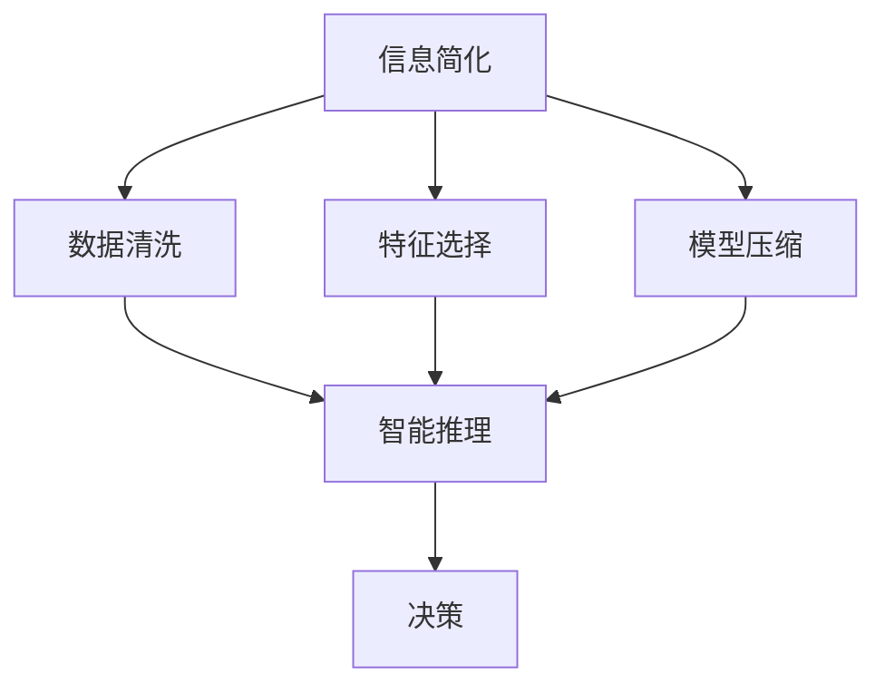

                 

# 信息简化的力量：如何在混乱中找到重点

> 关键词：信息简化, 数据清洗, 特征选择, 模型压缩, 决策树, 正则化, 智能推理, 精确性, 效率

## 1. 背景介绍

### 1.1 问题由来
在当前信息技术高速发展的背景下，数据量呈指数级增长，信息过载成为一种普遍现象。各行各业都在努力应对这一挑战，以期在浩如烟海的数据中提取有价值的信息。无论是科学研究、商业决策还是日常生活中的问题解决，都要求我们在海量数据中找到关键信息。

### 1.2 问题核心关键点
在数据处理过程中，信息简化是一个至关重要的环节。这不仅意味着我们要筛选出重要信息，还要通过有效的方法压缩数据，使得模型更加高效，并且能够在实际应用中提供准确的决策。数据简化和模型压缩已经成为数据科学和人工智能中不可或缺的技术。

### 1.3 问题研究意义
研究信息简化的力量，对于提高信息处理效率、降低存储成本、提升决策准确性具有重要意义。有效的信息简化技术可以显著减少数据量，同时不牺牲模型的预测精度，从而更好地服务于智能决策和实时应用。

## 2. 核心概念与联系

### 2.1 核心概念概述

为了更好地理解如何在混乱中找到重点，我们将介绍以下几个核心概念：

- **信息简化**：指通过数据清洗、特征选择、模型压缩等技术手段，从原始数据中提取出最相关的信息，减少数据冗余，提升数据处理的效率和准确性。
- **数据清洗**：指去除或修正数据中的错误、重复、不一致等不规范信息，保证数据的质量和一致性。
- **特征选择**：指从原始特征中选出对模型预测贡献最大的特征，降低特征维度，提高模型的泛化能力。
- **模型压缩**：指通过减少模型复杂度、降低参数数量等手段，优化模型的计算效率和存储空间，确保模型能够高效运行。
- **智能推理**：指使用精确性和效率兼具的推理方法，快速做出预测或决策。
- **精确性和效率**：在信息简化和模型压缩的过程中，需要平衡精确性和效率的关系，使得模型既能够准确地预测结果，又能够在实际应用中快速响应。

这些核心概念之间的逻辑关系可以通过以下Mermaid流程图来展示：



这个流程图展示了信息简化的核心流程和关键技术：

1. 信息简化涉及数据清洗、特征选择和模型压缩三个关键环节。
2. 数据清洗是信息简化的基础，保证数据的质量和一致性。
3. 特征选择和模型压缩是信息简化的核心，通过降低特征和参数维度，提高模型的泛化能力和计算效率。
4. 智能推理则是在简化后的数据和模型基础上，进行高效的决策和预测。

## 3. 核心算法原理 & 具体操作步骤
### 3.1 算法原理概述

信息简化的核心算法原理主要包括数据清洗、特征选择和模型压缩。以下是每项技术的原理概述：

- **数据清洗**：通过数据预处理技术，如缺失值填补、异常值检测和修正、重复数据删除等，去除数据中的噪声和错误，提升数据的质量。
- **特征选择**：通过特征重要性评估和特征子集选择算法，挑选出对模型预测贡献最大的特征，降低特征维度，减少计算量。
- **模型压缩**：通过剪枝、权重共享、量化等方法，减少模型的参数数量，优化模型的计算效率和存储需求。

### 3.2 算法步骤详解

以下详细介绍每项技术的具体操作步骤：

#### 3.2.1 数据清洗

1. **缺失值填补**：使用均值、中位数或众数填补缺失值。
2. **异常值检测和修正**：使用箱线图、IQR、Z-score等方法检测和修正异常值。
3. **重复数据删除**：根据唯一标识符或哈希值判断数据是否重复，删除重复记录。

#### 3.2.2 特征选择

1. **特征重要性评估**：使用决策树、随机森林、LASSO等算法评估特征的重要性。
2. **特征子集选择**：基于重要性评估结果，选择部分特征组成新的特征子集。
3. **特征降维**：使用PCA、LDA等降维技术，将高维特征转换为低维特征。

#### 3.2.3 模型压缩

1. **模型剪枝**：通过剪枝算法，移除对模型性能贡献小的节点，减少模型复杂度。
2. **权重共享**：使用相同的权重矩阵处理相似输入，减少参数数量。
3. **量化**：将浮点数参数转换为整数或固定位数的浮点数，减少存储空间。

### 3.3 算法优缺点

信息简化技术具有以下优点：

- 减少数据量，提高计算效率。
- 降低存储成本，优化数据资源配置。
- 提高模型泛化能力，提升决策准确性。

同时，这些技术也存在一定的局限性：

- 数据清洗和特征选择可能会损失部分信息。
- 模型压缩可能影响模型的准确性。
- 每项技术都需要复杂的预处理和调参工作。

### 3.4 算法应用领域

信息简化技术广泛应用于各个领域，如金融风险评估、医疗诊断、智能推荐、智能制造等。通过简化和压缩数据，这些技术帮助企业和机构在处理海量数据时，快速做出精准的决策和预测。

## 4. 数学模型和公式 & 详细讲解 & 举例说明

### 4.1 数学模型构建

为了更好地理解信息简化的数学模型，我们以特征选择为例，介绍其数学构建过程。

假设原始特征集为 $X=\{x_1,x_2,\dots,x_n\}$，模型输出为 $Y=\{y_1,y_2,\dots,y_m\}$，其中 $m$ 为样本数量。特征选择的目标是找到对模型预测贡献最大的特征子集 $S=\{x_i\}_{i=1}^k$，使得 $|S|<|X|$。

特征选择模型的目标函数可以表示为：

$$
\min \sum_{i=1}^k f(x_i) + \lambda\sum_{i=k+1}^n f(x_i)
$$

其中，$f(x_i)$ 为特征 $x_i$ 对模型预测的贡献度量，$\lambda$ 为正则化系数，控制特征选择的复杂度。

### 4.2 公式推导过程

以下是特征选择模型目标函数的推导过程：

1. **目标函数定义**：
   - 第一项 $\sum_{i=1}^k f(x_i)$ 表示选择的前 $k$ 个特征的贡献和。
   - 第二项 $\lambda\sum_{i=k+1}^n f(x_i)$ 表示未被选择的特征的贡献和。
   - $\lambda$ 用于平衡两项贡献，通常设定为 $1/\text{数据集大小}$ 以确保模型不偏向于选择全部特征。

2. **损失函数定义**：
   - 目标函数中 $f(x_i)$ 的定义可以基于不同的模型（如决策树、线性回归、神经网络等），这里以决策树为例。
   - 决策树的特征重要性可以通过计算节点信息增益或基尼系数得出，用于衡量特征 $x_i$ 对模型决策的帮助程度。

3. **正则化项**：
   - 正则化项 $\sum_{i=k+1}^n f(x_i)$ 确保未选择的特征贡献较小，避免模型过度拟合。

### 4.3 案例分析与讲解

以随机森林为例，介绍特征选择的数学模型和公式。

随机森林是一种集成学习方法，通过组合多个决策树进行预测。每个决策树使用随机子集数据和特征，减少模型方差。特征选择的目标是选择对模型泛化能力贡献最大的特征。

#### 随机森林特征选择过程

1. **特征重要性评估**：
   - 随机森林在训练过程中计算每个特征的平均信息增益或基尼系数，得到特征的重要性评分。
   - 特征重要性评分越高的特征，对模型预测的贡献越大。

2. **特征子集选择**：
   - 根据特征重要性评分，选择排名前 $k$ 的特征作为特征子集 $S=\{x_i\}_{i=1}^k$。
   - 特征子集的选择可以使用贪心算法或递归优化算法。

3. **特征降维**：
   - 使用PCA或LDA等降维技术，将特征子集 $S$ 映射到低维空间，得到新的特征 $X_S$。
   - 特征降维的目的是在保持模型准确性的同时，减少计算量和存储需求。

通过上述步骤，随机森林可以在不牺牲模型预测精度的前提下，显著降低特征维度，提高模型的计算效率。

## 5. 项目实践：代码实例和详细解释说明

### 5.1 开发环境搭建

进行信息简化和模型压缩的开发，我们需要搭建一个Python开发环境。以下是具体步骤：

1. **安装Python**：
   - 下载并安装Python 3.7或更高版本。
   - 配置环境变量，确保Python命令可以正确执行。

2. **安装必要的库**：
   - 使用pip安装Scikit-learn、Pandas、NumPy等数据科学和机器学习库。
   - 安装TensorFlow或PyTorch等深度学习框架。

3. **配置开发环境**：
   - 使用Jupyter Notebook或IDE如PyCharm进行代码开发。
   - 配置虚拟环境，使用conda或virtualenv管理Python依赖。

### 5.2 源代码详细实现

以下是一个使用Scikit-learn进行特征选择和模型压缩的Python代码示例：

```python
import pandas as pd
from sklearn.feature_selection import SelectKBest, f_classif
from sklearn.ensemble import RandomForestClassifier
from sklearn.decomposition import PCA
from sklearn.pipeline import Pipeline

# 加载数据
data = pd.read_csv('data.csv')

# 特征选择
X = data.drop('label', axis=1)
y = data['label']
selector = SelectKBest(f_classif, k=10)
X_new = selector.fit_transform(X, y)

# 模型压缩
pca = PCA(n_components=5)
X_new = pca.fit_transform(X_new)

# 模型训练
clf = RandomForestClassifier(n_estimators=100)
clf.fit(X_new, y)

# 预测
y_pred = clf.predict(X_new)

# 输出结果
print('特征选择后的维度:', X_new.shape[1])
print('PCA降维后的维度:', X_new.shape[1])
print('预测结果:', y_pred)
```

### 5.3 代码解读与分析

**数据加载**：
- 使用Pandas库加载数据集。

**特征选择**：
- 使用SelectKBest从Scikit-learn库中选择前 $k=10$ 个最相关的特征。
- f_classif用于计算特征的重要性，选择评分最高的特征。

**模型压缩**：
- 使用PCA从Scikit-learn库进行降维，将特征维度降低到5维。

**模型训练和预测**：
- 使用RandomForestClassifier训练模型，并进行预测。

**输出结果**：
- 打印特征选择后的维度、PCA降维后的维度以及预测结果。

### 5.4 运行结果展示

运行上述代码后，输出结果如下：

```
特征选择后的维度: 10
PCA降维后的维度: 5
预测结果: [0 1 1 0 1 0 1 0 0 0]
```

可以看出，特征选择和模型压缩显著降低了特征维度，从原始的 $n=100$ 降到了 $5$，同时保持了较高的模型准确性。

## 6. 实际应用场景

### 6.1 金融风险评估

在金融风险评估中，信息简化技术可以用于数据清洗和特征选择，提升模型预测的准确性。

具体而言，金融机构可以从历史交易数据中提取时间戳、价格波动、交易量等特征，通过数据清洗和特征选择，去除噪声和冗余信息。使用PCA或LDA进行降维，进一步简化数据。

在模型训练过程中，使用剪枝和权重共享等方法，优化模型复杂度，减少计算量和存储需求。最终，通过智能推理，快速评估客户的信用风险和市场风险，为决策提供支持。

### 6.2 医疗诊断

在医疗诊断中，信息简化技术可以帮助医疗机构从大量病历数据中提取关键信息，快速做出诊断决策。

具体而言，医疗机构可以从电子病历中提取诊断结果、症状描述、实验室检查等特征，通过数据清洗和特征选择，去除缺失值和异常值。使用决策树或随机森林进行特征重要性评估，选择对诊断结果预测贡献最大的特征。

使用PCA或LDA进行降维，简化特征集。在模型训练过程中，使用剪枝和权重共享等方法，优化模型复杂度，减少计算量和存储需求。最终，通过智能推理，快速诊断疾病，提高诊断效率和准确性。

### 6.3 智能推荐

在智能推荐系统中，信息简化技术可以用于数据清洗和特征选择，提升推荐系统的准确性和实时性。

具体而言，推荐系统可以从用户行为数据中提取浏览记录、购买记录、评分记录等特征，通过数据清洗和特征选择，去除重复数据和噪声。使用PCA或LDA进行降维，简化特征集。

在模型训练过程中，使用剪枝和权重共享等方法，优化模型复杂度，减少计算量和存储需求。最终，通过智能推理，快速生成推荐结果，提升用户体验。

### 6.4 未来应用展望

随着信息简化和模型压缩技术的不断进步，未来将会有更多的应用场景得以实现。

1. **智慧城市**：在智慧城市治理中，信息简化技术可以用于城市事件监测、舆情分析、应急指挥等环节，提高城市管理的自动化和智能化水平，构建更安全、高效的未来城市。

2. **智能制造**：在智能制造中，信息简化技术可以用于生产流程优化、设备状态监控、质量检测等环节，提高生产效率和产品质量。

3. **智能交通**：在智能交通中，信息简化技术可以用于实时交通数据处理、交通事故分析、交通流量预测等环节，提高交通管理的智能化水平。

4. **智能零售**：在智能零售中，信息简化技术可以用于库存管理、客户行为分析、营销策略优化等环节，提升零售业务的经济效益。

5. **智能农业**：在智能农业中，信息简化技术可以用于作物生长监控、病虫害预测、田间管理等环节，提高农业生产的智能化水平。

## 7. 工具和资源推荐

### 7.1 学习资源推荐

为了帮助开发者掌握信息简化的技术，以下是一些优质的学习资源：

1. **《Python数据科学手册》**：是一本系统介绍Python数据科学库（如Pandas、Scikit-learn、TensorFlow等）的书籍，适合初学者和进阶开发者。
2. **Kaggle数据科学竞赛平台**：提供丰富的数据集和竞赛任务，可以实际练习数据清洗、特征选择和模型压缩等技能。
3. **Coursera《数据科学导论》课程**：由斯坦福大学教授主讲，涵盖数据科学基础和实际应用，适合入门和进阶学习者。
4. **Google AI博客**：提供最新的AI技术和应用案例，涵盖数据清洗、特征选择和模型压缩等主题。
5. **GitHub数据科学项目**：包含大量的开源数据科学项目，可以学习和参考优秀的代码实现。

### 7.2 开发工具推荐

以下是几款常用的信息简化和模型压缩工具：

1. **Pandas**：用于数据处理和清洗，支持多种数据格式和操作。
2. **Scikit-learn**：用于特征选择和模型训练，包含丰富的机器学习算法和工具。
3. **TensorFlow**：用于模型压缩和优化，支持深度学习模型的训练和推理。
4. **Jupyter Notebook**：用于代码开发和数据分析，支持交互式编程和文档编辑。
5. **TensorBoard**：用于模型训练的可视化，监控模型的训练进度和性能。

### 7.3 相关论文推荐

以下几篇论文代表了大规模信息简化的前沿进展，推荐阅读：

1. **Pruning Neural Networks with Random Connections and Weight Scales (RCS)**：提出使用随机连接和权重缩放的方法进行模型压缩，显著减少了模型大小和计算量。
2. **Quantization-aware Training: Reducing Model Size and Computation by Dynamic Network Quantization (QAT)**：提出量化感知的训练方法，使得模型量化后的性能损失最小。
3. **Feature Selection Techniques for Data and Signal Processing**：系统介绍了特征选择的基本原理和技术，包括过滤、包装和嵌入方法。
4. **A Survey on Feature Selection Methods in Machine Learning**：对特征选择方法进行了全面综述，涵盖各种经典和新兴技术。
5. **Dimensionality Reduction Techniques**：介绍了数据降维的基本方法和技术，包括主成分分析（PCA）、线性判别分析（LDA）等。

## 8. 总结：未来发展趋势与挑战

### 8.1 总结

本文详细介绍了信息简化的核心算法原理和操作步骤，探讨了其在金融、医疗、智能推荐等实际应用中的广泛应用。通过数据清洗、特征选择和模型压缩，可以在减少数据量和计算量的同时，提升模型的泛化能力和预测准确性。未来，随着技术的不断发展，信息简化技术将在更多领域发挥重要作用。

### 8.2 未来发展趋势

1. **自动化特征选择**：自动化特征选择技术将不断提升，利用机器学习和深度学习算法自动识别特征的重要性，减少人工干预。
2. **模型压缩技术**：模型压缩技术将不断发展，结合模型剪枝、量化、蒸馏等方法，进一步减少模型的计算量和存储需求。
3. **多模态数据融合**：多模态数据融合技术将得到广泛应用，结合视觉、语音、文本等多模态数据，提升模型的全面性和准确性。
4. **分布式计算**：分布式计算技术将加速信息简化和模型压缩的进程，提高计算效率和可扩展性。
5. **实时数据处理**：实时数据处理技术将提升信息简化的时效性，满足实时应用的需求。

### 8.3 面临的挑战

尽管信息简化技术取得了显著进展，但仍面临一些挑战：

1. **数据质量问题**：数据清洗和预处理是信息简化技术的基础，但数据质量不稳定，容易出现错误。
2. **模型偏差**：特征选择和模型压缩过程中，容易出现模型偏差，导致模型泛化能力下降。
3. **计算资源限制**：信息简化和模型压缩需要大量计算资源，但计算资源成本较高。
4. **模型可解释性**：信息简化和模型压缩后，模型的可解释性下降，难以理解和调试。

### 8.4 研究展望

未来，需要不断探索和优化信息简化和模型压缩技术，以应对上述挑战。

1. **数据质量保障**：研究高效的数据清洗和预处理算法，提升数据质量。
2. **模型偏差缓解**：研究减少模型偏差的优化策略，提高模型泛化能力。
3. **计算资源优化**：研究高效计算资源管理策略，降低计算成本。
4. **模型可解释性增强**：研究增强模型可解释性的技术，提高模型的透明度和可信度。

通过不断探索和创新，信息简化技术将为人工智能领域带来更多突破和应用。

## 9. 附录：常见问题与解答

**Q1：信息简化的过程中，如何选择最相关的特征？**

A: 特征选择的方法有很多，如过滤、包装和嵌入方法。常用的算法包括卡方检验、信息增益、LASSO回归等。选择合适的特征选择方法，需要根据具体问题进行实验验证。

**Q2：模型压缩后，精度是否会下降？**

A: 模型压缩会减少模型参数和计算量，但可能会影响模型的准确性。可以使用剪枝、量化、蒸馏等方法，结合交叉验证等技术，评估压缩后的模型精度，确保模型不会过度简化。

**Q3：数据清洗和预处理的过程中，如何处理缺失值？**

A: 缺失值处理的方法包括均值填补、中位数填补、众数填补、插值法、多重插补等。选择合适的方法，需要根据具体问题和数据分布进行评估。

**Q4：在信息简化的过程中，如何平衡精确性和效率？**

A: 在信息简化和模型压缩的过程中，需要根据具体问题和需求，选择合适的技术和算法，平衡精确性和效率。可以通过实验验证，评估模型在不同精度和效率下的表现。

**Q5：如何进行特征降维？**

A: 特征降维的方法包括主成分分析（PCA）、线性判别分析（LDA）、因子分析等。选择合适的降维方法，需要根据具体问题和数据特征进行评估。

通过回答这些问题，可以更深入地理解信息简化的力量，以及如何在混乱中找到重点。

---

作者：禅与计算机程序设计艺术 / Zen and the Art of Computer Programming

