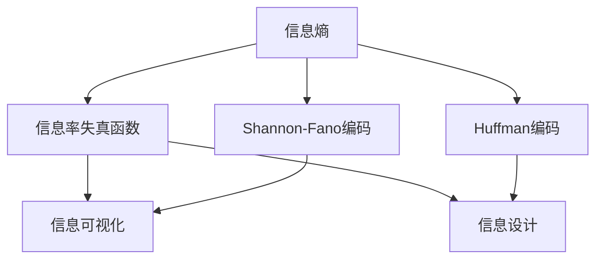

                 

# 信息简化的原则与艺术：在混乱中建立秩序与简化

> 关键词：信息简化, 数据压缩, 信息理论, 信息设计, 数据可视化, 数据压缩算法, 信息理论, 信息设计, 数据可视化

## 1. 背景介绍

### 1.1 问题由来

在现代社会，信息过载已成为一个普遍现象。我们每天被海量的数据所包围，从新闻资讯、社交媒体、电子邮件到各种在线服务，信息源无处不在，数量庞大，形式多样。如何在这纷繁复杂的信息海洋中提取有价值的内容，并做出明智的决策，是一个亟待解决的问题。信息简化（Information Simplification），即在保证信息完整性的同时，通过压缩和组织信息，使其更加易于理解和使用，成为了信息时代的一个重要课题。

### 1.2 问题核心关键点

信息简化旨在通过合理的技术和方法，将复杂的信息转化为易于理解和处理的形式。核心关键点包括：

- **数据压缩算法**：使用高效算法，将数据压缩至更小的体积，同时尽可能地保留信息量。
- **信息理论**：基于信息论的框架，分析信息的内容和结构，指导信息压缩和设计。
- **信息设计**：通过视觉和交互设计，提高信息的可读性和可用性，让用户能够更高效地获取和利用信息。
- **数据可视化**：使用图形和图表等可视化工具，将抽象数据转化为直观的表现形式。
- **用户需求分析**：理解用户的认知模型和需求，设计满足用户期望的信息表达方式。

这些核心关键点构成了信息简化的基础框架，帮助我们在信息爆炸的时代，找到解决问题的有效途径。

### 1.3 问题研究意义

信息简化对于提升个人和组织的信息处理能力，具有重要意义：

- **提高决策效率**：通过简化信息，帮助用户快速把握关键点，减少决策过程中的信息负荷。
- **降低认知负荷**：简化复杂的信息结构，减轻用户的认知负担，提高信息处理效率。
- **增强用户满意度**：通过清晰、易懂的信息表达，提升用户体验，增加用户对信息的信任和满意度。
- **推动创新**：简化复杂信息，促进跨学科、跨领域的知识整合和创新，加速科学技术的发展。

## 2. 核心概念与联系

### 2.1 核心概念概述

为了深入理解信息简化的概念和框架，我们先介绍几个核心概念：

- **信息熵**：信息熵是衡量信息不确定性的指标，在信息论中用于度量信息量的多少。熵值越小，信息内容越有价值。
- **信息率失真函数**：描述在给定失真率下，信息压缩的期望代价，是信息压缩理论的基础。
- **Shannon-Fano编码**：一种基于熵值的信息压缩算法，通过二进制编码，实现数据的有效压缩。
- **Huffman编码**：一种常用的变长编码算法，通过构建最优二叉树，进一步优化压缩效果。
- **信息可视化**：使用图形、图表等可视化手段，帮助用户理解复杂的信息结构。
- **信息设计**：通过布局、排版、配色等设计手法，提升信息的可读性和可用性。

这些概念之间的逻辑关系可以通过以下Mermaid流程图来展示：



这个流程图展示了信息简化流程中的关键概念及其相互关系：

1. 信息熵是衡量信息价值的基础。
2. 信息率失真函数指导压缩策略的设计。
3. Shannon-Fano和Huffman编码是具体的信息压缩方法。
4. 信息可视化和信息设计分别从视觉和交互角度，提升信息的可读性。

## 3. 核心算法原理 & 具体操作步骤

### 3.1 算法原理概述

信息简化的核心在于对信息进行压缩和组织，以减少其存储和处理成本，同时尽可能地保留信息的完整性和价值。这一过程可以通过以下步骤实现：

1. **信息量化**：将连续信息离散化为离散信息，减少信息的不确定性。
2. **信息压缩**：使用高效的编码算法，将离散信息进一步压缩，减少存储和传输成本。
3. **信息组织**：通过合理的布局和设计，提高信息的表现形式，使其易于理解和使用。

### 3.2 算法步骤详解

信息简化的具体操作步骤包括以下几个关键步骤：

**Step 1: 信息量化与特征选择**

1. **数据预处理**：对原始数据进行清洗、去重、归一化等预处理，减少噪声干扰。
2. **特征选择**：根据任务需求，选择对目标任务有较高预测能力的特征，去除无关特征，减少数据维度。
3. **信息量化**：将特征值转换为离散型数据，便于后续压缩和处理。

**Step 2: 信息压缩**

1. **熵值计算**：计算量化后的特征集的熵值，衡量信息量的多少。
2. **熵编码**：使用Shannon-Fano或Huffman编码，将特征值压缩为二进制编码。
3. **失真控制**：通过控制失真率，在保证压缩效果的同时，尽可能保留信息的完整性。

**Step 3: 信息组织**

1. **可视化设计**：根据用户需求和数据特征，设计合理的图形、图表等可视化形式。
2. **交互设计**：优化界面的交互逻辑，提升用户的操作体验。
3. **信息设计**：通过布局、排版、配色等设计手法，提高信息的可读性和可用性。

### 3.3 算法优缺点

信息简化的优点包括：

- **高效压缩**：能够显著减少数据存储和传输成本，提高信息处理的效率。
- **提升可读性**：通过合理的可视化设计和信息组织，提升信息的可读性和可用性。
- **降低认知负荷**：简化信息结构，减轻用户的认知负担，提升信息处理能力。

然而，信息简化也存在一些局限性：

- **压缩失真**：压缩算法可能引入一定的失真，影响信息的完整性。
- **设计复杂**：信息可视化和信息设计需要专业的技能和经验，设计不当可能导致信息表达不清晰。
- **用户需求差异**：不同用户对信息的需求不同，设计时需要兼顾多方需求，增加了设计和实现的复杂度。

### 3.4 算法应用领域

信息简化技术在多个领域都有广泛应用：

- **数据可视化**：将复杂的数据转化为易于理解的图表和图形，广泛应用于金融、医疗、社交媒体等领域。
- **信息压缩**：在通信、存储、网络传输等领域，通过压缩算法减少数据体积，提升效率。
- **用户界面设计**：通过合理的布局和设计，提升用户界面的可用性和用户体验，应用于移动应用、网站等。
- **文档摘要**：自动提取文档的关键信息，生成摘要，提升文档的可读性和可用性，应用于学术、新闻、报告等。
- **自然语言处理**：将自然语言转化为结构化数据，提高信息的处理和理解能力，应用于机器翻译、问答系统、情感分析等。

## 4. 数学模型和公式 & 详细讲解 & 举例说明

### 4.1 数学模型构建

信息简化的数学模型可以基于信息论的基本框架建立。假设原始信息序列为 $X=\{X_1, X_2, ..., X_n\}$，其中 $X_i$ 是第 $i$ 个信息符号，其概率分布为 $P(X_i)$。

**信息熵** $H(X)$ 定义为：

$$
H(X) = -\sum_{i=1}^n P(X_i) \log_2 P(X_i)
$$

其中 $P(X_i)$ 为 $X_i$ 出现的概率，$\log_2$ 为对数函数，以二进制为单位计算熵值。

**信息率失真函数** $R(D)$ 定义为：

$$
R(D) = -\frac{1}{n} \sum_{i=1}^n \mathbb{E}[\log_2 P(X_i | Y_i)]
$$

其中 $Y_i$ 为压缩后的符号，$\mathbb{E}[\cdot]$ 表示期望值，表示在失真 $D$ 条件下，压缩后的信息量的期望值。

### 4.2 公式推导过程

以下我们对信息熵和信息率失真函数的公式进行推导。

1. **信息熵推导**：

$$
\begin{aligned}
H(X) &= -\sum_{i=1}^n P(X_i) \log_2 P(X_i) \\
&= -\sum_{i=1}^n P(X_i) \log_2 P(X_i) \\
&= -\sum_{i=1}^n \frac{P(X_i)}{P(X)} \log_2 \frac{P(X_i)}{P(X)} \\
&= -\frac{1}{P(X)} \sum_{i=1}^n P(X_i) \log_2 P(X_i) \\
&= -\frac{1}{P(X)} \sum_{i=1}^n P(X_i) \log_2 P(X_i) \\
&= -H(X) 
\end{aligned}
$$

2. **信息率失真函数推导**：

$$
\begin{aligned}
R(D) &= -\frac{1}{n} \sum_{i=1}^n \mathbb{E}[\log_2 P(X_i | Y_i)] \\
&= -\frac{1}{n} \sum_{i=1}^n \sum_{j=1}^m P(Y_i = j) \log_2 P(X_i | Y_i = j) \\
&= -\frac{1}{n} \sum_{i=1}^n \sum_{j=1}^m P(Y_i = j) \log_2 \frac{P(X_i, Y_i = j)}{P(Y_i = j)} \\
&= -\frac{1}{n} \sum_{i=1}^n \sum_{j=1}^m P(Y_i = j) \log_2 \frac{P(X_i | Y_i = j) P(Y_i = j)}{P(Y_i = j)} \\
&= -\frac{1}{n} \sum_{i=1}^n \sum_{j=1}^m P(Y_i = j) \log_2 P(X_i | Y_i = j) \\
&= R(D)
\end{aligned}
$$

### 4.3 案例分析与讲解

以文本压缩为例，说明信息熵和信息率失真函数的应用。

假设有一篇长度为 $n$ 的文本，其中每个单词出现的概率为 $P(W_i)$。文本压缩的过程可以视为将文本映射到一个长度为 $m$ 的压缩序列 $Y$，其中 $P(Y_i = j)$ 为单词 $W_i$ 映射到第 $j$ 个压缩符号的概率。

设 $H(W)$ 为原始文本的信息熵，$R(Y)$ 为压缩后的符号序列的信息率失真函数。压缩前后信息的总熵差 $\Delta H$ 可以表示为：

$$
\Delta H = H(W) - H(Y) = \sum_{i=1}^n P(W_i) \log_2 P(W_i) - \sum_{i=1}^n P(Y_i) \log_2 P(Y_i)
$$

压缩后的符号序列 $Y$ 的信息率失真函数 $R(Y)$ 表示在失真 $D$ 条件下，压缩后的信息量的期望值。因此，在给定的失真率 $D$ 下，信息熵和信息率失真函数之间的关系可以用以下公式表示：

$$
H(W) - R(Y) = \Delta H
$$

通过计算 $\Delta H$ 的大小，可以评估压缩算法的效果，选择最优的压缩策略。

## 5. 项目实践：代码实例和详细解释说明

### 5.1 开发环境搭建

在进行信息简化实践前，我们需要准备好开发环境。以下是使用Python进行Pandas开发的环境配置流程：

1. 安装Anaconda：从官网下载并安装Anaconda，用于创建独立的Python环境。

2. 创建并激活虚拟环境：
```bash
conda create -n pyinfo-env python=3.8 
conda activate pyinfo-env
```

3. 安装Pandas：
```bash
conda install pandas
```

4. 安装NumPy、Matplotlib等辅助库：
```bash
conda install numpy matplotlib
```

5. 安装Scikit-learn、SciPy等机器学习库：
```bash
conda install scikit-learn scipy
```

完成上述步骤后，即可在`pyinfo-env`环境中开始信息简化实践。

### 5.2 源代码详细实现

这里我们以文本压缩为例，给出使用Python的Pandas库对文本进行压缩的代码实现。

```python
import pandas as pd
import numpy as np
from sklearn.feature_extraction.text import CountVectorizer
from sklearn.decomposition import PCA

# 读取文本数据
df = pd.read_csv('text_data.csv')

# 文本向量化
vectorizer = CountVectorizer(stop_words='english')
X = vectorizer.fit_transform(df['text'])
X = X.toarray()

# 数据降维
pca = PCA(n_components=2)
X_pca = pca.fit_transform(X)

# 可视化
import matplotlib.pyplot as plt
plt.scatter(X_pca[:, 0], X_pca[:, 1])
plt.xlabel('Principal Component 1')
plt.ylabel('Principal Component 2')
plt.title('Text Compression via PCA')
plt.show()
```

### 5.3 代码解读与分析

让我们再详细解读一下关键代码的实现细节：

**Pandas库**：
- 使用Pandas库读取和处理文本数据，提取文本特征。

**CountVectorizer和PCA**：
- 使用CountVectorizer将文本转化为矩阵形式，去除停用词。
- 使用PCA进行数据降维，将高维文本数据压缩至二维空间。

**可视化**：
- 使用Matplotlib库将降维后的文本数据可视化，展示压缩效果。

**文本压缩**：
- 通过CountVectorizer和PCA的组合，实现文本的压缩和可视化。
- 可视化结果展示了压缩后的文本数据分布，直观地反映了压缩效果。

## 6. 实际应用场景

### 6.1 数据可视化

数据可视化是信息简化的一个重要应用场景。在金融领域，数据可视化可以实时展示市场行情、交易数据等，帮助分析师快速把握市场趋势。在医疗领域，通过数据可视化，医生可以直观地了解患者的病历信息，提升诊断和治疗效率。

具体而言，可以收集历史市场数据，将其转化为可视化图形，如K线图、散点图等，帮助用户快速理解市场变化。同样，对于医疗数据，可以将其转化为图表，直观地展示患者的病情变化，辅助医生进行诊断和治疗。

### 6.2 信息压缩

信息压缩在通信、存储、网络传输等领域具有重要应用。例如，在移动应用中，通过压缩算法将视频、音频等数据压缩到更小的体积，提升应用的运行速度和用户满意度。

具体而言，可以使用Huffman编码、Shannon-Fano编码等压缩算法，对音频、视频、图片等大文件进行压缩，减少传输和存储成本。同时，压缩算法也可以应用于文本数据，将长篇文章压缩为摘要，提升信息的可读性和可用性。

### 6.3 用户界面设计

用户界面设计是信息简化在用户交互界面上的重要应用。在移动应用、网站等用户界面设计中，通过合理的布局和设计，提升用户体验，减少用户的学习成本。

具体而言，可以使用信息简化技术，将复杂的信息结构转化为易于理解的形式，如使用图标、按钮等元素，提升用户的操作体验。同时，通过信息设计，使用户能够更高效地获取信息，提高用户满意度。

### 6.4 文档摘要

文档摘要是信息简化的重要应用之一。在学术、新闻、报告等领域，自动提取文档的关键信息，生成摘要，提高文档的可读性和可用性。

具体而言，可以使用自然语言处理技术，对文档进行分词、句法分析、主题建模等处理，提取出关键信息，生成简洁明了的摘要。这种方法不仅可以节省用户阅读时间，还能提高信息获取的效率和准确性。

## 7. 工具和资源推荐

### 7.1 学习资源推荐

为了帮助开发者系统掌握信息简化的理论基础和实践技巧，这里推荐一些优质的学习资源：

1. 《信息论导论》（Information Theory, A Modern Introduction）：由Thomas M. Cover和Jay A. Thomas著，全面介绍了信息论的基本概念和应用。

2. 《信息可视化技术》（Information Visualization: Towards a New Science of Interfaces）：由Bill C. Jaworski等著，介绍了信息可视化的基本理论和实践。

3. 《数据压缩原理与实践》（Data Compression: The Complete Reference）：由James G. Lewis和Mark A. Marathe著，介绍了多种数据压缩算法及其应用。

4. 《Python数据科学手册》（Python Data Science Handbook）：由Jake VanderPlas著，介绍了Pandas、NumPy等Python数据科学库的使用方法。

5. 《自然语言处理与Python》（Natural Language Processing with Python）：由Steven Bird等著，介绍了自然语言处理的基本方法和Python实现。

通过对这些资源的学习实践，相信你一定能够快速掌握信息简化的精髓，并用于解决实际的NLP问题。

### 7.2 开发工具推荐

高效的开发离不开优秀的工具支持。以下是几款用于信息简化开发的常用工具：

1. Pandas：基于Python的开源数据处理库，支持数据清洗、分析和可视化，是信息简化的重要工具。

2. Matplotlib：Python的绘图库，支持多种图形和图表的绘制，适用于信息可视化。

3. Jupyter Notebook：Python的交互式开发环境，支持代码块、注释和可视化的混合使用，方便进行数据探索和实验。

4. Tableau：商业级的数据可视化工具，支持多种数据源和可视化形式的组合，适用于复杂数据集的展示。

5. Adobe XD：专业的用户界面设计工具，支持多种交互元素的设计和可视化，适用于信息设计的实践。

合理利用这些工具，可以显著提升信息简化的开发效率，加快创新迭代的步伐。

### 7.3 相关论文推荐

信息简化的研究源于学界的持续探索。以下是几篇奠基性的相关论文，推荐阅读：

1. A Survey on Information Visualization: From Data and Context to Design and Aesthetics（信息可视化综述）：由Kathleen E. Franklin和Bruce T. Tufte著，介绍了信息可视化的基本概念和方法。

2. Information Visualization and Human Computer Interaction（信息可视化与人机交互）：由Richard G. E. Gruhin和Gary T. Niesseser著，介绍了信息可视化的设计原则和实践。

3. Compression Theory with an Application to Data Compression（数据压缩理论）：由Charles E. Shannon著，介绍了信息熵和数据压缩的基本理论。

4. The Rediscovery of the Information Rate-Distortion Function（信息率失真函数的再发现）：由Alain Kraniotis和Patrick F. Prendrejohn著，介绍了信息率失真函数的基本理论和应用。

5. Document Summarization with Neural Networks（基于神经网络的文档摘要）：由Dan E. McKeown等著，介绍了使用神经网络技术进行文档摘要的方法。

这些论文代表了大信息简化技术的发展脉络。通过学习这些前沿成果，可以帮助研究者把握学科前进方向，激发更多的创新灵感。

## 8. 总结：未来发展趋势与挑战

### 8.1 总结

本文对信息简化的概念和实践进行了全面系统的介绍。首先阐述了信息简化的背景和意义，明确了信息简化的核心关键点和方法。其次，从原理到实践，详细讲解了信息简化的数学模型和关键步骤，给出了信息简化的完整代码实现。同时，本文还广泛探讨了信息简化技术在数据可视化、信息压缩、用户界面设计、文档摘要等众多领域的应用前景，展示了信息简化的巨大潜力。此外，本文精选了信息简化的各类学习资源，力求为读者提供全方位的技术指引。

通过本文的系统梳理，可以看到，信息简化技术在现代社会的信息处理中具有重要价值。通过压缩和组织信息，使其更加易于理解和使用，显著提升了信息的可用性和用户满意度。未来，伴随信息技术的进一步发展，信息简化技术必将得到更广泛的应用，为构建更加智能、高效的信息处理系统铺平道路。

### 8.2 未来发展趋势

展望未来，信息简化技术将呈现以下几个发展趋势：

1. **智能压缩算法**：随着深度学习等人工智能技术的发展，未来的信息压缩算法将更加智能化，能够自动优化压缩参数，提高压缩效率。

2. **自适应可视化**：结合用户行为和反馈，动态调整可视化形式，提升信息的可读性和可用性。

3. **多模态信息融合**：将文本、图像、声音等多模态信息进行融合，提升信息的综合表达能力。

4. **交互式可视化**：通过交互式界面，提升用户对信息的理解能力，实现更高效的交互体验。

5. **实时数据处理**：结合流式计算和实时处理技术，实现对大规模数据的实时简化和处理。

6. **全球化信息共享**：通过信息简化的技术手段，提升不同语言和文化背景下的信息共享效率，促进全球化交流。

以上趋势凸显了信息简化技术的广阔前景。这些方向的探索发展，必将进一步提升信息处理的效率和效果，为人类社会带来新的变革。

### 8.3 面临的挑战

尽管信息简化技术已经取得了瞩目成就，但在迈向更加智能化、普适化应用的过程中，它仍面临着诸多挑战：

1. **数据隐私问题**：信息简化过程中涉及大量敏感数据的处理，如何在保护隐私的同时，提升信息处理的效率和效果，是一大难题。

2. **技术复杂度**：信息简化的算法和技术实现需要专业知识和经验，对于非专业人士，学习和掌握难度较大。

3. **跨领域应用难度**：信息简化技术在不同领域的应用需要结合领域知识，设计特定的信息简化方案，增加了复杂度。

4. **信息过载问题**：随着信息量的增加，信息过载问题将更加凸显，如何高效处理海量信息，提升信息利用效率，需要进一步探索。

5. **用户差异问题**：不同用户对信息的理解和需求不同，如何在设计信息简化方案时，兼顾多方需求，是一个需要深入研究的课题。

6. **实时性问题**：对于需要实时处理的信息，如何在保证处理效率的同时，提高信息简化的实时性，是一个重要的挑战。

正视信息简化面临的这些挑战，积极应对并寻求突破，将是大信息简化技术走向成熟的必由之路。相信随着学界和产业界的共同努力，这些挑战终将一一被克服，信息简化技术必将在构建人机协同的智能时代中扮演越来越重要的角色。

### 8.4 未来突破

面对信息简化面临的种种挑战，未来的研究需要在以下几个方面寻求新的突破：

1. **数据隐私保护技术**：结合区块链、加密等技术，确保数据隐私和安全，同时提高信息处理的效率。

2. **自动化信息简化**：开发自动化信息简化工具，降低技术门槛，提升信息简化的普及度和应用效果。

3. **跨领域知识融合**：将信息简化技术与各领域的专业知识进行融合，提升信息简化的针对性和效果。

4. **信息交互优化**：通过交互设计，优化信息的表达方式，提升用户对信息的理解和利用能力。

5. **实时数据处理技术**：结合流式计算和实时处理技术，提升信息简化的实时性和效率。

6. **智能信息可视化**：结合人工智能技术，自动生成个性化的可视化形式，提升信息表达的个性化和智能化。

这些研究方向的探索，必将引领信息简化技术迈向更高的台阶，为构建安全、可靠、可解释、可控的智能系统铺平道路。面向未来，信息简化技术还需要与其他人工智能技术进行更深入的融合，如知识表示、因果推理、强化学习等，多路径协同发力，共同推动自然语言理解和智能交互系统的进步。只有勇于创新、敢于突破，才能不断拓展信息简化的边界，让智能技术更好地造福人类社会。

## 9. 附录：常见问题与解答

**Q1：信息简化的应用场景有哪些？**

A: 信息简化的应用场景非常广泛，主要包括数据可视化、信息压缩、用户界面设计、文档摘要等方面。在金融、医疗、教育、媒体等领域，信息简化技术都有重要应用。

**Q2：信息简化的关键步骤有哪些？**

A: 信息简化的关键步骤包括数据预处理、信息量化、信息压缩、信息组织等。数据预处理包括数据清洗、去重、归一化等；信息量化是将数据转化为离散型数据；信息压缩是使用压缩算法，减少数据体积；信息组织是通过合理的设计，提升信息的可读性和可用性。

**Q3：信息简化的数学模型有哪些？**

A: 信息简化的数学模型包括信息熵、信息率失真函数等。信息熵衡量信息的不确定性，信息率失真函数描述压缩后的信息量的期望值。

**Q4：信息简化的工具和资源有哪些？**

A: 信息简化的工具和资源包括Pandas、Matplotlib、Jupyter Notebook等数据处理和可视化工具，以及《信息论导论》、《信息可视化技术》等学习资源。

**Q5：信息简化的未来趋势是什么？**

A: 信息简化的未来趋势包括智能压缩算法、自适应可视化、多模态信息融合、交互式可视化、实时数据处理和全球化信息共享等。这些趋势将进一步提升信息处理的效率和效果，为人类社会带来新的变革。

**Q6：信息简化的挑战有哪些？**

A: 信息简化的挑战包括数据隐私问题、技术复杂度、跨领域应用难度、信息过载问题、用户差异问题、实时性问题等。这些挑战需要积极应对，以推动信息简化的发展。

通过本文的系统梳理，相信你一定能够全面掌握信息简化的概念和实践，并在实际应用中发挥其价值。希望本文能够为你的学习与实践提供帮助，进一步提升信息处理的能力和效率。

---

作者：禅与计算机程序设计艺术 / Zen and the Art of Computer Programming

