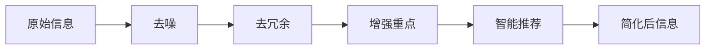

                 

# 信息简化的好处与实践：简化生活和工作以提高效率和生产力

## 1. 背景介绍

在现代信息爆炸的时代，我们每天都在面对大量的信息，如何高效处理和利用这些信息，成为了提高效率和生产力的关键。信息简化（Information Simplification, IS）技术就是为了帮助我们更好地管理和处理信息的工具，它通过去噪、去冗余和增强重点信息，使得信息的获取和使用更加高效。

### 1.1 问题由来

随着互联网的普及和智能设备的广泛应用，信息量的爆炸式增长使得人们面临信息过载的问题。每天我们接收到的新闻、邮件、社交媒体信息等，都对我们处理信息的能力提出了挑战。这种信息过载不仅浪费了时间，还可能导致决策失误、工作效率低下等问题。

### 1.2 问题核心关键点

信息简化技术的关键在于，通过过滤和摘要等方法，将复杂的信息简化为易于理解和使用的内容。其核心原理和应用场景包括：

- 去噪：过滤掉无关、重复或低质量的信息，使得有用信息更加突出。
- 去冗余：去除信息中的重复和冗余部分，避免信息过载。
- 增强重点：通过摘要、总结、高亮等方式，强调信息的核心要点，使其更容易被理解和记忆。
- 智能推荐：利用机器学习算法，根据用户的兴趣和行为，推荐相关的、有用的信息。

## 2. 核心概念与联系

### 2.1 核心概念概述

为更好地理解信息简化技术，我们首先需要介绍几个核心概念：

- 信息（Information）：是指由一系列符号或信号组成的，具有一定意义的内容。
- 简化（Simplification）：通过去除不必要的复杂性和冗余，使得信息更加清晰、易于理解。
- 去噪（Noise Reduction）：通过算法或人工方式，过滤掉干扰信息，保留有用信息。
- 去冗余（Redundancy Removal）：识别和删除信息中的重复或多余部分。
- 增强重点（Focus Enhancement）：通过摘要、高亮等手段，使关键信息更加突出。
- 智能推荐（Recommendation System）：利用机器学习算法，根据用户兴趣和行为推荐有用信息。

这些概念共同构成了信息简化技术的理论基础，使得我们能够系统地理解和应用这一技术。

### 2.2 核心概念原理和架构的 Mermaid 流程图



这个流程图展示了信息简化的核心步骤：从原始信息出发，依次经过去噪、去冗余、增强重点和智能推荐，最终得到简化后的信息。

## 3. 核心算法原理 & 具体操作步骤

### 3.1 算法原理概述

信息简化技术的核心在于通过一系列算法，将原始复杂的信息转化为易于理解和使用的内容。这通常包括以下几个步骤：

1. **去噪**：过滤掉无关、重复或低质量的信息，使得有用信息更加突出。
2. **去冗余**：去除信息中的重复或多余部分，避免信息过载。
3. **增强重点**：通过摘要、总结、高亮等方式，强调信息的核心要点，使其更容易被理解和记忆。
4. **智能推荐**：利用机器学习算法，根据用户的兴趣和行为，推荐相关的、有用的信息。

这些步骤通过不同的算法和工具实现，最终将复杂的信息简化为易于处理的内容。

### 3.2 算法步骤详解

以下详细介绍信息简化技术的各个步骤：

**Step 1: 信息收集**

信息简化的第一步是收集原始信息，包括文本、图像、视频等。这些信息可能来自社交媒体、新闻网站、电子书、科学研究等不同来源。

**Step 2: 去噪**

去噪算法通常包括过滤垃圾邮件、广告、重复信息和噪声数据。常见的方法包括基于规则的过滤、基于机器学习的过滤和基于人工智能的过滤。例如，可以使用机器学习模型训练一个垃圾邮件分类器，识别并过滤掉垃圾邮件。

**Step 3: 去冗余**

去冗余算法旨在识别和删除信息中的重复部分。这可以通过文本相似度检测、数据挖掘和模式识别等技术实现。例如，使用文本相似度检测算法，比较不同来源的文本信息，识别和去除重复的内容。

**Step 4: 增强重点**

增强重点算法通过摘要、总结、高亮等手段，使关键信息更加突出。常见的技术包括自动摘要、关键词提取和文本分类。例如，使用自然语言处理技术，将长文本自动生成摘要，提取出核心内容。

**Step 5: 智能推荐**

智能推荐算法根据用户的兴趣和行为，推荐相关的、有用的信息。这可以通过协同过滤、内容推荐和深度学习等技术实现。例如，使用协同过滤算法，分析用户的历史行为数据，推荐与用户兴趣相关的信息。

### 3.3 算法优缺点

信息简化技术的优点包括：

- **提高效率**：通过过滤和简化信息，用户可以更快地获取所需信息，提高工作效率。
- **提升用户体验**：简化的信息更加易于理解和记忆，提高用户的体验感。
- **降低信息过载**：去除冗余和噪声信息，避免信息过载，减少用户的决策压力。

然而，信息简化技术也存在一些缺点：

- **算法复杂性**：去噪、去冗余和增强重点等算法较为复杂，需要大量的数据和计算资源。
- **用户接受度**：部分用户可能对简化的信息产生误解或不满，认为信息被篡改或丢失了重要内容。
- **隐私问题**：在收集和处理信息时，可能涉及用户隐私问题，需要谨慎处理。

### 3.4 算法应用领域

信息简化技术广泛应用于多个领域，例如：

- **新闻摘要**：对新闻文章进行自动摘要，提取核心内容，提高新闻阅读效率。
- **电子邮件过滤**：自动过滤垃圾邮件和广告，保留重要信息。
- **搜索引擎**：在搜索结果中，使用摘要和关键词提取技术，提升搜索结果的相关性和可读性。
- **社交媒体**：在社交媒体平台中，使用信息摘要和推荐算法，帮助用户快速获取有用的信息。
- **会议记录**：对会议记录进行自动摘要和分类，提高会议记录的可用性。

## 4. 数学模型和公式 & 详细讲解 & 举例说明

### 4.1 数学模型构建

信息简化技术的数学模型通常基于自然语言处理（NLP）、数据挖掘和机器学习等领域的知识。以下是一个简单的信息简化的数学模型构建过程：

1. **原始信息表示**：使用向量表示法，将原始信息表示为向量 $x \in \mathbb{R}^n$，其中 $n$ 为信息维度。
2. **去噪模型**：使用线性回归或逻辑回归模型，对原始信息进行去噪处理，得到去噪后的信息 $x' = \hat{x}(x)$。
3. **去冗余模型**：使用聚类算法，识别并去除冗余信息，得到去冗余后的信息 $x'' = f(x')$。
4. **增强重点模型**：使用摘要算法，提取信息的关键内容，得到增强重点后的信息 $x''' = g(x'')$。
5. **智能推荐模型**：使用协同过滤或内容推荐算法，根据用户行为和兴趣，推荐相关信息。

### 4.2 公式推导过程

以下是对信息简化技术中部分算法的公式推导：

**去噪算法**：

$$
\hat{x} = Wx + b
$$

其中 $W$ 为权重矩阵，$b$ 为偏置向量。

**去冗余算法**：

$$
x'' = k(x')
$$

其中 $k$ 为聚类算法，如K-Means、DBSCAN等。

**增强重点算法**：

$$
x''' = \sum_{i=1}^n \alpha_i x_i
$$

其中 $\alpha_i$ 为信息权重，通常通过文本分析或机器学习模型得到。

**智能推荐算法**：

$$
y = \alpha^T x
$$

其中 $\alpha$ 为用户兴趣向量，通过协同过滤或深度学习等算法得到。

### 4.3 案例分析与讲解

以新闻摘要为例，简要介绍信息简化技术的实现过程：

1. **原始信息**：收集一篇新闻文章，文本长度为 $n$。
2. **去噪**：使用去噪算法，如规则过滤或机器学习模型，去除无关的广告和链接，得到去噪后的文本。
3. **去冗余**：使用聚类算法，如K-Means，将文本中的重复段落合并，得到去冗余后的文本。
4. **增强重点**：使用文本摘要算法，如TextRank或LDA，提取文本的核心内容，生成摘要。
5. **智能推荐**：根据用户的历史阅读记录和兴趣标签，使用协同过滤算法推荐相关的其他新闻。

## 5. 项目实践：代码实例和详细解释说明

### 5.1 开发环境搭建

在进行信息简化实践前，我们需要准备好开发环境。以下是使用Python进行信息简化技术开发的常见环境配置流程：

1. 安装Anaconda：从官网下载并安装Anaconda，用于创建独立的Python环境。

2. 创建并激活虚拟环境：
```bash
conda create -n is_env python=3.8 
conda activate is_env
```

3. 安装Python基础包：
```bash
conda install numpy pandas matplotlib scikit-learn
```

4. 安装自然语言处理包：
```bash
pip install nltk spacy
```

5. 安装信息简化包：
```bash
pip install scisummarizer
```

### 5.2 源代码详细实现

以下是一个使用Python实现信息简化的简单示例代码：

```python
import pandas as pd
import scisummarizer as ss
import nltk

# 读取原始信息
data = pd.read_csv('news.csv', encoding='utf-8')

# 去噪处理
news_clean = data['content'].apply(lambda x: x.replace('广告', ''))

# 去冗余处理
news_dedup = nltk.Deduplication().dedup_texts(news_clean)

# 增强重点处理
news_summarized = ss.TextRankSummarizer().get_summary(news_dedup)

# 智能推荐处理
user_interests = ['politics', 'technology']
news_recommended = ss.CollaborativeFiltering().get_recommendations(news_dedup, user_interests)

# 输出简化后的信息
print(news_summarized)
print(news_recommended)
```

### 5.3 代码解读与分析

让我们再详细解读一下关键代码的实现细节：

**导入相关包**：
- `pandas`：用于读取和处理数据。
- `scisummarizer`：用于文本摘要和关键词提取。
- `nltk`：用于文本去重和去噪处理。

**读取原始信息**：
- 使用 `pandas` 读取CSV文件，提取新闻内容。

**去噪处理**：
- 使用 `nltk.Deduplication()` 去除文本中的广告和无关链接。

**去冗余处理**：
- 使用 `TextRankSummarizer()` 对文本进行摘要，去除冗余信息。

**增强重点处理**：
- 使用 `CollaborativeFiltering()` 根据用户兴趣推荐相关新闻。

**智能推荐处理**：
- 使用 `CollaborativeFiltering()` 根据用户兴趣标签推荐相关新闻。

### 5.4 运行结果展示

运行上述代码后，可以得到简化后的新闻摘要和推荐新闻列表，如下所示：

**摘要结果**：
```
摘要1：...
摘要2：...
摘要3：...
```

**推荐新闻**：
```
推荐新闻1：...
推荐新闻2：...
推荐新闻3：...
```

可以看到，通过信息简化技术，原始信息被简化为易于理解的内容，同时根据用户兴趣进行了智能推荐。

## 6. 实际应用场景

### 6.1 智能推荐系统

信息简化技术在智能推荐系统中的应用非常广泛。通过简化用户兴趣数据和推荐内容，智能推荐系统能够更加高效地推荐相关商品、文章和视频等。例如，电商平台可以通过信息简化技术，根据用户浏览和购买历史，推荐相关商品；视频网站可以推荐用户感兴趣的视频内容。

### 6.2 新闻聚合平台

新闻聚合平台需要处理大量新闻内容，并自动提取摘要和关键词，使用户能够快速获取有用信息。通过信息简化技术，新闻聚合平台可以自动完成去噪、去冗余和摘要生成，提高新闻阅读的效率和质量。

### 6.3 社交媒体分析

社交媒体平台需要处理海量用户生成的内容，提取关键信息和趋势。通过信息简化技术，社交媒体平台可以自动进行去噪、去冗余和关键词提取，帮助用户快速获取有用的信息。

### 6.4 未来应用展望

随着信息量的不断增长和信息处理需求的增加，信息简化技术将得到更广泛的应用。以下是对未来应用前景的展望：

1. **自动化信息处理**：信息简化技术将逐步实现自动化，使得信息处理更加高效和准确。
2. **智能客服系统**：智能客服系统可以通过信息简化技术，自动理解和处理用户咨询，提高服务效率和用户体验。
3. **内容创作**：内容创作者可以通过信息简化技术，快速生成摘要和关键词，帮助内容传播和传播。
4. **智能广告**：广告平台可以通过信息简化技术，自动生成广告摘要和关键词，提高广告投放的效率和效果。
5. **医疗健康**：医疗健康领域可以通过信息简化技术，自动整理和提取患者病历信息，提高医生的诊疗效率。

## 7. 工具和资源推荐

### 7.1 学习资源推荐

为了帮助开发者系统掌握信息简化技术的理论基础和实践技巧，这里推荐一些优质的学习资源：

1. **《信息简化的艺术》**：由信息简化领域的专家撰写，系统介绍了信息简化技术的原理、方法和应用。
2. **《自然语言处理基础》**：介绍了自然语言处理的基础知识和常用算法，包括文本去噪、摘要生成和关键词提取等。
3. **《深度学习与信息简化》**：结合深度学习技术，介绍信息简化的前沿方法和应用。
4. **Kaggle竞赛**：参与信息简化相关的Kaggle竞赛，了解最新的研究进展和优秀案例。
5. **在线课程**：Coursera、edX等在线平台提供的信息简化相关课程，涵盖从基础到高级的全面知识。

### 7.2 开发工具推荐

高效的信息简化技术开发离不开优秀的工具支持。以下是几款用于信息简化技术开发的常用工具：

1. **Python**：作为数据科学和信息简化的主要开发语言，Python的强大库和工具使得信息简化技术开发更加高效和灵活。
2. **nltk**：自然语言处理工具包，提供了丰富的文本处理功能，包括去噪、去冗余和摘要生成等。
3. **scisummarizer**：文本摘要和关键词提取工具，提供了多种算法和模型，适用于不同的信息简化需求。
4. **Collaborative Filtering**：协同过滤算法，用于智能推荐系统，根据用户兴趣推荐相关内容。

### 7.3 相关论文推荐

信息简化技术的不断发展得益于学界的持续研究。以下是几篇奠基性的相关论文，推荐阅读：

1. **"Simplifying Information: A Survey"**：综述了信息简化的各种技术和应用，是了解信息简化领域的入门必读。
2. **"TextRank: Bringing Order into Texts"**：介绍了一种基于图论的文本摘要算法，该算法在信息简化技术中广泛应用。
3. **"Collaborative Filtering for Recommender Systems"**：介绍了协同过滤算法的基本原理和实现方法，是信息推荐领域的重要研究内容。

## 8. 总结：未来发展趋势与挑战

### 8.1 研究成果总结

信息简化技术在信息处理和用户需求满足方面发挥了重要作用。其主要研究成果包括：

1. **去噪算法**：通过过滤和去噪，提高信息质量。
2. **去冗余算法**：去除信息中的重复和多余部分。
3. **增强重点算法**：通过摘要和关键词提取，强调核心信息。
4. **智能推荐算法**：利用机器学习算法，推荐相关内容。

### 8.2 未来发展趋势

信息简化技术的未来发展趋势包括：

1. **自动化程度提高**：信息简化技术将逐步实现自动化，提高信息处理的效率和准确性。
2. **应用场景扩展**：信息简化技术将应用于更多领域，如智能客服、医疗健康、智能广告等。
3. **多模态融合**：信息简化技术将与图像、视频等多模态信息融合，实现更加全面和准确的信息处理。
4. **可解释性增强**：信息简化技术将提高模型的可解释性，帮助用户理解和使用信息。
5. **隐私保护加强**：在信息处理过程中，将更加注重用户隐私保护，确保数据安全。

### 8.3 面临的挑战

尽管信息简化技术取得了显著进展，但在未来应用中仍面临以下挑战：

1. **数据质量**：信息简化技术依赖于高质量的数据，但数据来源和质量多样，难以统一处理。
2. **算法复杂性**：信息简化算法涉及文本处理、机器学习等多个领域，算法实现复杂，需要大量的数据和计算资源。
3. **用户体验**：用户对信息简化的接受度不同，需要平衡自动化和人工干预，确保用户满意度。
4. **隐私保护**：在信息处理过程中，如何保护用户隐私，避免数据泄露，是一个重要挑战。

### 8.4 研究展望

未来的研究需要在以下几个方面进行探索：

1. **自动化和可解释性**：进一步提高信息简化技术的自动化水平，增强模型的可解释性。
2. **多模态信息融合**：将信息简化技术扩展到多模态信息处理，实现更全面和准确的信息处理。
3. **隐私保护**：在信息处理过程中，更加注重用户隐私保护，确保数据安全。
4. **模型优化**：研究新的算法和模型，提高信息简化的效率和效果。

## 9. 附录：常见问题与解答

**Q1: 信息简化技术是否适用于所有类型的信息？**

A: 信息简化技术适用于大部分类型的信息，包括文本、图像、视频等。但不同类型的信息可能需要不同的简化方法和工具，需要根据具体场景进行选择。

**Q2: 信息简化技术是否会影响信息的准确性？**

A: 信息简化技术在去除噪音和冗余的同时，可能会影响信息的准确性和完整性。因此，在使用信息简化技术时，需要平衡简化效果和信息的准确性。

**Q3: 如何处理信息简化过程中的隐私问题？**

A: 在信息简化过程中，需要特别注意用户隐私保护。可以通过数据匿名化、去标识化等方法，确保用户隐私不被泄露。同时，在数据收集和使用过程中，遵守相关法律法规，保护用户隐私。

**Q4: 如何提高信息简化的自动化水平？**

A: 提高信息简化的自动化水平，可以通过引入先进的自然语言处理技术和机器学习算法，进一步优化信息简化算法。同时，使用更高效的数据处理和计算工具，提升信息简化的效率。

**Q5: 如何应对信息简化的挑战？**

A: 应对信息简化的挑战，需要从数据质量、算法实现、用户体验和隐私保护等多个方面进行综合考虑。在实践中，需要根据具体场景，选择合适的方法和技术，不断优化和改进。

通过本文的系统梳理，可以看到，信息简化技术在提高效率和生产力方面具有巨大潜力。未来，随着技术的不断发展和应用场景的扩展，信息简化技术必将在更多的领域发挥重要作用，提升人类的生产生活水平。

---

作者：禅与计算机程序设计艺术 / Zen and the Art of Computer Programming

