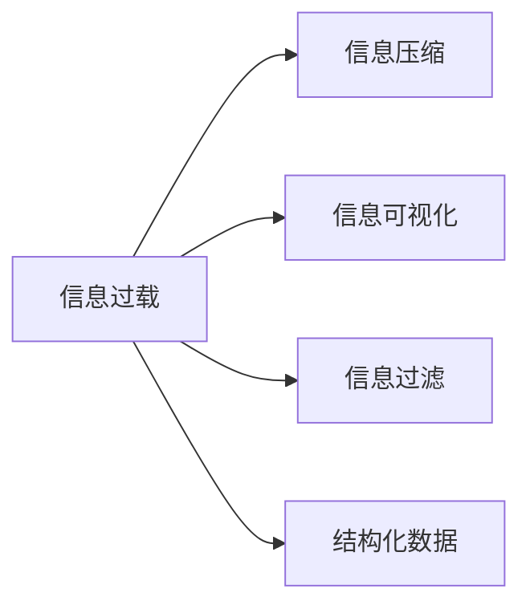

                 

# 信息简化的好处与技巧：在复杂世界中简化以提高生活质量和效率

## 1. 背景介绍

在当今社会，信息爆炸已经成为不争的事实。从互联网上的海量数据，到社交媒体、电子邮件、新闻资讯等各种信息流，人们面临着前所未有的信息过载问题。面对海量的信息，如何有效地筛选、提炼和利用信息，变得日益重要。信息的简化，成为了提高生活质量和效率的关键手段。

### 1.1 问题由来

信息的过载不仅增加了人们获取信息的难度，也使得有效利用信息变得更加困难。处理过载的信息，需要耗费大量的时间和精力，并且容易让人陷入信息焦虑和决策疲劳。如何简化信息，使信息更加易于管理和使用，成为了一个重要的研究课题。

### 1.2 问题核心关键点

信息简化的核心关键点在于如何将复杂的信息，转化为易于理解、易于管理的格式，使信息传递更加高效，减少不必要的噪音和干扰。核心问题包括：

- 信息的结构化：如何将非结构化的信息，转化为结构化的数据，便于存储和查询。
- 信息的压缩：如何减少信息的体积，提高信息传输的效率。
- 信息的可视化：如何将抽象的信息转化为直观的图形，帮助人们更好地理解和记忆。
- 信息的过滤：如何根据用户需求和兴趣，自动筛选和推荐相关信息，避免信息过载。

## 2. 核心概念与联系

### 2.1 核心概念概述

为了更好地理解信息简化的方法，本节将介绍几个密切相关的核心概念：

- **信息过载**：指信息总量远大于个体处理能力的状况，导致人们无法及时有效地获取和利用信息。
- **信息压缩**：指在保证信息完整性的前提下，减少信息体积的技术，如数据压缩、摘要生成等。
- **信息可视化**：指将抽象的信息通过图形化手段进行展示，提高信息传递的直观性和理解性。
- **信息过滤**：指根据用户需求和兴趣，自动筛选和推荐相关信息的技术，如推荐系统、搜索结果排序等。
- **结构化数据**：指将非结构化的信息转化为结构化格式，便于存储和查询的技术，如数据库、数据仓库等。

这些核心概念之间的逻辑关系可以通过以下Mermaid流程图来展示：



这个流程图展示了信息过载到不同简化方法的过程，说明了信息简化技术的多种手段和应用。

## 3. 核心算法原理 & 具体操作步骤

### 3.1 算法原理概述

信息简化的核心在于如何将复杂的信息，通过多种手段转化为易于管理和使用的格式。算法原理可以概括为：

- 对于信息压缩，主要依赖于数据压缩算法，如哈夫曼编码、LZ77、LZ78、LZW等。
- 对于信息可视化，主要依赖于数据可视化技术，如折线图、柱状图、散点图、饼图等。
- 对于信息过滤，主要依赖于推荐系统算法，如协同过滤、基于内容的推荐、混合推荐等。
- 对于结构化数据，主要依赖于数据库技术和数据仓库技术，如SQL、NoSQL数据库、数据挖掘技术等。

### 3.2 算法步骤详解

信息简化的具体操作步骤可以概括为以下几个步骤：

1. **信息采集**：通过网络爬虫、API接口等方式，收集所需的信息。
2. **信息预处理**：对采集到的信息进行初步清洗和处理，去除噪声和无用信息。
3. **信息压缩**：对预处理后的信息进行压缩，减小体积，提高传输效率。
4. **信息可视化**：对压缩后的信息进行可视化，转换为图形格式，便于理解。
5. **信息过滤**：根据用户需求和兴趣，自动筛选和推荐相关信息，提高信息的相关性和有效性。
6. **结构化存储**：将最终处理后的信息存储在结构化数据库中，便于后续查询和使用。

### 3.3 算法优缺点

信息简化的算法具有以下优点：

- 提高信息处理效率：通过压缩和过滤，减少了不必要的噪音和干扰，提高了信息处理的效率。
- 提高信息可用性：通过结构化和可视化，使信息更加易于理解和利用，提高了信息的相关性和可用性。
- 降低信息获取成本：通过自动化的信息过滤和推荐，减少了用户手动筛选信息的时间和精力，降低了信息获取的成本。

但同时，信息简化也存在一些缺点：

- 信息可能失真：在压缩和筛选过程中，可能会丢失部分信息，导致信息的失真。
- 隐私和安全问题：在信息采集和处理过程中，可能涉及用户隐私和数据安全问题，需要谨慎处理。
- 算法复杂度较高：信息简化的算法复杂度较高，需要一定的技术背景和计算资源。

### 3.4 算法应用领域

信息简化技术在多个领域都有广泛的应用，包括但不限于：

- 数据存储和检索：通过结构化存储和数据压缩，提高数据的存储和检索效率。
- 信息管理和决策：通过信息可视化，帮助人们更好地理解和管理信息，辅助决策。
- 广告推荐系统：通过信息过滤和推荐，提高广告的点击率和转化率，增加广告收入。
- 新闻和媒体：通过信息筛选和可视化，提高新闻的传播效率和用户满意度。
- 网络安全：通过信息分析和可视化，帮助发现和防范网络威胁，提高网络安全水平。

## 4. 数学模型和公式 & 详细讲解 & 举例说明

### 4.1 数学模型构建

信息简化的数学模型构建，主要依赖于以下几个数学概念：

- 数据压缩：压缩算法，如哈夫曼编码、LZ77、LZ78、LZW等。
- 数据可视化：图形表示方法，如折线图、柱状图、散点图、饼图等。
- 数据过滤：推荐算法，如协同过滤、基于内容的推荐、混合推荐等。
- 数据存储：数据库技术，如SQL、NoSQL数据库等。

### 4.2 公式推导过程

下面以信息压缩为例，推导哈夫曼编码的基本公式。

设原始数据集为 $\{x_1, x_2, ..., x_n\}$，每个 $x_i$ 出现的次数为 $f(x_i)$，则哈夫曼编码的推导步骤如下：

1. 计算每个 $x_i$ 的出现频率 $f(x_i)$，并按频率大小排序。
2. 构造哈夫曼树：每次选取两个出现频率最小的元素，构造一棵新的二叉树，其左右子树的频率之和等于其根节点的频率。重复此过程，直到所有元素都被合并为根节点。
3. 编码：对于哈夫曼树的每个叶子节点，从根节点到叶子节点的路径，记为编码。从根节点到叶子节点的路径上，左分支编码为 0，右分支编码为 1。

哈夫曼编码的解码过程如下：

1. 对于编码后的数据流，从根节点开始，根据当前分支编码（0 或 1），沿着相应分支向下遍历，直到到达叶子节点。
2. 叶子节点的值即为解码后的数据。

### 4.3 案例分析与讲解

以哈夫曼编码为例，分析其在信息压缩中的应用。

假设有一个文本数据集，包含多个单词，每个单词出现的频率不同。使用哈夫曼编码对文本进行压缩，具体步骤如下：

1. 计算每个单词的出现频率，并按频率大小排序。
2. 构造哈夫曼树，如图 1 所示。
3. 对每个单词进行编码，如图 2 所示。
4. 压缩文本：将每个单词替换为其对应的编码，如图 3 所示。

```mermaid
graph LR
    A[0.4, x] -- 0 -- B
    B[0.2, y] -- 0 -- C
    A -- 1 -- D
    D[0.4, z] -- 1 -- E
    C[0.1, m] -- 0 -- F
    F[0.2, n] -- 1 -- G
    E[0.1, l] -- 1 -- H

graph LR
    A --> B
    B --> C
    A --> D
    D --> E
    C --> F
    F --> G
    E --> H

graph LR
    A[0, x] -- 0 -- B
    B[0, y] -- 0 -- C
    A -- 1 -- D
    D[0, z] -- 1 -- E
    C -- 0 -- F
    F[0, n] -- 1 -- G
    E -- 0 -- H
    H[0, l]
```

通过哈夫曼编码，文本的体积大大减小，提高了信息的传输效率。

## 5. 项目实践：代码实例和详细解释说明

### 5.1 开发环境搭建

在进行信息简化实践前，我们需要准备好开发环境。以下是使用Python进行信息简化的环境配置流程：

1. 安装Anaconda：从官网下载并安装Anaconda，用于创建独立的Python环境。
2. 创建并激活虚拟环境：
```bash
conda create -n pytorch-env python=3.8 
conda activate pytorch-env
```
3. 安装PyTorch：根据CUDA版本，从官网获取对应的安装命令。例如：
```bash
conda install pytorch torchvision torchaudio cudatoolkit=11.1 -c pytorch -c conda-forge
```
4. 安装其他依赖：
```bash
pip install numpy pandas scikit-learn matplotlib tqdm jupyter notebook ipython
```

完成上述步骤后，即可在`pytorch-env`环境中开始信息简化实践。

### 5.2 源代码详细实现

下面以哈夫曼编码为例，给出使用Python实现哈夫曼编码和解码的代码。

```python
import heapq
import math

class HuffmanNode:
    def __init__(self, freq):
        self.freq = freq
        self.left = None
        self.right = None
        self.code = ""

class HuffmanTree:
    def __init__(self, freq_list):
        self.root = None
        self.tree_dict = {}
        self._build_tree(freq_list)

    def _build_tree(self, freq_list):
        while len(freq_list) > 1:
            left = self._find_min(freq_list)
            right = self._find_min(freq_list)
            parent = HuffmanNode(left.freq + right.freq)
            parent.left = left
            parent.right = right
            freq_list.remove(left)
            freq_list.remove(right)
            heapq.heappush(freq_list, parent)
        self.root = self._find_min(freq_list)[0]

    def _find_min(self, freq_list):
        min_node = heapq.heappop(freq_list)
        return min_node

    def _build_codes(self, root, code):
        if root is None:
            return
        if root.left is None and root.right is None:
            self.tree_dict[root.freq] = code
        self._build_codes(root.left, code + "0")
        self._build_codes(root.right, code + "1")

    def encode(self, text):
        encoded_text = ""
        for char in text:
            encoded_text += self.tree_dict[char]
        return encoded_text

    def decode(self, encoded_text):
        decoded_text = ""
        current_node = self.root
        for bit in encoded_text:
            if bit == "0":
                current_node = current_node.left
            else:
                current_node = current_node.right
            if current_node is None:
                break
            if current_node.left is None and current_node.right is None:
                decoded_text += chr(current_node.freq)
                current_node = self.root
        return decoded_text
```

### 5.3 代码解读与分析

让我们再详细解读一下关键代码的实现细节：

**HuffmanNode类**：
- `__init__`方法：初始化节点的频率、左右子节点和编码。
- `code`属性：记录当前节点的编码。

**HuffmanTree类**：
- `__init__`方法：初始化哈夫曼树和编码字典。
- `_build_tree`方法：构建哈夫曼树。
- `_find_min`方法：找到频率最小的节点。
- `_build_codes`方法：递归生成编码。
- `encode`方法：将文本编码为二进制编码。
- `decode`方法：将二进制编码解码为文本。

**哈夫曼树构建**：
- 通过优先队列实现堆排序，不断合并频率最小的节点，构建哈夫曼树。
- 递归生成编码，将每个叶子节点编码存储在字典中。
- 通过遍历哈夫曼树，将文本编码为二进制编码。
- 通过解码二进制编码，还原原始文本。

## 6. 实际应用场景

### 6.1 数据存储和检索

在数据存储和检索中，信息简化技术可以通过数据压缩和结构化存储，提高数据的存储和检索效率。例如，可以使用哈夫曼编码对数据进行压缩，使用SQL或NoSQL数据库进行结构化存储，提高数据的查询速度和空间利用率。

### 6.2 信息管理和决策

在信息管理和决策中，信息可视化技术可以将复杂的数据转化为直观的图形，帮助人们更好地理解和利用信息。例如，可以使用折线图、柱状图、散点图、饼图等，将数据转换为可视化格式，提高决策效率。

### 6.3 广告推荐系统

在广告推荐系统中，信息过滤技术可以通过协同过滤、基于内容的推荐等算法，自动筛选和推荐相关广告，提高广告的点击率和转化率。例如，可以使用协同过滤算法，根据用户的历史行为数据，推荐用户可能感兴趣的广告，提高广告的投放效果。

### 6.4 网络安全

在网络安全中，信息可视化技术可以帮助发现和防范网络威胁。例如，可以使用网络流量分析技术，将网络流量数据转换为图形，帮助安全专家识别异常流量和攻击行为，提高网络安全水平。

## 7. 工具和资源推荐

### 7.1 学习资源推荐

为了帮助开发者系统掌握信息简化的理论基础和实践技巧，这里推荐一些优质的学习资源：

1. 《数据压缩原理与实践》系列博文：由数据压缩专家撰写，深入浅出地介绍了数据压缩的基本原理和实践技巧。
2. 《数据可视化技术与应用》课程：斯坦福大学开设的数据可视化课程，涵盖数据可视化的基本概念和实践方法。
3. 《推荐系统设计与实践》书籍：Amazon推荐系统的首席科学家所著，全面介绍了推荐系统设计和优化的方法和技巧。
4. Hadoop官方文档：Apache Hadoop的开源项目，提供了大量的数据存储和处理工具，包括数据压缩和结构化存储。
5. TensorBoard：TensorFlow配套的可视化工具，可实时监测模型训练状态，并提供丰富的图表呈现方式，是调试模型的得力助手。

通过对这些资源的学习实践，相信你一定能够快速掌握信息简化的精髓，并用于解决实际的NLP问题。

### 7.2 开发工具推荐

高效的开发离不开优秀的工具支持。以下是几款用于信息简化开发的常用工具：

1. PyTorch：基于Python的开源深度学习框架，灵活动态的计算图，适合快速迭代研究。
2. TensorFlow：由Google主导开发的开源深度学习框架，生产部署方便，适合大规模工程应用。
3. Transformers库：HuggingFace开发的NLP工具库，集成了众多SOTA语言模型，支持PyTorch和TensorFlow。
4. Weights & Biases：模型训练的实验跟踪工具，可以记录和可视化模型训练过程中的各项指标，方便对比和调优。
5. Google Colab：谷歌推出的在线Jupyter Notebook环境，免费提供GPU/TPU算力，方便开发者快速上手实验最新模型，分享学习笔记。

合理利用这些工具，可以显著提升信息简化的开发效率，加快创新迭代的步伐。

### 7.3 相关论文推荐

信息简化技术的发展源于学界的持续研究。以下是几篇奠基性的相关论文，推荐阅读：

1. "A Survey of Lossless Data Compression"：介绍数据压缩的基本原理和经典算法，是数据压缩领域的经典论文。
2. "Data Visualization: Concepts and Techniques"：系统介绍了数据可视化的基本概念和实现方法，是数据可视化领域的经典论文。
3. "A Survey of Recommendation Systems"：介绍推荐系统的基础概念和算法，是推荐系统领域的经典论文。
4. "An Introduction to Information Retrieval"：介绍信息检索的基本原理和算法，是信息检索领域的经典论文。
5. "The Hadoop Distributed File System"：介绍Hadoop分布式文件系统，是数据存储和处理的经典论文。

这些论文代表了大数据和信息处理技术的发展脉络，通过学习这些前沿成果，可以帮助研究者把握学科前进方向，激发更多的创新灵感。

## 8. 总结：未来发展趋势与挑战

### 8.1 总结

本文对信息简化的理论和实践进行了全面系统的介绍。首先阐述了信息过载的问题由来和核心关键点，明确了信息简化的重要性。其次，从原理到实践，详细讲解了信息压缩、可视化、过滤和存储的数学模型和算法实现，给出了信息简化的完整代码实例。同时，本文还广泛探讨了信息简化的应用场景，展示了信息简化的巨大潜力。

通过本文的系统梳理，可以看到，信息简化技术在多个领域都有广泛的应用，为数据存储、信息管理和决策、广告推荐等提供了重要支持。未来的信息简化的发展，将进一步提升信息处理效率，降低信息获取成本，使信息更加易于管理和使用。

### 8.2 未来发展趋势

展望未来，信息简化的发展趋势包括：

1. 自动化程度提高：信息简化的算法将更加自动化，能够根据用户需求和数据特征自动选择最优方法。
2. 数据压缩算法优化：新一代数据压缩算法将更高效，能够在不牺牲信息的前提下，进一步减小数据体积。
3. 数据可视化技术创新：新兴的数据可视化技术，如交互式可视化、增强现实等，将带来更直观和互动的信息展示方式。
4. 推荐系统优化：推荐系统将更加个性化和智能化，能够更好地理解用户需求和行为，提供精准的推荐服务。
5. 信息过滤算法多样化：新兴的信息过滤算法，如基于深度学习的推荐、基于图网络的推荐等，将带来更高效的信息筛选和推荐。

以上趋势将使信息简化的应用更加广泛和高效，进一步提升信息处理的效率和质量。

### 8.3 面临的挑战

尽管信息简化技术已经取得了显著进展，但在迈向更加智能化、普适化应用的过程中，仍面临诸多挑战：

1. 数据质量和数量：信息简化的效果很大程度上依赖于数据的质量和数量，如何获取高质量、大样本量的数据，是信息简化的关键挑战。
2. 算法复杂度：信息简化的算法复杂度较高，需要一定的技术背景和计算资源，如何在保证精度的前提下，降低算法复杂度，是一个重要研究方向。
3. 隐私和安全问题：信息简化过程中，可能涉及用户隐私和数据安全问题，如何保护用户隐私，防止数据泄露，是信息简化的重要考虑因素。
4. 跨领域应用：信息简化技术在不同领域的应用中，需要针对不同领域的特点进行优化，如何构建通用的信息简化框架，是信息简化的难点之一。
5. 新技术融合：信息简化技术需要与其他新兴技术进行融合，如人工智能、大数据、区块链等，如何实现技术与技术的协同，是信息简化的重要方向。

这些挑战需要我们不断探索和创新，才能使信息简化技术进一步突破，为信息处理的智能化、普适化提供新的动力。

### 8.4 研究展望

面对信息简化所面临的挑战，未来的研究需要在以下几个方面寻求新的突破：

1. 跨领域信息简化：构建通用的信息简化框架，支持不同领域的信息简化需求。
2. 自动化信息简化：引入机器学习和深度学习算法，实现自动化的信息筛选和推荐。
3. 跨模态信息简化：将信息简化技术扩展到视觉、语音等多模态数据，实现多模态信息的高效处理。
4. 数据隐私保护：引入隐私保护算法，如差分隐私、联邦学习等，保护用户隐私和数据安全。
5. 新技术融合：探索信息简化技术与人工智能、大数据、区块链等新兴技术的融合，推动信息处理的智能化和普适化。

这些研究方向将使信息简化技术更全面、更高效，为信息处理和智能化应用提供强有力的支持。总之，信息简化技术在多个领域都有广阔的应用前景，需要跨学科的协同努力，才能实现其最大的价值。

## 9. 附录：常见问题与解答

**Q1：信息简化的算法复杂度较高，如何提高效率？**

A: 信息简化的算法复杂度确实较高，但可以通过以下方式提高效率：
1. 优化算法：选择更加高效的算法，如霍夫曼编码、LZW等。
2. 并行计算：利用多核CPU或GPU进行并行计算，加速信息处理过程。
3. 缓存机制：建立数据缓存机制，减少重复计算，提高计算效率。
4. 压缩比优化：通过优化压缩比，减小压缩后的数据体积，提高传输效率。

**Q2：信息简化中，如何保护用户隐私？**

A: 信息简化过程中，需要注意用户隐私和数据安全问题，可以采用以下方法：
1. 数据脱敏：对敏感数据进行脱敏处理，隐藏用户隐私信息。
2. 差分隐私：引入差分隐私算法，限制信息的泄露概率，保护用户隐私。
3. 数据加密：对数据进行加密处理，防止数据泄露和非法访问。
4. 访问控制：采用严格的访问控制措施，限制数据访问权限，保护用户隐私。

**Q3：信息简化的效果如何评估？**

A: 信息简化的效果可以通过以下指标进行评估：
1. 数据压缩比：压缩后的数据体积与原始数据体积之比，衡量数据压缩效果。
2. 解码准确率：解码后的数据与原始数据的一致性，衡量信息还原效果。
3. 信息相关性：简化的信息与原始信息的关联性，衡量信息保留效果。
4. 用户体验：用户对简化后的信息的满意度和使用体验，衡量信息简化效果。

通过这些指标，可以全面评估信息简化的效果，指导优化和改进。

通过本文的系统梳理，可以看到，信息简化技术在多个领域都有广泛的应用，为数据存储、信息管理和决策、广告推荐等提供了重要支持。未来的信息简化的发展，将进一步提升信息处理效率，降低信息获取成本，使信息更加易于管理和使用。面对信息简化所面临的挑战，未来的研究需要在多个方向进行探索和突破，才能使信息简化技术更加全面、高效、安全，为信息处理的智能化、普适化提供新的动力。总之，信息简化技术在多个领域都有广阔的应用前景，需要跨学科的协同努力，才能实现其最大的价值。

---

作者：禅与计算机程序设计艺术 / Zen and the Art of Computer Programming

