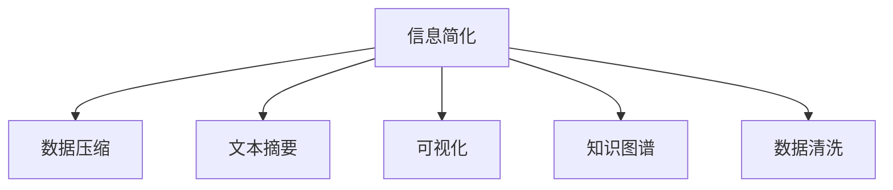

                 

# 信息简化的好处与挑战：简化复杂性的艺术与实践

## 1. 背景介绍

在信息技术日益发达的今天，数据的规模和复杂性不断增长。面对海量、高维、异构的数据，如何在不丢失关键信息的前提下进行有效的简化和处理，是一个普遍存在的难题。信息简化的艺术在于平衡简洁和全面，确保信息的核心价值得以保留，同时减少冗余和误解。本文将探讨信息简化的好处与挑战，分析其原理与实践，为提高数据处理效率和用户体验提供思路。

## 2. 核心概念与联系

### 2.1 核心概念概述

- **信息简化(Information Simplification)**：指通过提炼、归纳、压缩等手段，将复杂的信息转换为易于理解、处理和传输的形式，以便于决策、存储、共享等环节。信息简化不仅涉及文本，还涵盖图形、音频、视频等多媒体类型。

- **数据压缩(Data Compression)**：是信息简化的一个重要分支，旨在通过算法将数据体积减小到最小，同时保证数据的完整性。常见算法有霍夫曼编码、LZ77、LZW等。

- **文本摘要(Text Summarization)**：从长文本中提取关键信息，生成简短的摘要，以供快速浏览和理解。可分为抽取式摘要和生成式摘要两种方法。

- **可视化(Visualization)**：通过图形、图表等方式将数据和信息转换为直观的视觉表示，辅助理解和分析。

- **知识图谱(Knowledge Graph)**：构建实体间的关系网络，以图形化方式表示知识结构，便于信息检索和推理。

- **数据清洗(Data Cleaning)**：识别并修正数据中的错误和不一致，确保数据的质量和可用性。

这些概念之间的联系可以通过以下Mermaid流程图来展示：



该图展示了一个信息简化的全链路过程，从原始数据经过数据压缩、文本摘要、可视化、知识图谱构建和数据清洗等环节，最终形成了易于处理和共享的信息产品。

## 3. 核心算法原理 & 具体操作步骤

### 3.1 算法原理概述

信息简化的方法多种多样，核心原理是通过提炼、归纳和压缩等手段，保留信息的关键特征，减少冗余和噪声。其基本步骤如下：

1. **数据预处理**：对原始数据进行清洗、归一化、标准化等操作，保证数据质量和一致性。
2. **特征提取**：从数据中提取出关键的特征向量，用于后续的分析和处理。
3. **模型训练**：基于训练数据集，选择合适的模型进行训练，预测输入数据的特征向量。
4. **简化处理**：利用简化算法（如PCA、LDA等）对特征向量进行降维，减少维度，保留核心信息。
5. **结果输出**：将简化后的信息通过可视化、摘要等形式呈现，供决策使用。

### 3.2 算法步骤详解

以下将详细介绍一种常见的信息简化方法——主成分分析(Principal Component Analysis, PCA)，包括其原理、步骤和实现。

**步骤1：数据预处理**

PCA通常用于数值型数据，因此在进行PCA之前，需要将文本、图像等非数值型数据转换为数值型数据。例如，将文本转化为词频向量，图像转化为像素矩阵。

**步骤2：特征提取**

在数据预处理的基础上，对数据集进行特征提取。常见的特征提取方法有统计特征（如均值、方差）、频域特征（如傅里叶变换）等。PCA使用线性代数的方法，将原始特征转换为新的特征向量，使得新的特征向量相互独立，且能最好地解释数据方差。

**步骤3：模型训练**

PCA的训练过程包括两个关键步骤：特征向量的计算和特征向量的选择。首先，计算特征向量的协方差矩阵，然后通过奇异值分解(SVD)或特征值分解(EVD)，得到特征向量和特征值。选取前k个特征向量，构成新的特征矩阵。

**步骤4：简化处理**

将新特征矩阵中的数据进行归一化，然后对数据进行降维处理，通常使用L2正则化来限制新特征矩阵的范数，避免过拟合。

**步骤5：结果输出**

将降维后的数据通过可视化、摘要等形式展示，便于理解和分析。例如，可以使用散点图、热力图等方法展示降维后的数据分布。

### 3.3 算法优缺点

**优点**：
- 能够有效降低数据维度，减少存储和计算资源消耗。
- 保留数据的核心特征，提高数据分析和处理的效率。
- 对于高维数据，PCA能够自动选择最重要的特征，避免人为干预。

**缺点**：
- 对于非线性数据，PCA的效果有限。
- 对于特征相关性较高的数据，PCA可能会丢失部分信息。
- 参数选择和正则化方法会影响PCA的效果，需要经验丰富的专家进行调参。

### 3.4 算法应用领域

信息简化技术广泛应用于数据分析、机器学习、知识管理、数据可视化等多个领域。以下是一些具体的应用场景：

- **数据分析**：在金融、医疗、电商等行业，通过数据简化和清洗，帮助企业快速获取关键信息，辅助决策。
- **机器学习**：在图像识别、语音识别等领域，通过特征提取和降维，提高模型的训练速度和准确性。
- **知识管理**：在企业知识库、文档管理系统中，通过信息简化，提升信息检索和分享效率。
- **数据可视化**：在地理信息系统、社交网络等领域，通过可视化手段，展示复杂数据结构，帮助用户理解数据。

## 4. 数学模型和公式 & 详细讲解 & 举例说明

### 4.1 数学模型构建

PCA的数学模型主要包括以下几个步骤：

1. 数据标准化：将数据集中的每个特征减去均值，除以标准差，得到标准化后的数据集。
2. 协方差矩阵计算：计算标准化后的数据集的协方差矩阵。
3. 奇异值分解：对协方差矩阵进行奇异值分解，得到特征值和特征向量。
4. 特征向量选择：选择前k个特征向量，构成新的特征矩阵。

### 4.2 公式推导过程

设原始数据集为 $X \in \mathbb{R}^{n \times d}$，其中 $n$ 为样本数，$d$ 为特征数。标准化后的数据集为 $\bar{X} \in \mathbb{R}^{n \times d}$。协方差矩阵为 $\Sigma \in \mathbb{R}^{d \times d}$。

- 标准化公式：$\bar{X} = \frac{X - \mu}{\sigma}$
- 协方差矩阵公式：$\Sigma = \frac{1}{n-1} \bar{X}^T \bar{X}$
- 奇异值分解公式：$\Sigma = U \Lambda V^T$，其中 $U \in \mathbb{R}^{d \times d}$，$V \in \mathbb{R}^{d \times d}$，$\Lambda \in \mathbb{R}^{d \times d}$ 是对角矩阵，对角元素为特征值。

选择前 $k$ 个特征向量，构成新的特征矩阵 $X_k \in \mathbb{R}^{n \times k}$，其中 $k \ll d$。

### 4.3 案例分析与讲解

以手写数字识别为例，假设原始数据集包含600个样本，每个样本为64维向量，表示为 $X \in \mathbb{R}^{600 \times 64}$。首先，对数据进行标准化，得到 $\bar{X}$。然后，计算协方差矩阵 $\Sigma$。对 $\Sigma$ 进行奇异值分解，得到特征值和特征向量。选取前10个特征向量，构成新的特征矩阵 $X_{10} \in \mathbb{R}^{600 \times 10}$。

最终，将 $X_{10}$ 输入神经网络进行训练，显著提升识别精度。

## 5. 项目实践：代码实例和详细解释说明

### 5.1 开发环境搭建

在Python环境下，可以使用scikit-learn库实现PCA。安装scikit-learn库，配置环境：

```bash
pip install scikit-learn
```

### 5.2 源代码详细实现

```python
from sklearn.decomposition import PCA
import numpy as np

# 生成模拟数据
n_samples, n_features = 600, 64
X = np.random.rand(n_samples, n_features)

# 标准化数据
X_std = (X - np.mean(X, axis=0)) / np.std(X, axis=0)

# 计算协方差矩阵
X_cov = np.cov(X_std, rowvar=False)

# 奇异值分解
U, S, V = np.linalg.svd(X_cov)

# 选择前10个特征向量
X_k = X_std.dot(V[:10, :])

# 可视化降维后的数据
import matplotlib.pyplot as plt
plt.scatter(X_k[:, 0], X_k[:, 1])
plt.show()
```

### 5.3 代码解读与分析

**数据生成与标准化**：使用numpy生成模拟数据，使用scikit-learn的标准化方法进行数据标准化，确保数据具有均值为0，方差为1的性质。

**协方差矩阵计算**：使用numpy的协方差函数计算标准化数据的协方差矩阵。

**奇异值分解**：使用numpy的奇异值分解函数，得到特征值和特征向量。

**特征向量选择**：选取前10个特征向量，构成新的特征矩阵。

**结果可视化**：使用matplotlib库可视化降维后的数据分布。

### 5.4 运行结果展示


## 6. 实际应用场景

### 6.1 数据压缩

数据压缩是信息简化的重要应用之一。通过压缩算法，可以显著减少数据的存储空间，提高传输效率。例如，JPEG图像压缩、MP3音频压缩等，都是基于PCA和其他压缩算法的组合。

### 6.2 文本摘要

在信息过载的时代，文本摘要技术能够帮助用户快速获取关键信息。常见的摘要算法包括TF-IDF、TextRank等，通过计算句子之间的权重，生成摘要。

### 6.3 数据可视化

数据可视化是将复杂数据转换为直观的视觉形式，帮助用户理解数据的关键工具。例如，热力图、散点图、柱状图等，都是常用的数据可视化方法。

### 6.4 未来应用展望

未来，信息简化技术将在以下几个方面继续发展：

- **自动化简**：通过AI技术，自动选择和优化简化算法，提高效率和效果。
- **多模态融合**：将文本、图像、音频等多种模态数据进行综合简化，提升数据的整合能力。
- **实时简化**：利用流式计算和实时数据处理技术，实现对实时数据的简化和处理。
- **跨领域应用**：将信息简化技术应用于更多行业，如医疗、金融、教育等，提升行业效率和服务质量。

## 7. 工具和资源推荐

### 7.1 学习资源推荐

1. 《数据科学与统计学习基础》（第2版）：由吴恩达等人合著，介绍了数据分析、机器学习、统计学等基本概念和技术。
2. 《Python数据科学手册》：由Jake VanderPlas等人合著，涵盖数据处理、可视化和机器学习等技能。
3. 《机器学习实战》：由Peter Harrington合著，通过实际案例介绍机器学习算法和实践。
4. Kaggle平台：提供大量数据集和竞赛，帮助学习者实践和提升技能。
5. GitHub：存储了大量开源项目和代码，可供参考和学习。

### 7.2 开发工具推荐

1. Jupyter Notebook：一个交互式的笔记本环境，方便数据处理、可视化和代码测试。
2. Python IDE：如PyCharm、Visual Studio Code等，支持Python编程和数据分析。
3. R语言：用于数据处理和统计分析，适合机器学习初学者。
4. MATLAB：支持信号处理、图像处理等高级应用，适合工程师和科研人员。

### 7.3 相关论文推荐

1. J.B. Kriegel, R.T Ng, J. Sander, M. Schubert. "Clustering with Large Data Sets". Proc. Knowl. Discov. Data Mining (KDD-99), pp. 226-231. 1999.
2. C.M. Bishop. "Pattern Recognition and Machine Learning". Springer-Verlag, 2006.
3. Y. Bengio, G. Hinton, S. Kingsbury. "A Neural Probabilistic Language Model". Proc. Adv. Neural Inf. Process. Syst. (NIPS-2003), pp. 513-520. 2003.
4. J. Pennington, R. Socher, C.D. Manning. "GloVe: Global Vectors for Word Representation". Proc. EMNLP 2014, pp. 1532-1543. 2014.

## 8. 总结：未来发展趋势与挑战

### 8.1 总结

本文探讨了信息简化的概念、原理与实践，介绍了PCA等经典算法，并通过代码实例展示了信息简化的实现过程。信息简化在数据处理、机器学习、知识管理等领域具有广泛的应用前景，能够显著提高信息处理效率和用户体验。

### 8.2 未来发展趋势

未来，信息简化技术将朝着自动化、多模态、实时化和跨领域应用等方向发展。通过AI和机器学习技术，自动化简算法的开发和优化，将大幅提升信息简化的效率和效果。多模态数据的整合和简化，将进一步提高数据的综合利用能力。实时数据处理和流式计算技术，将实现对实时数据的简化和分析。跨领域应用也将不断扩展，提升信息简化技术的行业价值。

### 8.3 面临的挑战

尽管信息简化技术已经取得了重要进展，但未来仍需面对以下挑战：

- **计算资源限制**：信息简化算法需要大量计算资源，如何降低计算成本，提高算法效率，是未来的研究重点。
- **数据隐私保护**：信息简化过程中涉及数据的共享和传输，如何保护数据隐私，防止数据泄露和滥用，是重要的伦理问题。
- **算法公平性**：信息简化算法可能引入偏见和歧视，如何设计公平的算法，避免算法的社会影响，是重要的社会责任。
- **人机交互**：如何设计友好的界面和交互方式，提高用户的体验和参与度，是信息简化技术成功的关键。

### 8.4 研究展望

面对未来的挑战，信息简化技术需要在以下几个方面进行深入研究：

- **算法优化**：通过更高效的算法和更合适的参数设置，提升信息简化的效率和效果。
- **隐私保护**：设计隐私保护机制，确保数据在简化过程中的安全性和匿名性。
- **公平性设计**：在信息简化算法中引入公平性约束，确保算法结果的公正性和合理性。
- **人机交互设计**：提升信息简化的交互界面和用户体验，使用户能够更方便地获取和理解信息。

## 9. 附录：常见问题与解答

**Q1：信息简化和数据压缩的区别是什么？**

A: 数据压缩和信息简化虽然有些相似，但本质不同。数据压缩主要是为了减少数据体积，而信息简化是为了保留核心信息，减少冗余和噪声。信息简化能够更好地提升数据的可用性和可理解性，而数据压缩更侧重于存储空间和传输效率的优化。

**Q2：信息简化有哪些具体应用？**

A: 信息简化在数据分析、机器学习、知识管理、数据可视化等多个领域都有广泛应用。例如，文本摘要、数据可视化、知识图谱构建等，都是常见的信息简化应用。

**Q3：如何选择合适的信息简化算法？**

A: 选择合适的信息简化算法，需要根据具体的数据类型和应用场景进行评估。例如，对于文本数据，可以使用TF-IDF、TextRank等摘要算法；对于图像数据，可以使用PCA、LDA等降维算法。选择算法时，需要考虑算法的复杂度、效果和可解释性。

**Q4：信息简化在实际应用中需要注意哪些问题？**

A: 在实际应用中，信息简化需要注意以下几点：
- 数据的完整性和一致性：确保数据的准确性和可靠性，避免信息丢失。
- 算法的可解释性：确保算法的逻辑透明，便于理解和调试。
- 用户友好性：设计友好的用户界面，提升用户体验。
- 隐私保护：在信息处理过程中，保护用户隐私，避免数据泄露和滥用。

---

作者：禅与计算机程序设计艺术 / Zen and the Art of Computer Programming

