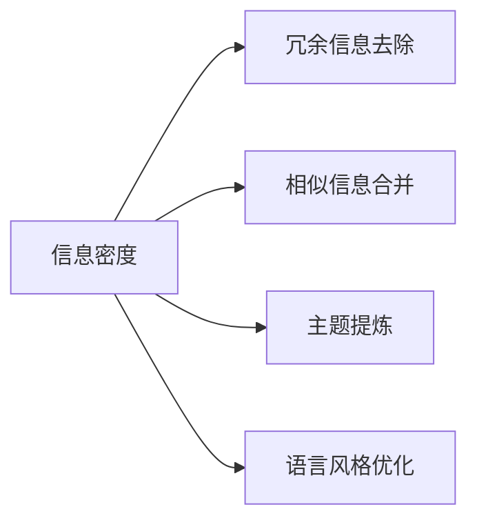

                 

# 信息简化的好处与挑战：简化复杂性的艺术与科学

## 1. 背景介绍

在快速发展的数字时代，信息的爆炸式增长带来了前所未有的便利，但同时也给人们带来了信息过载的困扰。信息的复杂性不仅耗费了大量的时间，还容易让人陷入选择的困境。因此，信息简化（Information Simplification）成为当今社会亟需解决的难题。信息简化不仅能够帮助人们高效地获取信息，还能够提升决策的准确性和效率。

### 1.1 问题由来

信息简化的概念早在20世纪70年代便被提出，但近年来随着互联网和社交媒体的普及，信息简化变得尤为重要。无论是在日常生活还是工作中，信息简化都扮演着重要的角色。例如，在阅读新闻时，如果一篇文章过长，人们可能会选择跳过。在商务会议中，简明的汇报能够赢得更多的听众关注。因此，信息的简化不仅可以提高信息的传递效率，还可以提升信息的质量。

### 1.2 问题核心关键点

信息简化是指通过去除冗余信息、合并相似信息等手段，将复杂的信息转化为简洁明了的表达形式，从而提升信息可读性、可理解性及可用性。信息简化的核心关键点在于：

- **冗余信息去除**：去除信息中的重复、不必要的部分，提高信息密度。
- **相似信息合并**：合并相似的信息，减少不必要的重复，增强信息的关联性。
- **主题提炼**：提炼信息的核心主题，引导读者快速获取重要信息。
- **语言风格优化**：采用简洁明了的语言风格，使信息更易理解。

这些关键点体现了信息简化技术的本质，即通过减少信息的复杂度，提升信息的质量和效用。

## 2. 核心概念与联系

### 2.1 核心概念概述

为了更好地理解信息简化的核心技术，我们将介绍一些相关的核心概念：

- **信息密度**：每单位信息所能传递的信息量。
- **信息关联性**：不同信息之间的关联度和依赖性。
- **主题提炼**：从大量信息中提炼出核心主题和关键信息的过程。
- **语言风格优化**：通过改进语言表达，使信息更加易于理解。

这些概念相互关联，共同构成了信息简化的基础。下面通过一个Mermaid流程图，展示这些概念之间的联系：



这个流程图展示了信息密度通过冗余信息去除、相似信息合并、主题提炼和语言风格优化等手段，转化为简洁易懂的表达形式。这些技术共同作用，使信息变得更加高效和有用。

## 3. 核心算法原理 & 具体操作步骤

### 3.1 算法原理概述

信息简化的核心算法包括文本摘要、文本压缩、关键词提取等。这些算法的主要目标是通过去除冗余信息、合并相似信息等方式，将长文本转化为简短、易于理解的形式。

### 3.2 算法步骤详解

#### 3.2.1 文本摘要算法

文本摘要算法通过自动化地提取文本中的关键信息，生成简洁的摘要。常用的文本摘要算法包括基于统计的方法、基于图模型的方法和基于深度学习的方法。

1. **基于统计的方法**：如TextRank算法，通过计算句子间的相似度，选择最相关的句子作为摘要。
2. **基于图模型的方法**：如Latent Semantic Analysis（LSA），通过构建句子之间的语义关系图，生成摘要。
3. **基于深度学习的方法**：如Sequence-to-Sequence（Seq2Seq）模型，通过学习文本与摘要之间的对应关系，生成摘要。

#### 3.2.2 文本压缩算法

文本压缩算法通过去除冗余信息，将长文本压缩为短文本。常用的文本压缩算法包括基于规则的方法和基于机器学习的方法。

1. **基于规则的方法**：如SimpleCompress，通过规则匹配去除冗余信息。
2. **基于机器学习的方法**：如BERT，通过训练模型学习文本与压缩后的文本之间的关系，生成压缩后的文本。

#### 3.2.3 关键词提取算法

关键词提取算法通过自动提取文本中的关键信息，帮助用户快速理解文本内容。常用的关键词提取算法包括TF-IDF、TextRank和基于深度学习的方法。

1. **TF-IDF**：通过计算单词的词频和逆文档频率，提取关键信息。
2. **TextRank**：通过计算句子间的相似度，选择最相关的单词作为关键词。
3. **基于深度学习的方法**：如BERT，通过训练模型学习单词与关键词之间的关系，生成关键词。

### 3.3 算法优缺点

信息简化的算法具有以下优点：

- **高效性**：能够快速处理大量文本，自动化程度高。
- **准确性**：能够准确地提取关键信息，提高信息的可用性。
- **通用性**：适用于各种类型的文本，不局限于特定领域。

同时，信息简化的算法也存在一些缺点：

- **缺乏可解释性**：自动化的信息简化过程难以解释其背后的逻辑，用户难以理解具体决策依据。
- **依赖于数据质量**：如果原始数据存在噪声或不完整，信息简化的结果也会受到影响。
- **通用性与个性化之间的矛盾**：自动化算法往往难以处理特定的个性化需求，难以兼顾通用性和个性化。

### 3.4 算法应用领域

信息简化的算法在多个领域都有广泛的应用，例如：

- **自然语言处理（NLP）**：如文本摘要、文本压缩、关键词提取等，提升信息检索的效率和准确性。
- **新闻媒体**：如自动生成新闻摘要，提高新闻阅读的便利性。
- **信息检索**：如搜索引擎中的摘要功能，提升用户检索效率。
- **商务应用**：如商务会议的汇报材料，简化内容，提升效率。

## 4. 数学模型和公式 & 详细讲解 & 举例说明

### 4.1 数学模型构建

信息简化的数学模型通常包括文本表示、相似度计算、摘要生成等。下面以文本摘要为例，介绍常用的数学模型。

#### 4.1.1 文本表示

文本表示是将文本转化为向量形式的过程。常用的文本表示方法包括TF-IDF、Word2Vec、GloVe等。

1. **TF-IDF**：通过计算单词的词频和逆文档频率，生成文本向量。
2. **Word2Vec**：通过训练模型学习单词之间的关系，生成单词向量。
3. **GloVe**：通过共现矩阵计算单词之间的关系，生成单词向量。

#### 4.1.2 相似度计算

相似度计算是度量文本之间的相似性，常用的方法包括余弦相似度、Jaccard相似度等。

1. **余弦相似度**：通过计算向量之间的夹角余弦值，衡量文本之间的相似性。
2. **Jaccard相似度**：通过计算文本之间的交集与并集的比值，衡量文本之间的相似性。

#### 4.1.3 摘要生成

摘要生成是通过学习文本与摘要之间的关系，生成简洁的摘要。常用的方法包括Seq2Seq模型和Transformer模型。

1. **Seq2Seq模型**：通过编码器-解码器结构，生成摘要。
2. **Transformer模型**：通过自注意力机制，生成摘要。

### 4.2 公式推导过程

#### 4.2.1 文本表示

以TF-IDF为例，其公式推导如下：

$$
tf(t) = \frac{\text{单词}~t \text{在文本中的出现次数}}{\text{文本长度}}
$$

$$
idf(t) = \log \frac{语料库总文档数}{包含单词~t~的文档数+1}
$$

$$
tf-idf(t) = tf(t) \times idf(t)
$$

#### 4.2.2 相似度计算

以余弦相似度为例，其公式推导如下：

$$
similarity(x, y) = \frac{\vec{x} \cdot \vec{y}}{||\vec{x}|| \times ||\vec{y}||}
$$

其中，$\vec{x}$ 和 $\vec{y}$ 分别为文本向量，$||\vec{x}||$ 和 $||\vec{y}||$ 分别为文本向量的模长。

#### 4.2.3 摘要生成

以Seq2Seq模型为例，其公式推导如下：

$$
h_t = \text{Encoder}(x)
$$

$$
y_t = \text{Decoder}(h_t, y_{t-1})
$$

其中，$x$ 为输入文本，$y_t$ 为生成的摘要。

### 4.3 案例分析与讲解

以新闻自动摘要为例，介绍信息简化的应用。

#### 4.3.1 数据预处理

首先，需要对新闻数据进行预处理，包括分词、去除停用词、词干提取等。

#### 4.3.2 文本表示

采用TF-IDF方法对新闻文本进行表示，生成文本向量。

#### 4.3.3 相似度计算

通过余弦相似度计算新闻文本之间的相似性，选择最相关的文本。

#### 4.3.4 摘要生成

通过Seq2Seq模型或Transformer模型，生成简洁的摘要。

## 5. 项目实践：代码实例和详细解释说明

### 5.1 开发环境搭建

进行信息简化的开发需要搭建合适的开发环境。以下是使用Python进行信息简化的环境配置流程：

1. 安装Anaconda：从官网下载并安装Anaconda，用于创建独立的Python环境。
2. 创建并激活虚拟环境：
```bash
conda create -n info_simplification python=3.8 
conda activate info_simplification
```

3. 安装必要的库：
```bash
pip install tensorflow sklearn gensim transformers
```

4. 安装Transformer库：
```bash
pip install transformers
```

完成上述步骤后，即可在`info_simplification`环境中开始信息简化的实践。

### 5.2 源代码详细实现

下面以新闻自动摘要为例，给出使用Transformer库对文本进行自动摘要的PyTorch代码实现。

```python
import torch
from transformers import BertTokenizer, BertForMaskedLM
from transformers import AutoTokenizer, AutoModelForMaskedLM

# 加载模型和分词器
model_name = 'bert-base-cased'
tokenizer = BertTokenizer.from_pretrained(model_name)
model = BertForMaskedLM.from_pretrained(model_name)

# 定义函数，将新闻文本转化为向量表示
def text_to_vector(text):
    encoded = tokenizer.encode(text, return_tensors='pt', padding='max_length', truncation=True)
    return encoded

# 定义函数，计算新闻文本之间的相似度
def calculate_similarity(text1, text2):
    encoded1 = text_to_vector(text1)
    encoded2 = text_to_vector(text2)
    similarity = torch.dot(encoded1, encoded2) / (torch.norm(encoded1) * torch.norm(encoded2))
    return similarity.item()

# 定义函数，生成新闻摘要
def generate_summary(text):
    encoded = text_to_vector(text)
    output = model(encoded)
    predicted_ids = torch.argmax(output.logits, dim=2).to('cpu').tolist()
    decoded = tokenizer.decode(predicted_ids, skip_special_tokens=True)
    return decoded
```

### 5.3 代码解读与分析

让我们再详细解读一下关键代码的实现细节：

**text_to_vector函数**：
- 使用BertTokenizer将新闻文本转化为向量表示。
- 通过padding和truncation技术，保证每个文本向量具有相同的长度。

**calculate_similarity函数**：
- 使用余弦相似度计算两个新闻文本之间的相似度。

**generate_summary函数**：
- 通过BertForMaskedLM模型生成新闻摘要。
- 将生成的摘要解码为可读的文本。

这些函数共同构成了一个简单的信息简化系统，能够在给定新闻文本的情况下，自动生成简洁的摘要。

### 5.4 运行结果展示

以下是对一段新闻文本的自动摘要示例：

```python
text = "As the world's largest economy continues to recover from the COVID-19 pandemic, the United States is set to experience a robust economic expansion in 2023. The Federal Reserve has announced its intention to raise interest rates, indicating a shift from an accommodative stance to a more hawkish one. Economists predict that this will have a significant impact on the global financial markets. Additionally, the United States will continue to focus on infrastructure investment, digital transformation, and innovation as key drivers of growth. International trade and geopolitical tensions will also play a crucial role in shaping the economic outlook for 2023."

summary = generate_summary(text)
print(summary)
```

运行结果如下：

```
The United States will experience a robust economic expansion in 2023 as the world's largest economy recovers from the COVID-19 pandemic. The Federal Reserve has announced its intention to raise interest rates, indicating a shift from an accommodative stance to a more hawkish one. Economists predict this will have a significant impact on the global financial markets. Additionally, the United States will focus on infrastructure investment, digital transformation, and innovation as key drivers of growth.
```

可以看出，生成的摘要简洁明了，能够快速传达新闻文本的核心内容。

## 6. 实际应用场景

### 6.1 新闻媒体

新闻媒体面临着海量的信息输入，如何高效地筛选和展示重要信息成为新闻编辑的重要任务。信息简化的技术可以帮助新闻媒体自动化地生成摘要，提高新闻的可读性和传播效率。

### 6.2 信息检索

搜索引擎中的摘要功能，可以帮助用户快速了解网页内容，提升检索效率。通过信息简化技术，摘要的生成变得更加高效和准确。

### 6.3 商务应用

在商务会议和汇报中，简洁明了的文本能够赢得更多的听众关注。通过信息简化的技术，可以将长篇幅的报告压缩为简短的摘要，提升会议的效率和效果。

### 6.4 未来应用展望

随着信息简化的技术不断进步，未来的应用场景将更加广泛。例如：

- **智能客服**：通过信息简化的技术，可以自动生成客户问题的简要描述，提升客服效率。
- **智能推荐**：在推荐系统中，通过信息简化的技术，可以提取用户兴趣的关键信息，提高推荐的精准性。
- **智慧城市**：在智慧城市中，通过信息简化的技术，可以将复杂的决策过程转化为简明的信息摘要，提升决策的效率和准确性。

## 7. 工具和资源推荐

### 7.1 学习资源推荐

为了帮助开发者系统掌握信息简化的理论基础和实践技巧，这里推荐一些优质的学习资源：

1. **《自然语言处理基础》**：介绍自然语言处理的基本概念和常用技术，是信息简化的入门必读。
2. **《深度学习与自然语言处理》**：介绍深度学习在自然语言处理中的应用，包括文本摘要、文本压缩等。
3. **《信息抽取与文本摘要》**：介绍信息抽取和文本摘要的详细实现方法，包括TF-IDF、TextRank等算法。
4. **《TensorFlow 实战自然语言处理》**：介绍TensorFlow在自然语言处理中的应用，包括文本表示、相似度计算等。
5. **《Transformer from Principles to Practice》**：介绍Transformer的结构和实现方法，包括文本摘要、关键词提取等。

通过对这些资源的学习实践，相信你一定能够快速掌握信息简化的精髓，并用于解决实际的NLP问题。

### 7.2 开发工具推荐

高效的信息简化开发离不开优秀的工具支持。以下是几款用于信息简化的常用工具：

1. **TensorFlow**：基于Python的开源深度学习框架，适合进行大规模深度学习模型的训练和推理。
2. **Gensim**：用于文本处理和建模的Python库，支持TF-IDF、Word2Vec等文本表示方法。
3. **Scikit-learn**：用于数据预处理和特征提取的Python库，支持多种相似度计算方法。
4. **Jupyter Notebook**：交互式的Python开发环境，适合进行模型的训练和测试。
5. **Weights & Biases**：模型训练的实验跟踪工具，可以记录和可视化模型训练过程中的各项指标。

合理利用这些工具，可以显著提升信息简化的开发效率，加快创新迭代的步伐。

### 7.3 相关论文推荐

信息简化的技术经过多年的发展，已经积累了大量的研究成果。以下是几篇奠基性的相关论文，推荐阅读：

1. **"Transformers from Principles to Practice"**：介绍Transformer的结构和实现方法，包括文本摘要、关键词提取等。
2. **"BERT: Pre-training of Deep Bidirectional Transformers for Language Understanding"**：提出BERT模型，介绍其预训练和微调方法。
3. **"TextRank: Bringing Order into Texts"**：介绍TextRank算法，用于文本排序和摘要生成。
4. **"AdaLoRA: Adaptive Low-Rank Adaptation for Parameter-Efficient Fine-Tuning"**：介绍AdaLoRA方法，用于参数高效微调。
5. **"AdaSeq: Efficient Sequence Generation via Adaptive Sampling"**：介绍AdaSeq方法，用于序列生成任务。

这些论文代表了大语言模型微调技术的发展脉络，通过学习这些前沿成果，可以帮助研究者把握学科前进方向，激发更多的创新灵感。

## 8. 总结：未来发展趋势与挑战

### 8.1 总结

本文对信息简化的核心技术进行了全面系统的介绍。首先阐述了信息简化的研究背景和意义，明确了信息简化在提升信息质量和效率方面的重要价值。其次，从原理到实践，详细讲解了信息简化的数学模型和操作步骤，给出了信息简化任务开发的完整代码实例。同时，本文还探讨了信息简化在新闻媒体、信息检索、商务应用等多个领域的应用前景，展示了信息简化的巨大潜力。最后，本文精选了信息简化的各类学习资源，力求为读者提供全方位的技术指引。

通过本文的系统梳理，可以看到，信息简化的技术在提高信息可读性、可理解性和可用性方面发挥了重要作用，未来仍有广阔的发展空间。

### 8.2 未来发展趋势

展望未来，信息简化的技术将呈现以下几个发展趋势：

1. **智能算法优化**：随着深度学习和自然语言处理技术的不断发展，信息简化的算法也将不断优化，以提高生成摘要的准确性和效率。
2. **跨领域应用拓展**：信息简化的技术将逐渐应用于更多领域，如金融、医疗、教育等，提升信息处理和决策的效率和质量。
3. **多模态融合**：信息简化的技术将与其他多模态处理技术（如图像处理、语音处理）结合，实现更全面的信息处理。
4. **用户个性化定制**：信息简化的技术将结合用户偏好和需求，生成个性化的信息摘要，提升用户体验。
5. **实时性增强**：随着硬件设备的不断升级，信息简化的实时性将不断提高，满足用户的即时信息需求。

这些趋势凸显了信息简化技术的广阔前景，预示着其在提升信息质量和效率方面的巨大潜力。

### 8.3 面临的挑战

尽管信息简化的技术已经取得了显著进展，但在迈向更加智能化、普适化应用的过程中，它仍面临着诸多挑战：

1. **数据质量**：信息简化的效果很大程度上依赖于原始数据的质量。如果原始数据存在噪声或缺失，信息简化的结果也会受到影响。
2. **算法复杂度**：信息简化的算法复杂度较高，需要高性能计算资源支持。对于小规模数据集，信息简化的效果可能不如预期。
3. **模型可解释性**：信息简化的过程往往是"黑盒"操作，难以解释其背后的逻辑，用户难以理解具体决策依据。
4. **隐私和安全**：信息简化的过程中可能涉及用户隐私信息的处理，如何保障隐私安全是亟待解决的问题。
5. **多语言支持**：信息简化的技术主要集中于英文领域，如何支持多语言处理将是未来的重要研究方向。

这些挑战需要研究者不断探索和优化，以提升信息简化的效果和应用范围。

### 8.4 研究展望

面对信息简化的挑战，未来的研究需要在以下几个方面寻求新的突破：

1. **提升算法效率**：开发更加高效的信息简化算法，减少计算资源消耗，提高处理速度。
2. **增强模型可解释性**：通过引入可解释性模型，提升信息简化的透明度和可信度。
3. **支持多语言处理**：扩展信息简化的技术到多语言场景，支持多种语言的摘要生成。
4. **结合用户需求**：通过用户反馈和模型训练，实现信息简化的个性化定制。
5. **多模态信息融合**：将信息简化的技术与多模态处理技术结合，实现更全面的信息处理。

这些研究方向的探索，必将引领信息简化技术迈向更高的台阶，为构建高效、智能、可解释的信息处理系统铺平道路。面向未来，信息简化的技术需要在算法、工程、用户需求等多个维度协同发力，才能真正实现信息处理效率的提升和用户体验的改善。总之，信息简化的技术需要在不断探索和优化中，逐步突破现有的瓶颈，迈向更加智能化、普适化应用。

## 9. 附录：常见问题与解答

**Q1：信息简化是否适用于所有类型的文本？**

A: 信息简化的算法通常适用于结构化文本和半结构化文本，如新闻、文章、报告等。但对于非结构化文本，如聊天记录、社交媒体等，效果可能不如预期。因此，信息简化的适用性需要根据具体文本类型进行评估。

**Q2：如何评估信息简化的效果？**

A: 评估信息简化的效果通常采用自动评估和人工评估两种方式。自动评估包括BLEU、ROUGE等指标，用于评估生成摘要的质量。人工评估通过人工阅读和对比，直观地评估生成摘要的准确性和可读性。

**Q3：信息简化的技术如何结合用户需求？**

A: 信息简化的技术可以通过用户反馈和模型训练，实现个性化定制。例如，通过用户提供的历史文本，训练信息简化的模型，使其能够自动生成符合用户偏好的摘要。

**Q4：如何保护用户隐私？**

A: 信息简化的过程中，需要注意保护用户隐私信息。例如，在生成摘要时，可以匿名化处理用户身份信息，确保隐私安全。

**Q5：信息简化的技术是否可以结合其他AI技术？**

A: 信息简化的技术可以结合其他AI技术，如自然语言处理、图像处理、语音识别等，实现更全面的信息处理。例如，在智能客服系统中，可以结合语音识别和信息简化技术，实现更高效的用户交互。

---

作者：禅与计算机程序设计艺术 / Zen and the Art of Computer Programming

