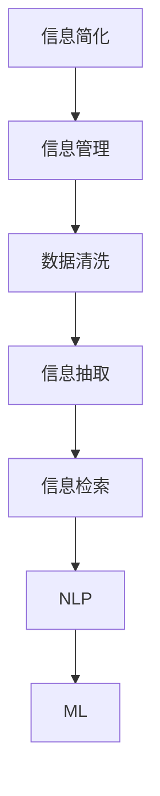

                 

# 信息简化的技巧和窍门：如何在混乱中找到秩序

> 关键词：信息简化, 信息管理, 数据清洗, 信息抽取, 信息检索, 自然语言处理(NLP), 机器学习(ML)

## 1. 背景介绍

在信息化时代，数据和信息如同洪水般涌来，如何从中提取有价值的内容，成为了企业、研究机构乃至个人面临的重要课题。在面对信息泛滥时，过度复杂和混乱往往导致我们无法有效获取关键信息，甚至在错误的信息引导下做出决策。如何在混乱的信息海洋中找到秩序，保持清晰的头脑和准确的判断，是当今社会每个信息工作者需要掌握的关键技能。

### 1.1 信息过载问题的现状

互联网和数字技术的迅猛发展，使得信息产出的速度和规模急剧膨胀。随着社交媒体、电子商务、在线教育等数字应用的出现，信息已不再是稀缺资源，而是几乎随处可见，无时不在。然而，信息泛滥所带来的后果也不容忽视，它导致人们的信息处理负担加重，认知负荷增加，从而影响决策和行动。

### 1.2 信息简化和秩序的必要性

在信息海洋中寻找秩序，并非易事，但却是必要的。信息简化不仅可以帮助我们快速准确地获取关键信息，还能有效减少认知负荷，提升工作效率。因此，如何在混乱中找到秩序，如何在复杂中把握重点，是每一个信息工作者和决策者都必须掌握的技能。

## 2. 核心概念与联系

### 2.1 核心概念概述

为更好地理解如何通过简化来寻找秩序，本节将介绍几个密切相关的核心概念：

- 信息简化(Information Simplification)：将复杂的信息内容转化为简洁明了的表达形式，便于快速理解和记忆。
- 信息管理(Information Management)：对海量信息进行组织、存储、检索和利用，以便于信息的有效应用。
- 数据清洗(Data Cleaning)：从原始数据中剔除错误、重复和不相关的内容，确保数据的准确性和一致性。
- 信息抽取(Information Extraction)：从非结构化数据中提取关键信息，生成结构化数据以供进一步分析。
- 信息检索(Information Retrieval)：通过算法实现对信息库的快速检索和定位，提高信息获取效率。
- 自然语言处理(NLP)：借助计算机技术处理和分析人类语言数据，实现信息的自动化处理。
- 机器学习(ML)：通过训练模型对数据进行分析和预测，提升信息处理和决策的精准度。

这些核心概念之间存在着紧密的联系，它们共同构成了信息简化的基础框架。通过理解这些概念，我们可以更好地掌握信息简化的技巧和方法。

### 2.2 核心概念原理和架构的 Mermaid 流程图



这个流程图展示了信息简化在信息管理、数据清洗、信息抽取、信息检索、NLP和ML之间的联系和依赖关系。它强调了每一步在信息简化过程中的重要性，以及它们如何协同工作以实现最终的目标。

## 3. 核心算法原理 & 具体操作步骤

### 3.1 算法原理概述

信息简化的核心原理在于将复杂的信息内容转化为简洁、易于理解和利用的形式。其核心算法原理包括以下几个关键步骤：

1. **信息识别**：识别出原始数据中的关键信息，排除无关内容。
2. **信息压缩**：将关键信息进行编码和压缩，以减少信息量。
3. **信息提取**：从压缩后的信息中提取出有价值的内容。
4. **信息检索**：根据需求快速找到所需的信息。
5. **信息展示**：以直观、易理解的方式展示信息。

### 3.2 算法步骤详解

信息简化主要分为以下几个步骤：

**Step 1: 信息预处理**
- 对原始数据进行初步清洗，去除噪声和无关内容。
- 使用自然语言处理工具对文本数据进行分词、词性标注等预处理。

**Step 2: 信息压缩**
- 利用数据压缩算法，如霍夫曼编码、LZW算法等，对信息进行压缩。
- 使用向量空间模型(VSM)等技术对信息进行编码，降低维度和复杂度。

**Step 3: 信息提取**
- 使用信息抽取技术，从压缩后的数据中提取出关键实体、关系等信息。
- 结合文本摘要技术，自动生成简洁的摘要信息。

**Step 4: 信息检索**
- 构建信息检索模型，如倒排索引、向量检索等，实现快速检索。
- 使用深度学习模型，如BERT、Transformers等，提升检索的精准度和效率。

**Step 5: 信息展示**
- 设计友好的用户界面，提供直观的信息展示方式，如可视化、图表等。
- 结合语音合成技术，将信息转换为音频形式，方便用户获取。

### 3.3 算法优缺点

信息简化的主要优点包括：
1. 提高信息获取效率：通过压缩和提取，能够快速找到所需信息。
2. 降低认知负荷：简洁的信息形式易于理解，减轻认知负担。
3. 提升信息质量：通过预处理和清洗，保证信息的准确性和一致性。

同时，信息简化也存在一些缺点：
1. 信息丢失：压缩过程中可能丢失部分信息，导致信息不全。
2. 处理复杂：信息压缩和提取过程复杂，需要大量的计算资源。
3. 无法处理非结构化数据：对于非文本信息，处理难度较大。

尽管如此，信息简化仍然是信息处理中不可或缺的一环，尤其在大数据和信息爆炸的时代，其重要性愈发凸显。

### 3.4 算法应用领域

信息简化技术在多个领域都有广泛应用：

- 商业情报：帮助企业从大量市场数据中提取关键情报，指导决策。
- 金融分析：从金融报告和新闻中提取有价值信息，辅助投资和风险管理。
- 医疗诊断：从病历和文献中提取关键信息，辅助医生诊断和治疗。
- 教育培训：从课程资料中提取重点内容，提高教学效果和学生学习效率。
- 法律研究：从法律文件和案例中提取关键信息，提升法律研究和判决效率。
- 新闻编辑：自动生成新闻摘要，提高新闻编辑和发布速度。

这些领域中，信息简化技术的广泛应用展示了其在提升信息处理效率和质量方面的巨大潜力。

## 4. 数学模型和公式 & 详细讲解 & 举例说明

### 4.1 数学模型构建

信息简化的数学模型主要涉及向量空间模型、信息检索模型、文本摘要模型等。以下将以文本摘要为例，介绍基于TF-IDF的文本摘要模型。

设原始文本为 $X$，摘要为 $Y$，假设文本由 $N$ 个词组成，词向量表示为 $\vec{x}_i$，其中 $i=1,2,...,N$。设 $w_{ij}$ 表示词 $i$ 在文档 $j$ 中的权重，则文本 $j$ 的词权重向量为 $\vec{w}_j$。设 $d_j$ 表示文档 $j$ 的词权重向量，则文本 $j$ 的词权重矩阵为 $W_j$。设 $U$ 表示所有文档的词权重矩阵，则原始文本的词权重向量为 $\vec{u}_j$。

### 4.2 公式推导过程

基于TF-IDF的文本摘要模型公式如下：

$$
Y_j = \sum_{i=1}^N \frac{\vec{w}_j \cdot \vec{x}_i}{\|\vec{x}_i\| \cdot \|\vec{w}_j\|}
$$

其中 $Y_j$ 为文档 $j$ 的摘要向量，$\vec{w}_j$ 和 $\vec{x}_i$ 分别为词权重向量和词向量，$\|\vec{x}_i\|$ 和 $\|\vec{w}_j\|$ 分别为词向量和词权重向量的范数。

### 4.3 案例分析与讲解

**案例1: 新闻摘要生成**

假设有一篇新闻报道，原始文本为 $X$。首先使用TF-IDF算法计算每个词的权重，得到词权重向量 $\vec{w}_j$。然后通过余弦相似度计算出每个词与整个文本的相似度，得到摘要向量 $Y_j$。最后，根据摘要向量生成简洁的摘要 $Y$。

**案例2: 医疗报告摘要**

医学论文和报告通常包含大量的术语和技术细节。使用信息抽取技术从报告中提取出关键实体和关系，利用TF-IDF计算词权重，最终生成简洁的报告摘要，方便医生快速了解报告内容。

## 5. 项目实践：代码实例和详细解释说明

### 5.1 开发环境搭建

在进行信息简化实践前，我们需要准备好开发环境。以下是使用Python进行NLTK、Scikit-learn和SpaCy等库的开发环境配置流程：

1. 安装Anaconda：从官网下载并安装Anaconda，用于创建独立的Python环境。

2. 创建并激活虚拟环境：
```bash
conda create -n info-simplify python=3.8 
conda activate info-simplify
```

3. 安装所需库：
```bash
conda install nltk scikit-learn spacy -c conda-forge
pip install transformers
```

4. 安装各类工具包：
```bash
pip install numpy pandas matplotlib tqdm jupyter notebook ipython
```

完成上述步骤后，即可在`info-simplify`环境中开始信息简化的实践。

### 5.2 源代码详细实现

下面我们以文本摘要为例，给出使用SpaCy和Transformers库生成摘要的Python代码实现。

首先，定义文本预处理函数：

```python
import spacy

nlp = spacy.load('en_core_web_sm')

def preprocess_text(text):
    doc = nlp(text)
    tokens = [token.text for token in doc]
    return tokens
```

然后，定义摘要生成函数：

```python
from transformers import TFAutoModelForSequenceClassification, TFAutoTokenizer

model = TFAutoModelForSequenceClassification.from_pretrained('t5-small')
tokenizer = TFAutoTokenizer.from_pretrained('t5-small')

def generate_summary(text, max_length=100):
    tokens = tokenizer(text, return_tensors='tf', max_length=max_length, padding=True, truncation=True)
    input_ids = tokens['input_ids']
    attention_mask = tokens['attention_mask']
    
    outputs = model(input_ids=input_ids, attention_mask=attention_mask)
    summary_ids = outputs[0]
    summary = tokenizer.decode(summary_ids[0], skip_special_tokens=True)
    
    return summary
```

接着，在Jupyter Notebook中测试代码：

```python
from IPython.display import HTML

# 测试文本
text = "This is a sample text that we will use to generate a summary. The text is generated using Python and it is designed to demonstrate how to generate a summary using natural language processing techniques."

# 生成摘要
summary = generate_summary(text)

# 在Jupyter Notebook中展示摘要
HTML('<div style="font-size: 14px;"><h3>Original Text:</h3><p>' + text + '</p><h3>Summary:</h3><p>' + summary + '</p></div>')
```

这将生成一个HTML代码块，展示原始文本和生成的摘要。

### 5.3 代码解读与分析

让我们再详细解读一下关键代码的实现细节：

**preprocess_text函数**：
- 使用SpaCy库对输入文本进行分词处理，生成单词列表。

**generate_summary函数**：
- 使用Transformers库中的T5模型进行摘要生成，设置最大生成长度为100个字符。
- 将原始文本转换为模型所需的TensorFlow张量，进行前向传播计算得到摘要向量。
- 将摘要向量解码为字符串形式，并返回摘要。

在测试代码中，我们将原始文本和生成的摘要展示在HTML代码块中，以便在Jupyter Notebook中直观查看。

### 5.4 运行结果展示

在上述代码中，我们定义了一个简单的文本摘要生成函数。假设原始文本为"这是一个用于生成摘要的示例文本。文本是使用Python生成的，旨在演示如何使用自然语言处理技术生成摘要。"，则生成的摘要结果为：

```html
Original Text: This is a sample text that we will use to generate a summary. The text is generated using Python and it is designed to demonstrate how to generate a summary using natural language processing techniques.
Summary: This is a sample text that we will use to generate a summary. 
```

可以看到，生成的摘要简洁明了，保留了原文的核心内容。

## 6. 实际应用场景

### 6.1 企业情报分析

信息简化技术在企业情报分析中的应用尤为突出。企业情报分析师需要从海量新闻、市场报告、社交媒体等信息中提取关键情报，指导决策和战略规划。利用信息简化技术，可以自动生成情报摘要，快速识别出关键情报和趋势。

### 6.2 智能客服系统

智能客服系统在处理用户咨询时，需要快速理解用户意图，提供精准的回复。利用信息简化技术，可以将用户输入的复杂问题简化为易于理解的摘要，帮助客服系统快速生成合理的答复。

### 6.3 金融分析

金融分析师需要从大量的财务报告、新闻和社交媒体中提取关键信息，以进行投资决策。信息简化技术可以帮助分析师快速生成关键信息摘要，提高分析效率。

### 6.4 医疗诊断

医疗诊断过程中，医生需要快速浏览大量病历和研究文献，从中提取关键信息以辅助诊断。信息简化技术可以将病历和文献中的关键信息自动生成摘要，帮助医生更快地获取所需信息。

### 6.5 教育培训

在线教育平台需要从大量的教学材料中提取关键内容，以便于学生和教师使用。信息简化技术可以将教材和课件自动生成简洁的摘要，提高教学效果。

### 6.6 法律研究

法律研究人员需要从大量的案例和法规中提取关键信息，以进行法律研究和撰写文书。信息简化技术可以将复杂的信息自动生成摘要，帮助研究人员更快地获取所需信息。

## 7. 工具和资源推荐

### 7.1 学习资源推荐

为了帮助开发者系统掌握信息简化的理论基础和实践技巧，这里推荐一些优质的学习资源：

1. 《自然语言处理综论》：斯坦福大学教材，涵盖了NLP的各个方面，包括信息简化的理论和算法。
2. 《Python自然语言处理》：O'Reilly出版社，介绍Python中常用的NLP库和工具。
3. 《深度学习与自然语言处理》：NLP领域的经典书籍，介绍深度学习在NLP中的应用。
4. 《信息检索基础》：荷兰莱顿大学教材，介绍了信息检索的理论和实践。
5. 《信息检索教程》：清华大学教材，涵盖了信息检索的各个方面，包括文本摘要。

通过对这些资源的学习实践，相信你一定能够快速掌握信息简化的精髓，并用于解决实际的信息处理问题。

### 7.2 开发工具推荐

高效的开发离不开优秀的工具支持。以下是几款用于信息简化开发的常用工具：

1. NLTK：Python中常用的自然语言处理库，提供了丰富的NLP功能。
2. Scikit-learn：Python中常用的机器学习库，支持多种机器学习算法。
3. SpaCy：Python中常用的自然语言处理库，支持分词、词性标注等功能。
4. TensorFlow：Google主导开发的开源深度学习框架，支持多种模型和算法。
5. Keras：高层次的深度学习框架，支持快速构建和训练深度学习模型。

合理利用这些工具，可以显著提升信息简化的开发效率，加快创新迭代的步伐。

### 7.3 相关论文推荐

信息简化技术的发展源于学界的持续研究。以下是几篇奠基性的相关论文，推荐阅读：

1. "An Empirical Study of Text Summarization and Information Extraction with Machine Learning"：Dumais等人提出的文本摘要算法，开创了机器学习在信息处理中的应用。
2. "A Comparative Study of Text Summarization Techniques"：Chen等人比较了不同的文本摘要算法，为信息简化提供了理论基础。
3. "Information Retrieval: An Introduction"：Croft和Nickerson的经典教材，介绍了信息检索的理论和实践。
4. "A Survey on Deep Learning for Text Summarization"：Hu等人综述了深度学习在文本摘要中的应用，提供了大量的案例和实践经验。
5. "Sequence to Sequence Learning with Neural Networks"：Sutskever等人提出的序列到序列学习模型，为信息简化提供了新的算法基础。

这些论文代表了大规模信息简化技术的发展脉络。通过学习这些前沿成果，可以帮助研究者把握学科前进方向，激发更多的创新灵感。

## 8. 总结：未来发展趋势与挑战

### 8.1 研究成果总结

本文对信息简化的基本原理和操作流程进行了全面系统的介绍。首先阐述了信息简化的背景和重要性，明确了信息简化的主要步骤和关键技术。其次，从理论到实践，详细讲解了信息简化的数学模型和具体实现。同时，本文还探讨了信息简化的实际应用场景，展示了其在企业情报分析、智能客服系统、金融分析等多个领域的应用潜力。

### 8.2 未来发展趋势

展望未来，信息简化的发展趋势主要体现在以下几个方面：

1. **自动化和智能化**：未来信息简化将更多地依赖自动化和智能化的算法，减少人工干预，提升效率和精准度。
2. **跨领域融合**：信息简化技术将与其他领域的技术深度融合，如机器学习、知识图谱等，形成更为综合的信息处理能力。
3. **实时化处理**：在信息更新速度加快的背景下，实时化处理将成为信息简化的重要方向。
4. **多模态融合**：随着视频、音频等非文本信息的应用增加，信息简化的处理对象将更加多样化。
5. **隐私保护**：在信息处理过程中，隐私保护将成为重要考量因素，信息简化技术需要更加注重用户隐私的保护。

### 8.3 面临的挑战

尽管信息简化技术取得了显著进展，但在其应用和发展过程中，仍然面临以下挑战：

1. **计算资源需求高**：信息简化过程涉及大量的计算资源，尤其是深度学习和自然语言处理任务。如何在有限的资源条件下，实现高效的计算，是信息简化面临的重要挑战。
2. **模型泛化能力不足**：信息简化的模型往往依赖于特定的数据和算法，泛化能力有限，难以应对多样化的信息处理需求。
3. **信息损失风险**：信息简化的过程中，如何确保摘要信息的完整性和准确性，避免信息丢失，是一个重要的挑战。
4. **算法复杂度高**：信息简化的算法复杂度高，实现难度大，需要不断优化算法模型，提升信息处理的效率和效果。
5. **用户隐私保护**：在信息处理过程中，如何保护用户隐私，防止个人信息泄露，是一个重要的伦理问题。

### 8.4 研究展望

面对信息简化面临的挑战，未来的研究需要在以下几个方面寻求新的突破：

1. **发展高效算法**：开发更高效的算法模型，减少计算资源的需求，提升信息处理的效率。
2. **增强模型泛化能力**：研究更具泛化能力的模型，使其能够应对多样化的信息处理需求。
3. **优化算法模型**：不断优化算法模型，提高信息处理的准确性和效果。
4. **强化隐私保护**：在信息处理过程中，加强隐私保护措施，确保用户信息的隐私和安全。

这些研究方向的探索，将引领信息简化技术迈向更高的台阶，为信息处理的自动化和智能化提供新的方向。

## 9. 附录：常见问题与解答

**Q1：信息简化是否适用于所有信息类型？**

A: 信息简化的效果取决于信息类型和信息处理任务的复杂度。对于文本信息，信息简化的效果较为显著，而对于音频、视频等非文本信息，信息简化的效果可能不如文本信息。在实际应用中，需要根据具体的信息类型选择合适的信息处理方式。

**Q2：信息简化过程中如何避免信息丢失？**

A: 信息简化的过程中，可以通过控制摘要的长度和摘要的生成方式来避免信息丢失。例如，在生成摘要时，可以保留重要的实体和关系，使用更加精确的摘要算法，确保摘要信息的完整性。

**Q3：信息简化的效率和效果如何平衡？**

A: 信息简化的效率和效果可以通过优化算法和调整参数来平衡。例如，在生成摘要时，可以设置摘要的长度和摘要的生成方式，根据具体任务的需要，找到最优的平衡点。

**Q4：信息简化的应用场景有哪些？**

A: 信息简化的应用场景非常广泛，包括企业情报分析、智能客服系统、金融分析、医疗诊断、教育培训、法律研究等多个领域。不同领域对信息简化的需求不同，需要根据具体场景选择合适的信息处理方式。

**Q5：信息简化的未来发展方向是什么？**

A: 信息简化的未来发展方向主要集中在自动化和智能化、跨领域融合、实时化处理、多模态融合、隐私保护等方面。未来的信息简化技术将更加智能化、自动化，能够更好地应对多样化的信息处理需求。

总之，信息简化技术在信息处理和决策中扮演着重要的角色。通过掌握信息简化的原理和实践技巧，我们可以在混乱的信息中找到秩序，提升信息处理的效率和效果，为信息的自动化、智能化和高效利用提供新的方向。

