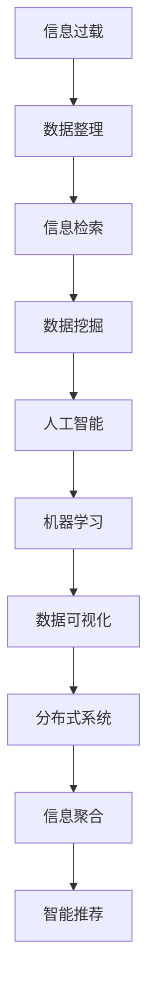

                 

# 信息过载与信息搜索指南与策略：在庞大的信息海洋中导航

> 关键词：信息过载,信息搜索,数据挖掘,人工智能,机器学习,数据可视化,分布式系统

## 1. 背景介绍

### 1.1 问题由来

信息过载是现代社会面临的一大难题。互联网和数字化技术的快速发展，使得我们每天接触到的大量信息量呈指数级增长。这些信息来源多样，包括新闻、社交媒体、博客、论坛、电子邮件、学术论文等。如何在茫茫信息海中快速找到有用信息，是每个信息工作者和用户都需要面对的问题。

信息过载现象不仅影响了个人的工作效率和生活质量，也对企业和组织的管理决策和战略规划提出了挑战。信息搜索和信息筛选成为了现代信息管理的关键。

### 1.2 问题核心关键点

信息过载问题主要表现为信息数量庞大、质量参差不齐、相关度低、更新速度快等问题。解决这些问题的关键在于：

- 数据整理和分类：对海量信息进行高效整理和分类，区分有用信息和无用信息。
- 信息检索和筛选：通过高效的信息检索和筛选算法，快速找到目标信息。
- 信息聚合与可视化：对信息进行聚合与可视化，提供更直观、易于理解的信息展示。
- 智能推荐与个性化：结合用户行为数据和机器学习算法，进行智能推荐和个性化服务。

## 2. 核心概念与联系

### 2.1 核心概念概述

为了更好地理解信息过载问题的解决，本节将介绍几个关键概念：

- 信息过载（Information Overload）：指用户面对大量信息时，由于信息量和相关度问题而导致的注意力分散、决策困难等现象。
- 信息检索（Information Retrieval, IR）：通过自动或半自动的方式，从大量信息中检索出符合用户需求的信息。
- 数据挖掘（Data Mining）：通过机器学习、统计学等方法，从大量数据中发现有价值的模式和规律。
- 人工智能（Artificial Intelligence, AI）：利用机器学习、深度学习等技术，实现智能化的信息处理和决策。
- 机器学习（Machine Learning, ML）：通过训练模型，使计算机能够自动学习并做出预测或决策。
- 数据可视化（Data Visualization）：通过图形化方式，将复杂的数据信息进行直观展示。
- 分布式系统（Distributed System）：通过多个计算机节点协同工作，处理大规模数据和高并发请求。

这些概念之间的关系可以通过以下Mermaid流程图来展示：



这个流程图展示了一系列解决信息过载问题的关键步骤和技术手段：

1. 信息过载现象通过数据整理和分类技术进行初步处理。
2. 经过整理后的信息，通过信息检索技术进行筛选。
3. 进一步利用数据挖掘技术提取信息中的模式和规律。
4. 数据挖掘结果通过机器学习算法转化为智能决策支持系统。
5. 数据可视化技术对信息进行直观展示。
6. 分布式系统用于处理大规模数据和高并发请求。
7. 通过信息聚合和智能推荐技术，最终实现个性化的信息服务。

## 3. 核心算法原理 & 具体操作步骤

### 3.1 算法原理概述

解决信息过载问题的关键在于对大量信息进行高效整理、检索、分析和推荐。基于此，本节将详细介绍几种核心算法和操作步骤：

- **信息整理与分类**：通过聚类、分类等方法，对信息进行整理和分类。
- **信息检索**：通过向量空间模型、倒排索引等技术，实现高效的信息检索。
- **数据挖掘与模式发现**：利用关联规则、异常检测等方法，从数据中发现有用的模式和规律。
- **机器学习与决策支持**：通过训练分类、回归等模型，实现信息自动分类和预测。
- **信息聚合与可视化**：将信息聚合为可视化的图表，提供直观展示。
- **分布式系统与高并发处理**：通过分布式系统技术，处理海量数据和高并发请求。
- **智能推荐**：利用协同过滤、内容推荐等算法，进行个性化信息推荐。

### 3.2 算法步骤详解

以下是几种核心算法的详细步骤：

#### 信息整理与分类

信息整理和分类是解决信息过载问题的第一步。常见的信息整理方法包括：

- **文本去重**：通过哈希、相似度计算等方法，去除重复的文本信息。
- **分词与词性标注**：将文本分解为词语，并标注其词性。
- **主题建模**：通过LDA、TF-IDF等算法，对文本进行主题建模。
- **分类算法**：通过朴素贝叶斯、支持向量机等算法，对信息进行分类。

#### 信息检索

信息检索的核心在于建立信息索引和检索算法。常见的方法包括：

- **向量空间模型**：将文本表示为向量，计算向量之间的相似度，找到最相关文档。
- **倒排索引**：将文档中的词语和对应的文档位置建立索引，快速检索相关文档。
- **模糊检索**：通过模糊查询，实现对词语变体和近似表达的检索。

#### 数据挖掘与模式发现

数据挖掘通过机器学习算法，从数据中发现有用的模式和规律。常见的方法包括：

- **关联规则学习**：通过Apriori、FP-growth等算法，发现数据集中的关联规则。
- **异常检测**：通过孤立森林、LOF等算法，检测数据中的异常点。
- **聚类分析**：通过K-means、层次聚类等算法，将数据分为不同的簇。

#### 机器学习与决策支持

机器学习算法通过对数据集进行训练，实现信息分类和预测。常见的方法包括：

- **监督学习**：通过分类、回归等算法，训练预测模型。
- **无监督学习**：通过聚类、降维等算法，发现数据中的隐含结构。
- **强化学习**：通过奖励机制，训练智能决策系统。

#### 信息聚合与可视化

信息聚合和可视化将大量信息聚合为图表和报告，提供直观展示。常见的方法包括：

- **数据汇总与聚合**：通过数据聚合函数，对数据进行汇总和统计。
- **可视化工具**：使用Tableau、Power BI等工具，将数据可视化。

#### 分布式系统与高并发处理

分布式系统通过多个计算机节点协同工作，处理大规模数据和高并发请求。常见的方法包括：

- **分布式计算框架**：如Hadoop、Spark等，实现大规模数据处理。
- **负载均衡**：通过负载均衡算法，分配请求到不同的服务器节点。

#### 智能推荐

智能推荐通过协同过滤、内容推荐等算法，进行个性化信息推荐。常见的方法包括：

- **协同过滤**：通过用户行为数据，推荐相似用户喜欢的内容。
- **内容推荐**：根据物品的特征，推荐与用户兴趣相关的物品。

### 3.3 算法优缺点

#### 信息整理与分类

**优点**：

- 通过整理和分类，将大量无序信息转化为有序信息，便于后续处理。
- 通过主题建模等技术，可以发现信息中的隐含结构，提供更深层次的信息理解。

**缺点**：

- 数据整理和分类过程复杂，对技术要求高。
- 分类结果可能存在偏差，需要不断优化和迭代。

#### 信息检索

**优点**：

- 通过高效的检索算法，可以快速定位目标信息。
- 通过模糊检索等技术，支持词语变体和近似表达的查询。

**缺点**：

- 检索算法可能存在召回率和精度问题，需要不断优化。
- 高并发处理需要高性能的服务器和分布式系统支持。

#### 数据挖掘与模式发现

**优点**：

- 通过机器学习算法，可以发现数据中的有用模式和规律。
- 关联规则学习等技术，可以提供商业智能支持。

**缺点**：

- 数据挖掘算法复杂，需要大量计算资源。
- 模式发现结果可能存在误判，需要人工校验。

#### 机器学习与决策支持

**优点**：

- 通过训练模型，实现信息分类和预测，提升决策的准确性。
- 强化学习等技术，可以实现智能决策支持。

**缺点**：

- 训练模型需要大量标注数据和计算资源。
- 模型可能存在过拟合或欠拟合问题，需要不断调参和优化。

#### 信息聚合与可视化

**优点**：

- 通过数据汇总和可视化，提供直观展示，便于理解和决策。
- 通过可视化工具，可以快速发现数据中的关键信息。

**缺点**：

- 数据聚合和可视化过程复杂，对技术要求高。
- 可视化结果可能存在歧义，需要结合业务理解。

#### 分布式系统与高并发处理

**优点**：

- 通过分布式系统，实现大规模数据处理和高并发请求。
- 负载均衡等技术，提升系统性能和稳定性。

**缺点**：

- 分布式系统架构复杂，需要高水平的技术支持。
- 分布式系统部署和维护成本高，需要专门的人才和资源。

#### 智能推荐

**优点**：

- 通过智能推荐算法，提供个性化信息服务，提升用户体验。
- 协同过滤等技术，可以实现高效推荐。

**缺点**：

- 推荐算法可能存在冷启动问题，需要引入用户行为数据。
- 推荐结果可能存在偏差，需要人工调整和优化。

### 3.4 算法应用领域

信息过载问题在各个领域都有广泛应用。以下是几个典型应用场景：

#### 电子商务

电子商务平台每天产生大量商品信息、用户评论和交易记录，信息过载问题尤为突出。通过信息整理、分类、检索和推荐，可以提升用户购物体验，增加平台销售额。

#### 社交媒体

社交媒体平台每天产生海量用户数据，包括动态更新、好友关系、兴趣标签等。通过信息聚合和智能推荐，可以提升用户粘性，增加平台活跃度。

#### 金融科技

金融科技公司需要处理大量交易数据、市场数据和用户行为数据。通过数据挖掘和机器学习，可以提供风险控制、信用评估、智能投顾等服务。

#### 医疗健康

医疗健康平台需要处理大量患者数据、诊断数据和医疗记录。通过信息整理和分类，可以提升疾病诊断和医疗决策的准确性。

#### 媒体出版

媒体出版平台需要处理大量新闻、文章、视频等数据。通过信息检索和聚合，可以提供高效的内容管理和服务。

## 4. 数学模型和公式 & 详细讲解 & 举例说明

### 4.1 数学模型构建

#### 信息整理与分类

- **文本去重**：通过哈希函数将文本映射为唯一的哈希值，去除重复文本。

- **分词与词性标注**：使用自然语言处理库（如NLTK、SpaCy）对文本进行分词和词性标注。

- **主题建模**：通过LDA（Latent Dirichlet Allocation）算法，将文本分为若干主题。

- **分类算法**：通过朴素贝叶斯、支持向量机等算法，对文本进行分类。

#### 信息检索

- **向量空间模型**：将文本表示为向量，计算向量之间的相似度，使用余弦相似度公式计算：

  $$
  \cos(\theta) = \frac{\mathbf{A} \cdot \mathbf{B}}{\|\mathbf{A}\|\|\mathbf{B}\|}
  $$

  其中，$\mathbf{A}$和$\mathbf{B}$表示两个文本向量，$\|\mathbf{A}\|$和$\|\mathbf{B}\|$表示向量长度。

- **倒排索引**：将文档中的词语和对应的文档位置建立索引，快速检索相关文档。

  - **词项-文档矩阵**：将文档和词语建立矩阵，行表示文档，列表示词语，值为词语在文档中的位置。

  - **倒排索引表**：将每个词语对应的文档位置记录在倒排索引表中，快速定位文档。

#### 数据挖掘与模式发现

- **关联规则学习**：通过Apriori算法，发现数据集中的关联规则。

  - **候选项目**：先找到所有1项集合，再递归地计算更大项集合。
  - **频繁项集合**：统计每个项集合的出现次数，保留频繁项集合。
  - **关联规则**：对频繁项集合进行组合，生成关联规则。

  - **示例代码**：

  ```python
  from apyori import apriori, itemsets

  items = [["a", "b", "c", "d", "e"], ["a", "b", "c"], ["a", "b", "d"], ["a", "b", "e"], ["b", "c"]]
  rules = apriori(items, min_support=0.3)
  print(itemsets(rules))
  ```

- **异常检测**：通过孤立森林（Isolation Forest）算法，检测数据中的异常点。

  - **树生成**：随机选择一个数据点，递归地将其他点分为左、右两个子集。
  - **路径长度**：计算异常点的路径长度，越小越可能是异常点。

  - **示例代码**：

  ```python
  from sklearn.ensemble import IsolationForest

  X = [[1, 2], [1, 4], [1, 6], [1, 8], [1, 0], [1, 2]]
  clf = IsolationForest(n_estimators=100, contamination=0.01)
  clf.fit(X)
  print(clf.predict(X))
  ```

#### 机器学习与决策支持

- **监督学习**：通过分类算法（如逻辑回归、随机森林），训练预测模型。

  - **逻辑回归**：计算每个类别的概率，预测最大概率的类别。

    $$
    P(y|x) = \frac{\exp(\mathbf{w} \cdot \mathbf{x} + b)}{1 + \exp(\mathbf{w} \cdot \mathbf{x} + b)}
    $$

  - **随机森林**：通过多棵决策树，组合成更稳定的预测模型。

    - **特征选择**：通过随机选择特征，减少过拟合。
    - **集成学习**：将多棵树的预测结果组合，提升准确性。

  - **示例代码**：

  ```python
  from sklearn.linear_model import LogisticRegression
  from sklearn.ensemble import RandomForestClassifier

  X = [[1, 2], [1, 4], [1, 6], [1, 8], [1, 0], [1, 2]]
  y = [0, 1, 0, 1, 0, 1]
  lr = LogisticRegression()
  rf = RandomForestClassifier()

  lr.fit(X, y)
  rf.fit(X, y)

  print(lr.predict(X))
  print(rf.predict(X))
  ```

- **无监督学习**：通过聚类算法（如K-means），发现数据中的隐含结构。

  - **K-means**：将数据分为K个簇，每个簇的中心为该簇所有点的均值。

    $$
    \min_{C} \sum_{i=1}^{K} \sum_{x \in C_i} ||x - \mu_i||^2
    $$

  - **示例代码**：

  ```python
  from sklearn.cluster import KMeans

  X = [[1, 2], [1, 4], [1, 6], [1, 8], [1, 0], [1, 2]]
  kmeans = KMeans(n_clusters=2, random_state=0)
  kmeans.fit(X)
  print(kmeans.predict(X))
  ```

- **强化学习**：通过强化学习算法（如Q-learning），训练智能决策系统。

  - **状态-动作-奖励（SAR）**：将每个状态和动作转化为SAR三元组，学习最优策略。
  - **Q-learning**：通过不断更新Q值，学习最优策略。

    $$
    Q(S_t, A_t) \leftarrow Q(S_t, A_t) + \alpha [R_{t+1} + \gamma \max Q(S_{t+1}, A')] - Q(S_t, A_t)
    $$

  - **示例代码**：

  ```python
  import numpy as np

  def qlearning(env, alpha=0.1, gamma=0.9, epsilon=0.1, num_episodes=10000):
      Q = np.zeros((env.observation_space.n, env.action_space.n))
      for episode in range(num_episodes):
          state = env.reset()
          done = False
          while not done:
              if np.random.uniform() < epsilon:
                  action = env.action_space.sample()
              else:
                  action = np.argmax(Q[state, :])
              next_state, reward, done, _ = env.step(action)
              Q[state, action] += alpha * (reward + gamma * np.max(Q[next_state, :]) - Q[state, action])
              state = next_state
      return Q
  ```

#### 信息聚合与可视化

- **数据汇总与聚合**：通过聚合函数（如SUM、AVG）对数据进行汇总。

  - **示例代码**：

  ```python
  from pandas import DataFrame, Series

  data = {'A': [1, 2, 3, 4], 'B': [5, 6, 7, 8]}
  df = DataFrame(data)
  print(df.sum())
  print(df.mean())
  ```

- **可视化工具**：使用Tableau、Power BI等工具，将数据可视化。

  - **示例代码**：

  ```python
  import plotly.graph_objs as go

  x = [1, 2, 3, 4]
  y = [5, 6, 7, 8]
  trace = go.Scatter(x=x, y=y)
  data = [trace]
  layout = go.Layout(title="Scatter Plot", xaxis=dict(title="X"), yaxis=dict(title="Y"))
  fig = go.Figure(data=data, layout=layout)
  fig.show()
  ```

#### 分布式系统与高并发处理

- **分布式计算框架**：如Hadoop、Spark等，实现大规模数据处理。

  - **示例代码**：

  ```python
  from pyspark import SparkContext

  sc = SparkContext("local", "Master")
  data = sc.parallelize(range(1000))
  result = data.map(lambda x: x * 2)
  print(result.collect())
  ```

- **负载均衡**：通过轮询、一致性哈希等算法，分配请求到不同的服务器节点。

  - **示例代码**：

  ```python
  from flask import Flask, request

  app = Flask(__name__)

  @app.route('/hello')
  def hello():
      server = 'server1'
      if request.args.get('server') == '1':
          server = 'server2'
      return f'Hello from {server}'

  if __name__ == '__main__':
      app.run(host='0.0.0.0', port=5000)
  ```

#### 智能推荐

- **协同过滤**：通过用户行为数据，推荐相似用户喜欢的内容。

  - **算法流程**：
    1. 构建用户-物品评分矩阵。
    2. 计算相似度矩阵。
    3. 利用相似度矩阵，推荐物品。

  - **示例代码**：

  ```python
  from surprise import Dataset, Reader, SVD

  # 构建评分矩阵
  reader = Reader(rating_scale=(1, 5))
  data = Dataset.load_from_df(pd.DataFrame({'user': ['user1', 'user2'], 'item': ['item1', 'item2'], 'rating': [4, 5]}), reader)

  # 训练模型
  algo = SVD()
  trainset = Dataset.load_from_df(data.build_full_trainset(), reader)
  algo.fit(trainset)

  # 预测评分
  testset = Dataset.load_from_df(pd.DataFrame({'user': ['user1'], 'item': ['item3']}), reader)
  prediction = algo.predict(testset)
  print(prediction.est)
  ```

- **内容推荐**：根据物品的特征，推荐与用户兴趣相关的物品。

  - **算法流程**：
    1. 提取物品特征。
    2. 构建用户兴趣向量。
    3. 计算物品相似度。
    4. 利用相似度，推荐物品。

  - **示例代码**：

  ```python
  from sklearn.metrics.pairwise import cosine_similarity

  # 提取物品特征
  items = [['item1', 'item2'], ['item3', 'item4']]
  features = [['feature1', 'feature2'], ['feature1', 'feature3']]

  # 计算相似度
  similarity = cosine_similarity(items, features)

  # 推荐物品
  recommendation = np.argsort(similarity)[:, -5:]
  print(recommendation)
  ```

## 5. 项目实践：代码实例和详细解释说明

### 5.1 开发环境搭建

在进行信息搜索和推荐实践前，我们需要准备好开发环境。以下是使用Python进行Flask开发的环境配置流程：

1. 安装Anaconda：从官网下载并安装Anaconda，用于创建独立的Python环境。

2. 创建并激活虚拟环境：
```bash
conda create -n flask-env python=3.8 
conda activate flask-env
```

3. 安装Flask：
```bash
pip install flask
```

4. 安装SQLAlchemy：
```bash
pip install sqlalchemy
```

5. 安装Pandas：
```bash
pip install pandas
```

6. 安装Scikit-learn：
```bash
pip install scikit-learn
```

7. 安装Flask-SQLAlchemy：
```bash
pip install flask-sqlalchemy
```

完成上述步骤后，即可在`flask-env`环境中开始项目实践。

### 5.2 源代码详细实现

这里我们以信息搜索和推荐系统为例，给出使用Flask和SQLAlchemy构建的完整代码实现。

首先，定义数据模型和数据库连接：

```python
from flask import Flask
from flask_sqlalchemy import SQLAlchemy

app = Flask(__name__)
app.config['SQLALCHEMY_DATABASE_URI'] = 'sqlite:///data.db'
db = SQLAlchemy(app)
```

然后，定义信息搜索的数据模型：

```python
class Document(db.Model):
    id = db.Column(db.Integer, primary_key=True)
    title = db.Column(db.String(255))
    content = db.Column(db.Text)

class Keyword(db.Model):
    id = db.Column(db.Integer, primary_key=True)
    name = db.Column(db.String(255))
    documents = db.relationship('Document', backref='keywords', lazy=True)
```

接着，定义信息检索的代码：

```python
from sklearn.feature_extraction.text import TfidfVectorizer
from sklearn.metrics.pairwise import cosine_similarity

# 构建文档-关键词矩阵
vect = TfidfVectorizer()
docs = [doc.title + ' ' + doc.content for doc in Document.query.all()]
keywords = [keyword.name for keyword in Keyword.query.all()]
matrix = vect.fit_transform(docs)

# 计算相似度
similarity = cosine_similarity(matrix, matrix)

# 定义搜索函数
def search(query):
    # 查询关键词
    query_keywords = query.split()
    query_matrix = np.zeros((len(docs), len(keywords)))
    for i, keyword in enumerate(query_keywords):
        query_matrix[:, keywords.index(keyword)] = 1

    # 计算相似度
    scores = np.dot(query_matrix, similarity)

    # 排序并返回结果
    result = [(Document.query.filter_by(id=index).first(), score) for index, score in enumerate(scores)]
    result.sort(key=lambda x: x[1], reverse=True)
    return result[:5]
```

最后，定义信息推荐的代码：

```python
from surprise import Reader, Dataset, KNNWithMeans

# 构建评分矩阵
reader = Reader(rating_scale=(1, 5))
data = Dataset.load_from_df(pd.DataFrame({'user': ['user1', 'user2', 'user3'], 'item': ['item1', 'item2', 'item3'], 'rating': [4, 5, 3]}), reader)

# 训练模型
algo = KNNWithMeans(k=10)
trainset = Dataset.load_from_df(data.build_full_trainset(), reader)
algo.fit(trainset)

# 定义推荐函数
def recommend(user):
    testset = Dataset.load_from_df(pd.DataFrame({'user': [user], 'item': ['item4', 'item5', 'item6']}), reader)
    predictions = algo.test(testset)
    return predictions[0].est
```

以上就是使用Flask和SQLAlchemy构建信息搜索和推荐系统的完整代码实现。可以看到，通过Python和数据库的结合，可以快速实现信息检索和推荐功能。

### 5.3 代码解读与分析

让我们再详细解读一下关键代码的实现细节：

**数据模型定义**：

- `Document`模型：表示文档信息，包括标题和内容。
- `Keyword`模型：表示关键词，与文档建立关系。

**信息检索代码**：

- `TfidfVectorizer`：用于构建文档-关键词矩阵，将文本转化为向量表示。
- `cosine_similarity`：计算文档间的相似度。
- `search`函数：根据查询关键词，计算相似度并返回最相关的文档。

**信息推荐代码**：

- `Reader`：用于构建评分矩阵。
- `KNNWithMeans`：用于训练推荐模型。
- `recommend`函数：根据用户兴趣，推荐物品。

可以看到，这些代码实现了基本的文本检索和推荐功能，为信息搜索和推荐系统的开发提供了基础。

当然，工业级的系统实现还需考虑更多因素，如数据库优化、高并发处理、用户行为分析等。但核心的算法流程基本与此类似。

## 6. 实际应用场景

### 6.1 智能客服系统

智能客服系统通过信息搜索和推荐技术，能够快速定位和回答用户问题，提升用户体验。通过收集用户历史咨询记录和常见问题，系统可以不断优化搜索结果和推荐内容，提供更加智能和个性化的服务。

### 6.2 电商推荐系统

电商推荐系统通过信息搜索和推荐技术，能够快速定位用户感兴趣的商品，提升用户购买率和满意度。通过分析用户浏览记录和购买行为，系统可以不断优化推荐模型，提供更加精准的商品推荐。

### 6.3 新闻内容推荐

新闻内容推荐系统通过信息搜索和推荐技术，能够快速定位用户感兴趣的新闻内容，提升用户阅读体验。通过分析用户阅读习惯和反馈，系统可以不断优化推荐算法，提供更加个性化的新闻推荐。

### 6.4 金融风险控制

金融风险控制系统通过信息搜索和推荐技术，能够快速定位潜在风险事件，提升风险管理效率。通过分析交易数据和市场动态，系统可以不断优化风险模型，提供更加精准的风险预警和控制建议。

### 6.5 医疗健康平台

医疗健康平台通过信息搜索和推荐技术，能够快速定位患者疾病信息和相关知识，提升医疗服务质量。通过分析患者病历和诊断记录，系统可以不断优化推荐算法，提供更加个性化的医疗建议和指导。

## 7. 工具和资源推荐

### 7.1 学习资源推荐

为了帮助开发者系统掌握信息搜索和推荐技术，这里推荐一些优质的学习资源：

1. 《信息检索与数据挖掘》课程：斯坦福大学开设的经典课程，讲解信息检索、数据挖掘和机器学习的核心概念和算法。

2. 《Python数据科学手册》书籍：全面介绍Python在数据科学和机器学习中的应用，包括数据预处理、模型训练和可视化。

3. 《推荐系统实践》书籍：深度讲解推荐系统的原理和实现，提供丰富的代码示例和案例分析。

4. 《自然语言处理综论》书籍：介绍自然语言处理的基本概念和应用，讲解文本去重、分词、分类等关键技术。

5. 《TensorFlow实战》书籍：介绍TensorFlow的深度学习应用，包括模型训练、数据可视化等实用技巧。

6. 《信息检索与文本挖掘》博客：讲解信息检索和文本挖掘的核心算法和实现细节，提供丰富的代码示例。

通过对这些资源的学习实践，相信你一定能够快速掌握信息搜索和推荐技术的精髓，并用于解决实际问题。

### 7.2 开发工具推荐

高效的开发离不开优秀的工具支持。以下是几款用于信息搜索和推荐开发的常用工具：

1. Python：作为数据科学和机器学习的主流语言，Python提供了丰富的第三方库和框架，支持高效的数据处理和模型训练。

2. Flask：轻量级的Web框架，易于上手，适合快速开发原型和Web应用。

3. SQLAlchemy：Python的ORM框架，支持数据库的灵活操作和模型设计。

4. Pandas：数据处理和分析的强大工具，支持数据的清洗、统计和可视化。

5. Scikit-learn：Python的机器学习库，支持常见的分类、回归、聚类算法。

6. TensorFlow：Google的深度学习框架，支持复杂的神经网络模型和高性能计算。

7. Tableau：商业智能工具，支持数据的可视化展示和报表生成。

8. Power BI：Microsoft的商业智能工具，支持数据的可视化展示和报表生成。

合理利用这些工具，可以显著提升信息搜索和推荐任务的开发效率，加快创新迭代的步伐。

### 7.3 相关论文推荐

信息搜索和推荐技术的研究源于学界的持续研究。以下是几篇奠基性的相关论文，推荐阅读：

1. "A Survey of Text Information Retrieval"：综述文本信息检索的核心算法和技术。

2. "The Probabilistic Latent Semantic Indexer"：介绍基于概率的文本检索算法。

3. "Data Mining and Statistical Learning"：综述数据挖掘的核心概念和算法。

4. "Collaborative Filtering for Implicit Feedback Datasets"：介绍协同过滤算法在推荐系统中的应用。

5. "Personalized PageRank for Recommendation"：介绍基于PageRank的推荐算法。

这些论文代表了大规模信息检索和推荐技术的发展脉络。通过学习这些前沿成果，可以帮助研究者把握学科前进方向，激发更多的创新灵感。

## 8. 总结：未来发展趋势与挑战

### 8.1 研究成果总结

本文对信息搜索和推荐技术的核心算法和操作步骤进行了详细讲解。通过系统梳理，可以看出：

1. 信息搜索和推荐技术是解决信息过载问题的关键手段。
2. 信息整理与分类、信息检索、数据挖掘、机器学习、信息聚合与可视化、分布式系统、智能推荐等核心算法，构成了信息搜索和推荐系统的完整框架。
3. 信息搜索和推荐技术在电子商务、社交媒体、金融科技、医疗健康等诸多领域都有广泛应用。

### 8.2 未来发展趋势

展望未来，信息搜索和推荐技术将呈现以下几个发展趋势：

1. **数据融合与跨模态学习**：未来推荐系统将更加注重融合多模态数据，如文本、图片、音频等，提升推荐效果。

2. **个性化与动态化推荐**：推荐系统将更加注重个性化，根据用户实时行为进行动态推荐，提升用户体验。

3. **实时化与场景化推荐**：推荐系统将更加注重实时化，根据用户当前场景进行推荐，提升用户满意度。

4. **协同过滤与知识图谱**：推荐系统将更加注重协同过滤和知识图谱技术，提升推荐模型的泛化性和鲁棒性。

5. **自动化与可解释性**：推荐系统将更加注重自动化，通过自动化调参和自动化模型优化，提升推荐模型的精度。同时，也将更加注重推荐模型的可解释性，增强用户信任度。

### 8.3 面临的挑战

尽管信息搜索和推荐技术已经取得了显著成果，但在迈向更加智能化、普适化应用的过程中，它仍面临诸多挑战：

1. **数据隐私与安全**：用户数据隐私保护和安全是推荐系统面临的重要问题。如何在推荐过程中保护用户隐私，是一个亟待解决的问题。

2. **模型复杂性与可解释性**：推荐模型的复杂性高，难以解释和理解。如何在保证推荐效果的同时，提高模型的可解释性，是一个重要挑战。

3. **冷启动问题**：推荐系统在初期可能面临冷启动问题，无法提供有效的推荐。如何通过用户行为数据快速提升推荐效果，是一个重要研究方向。

4. **数据不平衡问题**：推荐系统可能面临数据不平衡问题，即某些类别的数据较少。如何平衡数据分布，提升推荐模型的泛化性，是一个重要研究方向。

5. **动态性与可维护性**：推荐系统需要动态更新和维护，如何保证系统的稳定性和可维护性，是一个重要研究方向。

### 8.4 研究展望

面对信息搜索和推荐技术所面临的挑战，未来的研究需要在以下几个方面寻求新的突破：

1. **数据隐私保护**：研究如何在推荐过程中保护用户隐私，开发隐私保护算法和隐私计算技术。

2. **模型可解释性**：研究推荐模型的可解释性，开发可解释的推荐模型和解释工具。

3. **冷启动解决方案**：研究如何通过用户行为数据快速提升推荐效果，开发冷启动推荐算法。

4. **数据不平衡处理**：研究如何平衡数据分布，提升推荐模型的泛化性，开发数据增强和重采样算法。

5. **动态系统优化**：研究如何保证系统的稳定性和可维护性，开发动态推荐系统和推荐模型更新算法。

这些研究方向将引领信息搜索和推荐技术的不断进步，为智能推荐系统提供更强大、更可靠、更灵活的解决方案。

## 9. 附录：常见问题与解答

**Q1：什么是信息过载？**

A: 信息过载指的是用户面对大量信息时，由于信息量和相关度问题而导致的注意力分散、决策困难等现象。

**Q2：信息搜索和推荐的主要算法有哪些？**

A: 信息搜索和推荐的主要算法包括信息整理与分类、信息检索、数据挖掘与模式发现、机器学习与决策支持、信息聚合与可视化、分布式系统与高并发处理、智能推荐等。

**Q3：如何使用Flask和SQLAlchemy实现信息搜索和推荐系统？**

A: 首先，定义数据模型和数据库连接，然后根据具体需求实现信息搜索和推荐功能。信息搜索使用TF-IDF和余弦相似度计算文档相似度；信息推荐使用协同过滤和内容推荐算法。

**Q4：信息搜索和推荐系统在实际应用中有哪些挑战？**

A: 信息搜索和推荐系统面临的主要挑战包括数据隐私与安全、模型复杂性与可解释性、冷启动问题、数据不平衡问题、动态性与可维护性等。

**Q5：未来信息搜索和推荐技术的发展趋势是什么？**

A: 未来信息搜索和推荐技术将更加注重数据融合与跨模态学习、个性化与动态化推荐、实时化与场景化推荐、协同过滤与知识图谱、自动化与可解释性等方面的发展。

---

作者：禅与计算机程序设计艺术 / Zen and the Art of Computer Programming

