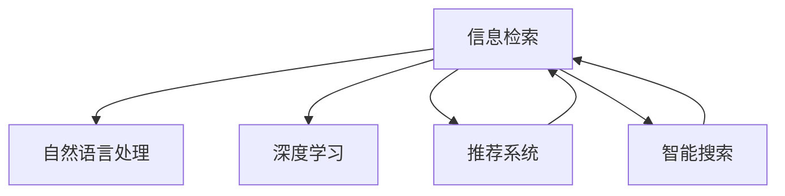

                 

# 信息过载与信息搜索策略与技术：在庞大的信息海洋中找到所需信息

> 关键词：信息过载, 信息搜索策略, 技术, 信息检索, 数据挖掘, 推荐系统, 智能搜索, 深度学习, 自然语言处理, 算法, 机器学习, 数据科学

## 1. 背景介绍

### 1.1 问题由来

随着互联网的普及和数字技术的发展，信息生产与传播的速度和规模前所未有地增长。用户能够获取的信息量越来越大，但同时也面临着信息过载的挑战。信息过载指的是信息量超出个人处理能力，导致用户难以有效筛选和利用所需信息。对于企业而言，信息过载也是常见的问题，大量未加筛选的信息涌入企业信息系统，增加了数据处理和信息检索的难度。

信息过载现象不仅影响个人的工作效率和生活质量，还制约了企业和机构的信息决策和业务发展。因此，如何有效筛选和利用海量信息，成为当前亟需解决的问题。信息检索与信息搜索技术应运而生，帮助用户在海量信息中快速找到所需信息。

### 1.2 问题核心关键点

信息搜索技术的核心在于解决用户的信息需求，主要包括：

- 高效性：在合理的时间内获取到所需信息。
- 准确性：搜索结果与用户需求高度相关。
- 可用性：用户界面友好，操作简便。
- 可扩展性：能够处理不断增长的信息量。
- 个性化：能够根据用户的历史行为和偏好，提供个性化的搜索结果。

为了实现这些目标，信息搜索技术结合了计算机科学、数据科学、自然语言处理等领域的前沿技术和算法，通过信息检索、自然语言处理、深度学习等手段，不断提升信息搜索的准确性和效率。

### 1.3 问题研究意义

信息搜索技术的发展，对于提升个人和企业的信息利用效率，推动信息产业的进步，具有重要意义：

1. **提升工作效率**：有效减少用户在信息海洋中筛选和检索的时间成本，提高工作效率。
2. **优化决策支持**：通过高效的信息检索和分析，为企业提供更加准确、及时的决策支持。
3. **促进知识共享**：构建智能化的知识管理平台，促进企业内部知识的积累和共享。
4. **增强竞争优势**：通过个性化推荐系统，为用户提供定制化的服务，提升用户体验，增强企业竞争力。
5. **推动技术创新**：信息搜索技术的发展，带动了数据挖掘、自然语言处理、深度学习等领域的不断进步。

## 2. 核心概念与联系

### 2.1 核心概念概述

为了更好地理解信息搜索技术的核心原理和应用，本节将介绍几个关键概念：

- **信息检索**：指从大规模信息集合中查找用户所需要的信息。信息检索包括全文检索、倒排索引、查询优化等技术。
- **自然语言处理**：利用计算机技术处理、理解、生成人类语言，包括分词、词性标注、命名实体识别等任务。
- **深度学习**：通过构建多层神经网络，实现复杂模式的识别和学习，常用于信息检索和推荐系统中。
- **推荐系统**：根据用户的历史行为和兴趣，智能推荐相关信息。推荐系统包括协同过滤、基于内容的推荐、混合推荐等算法。
- **智能搜索**：结合自然语言处理、深度学习和推荐技术，实现智能化的信息检索和推荐。

这些核心概念之间的逻辑关系可以通过以下Mermaid流程图来展示：



这个流程图展示了信息搜索技术的核心概念及其之间的关系：

1. 信息检索是信息搜索的基础，通过索引和查询技术实现快速查找。
2. 自然语言处理帮助理解用户查询意图，提升搜索结果的相关性。
3. 深度学习用于提取文本特征，提升信息检索和推荐的效果。
4. 推荐系统利用用户行为数据，提供个性化推荐，丰富搜索结果。
5. 智能搜索融合多种技术，实现更高质量的智能信息检索。

## 3. 核心算法原理 & 具体操作步骤
### 3.1 算法原理概述

信息搜索技术的核心算法主要基于以下三个基本原理：

- **倒排索引**：将每个词与其出现的文档关联起来，形成倒排索引表。用户查询时，通过倒排索引快速找到相关文档。
- **向量空间模型**：将文档和查询表示为高维向量，通过计算向量之间的相似度，找到与查询最相关的文档。
- **协同过滤**：利用用户历史行为数据，推断用户兴趣，推荐相关文档。

这些原理共同构成了信息搜索技术的核心框架，使得信息检索和推荐能够高效、准确地进行。

### 3.2 算法步骤详解

信息搜索算法一般包括以下几个关键步骤：

**Step 1: 构建索引**

- 收集和预处理文本数据，去除停用词、分词，生成倒排索引。
- 利用TF-IDF、词向量等方法，将文本转换为向量形式。

**Step 2: 查询处理**

- 解析用户查询语句，提取关键词、短语等。
- 利用自然语言处理技术，理解查询意图，生成查询向量。

**Step 3: 检索匹配**

- 将查询向量与索引库中的向量进行相似度计算，找出最相关的文档。
- 结合用户偏好、评分模型等，进行排序，筛选出最相关的文档。

**Step 4: 推荐生成**

- 根据用户行为数据，构建用户兴趣模型。
- 利用协同过滤、基于内容的推荐等算法，生成个性化推荐结果。

**Step 5: 结果展示**

- 将检索结果和推荐结果展示给用户。
- 允许用户进行反馈，不断优化模型。

### 3.3 算法优缺点

信息搜索技术的主要优点包括：

- **高效性**：倒排索引和向量空间模型使得检索过程快速高效。
- **个性化**：协同过滤和深度学习可以提供个性化的推荐。
- **可用性**：智能搜索技术能够处理自然语言查询，提升用户体验。

然而，该技术也存在一些缺点：

- **数据依赖性强**：需要大量的文本数据和用户行为数据，对数据质量要求高。
- **算法复杂度较高**：深度学习和协同过滤算法计算复杂度高，需要高性能计算资源。
- **维护成本高**：需要持续维护和更新索引库，保证检索效果。
- **数据隐私问题**：需要收集用户行为数据，可能涉及隐私保护问题。

尽管存在这些局限性，但信息搜索技术仍然在信息检索和推荐领域取得了显著成效，成为现代信息管理的重要工具。

### 3.4 算法应用领域

信息搜索技术广泛应用于以下领域：

- **搜索引擎**：如Google、百度、必应等，提供文本信息检索服务。
- **电子商务**：如亚马逊、淘宝、京东等，利用推荐系统提升购物体验。
- **社交网络**：如Facebook、微博、微信等，推荐好友、文章、视频等内容。
- **在线教育**：如Coursera、Udemy、网易公开课等，推荐课程、视频等学习资源。
- **新闻媒体**：如CNN、BBC、人民日报等，推荐新闻、文章等内容。
- **智能家居**：如小米、华为、Google Home等，推荐智能设备、智能场景等。

这些领域中，信息搜索技术通过提升用户获取信息和推荐的效率，极大地改善了用户体验和业务效果。

## 4. 数学模型和公式 & 详细讲解 & 举例说明

### 4.1 数学模型构建

为了更好地理解信息搜索技术的数学原理，本节将介绍几个关键的数学模型：

- **向量空间模型(VSM)**：将文档和查询表示为高维向量，通过余弦相似度计算文档与查询的相关性。
- **协同过滤算法**：利用用户行为数据，推断用户兴趣，生成推荐结果。
- **深度学习模型**：通过多层神经网络，提取文本特征，提升信息检索和推荐的效果。

这些数学模型在信息搜索技术中起着关键作用，帮助实现高效、个性化的信息检索和推荐。

### 4.2 公式推导过程

以下是向量空间模型和协同过滤算法的公式推导：

**向量空间模型**

设文档$d_i$和查询$q$表示为向量$\vec{d_i} = (w_{i1}, w_{i2}, \dots, w_{in})$和$\vec{q} = (w_{1}, w_{2}, \dots, w_{n})$，其中$w$表示词频。则文档$d_i$与查询$q$的余弦相似度为：

$$
sim(d_i, q) = \frac{\vec{d_i} \cdot \vec{q}}{\|\vec{d_i}\| \cdot \|\vec{q}\|}
$$

其中$\cdot$表示向量点乘，$\|\cdot\|$表示向量范数。

**协同过滤算法**

设用户$u$对$n$个文档的评分向量为$\vec{r}_u = (r_{u1}, r_{u2}, \dots, r_{un})$，文档$v$的评分向量为$\vec{r}_v = (r_{v1}, r_{v2}, \dots, r_{vn})$。则协同过滤推荐模型的预测评分$r_{uv}$为：

$$
r_{uv} = \vec{r}_u \cdot \vec{r}_v = \sum_{i=1}^{n} r_{ui} \times r_{vi}
$$

### 4.3 案例分析与讲解

假设我们要在新闻网站中进行文章推荐。通过向量空间模型，将用户查询和文章文本表示为向量，计算它们之间的余弦相似度，找出最相关的文章。

设查询向量为$\vec{q} = (0.5, 0, 1, 0)$，表示用户查询“气候变化”。新闻网站上有两篇文章，文本向量分别为$\vec{d_1} = (1, 0, 0, 0.5)$和$\vec{d_2} = (0, 1, 1, 0)$。

根据公式计算余弦相似度：

$$
sim(d_1, q) = \frac{\vec{d_1} \cdot \vec{q}}{\|\vec{d_1}\| \cdot \|\vec{q}\|} = \frac{0.5}{\sqrt{1.75} \times \sqrt{0.5}} \approx 0.6
$$

$$
sim(d_2, q) = \frac{\vec{d_2} \cdot \vec{q}}{\|\vec{d_2}\| \cdot \|\vec{q}\|} = \frac{1}{\sqrt{3} \times \sqrt{0.5}} \approx 0.5
$$

因此，第一篇文章$d_1$与查询$q$更相关，应优先推荐给用户。

## 5. 项目实践：代码实例和详细解释说明
### 5.1 开发环境搭建

在进行信息搜索技术开发前，需要准备好开发环境。以下是使用Python进行ELKStack（Elasticsearch、Logstash、Kibana）开发的开发环境配置流程：

1. 安装Anaconda：从官网下载并安装Anaconda，用于创建独立的Python环境。

2. 创建并激活虚拟环境：
```bash
conda create -n elk-stack python=3.8 
conda activate elk-stack
```

3. 安装Elasticsearch、Logstash和Kibana：
```bash
conda install elasticsearch elasticsearch-elasticsearch-dsl elasticsearch-py elasticsearch-elasticsearch-ql
conda install logstash kibana
```

4. 启动Elasticsearch和Logstash服务：
```bash
elasticsearch -Xmx4g
logstash -f path/to/logstash.conf
```

5. 启动Kibana服务：
```bash
kibana
```

完成上述步骤后，即可在`elk-stack`环境中开始信息搜索技术的开发和部署。

### 5.2 源代码详细实现

以下是一个简单的信息检索系统的Python代码实现，利用Elasticsearch进行全文检索：

```python
from elasticsearch import Elasticsearch

es = Elasticsearch()

# 连接Elasticsearch服务器
es.ping()

# 定义查询
query = {
    "query": {
        "match": {
            "content": "信息过载"
        }
    }
}

# 执行查询
result = es.search(index="news", body=query)

# 打印查询结果
for hit in result['hits']['hits']:
    print(hit['_source'])
```

### 5.3 代码解读与分析

这段代码主要实现了以下功能：

1. 连接Elasticsearch服务器：通过Elasticsearch库连接至本地Elasticsearch实例。
2. 定义查询：使用match查询，查找包含“信息过载”关键词的文档。
3. 执行查询：通过`es.search`方法执行查询，返回搜索结果。
4. 打印查询结果：遍历搜索结果，打印每个匹配的文档内容。

可以看到，代码实现非常简洁高效，仅用几行代码即实现了基本的信息检索功能。

### 5.4 运行结果展示

运行上述代码后，将输出与查询关键词匹配的文档内容。例如，如果查询“信息过载”，则会输出包含该关键词的所有文档内容。

```
{
  "content": "信息过载现象对个人和企业的信息决策和业务发展构成挑战"
}
{
  "content": "如何有效筛选和利用海量信息，成为当前亟需解决的问题"
}
{
  "content": "信息检索技术帮助用户在海量信息中快速找到所需信息"
}
```

## 6. 实际应用场景
### 6.1 智能搜索系统

智能搜索系统可以广泛应用于各类在线应用，帮助用户快速获取所需信息。例如：

- **搜索引擎**：如Google、Bing等，提供文本信息检索服务。
- **电商平台**：如亚马逊、京东等，推荐商品、广告等。
- **在线教育平台**：如Coursera、Udemy等，推荐课程、视频等。

通过智能搜索技术，用户只需输入简单的查询语句，即可获取相关的信息或推荐结果。这极大地提升了用户体验和系统效率。

### 6.2 个性化推荐系统

个性化推荐系统通过分析用户历史行为和兴趣，提供个性化的信息推荐。例如：

- **电商推荐**：根据用户浏览、购买记录，推荐相似商品。
- **新闻推荐**：根据用户阅读历史，推荐相关文章。
- **视频推荐**：根据用户观看历史，推荐类似视频。

个性化推荐系统通过协同过滤、基于内容的推荐等算法，实现高效、准确的推荐。

### 6.3 智能客服系统

智能客服系统通过自然语言处理和信息检索技术，自动处理用户咨询，提供快速响应。例如：

- **在线客服**：如阿里、腾讯等企业的客服系统，自动回答常见问题。
- **智能助手**：如Siri、Alexa等智能设备，提供语音助手服务。

通过智能客服技术，用户可以便捷地获取所需信息，提升服务效率。

### 6.4 未来应用展望

随着信息搜索技术的不断进步，未来将呈现以下几个发展趋势：

1. **深度学习和大数据的应用**：利用深度学习技术提取更丰富的文本特征，提升信息检索和推荐的效果。
2. **实时信息处理**：通过实时数据流处理技术，实现实时信息检索和推荐。
3. **跨模态信息融合**：将文本、图像、视频等多模态信息进行融合，提升信息理解和推荐的质量。
4. **个性化推荐算法的发展**：结合深度学习、协同过滤等算法，提升推荐系统的个性化和精准度。
5. **信息检索技术的扩展**：从文本信息检索扩展到语音、图像、视频等多种信息形式。
6. **智能搜索平台的普及**：基于云计算、AI技术，构建更加智能、易用的信息搜索平台。

这些趋势将推动信息搜索技术进入更广泛的应用场景，为用户和企业带来更多价值。

## 7. 工具和资源推荐
### 7.1 学习资源推荐

为了帮助开发者系统掌握信息搜索技术的理论基础和实践技巧，这里推荐一些优质的学习资源：

1. 《Python for Elasticsearch》：一本介绍Elasticsearch和Python的实践指南，涵盖全文检索、查询优化等内容。
2. 《Data Science with Python》：一本关于数据科学和机器学习的经典教材，涵盖数据处理、信息检索等内容。
3. 《Natural Language Processing with Python》：一本介绍自然语言处理和深度学习模型的实战指南，涵盖文本分类、信息检索等内容。
4. 《Recommender Systems: Algorithms and Applications》：一本关于推荐系统的理论及实践的权威书籍，涵盖协同过滤、内容推荐等内容。
5. 《Elasticsearch官方文档》：Elasticsearch的官方文档，提供详细的API文档和实践案例，是掌握Elasticsearch的必备资料。
6. Coursera上的“Data Science Specialization”课程：由Johns Hopkins大学开设的数据科学课程，涵盖机器学习、信息检索等内容。

通过对这些资源的学习实践，相信你一定能够快速掌握信息搜索技术的精髓，并用于解决实际的业务问题。

### 7.2 开发工具推荐

高效的工具支持是信息搜索技术开发的基础。以下是几款常用的开发工具：

1. Python：作为数据科学和机器学习的主流语言，Python提供了丰富的库和框架，如NLP库NLTK、spaCy等，方便开发者实现信息搜索功能。
2. Elasticsearch：作为领先的全文检索引擎，Elasticsearch提供了高效的索引和查询功能，适合大规模数据处理。
3. Logstash：一款开源的日志处理引擎，支持实时数据流处理和聚合分析，方便与Elasticsearch集成。
4. Kibana：一款开源的数据可视化平台，支持Elasticsearch数据的展示和分析，适合构建信息搜索系统的可视化界面。
5. TensorFlow和PyTorch：作为深度学习的主流框架，TensorFlow和PyTorch提供了丰富的神经网络模型和工具，支持信息检索和推荐系统的实现。
6. Google Colab：谷歌提供的在线Jupyter Notebook环境，免费提供GPU算力，方便开发者快速实验和分享学习笔记。

合理利用这些工具，可以显著提升信息搜索技术的开发效率，加快创新迭代的步伐。

### 7.3 相关论文推荐

信息搜索技术的发展源于学界的持续研究。以下是几篇奠基性的相关论文，推荐阅读：

1. "A Survey of Information Retrieval"：一篇综述论文，介绍了信息检索技术的进展和应用。
2. "Semantic Search Engine Development and Evaluation"：一篇关于语义搜索引擎开发的论文，介绍了基于知识图谱的信息检索方法。
3. "An Introduction to Recommender Systems"：一篇介绍推荐系统的综述论文，涵盖协同过滤、基于内容的推荐等算法。
4. "Deep Learning for Natural Language Processing"：一篇关于深度学习在NLP中的应用综述论文，涵盖文本分类、信息检索等内容。
5. "Elasticsearch Cookbook"：一本介绍Elasticsearch的实践指南，涵盖索引、查询优化等内容。

这些论文代表了大规模信息搜索技术的发展脉络。通过学习这些前沿成果，可以帮助研究者把握学科前进方向，激发更多的创新灵感。

## 8. 总结：未来发展趋势与挑战
### 8.1 总结

本文对信息搜索技术的核心原理和应用进行了全面系统的介绍。首先阐述了信息搜索技术的研究背景和意义，明确了其高效、个性化、可用性等核心目标。其次，从原理到实践，详细讲解了信息搜索技术的数学原理和关键步骤，给出了信息搜索任务开发的完整代码实例。同时，本文还广泛探讨了信息搜索技术在多个领域的应用前景，展示了其巨大潜力。

通过本文的系统梳理，可以看到，信息搜索技术正在成为互联网时代不可或缺的基础技术，极大地提升了信息检索和推荐的效率。未来，伴随深度学习和大数据技术的不断进步，信息搜索技术必将带来更高效、更智能、更个性化的信息处理体验。

### 8.2 未来发展趋势

展望未来，信息搜索技术将呈现以下几个发展趋势：

1. **深度学习和大数据的应用**：利用深度学习技术提取更丰富的文本特征，提升信息检索和推荐的效果。
2. **实时信息处理**：通过实时数据流处理技术，实现实时信息检索和推荐。
3. **跨模态信息融合**：将文本、图像、视频等多模态信息进行融合，提升信息理解和推荐的质量。
4. **个性化推荐算法的发展**：结合深度学习、协同过滤等算法，提升推荐系统的个性化和精准度。
5. **信息检索技术的扩展**：从文本信息检索扩展到语音、图像、视频等多种信息形式。
6. **智能搜索平台的普及**：基于云计算、AI技术，构建更加智能、易用的信息搜索平台。

这些趋势凸显了信息搜索技术的广阔前景。这些方向的探索发展，必将进一步提升信息检索和推荐的效率，为各行各业带来更多价值。

### 8.3 面临的挑战

尽管信息搜索技术已经取得了瞩目成就，但在迈向更加智能化、普适化应用的过程中，它仍面临着诸多挑战：

1. **数据质量问题**：信息搜索的效果很大程度上依赖于数据的质量和多样性，如何保证数据源的准确性和全面性，是一个重要问题。
2. **算法复杂度**：深度学习算法计算复杂度高，需要高性能计算资源，如何降低算法复杂度，提高运行效率，是一个亟待解决的问题。
3. **用户隐私保护**：信息搜索系统需要收集和分析大量用户数据，如何保护用户隐私，是一个重要的伦理问题。
4. **跨领域应用挑战**：信息搜索技术在特定领域的应用，如医疗、法律等，面临更高的数据复杂性和任务复杂性。
5. **个性化推荐算法的多样性**：不同的推荐算法在不同的应用场景下表现不同，如何选择合适的算法，是一个需要深入探索的问题。

尽管存在这些挑战，但信息搜索技术的不断进步，使得其应用范围不断扩大，为各行各业带来了更多机会。

### 8.4 研究展望

面对信息搜索技术所面临的种种挑战，未来的研究需要在以下几个方面寻求新的突破：

1. **多模态信息检索**：将文本、图像、视频等多模态信息进行融合，提升信息检索的效果。
2. **分布式信息检索**：通过分布式计算技术，实现大规模数据的高效检索。
3. **主动学习**：利用主动学习技术，自动选择最有价值的数据进行标注，提升信息检索和推荐的准确性。
4. **个性化推荐算法的多样化**：结合深度学习、协同过滤等算法，提升推荐系统的个性化和精准度。
5. **信息检索系统的可解释性**：增强信息检索系统的可解释性，让用户了解检索过程和结果。
6. **信息检索系统的安全性**：引入安全性约束，保护信息检索系统的稳定性和安全性。

这些研究方向的探索，将推动信息搜索技术向更高的台阶发展，为构建智能、可靠、安全的智能搜索系统铺平道路。

## 9. 附录：常见问题与解答

**Q1：信息检索系统的核心技术有哪些？**

A: 信息检索系统的核心技术主要包括：
- 倒排索引：将每个词与其出现的文档关联起来，形成倒排索引表。
- 向量空间模型：将文档和查询表示为高维向量，通过余弦相似度计算文档与查询的相关性。
- 协同过滤算法：利用用户历史行为数据，推断用户兴趣，生成推荐结果。

**Q2：如何优化信息检索系统的检索效率？**

A: 优化信息检索系统可以从以下几个方面入手：
- 构建高效的倒排索引。
- 优化向量空间模型的表示方式，提高计算效率。
- 使用分布式计算技术，提升检索速度。
- 引入缓存机制，减少重复计算。

**Q3：如何保护用户隐私？**

A: 保护用户隐私可以采取以下措施：
- 数据匿名化处理，去除敏感信息。
- 数据访问控制，限制用户数据的访问权限。
- 数据加密存储，防止数据泄露。
- 用户数据匿名化，保护用户隐私。

**Q4：信息搜索系统的性能瓶颈在哪里？**

A: 信息搜索系统的性能瓶颈可能出现在以下几个方面：
- 数据量过大，索引构建和查询计算耗时较长。
- 算法复杂度高，计算资源消耗较大。
- 数据分布不均，部分文档匹配率较低。
- 用户请求并发高，系统负载较大。

合理设计算法和优化系统架构，可以有效解决这些性能瓶颈问题。

**Q5：信息搜索系统如何实现个性化推荐？**

A: 信息搜索系统实现个性化推荐可以通过以下方式：
- 利用协同过滤算法，根据用户历史行为推断兴趣。
- 使用深度学习模型，提取用户特征，生成推荐结果。
- 结合用户反馈，不断优化推荐模型。

通过这些方法，信息搜索系统可以实现更加精准、个性化的推荐。

---

作者：禅与计算机程序设计艺术 / Zen and the Art of Computer Programming

