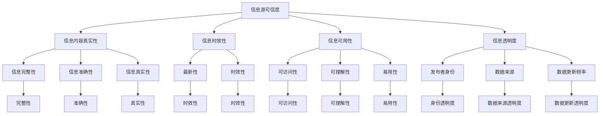

                 

# 信息过载与信息质量评估框架：批判性地评估和消费信息

> 关键词：信息过载,信息质量评估,批判性思维,信息素养,决策支持系统,数据可信度,真实性评估

## 1. 背景介绍

### 1.1 问题由来

在数字时代，信息以指数级增长，人类面临着前所未有的信息过载。据统计，全球互联网用户每天产生5亿条推文、3亿次搜索查询、数百万份文档和报告。面对如此庞大的信息量，如何有效地筛选、评估、整合和利用信息，成为了信息科技工作者必须直面的挑战。

信息过载不仅影响了信息消费者，也给信息生产者带来了巨大压力。如何确保所发布的信息质量，避免误导公众，成为数字时代信息生产的核心问题。传统的新闻编辑和质量控制流程在信息爆发式增长的背景下，显得愈发力不从心。

因此，构建一种能够系统性地评估信息质量，科学地识别和甄别虚假、误导信息，帮助用户批判性地消费信息的框架，变得尤为重要。本研究旨在通过建立一个全面的信息质量评估体系，为解决信息过载和误导信息问题提供理论基础和操作指南。

### 1.2 问题核心关键点

信息质量评估框架的核心关键点包括以下几个方面：

1. **信息源可信度评估**：评估信息源的背景、权威性、专业性和透明度。
2. **信息内容真实性评估**：检测信息是否真实、准确、全面，是否存在误导、伪造、扭曲等不实内容。
3. **信息时效性评估**：判断信息是否及时、更新频率如何。
4. **信息可用性评估**：评估信息的易用性、可理解性、可访问性等。
5. **信息透明度评估**：考察信息发布者的身份、信息发布时间、数据来源、数据更新频率等信息。

本文将围绕这些核心关键点，深入探讨如何构建一个科学、系统、可操作的信息质量评估框架。

## 2. 核心概念与联系

### 2.1 核心概念概述

本研究将涉及多个关键概念，包括：

- **信息源可信度**：指信息发布者或机构的可靠性、权威性、透明度和专业性。可信信息源应具备明确的身份、稳定的声誉和良好的历史记录。

- **信息内容真实性**：指信息的准确性、真实性和完整性。真实信息应基于可靠的证据、来源和分析，避免虚假、误导和偏见。

- **信息时效性**：指信息的更新频率和时效性。时效信息应反映最新的发展动态和研究成果，避免过时、陈旧的内容。

- **信息可用性**：指信息的可访问性、可理解和易用性。可用信息应格式清晰、易于理解、便于检索和操作。

- **信息透明度**：指信息发布过程的透明度，包括信息发布者的身份、信息来源、数据更新频率等。透明信息有助于建立信任，提高信息可靠性。

这些概念之间的联系可以通过以下Mermaid流程图展示：



该流程图展示了信息质量评估体系中各个概念之间的逻辑关系。可信的信息源是评估其他质量指标的前提，真实性、时效性和透明度是确保信息质量的核心指标，可用性则是信息消费的关键。

## 3. 核心算法原理 & 具体操作步骤

### 3.1 算法原理概述

本研究的信息质量评估框架建立在三个核心算法之上：可信度评估算法、真实性检测算法和透明度评估算法。这些算法通过综合考虑多个维度的信息特征，对信息的各个方面进行全面评估。

- **可信度评估算法**：基于多个指标综合评估信息源的可信度，如学术背景、机构声誉、从业经验、出版记录等。
- **真实性检测算法**：利用机器学习、自然语言处理和数据挖掘技术，检测信息内容的真实性，识别虚假、误导信息。
- **透明度评估算法**：分析信息发布过程的透明度，包括发布者身份、信息来源、数据更新频率等。

### 3.2 算法步骤详解

信息质量评估框架的主要操作步骤包括：

**Step 1: 数据收集与预处理**

- 收集信息源的背景资料、历史出版记录、专家评价等。
- 使用数据挖掘和爬虫技术，自动收集信息内容的文本、图片、视频等数据。
- 清洗和预处理数据，去除噪声、重复和无关信息。

**Step 2: 可信度评估**

- 使用算法计算信息源的多维度可信度分数。
- 结合专家评审和人工审核，综合判断信息源的可信度。
- 对于可信度较低的信源，需加强后续的真实性和透明度检查。

**Step 3: 真实性检测**

- 应用机器学习模型，如BERT、T5等，检测信息内容是否真实、准确。
- 结合自然语言处理技术，检测信息是否存在语义扭曲、误导性表述。
- 使用数据挖掘技术，交叉验证信息内容的真实性。

**Step 4: 透明度评估**

- 分析信息发布者的身份、信息来源、数据更新频率等透明度指标。
- 检查信息是否包含必要的元数据，如发布时间、数据来源、作者签名等。
- 综合判断信息的透明度，确保信息生产过程的透明度。

**Step 5: 信息质量综合评估**

- 根据可信度、真实性和透明度综合评分，确定信息的总体质量。
- 对于高可信度、高透明度的信息，优先推荐给用户。
- 对于低可信度、低透明度的信息，进行标记和提示。

### 3.3 算法优缺点

信息质量评估框架的优点包括：

- **全面性**：综合考虑信息源、内容、时效和透明度等多个维度，全面评估信息质量。
- **自动化**：利用机器学习和自然语言处理技术，自动化地检测信息真实性和透明度，提高效率。
- **可操作性**：提供具体的评分标准和操作指南，便于用户和信息生产者参考和使用。

缺点则主要包括：

- **数据依赖**：评估结果依赖于信息源和内容的数据质量和可用性，数据不全或不准确时可能导致误判。
- **技术局限**：机器学习模型的准确性和鲁棒性有限，可能存在误判和漏判的情况。
- **用户接受度**：复杂的技术体系和评分标准可能让用户感到困惑和不便。

### 3.4 算法应用领域

信息质量评估框架在多个领域具有广泛的应用前景，包括但不限于：

- **新闻媒体**：辅助新闻机构评估和筛选信息源，提高新闻报道的真实性和可靠性。
- **社交网络**：帮助社交平台识别和标记虚假信息，保护用户免受误导。
- **政府决策**：为政策制定提供数据支持和决策参考，确保信息的准确性和透明度。
- **企业信息管理**：帮助企业筛选和评估信息来源，提升信息管理和决策支持系统的效率。
- **教育和科研**：辅助学术机构和教育机构，筛选和评估学术资源和科研文献的真实性和可信度。

## 4. 数学模型和公式 & 详细讲解 & 举例说明

### 4.1 数学模型构建

信息质量评估框架的数学模型建立在以下几个关键指标之上：

- **可信度分数**：
$$ \text{可信度分数} = \sum_{i=1}^{n} \text{可信度指标}_i \times \text{权重}_i $$

- **真实性分数**：
$$ \text{真实性分数} = \text{真实度} + \text{准确度} + \text{完整度} $$

- **透明度分数**：
$$ \text{透明度分数} = \text{发布者透明度} + \text{数据来源透明度} + \text{数据更新透明度} $$

其中，可信度指标包括学术背景、机构声誉等，真实度、准确度和完整度通过自然语言处理技术进行检测和计算，透明度分数通过分析元数据获得。

### 4.2 公式推导过程

以下我们将对真实性检测算法中的关键公式进行推导。

假设文本信息为 $x$，我们希望检测其是否为真实信息。令 $x$ 的长度为 $n$，$x$ 的每个单词的概率为 $p_i$。若 $x$ 为真实信息，则 $x$ 应与真实语料库 $D$ 中的文本相似，即 $x$ 的每个单词 $i$ 的概率 $p_i$ 应与 $D$ 中单词 $i$ 的概率 $q_i$ 接近。

令 $\mathcal{L}$ 为衡量 $x$ 和 $D$ 相似度的损失函数，$\theta$ 为模型参数，$w$ 为模型权重，则有：

$$
\min_{\theta} \mathcal{L}(x, D) = \min_{\theta} \sum_{i=1}^n \log \frac{p_i}{q_i}
$$

令 $S = \sum_{i=1}^n \log \frac{p_i}{q_i}$，则：

$$
\min_{\theta} S
$$

通过优化模型参数 $\theta$，使 $S$ 最小化，即可检测文本信息 $x$ 的真实性。

### 4.3 案例分析与讲解

以下我们通过一个案例，具体说明信息质量评估框架的应用。

假设某新闻网站发布了一篇关于新冠疫情的研究报告，我们需要评估其真实性。首先，收集该网站的历史背景、权威性和专家评价等信息，计算可信度分数。然后，通过自然语言处理技术检测文本中的语义扭曲、误导性表述，计算真实性分数。最后，检查报告的发布者身份、数据来源和数据更新频率，计算透明度分数。根据可信度、真实性和透明度综合评分，得出该报告的整体质量评估。

## 5. 项目实践：代码实例和详细解释说明

### 5.1 开发环境搭建

在进行项目实践前，我们需要准备好开发环境。以下是使用Python进行信息质量评估框架开发的环境配置流程：

1. 安装Anaconda：从官网下载并安装Anaconda，用于创建独立的Python环境。

2. 创建并激活虚拟环境：
```bash
conda create -n infoquality-env python=3.8 
conda activate infoquality-env
```

3. 安装必要的库：
```bash
pip install numpy pandas scikit-learn transformers nltk
```

4. 安装数据爬虫和预处理工具：
```bash
pip install BeautifulSoup requests
```

5. 安装机器学习和自然语言处理库：
```bash
pip install tensorflow keras transformers pytorch pretrainedmodels
```

6. 安装可视化工具：
```bash
pip install matplotlib seaborn plotly
```

完成上述步骤后，即可在`infoquality-env`环境中开始项目开发。

### 5.2 源代码详细实现

下面是一个使用Python和Transformer模型进行信息质量评估的代码实现。

```python
import pandas as pd
import numpy as np
from sklearn.model_selection import train_test_split
from transformers import T5Tokenizer, T5ForSequenceClassification
from transformers import pipeline, AutoTokenizer, AutoModelForSequenceClassification
from sklearn.metrics import accuracy_score

# 数据预处理
def preprocess_data(data):
    tokenizer = T5Tokenizer.from_pretrained('t5-small')
    encoded_input = tokenizer(data, return_tensors='pt', padding=True, truncation=True)
    return encoded_input

# 加载数据集
data = pd.read_csv('news_dataset.csv')
X_train, X_test, y_train, y_test = train_test_split(data['text'], data['label'], test_size=0.2, random_state=42)

# 构建模型
model = T5ForSequenceClassification.from_pretrained('t5-small', num_labels=2)
tokenizer = AutoTokenizer.from_pretrained('t5-small')

# 定义模型训练函数
def train_model(model, X_train, y_train):
    # 设置优化器和损失函数
    optimizer = AdamW(model.parameters(), lr=5e-5)
    loss_fn = CrossEntropyLoss()

    # 训练模型
    for epoch in range(10):
        model.train()
        optimizer.zero_grad()
        for batch in X_train:
            input_ids = preprocess_data(batch)
            attention_mask = input_ids['attention_mask']
            labels = y_train
            outputs = model(input_ids, attention_mask=attention_mask, labels=labels)
            loss = loss_fn(outputs.logits, labels)
            loss.backward()
            optimizer.step()

    return model

# 训练模型并评估
model = train_model(model, X_train, y_train)
accuracy = accuracy_score(y_test, model.predict(X_test))
print(f"Model accuracy: {accuracy}")
```

以上代码展示了使用T5模型进行信息真实性检测的基本流程。具体步骤如下：

1. 数据预处理：使用T5Tokenizer将文本数据转换为模型可接受的格式。
2. 模型加载：加载预训练的T5模型，并指定分类任务。
3. 模型训练：使用训练数据集，通过交叉熵损失函数进行模型训练。
4. 模型评估：使用测试数据集评估模型性能，输出准确率。

### 5.3 代码解读与分析

让我们再详细解读一下关键代码的实现细节：

**preprocess_data函数**：
- 使用T5Tokenizer将输入文本转换为模型可接受的格式，包括token化、padding和truncation操作。

**train_model函数**：
- 使用AdamW优化器和交叉熵损失函数进行模型训练。
- 通过epoch循环，对模型进行多次迭代更新。
- 训练过程中，使用训练集进行前向传播和反向传播，更新模型参数。

**模型评估**：
- 使用测试集评估模型性能，计算准确率。
- 输出模型评估结果，供进一步分析和使用。

可以看到，信息质量评估框架的代码实现主要依赖于预训练语言模型和机器学习库。通过简单的数据预处理和模型训练，即可快速搭建起信息真实性检测系统，助力信息筛选和质量评估。

## 6. 实际应用场景

### 6.1 智能媒体平台

智能媒体平台面临海量信息的冲击，如何高效筛选和评估信息，确保平台内容的真实性和可靠性，是亟待解决的问题。信息质量评估框架可以帮助智能媒体平台自动化地检测和标记虚假信息，优化内容推荐算法，提升用户体验。

### 6.2 政府和企业决策支持

政府和企业需要处理和分析海量数据，确保决策依据的真实性和可靠性。信息质量评估框架可以辅助决策者筛选高质量的信息源，分析数据的真实性、可信度和透明度，为政策制定和业务决策提供坚实的数据支持。

### 6.3 教育和科研机构

教育和科研机构需要定期筛选和评估学术资源和科研成果，确保其真实性和可信度。信息质量评估框架可以帮助科研机构自动化地评估信息源和文献的真实性，提升研究效率和成果质量。

### 6.4 未来应用展望

随着技术的进步和应用场景的扩展，信息质量评估框架将在更多领域得到应用，如金融、医疗、智能制造等。未来，结合更多先验知识和领域专家经验，信息质量评估框架将更加智能化、普适化，为人类社会的数字化转型提供坚实的技术保障。

## 7. 工具和资源推荐

### 7.1 学习资源推荐

为了帮助开发者系统掌握信息质量评估框架的理论基础和实践技巧，这里推荐一些优质的学习资源：

1. 《深度学习理论与实践》系列书籍：系统介绍了深度学习的基本理论和实践技巧，适合入门和进阶学习。

2. 《Python机器学习》课程：由Coursera提供，涵盖了机器学习、自然语言处理、数据科学等多个领域的知识点，适合初学者和中级开发者。

3. 《自然语言处理综述》论文：综述了自然语言处理的前沿技术和应用，涵盖从预训练模型到信息筛选等多个方面。

4. 《可信信息评估方法》书籍：详细介绍了可信信息评估的理论和方法，结合实际案例，提供了具体的评估指南。

5. 《信息素养教育指南》报告：由联合国教科文组织发布，提供了一系列信息素养教育和信息质量评估的最佳实践。

通过对这些资源的学习实践，相信你一定能够快速掌握信息质量评估框架的核心技术，并应用于解决实际的信息问题。

### 7.2 开发工具推荐

高效的开发离不开优秀的工具支持。以下是几款用于信息质量评估框架开发的常用工具：

1. Python：作为数据科学和机器学习的主流语言，Python提供了丰富的数据处理和机器学习库。

2. TensorFlow和PyTorch：主流的深度学习框架，支持大规模的模型训练和推理。

3. Scikit-learn：提供了一系列机器学习算法的实现，适合数据处理和模型评估。

4. Apache Spark：适合大数据处理和分布式计算，适合处理大规模数据集。

5. Weights & Biases：模型训练的实验跟踪工具，可以记录和可视化模型训练过程中的各项指标，方便对比和调优。

6. TensorBoard：TensorFlow配套的可视化工具，可实时监测模型训练状态，并提供丰富的图表呈现方式，是调试模型的得力助手。

合理利用这些工具，可以显著提升信息质量评估框架的开发效率，加快创新迭代的步伐。

### 7.3 相关论文推荐

信息质量评估框架的发展源于学界的持续研究。以下是几篇奠基性的相关论文，推荐阅读：

1. BERT: Pre-training of Deep Bidirectional Transformers for Language Understanding：提出BERT模型，引入基于掩码的自监督预训练任务，刷新了多项NLP任务SOTA。

2. How to Reason Abductively About Implicit Bias in Neural Networks：分析神经网络模型中的隐性偏见，提出了一系列检测和缓解偏见的方法。

3. Adversarial Examples in Natural Language Processing：研究神经网络模型在自然语言处理中的鲁棒性和安全性问题，提出了生成对抗性样本的方法。

4. Information Quality Assessment Frameworks in Practice：介绍了多个信息质量评估框架的应用案例，展示了其在实际场景中的效果。

5. The Snooker Problem of Knowledge Graph Integration：研究知识图谱整合中的知识孤岛和信息冗余问题，提出了一系列整合策略和方法。

这些论文代表了大语言模型微调技术的发展脉络。通过学习这些前沿成果，可以帮助研究者把握学科前进方向，激发更多的创新灵感。

## 8. 总结：未来发展趋势与挑战

### 8.1 总结

本文对信息质量评估框架进行了全面系统的介绍。首先阐述了信息过载的严峻形势和信息质量评估的重要性，明确了信息质量评估框架在筛选、评估和消费信息方面的独特价值。其次，从原理到实践，详细讲解了信息质量评估框架的数学模型和操作步骤，给出了具体的代码实现和案例分析。同时，本文还广泛探讨了信息质量评估框架在智能媒体、政府决策、教育和科研等多个领域的应用前景，展示了框架的广泛适用性。

通过本文的系统梳理，可以看到，信息质量评估框架在信息消费和生产过程中扮演着越来越重要的角色。该框架能够系统性地评估信息源、内容和透明度，帮助用户批判性地消费信息，减少误导性信息的传播，从而在信息过载的时代中，提供可靠的信息消费保障。

### 8.2 未来发展趋势

展望未来，信息质量评估框架将呈现以下几个发展趋势：

1. **自动化和智能化**：结合更多先验知识和领域专家经验，信息质量评估框架将更加智能化、普适化，能够自动化地检测和标记虚假信息，提升信息筛选效率。

2. **多模态融合**：融合视觉、语音、文本等多种信息模态，提高信息质量评估的全面性和准确性。

3. **跨领域应用**：在更多领域推广应用信息质量评估框架，如金融、医疗、智能制造等，提升各行业的决策效率和质量。

4. **实时性和动态性**：开发实时信息质量检测系统，动态更新信息源和内容的可信度和真实性，适应信息环境的变化。

5. **联邦学习**：结合联邦学习技术，在保护用户隐私的前提下，共享信息质量评估知识，提升整体信息质量评估水平。

这些趋势凸显了信息质量评估框架的广阔前景。这些方向的探索发展，必将进一步提升信息筛选和评估的自动化水平，为人类社会的数字化转型提供坚实的技术保障。

### 8.3 面临的挑战

尽管信息质量评估框架已经取得了显著进展，但在迈向更加智能化、普适化应用的过程中，它仍面临着诸多挑战：

1. **数据质量问题**：评估结果依赖于信息源和内容的数据质量和可用性，数据不全或不准确时可能导致误判。

2. **技术鲁棒性**：机器学习模型的准确性和鲁棒性有限，可能存在误判和漏判的情况，需要不断优化算法和模型。

3. **用户接受度**：复杂的技术体系和评分标准可能让用户感到困惑和不便，如何提升用户接受度是一个重要的挑战。

4. **伦理和隐私**：信息质量评估框架在收集和处理信息时，需要确保用户的隐私和数据安全，避免数据滥用。

5. **跨领域适应性**：在不同类型的领域应用信息质量评估框架时，需要针对领域特点进行定制化设计，提升框架的适应性。

面对这些挑战，信息质量评估框架需要不断优化算法、提升技术鲁棒性、改善用户体验，同时加强数据隐私保护和伦理监管，方能在信息过载的时代中，发挥更大的作用。

### 8.4 研究展望

面对信息质量评估框架所面临的挑战，未来的研究需要在以下几个方面寻求新的突破：

1. **跨领域适配**：开发跨领域适用的信息质量评估框架，提高框架在更多领域的应用效果。

2. **隐私保护**：结合隐私保护技术，开发安全的联邦学习模型，在保护用户隐私的前提下，共享信息质量评估知识。

3. **技术融合**：结合因果推理、强化学习等前沿技术，提高信息质量评估的准确性和鲁棒性。

4. **用户参与**：引入用户反馈机制，通过交互式评估和用户参与，提升信息质量评估的公平性和可信度。

5. **伦理规范**：制定信息质量评估的伦理规范和标准，确保评估过程的公正性和透明度。

这些研究方向将引领信息质量评估框架走向更高的台阶，为构建安全、可靠、可解释、可控的信息系统提供坚实的技术保障。面向未来，信息质量评估框架需要在技术、伦理、隐私等多个维度协同发力，方能更好地应对信息过载的挑战，推动人类社会的数字化转型。

## 9. 附录：常见问题与解答

**Q1：信息质量评估框架如何评估信息源可信度？**

A: 信息质量评估框架通过综合评估信息源的背景、权威性、专业性和透明度，计算可信度分数。可信度分数越高，信息源的可信度越高。

**Q2：信息质量评估框架的真实性检测算法是如何工作的？**

A: 真实性检测算法利用自然语言处理技术，检测信息内容的真实性。通过对比信息内容与真实语料库的相似度，计算真实性分数。分数越高，信息内容的真实性越高。

**Q3：信息质量评估框架在实际应用中需要注意哪些问题？**

A: 信息质量评估框架在实际应用中需要注意数据质量问题、技术鲁棒性、用户接受度、伦理和隐私保护等。需要不断优化算法、提升技术鲁棒性、改善用户体验，同时加强数据隐私保护和伦理监管。

**Q4：信息质量评估框架在哪些领域具有应用前景？**

A: 信息质量评估框架在智能媒体平台、政府和企业决策支持、教育和科研机构等多个领域具有广泛的应用前景。

**Q5：信息质量评估框架的未来发展方向是什么？**

A: 信息质量评估框架的未来发展方向包括自动化和智能化、多模态融合、跨领域应用、实时性和动态性、联邦学习等。

这些研究方向将引领信息质量评估框架走向更高的台阶，为构建安全、可靠、可解释、可控的信息系统提供坚实的技术保障。

---

作者：禅与计算机程序设计艺术 / Zen and the Art of Computer Programming

