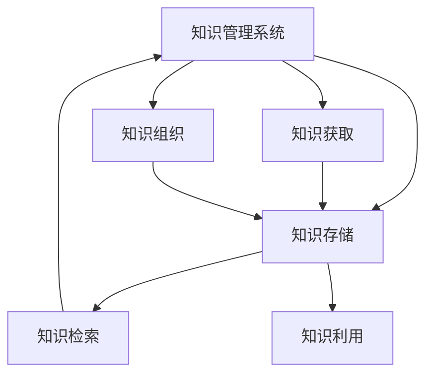

                 

## 1. 背景介绍

在现代信息社会，信息过载已成为一个普遍问题。海量的数据和信息以指数级速度增长，人类需要花费大量的时间和精力去筛选、整理和理解这些信息，以从中获取有价值的知识。然而，面对如此庞大的信息量，许多人在信息获取和处理上感到力不从心。

**1.1 问题由来**

过去，信息过载的问题往往局限于特定领域或行业，如研究者需要处理海量文献、企业需要管理庞大数据集等。但如今，随着互联网、社交媒体和移动设备的发展，信息过载问题已经渗透到日常生活的方方面面。无论是个人生活、工作还是学习，都面临着如何有效管理和利用海量信息的挑战。

**1.2 问题核心关键点**

信息过载的核心在于如何从海量信息中筛选出有价值的部分，并进行有效的组织和利用。具体来说，包括以下几个方面：

- **信息收集与获取**：如何高效地从各种来源收集相关信息。
- **信息整理与筛选**：如何对收集到的信息进行分类、筛选和排序。
- **信息存储与管理**：如何利用技术手段，如数据库、搜索引擎等，将信息进行高效存储和检索。
- **信息利用与反馈**：如何通过分析信息，生成有价值的洞见，并根据反馈调整信息获取策略。

解决这些问题，需要一套系统的方法和工具，这就是知识管理系统的核心。

## 2. 核心概念与联系

### 2.1 核心概念概述

**知识管理系统(Knowledge Management System, KMS)**：通过信息化手段，对企业、组织或个人拥有的显性知识和隐性知识进行采集、整理、存储、检索和应用，支持知识的创建、分享、协作和利用，以提高组织的知识创造能力、决策效率和创新能力。

**知识获取(Knowledge Acquisition)**：通过各种方式，将知识源中的知识转化为可以利用的信息的过程。常见方式包括信息采集、数据挖掘、文献整理等。

**知识组织(Knowledge Organization)**：对获取的知识进行分类、编码、关联和结构化，以提高知识检索和利用的效率。

**知识存储(Knowledge Storage)**：利用数据库、文档管理系统等技术手段，对结构化和非结构化知识进行长期保存，便于检索和重用。

**知识检索(Knowledge Retrieval)**：利用检索技术，快速定位所需知识的过程。常见检索方式包括全文检索、元搜索、问答系统等。

**知识利用(Knowledge Utilization)**：通过分析、利用知识，形成有价值的洞见和解决方案，支持决策和创新。

这些核心概念之间相互联系，共同构成了知识管理系统的基本框架。通过理解这些概念及其相互作用，可以更好地把握知识管理系统的工作原理和优化方向。

### 2.2 核心概念原理和架构的 Mermaid 流程图



这个流程图展示了知识管理系统的核心流程：

1. 知识获取：将外部的知识源转化为系统中的知识库。
2. 知识组织：对知识进行分类、编码和关联，提高检索效率。
3. 知识存储：利用技术手段，将知识进行长期保存。
4. 知识检索：快速定位所需知识。
5. 知识利用：通过分析知识，形成有价值的洞见，支持决策和创新。

以上流程形成一个闭环，保证了知识从收集、整理、存储到利用的全生命周期管理。

## 3. 核心算法原理 & 具体操作步骤

### 3.1 算法原理概述

知识管理系统的核心算法通常涉及以下几个关键环节：

- **文本挖掘**：利用自然语言处理(NLP)技术，从大量文本中提取有价值的信息，如实体、关系、主题等。
- **数据仓库**：构建一个集中存储数据、便于检索和分析的数据库，支持知识存储和管理。
- **搜索引擎**：利用搜索算法，对知识库进行快速检索和定位。
- **推荐系统**：根据用户行为和偏好，推荐相关知识资源，支持个性化学习和信息利用。
- **知识图谱**：构建知识节点和边组成的图谱，支持知识的关联和网络化存储。

这些算法共同作用，帮助用户从海量信息中快速获取和利用有价值的知识。

### 3.2 算法步骤详解

**Step 1: 知识获取与整理**

1. **信息采集**：通过API、爬虫等手段，从互联网、数据库、文献等渠道采集相关信息。
2. **数据清洗**：对采集到的数据进行去重、去噪、格式化处理，确保数据质量。
3. **实体识别**：利用NLP技术，识别出文本中的实体，如人名、地名、机构名等。
4. **关系抽取**：通过关系抽取算法，发现实体之间的关系，如组织关系、因果关系等。
5. **主题抽取**：利用文本挖掘技术，提取文本的主题，如市场分析、技术趋势等。

**Step 2: 知识存储与管理**

1. **知识分类**：将获取的知识按照预设的分类标准进行分类，如按领域、按重要性等。
2. **知识编码**：对分类后的知识进行编码，生成唯一标识符。
3. **元数据标注**：为知识添加元数据，如创建时间、来源、作者等。
4. **知识存储**：将编码后的知识存入数据库或文档管理系统，如Elasticsearch、MongoDB等。
5. **知识关联**：通过知识图谱等技术，将相关知识进行关联，形成知识网络。

**Step 3: 知识检索与利用**

1. **构建索引**：为知识库中的知识建立索引，支持快速检索。
2. **全文检索**：利用全文检索技术，根据关键字查询相关知识。
3. **元搜索**：利用元搜索技术，对多个知识库进行统一搜索。
4. **推荐系统**：根据用户行为和偏好，推荐相关知识资源，如知识推荐算法、协同过滤等。
5. **知识应用**：将知识应用于决策、创新、教学等场景，支持业务升级和价值创造。

### 3.3 算法优缺点

知识管理系统在提高信息利用效率、支持知识共享和协作方面具有显著优势，但同时也有一些局限性：

**优点**：

1. **高效性**：通过自动化手段，可以快速处理和整理海量信息。
2. **协作性**：支持多用户协同编辑和知识共享，提高团队效率。
3. **可扩展性**：可以随着需求的变化，灵活扩展和调整知识库。
4. **智能化**：利用AI技术，如机器学习、自然语言处理等，提升知识管理智能化水平。

**缺点**：

1. **依赖技术**：知识管理系统的建设依赖于先进的技术和工具。
2. **成本高**：系统建设、维护和升级需要较高的成本投入。
3. **数据安全**：知识管理系统存储了大量敏感信息，需要严格的数据安全措施。
4. **用户培训**：需要培训用户熟练使用系统，才能发挥其最大价值。

尽管有这些局限性，但知识管理系统在提升组织知识创造能力和决策效率方面，仍具有不可替代的优势。未来，随着技术的进步和应用的深入，这些问题有望得到逐步解决。

### 3.4 算法应用领域

知识管理系统在多个领域得到了广泛应用，例如：

- **企业知识管理**：通过构建企业知识库，支持业务决策、研发创新、培训教育等。
- **政府知识管理**：利用知识管理系统，支持政策制定、公共服务、数据共享等。
- **科研知识管理**：通过构建学术知识库，支持文献管理、研究协作、成果转化等。
- **教育知识管理**：利用知识管理系统，支持教学资源管理、学习路径规划、个性化推荐等。

这些应用场景展示了知识管理系统的广泛适用性，为各行业带来了显著的效益提升。

## 4. 数学模型和公式 & 详细讲解 & 举例说明

### 4.1 数学模型构建

知识管理系统的数学模型通常包括以下几个关键部分：

1. **文本表示模型**：将文本转换为向量表示，支持文本挖掘和检索。
2. **推荐模型**：根据用户行为，预测用户可能感兴趣的知识资源。
3. **知识关联模型**：利用图论和网络科学方法，构建知识节点和边的关联图谱。

以下是一个基于协同过滤的推荐系统模型：

**用户-知识项评分矩阵**：$R \in \mathbb{R}^{U \times K}$，其中$U$为用户数，$K$为知识项数，$R_{ui}$表示用户$u$对知识项$k$的评分。

**用户画像向量**：$U_u \in \mathbb{R}^{K}$，表示用户$u$的知识兴趣偏好。

**知识项特征向量**：$I_k \in \mathbb{R}^{K}$，表示知识项$k$的属性特征。

**推荐模型**：$P_{uk} = \langle U_u, I_k \rangle$，其中$\langle \cdot, \cdot \rangle$为向量内积，$P_{uk}$为知识项$k$对用户$u$的推荐概率。

### 4.2 公式推导过程

**协同过滤推荐算法**：

1. **计算用户画像向量**：
$$U_u = \sum_{k \in K} R_{uk} I_k$$

2. **计算知识项特征向量**：
$$I_k = \sum_{u \in U} R_{uk} U_u$$

3. **计算推荐概率**：
$$P_{uk} = \frac{U_u \cdot I_k}{\sqrt{U_u^T \cdot U_u} \cdot \sqrt{I_k^T \cdot I_k}}$$

### 4.3 案例分析与讲解

以Google Scholar为例，其核心功能包括文献管理和学术搜索。Google Scholar利用文本挖掘和机器学习技术，对海量学术文献进行自动分类、摘要提取和关系抽取，构建了庞大的学术知识库。同时，利用协同过滤算法，根据用户历史阅读行为推荐相关文献，支持学术研究和新知发现。

## 5. 项目实践：代码实例和详细解释说明

### 5.1 开发环境搭建

**Step 1: 安装Python和相关库**

1. **安装Python**：从官网下载并安装Python，建议选择最新稳定版本。
2. **安装库**：安装常用的Python库，如pandas、numpy、scikit-learn、scipy等。

**Step 2: 搭建开发环境**

1. **创建虚拟环境**：使用`virtualenv`或`conda`创建虚拟环境，确保Python库隔离。
2. **安装相关依赖**：安装项目所需依赖库，如Flask、Elasticsearch、TensorFlow等。
3. **设置环境变量**：配置系统环境变量，确保程序能够访问数据库、API等资源。

### 5.2 源代码详细实现

**Step 1: 文本挖掘模块**

1. **数据采集**：通过API获取文献数据，使用Scrapy爬虫抓取网页。
2. **数据清洗**：使用pandas进行数据清洗和预处理。
3. **实体识别**：使用NLTK或SpaCy进行实体识别。
4. **关系抽取**：使用Stanford CoreNLP或SpaCy进行关系抽取。
5. **主题抽取**：使用LDA模型进行主题抽取。

**Step 2: 知识存储模块**

1. **数据导入**：将处理好的数据导入Elasticsearch。
2. **数据存储**：使用Flask搭建RESTful API，提供数据存储接口。
3. **数据索引**：为知识库建立索引，支持快速检索。

**Step 3: 推荐系统模块**

1. **用户画像**：根据用户行为，计算用户画像向量。
2. **知识项特征**：提取知识项的特征，计算特征向量。
3. **协同过滤**：使用TensorFlow实现协同过滤推荐算法。
4. **推荐接口**：搭建API，提供推荐服务接口。

### 5.3 代码解读与分析

**文本挖掘模块**：

```python
import pandas as pd
from nltk import word_tokenize
from spacy import displacy
from spacy.matcher import Matcher

def extract_entities(text):
    nlp = spacy.load("en_core_web_sm")
    doc = nlp(text)
    ent_spans = doc.ents
    ent_texts = [ent.text for ent in ent_spans]
    return ent_texts

def extract_relations(text):
    nlp = spacy.load("en_core_web_sm")
    doc = nlp(text)
    matcher = Matcher(nlp.vocab)
    patterns = [{'match': 'NE'}, {'match': 'PUNCT'}, {'root': 'ENT'}]
    matches = matcher(doc, patterns)
    rel_texts = [ent.text for ent in doc.ents]
    return rel_texts
```

**知识存储模块**：

```python
from flask import Flask, jsonify
from elasticsearch import Elasticsearch

app = Flask(__name__)

es = Elasticsearch([{'host': 'localhost', 'port': 9200}])

@app.route('/store', methods=['POST'])
def store_data():
    data = request.get_json()
    es.index(index='knowledge', body=data)
    return jsonify({'success': True}), 200

@app.route('/search', methods=['GET'])
def search_data():
    query = request.args.get('query')
    res = es.search(index='knowledge', body={'query': {'match': {'_text': query}}})
    return jsonify(res['hits']['hits'])
```

**推荐系统模块**：

```python
import numpy as np
import tensorflow as tf

def collaborative_filtering(data, user_idx, item_idx):
    user_ix = data[user_idx]
    item_ix = data[item_idx]
    user_u = np.mean(user_ix, axis=1)
    item_k = np.mean(item_ix, axis=0)
    dot_product = np.dot(user_u, item_k)
    cosine_sim = dot_product / (np.linalg.norm(user_u) * np.linalg.norm(item_k))
    return cosine_sim

def get_top_n(user_idx, item_idx, top_n=5):
    data = collaborative_filtering(data, user_idx, item_idx)
    top_items = np.argsort(data)[-top_n:]
    return top_items
```

### 5.4 运行结果展示

在搭建好开发环境后，可以运行代码，测试各个模块的功能。例如，对于文本挖掘模块，可以使用NLTK库对一段文本进行实体和关系抽取，然后利用Elasticsearch存储数据。对于知识存储模块，可以向API发送数据，并查询返回的结果。对于推荐系统模块，可以根据用户行为，调用API获取推荐结果。

## 6. 实际应用场景

### 6.1 企业知识管理

在企业内部，知识管理系统可以支持研发创新、业务决策、培训教育等多个场景。例如，构建企业内部知识库，存储员工日常文档、项目报告、产品规格等，支持员工检索、分享和协作。利用知识图谱技术，发现知识之间的关联和依赖关系，提升组织知识利用效率。

### 6.2 政府知识管理

政府部门可以通过知识管理系统，支持政策制定、公共服务、数据共享等。例如，构建政策数据库，存储各类法规、文件和案例，支持政策研究和新政策制定。利用全文检索和推荐系统，提高政策文件检索和利用效率。

### 6.3 科研知识管理

科研机构可以构建学术知识库，存储各类学术论文、报告和数据，支持文献管理和引用。利用文本挖掘和知识图谱技术，发现学术热点和趋势，支持科研合作和成果转化。

### 6.4 教育知识管理

教育机构可以利用知识管理系统，构建学习资源库，存储各类教材、视频、实验数据等，支持个性化学习路径规划和资源推荐。利用知识图谱和推荐系统，发现相关学习资源，提升教学质量和学生学习效果。

## 7. 工具和资源推荐

### 7.1 学习资源推荐

1. **《知识管理基础》书籍**：介绍知识管理的基本概念、技术和方法。
2. **Coursera《知识管理》课程**：由知名大学教授授课，系统学习知识管理理论和实践。
3. **Kaggle知识管理竞赛**：通过实际项目，锻炼数据处理和知识管理技能。
4. **知识管理系统工具**：如Microsoft SharePoint、IBM Watson Knowledge Center等，了解市场领先实践。

### 7.2 开发工具推荐

1. **Elasticsearch**：构建知识库和全文检索系统的首选工具。
2. **Flask**：轻量级的Web框架，支持快速搭建API。
3. **NLTK和SpaCy**：自然语言处理库，支持文本挖掘和实体识别。
4. **TensorFlow**：深度学习库，支持协同过滤等推荐算法。
5. **Docker和Kubernetes**：容器化部署工具，支持系统快速搭建和扩展。

### 7.3 相关论文推荐

1. **《知识管理：概念、方法与实践》**：学术论文集，介绍知识管理的研究进展和应用案例。
2. **《大规模知识图谱构建与知识发现》**：探讨知识图谱的构建方法和应用场景。
3. **《协同过滤推荐算法》**：详细介绍协同过滤算法的原理和实现方法。
4. **《基于语义的文本分类方法》**：研究语义文本分类的最新进展和实践。

## 8. 总结：未来发展趋势与挑战

### 8.1 总结

本文详细介绍了知识管理系统的基本概念、核心算法和具体实现，并结合实际应用场景进行了系统分析。通过学习本文，读者可以了解知识管理系统的构建原理、实现方法和应用实践，从而更好地应对信息过载问题，提升组织知识创造能力和决策效率。

### 8.2 未来发展趋势

**趋势一：智能化提升**：利用AI技术，如机器学习和自然语言处理，提升知识管理系统的智能化水平，支持更高效、更智能的知识获取和利用。

**趋势二：自动化优化**：通过自动化技术，如知识图谱自动构建、推荐系统自适应优化，提升知识管理系统的效率和效果。

**趋势三：跨领域应用**：知识管理系统的应用场景将进一步拓展，覆盖更多行业和领域，如医疗、教育、金融等。

**趋势四：隐私保护**：随着数据隐私保护意识的提升，知识管理系统将更加注重数据安全和隐私保护，确保知识共享和利用的安全性和合规性。

### 8.3 面临的挑战

**挑战一：数据质量**：知识管理系统的构建依赖于高质量的数据输入，如何获取和处理大规模高质数据，是一个重要挑战。

**挑战二：系统复杂性**：知识管理系统涉及多个组件和模块，如何设计合理的架构，保证系统稳定运行和扩展性，是一个复杂问题。

**挑战三：用户接受度**：知识管理系统需要用户参与和协作，如何设计用户友好的界面和功能，提高用户接受度和使用体验，是一个关键问题。

**挑战四：技术演进**：知识管理系统的构建涉及多种前沿技术，如何跟上技术演进，保持系统的前沿性和先进性，是一个持续挑战。

### 8.4 研究展望

未来，知识管理系统的研究将重点关注以下几个方面：

**研究一：多模态知识融合**：将文本、图像、视频等多种模态信息融合，提升知识管理系统的全面性和深度。

**研究二：知识图谱增强**：通过知识图谱技术，进一步增强知识之间的关联和网络化存储，提升知识利用效率。

**研究三：人工智能融合**：将人工智能技术，如深度学习、自然语言处理、知识图谱等，与知识管理系统深度融合，提升系统的智能化和自动化水平。

**研究四：隐私保护优化**：研究和开发更加安全、隐私保护的知识管理系统，保障用户数据和知识的安全性和隐私性。

通过这些研究方向的探索，知识管理系统的未来将更加智能化、高效化和个性化，为各行业带来更全面、更高效的知识管理和利用体验。

## 9. 附录：常见问题与解答

**Q1: 知识管理系统如何确保数据质量？**

A: 知识管理系统通过以下几个步骤确保数据质量：
1. 数据采集：采用多种数据采集方式，如API接口、Web爬虫等，确保数据来源广泛。
2. 数据清洗：使用数据清洗工具，如ETL工具、正则表达式等，去除无效、重复数据。
3. 数据验证：引入数据验证机制，如数据比对、逻辑校验等，确保数据准确性。

**Q2: 知识管理系统如何支持跨领域应用？**

A: 知识管理系统通过以下几个步骤支持跨领域应用：
1. 领域分析：对不同领域进行领域分析和建模，构建领域知识库。
2. 领域融合：利用知识图谱技术，将不同领域的知识进行融合和关联。
3. 领域适应：根据不同领域的特点，定制知识管理策略和功能。

**Q3: 知识管理系统如何提升用户接受度？**

A: 知识管理系统通过以下几个步骤提升用户接受度：
1. 用户培训：提供详细的使用手册和培训课程，帮助用户快速上手。
2. 界面设计：设计友好的用户界面，简化操作步骤，提升用户体验。
3. 反馈机制：建立用户反馈机制，及时收集用户意见和建议，不断优化系统功能。

**Q4: 知识管理系统如何保障数据安全？**

A: 知识管理系统通过以下几个步骤保障数据安全：
1. 数据加密：对敏感数据进行加密处理，防止数据泄露。
2. 权限控制：设置数据访问权限，确保只有授权用户才能访问敏感数据。
3. 审计日志：记录系统操作日志，追踪数据访问和使用情况，保障数据安全。

通过这些措施，知识管理系统可以确保数据质量、跨领域应用、用户接受度和数据安全，从而更好地服务于各行业知识管理的需求。

---

作者：禅与计算机程序设计艺术 / Zen and the Art of Computer Programming

