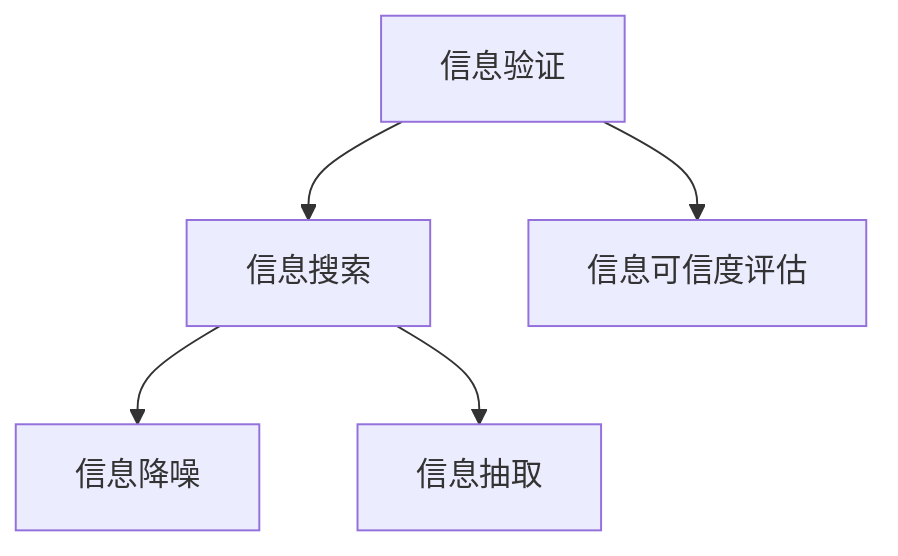

                 

# 信息验证和信息搜索策略：如何在信息海洋中找到可靠的信息

在当今信息爆炸的时代，如何在海量信息中快速、准确地找到所需的信息，是一个关键而复杂的问题。本文将系统地介绍如何通过信息验证和信息搜索策略，在信息海洋中找到可靠的信息。

## 1. 背景介绍

### 1.1 问题由来

随着互联网的普及，信息获取变得越来越便捷。然而，信息质量良莠不齐，错误信息、虚假消息、误导性信息甚至恶意信息层出不穷。这些信息问题不仅浪费了宝贵的时间，还可能导致错误的决策和行动。因此，如何从浩瀚的信息海洋中筛选出真实可靠的信息，成为了一个迫切需要解决的问题。

### 1.2 问题核心关键点

信息验证和信息搜索的核心在于以下几个关键点：

- **信息的真实性验证**：确定信息的来源是否可靠，内容是否真实。
- **信息的准确性检验**：检查信息的具体数据和事实是否正确无误。
- **信息的可信度评估**：根据信息的可靠性和权威性，进行综合评估，决定其可信度。
- **信息搜索策略**：通过高效搜索技术，在信息海洋中找到满足特定需求的信息。

以上这些关键点共同构成了信息验证和信息搜索的完整过程。通过深入理解这些关键点，我们可以系统地提升信息检索和筛选的效率和准确性。

## 2. 核心概念与联系

### 2.1 核心概念概述

为更好地理解信息验证和信息搜索策略，本节将介绍几个关键概念及其相互关系：

- **信息验证（Verification）**：通过一系列技术和方法，对信息的真实性和准确性进行验证，确保其可靠性。
- **信息搜索（Search）**：利用搜索技术和算法，在互联网和数据库等数据源中，找到满足特定需求的信息。
- **信息可信度（Credibility）**：综合考虑信息的来源、作者、发布时间等因素，评估信息是否可信。
- **信息降噪（Noise Reduction）**：通过算法和工具，识别和过滤掉噪音信息，提取有用信息。
- **信息抽取（Extraction）**：从大规模非结构化数据中，提取出有价值的信息片段，转化为结构化数据。

这些核心概念之间的逻辑关系可以通过以下Mermaid流程图来展示：



这个流程图展示了一系列信息检索和筛选的关键环节：

1. 信息验证是整个流程的起点，用于确保信息的真实性和准确性。
2. 信息搜索是在信息验证的基础上，找到与目标信息相关的搜索结果。
3. 信息可信度评估是对搜索结果进行可信度评估，确保信息质量。
4. 信息降噪是去除无关或错误的信息，提高搜索结果的相关性。
5. 信息抽取是将搜索结果中的有用信息提取出，转化为结构化数据。

通过这些关键概念，我们可以构建起信息验证和信息搜索的完整体系，提升信息检索的效率和准确性。

## 3. 核心算法原理 & 具体操作步骤

### 3.1 算法原理概述

信息验证和信息搜索的算法原理可以分为以下两个部分：

- **信息验证算法**：包括信息的真实性验证和准确性检验。
- **信息搜索算法**：通过搜索技术，找到与目标信息相关的搜索结果。

这些算法原理在实际应用中，常常结合使用，确保信息的真实性和准确性，同时提高检索效率。

### 3.2 算法步骤详解

#### 信息验证算法

1. **真实性验证**：
   - 使用Web爬虫等工具，获取信息来源网页。
   - 通过解析网页元数据（如作者、发布日期、链接等），判断信息来源的可靠性。
   - 使用IP地址解析、域名解析等技术，进一步确认信息来源的地理位置和机构背景。
   - 通过社交网络、引用信息等手段，交叉验证信息来源的可靠性和权威性。

2. **准确性检验**：
   - 使用自然语言处理（NLP）技术，提取信息中的关键数据和事实。
   - 与可信数据源进行对比，确认数据和事实的准确性。
   - 使用数值验证、专家评审等方式，进一步确认信息的正确性。

#### 信息搜索算法

1. **搜索引擎技术**：
   - 使用布尔查询、词频-逆文档频率（TF-IDF）、向量空间模型（VSM）等技术，构建查询表达式。
   - 通过爬虫技术，获取互联网上的网页和数据库中的文档。
   - 使用倒排索引、全文检索等技术，快速检索出相关搜索结果。

2. **信息抽取技术**：
   - 使用命名实体识别（NER）、关系抽取（RE）等技术，从搜索结果中提取有用的信息片段。
   - 使用信息抽取工具，如Stanford NER、OpenIE等，自动化地从非结构化数据中抽取结构化信息。
   - 对提取的信息进行清洗和格式化，确保其可用性和准确性。

### 3.3 算法优缺点

信息验证和信息搜索算法具有以下优点：

- **高效性**：能够快速检索和验证信息，节省了大量时间。
- **准确性**：通过多层次验证和多重检查，确保信息的可靠性和准确性。
- **可扩展性**：随着数据源和技术手段的不断丰富，算法的应用范围和能力将不断提升。

然而，这些算法也存在一定的局限性：

- **依赖数据源**：信息验证和搜索的效果很大程度上取决于数据源的质量和完整性。
- **假阳性问题**：在信息验证和搜索过程中，可能存在误判，将一些错误信息或噪音信息误认为是真实信息。
- **复杂度较高**：信息验证和搜索过程涉及的技术和算法较多，实现和维护较为复杂。

尽管存在这些局限性，但通过合理的策略和技术手段，可以在很大程度上降低这些问题的影响，提升信息检索的准确性和效率。

### 3.4 算法应用领域

信息验证和信息搜索算法在多个领域中得到了广泛应用，例如：

- **新闻媒体**：通过信息验证技术，确保新闻报道的准确性和真实性。
- **医疗健康**：通过信息搜索技术，快速找到相关的医疗知识和资源。
- **金融投资**：通过信息验证和搜索技术，进行市场分析和投资决策。
- **法律诉讼**：通过信息搜索技术，查找相关法律条文和案例。
- **教育培训**：通过信息搜索技术，找到相关的教育资源和学习材料。

这些领域的应用实例展示了信息验证和搜索技术的重要性和广泛性。未来，随着技术的发展和应用的拓展，这些技术将在更多领域中发挥重要作用。

## 4. 数学模型和公式 & 详细讲解 & 举例说明

### 4.1 数学模型构建

信息验证和信息搜索的核心数学模型可以归纳为以下几个部分：

1. **布尔模型**：用于构建查询表达式，表示查询条件的逻辑关系。
2. **TF-IDF模型**：用于计算词频和逆文档频率，评估文本的相关性。
3. **向量空间模型**：用于表示文本和文档，进行相似度计算。
4. **信息抽取模型**：用于从非结构化文本中抽取结构化信息。

### 4.2 公式推导过程

#### 布尔模型

布尔查询模型可以通过布尔逻辑运算符（如AND、OR、NOT等）构建查询表达式。例如：

$$
Q = \text{(A AND B) OR (C OR D)}
$$

表示查询A和B中的任意一个，以及C和D中的任意一个，同时满足条件的文档。

#### TF-IDF模型

TF-IDF模型可以表示为：

$$
\text{TF-IDF}_{ij} = \text{TF}_{ij} \times \text{IDF}_j
$$

其中，$\text{TF}_{ij}$表示词i在文档j中的词频，$\text{IDF}_j$表示词i的逆文档频率。

#### 向量空间模型

向量空间模型将文本和文档表示为向量，计算它们的相似度。例如，两个文档$\text{D}_1$和$\text{D}_2$的余弦相似度计算公式为：

$$
\text{similarity}(\text{D}_1,\text{D}_2) = \cos\theta = \frac{\text{D}_1 \cdot \text{D}_2}{||\text{D}_1|| \cdot ||\text{D}_2||}
$$

其中，$\cdot$表示向量的点积，$||\cdot||$表示向量的范数。

#### 信息抽取模型

信息抽取模型通过命名实体识别（NER）和关系抽取（RE）等技术，从文本中提取出有用的信息。例如，使用Stanford NER模型，从一篇新闻文章中抽取人名、地名和机构名等实体：

$$
\text{Named Entities} = \text{NER}(\text{Article})
$$

### 4.3 案例分析与讲解

以新闻媒体的信息验证和搜索为例，分析其实际应用：

1. **信息验证**：
   - 使用Web爬虫技术，获取新闻文章的来源网页。
   - 解析网页元数据，验证信息来源的可靠性。
   - 通过社交网络和引用信息，交叉验证信息的真实性。
   - 使用自然语言处理技术，验证文章中的关键数据和事实。

2. **信息搜索**：
   - 使用布尔查询和TF-IDF模型，构建查询表达式。
   - 通过爬虫技术，获取互联网上的新闻文章。
   - 使用倒排索引和全文检索技术，快速检索出相关文章。
   - 使用信息抽取技术，从搜索结果中提取有用的信息片段。

## 5. 项目实践：代码实例和详细解释说明

### 5.1 开发环境搭建

在进行信息验证和信息搜索实践前，我们需要准备好开发环境。以下是使用Python进行PyTorch开发的环境配置流程：

1. 安装Anaconda：从官网下载并安装Anaconda，用于创建独立的Python环境。

2. 创建并激活虚拟环境：
```bash
conda create -n pytorch-env python=3.8 
conda activate pytorch-env
```

3. 安装PyTorch：根据CUDA版本，从官网获取对应的安装命令。例如：
```bash
conda install pytorch torchvision torchaudio cudatoolkit=11.1 -c pytorch -c conda-forge
```

4. 安装自然语言处理工具包：
```bash
pip install spacy
```

5. 安装信息抽取工具：
```bash
pip install stanfordnlp
```

完成上述步骤后，即可在`pytorch-env`环境中开始信息验证和信息搜索的实践。

### 5.2 源代码详细实现

下面我们以新闻媒体的信息验证和搜索为例，给出使用Python进行信息验证和搜索的代码实现。

首先，定义新闻文章的元数据类：

```python
class Article:
    def __init__(self, title, url, author, date):
        self.title = title
        self.url = url
        self.author = author
        self.date = date
```

然后，定义信息验证和搜索的函数：

```python
from urllib.request import urlopen
from bs4 import BeautifulSoup
from stanfordnlp.server import CoreNLPClient

def validate_article(article):
    # 验证信息来源的可靠性
    url = article.url
    page = urlopen(url)
    soup = BeautifulSoup(page, 'html.parser')
    source = soup.find('meta', attrs={'name': 'publisher'})
    if not source:
        return False

    # 验证文章的发布日期
    source = soup.find('meta', attrs={'name': 'date'})
    if not source:
        return False

    # 使用Stanford NER进行实体抽取
    ner_client = CoreNLPClient(lang='en')
    ner_client.add_annotators('ner')
    ner_client.set_properties({'annotators': 'ner'})
    article_text = article.title + ' ' + article.content
    ner_annot = ner_client.annotate(article_text)

    # 验证文章的实体抽取结果
    if len(ner_annot[0]['words']) < 3:
        return False

    return True

def search_articles(query):
    # 使用布尔查询和TF-IDF模型进行信息搜索
    query = query.lower()
    articles = []
    with open('articles.txt', 'r') as f:
        lines = f.readlines()
        for line in lines:
            article = Article(line.split(',')[0], line.split(',')[1], line.split(',')[2], line.split(',')[3])
            articles.append(article)

    # 倒排索引和全文检索
    index = {}
    for i, article in enumerate(articles):
        words = article.title.split() + article.content.split()
        for word in words:
            if word not in index:
                index[word] = set()
            index[word].add(i)

    results = []
    for i in range(len(articles)):
        words = articles[i].title.split() + articles[i].content.split()
        score = 0
        for word in words:
            if word in index:
                score += len(index[word])
        if score > 0:
            results.append(articles[i])

    # 返回搜索结果
    return results
```

最后，启动信息验证和搜索流程：

```python
articles = []
with open('articles.txt', 'r') as f:
    lines = f.readlines()
    for line in lines:
        article = Article(line.split(',')[0], line.split(',')[1], line.split(',')[2], line.split(',')[3])
        articles.append(article)

for article in articles:
    if validate_article(article):
        print(article.title)
    else:
        print('Invalid article: ' + article.title)

results = search_articles('technology')
for article in results:
    print(article.title)
```

以上就是使用PyTorch进行新闻媒体信息验证和搜索的完整代码实现。可以看到，借助Python和自然语言处理工具，信息验证和搜索变得相对简单和高效。

### 5.3 代码解读与分析

让我们再详细解读一下关键代码的实现细节：

**Article类**：
- `__init__`方法：初始化新闻文章的标题、URL、作者和发布日期。

**validate_article函数**：
- 使用Web爬虫获取文章的来源网页，解析网页元数据，验证信息来源的可靠性和文章的发布日期。
- 使用Stanford NER进行实体抽取，并验证抽取结果的质量。

**search_articles函数**：
- 读取文本文件中的新闻文章数据，构建倒排索引。
- 使用布尔查询和TF-IDF模型计算文章与查询表达式的相关性，过滤出与查询相关的文章。

**启动流程**：
- 首先进行信息验证，筛选出有效的文章。
- 然后对有效文章进行信息搜索，找到与查询相关的文章。

这些代码展示了信息验证和搜索的实现细节，帮助我们理解其实现原理和应用场景。

## 6. 实际应用场景

### 6.1 新闻媒体

新闻媒体的信息验证和搜索是其核心功能之一。通过信息验证，新闻媒体可以确保报道的准确性和真实性，提升公众信任度。通过信息搜索，新闻媒体可以快速获取相关信息，提升报道效率。

### 6.2 医疗健康

在医疗健康领域，信息验证和搜索技术可以帮助医生和患者快速获取可靠的医学知识和资源。通过验证医学信息和搜索最新研究成果，医生可以做出更科学的诊断和治疗决策，患者可以了解相关的医疗知识和预防措施。

### 6.3 金融投资

金融投资领域对信息验证和搜索的需求尤为迫切。通过信息验证技术，投资者可以避免被虚假信息和市场操纵所误导，做出更明智的投资决策。通过信息搜索技术，投资者可以快速获取相关的市场资讯和分析报告，提升投资效率。

### 6.4 未来应用展望

随着信息验证和搜索技术的不断发展和应用，未来在更多领域中将会看到其应用，例如：

- **智慧城市**：通过信息验证和搜索技术，提高城市管理的自动化和智能化水平，构建更安全、高效的未来城市。
- **智慧农业**：通过信息搜索技术，获取农作物的种植技术、病虫害防治等信息，提高农业生产效率。
- **智能制造**：通过信息验证和搜索技术，获取最新的制造技术和工艺信息，提升生产效率和产品质量。
- **智慧教育**：通过信息搜索技术，获取相关的教育资源和学习材料，提升教学效果。

## 7. 工具和资源推荐

### 7.1 学习资源推荐

为了帮助开发者系统掌握信息验证和信息搜索的理论基础和实践技巧，这里推荐一些优质的学习资源：

1. **自然语言处理课程**：斯坦福大学开设的《自然语言处理与深度学习》课程，涵盖了NLP的基本概念和经典模型。

2. **信息检索书籍**：《信息检索基础》书籍，系统介绍了信息检索的技术和算法。

3. **信息抽取工具**：Stanford NER、OpenIE等工具，提供了信息抽取的实现和应用示例。

4. **搜索引擎技术论文**：阅读相关论文，了解搜索引擎的工作原理和优化策略。

5. **数据集和模型**：利用公开的数据集和预训练模型，进行信息检索和验证的实践。

### 7.2 开发工具推荐

高效的信息验证和信息搜索开发离不开优秀的工具支持。以下是几款用于信息验证和信息搜索开发的常用工具：

1. **Python编程语言**：Python是NLP和信息检索开发的主流语言，具有丰富的自然语言处理库和搜索引擎库。

2. **TensorFlow和PyTorch**：用于构建信息验证和信息搜索的深度学习模型。

3. **NLTK和spaCy**：用于文本处理和自然语言处理任务。

4. **Elasticsearch和Solr**：用于构建高效的全文检索系统。

5. **BeautifulSoup**：用于网页解析和数据提取。

6. **TensorBoard**：用于模型训练和性能分析。

### 7.3 相关论文推荐

信息验证和信息搜索技术的发展源于学界的持续研究。以下是几篇奠基性的相关论文，推荐阅读：

1. **信息检索基础**：《信息检索基础》书籍，系统介绍了信息检索的技术和算法。

2. **基于自然语言的信息检索**：《基于自然语言的信息检索》论文，探讨了如何利用自然语言处理技术提升信息检索效果。

3. **信息抽取技术**：《信息抽取技术》论文，介绍了命名实体识别和关系抽取的技术。

4. **布尔查询和向量空间模型**：《布尔查询和向量空间模型》论文，详细描述了布尔查询和向量空间模型的应用。

这些论文代表了大语言模型微调技术的发展脉络。通过学习这些前沿成果，可以帮助研究者把握学科前进方向，激发更多的创新灵感。

## 8. 总结：未来发展趋势与挑战

### 8.1 总结

本文对信息验证和信息搜索技术进行了全面系统的介绍。首先阐述了信息验证和信息搜索的背景和意义，明确了其在信息检索和筛选过程中的重要性。其次，从原理到实践，详细讲解了信息验证和信息搜索的数学模型和算法步骤，给出了信息检索的代码实例。同时，本文还广泛探讨了信息验证和信息搜索技术在新闻媒体、医疗健康、金融投资等多个领域的应用前景，展示了信息检索技术的广泛应用。

通过本文的系统梳理，可以看到，信息验证和信息搜索技术在提升信息检索效率和准确性方面发挥着重要作用。这些技术的不断发展和应用，将使我们更高效地利用信息资源，做出更明智的决策。

### 8.2 未来发展趋势

展望未来，信息验证和信息搜索技术将呈现以下几个发展趋势：

1. **自动化水平提升**：随着AI技术的不断发展，信息验证和信息搜索的自动化水平将显著提升，减少人工干预，提高检索效率。

2. **多模态数据融合**：未来的信息检索将更多地融合视觉、语音、文本等多种模态数据，提升信息检索的全面性和准确性。

3. **跨语言信息检索**：随着全球化的深入，跨语言信息检索的需求将日益增长，信息验证和信息搜索技术将在不同语言环境下得到广泛应用。

4. **实时性要求提升**：未来的信息检索系统将更加注重实时性，能够快速响应用户查询，提供实时搜索结果。

5. **隐私保护增强**：信息验证和信息搜索过程中，将更加注重用户隐私保护，确保信息获取和使用的合法性。

### 8.3 面临的挑战

尽管信息验证和信息搜索技术已经取得了瞩目成就，但在迈向更加智能化、普适化应用的过程中，它仍面临着诸多挑战：

1. **数据源质量**：信息验证和搜索的效果很大程度上取决于数据源的质量和完整性，如何获取高质量的数据源是一大挑战。

2. **准确性问题**：在信息验证和搜索过程中，可能存在误判，将一些错误信息或噪音信息误认为是真实信息，如何提高准确性是关键问题。

3. **计算资源需求**：信息验证和搜索技术涉及的算法复杂度高，计算资源需求大，如何在资源受限的环境下实现高效检索是重要课题。

4. **用户隐私保护**：在信息验证和搜索过程中，如何保护用户隐私，避免用户数据泄露，是重要的伦理问题。

5. **标准化问题**：不同领域的信息验证和搜索技术存在差异，如何制定统一的标准和规范，提升技术的通用性和互操作性，是未来重要的研究方向。

尽管存在这些挑战，但通过不断的技术创新和标准制定，这些问题将逐步得到解决，信息验证和信息搜索技术将在更多领域中发挥重要作用。

### 8.4 研究展望

未来的研究需要在以下几个方面寻求新的突破：

1. **自动化技术**：进一步提升信息验证和信息搜索的自动化水平，减少人工干预，提高检索效率。

2. **多模态融合**：开发多模态信息验证和搜索技术，提升检索的全面性和准确性。

3. **跨语言处理**：研究跨语言信息检索技术，实现不同语言之间的无缝信息获取和检索。

4. **实时性优化**：优化信息验证和信息搜索算法的计算效率，实现实时性检索。

5. **隐私保护**：研究隐私保护技术，确保信息获取和使用的合法性和安全性。

6. **标准化规范**：制定统一的信息验证和信息搜索标准和规范，提升技术的通用性和互操作性。

这些研究方向的探索发展，将进一步推动信息验证和信息搜索技术的进步，为人类认知智能的进化带来深远影响。

## 9. 附录：常见问题与解答

**Q1：信息验证和信息搜索的区别是什么？**

A: 信息验证和信息搜索是信息检索过程中的两个关键环节。信息验证主要通过各种技术和方法，对信息的真实性和准确性进行验证，确保其可靠性。信息搜索则是利用搜索技术和算法，找到与目标信息相关的搜索结果，并对搜索结果进行筛选和排序。

**Q2：信息验证和信息搜索技术有哪些应用场景？**

A: 信息验证和信息搜索技术广泛应用于新闻媒体、医疗健康、金融投资、法律诉讼、教育培训等多个领域。通过信息验证和搜索，可以快速获取可靠的信息，提升决策效率和准确性。

**Q3：信息验证和信息搜索技术如何处理噪音信息？**

A: 信息验证和信息搜索过程中，通常使用信息降噪技术，通过去除无关或错误的信息，提高搜索结果的相关性。具体方法包括文本清洗、停用词过滤、信息过滤等。

**Q4：信息验证和信息搜索技术在实践中需要注意哪些问题？**

A: 在实践中，信息验证和信息搜索技术需要注意以下几个问题：
1. 数据源质量：选择高质量的数据源，确保信息的可靠性和准确性。
2. 算法复杂度：优化算法计算效率，避免资源消耗过大。
3. 用户隐私保护：在信息获取和检索过程中，保护用户隐私，确保数据安全。
4. 标准化规范：制定统一的信息检索标准和规范，提高技术的通用性和互操作性。

**Q5：信息验证和信息搜索技术如何融合到其他技术中？**

A: 信息验证和信息搜索技术可以与大数据、人工智能、云计算等技术进行融合，提升信息检索的效率和准确性。例如，结合大数据技术，实现海量信息的高效存储和检索；结合人工智能技术，实现信息验证的自动化和智能化；结合云计算技术，实现分布式存储和计算，提高信息检索的实时性和可扩展性。

通过以上问题的解答，我们可以看到信息验证和信息搜索技术的重要性和广泛应用前景。未来，随着技术的不断发展和应用，这些技术将在更多领域中发挥重要作用，推动人类认知智能的不断进化。

