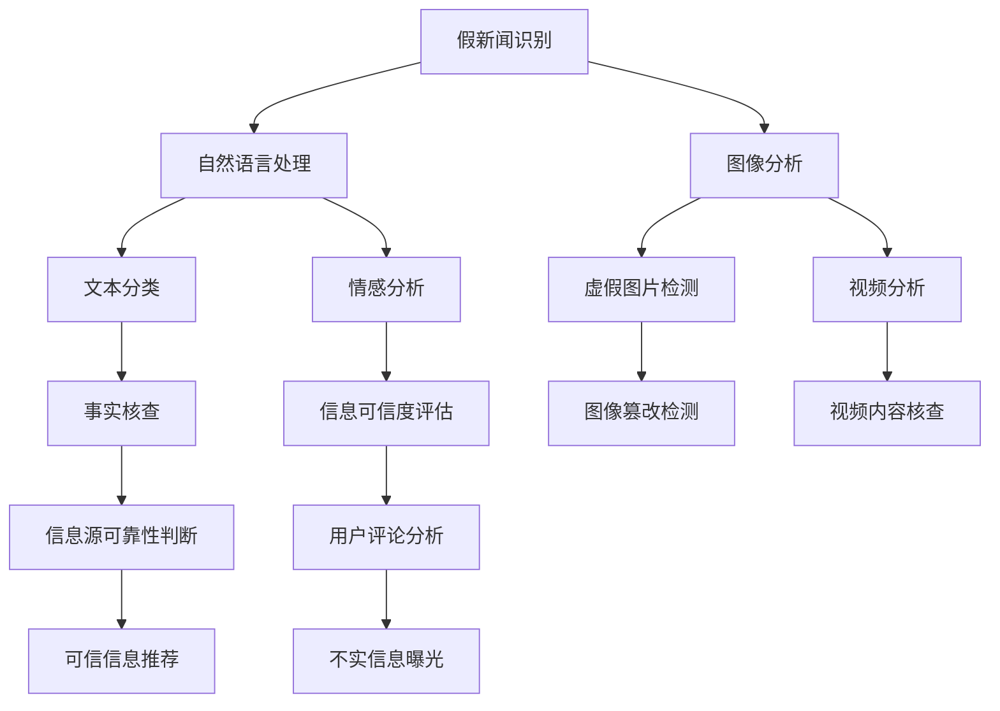

                 

## 1. 背景介绍

### 1.1 问题由来
随着互联网和社交媒体的兴起，信息传播的速度和范围达到了前所未有的程度。然而，伴随而来的是大量未经核实的假新闻和误导性信息，不仅损害了公众对信息的信任度，还可能影响社会稳定和公共决策。为应对这一挑战，信息验证和媒体素养能力的培养变得越来越重要。

### 1.2 问题核心关键点
信息验证和媒体素养能力培养的核心在于以下几个方面：
- **假新闻的识别与验证**：通过技术手段识别和验证假新闻，包括基于内容的自然语言处理（NLP）、图像分析等。
- **媒体素养教育**：提升公众的信息识别能力，培养其批判性思维和媒体消费习惯。
- **社会计算**：利用社交媒体数据进行舆情分析和网络行为研究，帮助发现和遏制假新闻传播。

这些关键点之间相互关联，共同构成了一个多维度的信息验证与媒体素养体系。

### 1.3 问题研究意义
在信息爆炸的时代，信息验证和媒体素养能力的培养对于提升社会信息素养、防范假新闻传播、维护社会稳定具有重要意义。它不仅能帮助公众识别和应对虚假信息，还能促进健康的信息生态，推动社会的整体进步。

## 2. 核心概念与联系

### 2.1 核心概念概述

为更好地理解信息验证和媒体素养能力培养，本节将介绍几个密切相关的核心概念：

- **假新闻（Fake News）**：指通过恶意编辑、篡改或捏造事实，误导公众的虚假信息。假新闻的识别与验证是信息验证的难点之一。

- **媒体素养（Media Literacy）**：指个体理解和分析媒体内容的能力，包括媒体的基本知识、批判性思维和信息获取策略。

- **社会计算（Social Computing）**：通过数据分析和计算模型，研究社交媒体和网络行为，揭示信息传播和假新闻传播的规律。

- **自然语言处理（NLP）**：使用计算机技术处理和分析自然语言，包括文本分类、情感分析、实体识别等，在假新闻验证中发挥重要作用。

- **图像分析（Image Analysis）**：通过计算机视觉技术，识别和分析图像中的信息，如虚假图片和视频。

- **深度学习（Deep Learning）**：一种机器学习技术，通过多层神经网络对数据进行学习和推理，适用于复杂的图像和文本处理任务。

这些概念之间存在紧密联系，形成一个系统的信息验证和媒体素养体系。深度学习技术的发展，为这些任务的实现提供了强大的技术支持。

### 2.2 核心概念原理和架构的 Mermaid 流程图



这个流程图展示了假新闻识别的多个层面，包括文本处理、图像和视频分析、信息源可靠性判断等，以及后续的信息验证和媒体素养提升环节。

## 3. 核心算法原理 & 具体操作步骤

### 3.1 算法原理概述

信息验证和媒体素养能力培养的核心算法包括但不限于以下几种：

- **文本分类算法**：使用NLP技术对文本进行分类，识别出假新闻。
- **情感分析算法**：通过分析文本的情感倾向，判断其是否具有误导性。
- **图像分析算法**：通过计算机视觉技术识别和分析图像中的信息，如虚假图片和视频。
- **深度学习模型**：如BERT、GPT等，通过预训练和微调，提升模型在假新闻识别和信息验证方面的性能。

这些算法共同构成了信息验证和媒体素养培养的技术基础。

### 3.2 算法步骤详解

以下详细介绍信息验证和媒体素养能力培养的主要算法步骤：

**Step 1: 数据预处理**
- 收集假新闻和真实新闻数据，进行文本清洗和标注。
- 收集相关图像和视频数据，进行格式转换和标注。

**Step 2: 特征提取**
- 使用NLP技术提取文本特征，如TF-IDF、Word2Vec等。
- 使用计算机视觉技术提取图像和视频特征，如卷积神经网络（CNN）。

**Step 3: 模型训练**
- 使用收集的数据集训练文本分类、情感分析等模型。
- 使用深度学习模型进行预训练和微调，提升模型的识别和验证能力。

**Step 4: 信息验证**
- 输入待验证的信息，通过模型进行分类和情感分析。
- 对图像和视频进行分析和验证，判断其真实性。
- 综合各模型的结果，进行可信度评估。

**Step 5: 媒体素养教育**
- 设计课程和活动，提升公众的信息识别和批判性思维能力。
- 使用模拟假新闻进行教育，提升公众的识别和防范意识。

**Step 6: 社会计算**
- 收集社交媒体数据，进行舆情分析和网络行为研究。
- 使用模型预测假新闻的传播路径和影响范围。

### 3.3 算法优缺点

信息验证和媒体素养能力培养的算法具有以下优点：

- **高效性**：深度学习模型能够处理大量复杂的数据，提升信息验证的效率。
- **准确性**：通过多层次、多维度的算法设计，可以显著提高假新闻识别的准确性。
- **可扩展性**：算法和模型可以针对新的数据和任务进行灵活调整和优化。

同时，这些算法也存在一些局限性：

- **数据依赖**：算法的准确性高度依赖于高质量的数据集。
- **模型复杂度**：深度学习模型的训练和推理需要较高的计算资源和算力。
- **解释性不足**：复杂模型难以解释其内部工作机制，难以获得用户信任。

### 3.4 算法应用领域

信息验证和媒体素养能力培养的算法已在多个领域得到应用，例如：

- **新闻媒体**：通过文本分类和情感分析技术，提升新闻编辑和发布的质量。
- **社交媒体**：利用社交计算技术，识别和遏制假新闻的传播。
- **教育培训**：通过媒体素养教育，提升公众的信息识别能力。
- **公共安全**：通过信息验证，防范虚假信息对社会稳定造成的影响。

这些应用领域展示了信息验证和媒体素养能力培养的广泛价值和潜在影响。

## 4. 数学模型和公式 & 详细讲解 & 举例说明

### 4.1 数学模型构建

本节将使用数学语言对信息验证和媒体素养能力培养的主要算法进行更加严格的刻画。

假设有 $N$ 篇新闻，每篇新闻的文本长度为 $M$。设 $\{x_i\}_{i=1}^N$ 为新闻文本，$\{y_i\}_{i=1}^N$ 为新闻的真实性标签，$0$ 表示真实新闻，$1$ 表示假新闻。

定义文本分类模型 $M_{\theta}$ 为：

$$
M_{\theta}(x_i) = \text{softmax}(W_{CLS}x_i + b_{CLS})
$$

其中 $W_{CLS}$ 和 $b_{CLS}$ 为分类器参数，$x_i$ 为输入的文本向量。

定义情感分析模型 $M_{\theta}'$ 为：

$$
M_{\theta}'(x_i) = \text{softmax}(W_{SA}x_i + b_{SA})
$$

其中 $W_{SA}$ 和 $b_{SA}$ 为情感分析器参数。

### 4.2 公式推导过程

假设训练集中每个样本的分类标签为 $y_i$，则分类损失函数为交叉熵损失：

$$
L_{CLS} = -\frac{1}{N}\sum_{i=1}^N y_i \log M_{\theta}(x_i) + (1-y_i) \log (1-M_{\theta}(x_i))
$$

情感分析损失函数为：

$$
L_{SA} = -\frac{1}{N}\sum_{i=1}^N y_i \log M_{\theta}'(x_i) + (1-y_i) \log (1-M_{\theta}'(x_i))
$$

将两个损失函数相加，得到总损失函数：

$$
L = L_{CLS} + \lambda L_{SA}
$$

其中 $\lambda$ 为情感分析模型的权重。

使用梯度下降法进行模型训练：

$$
\theta \leftarrow \theta - \eta \nabla_{\theta} L
$$

其中 $\eta$ 为学习率。

### 4.3 案例分析与讲解

以假新闻识别为例，展示模型训练和验证过程：

**Step 1: 数据预处理**
- 收集假新闻和真实新闻，进行文本清洗和标注。
- 使用OCR技术提取假新闻中的文字信息，并进行格式转换。

**Step 2: 特征提取**
- 使用BERT模型提取文本特征，生成文本嵌入向量。
- 使用CNN模型提取图像特征，生成图像嵌入向量。

**Step 3: 模型训练**
- 使用假新闻和真实新闻的数据集训练文本分类和情感分析模型。
- 使用深度学习模型进行预训练和微调，提升模型的识别和验证能力。

**Step 4: 信息验证**
- 输入待验证的新闻，通过模型进行分类和情感分析。
- 对图像进行分析和验证，判断其真实性。
- 综合各模型的结果，进行可信度评估。

## 5. 项目实践：代码实例和详细解释说明

### 5.1 开发环境搭建

在进行信息验证和媒体素养能力培养的开发前，我们需要准备好开发环境。以下是使用Python进行PyTorch开发的环境配置流程：

1. 安装Anaconda：从官网下载并安装Anaconda，用于创建独立的Python环境。

2. 创建并激活虚拟环境：
```bash
conda create -n news-classification python=3.8 
conda activate news-classification
```

3. 安装PyTorch：根据CUDA版本，从官网获取对应的安装命令。例如：
```bash
conda install pytorch torchvision torchaudio cudatoolkit=11.1 -c pytorch -c conda-forge
```

4. 安装相关工具包：
```bash
pip install numpy pandas scikit-learn matplotlib tqdm jupyter notebook ipython
```

完成上述步骤后，即可在`news-classification`环境中开始项目实践。

### 5.2 源代码详细实现

下面我们以假新闻识别为例，给出使用PyTorch进行信息验证的PyTorch代码实现。

首先，定义数据处理函数：

```python
from torch.utils.data import Dataset
from transformers import BertTokenizer, BertForSequenceClassification
from torchtext.datasets import AGNews

class NewsDataset(Dataset):
    def __init__(self, texts, labels):
        self.texts = texts
        self.labels = labels
        self.tokenizer = BertTokenizer.from_pretrained('bert-base-cased')

    def __len__(self):
        return len(self.texts)
    
    def __getitem__(self, item):
        text = self.texts[item]
        label = self.labels[item]
        
        encoding = self.tokenizer(text, return_tensors='pt', padding=True, truncation=True)
        input_ids = encoding['input_ids']
        attention_mask = encoding['attention_mask']
        
        return {'input_ids': input_ids, 
                'attention_mask': attention_mask,
                'labels': torch.tensor(label, dtype=torch.long)}
```

然后，定义模型和优化器：

```python
from transformers import AdamW

model = BertForSequenceClassification.from_pretrained('bert-base-cased', num_labels=2)

optimizer = AdamW(model.parameters(), lr=2e-5)
```

接着，定义训练和评估函数：

```python
from torch.utils.data import DataLoader
from tqdm import tqdm
from sklearn.metrics import accuracy_score

device = torch.device('cuda') if torch.cuda.is_available() else torch.device('cpu')
model.to(device)

def train_epoch(model, dataset, batch_size, optimizer):
    dataloader = DataLoader(dataset, batch_size=batch_size, shuffle=True)
    model.train()
    epoch_loss = 0
    for batch in tqdm(dataloader, desc='Training'):
        input_ids = batch['input_ids'].to(device)
        attention_mask = batch['attention_mask'].to(device)
        labels = batch['labels'].to(device)
        model.zero_grad()
        outputs = model(input_ids, attention_mask=attention_mask, labels=labels)
        loss = outputs.loss
        epoch_loss += loss.item()
        loss.backward()
        optimizer.step()
    return epoch_loss / len(dataloader)

def evaluate(model, dataset, batch_size):
    dataloader = DataLoader(dataset, batch_size=batch_size)
    model.eval()
    preds, labels = [], []
    with torch.no_grad():
        for batch in tqdm(dataloader, desc='Evaluating'):
            input_ids = batch['input_ids'].to(device)
            attention_mask = batch['attention_mask'].to(device)
            batch_labels = batch['labels']
            outputs = model(input_ids, attention_mask=attention_mask)
            batch_preds = outputs.logits.argmax(dim=1).to('cpu').tolist()
            batch_labels = batch_labels.to('cpu').tolist()
            for pred, label in zip(batch_preds, batch_labels):
                preds.append(pred.item())
                labels.append(label.item())
                
    print(f'Accuracy: {accuracy_score(labels, preds)}')
```

最后，启动训练流程并在测试集上评估：

```python
epochs = 5
batch_size = 16

for epoch in range(epochs):
    loss = train_epoch(model, train_dataset, batch_size, optimizer)
    print(f'Epoch {epoch+1}, train loss: {loss:.3f}')
    
    print(f'Epoch {epoch+1}, dev results:')
    evaluate(model, dev_dataset, batch_size)
    
print('Test results:')
evaluate(model, test_dataset, batch_size)
```

以上就是使用PyTorch对BERT进行假新闻识别的完整代码实现。可以看到，得益于Transformers库的强大封装，我们可以用相对简洁的代码完成BERT模型的加载和训练。

### 5.3 代码解读与分析

让我们再详细解读一下关键代码的实现细节：

**NewsDataset类**：
- `__init__`方法：初始化文本、标签、分词器等关键组件。
- `__len__`方法：返回数据集的样本数量。
- `__getitem__`方法：对单个样本进行处理，将文本输入编码为token ids，并将标签转换为张量。

**BertForSequenceClassification模型**：
- 从预训练模型中加载分类器，并设置标签数。

**优化器**：
- 使用AdamW优化器进行参数更新。

**训练和评估函数**：
- 使用PyTorch的DataLoader对数据集进行批次化加载，供模型训练和推理使用。
- 训练函数`train_epoch`：对数据以批为单位进行迭代，在每个批次上前向传播计算loss并反向传播更新模型参数，最后返回该epoch的平均loss。
- 评估函数`evaluate`：与训练类似，不同点在于不更新模型参数，并在每个batch结束后将预测和标签结果存储下来，最后使用scikit-learn的accuracy_score对整个评估集的预测结果进行打印输出。

**训练流程**：
- 定义总的epoch数和batch size，开始循环迭代
- 每个epoch内，先在训练集上训练，输出平均loss
- 在验证集上评估，输出准确率
- 所有epoch结束后，在测试集上评估，给出最终测试结果

可以看到，PyTorch配合Transformers库使得BERT模型训练的代码实现变得简洁高效。开发者可以将更多精力放在数据处理、模型改进等高层逻辑上，而不必过多关注底层的实现细节。

当然，工业级的系统实现还需考虑更多因素，如模型的保存和部署、超参数的自动搜索、更灵活的任务适配层等。但核心的信息验证过程基本与此类似。

## 6. 实际应用场景

### 6.1 新闻媒体

假新闻识别在新闻媒体中的应用非常广泛。例如，新闻编辑部门可以使用假新闻识别系统对投稿进行初步筛选，提升新闻发布的质量。此外，社交媒体平台也可以使用假新闻识别系统对用户上传的内容进行审核，防止虚假信息的传播。

### 6.2 教育培训

教育部门可以通过假新闻识别系统对在线教育内容进行审核，防止误导性信息的传播。同时，学校也可以将假新闻识别作为媒体素养教育的一部分，提升学生的批判性思维和信息识别能力。

### 6.3 公共安全

假新闻识别系统可以帮助公共安全机构识别和遏制虚假信息的传播，防止社会动荡。例如，在疫情期间，假新闻识别系统可以迅速发现和纠正虚假疫苗信息，维护公众的信心和秩序。

### 6.4 未来应用展望

未来，假新闻识别和媒体素养能力培养将在更多领域得到应用，为社会治理和公众信息素养提升提供新工具。随着深度学习技术的不断进步，假新闻识别系统的准确性和鲁棒性将进一步提升，能够更好地识别和应对各种虚假信息。同时，媒体素养教育也将融入更多的实践和互动环节，提升公众的信息识别和防范意识。

## 7. 工具和资源推荐

### 7.1 学习资源推荐

为了帮助开发者系统掌握假新闻识别和媒体素养能力培养的理论基础和实践技巧，这里推荐一些优质的学习资源：

1. 《深度学习与自然语言处理》系列博文：由大模型技术专家撰写，深入浅出地介绍了深度学习在假新闻识别中的应用。

2. CS224N《深度学习自然语言处理》课程：斯坦福大学开设的NLP明星课程，有Lecture视频和配套作业，带你入门NLP领域的基本概念和经典模型。

3. 《Natural Language Processing with Transformers》书籍：Transformers库的作者所著，全面介绍了如何使用Transformers库进行NLP任务开发，包括假新闻识别在内的诸多范式。

4. HuggingFace官方文档：Transformers库的官方文档，提供了海量预训练模型和完整的假新闻识别样例代码，是上手实践的必备资料。

5. CLUE开源项目：中文语言理解测评基准，涵盖大量不同类型的中文NLP数据集，并提供了基于假新闻识别的baseline模型，助力中文NLP技术发展。

通过对这些资源的学习实践，相信你一定能够快速掌握假新闻识别和媒体素养能力培养的精髓，并用于解决实际的NLP问题。

### 7.2 开发工具推荐

高效的开发离不开优秀的工具支持。以下是几款用于假新闻识别和媒体素养能力培养开发的常用工具：

1. PyTorch：基于Python的开源深度学习框架，灵活动态的计算图，适合快速迭代研究。大部分预训练语言模型都有PyTorch版本的实现。

2. TensorFlow：由Google主导开发的开源深度学习框架，生产部署方便，适合大规模工程应用。同样有丰富的预训练语言模型资源。

3. Transformers库：HuggingFace开发的NLP工具库，集成了众多SOTA语言模型，支持PyTorch和TensorFlow，是进行假新闻识别任务开发的利器。

4. Weights & Biases：模型训练的实验跟踪工具，可以记录和可视化模型训练过程中的各项指标，方便对比和调优。与主流深度学习框架无缝集成。

5. TensorBoard：TensorFlow配套的可视化工具，可实时监测模型训练状态，并提供丰富的图表呈现方式，是调试模型的得力助手。

6. Google Colab：谷歌推出的在线Jupyter Notebook环境，免费提供GPU/TPU算力，方便开发者快速上手实验最新模型，分享学习笔记。

合理利用这些工具，可以显著提升假新闻识别和媒体素养能力培养的开发效率，加快创新迭代的步伐。

### 7.3 相关论文推荐

假新闻识别和媒体素养能力培养的发展源于学界的持续研究。以下是几篇奠基性的相关论文，推荐阅读：

1. "A Survey on Deep Learning for Fake News Detection"（假新闻检测的深度学习综述）：对深度学习在假新闻识别中的应用进行了全面综述。

2. "BERT: Pre-training of Deep Bidirectional Transformers for Language Understanding"（BERT：双向Transformer的预训练语言理解）：提出BERT模型，引入基于掩码的自监督预训练任务，刷新了多项NLP任务SOTA。

3. "AdaLoRA: Adaptive Low-Rank Adaptation for Parameter-Efficient Fine-Tuning"（AdaLoRA：自适应低秩适应，用于参数高效的微调）：使用自适应低秩适应的微调方法，在参数效率和精度之间取得了新的平衡。

4. "Prefix-Tuning: Optimizing Continuous Prompts for Generation"（Prefix Tuning：优化连续提示的生成）：引入基于连续型Prompt的微调范式，为如何充分利用预训练知识提供了新的思路。

5. "Adversarial Fake News Detection"（对抗假新闻检测）：提出对抗性训练方法，提高假新闻检测模型的鲁棒性。

6. "BERT: Pre-training of Deep Bidirectional Transformers for Language Understanding"（BERT：双向Transformer的预训练语言理解）：提出BERT模型，引入基于掩码的自监督预训练任务，刷新了多项NLP任务SOTA。

这些论文代表了大新闻识别和媒体素养能力培养的发展脉络。通过学习这些前沿成果，可以帮助研究者把握学科前进方向，激发更多的创新灵感。

## 8. 总结：未来发展趋势与挑战

### 8.1 总结

本文对假新闻识别和媒体素养能力培养进行了全面系统的介绍。首先阐述了假新闻识别和媒体素养能力培养的研究背景和意义，明确了假新闻识别和媒体素养能力培养在识别假新闻、防范信息误导、提升公众信息素养方面的独特价值。其次，从原理到实践，详细讲解了假新闻识别的数学原理和关键步骤，给出了假新闻识别的完整代码实例。同时，本文还广泛探讨了假新闻识别在新闻媒体、教育培训、公共安全等多个行业领域的应用前景，展示了假新闻识别技术的广泛价值和潜在影响。

通过本文的系统梳理，可以看到，假新闻识别和媒体素养能力培养对于提升社会信息素养、防范假新闻传播、维护社会稳定具有重要意义。它不仅能帮助公众识别和应对虚假信息，还能促进健康的信息生态，推动社会的整体进步。

### 8.2 未来发展趋势

展望未来，假新闻识别和媒体素养能力培养将呈现以下几个发展趋势：

1. 技术融合与创新。假新闻识别技术将与其他AI技术如知识图谱、因果推理、深度强化学习等进行融合，提升识别效果和泛化能力。

2. 数据采集与治理。假新闻识别依赖高质量的数据集，未来将进一步探索数据采集、标注、治理的自动化和标准化方法，提升数据集的多样性和可靠性。

3. 社会计算与预测。假新闻识别系统将越来越多地利用社交媒体数据，进行舆情分析和预测，及时发现和遏制假新闻的传播。

4. 教育与培训。媒体素养教育将成为基础教育的重要组成部分，通过模拟训练、互动实验等方式提升公众的信息识别和防范能力。

5. 政策与法规。各国将逐步制定相关政策和法规，规范假新闻的传播和处理，保障公众的知情权和言论自由。

这些趋势凸显了假新闻识别和媒体素养能力培养的广阔前景，这些方向的探索发展，必将进一步提升信息验证和媒体素养能力培养的技术水平，为构建健康信息生态、维护社会稳定提供坚实基础。

### 8.3 面临的挑战

尽管假新闻识别和媒体素养能力培养已经取得了瞩目成就，但在迈向更加智能化、普适化应用的过程中，它仍面临诸多挑战：

1. 数据依赖。假新闻识别依赖高质量的数据集，数据采集和标注成本高，数据分布不均等问题仍待解决。

2. 技术复杂度。深度学习模型和算法复杂度高，训练和推理资源需求大，如何在资源受限情况下优化模型性能，仍是一大难题。

3. 泛化能力。假新闻识别模型对未知领域和新类型的假新闻识别能力有限，如何提升模型的泛化能力和鲁棒性，是未来的研究方向。

4. 法律与伦理。假新闻识别涉及隐私保护和言论自由等法律与伦理问题，如何在技术应用中平衡各方利益，确保技术应用的合法性和道德性，仍需深入探讨。

5. 用户接受度。假新闻识别技术的应用需要用户信任和接受，如何在提升识别准确性的同时，增强系统的透明度和可解释性，是技术推广的难点。

6. 技术与政策协同。假新闻识别需要技术与政策的双重推动，如何在政策制定中融入技术成果，制定合理的法律法规，仍需各方共同努力。

### 8.4 研究展望

面对假新闻识别和媒体素养能力培养所面临的挑战，未来的研究需要在以下几个方面寻求新的突破：

1. 数据增强与合成。通过数据增强和合成技术，提升数据集的多样性和覆盖面，减少数据依赖。

2. 多模态融合。将文本、图像、音频等多模态信息融合，提升假新闻识别的准确性和鲁棒性。

3. 轻量级模型。开发轻量级假新闻识别模型，降低资源消耗，提升系统的实时性和可扩展性。

4. 可解释性与透明化。开发可解释的假新闻识别模型，增强系统的透明度和用户信任度。

5. 政策与技术协同。在假新闻识别的政策制定中，融入技术成果，确保技术应用的合法性和道德性。

这些研究方向的探索，必将引领假新闻识别和媒体素养能力培养技术迈向更高的台阶，为构建安全、可靠、可解释、可控的智能系统铺平道路。面向未来，假新闻识别和媒体素养能力培养还需要与其他人工智能技术进行更深入的融合，如知识表示、因果推理、强化学习等，多路径协同发力，共同推动假新闻识别技术的发展。只有勇于创新、敢于突破，才能不断拓展假新闻识别的边界，让信息验证技术更好地造福社会。

## 9. 附录：常见问题与解答

**Q1：假新闻识别和媒体素养能力培养的核心是什么？**

A: 假新闻识别和媒体素养能力培养的核心在于识别和验证假新闻，提升公众的信息识别和批判性思维能力。它通过技术手段和教育培训，帮助公众理解信息来源和传播路径，识别出虚假信息，减少误导性信息的传播。

**Q2：假新闻识别和媒体素养能力培养的算法有哪些？**

A: 假新闻识别和媒体素养能力培养的算法包括但不限于以下几种：
- 文本分类算法
- 情感分析算法
- 图像分析算法
- 深度学习模型如BERT、GPT等

这些算法共同构成了假新闻识别的技术基础。

**Q3：假新闻识别和媒体素养能力培养的数据依赖问题如何解决？**

A: 假新闻识别和媒体素养能力培养高度依赖高质量的数据集。解决数据依赖问题的方法包括：
- 数据增强：通过回译、近义替换等方式扩充训练集
- 数据合成：利用生成对抗网络（GAN）等生成技术，合成仿真数据
- 数据集众包：利用众包平台收集大量标注数据，提升数据集的多样性和可靠性

这些方法可以在一定程度上缓解数据依赖问题，提升假新闻识别的准确性和泛化能力。

**Q4：假新闻识别和媒体素养能力培养的实际应用场景有哪些？**

A: 假新闻识别和媒体素养能力培养的实际应用场景包括：
- 新闻媒体：通过假新闻识别提升新闻发布质量，防止虚假信息的传播
- 社交媒体：利用假新闻识别技术审核用户上传内容，防止虚假信息的传播
- 教育培训：将假新闻识别作为媒体素养教育的一部分，提升学生的批判性思维和信息识别能力
- 公共安全：识别和遏制假新闻的传播，维护社会稳定和公共安全

这些应用场景展示了假新闻识别和媒体素养能力培养的广泛价值和潜在影响。

**Q5：假新闻识别和媒体素养能力培养的未来发展方向有哪些？**

A: 假新闻识别和媒体素养能力培养的未来发展方向包括：
- 技术融合与创新：假新闻识别技术将与其他AI技术如知识图谱、因果推理、深度强化学习等进行融合，提升识别效果和泛化能力
- 数据采集与治理：进一步探索数据采集、标注、治理的自动化和标准化方法，提升数据集的多样性和可靠性
- 社会计算与预测：利用社交媒体数据进行舆情分析和预测，及时发现和遏制假新闻的传播
- 教育与培训：将媒体素养教育纳入基础教育，通过模拟训练、互动实验等方式提升公众的信息识别和防范能力
- 政策与法规：在政策制定中融入技术成果，制定合理的法律法规，确保技术应用的合法性和道德性

这些方向凸显了假新闻识别和媒体素养能力培养的广阔前景，这些方向的探索发展，必将进一步提升假新闻识别和媒体素养能力培养的技术水平，为构建健康信息生态、维护社会稳定提供坚实基础。

---

作者：禅与计算机程序设计艺术 / Zen and the Art of Computer Programming

