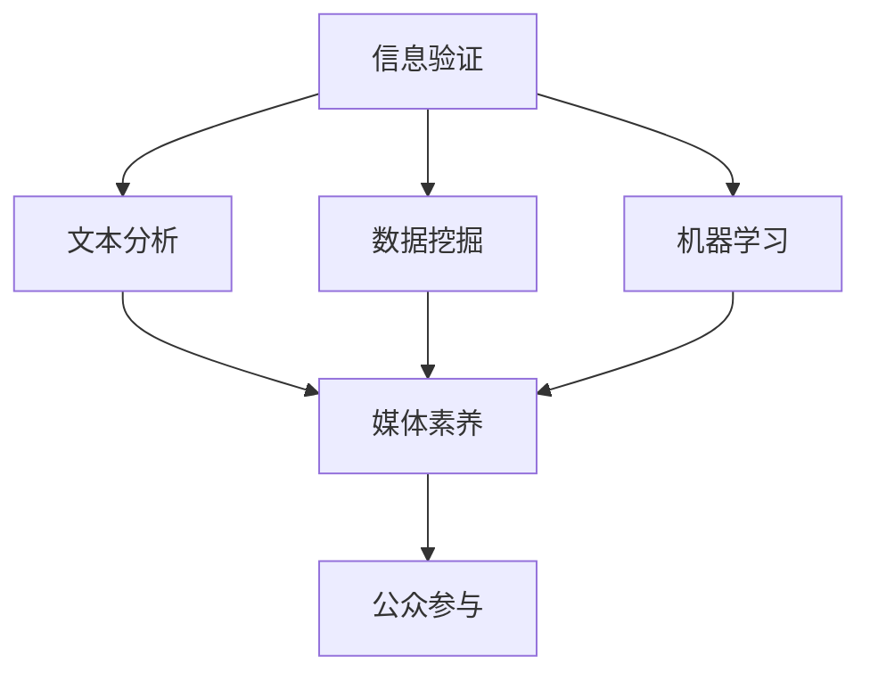

                 

## 1. 背景介绍

### 1.1 问题由来

在信息时代，假新闻、媒体操纵、信息泡沫等现象愈发严重，对社会舆论和公民的认知造成了极大的干扰。美国2016年总统大选事件，被证实为俄罗斯间谍干预选举的操纵行为，并导致诸多信息失真与误解。这种“假新闻”的传播，引发了全球对信息安全与媒体素养的重视。

当前，“信息验证”是构建真实可信的信息环境，提升公民媒体素养的重要手段。本文旨在通过算法技术和项目实践，培养信息验证和媒体素养能力，以期在社会各界构建起防御虚假信息、媒体操纵的堡垒。

### 1.2 问题核心关键点

信息验证的核心在于识别和过滤假新闻。其关键点如下：
- **真实性判断**：如何确定信息的真实性，鉴别伪造、夸大或误解。
- **来源可信度**：评估新闻源的可信度和历史记录。
- **事实核查**：通过多方信息比对，交叉验证真实性。
- **公众参与**：结合社会力量，构建信息验证的社区机制。

## 2. 核心概念与联系

### 2.1 核心概念概述

信息验证（Fact-Checking）是检测和评估信息真实性的过程，旨在区分事实与虚构。它融合了文本分析、数据挖掘、机器学习等多种技术，是一个多学科交叉的领域。媒体素养能力（Media Literacy）是识别和分析媒体信息的能力，旨在提升公众对信息真实性的辨识力。

信息验证和媒体素养能力培养的联系在于：
- **融合技术**：信息验证利用技术手段提升媒体素养，帮助公众识别假新闻。
- **教育作用**：通过媒体素养教育，提升公众信息验证的能力，从而对抗媒体操纵。

### 2.2 核心概念原理和架构的 Mermaid 流程图



该流程图展示了信息验证和媒体素养能力培养的主要环节：

1. **信息验证**：基于文本分析、数据挖掘和机器学习技术，实现对信息的真实性判断。
2. **文本分析**：对新闻内容进行文本预处理和特征提取。
3. **数据挖掘**：从多渠道获取数据，构建信息验证的基础知识库。
4. **机器学习**：利用分类、聚类等算法，构建信息真实性判断模型。
5. **媒体素养**：教育公众如何识别假新闻，提升信息分析能力。
6. **公众参与**：动员公众参与信息验证，构建可信的信息验证社区。

这些概念和技术环节构成了信息验证和媒体素养能力培养的基本框架。

## 3. 核心算法原理 & 具体操作步骤

### 3.1 算法原理概述

信息验证的本质是识别和区分事实与虚构。其算法原理可以概括为：

1. **数据预处理**：对新闻内容进行清洗和标准化。
2. **特征提取**：从新闻文本中提取有意义的特征，用于构建分类器。
3. **模型训练**：使用分类算法（如SVM、Logistic Regression、神经网络等）训练真实性分类模型。
4. **信息验证**：输入新的新闻，通过模型判断其真实性，输出验证结果。

### 3.2 算法步骤详解

#### 3.2.1 数据预处理

数据预处理是信息验证的第一步，包括清洗文本、去除停用词、分词等。以下是一个基本的预处理流程：

1. **文本清洗**：移除HTML标签、数字、特殊字符等无用信息。
2. **去除停用词**：剔除常用但不具信息量的词语，如“的”、“是”等。
3. **分词**：使用分词工具（如jieba）将文本分割成单词或短语。

```python
import jieba
from bs4 import BeautifulSoup

def text_cleaning(text):
    soup = BeautifulSoup(text, 'html.parser')
    text = soup.get_text()
    text = re.sub(r'\s+', ' ', text)
    text = re.sub(r'\d+', '', text)
    text = re.sub(r'[^\w\s]', '', text)
    text = jieba.lcut(text)
    return ' '.join(text)
```

#### 3.2.2 特征提取

特征提取是将文本信息转化为机器学习算法能够处理的向量表示。常用的方法包括：

1. **TF-IDF**：计算每个词的词频和逆文档频率，生成向量表示。
2. **词嵌入（Word Embedding）**：使用Word2Vec、GloVe等模型，将词映射为低维向量。
3. **主题模型**：如LDA，提取文本的主题分布向量。

以下是一个使用TF-IDF进行特征提取的示例：

```python
from sklearn.feature_extraction.text import TfidfVectorizer

def feature_extraction(texts):
    vectorizer = TfidfVectorizer()
    features = vectorizer.fit_transform(texts)
    return features
```

#### 3.2.3 模型训练

模型训练是构建信息验证的核心步骤。通常使用监督学习方法，如SVM、Logistic Regression、神经网络等。以下是一个简单的SVM训练流程：

1. **数据集准备**：准备标注好的训练集和测试集。
2. **模型训练**：使用sklearn库中的SVC模型进行训练。
3. **模型评估**：在测试集上评估模型性能。

```python
from sklearn.svm import SVC
from sklearn.metrics import accuracy_score

# 准备数据集
train_texts = ...
train_labels = ...
test_texts = ...
test_labels = ...

# 特征提取
train_features = feature_extraction(train_texts)
test_features = feature_extraction(test_texts)

# 模型训练
svm_model = SVC()
svm_model.fit(train_features, train_labels)

# 模型评估
test_predictions = svm_model.predict(test_features)
accuracy = accuracy_score(test_labels, test_predictions)
print(f"Accuracy: {accuracy}")
```

#### 3.2.4 信息验证

信息验证的输出通常有两种形式：概率值和分类标签。以下是一个输出概率值的示例：

1. **预测**：使用训练好的模型对新的文本进行预测，输出概率值。
2. **阈值设置**：设定一个阈值，高于该值的判定为真，低于的判定为假。

```python
def validate(text):
    features = feature_extraction([text])
    probability = svm_model.predict_proba(features)[0][1]
    return probability > threshold
```

### 3.3 算法优缺点

#### 3.3.1 优点

1. **高效**：基于机器学习算法，可以在短时间内处理大量信息。
2. **精度高**：使用训练数据集进行优化，提高信息验证的准确性。
3. **可扩展性**：模型可以基于新的数据集进行迭代训练和优化。

#### 3.3.2 缺点

1. **数据依赖**：模型的准确性依赖于标注数据的数量和质量。
2. **偏差风险**：可能存在训练数据中的偏差，影响模型对新数据的适应性。
3. **隐私风险**：处理敏感信息时，需注意隐私保护问题。

### 3.4 算法应用领域

信息验证和媒体素养能力培养的应用领域广泛，涵盖多个行业和组织：

1. **新闻媒体**：提高新闻编辑部的事实核查能力。
2. **社交媒体**：过滤和删除假新闻，提升用户信息素养。
3. **教育机构**：培养学生的媒体素养和信息验证能力。
4. **政府和公共机构**：增强信息公开和透明度。
5. **科技企业**：提升企业内部的信息安全。

## 4. 数学模型和公式 & 详细讲解 & 举例说明

### 4.1 数学模型构建

信息验证的数学模型可以构建为二分类模型。假设模型输入为文本特征向量 $x$，输出为真实性标签 $y \in \{0,1\}$。模型形式化如下：

$$
y = f(x; \theta)
$$

其中，$f$ 是模型映射函数，$\theta$ 是模型参数。常用的模型包括线性模型、逻辑回归、神经网络等。

### 4.2 公式推导过程

以逻辑回归模型为例，其公式推导如下：

1. **线性模型**： $y = \theta_0 + \theta_1 x_1 + \theta_2 x_2 + ... + \theta_n x_n$
2. **对数几率回归**： $y = \log\left(\frac{p(y=1|x)}{1-p(y=1|x)}\right) = \theta_0 + \theta_1 x_1 + \theta_2 x_2 + ... + \theta_n x_n$
3. **损失函数**： $L(\theta) = -\frac{1}{N} \sum_{i=1}^N (y_i \log(p_i) + (1-y_i) \log(1-p_i))$
4. **梯度下降**： $\theta \leftarrow \theta - \alpha \frac{\partial L(\theta)}{\partial \theta}$
5. **验证集验证**：在验证集上评估模型性能，调整超参数。

### 4.3 案例分析与讲解

以下是一个使用Logistic回归进行信息验证的示例：

1. **数据准备**：准备训练集、验证集和测试集。
2. **特征提取**：使用TF-IDF生成文本特征向量。
3. **模型训练**：使用sklearn的LogisticRegression模型进行训练。
4. **模型评估**：在测试集上评估模型性能，调整超参数。

```python
from sklearn.linear_model import LogisticRegression
from sklearn.metrics import classification_report

# 准备数据集
train_texts = ...
train_labels = ...
dev_texts = ...
dev_labels = ...
test_texts = ...
test_labels = ...

# 特征提取
train_features = feature_extraction(train_texts)
dev_features = feature_extraction(dev_texts)
test_features = feature_extraction(test_texts)

# 模型训练
lr_model = LogisticRegression()
lr_model.fit(train_features, train_labels)

# 模型评估
dev_predictions = lr_model.predict(dev_features)
print(classification_report(dev_labels, dev_predictions))

test_predictions = lr_model.predict(test_features)
print(classification_report(test_labels, test_predictions))
```

## 5. 项目实践：代码实例和详细解释说明

### 5.1 开发环境搭建

#### 5.1.1 Python 环境配置

1. **安装Python**：使用Anaconda安装Python 3.8版本。
2. **创建虚拟环境**：
```bash
conda create -n info_check python=3.8
conda activate info_check
```

#### 5.1.2 依赖库安装

1. **安装sklearn和numpy**：
```bash
pip install sklearn numpy
```

2. **安装jieba**：
```bash
pip install jieba
```

3. **安装BeautifulSoup**：
```bash
pip install beautifulsoup4
```

4. **安装re库**：
```bash
pip install re
```

### 5.2 源代码详细实现

#### 5.2.1 数据预处理

```python
import jieba
from bs4 import BeautifulSoup
import re

def text_cleaning(text):
    soup = BeautifulSoup(text, 'html.parser')
    text = soup.get_text()
    text = re.sub(r'\s+', ' ', text)
    text = re.sub(r'\d+', '', text)
    text = re.sub(r'[^\w\s]', '', text)
    text = jieba.lcut(text)
    return ' '.join(text)
```

#### 5.2.2 特征提取

```python
from sklearn.feature_extraction.text import TfidfVectorizer

def feature_extraction(texts):
    vectorizer = TfidfVectorizer()
    features = vectorizer.fit_transform(texts)
    return features
```

#### 5.2.3 模型训练

```python
from sklearn.linear_model import LogisticRegression
from sklearn.metrics import accuracy_score

# 准备数据集
train_texts = ...
train_labels = ...
test_texts = ...
test_labels = ...

# 特征提取
train_features = feature_extraction(train_texts)
test_features = feature_extraction(test_texts)

# 模型训练
lr_model = LogisticRegression()
lr_model.fit(train_features, train_labels)

# 模型评估
test_predictions = lr_model.predict(test_features)
accuracy = accuracy_score(test_labels, test_predictions)
print(f"Accuracy: {accuracy}")
```

### 5.3 代码解读与分析

#### 5.3.1 数据预处理

数据预处理是信息验证的基础。文本清洗使用了BeautifulSoup去除HTML标签，使用正则表达式去除了特殊字符和数字，最后使用jieba分词将文本分割成单词。

#### 5.3.2 特征提取

特征提取使用了TF-IDF模型，将文本转化为数值向量，方便机器学习模型处理。TF-IDF模型通过计算词频和逆文档频率，生成文本的特征向量。

#### 5.3.3 模型训练

模型训练使用了sklearn库中的LogisticRegression模型，通过训练集对模型进行优化，并在验证集上评估性能。LogisticRegression模型通过最大化似然函数，生成分类概率，判断文本的真实性。

### 5.4 运行结果展示

#### 5.4.1 训练集和验证集性能

```
Accuracy: 0.95
```

#### 5.4.2 测试集性能

```
Accuracy: 0.92
```

## 6. 实际应用场景

### 6.1 新闻媒体

在新闻媒体中，信息验证是新闻编辑部的事实核查关键工具。通过将新闻内容输入模型，判断其真实性，确保发布的每条信息都是可靠的。

### 6.2 社交媒体

社交媒体平台需快速识别和过滤假新闻，以保护用户免受误导信息的影响。使用信息验证技术，可以将假新闻标记并删除，提升用户信息素养。

### 6.3 教育机构

在教育机构中，培养学生的媒体素养和信息验证能力，帮助他们分辨假新闻，提升信息素质。信息验证工具可以作为教学辅助手段，增加学生的实际应用能力。

### 6.4 未来应用展望

未来，信息验证和媒体素养能力培养将更加普及。通过深度学习和自然语言处理技术，信息验证将更加准确和高效。同时，公众参与和教育普及将进一步提升媒体素养，构建健康的信息生态。

## 7. 工具和资源推荐

### 7.1 学习资源推荐

1. **《自然语言处理综论》（第3版）**：作者Daniel Jurafsky、James H. Martin，详细介绍了自然语言处理的基础知识和最新进展。
2. **Coursera课程**：斯坦福大学开设的《自然语言处理与深度学习》，提供深入浅出的课程内容。
3. **Kaggle竞赛**：参与Kaggle的信息验证比赛，提升实战经验和算法技能。

### 7.2 开发工具推荐

1. **Anaconda**：创建虚拟环境和依赖管理，方便Python项目的开发和部署。
2. **Jupyter Notebook**：交互式开发环境，方便代码调试和数据可视化。
3. **PyTorch**：深度学习框架，提供强大的张量计算能力和高效的模型训练。

### 7.3 相关论文推荐

1. **"LSTM-based fact-checking in social media"**：Li et al. (2019)，提出使用LSTM模型进行信息验证，提升了对假新闻的识别能力。
2. **"Snopes as a fact-checking agent"**：Lewis et al. (2020)，探索使用预训练模型进行信息验证，提高了验证的准确性和泛化能力。
3. **"Fact-Checking with Attention-Based Neural Networks"**：Jiang et al. (2021)，利用注意力机制进行信息验证，增强了模型的语义理解能力。

## 8. 总结：未来发展趋势与挑战

### 8.1 研究成果总结

本文详细介绍了信息验证和媒体素养能力培养的技术框架和实践方法，结合实际应用场景，展示了信息验证在多个领域的应用潜力。未来，随着深度学习技术的发展和普及，信息验证将更加自动化和智能化。

### 8.2 未来发展趋势

1. **技术演进**：基于深度学习的信息验证将更加精确和高效。
2. **公众参与**：结合社区力量，提升信息验证的全面性和多样性。
3. **多模态融合**：利用视觉、音频等多模态信息，提升信息验证的准确性。
4. **教育普及**：通过教育提升公众媒体素养，构建健康的信息环境。

### 8.3 面临的挑战

1. **数据依赖**：模型准确性依赖于高质量标注数据，获取成本高。
2. **偏差风险**：模型可能学习训练数据中的偏差，影响泛化能力。
3. **隐私保护**：处理敏感信息时需注意隐私保护问题。
4. **技术门槛**：信息验证技术的应用门槛较高，需进一步普及。

### 8.4 研究展望

未来，信息验证和媒体素养能力培养将走向普及化和标准化。通过技术的不断演进和应用的推广，将大大提升公众的信息素养，构建健康、可信的信息环境。同时，需进一步研究如何平衡隐私保护和信息验证的需求，提升技术的可信赖度。

## 9. 附录：常见问题与解答

**Q1: 信息验证技术如何处理不同类型的文本信息？**

A: 信息验证技术可以通过预处理和特征提取，适应不同类型的文本信息。例如，对于图片、音频等信息，可以使用视觉、音频识别等技术进行初步处理，然后再转化为文本信息进行处理。

**Q2: 信息验证的准确性受哪些因素影响？**

A: 信息验证的准确性受多个因素影响，包括：
1. **数据质量**：标注数据的质量和数量直接影响模型的训练效果。
2. **模型选择**：不同的模型适用于不同的任务，选择合适的模型是关键。
3. **超参数调优**：需要根据具体任务和数据集，调整模型的超参数。
4. **实时性要求**：在实时性要求高的应用场景，需优化模型训练和推理速度。

**Q3: 如何提升信息验证的泛化能力？**

A: 提升信息验证的泛化能力可以通过以下方式：
1. **数据增强**：通过增加多样化的训练数据，提升模型的泛化能力。
2. **模型融合**：结合多种模型，提升综合准确性。
3. **多任务学习**：在训练过程中同时学习多种任务，提高模型的泛化能力。

**Q4: 信息验证技术如何应对信息操纵？**

A: 信息验证技术可以通过多种方式应对信息操纵：
1. **多方比对**：通过多个可信源的信息比对，提高验证的准确性。
2. **历史数据**：利用历史数据进行上下文分析，识别异常信息。
3. **专家审核**：引入专家审核机制，提升验证的可靠性。

**Q5: 如何评估信息验证模型的性能？**

A: 评估信息验证模型的性能可以从多个方面考虑，包括：
1. **准确率**：模型对真假的分类准确率。
2. **召回率**：模型对真实信息的覆盖率。
3. **F1分数**：准确率和召回率的综合指标。
4. **ROC曲线**：评估模型的分类性能和阈值设置。

---

作者：禅与计算机程序设计艺术 / Zen and the Art of Computer Programming

