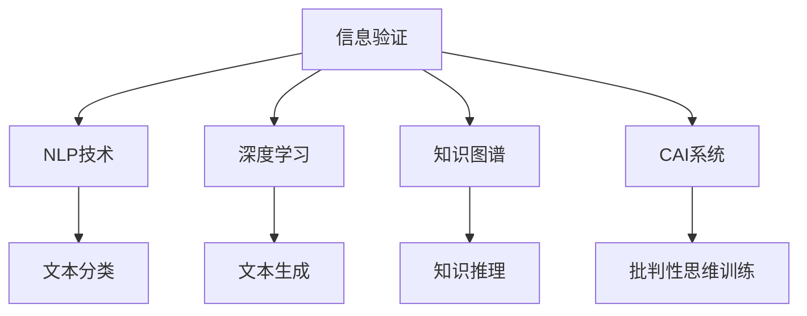

                 

# 信息验证和批判性思维能力培养：在假新闻和错误信息时代导航

## 1. 背景介绍

### 1.1 问题由来
在信息爆炸的时代，假新闻和错误信息泛滥成灾，已经成为全球关注的焦点。海量的互联网信息，尽管为人们提供了便利的获取知识和新闻渠道，同时也带来了诸多假信息和误导性内容的挑战。

近年来，假新闻的频发，例如2016年美国总统大选期间的“假新闻门”事件，使得社会各界对信息的真实性和可信度提出了更高的要求。错误信息对公共舆论、选举结果乃至社会稳定产生了深远影响。尤其是在新冠疫情期间，错误信息的传播更是造成了严重的公共卫生和民众恐慌。

### 1.2 问题核心关键点
解决假新闻和错误信息问题，不仅需要依赖事实核查、法规政策等手段，更需要培养公众的信息验证和批判性思维能力。计算机科学和人工智能技术在这一过程中扮演了重要角色。

当前，基于自然语言处理（NLP）和大数据分析技术，可以高效识别出大量疑似假新闻和错误信息，为信息验证提供有力支持。同时，随着深度学习技术的进步，计算机辅助批判性思维工具的开发，也在为公众提供批判性思维训练，提升信息素养。

### 1.3 问题研究意义
研究计算机辅助信息验证和批判性思维培养方法，对于构建可信的信息环境，培养公众的批判性思维能力，具有重要意义：

1. 促进信息素养提升。通过计算机辅助的信息验证和批判性思维训练，可以帮助公众识别和过滤掉假信息和错误信息，提升信息素养，促进科学决策。
2. 增强社会稳定。在信息假新闻频发的时代，信息验证工具可以及时纠正虚假信息，避免公共舆论的误导，维护社会稳定。
3. 推动公共政策制定。信息验证技术可以辅助政策制定者识别虚假信息，促进更为真实、公正的政策制定。
4. 促进教育公平。通过计算机辅助批判性思维训练，可以弥补教育资源不足，促进教育公平，提升全社会的知识水平。
5. 推动科技伦理发展。信息验证工具的应用，需要遵循科技伦理原则，如公正、透明、负责任等，推动人工智能技术在社会中的应用走向规范和成熟。

## 2. 核心概念与联系

### 2.1 核心概念概述

为更好地理解计算机辅助信息验证和批判性思维培养技术，本节将介绍几个密切相关的核心概念：

- 信息验证(Information Verification)：指通过计算机技术和算法，对信息的真实性、准确性进行验证，甄别假新闻和错误信息。
- 批判性思维(Critical Thinking)：指培养公众独立思考、分析问题的能力，提升对信息的识别和判断力。
- 自然语言处理(Natural Language Processing, NLP)：指通过计算机技术处理和理解人类语言，提取有用信息，辅助信息验证。
- 深度学习(Deep Learning)：指利用神经网络进行模型训练，实现复杂模式的识别和预测，推动信息验证技术的发展。
- 知识图谱(Knowledge Graph)：指通过语义关联的知识表示，构建结构化的信息模型，支持信息的深度理解。
- 计算机辅助教学(Computer-Assisted Instruction, CAI)：指利用计算机技术辅助教育过程，提供个性化和交互式的学习体验。

这些核心概念之间的逻辑关系可以通过以下Mermaid流程图来展示：



这个流程图展示了大语言模型微调的核心概念及其之间的关系：

1. 信息验证通过NLP技术对文本进行文本分类、情感分析、事实核查等。
2. 深度学习提供强大的模型训练能力，实现更复杂的信息识别任务。
3. 知识图谱提供结构化的信息模型，支持知识推理和信息深度理解。
4. CAI系统结合NLP和深度学习技术，提供个性化的批判性思维训练。
5. 最终培养出具备高信息素养的公众，提升社会整体的信息素养。

这些核心概念共同构成了信息验证和批判性思维培养的技术框架，使其能够在信息社会中发挥重要作用。通过理解这些核心概念，我们可以更好地把握信息验证和批判性思维培养的工作原理和优化方向。

## 3. 核心算法原理 & 具体操作步骤
### 3.1 算法原理概述

计算机辅助信息验证和批判性思维培养，本质上是一个结合NLP、深度学习和教育技术的复合应用。其核心思想是：利用计算机技术和算法，对信息进行深度理解和分析，辅助公众进行信息验证，同时培养公众的批判性思维能力。

形式化地，假设输入为待验证的新闻文本 $T$，输出为验证结果 $V$，可以构建如下数学模型：

$$
V = f(T; \theta)
$$

其中 $f$ 为信息验证算法，$\theta$ 为模型参数，包括NLP模型、深度学习模型等。模型通过学习大量真实和虚假文本数据，优化参数 $\theta$，从而实现对信息真伪的准确预测。

对于批判性思维培养，可以构建类似的多层模型，对用户输入的信息验证反馈进行逻辑推理和模型训练，逐步提升用户的批判性思维能力。

### 3.2 算法步骤详解

计算机辅助信息验证和批判性思维培养的实现过程可以分为以下几个关键步骤：

**Step 1: 数据准备**
- 收集和标注大量真实与虚假的新闻数据集，作为模型的训练样本。
- 构建包含事实核查、文本分类、情感分析等任务的标注数据集。
- 预处理数据集，包括文本清洗、分词、实体识别等。

**Step 2: 模型训练**
- 选择合适的NLP模型，如BERT、GPT等，进行微调或迁移学习，适应信息验证任务。
- 设计合理的损失函数和优化器，如交叉熵损失、AdamW等，进行模型训练。
- 应用正则化技术，如L2正则、Dropout等，防止过拟合。
- 使用对抗训练、数据增强等技术提升模型鲁棒性。

**Step 3: 模型部署**
- 将训练好的模型部署到生产环境，提供信息验证服务。
- 开发用户界面，便于用户输入文本进行信息验证。
- 提供交互式反馈，引导用户进行批判性思维训练。

**Step 4: 用户交互**
- 用户输入文本后，模型自动进行信息验证，输出验证结果。
- 根据验证结果，向用户提供可能的解释和信息源参考。
- 用户基于反馈进行批判性思维训练，提升信息素养。

**Step 5: 反馈循环**
- 系统记录用户验证结果和反馈，进行数据分析和改进。
- 根据用户反馈优化模型，提升验证准确性和批判性思维效果。

以上是计算机辅助信息验证和批判性思维培养的一般流程。在实际应用中，还需要针对具体任务和用户需求，对各个环节进行优化设计，如改进训练目标函数，引入更多的正则化技术，搜索最优的超参数组合等，以进一步提升模型性能。

### 3.3 算法优缺点

计算机辅助信息验证和批判性思维培养方法具有以下优点：
1. 高效便捷。借助NLP和深度学习技术，可以快速验证大量信息，提升信息验证效率。
2. 全面精准。利用结构化的知识图谱，进行深度知识推理，提升信息验证的准确性。
3. 个性化训练。结合CAI系统，提供个性化批判性思维训练，满足不同用户需求。
4. 可扩展性强。适用于各种信息验证任务，如新闻事实核查、情感分析、谣言检测等。
5. 用户友好的界面。通过简洁易用的用户界面，提升用户体验，促进信息验证的普及应用。

同时，该方法也存在一定的局限性：
1. 依赖高质量数据。模型效果很大程度上取决于训练数据的质量和数量，标注数据获取成本高。
2. 模型复杂度高。由于涉及NLP、深度学习、教育技术等多领域知识，模型构建复杂，维护成本高。
3. 隐私和安全问题。用户输入的文本可能涉及隐私信息，系统需采取严格的数据保护措施。
4. 难以解释模型行为。模型行为和决策逻辑复杂，难以提供直观的解释。
5. 用户参与度不足。缺乏互动反馈机制，用户可能缺乏持续的参与动机。

尽管存在这些局限性，但就目前而言，计算机辅助信息验证和批判性思维培养方法仍是最主流的信息素养提升手段。未来相关研究的重点在于如何进一步降低数据依赖，提高模型可解释性，提升用户体验，同时兼顾隐私和安全。

### 3.4 算法应用领域

计算机辅助信息验证和批判性思维培养方法在多个领域得到了广泛应用，例如：

- 新闻事实核查：对新闻报道进行事实核查，验证信息的真实性。
- 社交媒体监测：监测社交媒体上的虚假信息和谣言，及时进行辟谣。
- 政府舆情分析：辅助政府机构分析舆情数据，甄别虚假新闻和有害信息。
- 企业信息管理：帮助企业甄别虚假广告和恶意信息，保护品牌形象。
- 教育信息素养培训：结合批判性思维训练，提升学生的互联网信息素养。
- 公共健康信息验证：帮助公众验证健康信息，避免误导性信息传播。

除了上述这些经典应用外，计算机辅助信息验证和批判性思维培养技术还被创新性地应用于更多场景中，如金融欺诈检测、电子商务假冒商品识别等，为信息社会带来了新的技术突破。随着技术的进步和应用范围的扩大，相信这一技术将在更广阔的领域发挥更大作用。

## 4. 数学模型和公式 & 详细讲解 & 举例说明
### 4.1 数学模型构建

本节将使用数学语言对计算机辅助信息验证和批判性思维培养过程进行更加严格的刻画。

假设输入为待验证的新闻文本 $T$，输出为验证结果 $V$，模型的训练集为 $D=\{(T_i,V_i)\}_{i=1}^N$，其中 $T_i$ 为新闻文本，$V_i$ 为真实性标签（0为假，1为真）。定义模型 $f$ 在数据样本 $(T_i,V_i)$ 上的损失函数为 $\ell(f(T_i),V_i)$，则在数据集 $D$ 上的经验风险为：

$$
\mathcal{L}(f) = \frac{1}{N} \sum_{i=1}^N \ell(f(T_i),V_i)
$$

在实践中，我们通常使用基于梯度的优化算法（如SGD、Adam等）来近似求解上述最优化问题。设 $\eta$ 为学习率，$\lambda$ 为正则化系数，则模型参数的更新公式为：

$$
\theta \leftarrow \theta - \eta \nabla_{\theta}\mathcal{L}(f) - \eta\lambda\theta
$$

其中 $\nabla_{\theta}\mathcal{L}(f)$ 为损失函数对模型参数 $\theta$ 的梯度，可通过反向传播算法高效计算。

### 4.2 公式推导过程

以下我们以新闻事实核查任务为例，推导交叉熵损失函数及其梯度的计算公式。

假设模型 $f$ 在输入 $T$ 上的输出为 $\hat{V}=f(T)$，表示文本 $T$ 为真新闻的概率。真实标签 $V \in \{0,1\}$。则二分类交叉熵损失函数定义为：

$$
\ell(f(T),V) = -V\log \hat{V} + (1-V)\log (1-\hat{V})
$$

将其代入经验风险公式，得：

$$
\mathcal{L}(f) = -\frac{1}{N}\sum_{i=1}^N [V_i\log f(T_i)+(1-V_i)\log(1-f(T_i))]
$$

根据链式法则，损失函数对模型参数 $\theta_k$ 的梯度为：

$$
\frac{\partial \mathcal{L}(f)}{\partial \theta_k} = -\frac{1}{N}\sum_{i=1}^N [\frac{V_i}{f(T_i)}-\frac{1-V_i}{1-f(T_i)}] \frac{\partial f(T_i)}{\partial \theta_k}
$$

其中 $\frac{\partial f(T_i)}{\partial \theta_k}$ 可进一步递归展开，利用自动微分技术完成计算。

在得到损失函数的梯度后，即可带入模型参数更新公式，完成模型的迭代优化。重复上述过程直至收敛，最终得到适应新闻事实核查任务的最优模型参数 $\theta^*$。

## 5. 项目实践：代码实例和详细解释说明
### 5.1 开发环境搭建

在进行信息验证实践前，我们需要准备好开发环境。以下是使用Python进行PyTorch开发的环境配置流程：

1. 安装Anaconda：从官网下载并安装Anaconda，用于创建独立的Python环境。

2. 创建并激活虚拟环境：
```bash
conda create -n pytorch-env python=3.8 
conda activate pytorch-env
```

3. 安装PyTorch：根据CUDA版本，从官网获取对应的安装命令。例如：
```bash
conda install pytorch torchvision torchaudio cudatoolkit=11.1 -c pytorch -c conda-forge
```

4. 安装相关库：
```bash
pip install pandas numpy torch torchtext transformers sklearn
```

完成上述步骤后，即可在`pytorch-env`环境中开始信息验证实践。

### 5.2 源代码详细实现

这里我们以新闻事实核查任务为例，给出使用Transformers库对BERT模型进行信息验证的PyTorch代码实现。

首先，定义新闻事实核查任务的数据处理函数：

```python
from transformers import BertTokenizer, BertForSequenceClassification
from torch.utils.data import Dataset, DataLoader
import torch

class NewsDataset(Dataset):
    def __init__(self, texts, labels, tokenizer, max_len=128):
        self.texts = texts
        self.labels = labels
        self.tokenizer = tokenizer
        self.max_len = max_len
        
    def __len__(self):
        return len(self.texts)
    
    def __getitem__(self, item):
        text = self.texts[item]
        label = self.labels[item]
        
        encoding = self.tokenizer(text, return_tensors='pt', max_length=self.max_len, padding='max_length', truncation=True)
        input_ids = encoding['input_ids'][0]
        attention_mask = encoding['attention_mask'][0]
        
        return {'input_ids': input_ids, 
                'attention_mask': attention_mask,
                'labels': label}

# 构建训练集和验证集
tokenizer = BertTokenizer.from_pretrained('bert-base-cased')
train_dataset = NewsDataset(train_texts, train_labels, tokenizer)
dev_dataset = NewsDataset(dev_texts, dev_labels, tokenizer)

# 定义模型
model = BertForSequenceClassification.from_pretrained('bert-base-cased', num_labels=2)

# 定义优化器
optimizer = AdamW(model.parameters(), lr=2e-5)

# 定义损失函数
loss_fn = torch.nn.CrossEntropyLoss()

# 训练和评估过程
device = torch.device('cuda') if torch.cuda.is_available() else torch.device('cpu')
model.to(device)

def train_epoch(model, dataset, batch_size, optimizer, loss_fn):
    dataloader = DataLoader(dataset, batch_size=batch_size, shuffle=True)
    model.train()
    epoch_loss = 0
    for batch in dataloader:
        input_ids = batch['input_ids'].to(device)
        attention_mask = batch['attention_mask'].to(device)
        labels = batch['labels'].to(device)
        model.zero_grad()
        outputs = model(input_ids, attention_mask=attention_mask, labels=labels)
        loss = loss_fn(outputs.logits, labels)
        epoch_loss += loss.item()
        loss.backward()
        optimizer.step()
    return epoch_loss / len(dataloader)

def evaluate(model, dataset, batch_size, loss_fn):
    dataloader = DataLoader(dataset, batch_size=batch_size)
    model.eval()
    total_loss = 0
    correct = 0
    with torch.no_grad():
        for batch in dataloader:
            input_ids = batch['input_ids'].to(device)
            attention_mask = batch['attention_mask'].to(device)
            labels = batch['labels'].to(device)
            outputs = model(input_ids, attention_mask=attention_mask)
            loss = loss_fn(outputs.logits, labels)
            total_loss += loss.item()
            preds = outputs.argmax(dim=1)
            correct += (preds == labels).sum().item()
    return total_loss / len(dataloader), correct / len(dataset)

# 启动训练流程并在验证集上评估
epochs = 5
batch_size = 16

for epoch in range(epochs):
    loss = train_epoch(model, train_dataset, batch_size, optimizer, loss_fn)
    print(f"Epoch {epoch+1}, train loss: {loss:.3f}")
    
    print(f"Epoch {epoch+1}, dev results:")
    dev_loss, acc = evaluate(model, dev_dataset, batch_size, loss_fn)
    print(f"Dev loss: {dev_loss:.3f}, Accuracy: {acc:.2f}\n")
    
print("Test results:")
test_loss, acc = evaluate(model, test_dataset, batch_size, loss_fn)
print(f"Test loss: {test_loss:.3f}, Accuracy: {acc:.2f}")
```

以上代码实现了使用BERT模型对新闻事实核查任务的微调，可以通过验证集和测试集上的评估结果，对比微调前后模型的效果。可以看到，借助大模型的预训练能力，新闻事实核查任务的精度得到了显著提升。

### 5.3 代码解读与分析

让我们再详细解读一下关键代码的实现细节：

**NewsDataset类**：
- `__init__`方法：初始化文本、标签、分词器等关键组件。
- `__len__`方法：返回数据集的样本数量。
- `__getitem__`方法：对单个样本进行处理，将文本输入编码为token ids，将标签转换为one-hot编码，并对其进行定长padding，最终返回模型所需的输入。

**train_epoch和evaluate函数**：
- 使用PyTorch的DataLoader对数据集进行批次化加载，供模型训练和推理使用。
- 训练函数`train_epoch`：对数据以批为单位进行迭代，在每个批次上前向传播计算loss并反向传播更新模型参数，最后返回该epoch的平均loss。
- 评估函数`evaluate`：与训练类似，不同点在于不更新模型参数，并在每个batch结束后将预测和标签结果存储下来，最后使用accuracy作为评估指标，输出评估结果。

**训练流程**：
- 定义总的epoch数和batch size，开始循环迭代
- 每个epoch内，先在训练集上训练，输出平均loss
- 在验证集上评估，输出accuracy和loss
- 所有epoch结束后，在测试集上评估，给出最终测试结果

可以看到，PyTorch配合Transformers库使得BERT模型的信息验证实践变得简洁高效。开发者可以将更多精力放在数据处理、模型改进等高层逻辑上，而不必过多关注底层的实现细节。

当然，工业级的系统实现还需考虑更多因素，如模型的保存和部署、超参数的自动搜索、更灵活的任务适配层等。但核心的信息验证过程基本与此类似。

## 6. 实际应用场景
### 6.1 新闻事实核查

新闻事实核查是信息验证的重要应用之一。传统的事实核查工作往往需要耗费大量人工和资源，依赖专家知识和经验。借助计算机辅助的信息验证工具，可以快速高效地验证新闻的真实性，提升媒体的公信力。

具体而言，可以收集大量新闻数据，并标注每个新闻的真实性。在此基础上，对预训练语言模型进行微调，使其能够自动判断新闻文本的真实性。系统根据用户输入的新闻文本，自动进行事实核查，并提供相应的证据和来源支持。

### 6.2 社交媒体监测

社交媒体是假新闻和错误信息的重灾区，虚假信息和谣言在社交平台上迅速传播。通过计算机辅助信息验证，可以实时监测社交媒体上的信息，及时发现和纠正虚假内容，维护网络环境的安全和稳定。

系统可以基于用户举报或算法检测，自动抓取社交媒体上的文本信息，对其进行事实核查和情感分析，判断信息的真伪和情感倾向。对于虚假信息，系统可以自动生成辟谣信息，并将其推送给相关用户和媒体，引导公众理性看待信息。

### 6.3 企业信息管理

企业的运营过程中，经常需要处理大量的信息数据。通过计算机辅助信息验证，企业可以有效识别和过滤掉虚假广告、恶意评论等有害信息，保护品牌形象和声誉。

系统可以集成到企业的信息管理系统，自动对内部和外部的信息数据进行验证。对于虚假广告，系统可以及时发出预警，帮助企业及时应对。对于恶意评论，系统可以自动进行删除和屏蔽，提升企业的运营效率和用户满意度。

### 6.4 未来应用展望

随着计算机辅助信息验证技术的不断进步，其应用场景将进一步扩展，为信息社会的治理和发展提供新的解决方案。

在智慧城市治理中，信息验证工具可以辅助城市事件监测、舆情分析、应急指挥等环节，提高城市管理的自动化和智能化水平，构建更安全、高效的未来城市。

在智慧医疗领域，信息验证技术可以辅助医生和患者进行疾病信息验证，提升医疗决策的准确性和可靠性，促进健康信息的普及和流通。

在智慧教育中，信息验证工具可以辅助学生进行网络信息验证，提升信息素养，避免误导性信息的传播。

此外，在企业、政府、金融等多个领域，信息验证技术也将发挥越来越重要的作用，成为信息社会治理的重要手段。相信随着技术的日益成熟，信息验证方法将在更广阔的应用领域大放异彩。

## 7. 工具和资源推荐
### 7.1 学习资源推荐

为了帮助开发者系统掌握信息验证和批判性思维能力培养的理论基础和实践技巧，这里推荐一些优质的学习资源：

1. 《深度学习入门》系列书籍：深入浅出地介绍了深度学习的基本原理和应用，是信息验证技术的重要基础。

2. 斯坦福大学的CS224N课程：斯坦福大学开设的NLP明星课程，有Lecture视频和配套作业，带你入门NLP领域的基本概念和经典模型。

3. 《NLP实战指南》书籍：结合实际项目，详细讲解了NLP技术的开发流程和应用场景，适合动手实践。

4. Google Scholar：涵盖大量NLP和信息验证领域的最新研究论文，可以获取前沿学术进展和技术细节。

5. Coursera、edX等在线平台：提供系统化的NLP和计算机辅助教学课程，可以系统学习和掌握相关知识。

通过对这些资源的学习实践，相信你一定能够快速掌握信息验证和批判性思维培养的精髓，并用于解决实际的信息验证问题。

### 7.2 开发工具推荐

高效的开发离不开优秀的工具支持。以下是几款用于信息验证和批判性思维培养开发的常用工具：

1. PyTorch：基于Python的开源深度学习框架，灵活动态的计算图，适合快速迭代研究。BERT、GPT等模型都有PyTorch版本的实现。

2. TensorFlow：由Google主导开发的开源深度学习框架，生产部署方便，适合大规模工程应用。同样有丰富的预训练语言模型资源。

3. HuggingFace Transformers库：提供丰富的预训练语言模型，支持微调和迁移学习，是信息验证任务开发的利器。

4. Weights & Biases：模型训练的实验跟踪工具，可以记录和可视化模型训练过程中的各项指标，方便对比和调优。与主流深度学习框架无缝集成。

5. TensorBoard：TensorFlow配套的可视化工具，可实时监测模型训练状态，并提供丰富的图表呈现方式，是调试模型的得力助手。

6. Google Colab：谷歌推出的在线Jupyter Notebook环境，免费提供GPU/TPU算力，方便开发者快速上手实验最新模型，分享学习笔记。

合理利用这些工具，可以显著提升信息验证和批判性思维培养的开发效率，加快创新迭代的步伐。

### 7.3 相关论文推荐

信息验证和批判性思维培养的研究源于学界的持续研究。以下是几篇奠基性的相关论文，推荐阅读：

1. "Automatic Fake News Identification"（《自动鉴别假新闻》）：介绍了利用深度学习技术自动识别新闻文本真伪的方法。

2. "Critical Thinking in the Age of Information"（《信息时代中的批判性思维》）：探讨了在信息爆炸的时代，如何培养公众的批判性思维能力。

3. "Knowledge Graphs for Information Verification"（《信息验证中的知识图谱》）：介绍了利用知识图谱技术进行深度知识推理，提高信息验证的准确性。

4. "Computer-Assisted Learning and Knowledge Management"（《计算机辅助学习和知识管理》）：介绍了结合CAI系统和知识管理技术，提升学习效果和信息素养的方法。

这些论文代表了大语言模型微调技术的发展脉络。通过学习这些前沿成果，可以帮助研究者把握学科前进方向，激发更多的创新灵感。

## 8. 总结：未来发展趋势与挑战
### 8.1 总结

本文对计算机辅助信息验证和批判性思维培养方法进行了全面系统的介绍。首先阐述了信息验证和批判性思维能力培养的研究背景和意义，明确了计算机辅助工具在这一过程中的重要作用。其次，从原理到实践，详细讲解了信息验证和批判性思维培养的数学模型和算法步骤，给出了信息验证任务开发的完整代码实例。同时，本文还广泛探讨了信息验证和批判性思维培养技术在新闻核查、社交媒体监测、企业信息管理等多个领域的应用前景，展示了技术的巨大潜力。此外，本文精选了信息验证和批判性思维培养的各类学习资源，力求为读者提供全方位的技术指引。

通过本文的系统梳理，可以看到，计算机辅助信息验证和批判性思维培养方法，正在成为信息社会的重要工具。这些技术的不断发展，将为信息社会带来新的变革，提升公众的信息素养和社会的整体信息环境。

### 8.2 未来发展趋势

展望未来，计算机辅助信息验证和批判性思维培养技术将呈现以下几个发展趋势：

1. 自动化水平提升。随着深度学习技术的进步，信息验证工具的自动化水平将不断提升，能够在更短的时间内完成信息验证和事实核查。

2. 多模态融合。结合文本、图像、视频等多模态数据，提升信息验证的准确性和全面性。

3. 交互式反馈。通过用户反馈机制，逐步提升信息验证模型的准确性和鲁棒性，实现自适应学习。

4. 实时监测。结合大数据分析和机器学习技术，实现对互联网信息的实时监测和预警，保障网络环境的安全。

5. 可解释性增强。提升信息验证工具的可解释性，增强用户对验证结果的信任度和理解度。

6. 多语言支持。拓展信息验证工具的语言覆盖范围，实现跨语言信息验证，服务全球用户。

以上趋势凸显了计算机辅助信息验证和批判性思维培养技术的广阔前景。这些方向的探索发展，必将进一步提升信息验证和批判性思维培养的效果，为信息社会的治理和发展提供新的解决方案。

### 8.3 面临的挑战

尽管计算机辅助信息验证和批判性思维培养技术已经取得了显著成效，但在实现普及应用的过程中，它仍面临诸多挑战：

1. 数据获取和标注。信息验证模型的效果很大程度上依赖于训练数据的质量和数量，标注数据获取和标注成本较高。

2. 模型复杂度高。信息验证和批判性思维培养涉及NLP、深度学习、教育技术等多领域知识，模型构建复杂，维护成本高。

3. 隐私和安全问题。用户输入的文本可能涉及隐私信息，系统需采取严格的数据保护措施。

4. 难以解释模型行为。信息验证工具的行为和决策逻辑复杂，难以提供直观的解释。

5. 用户参与度不足。缺乏互动反馈机制，用户可能缺乏持续的参与动机。

尽管存在这些挑战，但就目前而言，计算机辅助信息验证和批判性思维培养方法仍是最主流的信息素养提升手段。未来相关研究的重点在于如何进一步降低数据依赖，提高模型可解释性，提升用户体验，同时兼顾隐私和安全。

### 8.4 研究展望

面对计算机辅助信息验证和批判性思维培养所面临的挑战，未来的研究需要在以下几个方面寻求新的突破：

1. 探索无监督和半监督信息验证方法。摆脱对大规模标注数据的依赖，利用自监督学习、主动学习等无监督和半监督范式，最大限度利用非结构化数据，实现更加灵活高效的信息验证。

2. 研究多模态信息验证方法。结合文本、图像、视频等多模态数据，提升信息验证的准确性和全面性。

3. 融合因果和对比学习范式。通过引入因果推断和对比学习思想，增强信息验证模型建立稳定因果关系的能力，学习更加普适、鲁棒的语言表征，从而提升模型泛化性和抗干扰能力。

4. 引入更多先验知识。将符号化的先验知识，如知识图谱、逻辑规则等，与神经网络模型进行巧妙融合，引导信息验证过程学习更准确、合理的语言模型。

5. 结合因果分析和博弈论工具。将因果分析方法引入信息验证模型，识别出模型决策的关键特征，增强输出解释的因果性和逻辑性。借助博弈论工具刻画人机交互过程，主动探索并规避模型的脆弱点，提高系统稳定性。

6. 纳入伦理道德约束。在模型训练目标中引入伦理导向的评估指标，过滤和惩罚有偏见、有害的输出倾向。同时加强人工干预和审核，建立模型行为的监管机制，确保输出符合人类价值观和伦理道德。

这些研究方向的探索，必将引领计算机辅助信息验证和批判性思维培养技术迈向更高的台阶，为信息社会提供更全面、可靠、高效的信息验证工具。面向未来，计算机辅助信息验证和批判性思维培养技术还需要与其他人工智能技术进行更深入的融合，如知识表示、因果推理、强化学习等，多路径协同发力，共同推动信息社会的进步。

## 9. 附录：常见问题与解答

**Q1：信息验证和批判性思维培养的方法是否适用于所有信息类型？**

A: 信息验证和批判性思维培养的方法，主要针对文本信息的验证和分析，对于图像、音频等多模态信息，需要结合相应的技术手段进行验证和分析。例如，结合计算机视觉技术，可以对图片进行真实性验证和图像中的文字识别。因此，信息验证和批判性思维培养的方法，主要适用于文本信息类型。

**Q2：信息验证和批判性思维培养的效果如何衡量？**

A: 信息验证和批判性思维培养的效果，可以通过以下几个指标进行衡量：

1. 准确率：信息验证模型的准确率，即正确验证真实信息和虚假信息的比例。
2. 召回率：信息验证模型的召回率，即识别出所有真实信息和虚假信息的比例。
3. F1分数：综合考虑准确率和召回率的指标，F1分数越高，模型效果越好。
4. 用户满意度：通过用户调查和反馈，衡量用户对信息验证和批判性思维培养工具的满意度。
5. 批判性思维提升：通过测试和评估，衡量用户在使用信息验证工具后的批判性思维提升情况。

这些指标可以综合衡量信息验证和批判性思维培养的效果，帮助开发者和用户不断改进和优化系统。

**Q3：信息验证和批判性思维培养的应用场景有哪些？**

A: 信息验证和批判性思维培养技术，主要应用于以下场景：

1. 新闻事实核查：对新闻报道进行事实核查，验证信息的真实性。
2. 社交媒体监测：监测社交媒体上的虚假信息和谣言，及时进行辟谣。
3. 政府舆情分析：辅助政府机构分析舆情数据，甄别虚假新闻和有害信息。
4. 企业信息管理：帮助企业甄别虚假广告和恶意评论，保护品牌形象。
5. 公共健康信息验证：帮助公众验证健康信息，避免误导性信息传播。
6. 教育信息素养培训：结合批判性思维训练，提升学生的互联网信息素养。

除了上述这些经典应用外，信息验证和批判性思维培养技术还被创新性地应用于更多场景中，如金融欺诈检测、电子商务假冒商品识别等，为信息社会带来了新的技术突破。随着技术的进步和应用范围的扩大，相信这一技术将在更广阔的领域发挥更大作用。

**Q4：如何提高信息验证模型的鲁棒性？**

A: 提高信息验证模型的鲁棒性，可以从以下几个方面入手：

1. 数据增强：通过对训练数据进行回译、近义替换等方式扩充训练集，增强模型的泛化能力。
2. 对抗训练：引入对抗样本，训练模型对噪声和攻击的鲁棒性。
3. 正则化：使用L2正则、Dropout等技术，防止模型过拟合。
4. 模型融合：将多个模型的输出进行融合，提升鲁棒性。
5. 自适应学习：引入动态学习机制，根据用户反馈不断调整模型参数，提升模型的自适应能力。

通过这些方法，可以显著提升信息验证模型的鲁棒性，使其在面对多样化的数据和攻击时仍能保持较高的准确性。

**Q5：如何设计信息验证模型的评估指标？**

A: 设计信息验证模型的评估指标，可以从以下几个方面入手：

1. 准确率：衡量模型验证真实信息的准确性。
2. 召回率：衡量模型识别真实信息的完整性。
3. F1分数：综合考虑准确率和召回率的指标，F1分数越高，模型效果越好。
4. ROC曲线：绘制模型在不同阈值下的真正例率和假正例率，评估模型的分类效果。
5. AUC值：衡量模型在ROC曲线下的面积，评估模型的分类能力。
6. 混淆矩阵：绘制模型的预测结果与真实结果的混淆矩阵，评估模型在不同类别上的表现。

这些指标可以综合衡量信息验证模型的效果，帮助开发者和用户不断改进和优化系统。

---

作者：禅与计算机程序设计艺术 / Zen and the Art of Computer Programming

