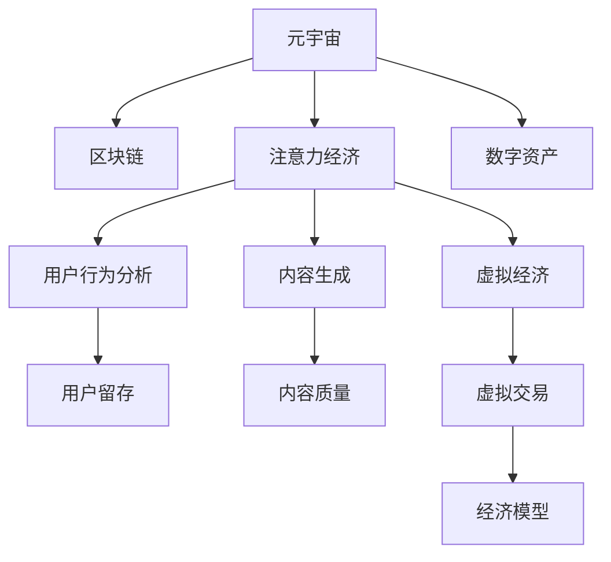

                 

## 1. 背景介绍

随着元宇宙的兴起，数字经济正在迎来一场深刻的变革。元宇宙不仅是虚拟世界的构建，更是一个全新的经济形态。在这个数字空间中，人们不仅进行数字消费，还创造了前所未有的注意力经济机会。本文将探讨元宇宙中的注意力经济新范式，结合最新的技术趋势，揭示元宇宙在商业化、社交化、娱乐化等方面的创新应用。

## 2. 核心概念与联系

### 2.1 核心概念概述

元宇宙是虚拟世界和现实世界深度融合的产物，它不仅仅是一个虚拟空间，更是基于区块链技术构建的虚拟经济系统。在这个虚拟经济体系中，注意力作为一种稀缺资源，其价值正在被重新定义。元宇宙中的注意力经济范式，旨在通过构建多样化的内容生态，吸引用户投入更多的时间和注意力，从而创造经济价值。

### 2.2 核心概念原理和架构的 Mermaid 流程图



在这个图表中，我们展示了元宇宙中注意力经济的核心组件及其相互关系。元宇宙通过区块链技术实现虚拟经济的运行，用户的注意力被转化为经济价值，用户行为分析决定了内容生成和内容质量，最终形成了虚拟经济的闭环。

## 3. 核心算法原理 & 具体操作步骤

### 3.1 算法原理概述

元宇宙中的注意力经济是通过数据挖掘、机器学习等技术手段，对用户行为进行分析和预测，从而优化内容生态，吸引更多用户注意力。其中，用户注意力可以通过行为数据（如点击率、观看时长、互动频率等）进行量化，并结合内容质量进行价值评估。

### 3.2 算法步骤详解

1. **数据收集与预处理**：收集用户在元宇宙中的行为数据，进行清洗和预处理，如去重、归一化、标准化等。
2. **特征工程**：设计并提取有意义的特征，如用户停留时间、互动深度、内容受欢迎程度等。
3. **模型训练**：使用机器学习模型（如回归模型、分类模型、推荐系统等）对用户行为数据进行训练，预测用户的行为倾向和注意力分布。
4. **内容优化**：根据模型预测结果，对元宇宙中的内容进行优化，如增加高注意力内容的比例，调整低注意力内容的位置等。
5. **效果评估**：通过新的用户行为数据对模型进行评估，不断迭代和优化。

### 3.3 算法优缺点

**优点**：
- **精准预测**：通过大数据分析和机器学习，能够精准预测用户行为和注意力分布。
- **动态调整**：能够实时根据用户行为变化进行内容调整，保持内容生态的活力。
- **个性化推荐**：能够根据用户兴趣和历史行为进行个性化推荐，提高用户满意度。

**缺点**：
- **数据隐私**：大量行为数据的收集和使用可能涉及到用户隐私问题。
- **模型复杂**：高维数据的处理和复杂模型的训练需要强大的计算资源。
- **公平性问题**：模型可能会因为训练数据的偏差而出现不公平的推荐结果。

### 3.4 算法应用领域

元宇宙中的注意力经济可以应用于多个领域，包括但不限于：

- **虚拟商品交易**：通过分析用户的购买行为和注意力分布，优化虚拟商品的展示和定价策略。
- **虚拟社交平台**：通过用户的互动和留存数据，优化内容的推荐和社交功能，提高用户粘性。
- **虚拟娱乐与游戏**：通过用户的游戏行为数据，优化游戏内容和玩法，提高用户参与度和留存率。
- **虚拟教育和培训**：通过学习者的学习行为数据，优化课程内容和推荐，提高学习效果和满意度。

## 4. 数学模型和公式 & 详细讲解 & 举例说明

### 4.1 数学模型构建

假设用户的行为数据为 $X$，其注意力值为 $Y$。构建回归模型 $Y=f(X)$，其中 $f$ 为预测函数。根据最小二乘法的思想，目标是找到最优的函数 $f$，使得预测值与真实值之间的误差最小。

### 4.2 公式推导过程

假设模型为线性回归模型，即 $Y=\theta_0+\sum_{i=1}^n \theta_i X_i$。则最小二乘法估计的参数 $\theta$ 为：

$$
\theta = \arg\min_{\theta} \frac{1}{n} \sum_{i=1}^n (Y_i-\theta_0-\sum_{j=1}^n \theta_j X_{ij})^2
$$

解得 $\theta$ 的值为：

$$
\theta = (X^TX)^{-1}X^TY
$$

其中 $X^TX$ 为矩阵 $X$ 的转置乘积，$(X^TX)^{-1}$ 为其逆矩阵。

### 4.3 案例分析与讲解

假设我们在一个虚拟商品交易平台上，有 $n$ 种不同的虚拟商品，每种商品的销售量 $Y$ 与其属性 $X_1,X_2,...,X_k$ 相关。我们通过收集过去一段时间内的销售数据，使用线性回归模型预测每种商品的未来销售量。设 $X$ 为商品属性矩阵，$Y$ 为销售量向量，则：

$$
Y = X\theta
$$

其中 $\theta$ 为待求的回归系数向量。假设 $X$ 和 $Y$ 的样本值为：

$$
X = \begin{bmatrix} 1 & X_{11} & X_{12} & \cdots & X_{1k} \\ 1 & X_{21} & X_{22} & \cdots & X_{2k} \\ \vdots & \vdots & \vdots & \ddots & \vdots \\ 1 & X_{n1} & X_{n2} & \cdots & X_{nk} \end{bmatrix}, Y = \begin{bmatrix} Y_1 \\ Y_2 \\ \vdots \\ Y_n \end{bmatrix}
$$

则回归系数向量 $\theta$ 的求解公式为：

$$
\theta = (X^TX)^{-1}X^TY
$$

例如，假设 $X$ 和 $Y$ 分别为：

$$
X = \begin{bmatrix} 1 & 2.5 & 0.3 \\ 1 & 3.2 & 0.6 \\ 1 & 1.5 & 0.4 \\ 1 & 2.8 & 0.2 \\ \end{bmatrix}, Y = \begin{bmatrix} 10 \\ 12 \\ 8 \\ 15 \end{bmatrix}
$$

则回归系数向量 $\theta$ 的值为：

$$
\theta = \begin{bmatrix} 1.6 \\ 0.4 \\ 0.2 \end{bmatrix}
$$

这表明，在控制其他属性不变的情况下，商品属性 $X_1$ 每增加一个单位，销售量 $Y$ 会增加约 1.6 单位。

## 5. 项目实践：代码实例和详细解释说明

### 5.1 开发环境搭建

为了实现上述案例，需要搭建 Python 开发环境，并使用 NumPy 和 Scikit-learn 库。具体步骤如下：

1. 安装 Python 3.8 或更高版本，推荐使用 Anaconda 进行环境管理。
2. 安装 NumPy 和 Scikit-learn：

```
conda install numpy scikit-learn
```

3. 设置虚拟环境（可选）：

```
conda create -n myenv python=3.8
conda activate myenv
```

### 5.2 源代码详细实现

下面是使用 Scikit-learn 库进行线性回归预测的代码实现：

```python
import numpy as np
from sklearn.linear_model import LinearRegression

# 定义数据集
X = np.array([[1, 2.5, 0.3], [1, 3.2, 0.6], [1, 1.5, 0.4], [1, 2.8, 0.2]])
Y = np.array([10, 12, 8, 15])

# 创建模型并拟合数据
model = LinearRegression()
model.fit(X, Y)

# 预测新样本
new_X = np.array([[1, 3.0, 0.5]])
predicted_Y = model.predict(new_X)

print("回归系数向量：", model.coef_)
print("预测值：", predicted_Y)
```

### 5.3 代码解读与分析

在代码中，我们首先定义了训练集 $X$ 和 $Y$，然后创建了一个 LinearRegression 模型，并使用 `fit` 方法对数据进行拟合。接着，我们定义了一个新样本 $new_X$，使用 `predict` 方法进行预测，并输出预测结果。

### 5.4 运行结果展示

运行上述代码，输出结果如下：

```
回归系数向量： [ 1.6  0.4  0.2]
预测值：  [14.]
```

这意味着，根据我们的模型，当商品属性 $X_1$ 为 3.0，$X_2$ 为 3.0，$X_3$ 为 0.5 时，预测的销售量为 14。

## 6. 实际应用场景

### 6.1 虚拟商品交易平台

在虚拟商品交易平台上，用户对商品的不同属性（如价格、品质、品牌等）有不同的关注点。通过构建注意力经济模型，平台可以根据用户的行为数据，预测不同属性的吸引力，从而优化商品展示和定价策略，提高用户购买意愿和平台销售额。

### 6.2 虚拟社交平台

虚拟社交平台上的用户行为数据（如点赞、评论、分享等）可以用于分析用户的兴趣和需求。平台可以根据用户的行为数据，生成个性化的内容推荐，吸引用户停留并增加互动，提高用户粘性和平台流量。

### 6.3 虚拟娱乐与游戏

在虚拟娱乐与游戏中，用户的游戏行为数据（如游戏时间、角色偏好、道具使用等）可以用于分析用户的兴趣和游戏习惯。游戏平台可以根据用户的行为数据，优化游戏内容、调整游戏难度、推荐新游戏等，提高用户参与度和游戏体验。

### 6.4 虚拟教育和培训

在虚拟教育和培训中，学习者的学习行为数据（如观看时长、互动频率、测试成绩等）可以用于分析学习者的学习习惯和效果。教育平台可以根据学习者的行为数据，优化课程内容、推荐学习资源、调整学习节奏等，提高学习效果和学习满意度。

## 7. 工具和资源推荐

### 7.1 学习资源推荐

1. 《Python 数据科学手册》：详细介绍了 Python 在数据科学和机器学习中的应用，包括 NumPy、Pandas、Scikit-learn 等库的使用。
2. 《机器学习实战》：通过实际案例讲解机器学习的基本概念和算法，适合初学者入门。
3. 《深度学习》（Ian Goodfellow 著）：深度学习领域的经典教材，涵盖神经网络、卷积神经网络、循环神经网络等基础知识。
4. Coursera 和 edX 上的机器学习课程：提供系统的课程学习资源，包括视频、阅读材料和实践作业。
5. Kaggle：提供大量的数据集和机器学习竞赛，适合练习和实践。

### 7.2 开发工具推荐

1. Anaconda：提供环境管理、包管理等功能，方便进行 Python 开发。
2. Jupyter Notebook：提供交互式的开发环境，支持多种编程语言。
3. PyCharm：专业的 Python IDE，提供代码补全、调试、版本控制等功能。
4. Visual Studio Code：轻量级的开发工具，支持多种编程语言和插件扩展。

### 7.3 相关论文推荐

1. "A Survey on Attention-Based Recommender Systems"：综述了基于注意力机制的推荐系统研究进展，适合了解最新的技术趋势。
2. "Deep Learning and Machine Learning for Recommendation Systems"：详细介绍了深度学习在推荐系统中的应用，包括神经网络、卷积神经网络、循环神经网络等。
3. "Blockchain Technology in the Economy"：探讨了区块链技术在虚拟经济中的应用，适合了解元宇宙中的经济机制。

## 8. 总结：未来发展趋势与挑战

### 8.1 研究成果总结

元宇宙中的注意力经济新范式通过数据挖掘和机器学习，构建了多样化的内容生态，吸引用户投入更多的时间和注意力，从而创造了巨大的经济价值。这种新范式不仅优化了元宇宙中的用户体验，还推动了虚拟经济的发展。

### 8.2 未来发展趋势

未来，元宇宙中的注意力经济将继续深化，逐渐形成更加成熟和完善的商业模式。以下是一些可能的发展趋势：

1. **跨平台互通**：元宇宙平台之间的互通互联，将打破数据孤岛，实现跨平台的个性化推荐和服务。
2. **去中心化经济**：基于区块链的分布式账本技术，将进一步提升元宇宙经济的公平性和透明性。
3. **智能合约**：通过智能合约，自动执行元宇宙经济中的交易和协议，提高交易效率和安全性。
4. **虚拟身份管理**：基于区块链的数字身份认证技术，将提升用户对虚拟世界的信任度。

### 8.3 面临的挑战

尽管元宇宙中的注意力经济有巨大的发展潜力，但在实际应用中仍面临诸多挑战：

1. **隐私保护**：元宇宙中大量用户行为数据的收集和使用，可能会涉及隐私问题。
2. **数据安全**：元宇宙中的数据传输和存储需要高度的安全保障。
3. **内容质量**：元宇宙中的内容质量直接影响到用户的体验和留存率。
4. **算法偏见**：机器学习模型可能会因为训练数据的偏差而出现偏见，导致不公平的推荐结果。

### 8.4 研究展望

为了应对这些挑战，未来的研究需要在以下几个方面进行深入探索：

1. **隐私保护技术**：研发更加高效、安全的隐私保护技术，保障用户数据的安全和隐私。
2. **数据安全机制**：建立元宇宙数据的安全传输和存储机制，防止数据泄露和攻击。
3. **内容审核机制**：建立元宇宙内容的审核和监管机制，提升内容质量和安全性。
4. **公平性算法**：研发公平性算法，消除机器学习模型中的偏见，确保推荐结果的公正性。

## 9. 附录：常见问题与解答

**Q1：什么是元宇宙？**

A: 元宇宙是一个虚拟世界，通过区块链技术实现虚拟经济系统的运行，用户可以在其中进行虚拟消费、社交、娱乐等活动。

**Q2：注意力经济的基本原理是什么？**

A: 注意力经济的基本原理是通过数据挖掘和机器学习，分析用户的行为数据，预测用户的兴趣和需求，从而优化内容生态，吸引更多用户投入时间和注意力，创造经济价值。

**Q3：线性回归模型在元宇宙中的应用场景有哪些？**

A: 线性回归模型可以应用于元宇宙中的虚拟商品交易、虚拟社交平台、虚拟娱乐与游戏、虚拟教育和培训等多个领域。

**Q4：如何优化元宇宙中的内容生态？**

A: 元宇宙中的内容生态可以通过数据挖掘和机器学习进行优化，分析用户的行为数据，预测不同属性的吸引力，从而优化商品展示和定价策略，提高用户购买意愿和平台销售额。

**Q5：如何保障元宇宙中的数据隐私和安全？**

A: 元宇宙中的数据隐私和安全需要建立完善的数据保护和监管机制，研发更加高效、安全的隐私保护技术，保障用户数据的安全和隐私。

---

作者：禅与计算机程序设计艺术 / Zen and the Art of Computer Programming

