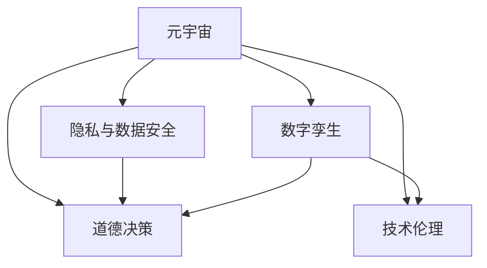

                 

# 元宇宙数字孪生伦理:现实映射的道德边界探讨

## 1. 背景介绍

### 1.1 元宇宙概念与数字孪生技术的兴起

元宇宙（Metaverse），作为由虚拟现实（VR）、增强现实（AR）、区块链、云计算、人工智能（AI）、大数据等技术的融合体，正在逐步改变人类社会的生产、生活、文化、经济等各个方面，被看作是未来的重要发展方向。在这个虚拟空间中，用户可以沉浸式体验，并进行各种交互活动。数字孪生（Digital Twin）技术则是指通过虚拟模型与物理实体之间的双向映射和同步，实现对物理世界的精确模拟和动态更新。

近年来，随着物联网（IoT）、5G、AI等技术的进步，元宇宙与数字孪生技术的应用场景不断扩展，涉及制造、建筑、城市、能源、医疗等多个领域。特别是工业4.0与智能制造的推进，企业开始运用数字孪生技术来构建智能工厂、智能资产、智能产品等，从而大幅提升生产效率和质量。

### 1.2 伦理问题与道德边界探讨

元宇宙和数字孪生技术在带来高效、智能的同时，也引发了一系列伦理与道德问题，成为该领域研究的重要课题。在构建虚拟空间时，如何在保证个人隐私的同时，又能满足数据共享和协作的需求？如何在虚拟世界中遵守现实世界的伦理标准，避免虚拟暴力的泛滥？如何确保虚拟空间中的决策透明、公正，不被少数群体控制？这些问题直接关系到虚拟与现实的平衡，也影响到元宇宙与数字孪生技术的社会接受度和普及度。

本文将围绕元宇宙与数字孪生技术在应用中的伦理问题，探讨其现实映射的道德边界，为后续研究和实际应用提供一定的参考。

## 2. 核心概念与联系

### 2.1 核心概念概述

元宇宙与数字孪生技术涉及众多复杂概念，关键包括以下几点：

1. **元宇宙**：基于VR、AR、AI等技术的虚拟空间，用户可以在其中自由探索、互动和创作。
2. **数字孪生**：通过数据驱动的方式，构建物理世界的虚拟模型，并实现数据与物理实体的实时互动和同步。
3. **隐私与数据安全**：涉及用户隐私数据的收集、存储、使用和分享等各个环节，需要严格遵守相关法律法规。
4. **道德决策**：虚拟世界中的决策需要符合现实世界的伦理标准，保障公平、透明和公正。
5. **技术伦理**：在开发和使用技术时，需要考虑其潜在的伦理风险，进行伦理影响评估。

### 2.2 核心概念关系

这些概念之间通过现实映射、数据共享、伦理决策等环节相互关联，其关系可表示如下：



该图展示了元宇宙与数字孪生技术在不同层面的联系：

1. 数字孪生技术是元宇宙构建的基础，通过物理世界与虚拟世界的双向映射和同步，实现对现实的全面模拟。
2. 隐私与数据安全是元宇宙与数字孪生技术应用的基础，用户隐私数据的收集、处理和使用需要严格遵守法律法规。
3. 道德决策是元宇宙与数字孪生技术应用的保障，虚拟世界中的决策应符合现实世界的伦理标准。
4. 技术伦理是元宇宙与数字孪生技术应用的指导，开发和使用过程中需要充分考虑其潜在的伦理风险。

## 3. 核心算法原理 & 具体操作步骤

### 3.1 算法原理概述

元宇宙与数字孪生技术在应用中的伦理问题主要涉及以下几个方面：

1. **隐私保护**：用户在虚拟世界中生成的数据如何保护其隐私？
2. **数据使用**：数据如何在用户之间安全共享？
3. **道德决策**：虚拟世界中的决策如何保证公正透明？
4. **技术伦理**：如何确保技术应用的伦理合理性？

这些问题通常通过算法和策略来解决。具体步骤如下：

### 3.2 算法步骤详解

#### 步骤1: 隐私保护

1. **数据匿名化**：使用匿名化技术，去除或伪装用户数据中的敏感信息，防止被恶意利用。
2. **数据加密**：采用先进的加密算法，确保数据在传输和存储过程中的安全性。
3. **差分隐私**：在查询和分析过程中加入噪声，限制对个体数据的识别能力。

#### 步骤2: 数据使用

1. **访问控制**：通过身份验证和授权机制，限制数据访问权限，确保仅授权用户可访问和使用数据。
2. **数据共享协议**：制定明确的数据共享和使用协议，保障数据共享的安全性和公平性。
3. **区块链技术**：利用区块链的去中心化和不可篡改特性，记录和验证数据共享和使用过程。

#### 步骤3: 道德决策

1. **公平性算法**：确保虚拟世界中的决策算法能够处理各种数据，避免偏见和歧视。
2. **透明度与可解释性**：设计可解释的模型，让用户明白决策依据和过程。
3. **用户反馈机制**：建立用户反馈渠道，及时调整和优化决策算法。

#### 步骤4: 技术伦理

1. **伦理审核**：在技术开发的各个阶段，进行伦理影响评估，确保技术应用的伦理合理性。
2. **伦理准则**：制定并遵守伦理准则，引导开发者和用户遵循技术伦理。
3. **伦理培训**：对开发者和用户进行伦理教育，提高其伦理意识和素养。

### 3.3 算法优缺点

**优点**：

1. **保护隐私**：通过数据匿名化、加密和差分隐私等技术，有效保护用户隐私。
2. **数据共享**：通过区块链技术，确保数据共享的安全性和可追溯性。
3. **道德决策**：通过公平性算法和透明度设计，确保决策的公正透明。
4. **技术伦理**：通过伦理审核和培训，提升技术应用的伦理合理性。

**缺点**：

1. **计算复杂度**：数据匿名化、差分隐私等技术增加了计算复杂度，影响处理速度。
2. **隐私保护与数据共享的平衡**：如何在保护隐私的同时，保证数据的有效共享和利用，仍需进一步探索。
3. **道德决策的复杂性**：在虚拟世界中，道德决策比现实世界更加复杂，需要更多的伦理考量。
4. **技术伦理的规范**：如何制定和遵循伦理准则，还需要全社会的共同努力。

### 3.4 算法应用领域

元宇宙与数字孪生技术涉及多个应用领域，包括但不限于：

1. **智能制造**：通过数字孪生技术构建智能工厂和智能资产，提升生产效率和质量。
2. **智慧城市**：利用元宇宙和数字孪生技术，构建智慧城市，提升城市管理效率和居民生活质量。
3. **医疗健康**：使用虚拟医疗环境进行模拟和训练，提升医疗服务水平。
4. **社交娱乐**：构建虚拟社交平台，让用户沉浸式体验和创作。
5. **教育培训**：利用虚拟实验和虚拟教室，提供更丰富的教育资源和教学体验。

## 4. 数学模型和公式 & 详细讲解 & 举例说明

### 4.1 数学模型构建

数字孪生技术的核心在于对物理世界与虚拟世界的双向映射和同步。假设物理世界的状态为 $\mathbf{x} \in \mathbb{R}^n$，虚拟世界的状态为 $\mathbf{y} \in \mathbb{R}^m$，则数字孪生模型的映射关系可表示为：

$$
\mathbf{y} = \mathbf{f}(\mathbf{x})
$$

其中 $\mathbf{f}$ 为映射函数。在实际应用中，可以使用神经网络等机器学习模型来逼近这个映射函数，使得 $\mathbf{y}$ 能够精确反映 $\mathbf{x}$ 的变化。

### 4.2 公式推导过程

以智能制造为例，假设物理世界中的工厂状态为 $\mathbf{x} = (x_1, x_2, \cdots, x_n)$，其中 $x_i$ 为设备状态、原料库存、产品产量等指标。虚拟世界中的设备状态为 $\mathbf{y} = (y_1, y_2, \cdots, y_m)$，其中 $y_i$ 为虚拟设备状态、虚拟生产效率等指标。

根据上述映射关系，数字孪生模型的优化目标为：

$$
\min_{\mathbf{x}} \left\| \mathbf{y} - \mathbf{f}(\mathbf{x}) \right\|^2
$$

其中 $\left\| \cdot \right\|$ 表示向量范数，$\left\| \cdot \right\|^2$ 表示平方范数，表示虚拟状态与映射函数输出之间的误差。

### 4.3 案例分析与讲解

以智慧城市为例，假设物理世界中的交通流量为 $\mathbf{x} = (x_1, x_2, \cdots, x_n)$，其中 $x_i$ 为各路段的交通流量、车流量等指标。虚拟世界中的交通流量为 $\mathbf{y} = (y_1, y_2, \cdots, y_m)$，其中 $y_i$ 为虚拟交通流量、虚拟车速等指标。

在智慧城市的应用中，数字孪生模型通过实时监测物理世界的交通流量，更新虚拟世界中的交通状态，并进行智能调控，提升交通管理效率。例如，在交通拥堵时，数字孪生模型可以自动调整交通信号灯，缓解交通压力。

## 5. 项目实践：代码实例和详细解释说明

### 5.1 开发环境搭建

开发数字孪生应用时，需要搭建虚拟化环境，并配置相应的开发工具。具体步骤如下：

1. 安装虚拟化软件，如VMware、VirtualBox等。
2. 配置虚拟机，确保硬件资源充足。
3. 安装操作系统，如Linux、Windows等。
4. 安装开发工具，如Python、TensorFlow、PyTorch等。
5. 安装虚拟世界引擎，如Unity3D、Unreal Engine等。

### 5.2 源代码详细实现

以智慧城市应用为例，以下是使用Python和TensorFlow实现数字孪生模型的代码示例：

```python
import tensorflow as tf
import numpy as np

# 定义物理世界状态
x = tf.Variable(tf.zeros([n]))

# 定义虚拟世界状态
y = tf.Variable(tf.zeros([m]))

# 定义映射函数
def f(x):
    # 使用神经网络逼近映射函数
    return tf.keras.models.Sequential([
        tf.keras.layers.Dense(64, activation='relu'),
        tf.keras.layers.Dense(64, activation='relu'),
        tf.keras.layers.Dense(m)
    ])(x)

# 定义优化目标
loss = tf.losses.mean_squared_error(y, f(x))

# 定义优化器
optimizer = tf.keras.optimizers.Adam(learning_rate=0.001)

# 训练模型
for i in range(1000):
    with tf.GradientTape() as tape:
        loss_value = loss(y, f(x))
    gradients = tape.gradient(loss_value, x)
    optimizer.apply_gradients(zip(gradients, [x]))
```

### 5.3 代码解读与分析

**代码解析**：

1. 使用TensorFlow定义物理世界状态 $\mathbf{x}$ 和虚拟世界状态 $\mathbf{y}$，并使用变量形式表示。
2. 定义映射函数 $\mathbf{f}$，使用神经网络逼近映射关系。
3. 定义优化目标，使用均方误差损失函数衡量误差。
4. 定义优化器，使用Adam优化器进行模型训练。
5. 训练模型，迭代更新物理世界状态 $\mathbf{x}$，使其逼近虚拟世界状态 $\mathbf{y}$。

**性能分析**：

1. 神经网络的参数化处理，使得映射函数 $\mathbf{f}$ 可以逼近任意复杂映射关系。
2. Adam优化器具有良好的收敛速度和精度，适合大规模训练任务。
3. 均方误差损失函数能够衡量输出与真实值之间的差距，适用于回归问题。

### 5.4 运行结果展示

在训练结束后，可以使用以下代码进行测试：

```python
# 生成测试数据
x_test = np.random.rand(n)

# 计算虚拟状态
y_test = f(x_test)

# 输出测试结果
print("测试结果：\n", y_test)
```

运行结果将展示虚拟状态 $\mathbf{y}$ 与物理状态 $\mathbf{x}$ 的映射关系，验证数字孪生模型的效果。

## 6. 实际应用场景

### 6.1 智能制造

数字孪生技术在智能制造中的应用，可以显著提升生产效率和质量。例如，通过数字孪生模型实时监测生产设备和流程，进行智能调整和优化，避免设备故障和生产中断。具体应用场景包括：

1. **智能工厂**：利用数字孪生技术构建虚拟工厂，进行智能监控和管理，提升生产效率。
2. **智能设备**：使用数字孪生模型对设备进行实时监控和预测维护，延长设备使用寿命。
3. **智能供应链**：通过数字孪生技术优化供应链管理，实现库存优化、物流调度和需求预测。

### 6.2 智慧城市

智慧城市中，数字孪生技术可以提升城市管理效率，提升居民生活质量。具体应用场景包括：

1. **交通管理**：利用数字孪生模型实时监测交通流量，进行智能调控，缓解交通拥堵。
2. **公共安全**：通过数字孪生技术进行城市安全监控和预警，保障居民安全。
3. **环境监测**：使用数字孪生模型监测城市环境，进行智能调度和优化。

### 6.3 医疗健康

在医疗健康领域，数字孪生技术可以提升诊断和治疗效果。具体应用场景包括：

1. **虚拟手术**：利用数字孪生技术进行虚拟手术训练和模拟，提升手术成功率和安全性。
2. **智能诊断**：通过数字孪生模型进行疾病模拟和预测，提升诊断准确性和效率。
3. **健康管理**：使用数字孪生技术进行健康数据监测和分析，提供个性化的健康管理方案。

### 6.4 未来应用展望

未来，随着元宇宙和数字孪生技术的不断发展，其应用场景将更加丰富和多样化。以下展望未来的几个方向：

1. **多模态融合**：将视觉、听觉、触觉等多模态数据与数字孪生模型结合，提供更全面、逼真的虚拟体验。
2. **实时动态更新**：通过实时数据流和人工智能算法，实现数字孪生模型的动态更新和优化。
3. **跨平台协同**：实现不同平台和设备之间的数据共享和协同，提升数字孪生系统的整体性能。
4. **人机共生**：构建虚拟与现实紧密结合的数字孪生系统，实现人机共生、协同创新。
5. **伦理与道德**：构建数字孪生系统的伦理与道德体系，保障虚拟与现实之间的平衡。

## 7. 工具和资源推荐

### 7.1 学习资源推荐

1. **《元宇宙概论》**：介绍元宇宙的基本概念、发展历程和未来展望。
2. **《数字孪生技术与应用》**：涵盖数字孪生技术的原理、应用案例和未来发展方向。
3. **《智能制造2025》**：阐述智能制造的发展战略和实现路径，结合数字孪生技术进行探讨。
4. **《人工智能伦理导论》**：介绍人工智能伦理的基本概念、伦理原则和应用场景。
5. **《区块链技术与应用》**：讲解区块链技术的原理、应用场景和未来发展方向。

### 7.2 开发工具推荐

1. **Unity3D**：流行的虚拟世界引擎，支持多种平台，易于开发和部署。
2. **Unreal Engine**：强大的游戏引擎，支持高性能图形渲染，适用于复杂虚拟场景的开发。
3. **Python**：简单易学的编程语言，广泛用于数据分析、机器学习和人工智能开发。
4. **TensorFlow**：开源的机器学习框架，支持分布式计算和高效的模型训练。
5. **PyTorch**：开源的深度学习框架，支持动态计算图和高效的模型训练。

### 7.3 相关论文推荐

1. **《数字孪生技术在智能制造中的应用》**：介绍数字孪生技术在智能制造中的具体应用场景和实现方法。
2. **《元宇宙技术的伦理与道德挑战》**：探讨元宇宙技术在应用过程中面临的伦理和道德问题。
3. **《基于区块链的数字孪生模型研究》**：研究基于区块链技术的数字孪生模型，提升数据安全和共享的公平性。
4. **《人工智能伦理框架与实践》**：建立人工智能伦理框架，指导人工智能技术的开发与应用。
5. **《智能城市数字孪生模型构建》**：介绍智慧城市中数字孪生模型的构建方法和应用效果。

## 8. 总结：未来发展趋势与挑战

### 8.1 研究成果总结

本文主要从隐私保护、数据使用、道德决策和技术伦理等方面探讨了元宇宙与数字孪生技术在应用中的伦理问题，并提出了相应的算法和策略。未来，随着技术的不断进步，数字孪生技术将广泛应用于更多领域，为各行业带来深刻的变革。

### 8.2 未来发展趋势

1. **跨界融合**：数字孪生技术将与物联网、区块链、云计算等技术深度融合，构建更全面、智能的虚拟世界。
2. **高效实时**：通过实时数据流和大数据分析，实现数字孪生模型的动态更新和优化，提升实时性和精确性。
3. **多模态协同**：融合视觉、听觉、触觉等多模态数据，提供更全面、逼真的虚拟体验。
4. **伦理与道德**：构建数字孪生系统的伦理与道德体系，保障虚拟与现实之间的平衡。

### 8.3 面临的挑战

1. **隐私保护与数据共享的平衡**：如何在保护隐私的同时，保证数据的有效共享和利用，仍需进一步探索。
2. **道德决策的复杂性**：在虚拟世界中，道德决策比现实世界更加复杂，需要更多的伦理考量。
3. **技术伦理的规范**：如何制定和遵循伦理准则，还需要全社会的共同努力。
4. **跨平台协同**：实现不同平台和设备之间的数据共享和协同，提升数字孪生系统的整体性能。

### 8.4 研究展望

未来，元宇宙与数字孪生技术的发展还需要在以下几个方面进行深入研究：

1. **隐私保护**：研究更加高效、安全的隐私保护技术，保障用户数据的安全。
2. **数据共享**：探索数据共享的公平性、透明性，实现数据利用的最大化。
3. **道德决策**：研究基于人工智能的道德决策模型，提升虚拟世界的公正性和透明性。
4. **技术伦理**：构建人工智能伦理框架，指导技术的开发与应用，避免伦理风险。
5. **跨平台协同**：研究跨平台、跨设备的协同机制，提升数字孪生系统的互操作性和效率。

本文仅从伦理角度探讨了元宇宙与数字孪生技术的应用问题，未来还需结合更多学科知识，共同推动这一领域的深入研究和发展。

## 9. 附录：常见问题与解答

### Q1: 数字孪生技术与元宇宙有什么区别？

A: 数字孪生技术强调虚拟世界与物理世界的双向映射和同步，注重实物的数字化和仿真；元宇宙则是虚拟世界的扩展，除了物理世界的映射，还包括社会、文化等多个维度的构建，更加关注用户沉浸式体验和创作。

### Q2: 数字孪生技术在应用中面临哪些挑战？

A: 数字孪生技术在应用中面临的挑战主要包括：数据质量与真实性、数据安全与隐私、实时性与精度等。如何提升数据的真实性和质量，保障数据的安全与隐私，以及提升系统的实时性与精度，都是需要解决的问题。

### Q3: 数字孪生技术在医疗健康领域的应用前景如何？

A: 数字孪生技术在医疗健康领域的应用前景非常广阔。通过虚拟手术训练和智能诊断，可以提升医疗服务的效率和准确性；通过健康数据监测和分析，可以提供个性化的健康管理方案。

### Q4: 如何构建数字孪生系统的伦理与道德体系？

A: 构建数字孪生系统的伦理与道德体系，需要从技术、法规、社会等多个层面进行综合考虑。技术层面，需要设计公平性算法，确保决策的公正透明；法规层面，需要制定相关的法律法规，规范数据使用和隐私保护；社会层面，需要加强公众教育，提高伦理意识和素养。

通过不断优化和完善数字孪生系统的伦理与道德体系，才能实现其健康、有序的发展，保障虚拟与现实之间的平衡。

