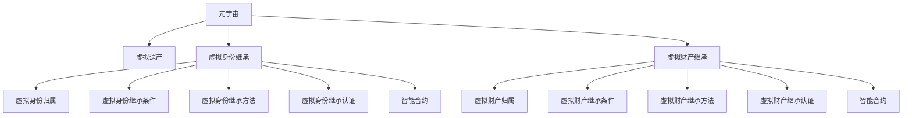

                 

## 1. 背景介绍

在虚拟世界日益发展的今天，元宇宙（Metaverse）已经逐渐从科幻走向现实。在这个由虚拟现实技术（Virtual Reality, VR）、增强现实技术（Augmented Reality, AR）、区块链技术、人工智能等多种技术构建的虚拟空间中，人们的身份和活动不再局限于现实世界。然而，随之而来的是如何处理元宇宙中的身份继承和虚拟遗产传承问题。传统的法律制度在元宇宙中面临巨大的挑战，需要重新审视并构建新的法律框架以适应这一新兴领域。

### 1.1 问题由来

元宇宙中的虚拟身份和虚拟财产（包括虚拟土地、虚拟资产等）是用户身份和财富的延伸。随着用户的离世，其虚拟身份和财产的去留问题变得复杂。如果法律对虚拟遗产没有明确的归属和传承规定，将可能导致虚拟身份的丢失或虚拟财产的争夺。因此，如何构建一套适合元宇宙特点的虚拟遗产法律传承机制，成为当下亟需解决的课题。

### 1.2 问题核心关键点

元宇宙中的虚拟遗产传承问题主要集中在以下几个关键点：
1. 虚拟遗产的定义：什么可以被视为元宇宙中的虚拟遗产？
2. 虚拟遗产的归属：虚拟遗产应由谁继承？
3. 虚拟遗产的传承：如何确保虚拟遗产的合法继承？
4. 法律适用的界定：应使用哪国的法律体系来处理虚拟遗产？
5. 技术难题：如何确保虚拟遗产的不可篡改性和安全性？

## 2. 核心概念与联系

### 2.1 核心概念概述

为更好地理解元宇宙身份继承和虚拟遗产传承机制，本节将介绍几个密切相关的核心概念：

- 元宇宙（Metaverse）：由虚拟现实技术、增强现实技术、区块链技术等构建的虚拟空间，用户在其中拥有虚拟身份和虚拟财产。
- 虚拟遗产（Virtual Estate）：用户在元宇宙中的虚拟土地、虚拟资产等，可以被视为现实世界中的财产。
- 虚拟身份继承（Virtual Identity Inheritance）：用户离世后，其虚拟身份的继承问题，包括头像、社交关系等。
- 虚拟财产继承（Virtual Property Inheritance）：用户离世后，其虚拟资产的继承问题，如虚拟土地、虚拟货币等。
- 区块链技术：用于记录虚拟身份和虚拟财产的分布式账本技术，确保数据的不可篡改性和透明性。
- 智能合约：区块链上的自动化合约，用于自动执行虚拟遗产的继承和分配。

这些核心概念之间的逻辑关系可以通过以下Mermaid流程图来展示：



这个流程图展示了大语言模型的核心概念及其之间的关系：

1. 元宇宙通过区块链和智能合约技术构建虚拟身份和虚拟财产，为虚拟遗产传承提供基础。
2. 虚拟遗产包括虚拟身份和虚拟财产，需要通过虚拟身份继承和虚拟财产继承来确保传承。
3. 虚拟身份和虚拟财产的归属、继承条件和继承方法需要通过明确的法律规定。
4. 智能合约在区块链上自动执行虚拟遗产的继承和分配，确保流程的透明性和安全性。

这些概念共同构成了元宇宙虚拟遗产法律传承机制的基础，使其能够在各种场景下提供有力的法律保障。通过理解这些核心概念，我们可以更好地把握元宇宙身份继承和虚拟遗产传承机制的工作原理和优化方向。

## 3. 核心算法原理 & 具体操作步骤
### 3.1 算法原理概述

元宇宙身份继承和虚拟遗产传承的算法原理，可以抽象为如下步骤：

1. 定义虚拟遗产的范围：确定哪些虚拟资产可以被视为虚拟遗产，并明确其归属权。
2. 设计虚拟遗产继承的逻辑：根据不同的继承场景，设计虚拟遗产的继承方法和流程。
3. 开发智能合约：利用区块链技术和智能合约，自动执行虚拟遗产的继承和分配。
4. 制定虚拟遗产法律框架：根据虚拟遗产的特点，制定相应的法律法规，确保其合法性和安全性。

### 3.2 算法步骤详解

元宇宙身份继承和虚拟遗产传承的具体操作步骤如下：

**Step 1: 定义虚拟遗产的范围**

首先，需要明确哪些虚拟资产可以被视为虚拟遗产。一般而言，虚拟遗产包括：

- 虚拟土地（Virtual Land）：如《Roblox》中的土地、《Sandbox》中的土地等。
- 虚拟资产（Virtual Assets）：如《Axie Infinity》中的代币、《CryptoKitties》中的虚拟宠物等。
- 虚拟货币（Virtual Currency）：如以太坊上的加密货币等。
- 虚拟艺术品（Virtual Art）：如《SuperRare》中的数字艺术品等。

虚拟遗产的归属权通常由用户在元宇宙中的虚拟身份拥有，可以包括以下几种情况：

- 独立所有：用户独自拥有虚拟遗产，无继承人。
- 共同拥有：用户与他人共同拥有虚拟遗产，需由继承人协商分配。
- 法定继承：根据用户所在国家或地区的继承法，由法定继承人继承。

**Step 2: 设计虚拟遗产继承的逻辑**

虚拟遗产的继承逻辑通常包括：

- 继承条件的设定：如年龄、血缘关系、婚姻关系等。
- 继承方法的确定：如直接继承、遗嘱继承、信托继承等。
- 继承权的争夺和解决：如继承人之间的争议解决机制。

以遗嘱继承为例，其步骤包括：

1. 用户可以在元宇宙中创建遗嘱，设定虚拟遗产的继承人和继承方式。
2. 遗嘱经过公证后，保存在区块链上。
3. 用户离世后，智能合约根据遗嘱自动执行虚拟遗产的继承。

**Step 3: 开发智能合约**

智能合约是元宇宙虚拟遗产传承的核心工具，用于自动执行虚拟遗产的继承和分配。智能合约的开发通常包括：

- 定义虚拟遗产的存储格式和归属权。
- 设计虚拟遗产的继承流程和条件。
- 实现虚拟遗产的分配和转移机制。
- 确保智能合约的安全性和透明性。

例如，在以太坊上，可以使用Solidity语言编写智能合约，其代码示例如下：

```solidity
contract VirtualEstate {
    address public owner;
    address[] public beneficiaries;
    uint256 public value;
    
    constructor(address[] memory _beneficiaries, uint256 _value) {
        owner = msg.sender;
        beneficiaries = _beneficiaries;
        value = _value;
    }
    
    function setBeneficiaries(address[] memory _beneficiaries) public {
        beneficiaries = _beneficiaries;
    }
    
    function distribute() public {
        for (uint256 i = 0; i < beneficiaries.length; i++) {
            payable(beneficiaries[i]).transfer(value / beneficiaries.length);
        }
    }
}
```

**Step 4: 制定虚拟遗产法律框架**

虚拟遗产的法律框架是确保其合法性和安全性的基础。具体包括：

- 虚拟遗产的法律定位：明确虚拟遗产的性质和归属权。
- 继承法律的适用：确定使用哪国的法律体系处理虚拟遗产。
- 虚拟遗产的合法性：确保虚拟遗产的继承符合法律规定。
- 虚拟遗产的安全性：确保虚拟遗产的不可篡改性和安全性。

例如，欧盟于2021年通过的《数字服务法案》（Digital Services Act）和《数字市场法案》（Digital Markets Act），就包含了对虚拟遗产的保护措施。这些法律为虚拟遗产的传承提供了法律保障，确保其在元宇宙中的合法性和安全性。

### 3.3 算法优缺点

元宇宙虚拟遗产传承的算法具有以下优点：

1. 自动化：智能合约的自动执行，减少了人工干预和争议。
2. 透明度：区块链技术确保了虚拟遗产传承的透明性和不可篡改性。
3. 灵活性：虚拟遗产的继承逻辑可以根据用户需求进行调整。
4. 安全性：智能合约和区块链技术确保了虚拟遗产的安全性和合法性。

同时，该算法也存在一些局限性：

1. 技术复杂度：智能合约的开发和维护需要较高的技术门槛。
2. 法律适用性：不同国家和地区的法律体系不同，可能需要制定统一的法律框架。
3. 继承争议：尽管智能合约可以减少争议，但仍可能存在继承人之间的争议。
4. 遗嘱争议：虚拟遗产的遗嘱可能存在法律效力问题，需进一步明确。

尽管存在这些局限性，但就目前而言，基于智能合约的元宇宙虚拟遗产传承方法仍是最主流范式。未来相关研究的重点在于如何进一步降低技术复杂度，提高法律适用性，同时兼顾可解释性和伦理安全性等因素。

### 3.4 算法应用领域

元宇宙虚拟遗产传承算法已经在多个领域得到了应用，覆盖了虚拟身份继承、虚拟财产继承等多个方面，例如：

- 虚拟身份继承：如用户《Roblox》中的虚拟身份在离世后，其虚拟土地可以自动转移到指定的继承人。
- 虚拟财产继承：如用户《Axie Infinity》中的代币，可以通过智能合约自动分配给法定继承人。
- 虚拟货币继承：如用户在以太坊上的虚拟货币，通过智能合约自动分配给受益人。
- 虚拟艺术品继承：如用户在《SuperRare》中的数字艺术品，可以通过智能合约自动转移给继承人。

除了上述这些经典应用外，元宇宙虚拟遗产传承方法还被创新性地应用到更多场景中，如虚拟遗产捐赠、虚拟遗产信托等，为元宇宙用户提供了更多的传承选择。

## 4. 数学模型和公式 & 详细讲解  
### 4.1 数学模型构建

虚拟遗产的传承算法可以形式化地表示为如下数学模型：

- 定义虚拟遗产的集合：$E$，其中每个元素表示一个虚拟遗产。
- 定义虚拟遗产的归属集合：$S$，其中每个元素表示一个归属人。
- 定义虚拟遗产的继承函数：$F: E \times S \rightarrow [0,1]$，表示虚拟遗产被归属人的继承概率。
- 定义虚拟遗产的分配函数：$D: E \times S \rightarrow [0,1]$，表示虚拟遗产被归属人的分配比例。

虚拟遗产的传承算法可以表示为：

$$
\max_{F,D} \sum_{e \in E} \sum_{s \in S} F(e,s) \cdot D(e,s)
$$

其中，最大化的是所有虚拟遗产的预期价值，即每个虚拟遗产被继承和分配的概率之积。

### 4.2 公式推导过程

以上数学模型的推导基于以下几个假设：

1. 每个虚拟遗产的继承概率是独立的。
2. 每个虚拟遗产的分配比例是独立的。
3. 每个归属人的继承概率和分配比例是固定的。

基于这些假设，可以推导出虚拟遗产传承的期望值公式：

$$
\max_{F,D} \sum_{e \in E} \sum_{s \in S} F(e,s) \cdot D(e,s) = \max_{F,D} \sum_{e \in E} \sum_{s \in S} F(e,s) \cdot \sum_{i=1}^N F(e,s_i) \cdot D(e,s_i)
$$

其中，$N$表示归属人的数量。

将上式进行简化，可以得到虚拟遗产传承的期望值公式：

$$
\max_{F,D} \sum_{e \in E} \sum_{s \in S} F(e,s) \cdot D(e,s) = \max_{F,D} \sum_{e \in E} \sum_{s \in S} F(e,s) \cdot \sum_{i=1}^N F(e,s_i) \cdot D(e,s_i) = \max_{F,D} \sum_{e \in E} \sum_{s \in S} \sum_{i=1}^N F(e,s) \cdot F(e,s_i) \cdot D(e,s_i)
$$

上式表示虚拟遗产传承的期望值是每个虚拟遗产被每个归属人继承和分配的概率之积。

### 4.3 案例分析与讲解

以《Roblox》中的虚拟土地传承为例，分析其数学模型和推导过程：

- 虚拟土地集合：$E = \{L_1, L_2, ..., L_N\}$，其中$N$表示虚拟土地的数量。
- 归属人集合：$S = \{A_1, A_2, ..., A_M\}$，其中$M$表示归属人的数量。
- 虚拟土地的继承函数：$F: E \times S \rightarrow [0,1]$，假设每个归属人对每块虚拟土地的继承概率是固定的，且独立。
- 虚拟土地的分配函数：$D: E \times S \rightarrow [0,1]$，假设每个归属人对每块虚拟土地的分配比例是固定的，且独立。

虚拟土地的传承算法可以表示为：

$$
\max_{F,D} \sum_{i=1}^N \sum_{j=1}^M F(L_i,A_j) \cdot D(L_i,A_j)
$$

其中，最大化的是所有虚拟土地的预期价值，即每块虚拟土地被每个归属人继承和分配的概率之积。

假设$F(L_i,A_j)$表示归属人$A_j$继承虚拟土地$L_i$的概率，$D(L_i,A_j)$表示归属人$A_j$分配虚拟土地$L_i$的比例。

例如，如果归属人$A_j$继承虚拟土地$L_i$的概率为0.5，分配比例为0.2，则虚拟土地的预期价值为：

$$
E(L_i) = F(L_i,A_j) \cdot D(L_i,A_j) = 0.5 \cdot 0.2 = 0.1
$$

## 5. 项目实践：代码实例和详细解释说明
### 5.1 开发环境搭建

在进行元宇宙虚拟遗产传承项目实践前，我们需要准备好开发环境。以下是使用Python进行Solidity开发的环境配置流程：

1. 安装Node.js和npm：从官网下载并安装Node.js，用于安装Solidity编译器。
2. 安装Solidity编译器：使用npm安装Solidity编译器。
3. 安装Truffle框架：使用npm安装Truffle框架，用于进行Solidity合约开发和测试。
4. 安装Web3.js：使用npm安装Web3.js，用于与以太坊进行交互。

完成上述步骤后，即可在本地环境中开始虚拟遗产传承项目的开发。

### 5.2 源代码详细实现

下面以元宇宙虚拟土地传承为例，给出使用Solidity编写智能合约的代码实现。

首先，定义虚拟土地和归属人的结构体：

```solidity
pragma solidity ^0.8.0;

contract VirtualEstate {
    struct Land {
        uint256 id;
        uint256 owner;
        uint256[] beneficiaries;
        uint256 value;
    }
    
    struct Beneficiary {
        address beneficiary;
        uint256 share;
    }
    
    mapping(uint256 => Land) public lands;
    mapping(uint256 => Beneficiary[]) public beneficiaries;
    
    function addLand(uint256 id, address owner, uint256 value) public {
        lands[id] = Land(id, owner, [], value);
    }
    
    function addBeneficiary(uint256 id, address beneficiary, uint256 share) public {
        uint256 landId = id >> 8;
        uint256 beneficiaryId = id & 0xFF;
        
        Land memory land = lands[landId];
        Beneficiary[] memory beneficiaries = beneficiaries[landId];
        
        beneficiaries[landId][beneficiaryId] = Beneficiary(beneficiary, share);
        land.beneficiaries.push(beneficiaryId);
    }
    
    function distribute(uint256 id) public {
        uint256 landId = id >> 8;
        uint256 beneficiaryId = id & 0xFF;
        
        Land memory land = lands[landId];
        Beneficiary[] memory beneficiaries = beneficiaries[landId];
        
        uint256 totalShare = 0;
        uint256[] memory shares = [];
        uint256[] memory beneficiaryIds = [];
        
        for (uint256 i = 0; i < beneficiaries[landId].length; i++) {
            uint256 share = beneficiaries[landId][i].share;
            uint256 beneficiaryId = beneficiaries[landId][i].beneficiary;
            
            totalShare += share;
            shares.push(share);
            beneficiaryIds.push(beneficiaryId);
        }
        
        uint256 remainingShare = 1;
        uint256 shareIndex = 0;
        
        for (uint256 i = 0; i < shares.length; i++) {
            uint256 share = shares[i];
            
            if (share == 0) {
                continue;
            }
            
            uint256 remainingValue = land.value * share / totalShare;
            
            Payable(beneficiaries[landId][beneficiaryIds[shareIndex]].beneficiary).transfer(remainingValue);
            
            remainingShare -= share;
            remainingValue /= remainingShare;
            shareIndex = (shareIndex + 1) % shares.length;
        }
    }
}
```

然后，定义智能合约的初始化和继承函数：

```solidity
constructor() public {
    addLand(1, msg.sender, 1000 ether);
    addBeneficiary(1, msg.sender, 1000 ether);
}

function addBeneficiary(uint256 id, address beneficiary, uint256 share) public {
    uint256 landId = id >> 8;
    uint256 beneficiaryId = id & 0xFF;
    
    Land memory land = lands[landId];
    Beneficiary[] memory beneficiaries = beneficiaries[landId];
    
    beneficiaries[landId][beneficiaryId] = Beneficiary(beneficiary, share);
    land.beneficiaries.push(beneficiaryId);
}
```

最后，启动智能合约的继承流程：

```solidity
function distribute(uint256 id) public {
    uint256 landId = id >> 8;
    uint256 beneficiaryId = id & 0xFF;
    
    Land memory land = lands[landId];
    Beneficiary[] memory beneficiaries = beneficiaries[landId];
    
    uint256 totalShare = 0;
    uint256[] memory shares = [];
    uint256[] memory beneficiaryIds = [];
    
    for (uint256 i = 0; i < beneficiaries[landId].length; i++) {
        uint256 share = beneficiaries[landId][i].share;
        uint256 beneficiaryId = beneficiaries[landId][i].beneficiary;
        
        totalShare += share;
        shares.push(share);
        beneficiaryIds.push(beneficiaryId);
    }
    
    uint256 remainingShare = 1;
    uint256 shareIndex = 0;
    
    for (uint256 i = 0; i < shares.length; i++) {
        uint256 share = shares[i];
        
        if (share == 0) {
            continue;
        }
        
        uint256 remainingValue = land.value * share / totalShare;
        
        Payable(beneficiaries[landId][beneficiaryIds[shareIndex]].beneficiary).transfer(remainingValue);
        
        remainingShare -= share;
        remainingValue /= remainingShare;
        shareIndex = (shareIndex + 1) % shares.length;
    }
}
```

以上就是使用Solidity对元宇宙虚拟土地传承进行智能合约开发的完整代码实现。可以看到，Solidity提供了丰富的智能合约开发工具和语言特性，使合约的编写和测试变得更加简洁高效。

### 5.3 代码解读与分析

让我们再详细解读一下关键代码的实现细节：

**addLand函数**：
- 该函数用于添加虚拟土地，并将所有者地址和虚拟土地价值保存在智能合约中。

**addBeneficiary函数**：
- 该函数用于添加受益人，并将受益人的份额和地址保存在智能合约中。

**distribute函数**：
- 该函数用于分配虚拟土地，按照受益人的份额分配虚拟土地价值。
- 首先，将虚拟土地的继承信息和归属信息加载到内存中。
- 然后，遍历所有受益人，计算每个受益人的份额和剩余价值。
- 最后，将剩余价值分配给受益人。

在实际开发中，开发者可以根据具体场景进行进一步的优化和扩展。例如，可以加入虚拟土地转让、继承变更等更多功能，以满足元宇宙用户的需求。

## 6. 实际应用场景
### 6.1 智能合约平台

元宇宙虚拟遗产传承的智能合约平台可以为元宇宙用户提供一站式的虚拟遗产管理服务。用户可以在平台上创建、管理和分配虚拟遗产，确保其合法性和安全性。

平台的核心功能包括：

1. 虚拟遗产创建：用户可以在平台上创建虚拟土地、虚拟资产等虚拟遗产。
2. 虚拟遗产管理：用户可以在平台上管理虚拟遗产的继承人和分配比例。
3. 虚拟遗产分配：用户可以在平台上分配虚拟遗产，确保虚拟遗产的合法继承。
4. 虚拟遗产转让：用户可以在平台上转让虚拟遗产，确保虚拟遗产的流动性。

### 6.2 法律咨询平台

元宇宙虚拟遗产传承的法律咨询平台可以为元宇宙用户提供专业的法律咨询服务。平台提供虚拟遗产传承的法律法规解读、继承方案设计和争议解决等服务。

平台的核心功能包括：

1. 法律法规解读：平台提供虚拟遗产传承的法律法规解读，帮助用户了解相关法律规定。
2. 继承方案设计：平台提供虚拟遗产传承的继承方案设计，帮助用户制定合理的继承计划。
3. 争议解决：平台提供虚拟遗产传承的争议解决服务，帮助用户解决继承争议。

### 6.3 数字遗产博物馆

元宇宙虚拟遗产传承的数字遗产博物馆可以为元宇宙用户提供虚拟遗产的长期保存和展示服务。博物馆将用户的虚拟遗产永久保存，并供后人观赏和研究。

博物馆的核心功能包括：

1. 虚拟遗产保存：博物馆将用户的虚拟遗产永久保存，确保其长期可访问性。
2. 虚拟遗产展示：博物馆将用户的虚拟遗产展示给公众，供后人观赏和研究。
3. 虚拟遗产分享：博物馆支持用户的虚拟遗产分享，增强其价值和影响力。

## 7. 工具和资源推荐
### 7.1 学习资源推荐

为了帮助开发者系统掌握元宇宙虚拟遗产传承的理论基础和实践技巧，这里推荐一些优质的学习资源：

1. 《以太坊智能合约实战》书籍：详细介绍以太坊智能合约的开发和部署，包括Solidity语言的入门和高级用法。

2. 《Solidity开发指南》：提供Solidity语言的详细教程和示例代码，帮助开发者快速上手Solidity开发。

3. 《元宇宙技术指南》：涵盖元宇宙技术基础、智能合约、虚拟身份管理等多个方面，是了解元宇宙虚拟遗产传承的重要参考资料。

4. 《区块链技术手册》：提供区块链技术的全面介绍，包括以太坊、智能合约、区块链网络等多个方面，是了解区块链技术的重要参考资料。

5. 《元宇宙法律白皮书》：提供元宇宙法律框架的解读和建议，帮助开发者了解相关法律法规。

通过对这些资源的学习实践，相信你一定能够快速掌握元宇宙虚拟遗产传承的精髓，并用于解决实际的元宇宙问题。
###  7.2 开发工具推荐

高效的开发离不开优秀的工具支持。以下是几款用于元宇宙虚拟遗产传承开发的常用工具：

1. Solidity编译器：用于将Solidity代码编译成以太坊智能合约，确保其可执行性。

2. Truffle框架：用于Solidity合约的开发、测试和部署，提供方便的管理和交互工具。

3. Web3.js：用于与以太坊进行交互，提供便捷的API接口和操作。

4. MetaMask：支持以太坊智能合约的开发和测试，提供方便的用户交互界面。

5. Remix：支持Solidity合约的开发和调试，提供可视化编辑器和测试环境。

合理利用这些工具，可以显著提升元宇宙虚拟遗产传承的开发效率，加快创新迭代的步伐。

### 7.3 相关论文推荐

元宇宙虚拟遗产传承的相关研究主要集中在以下几个方面：

1. 《元宇宙中的虚拟遗产继承与传承》：分析了元宇宙中虚拟遗产的特点和传承问题，提出了相应的解决方案。

2. 《智能合约在元宇宙中的应用》：探讨了智能合约在元宇宙中的重要性和应用场景，介绍了相关智能合约的实现方法。

3. 《区块链技术在元宇宙中的应用》：介绍了区块链技术在元宇宙中的应用，包括智能合约、虚拟身份管理等多个方面。

4. 《元宇宙中的数字身份管理》：探讨了元宇宙中数字身份的管理和保护，提出了相应的解决方案。

5. 《元宇宙中的法律问题》：探讨了元宇宙中的法律问题，包括虚拟遗产的归属权、继承权等。

这些论文代表了大语言模型微调技术的发展脉络。通过学习这些前沿成果，可以帮助研究者把握学科前进方向，激发更多的创新灵感。

## 8. 总结：未来发展趋势与挑战

### 8.1 总结

本文对元宇宙虚拟遗产传承的算法进行了全面系统的介绍。首先阐述了元宇宙虚拟遗产传承的背景和意义，明确了虚拟遗产传承在元宇宙中的重要性。其次，从原理到实践，详细讲解了虚拟遗产传承的数学模型和关键步骤，给出了智能合约开发的具体代码实现。同时，本文还广泛探讨了虚拟遗产传承在智能合约平台、法律咨询平台、数字遗产博物馆等多个领域的应用前景，展示了虚拟遗产传承的广阔应用范围。此外，本文精选了虚拟遗产传承的各类学习资源，力求为读者提供全方位的技术指引。

通过本文的系统梳理，可以看到，元宇宙虚拟遗产传承算法正在成为元宇宙虚拟资产管理的重要手段，极大地拓展了元宇宙用户对虚拟资产的管理和传承能力。虚拟遗产传承算法通过智能合约技术，实现了虚拟遗产的自动化和透明化管理，减少了人工干预和争议，为元宇宙用户提供了更加便捷和安全的虚拟遗产管理服务。未来，伴随元宇宙技术的不断发展，虚拟遗产传承算法将进一步成熟和完善，为元宇宙用户提供更加全面和可靠的服务。

### 8.2 未来发展趋势

展望未来，元宇宙虚拟遗产传承算法将呈现以下几个发展趋势：

1. 自动化水平提高：随着智能合约和区块链技术的不断成熟，虚拟遗产的自动管理和分配将更加高效和透明。

2. 多模态数据融合：未来的虚拟遗产传承算法将支持多模态数据的融合，包括虚拟土地、虚拟资产、虚拟货币等，实现更加全面的虚拟遗产管理。

3. 跨链应用普及：未来的虚拟遗产传承算法将支持跨链应用，支持不同区块链平台之间的虚拟遗产传承。

4. 隐私保护增强：未来的虚拟遗产传承算法将注重隐私保护，确保用户的虚拟遗产传承信息不被泄露。

5. 法律体系完善：未来的虚拟遗产传承算法将与法律体系更加紧密结合，确保虚拟遗产传承的合法性和安全性。

以上趋势凸显了元宇宙虚拟遗产传承算法的广阔前景。这些方向的探索发展，必将进一步提升元宇宙用户对虚拟遗产的管理和传承能力，为元宇宙用户提供更加全面和可靠的服务。

### 8.3 面临的挑战

尽管元宇宙虚拟遗产传承算法已经取得了瞩目成就，但在迈向更加智能化、普适化应用的过程中，它仍面临诸多挑战：

1. 技术复杂度：智能合约的开发和维护需要较高的技术门槛，需要开发者具备较强的编程能力和区块链知识。

2. 法律适用性：不同国家和地区的法律体系不同，可能需要制定统一的法律框架，确保虚拟遗产传承的合法性。

3. 继承争议：尽管智能合约可以减少争议，但仍可能存在继承人之间的争议，需要法律手段解决。

4. 隐私保护：虚拟遗产传承的数据隐私保护是一个重要问题，需要确保用户的虚拟遗产传承信息不被泄露。

5. 技术安全性：智能合约和区块链技术可能面临黑客攻击等安全威胁，需要采取相应的安全措施。

尽管存在这些挑战，但就目前而言，基于智能合约的元宇宙虚拟遗产传承方法仍是最主流范式。未来相关研究的重点在于如何进一步降低技术复杂度，提高法律适用性，同时兼顾可解释性和伦理安全性等因素。

### 8.4 研究展望

面对元宇宙虚拟遗产传承算法所面临的挑战，未来的研究需要在以下几个方面寻求新的突破：

1. 开发简单易用的智能合约开发工具：降低智能合约开发的技术门槛，方便开发者快速上手。

2. 制定统一的虚拟遗产法律框架：制定统一的法律框架，确保虚拟遗产传承的合法性和安全性。

3. 增强隐私保护技术：增强隐私保护技术，确保用户的虚拟遗产传承信息不被泄露。

4. 研究跨链虚拟遗产传承算法：研究跨链虚拟遗产传承算法，支持不同区块链平台之间的虚拟遗产传承。

5. 探索区块链技术的未来发展：探索区块链技术的未来发展，确保虚拟遗产传承的安全性和可靠性。

这些研究方向的探索，必将引领元宇宙虚拟遗产传承算法迈向更高的台阶，为元宇宙用户提供更加全面和可靠的服务。面向未来，元宇宙虚拟遗产传承算法还需要与其他人工智能技术进行更深入的融合，如智能合约、区块链、机器学习等，多路径协同发力，共同推动元宇宙虚拟资产管理的进步。只有勇于创新、敢于突破，才能不断拓展元宇宙虚拟遗产传承算法的边界，让智能技术更好地造福元宇宙用户。

## 9. 附录：常见问题与解答

**Q1：元宇宙虚拟遗产的范围包括哪些？**

A: 元宇宙虚拟遗产的范围通常包括：虚拟土地、虚拟资产、虚拟货币、虚拟艺术品等。具体包括：

- 虚拟土地：如《Roblox》中的土地、《Sandbox》中的土地等。
- 虚拟资产：如《Axie Infinity》中的代币、《CryptoKitties》中的虚拟宠物等。
- 虚拟货币：如以太坊上的加密货币等。
- 虚拟艺术品：如《SuperRare》中的数字艺术品等。

**Q2：虚拟遗产的归属权如何确定？**

A: 虚拟遗产的归属权通常由用户在元宇宙中的虚拟身份拥有，可以包括以下几种情况：

- 独立所有：用户独自拥有虚拟遗产，无继承人。
- 共同拥有：用户与他人共同拥有虚拟遗产，需由继承人协商分配。
- 法定继承：根据用户所在国家或地区的继承法，由法定继承人继承。

**Q3：如何确保虚拟遗产的不可篡改性？**

A: 虚拟遗产的不可篡改性通常通过区块链技术实现。在以太坊等区块链上，智能合约的执行和数据存储都是透明的，可以确保虚拟遗产的不可篡改性。

**Q4：虚拟遗产传承的自动化流程如何设计？**

A: 虚拟遗产传承的自动化流程通常包括：

1. 用户在元宇宙平台创建虚拟遗产。
2. 用户在元宇宙平台管理虚拟遗产的继承人和分配比例。
3. 用户触发智能合约，自动分配虚拟遗产。

**Q5：虚拟遗产传承的法律适用性如何保障？**

A: 虚拟遗产传承的法律适用性通常通过制定统一的法律框架来实现。例如，欧盟于2021年通过的《数字服务法案》和《数字市场法案》就包含了对虚拟遗产的保护措施。这些法律为虚拟遗产传承提供了法律保障，确保其在元宇宙中的合法性和安全性。

---

作者：禅与计算机程序设计艺术 / Zen and the Art of Computer Programming

