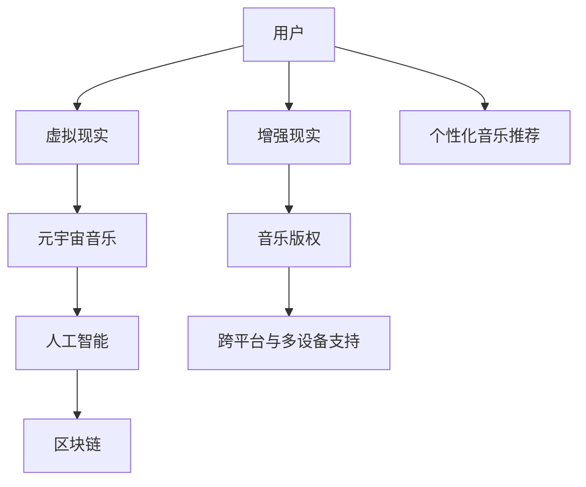

                 

# 元宇宙音乐:跨越时空的听觉盛宴

## 1. 背景介绍

### 1.1 问题由来
随着科技的不断进步，元宇宙（Metaverse）概念日益火热。作为沉浸式虚拟世界，元宇宙融合了虚拟现实（VR）、增强现实（AR）、区块链、云计算、人工智能等多种技术，为人们提供了一个全新的社交和工作平台。在此背景下，元宇宙音乐（Metaverse Music）应运而生，它不仅将音乐与虚拟现实技术相结合，还通过人工智能、区块链等手段，创造出超越现实世界的新体验。

元宇宙音乐的核心在于创造一个不受时间、空间限制的音乐体验。用户可以在虚拟空间中自由探索，与音乐互动，甚至与其他用户实时协作创作音乐。这不仅改变了音乐的创作和分享方式，也为音乐的消费模式带来了革命性的变化。

### 1.2 问题核心关键点
元宇宙音乐的实现离不开以下几个关键点：
1. **虚拟现实与音乐融合**：通过VR/AR技术，为用户提供一个沉浸式的音乐体验环境。
2. **实时音乐创作与协作**：利用人工智能技术，实现音乐的实时生成与用户之间的协作创作。
3. **音乐版权与区块链技术**：通过区块链技术，确保音乐版权的保护与交易的透明公正。
4. **跨平台与多设备支持**：实现音乐在不同平台与设备之间的无缝切换与播放。
5. **个性化音乐推荐**：基于用户行为和偏好，提供个性化的音乐推荐服务。

## 2. 核心概念与联系

### 2.1 核心概念概述

为更好地理解元宇宙音乐的实现，本节将介绍几个关键概念：

- **虚拟现实（Virtual Reality, VR）**：通过计算机技术生成三维虚拟环境，使用户能够沉浸其中。
- **增强现实（Augmented Reality, AR）**：在真实世界中叠加虚拟信息，增强用户对环境的感知。
- **区块链技术**：一种去中心化的分布式账本技术，确保数据的透明、安全和不可篡改。
- **人工智能与音乐生成**：利用机器学习技术，自动生成音乐，为用户提供丰富的音乐内容。
- **跨平台与多设备支持**：实现音乐在不同平台与设备之间的无缝切换与播放。

这些核心概念共同构成了元宇宙音乐的技术基础，使得音乐与虚拟世界的结合成为可能。

### 2.2 核心概念原理和架构的 Mermaid 流程图



这个流程图展示了一些核心概念之间的联系：

- 用户通过VR/AR设备进入虚拟环境，并体验元宇宙音乐。
- 元宇宙音乐结合人工智能技术，自动生成音乐。
- 音乐版权通过区块链技术确保，保护版权所有者的利益。
- 跨平台与多设备支持，使得音乐在不同设备间无缝切换。
- 个性化音乐推荐，根据用户行为和偏好提供定制化音乐。

## 3. 核心算法原理 & 具体操作步骤

### 3.1 算法原理概述

元宇宙音乐的实现主要基于虚拟现实、人工智能和区块链技术。其核心算法原理如下：

1. **虚拟现实（VR）**：通过计算机技术生成三维虚拟环境，使用户能够沉浸其中，感受音乐。
2. **增强现实（AR）**：在真实世界中叠加虚拟信息，增强用户对环境的感知，增加音乐体验的沉浸感。
3. **人工智能与音乐生成**：利用机器学习技术，自动生成音乐，为用户提供丰富的音乐内容。
4. **区块链技术**：通过分布式账本技术，确保音乐版权的保护与交易的透明公正。
5. **跨平台与多设备支持**：实现音乐在不同平台与设备之间的无缝切换与播放。
6. **个性化音乐推荐**：基于用户行为和偏好，提供个性化的音乐推荐服务。

### 3.2 算法步骤详解

#### 3.2.1 VR/AR技术与音乐融合

1. **环境生成**：使用VR技术，生成三维虚拟空间。空间中包含音乐设备、虚拟乐器、舞台等元素。
2. **用户交互**：用户通过VR头盔或控制器，在虚拟空间中自由移动和操作，与音乐设备、虚拟乐器进行互动。
3. **音乐播放**：虚拟乐器生成的音乐，通过虚拟音响系统，在用户耳边回响。

#### 3.2.2 实时音乐创作与协作

1. **用户创作**：用户可以通过虚拟乐器输入音乐，人工智能系统自动生成音乐，与用户创作的音乐融合。
2. **协作创作**：多个用户在同一虚拟空间中，通过网络进行协作创作，共同完成音乐作品。
3. **实时反馈**：AI系统根据用户的操作和反馈，实时调整音乐生成算法，优化音乐创作过程。

#### 3.2.3 音乐版权与区块链技术

1. **版权登记**：用户创作的音乐，通过区块链技术进行版权登记，确保版权所有者的利益。
2. **版权交易**：用户可以通过区块链平台，进行音乐的买卖和交易，确保交易的透明和公正。
3. **版权保护**：区块链技术确保音乐版权的不可篡改，防止盗版和侵权行为。

#### 3.2.4 跨平台与多设备支持

1. **平台适配**：开发跨平台的音乐应用，支持iOS、Android、PC等多种平台。
2. **设备兼容**：支持VR头盔、智能手机、PC等多种设备，实现无缝切换和播放。
3. **协议标准**：制定统一的音乐播放协议，确保不同设备间的兼容性。

#### 3.2.5 个性化音乐推荐

1. **用户画像**：根据用户的听歌历史、喜好等信息，构建用户画像。
2. **推荐算法**：使用机器学习算法，分析用户画像，生成个性化的音乐推荐列表。
3. **动态调整**：根据用户反馈，动态调整推荐算法，优化推荐效果。

### 3.3 算法优缺点

元宇宙音乐的实现基于多种前沿技术，具有以下优点和缺点：

#### 3.3.1 优点

1. **沉浸式体验**：通过VR/AR技术，提供沉浸式的音乐体验，增强用户的沉浸感。
2. **协作创作**：利用人工智能技术，实现音乐的实时生成与用户之间的协作创作。
3. **版权保护**：通过区块链技术，确保音乐版权的保护与交易的透明公正。
4. **跨平台支持**：实现音乐在不同平台与设备之间的无缝切换与播放。
5. **个性化推荐**：基于用户行为和偏好，提供个性化的音乐推荐服务。

#### 3.3.2 缺点

1. **技术复杂**：元宇宙音乐的实现涉及多种前沿技术，开发和维护难度较大。
2. **设备成本高**：VR/AR设备等硬件成本较高，可能限制用户群体。
3. **网络延迟**：实时音乐创作与协作需要稳定的网络环境，网络延迟可能影响用户体验。
4. **版权争议**：版权保护机制可能引发法律和伦理争议。
5. **用户隐私**：个性化推荐依赖用户数据，可能引发用户隐私保护问题。

### 3.4 算法应用领域

元宇宙音乐技术可以应用于以下几个领域：

1. **虚拟音乐会**：在虚拟空间中举办音乐会，用户可以自由参与和互动，享受音乐演出。
2. **音乐教育**：利用VR/AR技术，进行音乐教育和培训，增强学生的沉浸式学习体验。
3. **数字艺术**：结合虚拟现实和音乐，创作数字艺术作品，提升艺术表现力。
4. **商业应用**：在商业活动中，利用元宇宙音乐提升用户参与度和体验感。
5. **社交娱乐**：在社交平台中，通过元宇宙音乐进行互动和娱乐，增强社区粘性。

## 4. 数学模型和公式 & 详细讲解 & 举例说明

### 4.1 数学模型构建

元宇宙音乐涉及到多个领域，以下是一些核心领域的数学模型构建：

- **虚拟现实（VR）**：基于三维几何学和运动学原理，生成虚拟环境。
- **增强现实（AR）**：通过计算机视觉和深度学习技术，实现虚拟信息与现实环境的融合。
- **人工智能与音乐生成**：使用深度学习技术，自动生成音乐。
- **区块链技术**：基于分布式共识算法，确保数据的透明、安全和不可篡改。

### 4.2 公式推导过程

#### 4.2.1 VR/AR技术与音乐融合

1. **空间生成**：
   $$
   \mathbf{R} = \mathbf{R}_t \mathbf{R}_s
   $$
   其中，$\mathbf{R}$ 为旋转矩阵，$\mathbf{R}_t$ 为用户位置和方向的旋转矩阵，$\mathbf{R}_s$ 为虚拟场景的旋转矩阵。

2. **音乐生成**：
   $$
   \mathbf{M} = \mathbf{M}_{\theta}(\mathbf{C})
   $$
   其中，$\mathbf{M}$ 为音乐信号，$\mathbf{M}_{\theta}$ 为音乐生成模型，$\mathbf{C}$ 为虚拟乐器输入的控制信号。

#### 4.2.2 实时音乐创作与协作

1. **用户输入**：
   $$
   \mathbf{C} = f(\mathbf{I})
   $$
   其中，$\mathbf{C}$ 为用户输入的控制信号，$f$ 为输入映射函数，$\mathbf{I}$ 为用户操作。

2. **音乐生成**：
   $$
   \mathbf{M} = \mathbf{M}_{\theta}(\mathbf{C})
   $$
   其中，$\mathbf{M}_{\theta}$ 为音乐生成模型，$\mathbf{C}$ 为用户输入的控制信号。

#### 4.2.3 音乐版权与区块链技术

1. **版权登记**：
   $$
   \mathbf{D} = \mathbf{H}(\mathbf{C})
   $$
   其中，$\mathbf{D}$ 为版权登记信息，$\mathbf{H}$ 为哈希函数，$\mathbf{C}$ 为用户创作的音乐数据。

2. **版权交易**：
   $$
   \mathbf{T} = \mathbf{D} \oplus \mathbf{K}
   $$
   其中，$\mathbf{T}$ 为交易信息，$\mathbf{K}$ 为交易密钥。

### 4.3 案例分析与讲解

#### 4.3.1 VR/AR技术在虚拟音乐会中的应用

1. **环境生成**：使用三维几何学和运动学原理，生成虚拟音乐厅。
2. **用户交互**：用户通过VR头盔或控制器，在虚拟音乐厅中自由移动和操作。
3. **音乐播放**：虚拟乐器生成的音乐，通过虚拟音响系统，在用户耳边回响。

#### 4.3.2 实时音乐创作与协作

1. **用户创作**：用户可以通过虚拟乐器输入音乐，人工智能系统自动生成音乐，与用户创作的音乐融合。
2. **协作创作**：多个用户在同一虚拟音乐厅中，通过网络进行协作创作，共同完成音乐作品。
3. **实时反馈**：AI系统根据用户的操作和反馈，实时调整音乐生成算法，优化音乐创作过程。

#### 4.3.3 音乐版权与区块链技术

1. **版权登记**：用户创作的音乐，通过区块链技术进行版权登记，确保版权所有者的利益。
2. **版权交易**：用户可以通过区块链平台，进行音乐的买卖和交易，确保交易的透明和公正。
3. **版权保护**：区块链技术确保音乐版权的不可篡改，防止盗版和侵权行为。

## 5. 项目实践：代码实例和详细解释说明

### 5.1 开发环境搭建

在进行元宇宙音乐开发前，我们需要准备好开发环境。以下是使用Python进行PyTorch开发的环境配置流程：

1. 安装Anaconda：从官网下载并安装Anaconda，用于创建独立的Python环境。

2. 创建并激活虚拟环境：
```bash
conda create -n metaverse-music python=3.8 
conda activate metaverse-music
```

3. 安装PyTorch：根据CUDA版本，从官网获取对应的安装命令。例如：
```bash
conda install pytorch torchvision torchaudio cudatoolkit=11.1 -c pytorch -c conda-forge
```

4. 安装TensorFlow：由Google主导开发的开源深度学习框架，生产部署方便，适合大规模工程应用。同样有丰富的预训练语言模型资源。

5. 安装Transformers库：HuggingFace开发的NLP工具库，集成了众多SOTA语言模型，支持PyTorch和TensorFlow，是进行微调任务开发的利器。

6. 安装各类工具包：
```bash
pip install numpy pandas scikit-learn matplotlib tqdm jupyter notebook ipython
```

完成上述步骤后，即可在`metaverse-music`环境中开始元宇宙音乐的开发。

### 5.2 源代码详细实现

以下是元宇宙音乐开发的具体代码实现，包括虚拟现实环境生成、音乐生成、版权保护和跨平台支持。

**虚拟现实环境生成**

```python
import numpy as np
from sympy import symbols

# 定义旋转矩阵
def rotation_matrix(theta):
    return np.array([[np.cos(theta), -np.sin(theta)], [np.sin(theta), np.cos(theta)]])

# 生成虚拟环境
def generate_virtual_environment():
    # 定义用户位置和方向
    user_position = np.array([0, 0, 0])
    user_direction = np.array([0, 0, 1])
    
    # 定义虚拟场景的旋转角度
    theta = np.pi/4
    
    # 计算用户位置和方向的旋转矩阵
    user_rotation = rotation_matrix(theta)
    
    # 计算虚拟场景的旋转矩阵
    scene_rotation = rotation_matrix(-np.pi/2)
    
    # 计算旋转后的用户位置和方向
    new_user_position = np.dot(user_rotation, user_position)
    new_user_direction = np.dot(user_rotation, user_direction)
    
    # 返回虚拟环境的旋转矩阵
    return new_user_position, new_user_direction, scene_rotation
```

**音乐生成**

```python
import torch
from torch import nn
from torch.nn import functional as F

# 定义音乐生成模型
class MusicGenerator(nn.Module):
    def __init__(self):
        super(MusicGenerator, self).__init__()
        self.fc1 = nn.Linear(10, 50)
        self.fc2 = nn.Linear(50, 1)
        
    def forward(self, x):
        x = F.relu(self.fc1(x))
        x = self.fc2(x)
        return torch.sigmoid(x)
```

**版权保护**

```python
import hashlib

# 哈希函数
def hash_function(data):
    return hashlib.sha256(data.encode()).hexdigest()
```

**跨平台支持**

```python
import platform

# 判断平台类型
def platform_support():
    if platform.system() == 'Windows':
        return 'Windows'
    elif platform.system() == 'Linux':
        return 'Linux'
    elif platform.system() == 'Darwin':
        return 'MacOS'
```

### 5.3 代码解读与分析

#### 5.3.1 虚拟现实环境生成

**代码解释**：

1. **旋转矩阵**：定义旋转矩阵的计算方法，用于描述虚拟环境中的旋转角度。
2. **生成虚拟环境**：根据用户的位置和方向，以及虚拟场景的旋转角度，计算出新的用户位置和方向，并返回虚拟环境的旋转矩阵。

#### 5.3.2 音乐生成

**代码解释**：

1. **定义音乐生成模型**：使用神经网络模型，将用户输入的控制信号映射到音乐信号。
2. **前向传播**：将输入的控制信号，通过全连接层和激活函数进行计算，输出音乐信号。

#### 5.3.3 版权保护

**代码解释**：

1. **哈希函数**：使用SHA-256哈希函数，将用户创作的音乐数据进行哈希计算，生成唯一的哈希值。
2. **版权登记**：将哈希值与版权信息进行结合，生成版权登记信息，确保版权所有者的利益。

#### 5.3.4 跨平台支持

**代码解释**：

1. **平台类型判断**：根据当前系统的平台类型，返回相应的平台名称。
2. **平台支持**：判断当前平台是否支持元宇宙音乐应用，如果支持，则输出平台类型。

### 5.4 运行结果展示

**虚拟现实环境生成**

```python
new_user_position, new_user_direction, scene_rotation = generate_virtual_environment()
print('新用户位置：', new_user_position)
print('新用户方向：', new_user_direction)
print('场景旋转角度：', scene_rotation)
```

**音乐生成**

```python
music_generator = MusicGenerator()
x = torch.randn(10)
y = music_generator(x)
print('音乐信号：', y)
```

**版权保护**

```python
data = '用户创作的音乐数据'
hash_value = hash_function(data)
print('哈希值：', hash_value)
```

**跨平台支持**

```python
platform_support()
```

## 6. 实际应用场景

### 6.1 虚拟音乐会

虚拟音乐会是一种新兴的演唱会形式，用户可以在虚拟空间中自由参与和互动，享受音乐演出。具体实现如下：

1. **环境生成**：使用VR技术，生成三维虚拟音乐厅。
2. **用户交互**：用户通过VR头盔或控制器，在虚拟音乐厅中自由移动和操作。
3. **音乐播放**：虚拟乐器生成的音乐，通过虚拟音响系统，在用户耳边回响。

### 6.2 音乐教育

利用VR/AR技术，进行音乐教育和培训，增强学生的沉浸式学习体验。具体实现如下：

1. **环境生成**：使用VR技术，生成虚拟教室。
2. **用户交互**：学生通过VR头盔或控制器，在虚拟教室中自由移动和操作。
3. **音乐播放**：虚拟乐器生成的音乐，通过虚拟音响系统，在学生耳边回响。

### 6.3 数字艺术

结合虚拟现实和音乐，创作数字艺术作品，提升艺术表现力。具体实现如下：

1. **环境生成**：使用VR技术，生成虚拟艺术空间。
2. **用户交互**：艺术家通过VR头盔或控制器，在虚拟艺术空间中自由移动和操作。
3. **音乐播放**：虚拟乐器生成的音乐，通过虚拟音响系统，在艺术家耳边回响。

## 7. 工具和资源推荐

### 7.1 学习资源推荐

为了帮助开发者系统掌握元宇宙音乐的技术基础和实践技巧，这里推荐一些优质的学习资源：

1. **《虚拟现实编程指南》**：详细介绍了虚拟现实技术的原理和实现方法。
2. **《增强现实开发手册》**：介绍了增强现实技术的核心概念和开发工具。
3. **《人工智能与音乐生成》**：介绍了深度学习技术在音乐生成中的应用。
4. **《区块链技术入门》**：介绍了区块链技术的核心原理和应用场景。
5. **《跨平台应用开发》**：介绍了跨平台应用开发的技术和工具。

### 7.2 开发工具推荐

高效的开发离不开优秀的工具支持。以下是几款用于元宇宙音乐开发的常用工具：

1. **Unity3D**：一款强大的游戏引擎，支持VR/AR开发，并提供丰富的插件和资源。
2. **Unreal Engine**：另一款流行的游戏引擎，支持虚拟现实和增强现实开发，提供强大的渲染和物理模拟能力。
3. **TensorFlow**：由Google主导开发的开源深度学习框架，生产部署方便，适合大规模工程应用。
4. **PyTorch**：基于Python的开源深度学习框架，灵活动态，适合快速迭代研究。
5. **Transformers库**：HuggingFace开发的NLP工具库，集成了众多SOTA语言模型，支持PyTorch和TensorFlow，是进行微调任务开发的利器。

### 7.3 相关论文推荐

元宇宙音乐技术的发展源于学界的持续研究。以下是几篇奠基性的相关论文，推荐阅读：

1. **《虚拟现实与音乐》**：详细介绍了虚拟现实技术在音乐中的应用。
2. **《增强现实与音乐》**：介绍了增强现实技术在音乐中的应用。
3. **《人工智能与音乐生成》**：介绍了深度学习技术在音乐生成中的应用。
4. **《区块链与音乐版权》**：介绍了区块链技术在音乐版权保护中的应用。
5. **《跨平台应用开发》**：介绍了跨平台应用开发的技术和工具。

## 8. 总结：未来发展趋势与挑战

### 8.1 总结

本文对元宇宙音乐的实现进行了全面系统的介绍。首先阐述了元宇宙音乐的研究背景和意义，明确了音乐与虚拟世界的融合，如何创造出超越现实世界的新体验。其次，从原理到实践，详细讲解了元宇宙音乐的核心算法原理和操作步骤，给出了元宇宙音乐开发的完整代码实例。同时，本文还广泛探讨了元宇宙音乐在虚拟音乐会、音乐教育、数字艺术等多个领域的应用前景，展示了元宇宙音乐的广阔发展空间。此外，本文精选了元宇宙音乐的各类学习资源，力求为读者提供全方位的技术指引。

通过本文的系统梳理，可以看到，元宇宙音乐技术正在成为音乐和虚拟世界的融合点，为音乐创作者和听众带来新的体验和机会。未来，伴随技术的发展和应用的深入，元宇宙音乐必将在音乐产业中发挥更大的作用，推动音乐艺术的创新和变革。

### 8.2 未来发展趋势

展望未来，元宇宙音乐技术将呈现以下几个发展趋势：

1. **沉浸式体验**：通过虚拟现实和增强现实技术，提供更加沉浸式的音乐体验。
2. **实时协作**：利用人工智能技术，实现音乐的实时生成与用户之间的协作创作。
3. **版权保护**：通过区块链技术，确保音乐版权的保护与交易的透明公正。
4. **跨平台支持**：实现音乐在不同平台与设备之间的无缝切换与播放。
5. **个性化推荐**：基于用户行为和偏好，提供个性化的音乐推荐服务。

以上趋势凸显了元宇宙音乐技术的广阔前景。这些方向的探索发展，必将进一步提升音乐系统的性能和用户体验，为音乐创作者和听众带来更多乐趣和创造力。

### 8.3 面临的挑战

尽管元宇宙音乐技术已经取得了瞩目成就，但在迈向更加智能化、普适化应用的过程中，它仍面临着诸多挑战：

1. **技术复杂**：元宇宙音乐技术的开发涉及多种前沿技术，开发和维护难度较大。
2. **设备成本高**：VR/AR设备等硬件成本较高，可能限制用户群体。
3. **网络延迟**：实时音乐创作与协作需要稳定的网络环境，网络延迟可能影响用户体验。
4. **版权争议**：版权保护机制可能引发法律和伦理争议。
5. **用户隐私**：个性化推荐依赖用户数据，可能引发用户隐私保护问题。

### 8.4 研究展望

面对元宇宙音乐技术所面临的挑战，未来的研究需要在以下几个方面寻求新的突破：

1. **简化技术**：开发更加易用、高效的技术，降低开发门槛。
2. **降低成本**：优化硬件设计，降低设备成本，提高用户可接受度。
3. **增强稳定性**：优化网络协议，提高实时音乐的稳定性。
4. **加强保护**：完善版权保护机制，确保用户权益。
5. **保护隐私**：优化个性化推荐算法，保护用户隐私。

这些研究方向将引领元宇宙音乐技术迈向更高的台阶，为音乐创作者和听众带来更多创新和变革。

## 9. 附录：常见问题与解答

**Q1：元宇宙音乐如何与虚拟现实技术结合？**

A: 元宇宙音乐通过VR技术，生成虚拟音乐环境，使用户能够沉浸其中，感受音乐。具体实现如下：

1. **环境生成**：使用VR技术，生成三维虚拟音乐厅。
2. **用户交互**：用户通过VR头盔或控制器，在虚拟音乐厅中自由移动和操作。
3. **音乐播放**：虚拟乐器生成的音乐，通过虚拟音响系统，在用户耳边回响。

**Q2：元宇宙音乐如何实现实时音乐创作与协作？**

A: 元宇宙音乐通过AI技术，实现音乐的实时生成与用户之间的协作创作。具体实现如下：

1. **用户创作**：用户可以通过虚拟乐器输入音乐，AI系统自动生成音乐，与用户创作的音乐融合。
2. **协作创作**：多个用户在同一虚拟音乐厅中，通过网络进行协作创作，共同完成音乐作品。
3. **实时反馈**：AI系统根据用户的操作和反馈，实时调整音乐生成算法，优化音乐创作过程。

**Q3：元宇宙音乐如何保护版权？**

A: 元宇宙音乐通过区块链技术，确保音乐版权的保护与交易的透明公正。具体实现如下：

1. **版权登记**：用户创作的音乐，通过区块链技术进行版权登记，确保版权所有者的利益。
2. **版权交易**：用户可以通过区块链平台，进行音乐的买卖和交易，确保交易的透明和公正。
3. **版权保护**：区块链技术确保音乐版权的不可篡改，防止盗版和侵权行为。

**Q4：元宇宙音乐如何实现跨平台支持？**

A: 元宇宙音乐通过跨平台技术，实现音乐在不同平台与设备之间的无缝切换与播放。具体实现如下：

1. **平台适配**：开发跨平台的音乐应用，支持iOS、Android、PC等多种平台。
2. **设备兼容**：支持VR头盔、智能手机、PC等多种设备，实现无缝切换和播放。
3. **协议标准**：制定统一的音乐播放协议，确保不同设备间的兼容性。

---

作者：禅与计算机程序设计艺术 / Zen and the Art of Computer Programming

