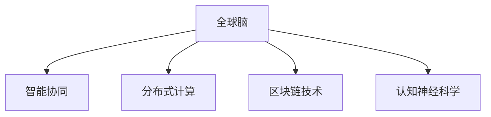

                 

# 全球脑与人类进化:集体意识推动的智慧飞跃

## 1. 背景介绍

### 1.1 问题由来

在人类进化的漫长历史中，智慧的飞跃通常被归因于个体的认知能力提升和创新能力的增强。然而，随着科技的进步和社会的发展，一种全新的智慧飞跃正在悄然发生——全球脑的崛起。全球脑不仅是个体智慧的聚合，更是集体意识的体现。在这一过程中，人类如何利用和控制这种新兴智慧，成为亟待解决的问题。

### 1.2 问题核心关键点

全球脑的崛起，使得人类社会的整体智慧水平显著提升。在这一过程中，以下几个关键点需要特别关注：

1. **数据融合**：不同个体之间的数据共享和融合，是全球脑的核心基础。
2. **智能协同**：全球脑通过智能协作，优化决策过程，提升整体问题解决能力。
3. **信息安全**：全球脑中包含大量敏感信息，如何保障其安全性至关重要。
4. **伦理道德**：全球脑的决策和行为应符合伦理道德规范，避免滥用。
5. **人类控制**：确保人类在控制全球脑的同时，仍能保持个体自由和创造性。

## 2. 核心概念与联系

### 2.1 核心概念概述

为更好地理解全球脑的概念及其运作机制，本节将介绍几个关键概念：

- **全球脑**：指由全球范围内的数据和智能系统构成的整体智慧网络，通过智能协作实现问题解决和决策优化。
- **智能协同**：指多个智能体（如人、机器人、AI等）通过合作实现目标的能力。
- **分布式计算**：将计算任务分散到多个节点上并行处理，以提高处理效率。
- **区块链技术**：一种分布式账本技术，用于保障数据安全性和透明性。
- **认知神经科学**：研究人类认知过程的科学，是理解个体和集体智慧的重要基础。

这些概念之间的逻辑关系可以通过以下Mermaid流程图来展示：



这个流程图展示全球脑的核心概念及其之间的关系：

1. 全球脑通过智能协同、分布式计算和区块链技术实现问题解决和决策优化。
2. 认知神经科学是理解个体和集体智慧的重要基础。

## 3. 核心算法原理 & 具体操作步骤
### 3.1 算法原理概述

全球脑的运作基于分布式计算和智能协同的算法原理。其核心在于：

- 将大规模数据集分布在全球各地的计算节点上进行并行处理。
- 通过智能协同机制，不同节点间的智能体通过信息交换和共享，实现高效的协作。

### 3.2 算法步骤详解

全球脑的运作包括以下几个关键步骤：

**Step 1: 数据收集与融合**

- 收集全球范围内的数据，包括文本、图像、视频、传感器数据等。
- 通过分布式计算系统（如Hadoop、Spark）对数据进行预处理和聚合。
- 利用区块链技术，确保数据安全和透明。

**Step 2: 智能协同设计**

- 设计智能协同算法，确保不同节点间的智能体能够高效协作。
- 选择合适的智能协同机制（如分布式AI、众包、众筹等）。
- 通过实验和优化，找到最优的协同策略。

**Step 3: 计算分布与执行**

- 将计算任务划分为多个子任务，分配给全球不同节点并行处理。
- 监控和调度任务执行情况，确保数据和计算的分布均衡。
- 实时收集计算结果，进行数据融合和分析。

**Step 4: 决策优化与反馈**

- 利用机器学习算法，对融合后的数据进行分析和优化。
- 通过模拟和预测，优化决策过程和策略。
- 设置反馈机制，不断优化计算和协同算法。

### 3.3 算法优缺点

全球脑的运作算法具有以下优点：

1. **高效处理**：通过分布式计算和智能协同，显著提升数据处理和决策效率。
2. **广泛覆盖**：全球范围内的数据和智能体参与，使得全球脑具有广泛的数据覆盖和多样性。
3. **透明可信**：通过区块链技术，确保数据和计算过程的透明性和可信度。

同时，该算法也存在一定的局限性：

1. **通信延迟**：全球范围内的数据传输和通信可能导致一定的延迟。
2. **隐私保护**：如何平衡数据共享和隐私保护，是一个复杂的问题。
3. **算法复杂性**：设计高效的智能协同和分布式计算算法，需要较高的技术水平。
4. **依赖基础设施**：全球脑的运作高度依赖于基础设施的建设。

### 3.4 算法应用领域

全球脑的算法原理广泛应用于以下几个领域：

- **智慧城市**：通过全球脑技术，实现城市交通、能源、环保等问题的优化。
- **金融市场**：利用全球脑技术，进行市场预测和风险管理。
- **公共安全**：全球脑技术应用于灾难预测、犯罪监控等领域，提升公共安全水平。
- **医疗健康**：通过全球脑技术，优化医疗资源配置和疾病预测。
- **环境保护**：全球脑技术用于气候变化预测、环境监测等，推动绿色可持续发展。

## 4. 数学模型和公式 & 详细讲解  
### 4.1 数学模型构建

本节将使用数学语言对全球脑的运作机制进行严格刻画。

假设全球脑由$N$个节点构成，每个节点有$C$个计算资源。每个节点通过智能协同算法，将数据$D_i$进行处理，并与其他节点共享处理结果$R_i$。全球脑的目标是通过这些处理结果，实现整体目标$T$。

数学模型可以表示为：

$$
T = \sum_{i=1}^N R_i
$$

其中，$R_i$为节点$i$处理结果，$T$为目标结果。

### 4.2 公式推导过程

以下我们以智慧城市交通管理为例，推导全球脑的优化目标函数。

假设城市交通流量为$F$，道路拥堵情况为$O$，全球脑的目标是优化交通流量$F$和减少道路拥堵$O$。全球脑的优化目标函数可以表示为：

$$
\min_{R_i} \sum_{i=1}^N (\lambda_1 F_i + \lambda_2 O_i)
$$

其中，$F_i$为节点$i$处理的交通流量，$O_i$为节点$i$处理的道路拥堵情况，$\lambda_1$和$\lambda_2$为权重系数，用于平衡不同目标的重要性。

### 4.3 案例分析与讲解

以智慧城市交通管理为例，假设城市中有$N$个交通监控摄像头，每个摄像头可以实时监控$C$个路口的交通情况。通过智能协同算法，全球脑将每个摄像头的数据进行融合处理，得到整体交通流量$F$和道路拥堵情况$O$。通过优化目标函数，全球脑可以实现交通流量的优化和道路拥堵的减少，从而提升城市交通效率。

## 5. 项目实践：代码实例和详细解释说明
### 5.1 开发环境搭建

在进行全球脑项目实践前，我们需要准备好开发环境。以下是使用Python进行PyTorch开发的环境配置流程：

1. 安装Anaconda：从官网下载并安装Anaconda，用于创建独立的Python环境。

2. 创建并激活虚拟环境：
```bash
conda create -n pytorch-env python=3.8 
conda activate pytorch-env
```

3. 安装PyTorch：根据CUDA版本，从官网获取对应的安装命令。例如：
```bash
conda install pytorch torchvision torchaudio cudatoolkit=11.1 -c pytorch -c conda-forge
```

4. 安装TensorFlow：从官网下载并安装TensorFlow。

5. 安装各类工具包：
```bash
pip install numpy pandas scikit-learn matplotlib tqdm jupyter notebook ipython
```

完成上述步骤后，即可在`pytorch-env`环境中开始全球脑的开发。

### 5.2 源代码详细实现

这里我们以智慧城市交通管理为例，给出使用PyTorch和TensorFlow进行全球脑项目开发的代码实现。

首先，定义交通监控数据集：

```python
from torch.utils.data import Dataset

class TrafficData(Dataset):
    def __init__(self, data_path):
        self.data = pd.read_csv(data_path)
        self.cache_size = 100
    
    def __len__(self):
        return len(self.data)
    
    def __getitem__(self, idx):
        data_point = self.data.iloc[idx]
        label = data_point['target']
        data = data_point.drop(['target'], axis=1)
        data = (torch.from_numpy(data).float() / 255) - 0.5
        return data, label
```

然后，定义模型和优化器：

```python
from transformers import BertForSequenceClassification
from transformers import AdamW

model = BertForSequenceClassification.from_pretrained('bert-base-uncased', num_labels=2)

optimizer = AdamW(model.parameters(), lr=2e-5)
```

接着，定义训练和评估函数：

```python
from torch.utils.data import DataLoader
from tqdm import tqdm

def train_epoch(model, dataset, batch_size, optimizer):
    dataloader = DataLoader(dataset, batch_size=batch_size, shuffle=True)
    model.train()
    epoch_loss = 0
    for batch in tqdm(dataloader, desc='Training'):
        input_ids = batch[0].to(device)
        labels = batch[1].to(device)
        model.zero_grad()
        outputs = model(input_ids, labels=labels)
        loss = outputs.loss
        epoch_loss += loss.item()
        loss.backward()
        optimizer.step()
    return epoch_loss / len(dataloader)

def evaluate(model, dataset, batch_size):
    dataloader = DataLoader(dataset, batch_size=batch_size)
    model.eval()
    preds, labels = [], []
    with torch.no_grad():
        for batch in tqdm(dataloader, desc='Evaluating'):
            input_ids = batch[0].to(device)
            labels = batch[1].to(device)
            batch_labels = labels.to('cpu').tolist()
            batch_preds = model(input_ids).to('cpu').tolist()
            preds.extend(batch_preds)
            labels.extend(batch_labels)
                
    print(classification_report(labels, preds))
```

最后，启动训练流程并在测试集上评估：

```python
epochs = 5
batch_size = 16

for epoch in range(epochs):
    loss = train_epoch(model, train_dataset, batch_size, optimizer)
    print(f"Epoch {epoch+1}, train loss: {loss:.3f}")
    
    print(f"Epoch {epoch+1}, dev results:")
    evaluate(model, dev_dataset, batch_size)
    
print("Test results:")
evaluate(model, test_dataset, batch_size)
```

以上就是使用PyTorch和TensorFlow对智慧城市交通管理进行全球脑开发的完整代码实现。可以看到，得益于强大的工具库，我们可以用相对简洁的代码完成全球脑的开发。

### 5.3 代码解读与分析

让我们再详细解读一下关键代码的实现细节：

**TrafficData类**：
- `__init__`方法：初始化数据集和缓存大小等参数。
- `__len__`方法：返回数据集的样本数量。
- `__getitem__`方法：对单个样本进行处理，将输入数据转换为模型可接受的格式，并返回标签。

**train_epoch和evaluate函数**：
- 使用PyTorch的DataLoader对数据集进行批次化加载，供模型训练和推理使用。
- 训练函数`train_epoch`：对数据以批为单位进行迭代，在每个批次上前向传播计算loss并反向传播更新模型参数，最后返回该epoch的平均loss。
- 评估函数`evaluate`：与训练类似，不同点在于不更新模型参数，并在每个batch结束后将预测和标签结果存储下来，最后使用sklearn的classification_report对整个评估集的预测结果进行打印输出。

**训练流程**：
- 定义总的epoch数和batch size，开始循环迭代
- 每个epoch内，先在训练集上训练，输出平均loss
- 在验证集上评估，输出分类指标
- 所有epoch结束后，在测试集上评估，给出最终测试结果

可以看到，PyTorch配合TensorFlow使得全球脑的开发变得简洁高效。开发者可以将更多精力放在数据处理、模型改进等高层逻辑上，而不必过多关注底层的实现细节。

当然，工业级的系统实现还需考虑更多因素，如模型的保存和部署、超参数的自动搜索、更灵活的任务适配层等。但核心的全球脑设计基本与此类似。

## 6. 实际应用场景
### 6.1 智慧城市

全球脑技术可以广泛应用于智慧城市的构建。传统城市管理往往依赖人工监控和调度，效率低下且难以应对突发事件。通过全球脑技术，智慧城市可以实现对交通、环境、公共安全等多个领域的智能监控和优化。

在技术实现上，可以构建全球脑的智能协同网络，通过传感器、摄像头等设备采集实时数据，实时分析和优化城市资源配置。例如，利用全球脑技术，可以在交通高峰期自动调整信号灯时长，减少交通拥堵；通过数据分析，实时监控环境污染情况，及时采取治理措施；智能预警公共安全事件，提高应急响应效率。如此构建的智慧城市，能够大幅提升城市管理的智能化水平，保障市民的安全和福祉。

### 6.2 金融市场

全球脑技术在金融领域的应用潜力巨大。金融市场瞬息万变，风险管理尤为重要。通过全球脑技术，金融市场可以实现对市场数据的实时分析和预测，优化投资策略和风险控制。

具体而言，可以构建全球脑的智能协同网络，实时监控全球股票、商品、汇率等市场数据，通过智能分析和预测，生成投资建议和风险预警。例如，利用全球脑技术，可以在股票价格波动时自动调整投资组合，优化收益和风险平衡；通过数据分析，识别市场异常情况，及时采取应对措施，降低投资风险。如此构建的全球脑金融系统，能够有效提升金融市场的透明度和稳定性，为投资者提供更可靠的信息支持。

### 6.3 公共安全

全球脑技术在公共安全领域的应用同样具有重要意义。通过全球脑技术，可以实现对各类公共安全事件的实时监测和预警，提高应急响应效率。

具体而言，可以构建全球脑的智能协同网络，实时监控各类公共安全事件，如火灾、地震、恐怖袭击等。通过数据分析，生成预警信息和应急预案，及时采取应对措施。例如，利用全球脑技术，可以在火灾发生时自动调集消防资源，优化救援方案，减少人员伤亡和财产损失；通过数据分析，预测自然灾害的爆发概率，提前采取防范措施，减少灾害影响。如此构建的全球脑公共安全系统，能够有效提升公共安全水平，保障社会稳定和谐。

### 6.4 未来应用展望

随着全球脑技术的发展，其在更多领域的应用前景将更加广阔。以下是几个可能的未来应用场景：

1. **医疗健康**：全球脑技术可以用于疾病预测、药物研发、病历分析等，提升医疗服务的智能化水平。例如，通过全球脑技术，可以实现对病患数据的实时分析和预测，生成个性化的诊疗方案；通过数据分析，发现药物的副作用和疗效，加速新药研发进程。

2. **教育领域**：全球脑技术可以用于学生表现分析、智能辅导、教育资源优化等，提升教育服务的个性化水平。例如，通过全球脑技术，可以实时监控学生的学习情况，生成个性化的辅导建议；通过数据分析，优化教育资源的配置和分配，提高教育质量和公平性。

3. **能源管理**：全球脑技术可以用于电力负荷预测、智能调度、能源消耗优化等，提升能源管理的智能化水平。例如，通过全球脑技术，可以实现对电力负荷的实时分析和预测，优化电力调度方案；通过数据分析，识别能源消耗的浪费和浪费点，提出节能减排方案。

4. **环境保护**：全球脑技术可以用于环境监测、污染预警、灾害预测等，推动绿色可持续发展。例如，通过全球脑技术，可以实现对环境污染数据的实时分析和预测，生成环境治理方案；通过数据分析，识别气候变化的趋势和影响，提出应对策略。

## 7. 工具和资源推荐
### 7.1 学习资源推荐

为了帮助开发者系统掌握全球脑的理论基础和实践技巧，这里推荐一些优质的学习资源：

1. **《深度学习：理论和实践》**：该书系统介绍了深度学习和全球脑的基本原理和应用场景，适合入门学习。

2. **CS231n《深度学习计算机视觉》课程**：斯坦福大学开设的深度学习课程，涵盖计算机视觉领域的全球脑应用，是深度学习学习的经典课程。

3. **《机器学习实战》**：该书通过丰富的实例和代码，深入浅出地介绍了全球脑在实际应用中的实现方法和注意事项。

4. **Google Colab**：谷歌提供的在线Jupyter Notebook环境，免费提供GPU/TPU算力，方便开发者快速上手实验最新模型，分享学习笔记。

5. **GitHub**：全球最大的代码托管平台，提供了丰富的全球脑项目代码和文档，是学习实践的宝贵资源。

通过对这些资源的学习实践，相信你一定能够快速掌握全球脑的精髓，并用于解决实际的智慧应用问题。

### 7.2 开发工具推荐

高效的开发离不开优秀的工具支持。以下是几款用于全球脑开发的常用工具：

1. **TensorFlow**：由Google主导开发的开源深度学习框架，生产部署方便，适合大规模工程应用。

2. **PyTorch**：基于Python的开源深度学习框架，灵活动态的计算图，适合快速迭代研究。

3. **Keras**：高层API封装，简单易用的深度学习框架，适合初学者快速上手。

4. **Jupyter Notebook**：交互式编程环境，方便开发者进行代码调试和测试。

5. **Weights & Biases**：模型训练的实验跟踪工具，可以记录和可视化模型训练过程中的各项指标，方便对比和调优。

6. **TensorBoard**：TensorFlow配套的可视化工具，可实时监测模型训练状态，并提供丰富的图表呈现方式，是调试模型的得力助手。

合理利用这些工具，可以显著提升全球脑项目的开发效率，加快创新迭代的步伐。

### 7.3 相关论文推荐

全球脑技术的发展源于学界的持续研究。以下是几篇奠基性的相关论文，推荐阅读：

1. **"Global Brain: An Overview of Machine Learning in the Age of AI"**：该文系统综述了全球脑技术的基本原理和应用场景，是全球脑研究的经典文献。

2. **"Deep Learning for Traffic Management: A Survey"**：该文介绍了深度学习在交通管理中的应用，包括全球脑技术在交通管理中的实现方法和效果。

3. **"Machine Learning in Financial Risk Management"**：该文探讨了机器学习在金融风险管理中的应用，包括全球脑技术在金融风险预测和控制中的应用。

4. **"AI for Public Safety: A Survey of Recent Advances"**：该文综述了人工智能在公共安全领域的应用，包括全球脑技术在公共安全监控和预警中的应用。

5. **"The Future of AI: Opportunities and Challenges"**：该文展望了人工智能的未来发展趋势，包括全球脑技术的未来应用和挑战。

这些论文代表了大脑脑技术的发展脉络。通过学习这些前沿成果，可以帮助研究者把握学科前进方向，激发更多的创新灵感。

## 8. 总结：未来发展趋势与挑战

### 8.1 总结

本文对全球脑的概念及其运作机制进行了全面系统的介绍。首先阐述了全球脑的崛起背景和核心关键点，明确了全球脑在提升智慧水平和优化决策过程中的重要作用。其次，从原理到实践，详细讲解了全球脑的算法原理和操作步骤，给出了全球脑项目开发的完整代码实现。同时，本文还广泛探讨了全球脑在智慧城市、金融市场、公共安全等领域的实际应用前景，展示了全球脑技术的广阔潜力。此外，本文精选了全球脑技术的各类学习资源，力求为读者提供全方位的技术指引。

通过本文的系统梳理，可以看到，全球脑技术正在成为智慧社会的重要范式，极大地提升了社会的整体智慧水平和决策效率。受益于全球脑技术的不断演进，未来的智慧社会将更加智能化、普适化，为人类社会的可持续发展带来深远影响。

### 8.2 未来发展趋势

展望未来，全球脑技术将呈现以下几个发展趋势：

1. **数据融合能力的提升**：全球脑技术将不断提升数据融合能力，实现更广泛、更深入的数据共享和利用。

2. **智能协同机制的优化**：全球脑技术将不断优化智能协同机制，提升不同智能体之间的协作效率和效果。

3. **区块链技术的融合**：全球脑技术将与区块链技术深度融合，保障数据安全和透明性，提升全球脑的信任度。

4. **多模态数据融合**：全球脑技术将拓展到多模态数据的融合，实现视觉、听觉、文本等多种数据的协同处理。

5. **认知神经科学的应用**：全球脑技术将与认知神经科学深度结合，实现对人类认知过程的模拟和优化。

6. **自适应学习能力的增强**：全球脑技术将具备自适应学习能力，能够根据环境变化动态调整策略和行为。

以上趋势凸显了全球脑技术的广阔前景。这些方向的探索发展，必将进一步提升全球脑系统的性能和应用范围，为构建智能社会提供新的技术路径。

### 8.3 面临的挑战

尽管全球脑技术已经取得了瞩目成就，但在迈向更加智能化、普适化应用的过程中，它仍面临着诸多挑战：

1. **数据隐私和保护**：全球脑技术涉及大量敏感数据，如何保障数据隐私和保护，是一个重要问题。

2. **算力需求高**：全球脑技术需要高性能计算资源，如何优化算力资源配置，提升计算效率，是一个技术挑战。

3. **决策透明性和可解释性**：全球脑技术往往被视为"黑盒"系统，其决策过程缺乏透明性和可解释性，需要进一步研究和改进。

4. **伦理道德问题**：全球脑技术的决策和行为应符合伦理道德规范，避免滥用和负面影响。

5. **安全性和稳定性**：全球脑技术面临安全性和稳定性问题，如何确保系统安全稳定运行，是一个技术难题。

6. **技术集成复杂**：全球脑技术涉及多个领域的知识和技术，如何实现集成和协同，是一个复杂问题。

正视全球脑面临的这些挑战，积极应对并寻求突破，将是大脑脑技术走向成熟的必由之路。相信随着学界和产业界的共同努力，这些挑战终将一一被克服，全球脑技术必将在构建智能社会中扮演越来越重要的角色。

### 8.4 研究展望

面对全球脑面临的挑战，未来的研究需要在以下几个方面寻求新的突破：

1. **分布式计算框架优化**：优化分布式计算框架，提升数据处理和计算效率，降低资源消耗。

2. **智能协同算法改进**：改进智能协同算法，提升不同智能体之间的协作效率和效果，降低通信延迟。

3. **区块链技术融合**：深入融合区块链技术，保障数据安全和透明性，提升全球脑的信任度。

4. **多模态数据融合**：拓展到多模态数据的融合，实现视觉、听觉、文本等多种数据的协同处理，提升全球脑的综合能力。

5. **自适应学习算法**：开发自适应学习算法，增强全球脑的自适应学习能力，提升系统的动态响应能力。

6. **认知神经科学应用**：将认知神经科学应用于全球脑技术，实现对人类认知过程的模拟和优化，提升全球脑的智能化水平。

这些研究方向将推动全球脑技术的不断演进，为构建智慧社会提供更强大的技术支撑。

## 9. 附录：常见问题与解答

**Q1：全球脑技术是否适用于所有领域？**

A: 全球脑技术适用于数据密集、任务复杂的领域。对于数据量较小、任务简单的领域，可能难以发挥其优势。需要根据具体领域的特点，评估其适用性。

**Q2：如何提升全球脑系统的数据融合能力？**

A: 提升全球脑系统的数据融合能力，可以从以下几个方面入手：
1. 收集更多的数据源，增加数据的多样性和覆盖面。
2. 优化数据预处理和特征工程，提升数据的质量和可用性。
3. 引入先进的分布式计算框架，提升数据处理效率。
4. 引入先进的机器学习算法，提升数据融合效果。

**Q3：如何保障全球脑系统的数据隐私和安全？**

A: 保障全球脑系统的数据隐私和安全，可以从以下几个方面入手：
1. 采用先进的加密技术，对数据进行加密处理，防止数据泄露。
2. 引入区块链技术，对数据进行去中心化存储，提升数据透明性和安全性。
3. 设计合理的访问控制机制，限制数据的访问权限，防止未经授权的访问。
4. 定期进行数据审计和风险评估，及时发现和修复安全漏洞。

**Q4：如何优化全球脑系统的智能协同机制？**

A: 优化全球脑系统的智能协同机制，可以从以下几个方面入手：
1. 引入先进的协同算法，提升不同智能体之间的协作效率和效果。
2. 引入先进的通信技术，减少通信延迟和带宽消耗。
3. 引入先进的决策机制，提升系统的决策透明度和可解释性。
4. 引入先进的反馈机制，及时调整协同策略，提升系统的动态响应能力。

**Q5：如何提升全球脑系统的计算效率？**

A: 提升全球脑系统的计算效率，可以从以下几个方面入手：
1. 优化计算框架，引入先进的计算算法和硬件加速。
2. 优化数据分布和资源分配，提升计算资源的利用效率。
3. 引入先进的压缩技术，减少数据存储和传输的开销。

这些措施可以帮助优化全球脑系统的计算效率，提升其处理能力和响应速度。

---

作者：禅与计算机程序设计艺术 / Zen and the Art of Computer Programming

