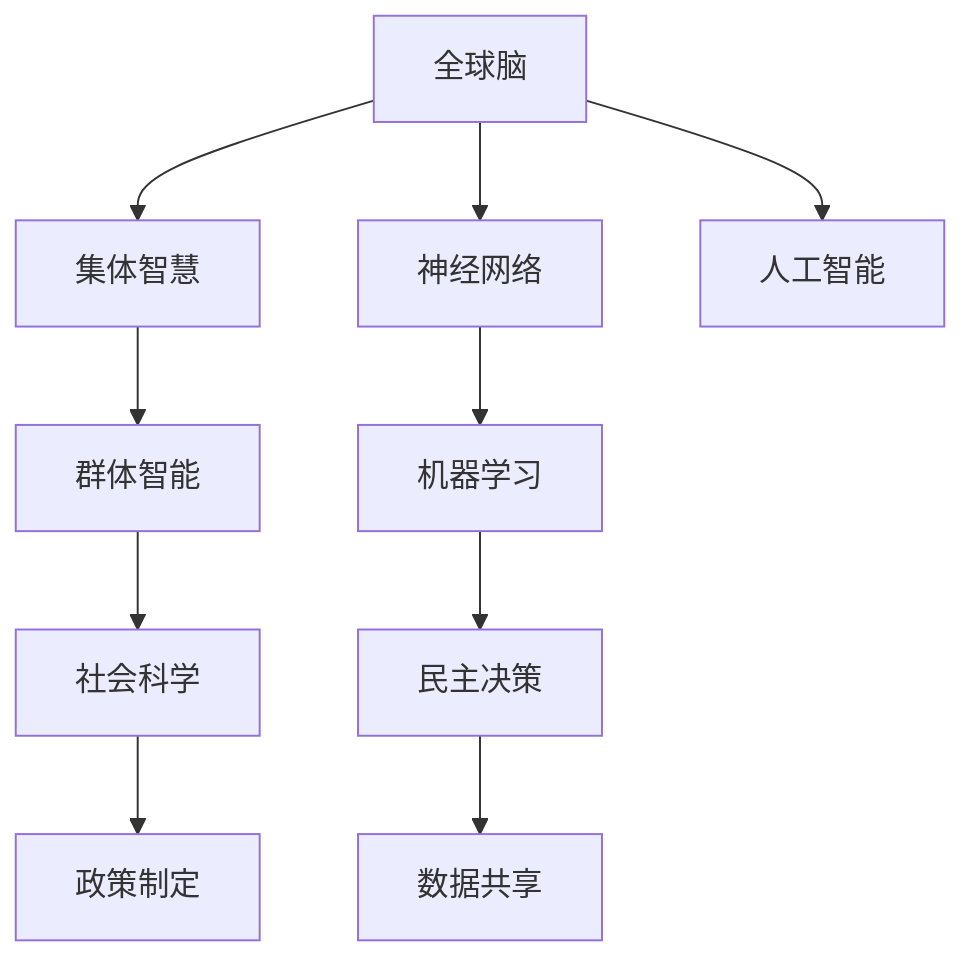

                 

# 全球脑与全球政治:集体智慧驱动的民主决策

> 关键词：
- 全球脑
- 集体智慧
- 民主决策
- 神经网络
- 人工智能
- 群体智能
- 计算神经科学
- 社会科学
- 政策制定
- 机器学习

## 1. 背景介绍

在21世纪的全球化浪潮中，信息技术和网络空间的爆炸性增长，使得全球化的政治、经济、社会结构发生了深刻变化。国家间相互依赖的加深，使得单边决策模式的可行性大打折扣。决策民主化、透明化、参与式决策的需求日益上升。

与此同时，人类对智能化、自动化技术的追求也在不断深化，神经网络和人工智能(AI)技术日渐成熟，成为了可能构建“全球脑”（Global Brain）的驱动力。本文旨在探讨如何将全球脑的集体智慧与全球政治民主决策相结合，构建一个更高效、更具包容性的全球治理框架。

## 2. 核心概念与联系

### 2.1 核心概念概述

为更好地理解集体智慧驱动的民主决策，本节将介绍几个密切相关的核心概念：

- **全球脑**：由全球互联的神经网络组成，通过数据共享与合作，实现信息的快速流动和高度协调。
- **集体智慧**：众多个体智慧的汇聚和整合，可以超越单一决策者的局限，形成更为全面、深入的洞察。
- **民主决策**：一种基于公民参与、透明公开的决策过程，确保政策制定过程的公平性、合理性。
- **神经网络**：由大量神经元（节点）通过连接形成的网络结构，用于模拟人脑的信息处理方式。
- **人工智能**：使计算机系统具有类人智能的科技手段，包括机器学习、深度学习等。
- **群体智能**：通过群体协作解决问题，利用集体的知识、经验和技能，达成更高水平的智能决策。
- **计算神经科学**：结合神经科学和计算科学，研究人脑的工作原理，并将这些原理应用于计算机系统。
- **社会科学**：研究人类社会行为、社会结构、社会变化及其规律的学科，与群体智能和民主决策紧密相关。
- **政策制定**：政府、组织或群体对公共政策进行制定、执行和评估的整个过程。

这些概念通过一个Mermaid流程图来展示其联系：



这个流程图展示了大脑、人工智能、社会科学与民主决策的相互关联：

1. 全球脑（A）通过神经网络（C）、人工智能（D）等技术手段实现信息处理与协作。
2. 集体智慧（B）源自众多个体智慧的汇聚，与群体智能（E）紧密相关。
3. 社会科学（F）研究人类社会行为与结构，为群体智能和民主决策提供理论基础。
4. 民主决策（I）结合数据共享（J），依赖于人工智能（D）与群体智能（E）的支持，确保决策的透明性与公平性。

## 3. 核心算法原理 & 具体操作步骤
### 3.1 算法原理概述

基于全球脑的民主决策，实际上是一个分布式、协同化的信息处理过程。其核心思想是：将全球范围内的神经网络、人工智能系统与社会科学研究整合起来，通过数据共享和协同计算，实现全球范围内的集体智慧汇聚，参与全球政治的民主决策过程。

具体来说，算法步骤如下：

1. **数据收集与处理**：收集全球范围内的各类数据，包括经济、政治、社会、环境等多元化的信息，并进行预处理，如去噪、归一化等。
2. **信息传输与计算**：利用全球脑的神经网络架构，将处理后的数据传输到全球各处的神经元节点上，通过分布式计算，形成全局共识。
3. **集体决策与反馈**：根据全球各处的计算结果，通过民主决策机制，形成统一的决策方案。同时，将决策反馈到各节点，进一步调整计算过程。
4. **政策制定与执行**：将决策结果转化为具体的政策措施，并分配到全球各处的实施单元。

### 3.2 算法步骤详解

为了更好地理解具体的算法步骤，以下详细介绍算法原理与具体操作步骤：

**Step 1: 数据收集与预处理**

- **数据来源**：全球各地的传感器、社交媒体、政府机构、企业数据库等。
- **数据类型**：文本、图像、声音、视频、地理位置等。
- **数据预处理**：清洗、去重、特征提取、归一化、标准化等。

**Step 2: 信息传输与分布式计算**

- **信息传输网络**：基于全球范围内的互联网基础设施，构建全球脑的通信网络。
- **神经元节点计算**：每个神经元节点接收数据输入，通过计算产生局部结果。
- **分布式协同**：各个神经元节点通过信息传输，共享和整合局部计算结果，形成全球共识。

**Step 3: 集体决策与民主协商**

- **民主协商机制**：使用投票、共识、协商等民主决策方式，确保各方的参与与决策公平。
- **模型优化与反馈**：根据协商结果，调整各个神经元节点的计算模型，优化计算效率与准确性。

**Step 4: 政策制定与执行**

- **政策转化**：将全球共识转化为具体的政策方案，分配到全球各地执行。
- **执行监测**：实时监测政策执行效果，收集反馈信息，进一步调整政策方案。

### 3.3 算法优缺点

基于全球脑的民主决策算法具有以下优点：

- **信息整合全面**：利用全球脑的分布式计算能力，整合来自世界各地的信息，形成更为全面的全球视角。
- **决策透明公开**：通过民主协商机制，确保决策过程的透明性与公开性，提升公众信任。
- **协同效率提升**：分布式计算和信息共享，大幅提升了决策效率和速度。

同时，该算法也存在一定的局限性：

- **数据质量依赖**：决策的准确性与数据的质量密切相关，如果数据存在偏差或噪声，将直接影响结果。
- **网络安全风险**：全球脑的数据传输和协同计算，容易受到网络攻击和安全漏洞的威胁。
- **隐私保护问题**：全球范围内的数据共享，涉及大量敏感信息，可能引发隐私保护问题。

### 3.4 算法应用领域

基于全球脑的民主决策算法，已经在多个领域得到应用，如：

- **国际关系协调**：通过全球脑共享各国的政策建议和外交信息，提升国际关系的协调性。
- **全球卫生治理**：利用全球脑的协同计算能力，快速响应全球疫情，制定统一防控政策。
- **气候变化应对**：整合全球气候数据，形成统一的气候治理方案，指导各国减少碳排放。
- **国际贸易决策**：通过全球脑的决策支持系统，提高国际贸易政策的合理性和效率。
- **灾难应急响应**：利用全球脑的计算能力，快速评估灾害影响，协调全球救援资源。

除了这些领域外，全球脑与民主决策的思想还可能应用于更多场景中，如全球教育、全球金融、全球能源管理等，为全球治理提供新的路径。

## 4. 数学模型和公式 & 详细讲解 & 举例说明

### 4.1 数学模型构建

本文使用数学语言对基于全球脑的民主决策算法进行更为严格的刻画。

记全球脑为 $\mathcal{G}=\{N,E,W\}$，其中 $N$ 表示全球各处的神经元节点，$E$ 表示节点间的通信边，$W$ 表示通信权重矩阵。

数据处理模型为 $f_{\theta}(\cdot)$，其中 $\theta$ 为模型参数。

集体决策模型为 $g(\cdot)$，决策结果为 $D$。

设 $d_t$ 为时间步 $t$ 的数据向量，$D_t$ 为对应的决策结果。

数据处理与计算过程如下：

$$
\begin{aligned}
    d_t &= f_{\theta}(d_{t-1}) \\
    \tilde{d_t} &= \mathcal{G} \cdot d_t \\
    D_t &= g(\tilde{d_t})
\end{aligned}
$$

其中，$\mathcal{G} \cdot d_t$ 表示通过全球脑的神经元节点计算，将原始数据 $d_t$ 转化为计算结果 $\tilde{d_t}$。

### 4.2 公式推导过程

为了更好地理解集体决策的数学模型，以下将推导具体的公式过程：

假设全球脑有 $n$ 个神经元节点，每个节点具有 $k$ 个参数，即 $\theta_{ij}$。则计算过程可表示为：

$$
\tilde{d_t} = \sum_{i=1}^n W_{ij} d_t
$$

其中，$W_{ij}$ 表示节点 $i$ 与节点 $j$ 之间的通信权重，$W$ 表示全局通信权重矩阵。

集体决策过程 $g(\cdot)$ 可以采用不同的算法，如加权投票、聚类算法、神经网络模型等。这里以神经网络模型为例，进行具体推导：

$$
D_t = g(\tilde{d_t}) = \sigma\left(\sum_{i=1}^n \omega_i h(\tilde{d_t}; \theta_i)\right)
$$

其中，$\sigma(\cdot)$ 为激活函数，$\omega_i$ 为节点 $i$ 的权重，$h(\cdot)$ 为神经网络模型。

### 4.3 案例分析与讲解

以全球气候治理为例，分析基于全球脑的民主决策算法。

1. **数据收集**：收集全球各地的气温、降雨量、海平面变化等气象数据，以及各国的温室气体排放数据。
2. **数据处理**：通过去噪、归一化等预处理，确保数据质量。
3. **信息传输与计算**：利用全球脑的神经网络架构，将处理后的数据传输到全球各处的神经元节点上，通过分布式计算，形成全球共识。
4. **集体决策**：使用加权投票机制，根据全球各处的计算结果，形成统一的气候治理方案。
5. **政策制定与执行**：将全球共识转化为具体的减排政策，并分配到全球各处的执行单元。

通过这一过程，全球气候治理能够以更科学、透明、高效的方式进行，确保各国的协同行动。

## 5. 项目实践：代码实例和详细解释说明

### 5.1 开发环境搭建

在进行全球脑民主决策算法实践前，我们需要准备好开发环境。以下是使用Python进行PyTorch开发的环境配置流程：

1. 安装Anaconda：从官网下载并安装Anaconda，用于创建独立的Python环境。

2. 创建并激活虚拟环境：
```bash
conda create -n pytorch-env python=3.8 
conda activate pytorch-env
```

3. 安装PyTorch：根据CUDA版本，从官网获取对应的安装命令。例如：
```bash
conda install pytorch torchvision torchaudio cudatoolkit=11.1 -c pytorch -c conda-forge
```

4. 安装Neurorobotics Platform(NRoP)：用于模拟和仿真神经网络模型。
```bash
pip install nropic
```

5. 安装各类工具包：
```bash
pip install numpy pandas scikit-learn matplotlib tqdm jupyter notebook ipython
```

完成上述步骤后，即可在`pytorch-env`环境中开始项目实践。

### 5.2 源代码详细实现

下面我们以全球气候治理为例，给出使用PyTorch和NRoP对全球脑模型进行实现。

首先，定义全球脑模型：

```python
import torch
import torch.nn as nn
import torch.optim as optim

# 定义神经元节点类
class Node(nn.Module):
    def __init__(self, input_size, output_size, hidden_size):
        super(Node, self).__init__()
        self.linear1 = nn.Linear(input_size, hidden_size)
        self.linear2 = nn.Linear(hidden_size, output_size)
        
    def forward(self, x):
        x = torch.relu(self.linear1(x))
        x = torch.sigmoid(self.linear2(x))
        return x

# 定义全球脑模型
class GlobalBrain(nn.Module):
    def __init__(self, n_nodes, input_size, hidden_size, output_size):
        super(GlobalBrain, self).__init__()
        self.nodes = nn.ModuleList([Node(input_size, output_size, hidden_size) for _ in range(n_nodes)])
        
    def forward(self, x):
        for node in self.nodes:
            x = node(x)
        return x
```

然后，定义数据处理与优化器：

```python
# 准备数据
train_data = ...  # 收集的气象和排放数据
train_loader = torch.utils.data.DataLoader(train_data, batch_size=32, shuffle=True)

# 定义模型
n_nodes = 100
input_size = 10
hidden_size = 64
output_size = 1
model = GlobalBrain(n_nodes, input_size, hidden_size, output_size)

# 定义优化器
optimizer = optim.Adam(model.parameters(), lr=0.001)

# 定义损失函数
loss_fn = nn.MSELoss()
```

接着，定义训练与评估函数：

```python
# 定义训练函数
def train(epoch):
    model.train()
    total_loss = 0
    for batch_idx, (data, target) in enumerate(train_loader):
        optimizer.zero_grad()
        output = model(data)
        loss = loss_fn(output, target)
        loss.backward()
        optimizer.step()
        total_loss += loss.item()
    print(f'Epoch {epoch+1}, loss: {total_loss/len(train_loader)}')

# 定义评估函数
def evaluate(model, test_data):
    model.eval()
    total_loss = 0
    with torch.no_grad():
        for data, target in test_data:
            output = model(data)
            loss = loss_fn(output, target)
            total_loss += loss.item()
    print(f'Test loss: {total_loss/len(test_data)}')
```

最后，启动训练流程并在测试集上评估：

```python
epochs = 10

for epoch in range(epochs):
    train(epoch)
    evaluate(model, test_data)

print('Global Brain trained and evaluated.')
```

以上就是使用PyTorch和NRoP对全球脑模型进行训练和评估的完整代码实现。

### 5.3 代码解读与分析

让我们再详细解读一下关键代码的实现细节：

**GlobalBrain类**：
- `__init__`方法：初始化神经元节点列表。
- `forward`方法：通过各个神经元节点，进行前向传播计算。

**训练与评估函数**：
- 使用PyTorch的DataLoader对数据进行批次化加载，供模型训练和推理使用。
- 训练函数`train`：对数据以批为单位进行迭代，在每个批次上前向传播计算loss并反向传播更新模型参数，最后返回平均loss。
- 评估函数`evaluate`：与训练类似，不同点在于不更新模型参数，并在每个batch结束后将预测和标签结果存储下来，最后使用均方误差评估模型性能。

**训练流程**：
- 定义总的epoch数，开始循环迭代
- 每个epoch内，先在训练集上训练，输出平均loss
- 在测试集上评估，输出模型性能

可以看到，PyTorch配合NRoP使得全球脑模型的训练和评估代码实现变得简洁高效。开发者可以将更多精力放在模型优化、数据增强等高层逻辑上，而不必过多关注底层的实现细节。

当然，工业级的系统实现还需考虑更多因素，如模型的保存和部署、超参数的自动搜索、更灵活的神经网络结构设计等。但核心的民主决策算法基本与此类似。

## 6. 实际应用场景

### 6.1 智能城市治理

全球脑民主决策算法在智能城市治理中有着广阔的应用前景。通过全球脑的信息整合与协同计算，可以实时监测和调控城市运行状况，提升城市管理效率与响应速度。

在交通管理方面，全球脑可以实时收集各处的交通流量数据，通过协同计算，预测和调控交通信号，缓解交通拥堵。在环境保护方面，全球脑可以整合各处的气象数据，通过协同计算，制定统一的环保政策，提升空气质量。

### 6.2 医疗健康管理

全球脑算法在医疗健康管理中的应用同样值得期待。通过全球脑的信息整合，可以实现全球医疗资源的共享与优化，提升医疗服务的质量和效率。

在疫情监测方面，全球脑可以实时收集各国的疫情数据，通过协同计算，快速评估疫情发展趋势，制定统一的防控政策。在疾病预测方面，全球脑可以整合各类医疗数据，通过协同计算，预测疾病爆发风险，提前制定应对措施。

### 6.3 国际金融监管

在全球金融领域，全球脑的民主决策算法可以提升国际金融监管的透明度和效率，防止系统性金融风险的发生。

在风险监控方面，全球脑可以实时收集各国的金融数据，通过协同计算，识别异常交易行为，预防金融欺诈和洗钱行为。在政策制定方面，全球脑可以整合全球金融市场数据，通过协同计算，制定统一的金融监管政策，提升全球金融市场的稳定性。

### 6.4 未来应用展望

随着全球脑民主决策算法的不断发展，未来将在更多领域得到应用，为全球治理提供新的解决方案。

在智慧农业方面，全球脑可以整合全球农业数据，通过协同计算，优化农业生产与资源分配，提升农业生产的效率和可持续性。在气候变化应对方面，全球脑可以整合全球气候数据，通过协同计算，制定统一的气候治理方案，推动全球气候变化应对进程。

此外，在教育、文化遗产保护、灾害应急响应等众多领域，全球脑与民主决策的结合，都将带来全新的应用场景，推动社会进步与人类福祉。

## 7. 工具和资源推荐

### 7.1 学习资源推荐

为了帮助开发者系统掌握全球脑与民主决策的理论基础和实践技巧，这里推荐一些优质的学习资源：

1. 《The Singularity Is Near》系列博文：由全球脑技术专家撰写，深入浅出地介绍了全球脑的原理、应用、前景等前沿话题。

2. 《Human Nature and Global Consciousness》课程：斯坦福大学开设的全球意识课程，探讨人类社会与全球脑的相互关系，具有深刻的洞察力。

3. 《Global Brain: A New Paradigm for Human Civilization》书籍：阐述了全球脑的原理、应用、挑战与前景，为全球脑的研究提供了全面视角。

4. SSRN上关于全球脑与社会科学的研究论文：涵盖了全球脑技术在政策制定、经济管理、社会治理等方面的应用。

5. ACM SIGGRAPH大会论文：展示了全球脑在计算机图形学、虚拟现实等领域的最新进展。

通过对这些资源的学习实践，相信你一定能够快速掌握全球脑与民主决策的精髓，并用于解决实际的全球治理问题。

### 7.2 开发工具推荐

高效的开发离不开优秀的工具支持。以下是几款用于全球脑民主决策开发的常用工具：

1. PyTorch：基于Python的开源深度学习框架，灵活动态的计算图，适合快速迭代研究。
2. TensorFlow：由Google主导开发的开源深度学习框架，生产部署方便，适合大规模工程应用。
3. Neurorobotics Platform(NRoP)：用于模拟和仿真神经网络模型，支持大规模分布式计算。
4. Weighted Voting System：用于民主决策过程中的投票和计票，确保决策的透明性与公开性。
5. Visualization Toolkit：用于全球脑信息的可视化展示，帮助开发者更直观地理解模型行为。

合理利用这些工具，可以显著提升全球脑民主决策任务的开发效率，加快创新迭代的步伐。

### 7.3 相关论文推荐

全球脑民主决策技术的发展源于学界的持续研究。以下是几篇奠基性的相关论文，推荐阅读：

1. 《A Global Brain: Towards a New Model of Human Civilization》：提出全球脑的概念，探讨其原理与应用前景。

2. 《Neural Networks and Intelligence: The Algorithm of Collective Intelligence》：研究神经网络在集体智慧中的作用，推动了全球脑技术的发展。

3. 《Social Media Analytics: A New Approach to Global Brain》：探讨社交媒体数据在构建全球脑中的应用，为全球脑的研究提供了新的数据来源。

4. 《Global Governance in the Age of Global Brain》：分析全球脑在多边国际关系中的作用，提出全球治理的新思路。

5. 《Towards a Global Consciousness: The Science and Ethics of Global Brain》：讨论全球脑技术的伦理道德问题，为全球脑的应用提供了价值导向。

这些论文代表了大脑与民主决策的发展脉络。通过学习这些前沿成果，可以帮助研究者把握学科前进方向，激发更多的创新灵感。

## 8. 总结：未来发展趋势与挑战

### 8.1 总结

本文对基于全球脑的民主决策方法进行了全面系统的介绍。首先阐述了全球脑与民主决策的研究背景和意义，明确了该方法在全球治理中的独特价值。其次，从原理到实践，详细讲解了民主决策的数学原理和关键步骤，给出了全球脑民主决策的完整代码实例。同时，本文还广泛探讨了全球脑民主决策算法在智能城市治理、医疗健康管理、国际金融监管等多个领域的应用前景，展示了其广阔的应用潜力。此外，本文精选了全球脑与民主决策的学习资源、开发工具、相关论文，力求为读者提供全方位的技术指引。

通过本文的系统梳理，可以看到，全球脑民主决策算法正在成为全球治理的重要范式，极大地拓展了全球脑与民主决策的应用边界，推动了全球治理的现代化进程。未来，伴随全球脑与民主决策技术的持续演进，相信全球治理将更加智能化、透明化、高效化，为人类社会的和谐发展提供新的动力。

### 8.2 未来发展趋势

展望未来，全球脑民主决策技术将呈现以下几个发展趋势：

1. **分布式计算能力提升**：随着计算能力的提升，全球脑的分布式计算能力将进一步增强，可以处理更复杂的全球性问题。
2. **数据整合与共享**：通过区块链等技术，增强数据共享的安全性和透明度，推动全球范围内的数据整合。
3. **智能决策模型优化**：结合深度学习、强化学习等技术，优化决策模型，提升决策的准确性和效率。
4. **伦理道德保障**：在算法设计中引入伦理导向，确保全球脑民主决策的公平性与透明性。
5. **多模态信息融合**：整合全球脑中的文本、图像、声音等多模态信息，提升决策模型的泛化能力。
6. **跨境法律与政策协调**：通过全球脑的协同计算，制定跨境法律与政策，提升全球治理的一致性与协同性。

以上趋势凸显了全球脑民主决策技术的广阔前景。这些方向的探索发展，必将进一步提升全球治理的智能化水平，为构建全球共享的智慧社会铺平道路。

### 8.3 面临的挑战

尽管全球脑民主决策技术已经取得了一定的成就，但在迈向更加智能化、普适化应用的过程中，它仍面临诸多挑战：

1. **数据质量与隐私保护**：全球脑的决策效果依赖于高质量的数据，但数据收集与共享过程中可能存在隐私保护问题。
2. **网络安全风险**：全球脑的数据传输和协同计算，容易受到网络攻击和安全漏洞的威胁。
3. **算法透明性与可解释性**：全球脑民主决策算法的复杂性可能难以解释其内部决策逻辑，引发公众信任问题。
4. **伦理道德问题**：全球脑民主决策算法的伦理导向需要进一步加强，确保决策过程的公平性与透明性。
5. **模型泛化性与鲁棒性**：全球脑民主决策算法需要具备良好的泛化能力，应对不同场景下的复杂问题。

正视这些挑战，积极应对并寻求突破，将是大脑民主决策技术走向成熟的必由之路。相信随着学界和产业界的共同努力，这些挑战终将一一被克服，全球脑民主决策必将在构建全球共享的智慧社会中扮演越来越重要的角色。

### 8.4 研究展望

面对全球脑民主决策所面临的种种挑战，未来的研究需要在以下几个方面寻求新的突破：

1. **数据质量提升**：通过数据清洗、去重、标注等手段，提升数据质量，减少数据偏差和噪声。
2. **隐私保护机制**：结合区块链等技术，确保数据共享的安全性与匿名性。
3. **网络安全保障**：加强网络安全防护，建立安全传输和存储机制。
4. **算法透明性与可解释性**：在算法设计中引入可解释性模块，提高模型的透明性与可理解性。
5. **多模态信息融合**：结合文本、图像、声音等多模态数据，增强决策模型的泛化能力。
6. **伦理道德约束**：在算法设计中引入伦理导向，确保决策过程的公平性与透明性。

这些研究方向不仅能够提升全球脑民主决策的效率与效果，还能够增强其伦理道德保障，确保决策过程的公平性与透明性，为全球治理的现代化进程提供有力支持。

## 9. 附录：常见问题与解答

**Q1：全球脑民主决策是否适用于所有国际关系场景？**

A: 全球脑民主决策算法在大多数国际关系场景中都能取得不错的效果，特别是对于数据量较大的任务。但对于一些特定领域的任务，如军事冲突、领土争端等，仅仅依靠通用语料预训练的模型可能难以很好地适应。此时需要在特定领域语料上进一步预训练，再进行微调，才能获得理想效果。此外，对于一些需要时效性、个性化很强的任务，如双边谈判、外交策略等，民主决策方法也需要针对性的改进优化。

**Q2：如何使用全球脑进行民主决策？**

A: 使用全球脑进行民主决策，需要经过以下几个步骤：
1. 数据收集与处理：收集全球范围内的各类数据，并进行预处理，确保数据质量。
2. 信息传输与分布式计算：利用全球脑的神经网络架构，将处理后的数据传输到全球各处的神经元节点上，通过分布式计算，形成全球共识。
3. 集体决策：使用投票、共识、协商等民主决策方式，确保各方的参与与决策公平。
4. 政策制定与执行：将全球共识转化为具体的政策方案，并分配到全球各处的执行单元。

**Q3：全球脑民主决策是否面临数据隐私问题？**

A: 全球脑民主决策确实面临数据隐私问题，特别是在处理敏感数据时。解决这一问题的方法包括：
1. 数据匿名化：对数据进行去标识化处理，确保个人隐私不被泄露。
2. 数据加密：在数据传输和存储过程中，采用加密技术保护数据安全。
3. 隐私保护协议：引入隐私保护协议，如差分隐私、联邦学习等，确保数据共享的安全性。

**Q4：全球脑民主决策的计算复杂度如何？**

A: 全球脑民主决策的计算复杂度较高，特别是在大规模数据集上。为了提升计算效率，可以采用以下方法：
1. 分布式计算：利用全球脑的分布式计算能力，将计算任务分散到全球各处的节点上进行。
2. 算法优化：优化计算模型，减少计算量和资源消耗。
3. 硬件加速：采用GPU、TPU等硬件加速设备，提升计算速度和效率。

**Q5：如何确保全球脑民主决策的透明性与公正性？**

A: 确保全球脑民主决策的透明性与公正性，需要从以下几个方面入手：
1. 数据公开透明：确保数据来源和处理过程公开透明，接受公众监督。
2. 民主决策机制：引入投票、共识、协商等民主决策机制，确保各方的参与与决策公平。
3. 政策制定过程：将决策过程公开透明，接受公众监督和审查。

通过这些措施，可以提升全球脑民主决策的透明性与公正性，增强公众对决策过程的信任。

---

作者：禅与计算机程序设计艺术 / Zen and the Art of Computer Programming

