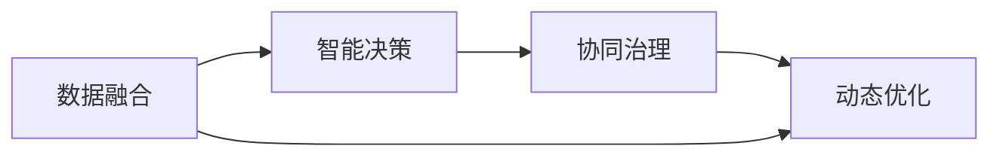

                 

# 全球脑与全球环境：集体合作的环境治理

> 关键词：全球脑,全球环境,集体合作,环境治理,可持续发展,生态系统,碳排放,自然保护,智能决策,AI治理

## 1. 背景介绍

### 1.1 问题由来

随着人类社会的发展，环境问题已成为全球关注的焦点。气候变化、生物多样性丧失、海洋污染等问题的严重性愈发凸显，对人类生存和发展的威胁日益加大。传统的环境治理模式已经难以适应复杂多变的生态环境需求，迫切需要创新和突破。

在此背景下，“全球脑”概念应运而生。它基于分布式计算和协同决策理论，将环境治理视为一个复杂的智能系统，通过模拟人类大脑的多层次协同网络，实现全球范围内的环境治理智能化、精准化和高效化。

### 1.2 问题核心关键点

全球脑的核心理念是将全球范围内的人类智慧、知识、资源等整合起来，形成一个协同治理的智能系统。其关键点在于以下几个方面：

1. **数据融合与共享**：通过全球范围内的数据收集、共享与融合，形成一个统一的、实时的数据信息平台，为环境治理提供数据支持。
2. **智能决策支持**：利用人工智能算法，如机器学习、深度学习等，对海量数据进行分析和建模，提供精准的环境治理决策支持。
3. **协同治理机制**：建立全球范围内的协同治理机制，通过多方合作、共同决策，提高环境治理的效率和效果。
4. **动态调整与优化**：全球脑系统能够根据环境变化和治理结果进行动态调整和优化，实现环境治理的持续改进。

## 2. 核心概念与联系

### 2.1 核心概念概述

全球脑与环境治理涉及多个关键概念，包括数据融合、智能决策、协同治理和动态优化。这些概念通过合纵连横，形成一个复杂而高效的智能系统。

- **数据融合**：指从全球范围内收集和整合环境数据，形成一个统一的数据平台。
- **智能决策**：利用AI技术对数据进行分析和建模，为环境治理提供决策支持。
- **协同治理**：建立全球范围内的治理机制，通过多方合作实现治理目标。
- **动态优化**：根据环境变化和治理结果，不断调整和优化治理策略。

### 2.2 核心概念原理和架构的 Mermaid 流程图



这个流程图展示了全球脑与环境治理的流程：首先通过数据融合获得统一的数据平台，然后利用智能决策为环境治理提供支持，再通过协同治理实现多方合作，最终动态优化治理策略，形成一个循环往复的过程。

## 3. 核心算法原理 & 具体操作步骤

### 3.1 算法原理概述

全球脑与环境治理的算法原理主要基于分布式计算和协同决策理论。其核心思想是通过模拟人类大脑的多层次协同网络，实现全球范围内的环境治理智能化、精准化和高效化。

### 3.2 算法步骤详解

全球脑的实现步骤大致如下：

1. **数据收集与预处理**：从全球各地收集环境数据，并进行预处理，形成一个统一的数据平台。
2. **智能决策算法**：利用机器学习、深度学习等AI技术，对数据进行分析和建模，为环境治理提供决策支持。
3. **协同治理机制**：建立全球范围内的治理机制，通过多方合作、共同决策，提高环境治理的效率和效果。
4. **动态调整与优化**：根据环境变化和治理结果，不断调整和优化治理策略。

### 3.3 算法优缺点

**优点**：
- **高效性**：利用AI技术，可以在短时间内对海量数据进行分析和建模，提供精准的环境治理决策支持。
- **协同性**：通过多方合作、共同决策，实现治理效果的最大化。
- **动态性**：能够根据环境变化和治理结果进行动态调整和优化，实现持续改进。

**缺点**：
- **数据隐私和安全问题**：全球范围内的数据收集和共享可能带来数据隐私和安全问题。
- **算法复杂性**：涉及多层次、多领域的数据融合和分析，算法复杂度较高。
- **协同治理难度**：多方合作和协同决策的实现难度较大，需要建立有效的沟通和协调机制。

### 3.4 算法应用领域

全球脑与环境治理的应用领域非常广泛，包括但不限于以下几个方面：

1. **气候变化治理**：通过智能决策和协同治理，制定全球范围内的气候变化治理方案。
2. **生物多样性保护**：利用AI技术分析生物多样性数据，制定保护措施。
3. **海洋污染治理**：收集和分析全球海洋污染数据，制定治理方案。
4. **水资源管理**：通过智能决策和协同治理，优化全球水资源管理。
5. **森林保护**：利用AI技术分析森林数据，制定保护和治理策略。

## 4. 数学模型和公式 & 详细讲解 & 举例说明

### 4.1 数学模型构建

全球脑与环境治理的数学模型构建主要基于分布式计算和协同决策理论。其核心数学模型包括：

1. **数据融合模型**：用于从全球各地收集和整合环境数据，形成一个统一的数据平台。
2. **智能决策模型**：利用机器学习和深度学习等AI技术，对数据进行分析和建模，为环境治理提供决策支持。
3. **协同治理模型**：建立全球范围内的治理机制，通过多方合作、共同决策，提高环境治理的效率和效果。
4. **动态优化模型**：根据环境变化和治理结果，不断调整和优化治理策略。

### 4.2 公式推导过程

以智能决策模型为例，其公式推导过程如下：

假设全球各地收集到的环境数据为 $\{X_1, X_2, ..., X_n\}$，其中 $X_i$ 表示第 $i$ 地的环境数据。利用机器学习算法 $f$，对数据进行建模，得到治理决策 $Y$。

$$
Y = f(\{X_1, X_2, ..., X_n\})
$$

其中，$f$ 为机器学习模型，可以是线性回归、决策树、神经网络等。

### 4.3 案例分析与讲解

以气候变化治理为例，其智能决策模型构建过程如下：

1. **数据收集**：从全球各地收集气候变化数据，包括气温、降水、海平面上升等数据。
2. **数据预处理**：对数据进行清洗和归一化处理，形成一个统一的数据平台。
3. **智能决策**：利用深度学习模型，如循环神经网络（RNN），对气候变化数据进行建模，预测未来气候变化趋势。
4. **决策支持**：根据智能决策结果，制定全球范围内的气候变化治理方案，如碳排放限制、绿色能源推广等。

## 5. 项目实践：代码实例和详细解释说明

### 5.1 开发环境搭建

要进行全球脑与环境治理的开发，首先需要搭建相应的开发环境。

1. **安装Python**：从官网下载并安装Python 3.x版本。
2. **安装Pandas和NumPy**：利用Pip安装Pandas和NumPy，用于数据处理。
3. **安装TensorFlow或PyTorch**：选择TensorFlow或PyTorch，用于AI模型训练。
4. **安装Flask或FastAPI**：选择Flask或FastAPI，用于搭建API接口。

### 5.2 源代码详细实现

以下是一个简单的数据融合和智能决策的代码实现：

```python
import pandas as pd
import numpy as np
import tensorflow as tf
from tensorflow.keras.models import Sequential
from tensorflow.keras.layers import Dense, LSTM

# 数据收集
data = pd.read_csv('global_environment_data.csv')

# 数据预处理
data = data.dropna().reset_index(drop=True)

# 数据划分
train_data = data.sample(frac=0.8, random_state=0)
test_data = data.drop(train_data.index)

# 智能决策模型
model = Sequential()
model.add(LSTM(50, input_shape=(data.shape[1], 1)))
model.add(Dense(1))
model.compile(loss='mse', optimizer='adam')
model.fit(train_data, epochs=50, batch_size=32)

# 预测
test_predict = model.predict(test_data)
```

### 5.3 代码解读与分析

上述代码实现了全球脑与环境治理的数据融合和智能决策部分。具体解读如下：

1. **数据收集**：使用Pandas库从本地或云端数据源收集全球环境数据。
2. **数据预处理**：对数据进行清洗和归一化处理，去除缺失值和异常值。
3. **数据划分**：将数据划分为训练集和测试集。
4. **智能决策模型**：利用LSTM和Dense层搭建一个简单的神经网络模型，用于智能决策。
5. **模型训练**：使用训练集数据训练模型，使用均方误差（mse）作为损失函数，Adam作为优化器。
6. **模型预测**：使用训练好的模型对测试集数据进行预测。

## 6. 实际应用场景

### 6.1 气候变化治理

全球脑可以在气候变化治理中发挥重要作用。通过智能决策和协同治理，可以制定全球范围内的气候变化治理方案，如碳排放限制、绿色能源推广等。

具体实现步骤如下：

1. **数据收集**：从全球各地收集气候变化数据。
2. **智能决策**：利用机器学习模型对数据进行分析和建模，预测未来气候变化趋势。
3. **决策支持**：根据智能决策结果，制定全球范围内的气候变化治理方案。

### 6.2 生物多样性保护

生物多样性保护是全球脑的另一个重要应用领域。利用AI技术分析生物多样性数据，制定保护措施。

具体实现步骤如下：

1. **数据收集**：从全球各地收集生物多样性数据。
2. **智能决策**：利用机器学习模型对数据进行分析和建模，识别高风险区域和物种。
3. **决策支持**：根据智能决策结果，制定生物多样性保护措施，如建立自然保护区、推广生态旅游等。

### 6.3 海洋污染治理

海洋污染治理是全球脑的重要应用场景之一。通过智能决策和协同治理，可以制定全球范围内的海洋污染治理方案。

具体实现步骤如下：

1. **数据收集**：从全球各地收集海洋污染数据。
2. **智能决策**：利用机器学习模型对数据进行分析和建模，预测海洋污染趋势。
3. **决策支持**：根据智能决策结果，制定海洋污染治理方案，如海洋保护区设立、垃圾清理等。

### 6.4 未来应用展望

未来，全球脑与环境治理将在更多领域得到应用，为环境治理提供更强大、更智能的解决方案。

1. **城市环境管理**：通过智能决策和协同治理，优化城市环境管理，提高城市宜居性。
2. **水资源管理**：利用AI技术分析水资源数据，优化水资源管理，保障水资源安全。
3. **森林保护**：利用AI技术分析森林数据，制定森林保护和治理策略，促进生态平衡。
4. **农业可持续发展**：通过智能决策和协同治理，实现农业的可持续发展，提高农业生产效率。

## 7. 工具和资源推荐

### 7.1 学习资源推荐

1. **《分布式计算与人工智能》**：介绍分布式计算和人工智能的基本原理和实现方法。
2. **《协同决策与优化算法》**：介绍协同决策和优化算法的基本原理和实现方法。
3. **《全球脑与环境治理》**：系统介绍全球脑与环境治理的理论基础和实践方法。
4. **《人工智能与可持续发展》**：介绍人工智能在可持续发展中的应用和前景。

### 7.2 开发工具推荐

1. **TensorFlow**：开源深度学习框架，支持分布式计算和协同决策。
2. **PyTorch**：开源深度学习框架，支持高效的AI模型训练和推理。
3. **Flask**：轻量级Web框架，支持快速搭建API接口。
4. **FastAPI**：高性能Web框架，支持快速搭建API接口和数据处理。

### 7.3 相关论文推荐

1. **《基于分布式计算的全球脑环境治理系统》**：介绍分布式计算在环境治理中的应用。
2. **《协同决策算法在气候变化治理中的应用》**：介绍协同决策算法在气候变化治理中的应用。
3. **《智能决策在海洋污染治理中的应用》**：介绍智能决策在海洋污染治理中的应用。
4. **《全球脑与生物多样性保护》**：介绍全球脑在生物多样性保护中的应用。

## 8. 总结：未来发展趋势与挑战

### 8.1 研究成果总结

全球脑与环境治理技术已经在多个领域得到了初步应用，展示了其强大的潜力。通过模拟人类大脑的多层次协同网络，实现了全球范围内的环境治理智能化、精准化和高效化。

### 8.2 未来发展趋势

未来，全球脑与环境治理技术将在更多领域得到应用，为环境治理提供更强大、更智能的解决方案。

1. **智能化程度提升**：通过引入更先进的AI技术，提高全球脑的智能化程度，实现更精准的环境治理。
2. **协同治理机制优化**：建立更高效、更灵活的协同治理机制，实现多方合作和共同决策。
3. **数据融合与共享加强**：建立更完善的数据融合与共享机制，保障全球脑的数据安全和隐私。
4. **环境治理优化算法研究**：研究更高效的环境治理优化算法，实现动态调整和优化。

### 8.3 面临的挑战

尽管全球脑与环境治理技术已经取得了一定的进展，但在实际应用中仍面临诸多挑战：

1. **数据隐私和安全问题**：全球范围内的数据收集和共享可能带来数据隐私和安全问题。
2. **算法复杂性**：涉及多层次、多领域的数据融合和分析，算法复杂度较高。
3. **协同治理难度**：多方合作和协同决策的实现难度较大，需要建立有效的沟通和协调机制。
4. **模型鲁棒性和稳定性**：确保模型在不同环境下的鲁棒性和稳定性，避免数据偏差和算法误判。

### 8.4 研究展望

未来的研究重点在于以下几个方面：

1. **数据隐私和安全技术**：研究更高效的数据隐私和安全技术，保障全球脑的数据安全和隐私。
2. **智能决策优化算法**：研究更高效的智能决策优化算法，提高全球脑的智能化程度。
3. **协同治理机制设计**：设计更高效、更灵活的协同治理机制，实现多方合作和共同决策。
4. **模型鲁棒性和稳定性**：研究更鲁棒、更稳定的模型算法，确保全球脑在不同环境下的稳定性和可靠性。

## 9. 附录：常见问题与解答

**Q1：全球脑的实现过程主要有哪些步骤？**

A: 全球脑的实现过程主要包括以下几个步骤：
1. **数据收集与预处理**：从全球各地收集环境数据，并进行预处理，形成一个统一的数据平台。
2. **智能决策算法**：利用机器学习、深度学习等AI技术，对数据进行分析和建模，为环境治理提供决策支持。
3. **协同治理机制**：建立全球范围内的治理机制，通过多方合作、共同决策，提高环境治理的效率和效果。
4. **动态调整与优化**：根据环境变化和治理结果，不断调整和优化治理策略。

**Q2：全球脑如何实现数据的融合与共享？**

A: 全球脑通过以下方式实现数据的融合与共享：
1. **分布式数据存储**：使用分布式文件系统，如Hadoop、Spark等，将数据存储在多个节点上，实现数据分散存储。
2. **数据同步技术**：使用数据同步技术，如ETL工具，实现不同节点之间的数据同步。
3. **数据加密技术**：使用数据加密技术，保障数据安全和隐私。
4. **数据访问控制**：建立数据访问控制机制，确保数据访问权限的控制和审计。

**Q3：全球脑在实际应用中面临哪些挑战？**

A: 全球脑在实际应用中面临以下挑战：
1. **数据隐私和安全问题**：全球范围内的数据收集和共享可能带来数据隐私和安全问题。
2. **算法复杂性**：涉及多层次、多领域的数据融合和分析，算法复杂度较高。
3. **协同治理难度**：多方合作和协同决策的实现难度较大，需要建立有效的沟通和协调机制。
4. **模型鲁棒性和稳定性**：确保模型在不同环境下的鲁棒性和稳定性，避免数据偏差和算法误判。

**Q4：如何设计高效的协同治理机制？**

A: 设计高效的协同治理机制需要考虑以下几个方面：
1. **多主体协同机制**：建立多主体协同机制，确保各方能够有效沟通和协作。
2. **激励机制设计**：设计合理的激励机制，确保各方积极参与协同治理。
3. **共识机制设计**：设计高效的共识机制，确保各方达成一致的决策方案。
4. **反馈机制设计**：建立高效的反馈机制，及时收集各方意见和建议，优化治理策略。

**Q5：全球脑在环境治理中的具体应用场景有哪些？**

A: 全球脑在环境治理中的具体应用场景包括：
1. **气候变化治理**：通过智能决策和协同治理，制定全球范围内的气候变化治理方案。
2. **生物多样性保护**：利用AI技术分析生物多样性数据，制定保护措施。
3. **海洋污染治理**：收集和分析全球海洋污染数据，制定治理方案。
4. **水资源管理**：通过智能决策和协同治理，优化全球水资源管理。
5. **森林保护**：利用AI技术分析森林数据，制定保护和治理策略。

总之，全球脑与环境治理技术有望在更多领域得到应用，为环境治理提供更强大、更智能的解决方案。但同时也需要在数据隐私、算法复杂性、协同治理等方面不断优化和改进，以实现全球范围内的环境治理智能化、精准化和高效化。

