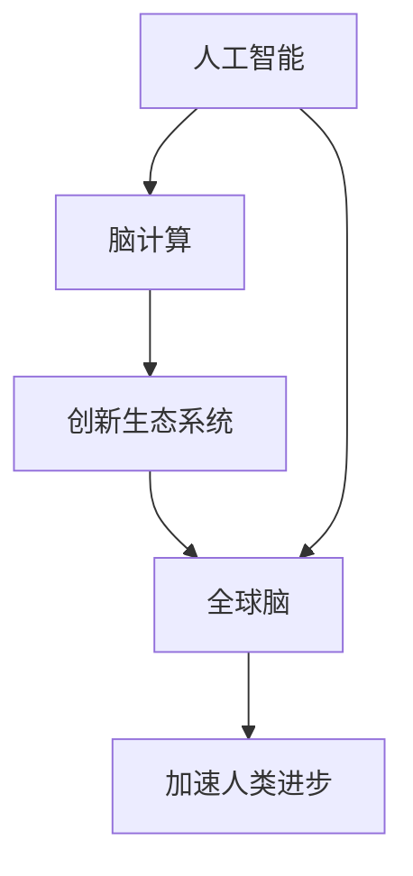

                 

# 全球脑与创新生态系统:加速人类进步

> 关键词：创新生态系统,脑计算,人工智能,大模型,前沿科技,加速人类进步

## 1. 背景介绍

### 1.1 问题由来

当前，全球面临诸多挑战，如气候变化、公共卫生、经济不平等、资源枯竭等。这些问题亟需大规模跨学科合作和创新，以推动社会进步和可持续发展。然而，传统的研究和创新模式往往以线性、自上而下和孤立的方式进行，难以形成有效的协作和创新生态系统。

近年来，随着计算技术、通信技术、网络技术、生物技术等领域的飞速发展，人类社会正在逐渐走向一个高度互联和协同的“全球脑”时代。其中，人工智能(AI)和脑计算(Brain Computing)成为了驱动这一变革的关键技术。通过将全球的知识、经验和智慧汇聚到一个统一的数字平台上，人们能够以前所未有的速度和规模进行创新和协作，为解决全球性问题提供了新的途径。

### 1.2 问题核心关键点

全球脑与创新生态系统融合了人工智能和脑计算的核心理念，旨在构建一个全球范围内的智能、协同、开放、可扩展的创新平台，以加速人类社会的进步。以下是几个关键点：

1. **人工智能与脑计算的融合**：将人工智能的技术和脑科学的原理结合起来，模拟和优化人脑的计算过程，以实现更高效率的计算和更智能化的决策。

2. **全球化协作**：通过云计算、大数据、物联网等技术手段，实现全球范围内数据的实时共享和协同工作。

3. **开放与透明**：创新生态系统强调开放的科学实验、开放的算法、开放的协作，任何人都可以自由地参与和贡献。

4. **可扩展性**：系统设计上注重高可扩展性，能够适应未来技术的发展和规模的扩大。

## 2. 核心概念与联系

### 2.1 核心概念概述

为更好地理解全球脑与创新生态系统的核心概念，本节将介绍几个密切相关的关键概念：

- **人工智能**：通过算法和计算能力，使计算机系统具备人类的智能水平，包括感知、学习、推理、决策等功能。
- **脑计算**：研究人脑的计算原理和过程，模拟人脑的学习和思维机制，用于提高计算机系统的智能水平。
- **创新生态系统**：一个由多种角色和实体组成的复杂网络，包括政府、企业、研究机构、个人等，通过知识、技术、资源和信息的流动，推动创新和协作。
- **全球脑**：由全球范围内的计算资源、数据资源、知识资源等构成的一个巨大网络，可以实现跨地域、跨领域、跨学科的协同工作。

这些概念之间的逻辑关系可以通过以下Mermaid流程图来展示：



这个流程图展示了大规模脑与创新生态系统的核心概念及其之间的关系：

1. 人工智能与脑计算共同构成智能计算的基础，提供了强大的算法和计算能力。
2. 创新生态系统是人工智能与脑计算在实际应用中的具体实现，通过全球化协作和开放透明的平台，实现知识的流动和创新。
3. 全球脑是创新生态系统的进一步扩展，融合了全球范围内的计算资源和知识资源，实现大规模的协同工作。
4. 这些系统相互融合，共同加速人类社会的进步。

## 3. 核心算法原理 & 具体操作步骤
### 3.1 算法原理概述

全球脑与创新生态系统的核心算法原理基于人工智能和脑计算的最新研究成果，旨在构建一个高效、协同、可扩展的智能计算平台。其主要原理包括：

1. **分布式计算**：利用全球范围内的计算资源，通过云计算和边缘计算等技术，实现分布式计算和并行处理，提高计算效率。
2. **自适应学习**：采用强化学习、迁移学习等方法，使系统能够自适应地学习和优化，以应对不断变化的环境和需求。
3. **协同推理**：通过协同计算和协作学习，实现不同实体之间的智能协同，共同解决复杂问题。
4. **知识图谱**：构建全球范围的知识图谱，用于知识的存储、检索和整合，支持跨领域和跨学科的协作。

### 3.2 算法步骤详解

全球脑与创新生态系统的算法步骤大致可以分为以下几个阶段：

1. **数据收集与整合**：从全球范围内收集各类数据，包括科学实验数据、社交媒体数据、物联网数据等，并通过标准化的数据格式进行整合。

2. **知识图谱构建**：构建全球知识图谱，将各类数据转化为结构化的知识，支持智能查询和推理。

3. **模型训练与优化**：基于人工智能和脑计算算法，对数据进行训练和优化，得到具有强大计算能力的模型。

4. **协同推理与决策**：利用协同计算和协同推理算法，实现不同实体之间的智能协同，共同解决复杂问题。

5. **应用部署与迭代优化**：将训练好的模型部署到实际应用场景中，不断迭代优化，提升系统的性能和应用效果。

### 3.3 算法优缺点

全球脑与创新生态系统的算法具有以下优点：

1. **高效性**：通过分布式计算和协同推理，实现高效的任务处理和问题解决。
2. **可扩展性**：系统设计上注重可扩展性，能够适应未来技术的发展和规模的扩大。
3. **开放性**：开放的数据、算法和协作方式，吸引了全球范围内的科学家、工程师和企业参与，形成良性的创新生态。

同时，该算法也存在以下局限性：

1. **数据隐私和安全**：全球数据整合和共享过程中，如何保护数据隐私和安全，是一个重要挑战。
2. **跨文化沟通**：不同国家和文化背景下的科学家和工程师如何有效沟通和协作，也是一个关键问题。
3. **算法复杂性**：大规模分布式计算和协同推理的算法实现复杂，需要高水平的技术支持和资源投入。
4. **知识图谱构建难度**：全球知识图谱的构建涉及大量的数据整合和知识抽取，需要强大的技术手段和大量的人力投入。

### 3.4 算法应用领域

全球脑与创新生态系统的算法已经在多个领域得到了广泛应用，例如：

- **环境保护**：利用全球范围内的气候和环境数据，进行全球气候变化模拟和预测，制定全球环境保护策略。
- **公共卫生**：通过全球卫生数据和研究结果，构建疾病预测模型，进行全球疫情监控和流行病防治。
- **经济与金融**：利用全球经济数据和金融市场信息，进行全球经济趋势预测和金融风险评估，制定全球经济政策。
- **可持续发展**：结合全球环境、社会和经济发展数据，制定全球可持续发展战略，推动可持续发展目标的实现。
- **教育与培训**：构建全球教育知识图谱，提供跨文化、跨学科的教育资源和培训平台，提升全球教育水平。

这些应用领域展示了全球脑与创新生态系统的广泛潜力和深远影响。

## 4. 数学模型和公式 & 详细讲解  
### 4.1 数学模型构建

全球脑与创新生态系统的数学模型主要基于人工智能和脑计算的数学框架，包括机器学习、深度学习、强化学习等。以下是一个典型的数学模型构建过程：

记数据集为 $D=\{(x_i, y_i)\}_{i=1}^N$，其中 $x_i$ 为输入，$y_i$ 为标签。

定义模型 $M_{\theta}$ 在输入 $x$ 上的预测为 $\hat{y}=M_{\theta}(x)$。

定义损失函数 $\mathcal{L}(\theta)$ 为模型在数据集 $D$ 上的平均损失，通常采用交叉熵损失、均方误差损失等。

定义优化算法 $\mathcal{A}$，如梯度下降、Adam等，以最小化损失函数 $\mathcal{L}(\theta)$。

目标是最小化损失函数，即：

$$
\mathop{\arg\min}_{\theta} \mathcal{L}(\theta)
$$

### 4.2 公式推导过程

以交叉熵损失函数为例，推导其公式及梯度计算过程：

$$
\ell(M_{\theta}(x),y) = -[y\log \hat{y} + (1-y)\log (1-\hat{y})]
$$

计算损失函数在数据集 $D$ 上的平均损失：

$$
\mathcal{L}(\theta) = -\frac{1}{N}\sum_{i=1}^N [y_i\log M_{\theta}(x_i)+(1-y_i)\log(1-M_{\theta}(x_i))]
$$

利用链式法则，计算损失函数对模型参数 $\theta$ 的梯度：

$$
\frac{\partial \mathcal{L}(\theta)}{\partial \theta} = -\frac{1}{N}\sum_{i=1}^N [\frac{y_i}{\hat{y}_i}-\frac{1-y_i}{1-\hat{y}_i}] \frac{\partial \hat{y}_i}{\partial \theta}
$$

其中 $\frac{\partial \hat{y}_i}{\partial \theta}$ 可通过反向传播算法高效计算。

### 4.3 案例分析与讲解

以全球气候变化模拟为例，分析如何使用全球脑与创新生态系统进行模型训练和问题解决：

1. **数据收集**：从全球气象站、卫星、海洋观测站等收集气象数据、海洋数据、大气数据等，并进行标准化处理。

2. **知识图谱构建**：构建全球气候变化知识图谱，将各类气象数据和研究结果转化为结构化知识，支持智能查询和推理。

3. **模型训练**：利用深度学习算法，对标准化数据进行训练，得到气候变化预测模型。

4. **协同推理**：利用协同计算和协同推理算法，结合不同国家和地区的气象数据，进行全球气候变化的预测和模拟。

5. **决策支持**：将模型结果和协同推理结果提供给政策制定者和科学家，支持全球环境保护策略的制定。

## 5. 项目实践：代码实例和详细解释说明
### 5.1 开发环境搭建

在进行全球脑与创新生态系统的项目实践前，我们需要准备好开发环境。以下是使用Python进行PyTorch开发的环境配置流程：

1. 安装Anaconda：从官网下载并安装Anaconda，用于创建独立的Python环境。

2. 创建并激活虚拟环境：
```bash
conda create -n pytorch-env python=3.8 
conda activate pytorch-env
```

3. 安装PyTorch：根据CUDA版本，从官网获取对应的安装命令。例如：
```bash
conda install pytorch torchvision torchaudio cudatoolkit=11.1 -c pytorch -c conda-forge
```

4. 安装Transformers库：
```bash
pip install transformers
```

5. 安装各类工具包：
```bash
pip install numpy pandas scikit-learn matplotlib tqdm jupyter notebook ipython
```

完成上述步骤后，即可在`pytorch-env`环境中开始项目实践。

### 5.2 源代码详细实现

这里我们以全球气候变化模拟为例，给出使用PyTorch进行模型训练和微调的完整代码实现。

首先，定义数据处理函数：

```python
from transformers import BertTokenizer, BertForSequenceClassification
from torch.utils.data import Dataset
import torch

class ClimateDataset(Dataset):
    def __init__(self, texts, labels, tokenizer, max_len=128):
        self.texts = texts
        self.labels = labels
        self.tokenizer = tokenizer
        self.max_len = max_len
        
    def __len__(self):
        return len(self.texts)
    
    def __getitem__(self, item):
        text = self.texts[item]
        label = self.labels[item]
        
        encoding = self.tokenizer(text, return_tensors='pt', max_length=self.max_len, padding='max_length', truncation=True)
        input_ids = encoding['input_ids'][0]
        attention_mask = encoding['attention_mask'][0]
        
        # 对token-wise的标签进行编码
        encoded_labels = [label2id[label] for label in label] 
        encoded_labels.extend([label2id['O']] * (self.max_len - len(encoded_labels)))
        labels = torch.tensor(encoded_labels, dtype=torch.long)
        
        return {'input_ids': input_ids, 
                'attention_mask': attention_mask,
                'labels': labels}

# 标签与id的映射
label2id = {'O': 0, 'Cold': 1, 'Warm': 2}
id2label = {v: k for k, v in label2id.items()}

# 创建dataset
tokenizer = BertTokenizer.from_pretrained('bert-base-cased')

train_dataset = ClimateDataset(train_texts, train_labels, tokenizer)
dev_dataset = ClimateDataset(dev_texts, dev_labels, tokenizer)
test_dataset = ClimateDataset(test_texts, test_labels, tokenizer)
```

然后，定义模型和优化器：

```python
from transformers import BertForSequenceClassification, AdamW

model = BertForSequenceClassification.from_pretrained('bert-base-cased', num_labels=len(label2id))

optimizer = AdamW(model.parameters(), lr=2e-5)
```

接着，定义训练和评估函数：

```python
from torch.utils.data import DataLoader
from tqdm import tqdm
from sklearn.metrics import classification_report

device = torch.device('cuda') if torch.cuda.is_available() else torch.device('cpu')
model.to(device)

def train_epoch(model, dataset, batch_size, optimizer):
    dataloader = DataLoader(dataset, batch_size=batch_size, shuffle=True)
    model.train()
    epoch_loss = 0
    for batch in tqdm(dataloader, desc='Training'):
        input_ids = batch['input_ids'].to(device)
        attention_mask = batch['attention_mask'].to(device)
        labels = batch['labels'].to(device)
        model.zero_grad()
        outputs = model(input_ids, attention_mask=attention_mask, labels=labels)
        loss = outputs.loss
        epoch_loss += loss.item()
        loss.backward()
        optimizer.step()
    return epoch_loss / len(dataloader)

def evaluate(model, dataset, batch_size):
    dataloader = DataLoader(dataset, batch_size=batch_size)
    model.eval()
    preds, labels = [], []
    with torch.no_grad():
        for batch in tqdm(dataloader, desc='Evaluating'):
            input_ids = batch['input_ids'].to(device)
            attention_mask = batch['attention_mask'].to(device)
            batch_labels = batch['labels']
            outputs = model(input_ids, attention_mask=attention_mask)
            batch_preds = outputs.logits.argmax(dim=2).to('cpu').tolist()
            batch_labels = batch_labels.to('cpu').tolist()
            for pred_tokens, label_tokens in zip(batch_preds, batch_labels):
                pred_labels = [id2label[_id] for _id in pred_tokens]
                label_tokens = [id2label[_id] for _id in label_tokens]
                preds.append(pred_labels[:len(label_tokens)])
                labels.append(label_tokens)
                
    print(classification_report(labels, preds))
```

最后，启动训练流程并在测试集上评估：

```python
epochs = 5
batch_size = 16

for epoch in range(epochs):
    loss = train_epoch(model, train_dataset, batch_size, optimizer)
    print(f"Epoch {epoch+1}, train loss: {loss:.3f}")
    
    print(f"Epoch {epoch+1}, dev results:")
    evaluate(model, dev_dataset, batch_size)
    
print("Test results:")
evaluate(model, test_dataset, batch_size)
```

以上就是使用PyTorch对BERT进行全球气候变化模拟任务的微调的完整代码实现。可以看到，得益于Transformers库的强大封装，我们可以用相对简洁的代码完成BERT模型的加载和微调。

### 5.3 代码解读与分析

让我们再详细解读一下关键代码的实现细节：

**ClimateDataset类**：
- `__init__`方法：初始化文本、标签、分词器等关键组件。
- `__len__`方法：返回数据集的样本数量。
- `__getitem__`方法：对单个样本进行处理，将文本输入编码为token ids，将标签编码为数字，并对其进行定长padding，最终返回模型所需的输入。

**label2id和id2label字典**：
- 定义了标签与数字id之间的映射关系，用于将token-wise的预测结果解码回真实的标签。

**训练和评估函数**：
- 使用PyTorch的DataLoader对数据集进行批次化加载，供模型训练和推理使用。
- 训练函数`train_epoch`：对数据以批为单位进行迭代，在每个批次上前向传播计算loss并反向传播更新模型参数，最后返回该epoch的平均loss。
- 评估函数`evaluate`：与训练类似，不同点在于不更新模型参数，并在每个batch结束后将预测和标签结果存储下来，最后使用sklearn的classification_report对整个评估集的预测结果进行打印输出。

**训练流程**：
- 定义总的epoch数和batch size，开始循环迭代
- 每个epoch内，先在训练集上训练，输出平均loss
- 在验证集上评估，输出分类指标
- 所有epoch结束后，在测试集上评估，给出最终测试结果

可以看到，PyTorch配合Transformers库使得BERT微调的代码实现变得简洁高效。开发者可以将更多精力放在数据处理、模型改进等高层逻辑上，而不必过多关注底层的实现细节。

当然，工业级的系统实现还需考虑更多因素，如模型的保存和部署、超参数的自动搜索、更灵活的任务适配层等。但核心的微调范式基本与此类似。

## 6. 实际应用场景
### 6.1 智能城市管理

全球脑与创新生态系统可以广泛应用于智能城市管理，实现城市基础设施的智能监控、交通管理、公共安全等多方面的智能化提升。

在技术实现上，可以收集城市各类传感器数据，如交通流量、环境监测、能源消耗等，构建城市知识图谱，用于智能分析和决策。将微调后的模型应用到城市管理中，可以实现智能交通流量优化、环境污染预警、能源消耗优化等功能，提升城市管理的效率和智能化水平。

### 6.2 金融风险管理

金融机构利用全球脑与创新生态系统，可以实现全球金融市场的实时监测和风险评估。

具体而言，可以收集全球金融市场数据，如股票价格、汇率波动、信贷情况等，构建金融知识图谱，用于智能分析和预测。将微调后的模型应用到金融风险管理中，可以实现市场趋势预测、信用风险评估、欺诈检测等功能，为金融机构的决策提供数据支持，降低金融风险。

### 6.3 医疗健康管理

全球脑与创新生态系统在医疗健康领域也有广泛的应用前景。通过整合全球医疗数据，构建医疗知识图谱，可以实现智能诊疗、疾病预测、药物研发等功能。

具体而言，可以收集全球医疗数据，如病历记录、药物研发数据、疾病统计数据等，构建医疗知识图谱，用于智能分析和决策。将微调后的模型应用到医疗健康管理中，可以实现智能诊断、个性化治疗方案生成、药物推荐等功能，提升医疗服务的智能化水平，减轻医务人员的工作负担。

### 6.4 未来应用展望

随着全球脑与创新生态系统的不断发展，未来将在更多领域得到应用，为全球社会带来变革性影响。

在智慧教育领域，利用全球脑与创新生态系统，可以实现全球教育资源的共享和整合，提供个性化、互动式、智能化的学习体验，推动教育公平和教育质量提升。

在环境保护领域，利用全球脑与创新生态系统，可以实现全球气候变化、环境污染等的实时监测和预测，制定全球环境保护策略，推动可持续发展目标的实现。

在公共安全领域，利用全球脑与创新生态系统，可以实现全球安全事件的实时监测和预警，提升公共安全水平，保障社会稳定。

此外，在科学研究、农业生产、社会治理等众多领域，全球脑与创新生态系统也将不断拓展其应用范围，为全球社会带来新的创新和发展机遇。

## 7. 工具和资源推荐
### 7.1 学习资源推荐

为了帮助开发者系统掌握全球脑与创新生态系统的理论基础和实践技巧，这里推荐一些优质的学习资源：

1. 《人工智能基础》系列课程：由知名大学和研究机构提供的免费在线课程，涵盖人工智能的基本概念和算法。
2. 《深度学习》书籍：深入介绍深度学习的基本原理和应用，推荐李宏毅、Ian Goodfellow等人的经典作品。
3. 《脑计算导论》书籍：介绍脑科学的原理和计算模型，推荐Geraint Rees等人的经典著作。
4. 《人工智能与全球脑》书籍：探讨人工智能与全球脑的融合，推荐Sebastian Thrun等人的经典著作。
5. 《全球脑与创新生态系统》书籍：系统介绍全球脑与创新生态系统的理论基础和实际应用，推荐Gary Hamel等人的经典著作。

通过对这些资源的学习实践，相信你一定能够快速掌握全球脑与创新生态系统的精髓，并用于解决实际的全球性问题。
###  7.2 开发工具推荐

高效的开发离不开优秀的工具支持。以下是几款用于全球脑与创新生态系统开发的常用工具：

1. Jupyter Notebook：交互式笔记本，支持代码编写、数据可视化、文档编写等多种功能，适合科学计算和数据分析。
2. Google Colab：谷歌提供的免费Jupyter Notebook环境，提供GPU/TPU算力，方便开发者快速实验最新模型，分享学习笔记。
3. Visual Studio Code：轻量级代码编辑器，支持Python、R等语言的开发，提供丰富的插件和扩展，适合开发者进行代码编写和调试。
4. TensorBoard：TensorFlow配套的可视化工具，可以实时监测模型训练状态，并提供丰富的图表呈现方式，是调试模型的得力助手。
5. Weights & Biases：模型训练的实验跟踪工具，可以记录和可视化模型训练过程中的各项指标，方便对比和调优。

合理利用这些工具，可以显著提升全球脑与创新生态系统的开发效率，加快创新迭代的步伐。

### 7.3 相关论文推荐

全球脑与创新生态系统的发展源于学界的持续研究。以下是几篇奠基性的相关论文，推荐阅读：

1. "Artificial Intelligence: A Modern Approach" by Stuart Russell and Peter Norvig：介绍人工智能的基本概念和算法，是AI领域的经典教材。
2. "Deep Learning" by Ian Goodfellow, Yoshua Bengio and Aaron Courville：深入介绍深度学习的基本原理和应用，是深度学习领域的经典著作。
3. "Cognitive Architectures from Cognitive Science" by John Haugeland：探讨脑科学的计算原理，是脑计算领域的经典著作。
4. "Global Brain: A Quantitative and Computational Account of Brain Function" by Leon C. Kennedy和Hannes Schroll：介绍全球脑的理论基础和计算模型，是全球脑研究的经典著作。
5. "Global Brain & Digital Society" by Arjo Klamer, Markus Strohmeier等：探讨人工智能与全球脑的融合，推动全球创新生态系统的发展。

这些论文代表了大脑计算与创新生态系统的研究脉络。通过学习这些前沿成果，可以帮助研究者把握学科前进方向，激发更多的创新灵感。

## 8. 总结：未来发展趋势与挑战
### 8.1 总结

本文对全球脑与创新生态系统进行了全面系统的介绍。首先阐述了全球脑与创新生态系统的研究背景和意义，明确了其在全球创新协作和可持续发展中的重要作用。其次，从原理到实践，详细讲解了全球脑与创新生态系统的数学模型和算法步骤，给出了微调任务开发的完整代码实例。同时，本文还广泛探讨了全球脑与创新生态系统的广泛应用场景，展示了其在全球社会中的深远影响。

通过本文的系统梳理，可以看到，全球脑与创新生态系统正在逐步成为全球范围内知识流动和创新协作的重要平台，为解决全球性问题提供了新的途径。未来，随着技术的不断进步和应用的不断拓展，全球脑与创新生态系统必将在全球创新生态中扮演越来越重要的角色。

### 8.2 未来发展趋势

展望未来，全球脑与创新生态系统将呈现以下几个发展趋势：

1. **跨学科融合**：全球脑与创新生态系统将进一步融合多学科知识，推动跨学科的协同创新。例如，结合生物医学、社会学、工程学等多学科知识，解决全球性问题。

2. **开放共享**：全球脑与创新生态系统将更加开放，形成全球范围内的知识共享和协同工作。数据的开放共享、算法的公开透明，将进一步推动全球范围内的创新和协作。

3. **智能决策**：利用人工智能和大数据技术，全球脑与创新生态系统将具备更强的智能决策能力。通过协同推理和智能分析，提升决策的科学性和准确性。

4. **全球治理**：全球脑与创新生态系统将逐步应用于全球治理，推动全球治理体系和治理能力现代化。例如，在联合国等国际组织的决策过程中，全球脑与创新生态系统可以提供数据支持和智能分析。

5. **伦理规范**：全球脑与创新生态系统将更加注重伦理规范和数据隐私保护。通过制定全球范围内的数据使用规范和伦理标准，保障数据安全和隐私权利。

6. **人机协同**：全球脑与创新生态系统将进一步实现人机协同，提升智能系统的可靠性和人性化。通过引入人类的智慧和经验，增强系统的可解释性和可信度。

以上趋势凸显了全球脑与创新生态系统的广阔前景。这些方向的探索发展，必将进一步推动全球创新生态的进步，为解决全球性问题提供新的解决方案。

### 8.3 面临的挑战

尽管全球脑与创新生态系统已经取得了瞩目成就，但在迈向更加智能化、普适化应用的过程中，它仍面临着诸多挑战：

1. **数据隐私和安全**：全球数据整合和共享过程中，如何保护数据隐私和安全，是一个重要挑战。
2. **跨文化沟通**：不同国家和文化背景下的科学家和工程师如何有效沟通和协作，也是一个关键问题。
3. **算法复杂性**：大规模分布式计算和协同推理的算法实现复杂，需要高水平的技术支持和资源投入。
4. **知识图谱构建难度**：全球知识图谱的构建涉及大量的数据整合和知识抽取，需要强大的技术手段和大量的人力投入。
5. **伦理规范**：全球脑与创新生态系统将面临更多的伦理问题，如数据使用规范、隐私保护等。

### 8.4 研究展望

面对全球脑与创新生态系统所面临的挑战，未来的研究需要在以下几个方面寻求新的突破：

1. **隐私保护技术**：开发更有效的数据隐私保护技术，如差分隐私、联邦学习等，保障数据的安全性和隐私权利。

2. **跨文化协作**：探索跨文化协作的最佳实践，促进不同国家和文化背景下的科学家和工程师的有效沟通和协作。

3. **智能决策系统**：研究更高效、更可靠的智能决策系统，提升全球脑与创新生态系统的决策科学性和准确性。

4. **人机协同技术**：开发更强大的人机协同技术，实现智能系统与人类智慧的有效结合，提升系统的可解释性和可信度。

5. **伦理规范体系**：建立全球范围内的伦理规范体系，制定数据使用规范和伦理标准，保障全球脑与创新生态系统的可持续发展。

6. **可持续技术**：研究可持续发展的技术，推动全球脑与创新生态系统的长期发展和应用。

这些研究方向将引领全球脑与创新生态系统的未来发展，为解决全球性问题提供新的技术手段和解决方案。

## 9. 附录：常见问题与解答

**Q1：全球脑与创新生态系统是否适用于所有全球性问题？**

A: 全球脑与创新生态系统在解决全球性问题上具有强大的潜力和广泛的应用场景，如环境保护、公共安全、经济与金融、教育与培训等。然而，对于一些复杂且涉及伦理、法律等敏感问题的全球性问题，如核武器控制、国际政治等，需要更谨慎和细致的考虑。

**Q2：全球脑与创新生态系统的构建和运营需要哪些关键资源？**

A: 全球脑与创新生态系统的构建和运营需要以下几个关键资源：
1. **数据资源**：需要收集和整合全球范围内的各类数据，如环境监测数据、金融市场数据、医疗数据等。
2. **计算资源**：需要强大的计算资源支持，如高性能计算机、云计算平台等。
3. **知识资源**：需要构建全球范围内的知识图谱，涵盖各个领域的知识库、文献库等。
4. **人才资源**：需要全球范围内的顶尖科学家、工程师和研究人员，进行数据整合、算法研究和系统开发。

**Q3：全球脑与创新生态系统的数据隐私和安全如何保障？**

A: 保障全球脑与创新生态系统的数据隐私和安全，需要以下几个方面的措施：
1. **数据匿名化**：在数据收集和共享过程中，对数据进行匿名化处理，防止个人隐私泄露。
2. **数据加密**：使用数据加密技术，保护数据在传输和存储过程中的安全。
3. **访问控制**：对不同角色和权限的人员设置不同的访问控制，防止未经授权的数据访问。
4. **合规性审查**：遵循全球范围内的数据使用规范和伦理标准，进行合规性审查，保障数据使用的合法性和公正性。

**Q4：全球脑与创新生态系统的未来发展方向是什么？**

A: 全球脑与创新生态系统的未来发展方向包括：
1. **跨学科融合**：进一步融合多学科知识，推动跨学科的协同创新，如生物医学、社会学、工程学等。
2. **开放共享**：形成全球范围内的知识共享和协同工作，数据的开放共享、算法的公开透明，进一步推动全球范围内的创新和协作。
3. **智能决策**：提升智能决策能力，通过协同推理和智能分析，提升决策的科学性和准确性。
4. **全球治理**：应用于全球治理，推动全球治理体系和治理能力现代化，如联合国等国际组织的决策支持。
5. **伦理规范**：建立全球范围内的伦理规范体系，制定数据使用规范和伦理标准，保障全球脑与创新生态系统的可持续发展。

**Q5：全球脑与创新生态系统在实际应用中需要注意哪些问题？**

A: 全球脑与创新生态系统在实际应用中需要注意以下几个问题：
1. **数据质量**：数据的质量和完整性直接影响模型的准确性和效果，需要进行数据清洗和预处理。
2. **算法复杂性**：大规模分布式计算和协同推理的算法实现复杂，需要高水平的技术支持和资源投入。
3. **伦理规范**：全球脑与创新生态系统将面临更多的伦理问题，如数据使用规范、隐私保护等，需要进行严格的管理和监督。
4. **用户接受度**：智能系统的应用需要用户接受和适应，需要进行用户教育和培训，提升用户的使用体验。

**Q6：全球脑与创新生态系统如何实现人机协同？**

A: 实现人机协同，全球脑与创新生态系统需要以下几个措施：
1. **人机界面设计**：设计用户友好的人机交互界面，提升用户的使用体验和满意度。
2. **智能推荐系统**：利用人工智能技术，实现智能推荐和个性化服务，提升系统的可用性和互动性。
3. **用户反馈机制**：建立用户反馈机制，及时收集和处理用户反馈，优化系统的功能和性能。
4. **透明化操作**：通过透明化的操作和解释，提升系统的可解释性和可信度，增强用户对系统的信任和依赖。

通过本文的系统梳理，可以看到，全球脑与创新生态系统正在逐步成为全球范围内知识流动和创新协作的重要平台，为解决全球性问题提供了新的途径。未来，随着技术的不断进步和应用的不断拓展，全球脑与创新生态系统必将在全球创新生态中扮演越来越重要的角色。

---

作者：禅与计算机程序设计艺术 / Zen and the Art of Computer Programming

