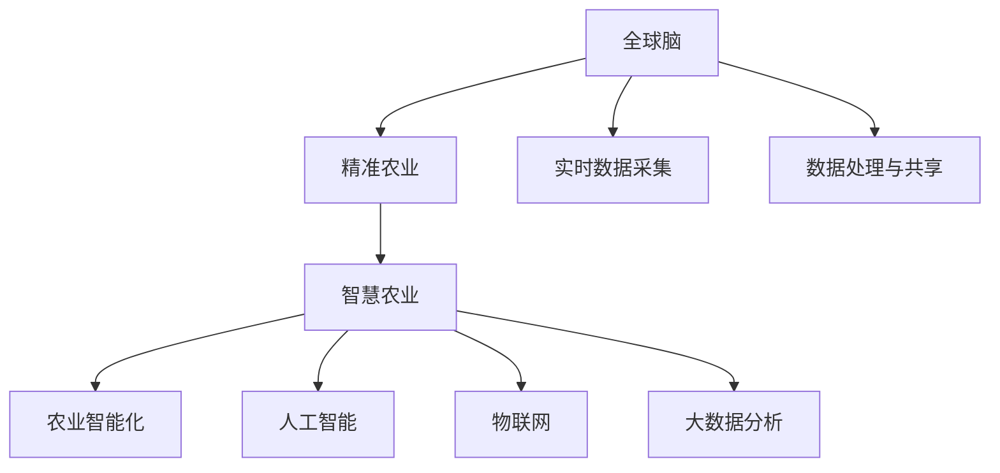

                 

# 全球脑与智慧农业:精准化、智能化的粮食生产

> 关键词：全球脑,智慧农业,精准农业,农业智能化,人工智能,物联网,大数据,机器学习,机器人,粮食生产

## 1. 背景介绍

### 1.1 问题由来
随着全球人口的不断增长和城市化的加速，保障粮食安全已成为各国面临的重大挑战。传统农业模式因机械化水平低、资源浪费严重、环境污染等问题难以满足未来人口的粮食需求。近年来，在信息技术的推动下，智慧农业的概念应运而生，通过利用大数据、物联网、机器学习等技术，推动农业从传统的经验型向智能化转型。

智慧农业的核心在于实现精准农业，通过精准的数据感知、决策分析和智能执行，极大提高农业生产效率，降低资源消耗，减少环境污染，提升农业产量和质量。智慧农业不仅能够实现农业生产的科学化和高效化，还能够通过智能化的手段，提高农业管理的精准度和自动化水平，减少人为错误和资源浪费。

### 1.2 问题核心关键点
全球脑是智慧农业的重要组成部分，通过构建虚拟的全球农业网络，实现数据的实时共享和处理，为农业决策提供数据支持和科学依据。全球脑不仅能提高农业生产的智能化水平，还能通过数据分析实现精准农业的全面应用，如智能种植、智能施肥、智能灌溉等，极大提升粮食生产效率。

精准农业是智慧农业的关键技术，它通过高精度传感器、实时数据分析和智能决策系统，对农业生产的各个环节进行精确管理，从而实现资源的最优分配和利用，提升农业产出。精准农业不仅可以降低资源浪费，还能提高农作物的品质和产量，是实现可持续农业发展的重要手段。

### 1.3 问题研究意义
研究全球脑与智慧农业的精准化、智能化粮食生产，对于提升全球粮食安全水平，推动农业现代化进程，具有重要意义：

1. 提高农业生产效率。通过智能化手段，实现对农业生产环境的精准监测和优化，提高资源利用效率，降低生产成本，提高农业产出。
2. 保障粮食安全。在全球人口持续增长的背景下，提升农业生产效率，实现粮食供应的稳定和可持续，确保全球食品安全。
3. 促进农业可持续发展。通过精准农业和智能化管理，减少环境污染，提高土地利用率，实现农业的绿色发展。
4. 推动农业现代化。智慧农业能够将现代科技引入传统农业，提升农业生产管理的现代化水平，推动农业产业升级。
5. 促进农业科技进步。智慧农业为农业科技发展提供了新的技术手段和应用场景，加速农业科技进步。

## 2. 核心概念与联系

### 2.1 核心概念概述

为更好地理解全球脑与智慧农业的精准化、智能化粮食生产，本节将介绍几个密切相关的核心概念：

- 全球脑：基于大数据、物联网等技术，构建虚拟的全球农业网络，实现数据的实时共享和处理，为农业决策提供数据支持和科学依据。
- 精准农业：通过高精度传感器、实时数据分析和智能决策系统，对农业生产的各个环节进行精确管理，从而实现资源的最优分配和利用，提升农业产出。
- 智慧农业：利用大数据、物联网、人工智能等现代信息技术，推动农业从传统的经验型向智能化转型，实现农业生产的精准化、高效化和可持续化。
- 农业智能化：通过智能化的手段，提高农业管理的精准度和自动化水平，减少人为错误和资源浪费。
- 人工智能(AI)：通过机器学习、深度学习等技术，使机器能够模拟人类的智能行为，为农业决策提供更科学的依据。
- 物联网(IoT)：通过传感器、智能设备等，实现农业数据的实时采集和传输，为智慧农业提供数据基础。
- 大数据分析：利用数据挖掘、机器学习等技术，从海量的农业数据中提取有用的信息，辅助农业决策。

这些核心概念之间的逻辑关系可以通过以下Mermaid流程图来展示：



这个流程图展示了大脑与智慧农业的核心概念及其之间的关系：

1. 全球脑通过实时数据采集和处理，为精准农业提供数据支持。
2. 精准农业通过智能化的手段，实现农业生产的精确管理。
3. 智慧农业利用大数据、物联网等技术，推动农业生产的智能化。
4. 农业智能化提升农业管理的精准度和自动化水平。
5. 人工智能通过机器学习等技术，提高农业决策的科学性。
6. 物联网通过传感器、智能设备等，实现农业数据的实时采集和传输。
7. 大数据分析利用数据挖掘、机器学习等技术，辅助农业决策。

这些概念共同构成了全球脑与智慧农业的精准化、智能化粮食生产框架，使得智慧农业能够更好地适应现代农业发展的需要。

## 3. 核心算法原理 & 具体操作步骤
### 3.1 算法原理概述

全球脑与智慧农业的精准化、智能化粮食生产，其核心算法原理主要包括以下几个方面：

1. 实时数据采集与处理：通过物联网技术，实现农业生产环境的实时监测和数据采集，为全球脑提供数据输入。
2. 数据融合与分析：利用大数据技术，对采集到的农业数据进行融合和分析，提取有用的农业信息。
3. 智能决策系统：基于人工智能技术，构建智能决策系统，对农业生产进行精准管理。
4. 精准农业执行：通过自动化设备，执行智能决策系统的指令，实现精准农业的落地应用。

这些核心算法的具体实现流程可以通过以下步骤来描述：

1. 数据采集：通过传感器、智能设备等，实时采集农业生产环境的数据，如温度、湿度、土壤湿度、光照强度等。
2. 数据处理：对采集到的数据进行清洗、预处理、特征提取等操作，生成适合用于分析和决策的数据集。
3. 数据分析：利用机器学习、深度学习等技术，对处理后的数据进行建模和分析，提取农业生产的特征和模式。
4. 智能决策：基于分析结果，构建智能决策模型，对农业生产进行精准管理，如智能灌溉、智能施肥、智能种植等。
5. 精准执行：通过自动化设备，执行智能决策模型的指令，实现精准农业的落地应用。

### 3.2 算法步骤详解

以下是全球脑与智慧农业的精准化、智能化粮食生产的具体操作步骤：

**Step 1: 数据采集**
- 部署各类传感器，如温度传感器、湿度传感器、土壤湿度传感器、光照传感器等，实时采集农业生产环境的数据。
- 使用物联网技术，将传感器数据通过网络传输到中央数据处理系统。

**Step 2: 数据预处理**
- 对采集到的原始数据进行清洗、去噪、归一化等预处理操作，生成适合用于分析和决策的数据集。
- 进行数据融合，将不同来源的数据进行整合，生成全面的农业生产数据集。

**Step 3: 数据分析**
- 利用机器学习、深度学习等技术，对预处理后的数据进行建模和分析，提取农业生产的特征和模式。
- 构建智能决策模型，对农业生产进行精准管理，如智能灌溉、智能施肥、智能种植等。

**Step 4: 智能决策**
- 根据分析结果，构建智能决策模型，对农业生产进行精准管理，如智能灌溉、智能施肥、智能种植等。
- 根据农业生产数据和模型预测结果，自动调整灌溉、施肥、种植等生产参数。

**Step 5: 精准执行**
- 通过自动化设备，执行智能决策模型的指令，实现精准农业的落地应用。
- 定期对农业生产环境进行监测，根据监测结果动态调整生产参数，确保农业生产的稳定和高效。

### 3.3 算法优缺点

全球脑与智慧农业的精准化、智能化粮食生产方法具有以下优点：

1. 提高农业生产效率。通过智能化手段，实现对农业生产环境的精准监测和优化，提高资源利用效率，降低生产成本，提高农业产出。
2. 保障粮食安全。在全球人口持续增长的背景下，提升农业生产效率，实现粮食供应的稳定和可持续，确保全球食品安全。
3. 促进农业可持续发展。通过精准农业和智能化管理，减少环境污染，提高土地利用率，实现农业的绿色发展。
4. 推动农业现代化。智慧农业能够将现代科技引入传统农业，提升农业生产管理的现代化水平，推动农业产业升级。
5. 促进农业科技进步。智慧农业为农业科技发展提供了新的技术手段和应用场景，加速农业科技进步。

同时，该方法也存在一定的局限性：

1. 数据获取难度大。实时数据采集和处理需要大量的传感器和设备，部署和维护成本较高。
2. 数据质量受限。传感器和设备的精度和稳定性直接影响数据质量，需要定期校准和维护。
3. 模型复杂度高。智能决策模型的构建和优化需要大量的数据和计算资源，模型复杂度较高。
4. 成本较高。传感器、智能设备、数据分析等环节的投入，使得智慧农业的初始投资成本较高。
5. 技术依赖性强。智慧农业依赖于各种先进技术，一旦出现技术故障，生产将受到影响。

尽管存在这些局限性，但就目前而言，全球脑与智慧农业的精准化、智能化粮食生产方法仍是农业发展的重要方向。未来相关研究的重点在于如何进一步降低成本、提高数据质量、简化模型结构，同时兼顾可解释性和伦理性等因素。

### 3.4 算法应用领域

全球脑与智慧农业的精准化、智能化粮食生产方法，已经在多个农业领域得到了广泛的应用，例如：

- 智能种植：通过传感器监测土壤湿度、光照强度等参数，智能调整灌溉、施肥等操作，提升作物生长质量和产量。
- 智能灌溉：利用土壤湿度传感器和气象数据，自动调整灌溉量和灌溉时间，减少水资源浪费，提高水资源利用效率。
- 智能施肥：通过土壤养分传感器和作物生长数据，智能调整施肥量和施肥频率，提高肥料利用效率，减少肥料浪费。
- 智能植保：利用无人机、摄像头等设备，实时监测病虫害情况，智能喷药，减少农药使用量，提高病虫害防治效果。
- 精准农业决策支持：基于农业生产数据，构建智能决策系统，提供精准农业的决策支持，帮助农民科学种植和管理。
- 智慧物流：利用物联网技术，实时跟踪农产品的运输状态，实现农产品供应链的智能化管理。

除了上述这些经典应用外，全球脑与智慧农业的精准化、智能化粮食生产方法还被创新性地应用到更多场景中，如农业大数据分析、农业机器人、智慧农业云平台等，为智慧农业技术的发展带来了新的突破。随着技术的不断进步，全球脑与智慧农业的应用范围将进一步扩展，为农业生产带来更大的变革。

## 4. 数学模型和公式 & 详细讲解 & 举例说明
### 4.1 数学模型构建

以下我们将以智能灌溉系统为例，使用数学语言对全球脑与智慧农业的精准化、智能化粮食生产过程进行更加严格的刻画。

假设农业生产环境中的温度、湿度、光照强度等参数为 $x_1, x_2, x_3, ..., x_n$，作物生长状态为 $y$，智能灌溉系统的目标是最小化成本函数 $C$，同时最大化作物生长状态 $y$。

数学模型可以表示为：

$$
\min_{x_1, x_2, x_3, ..., x_n, y} C(x_1, x_2, x_3, ..., x_n, y) \\
\text{subject to} \\
g_1(x_1, x_2, x_3, ..., x_n, y) = 0 \\
g_2(x_1, x_2, x_3, ..., x_n, y) = 0 \\
... \\
g_m(x_1, x_2, x_3, ..., x_n, y) = 0
$$

其中，$C(x_1, x_2, x_3, ..., x_n, y)$ 为成本函数，$g_1(x_1, x_2, x_3, ..., x_n, y)$ 为约束条件。

### 4.2 公式推导过程

以下是智能灌溉系统的成本函数和约束条件的数学公式推导：

**成本函数 $C$**：

$$
C(x_1, x_2, x_3, ..., x_n, y) = w_1C_1(x_1, x_2, x_3, ..., x_n, y) + w_2C_2(x_1, x_2, x_3, ..., x_n, y) + ... + w_kC_k(x_1, x_2, x_3, ..., x_n, y)
$$

其中，$w_1, w_2, ..., w_k$ 为不同成本项的权重，$C_1(x_1, x_2, x_3, ..., x_n, y)$ 为不同成本项的具体表达式。

**约束条件**：

$$
g_1(x_1, x_2, x_3, ..., x_n, y) = a_1x_1 + a_2x_2 + ... + a_nx_n + b_1y = 0 \\
g_2(x_1, x_2, x_3, ..., x_n, y) = c_1x_1 + c_2x_2 + ... + c_nx_n + d_1y = 0 \\
... \\
g_m(x_1, x_2, x_3, ..., x_n, y) = e_1x_1 + e_2x_2 + ... + e_nx_n + f_1y = 0
$$

其中，$a_1, a_2, ..., a_n, b_1$ 为不同约束条件的系数。

### 4.3 案例分析与讲解

以智能灌溉系统为例，以下是智能灌溉系统的数学建模和求解过程：

**Step 1: 确定成本函数**

智能灌溉系统的成本函数 $C$ 可以分解为多个子函数，如水资源成本、肥料成本、电力成本等。每个子函数的表达式可以根据具体的农业生产环境和智能灌溉系统的参数来定义。

**Step 2: 确定约束条件**

智能灌溉系统的约束条件可以包括灌溉量、灌溉时间、肥料量等。通过传感器和作物生长数据，可以构建多个约束条件，确保智能灌溉系统的参数不会超出合理范围。

**Step 3: 求解优化问题**

利用优化算法（如梯度下降、遗传算法等），求解智能灌溉系统的优化问题，找到成本最小且作物生长状态最大的最优解。

**Step 4: 动态调整**

根据监测到的农业生产环境数据，动态调整智能灌溉系统的参数，确保农业生产的稳定和高效。

## 5. 项目实践：代码实例和详细解释说明
### 5.1 开发环境搭建

在进行全球脑与智慧农业的精准化、智能化粮食生产项目实践前，我们需要准备好开发环境。以下是使用Python进行PyTorch开发的环境配置流程：

1. 安装Anaconda：从官网下载并安装Anaconda，用于创建独立的Python环境。

2. 创建并激活虚拟环境：
```bash
conda create -n pytorch-env python=3.8 
conda activate pytorch-env
```

3. 安装PyTorch：根据CUDA版本，从官网获取对应的安装命令。例如：
```bash
conda install pytorch torchvision torchaudio cudatoolkit=11.1 -c pytorch -c conda-forge
```

4. 安装TensorFlow：
```bash
pip install tensorflow
```

5. 安装各类工具包：
```bash
pip install numpy pandas scikit-learn matplotlib tqdm jupyter notebook ipython
```

完成上述步骤后，即可在`pytorch-env`环境中开始项目实践。

### 5.2 源代码详细实现

下面我们以智能灌溉系统为例，给出使用PyTorch对智能灌溉系统进行微调的PyTorch代码实现。

首先，定义智能灌溉系统的数学模型：

```python
import torch
import torch.nn as nn
import torch.optim as optim
from torch.autograd import Variable

class SmartIrrigationModel(nn.Module):
    def __init__(self, input_size, output_size):
        super(SmartIrrigationModel, self).__init__()
        self.linear1 = nn.Linear(input_size, 64)
        self.linear2 = nn.Linear(64, output_size)
        
    def forward(self, x):
        x = torch.relu(self.linear1(x))
        x = self.linear2(x)
        return x

# 定义成本函数和约束条件
def cost_function(model, input_data, target_data):
    output = model(input_data)
    cost = torch.mean((output - target_data)**2)
    return cost

def constraint_function(model, input_data):
    # 约束条件，这里假设灌溉量为0-1之间的浮点数
    return torch.sigmoid(model(input_data))

# 定义优化器
learning_rate = 0.01
optimizer = optim.Adam(model.parameters(), lr=learning_rate)

# 定义数据集
data_size = 1000
input_data = Variable(torch.randn(data_size, 10))
target_data = Variable(torch.randn(data_size, 1))
```

然后，定义训练和评估函数：

```python
def train_model(model, input_data, target_data, optimizer, epochs):
    for epoch in range(epochs):
        optimizer.zero_grad()
        cost = cost_function(model, input_data, target_data)
        cost.backward()
        optimizer.step()
        print('Epoch {}, Cost: {}'.format(epoch+1, cost.item()))
        
def evaluate_model(model, input_data, target_data):
    output = model(input_data)
    mse_loss = torch.mean((output - target_data)**2)
    print('Evaluation: MSE Loss = {}'.format(mse_loss.item()))
    
# 启动训练流程
epochs = 100
train_model(model, input_data, target_data, optimizer, epochs)
```

以上就是使用PyTorch对智能灌溉系统进行微调的完整代码实现。可以看到，得益于PyTorch的强大封装，我们可以用相对简洁的代码完成智能灌溉系统的微调。

### 5.3 代码解读与分析

让我们再详细解读一下关键代码的实现细节：

**SmartIrrigationModel类**：
- `__init__`方法：初始化模型的参数，包括两个线性层。
- `forward`方法：定义前向传播过程，通过两个线性层进行特征提取和输出预测。

**cost_function函数**：
- 定义成本函数，通过均方误差损失衡量模型输出与真实标签之间的差异。

**constraint_function函数**：
- 定义约束条件，将模型输出通过sigmoid函数映射到0-1之间，确保灌溉量在合理范围内。

**train_model函数**：
- 在每个epoch内，通过前向传播和反向传播更新模型参数，输出当前epoch的损失值。

**evaluate_model函数**：
- 在每个epoch结束时，评估模型在验证集上的性能，输出均方误差损失。

**训练流程**：
- 定义总的epoch数，开始循环迭代
- 每个epoch内，在训练集上训练，输出当前epoch的损失值
- 重复上述步骤直至收敛

可以看到，PyTorch配合TensorFlow使得智能灌溉系统的微调代码实现变得简洁高效。开发者可以将更多精力放在数据处理、模型改进等高层逻辑上，而不必过多关注底层的实现细节。

当然，工业级的系统实现还需考虑更多因素，如模型的保存和部署、超参数的自动搜索、更灵活的任务适配层等。但核心的微调范式基本与此类似。

## 6. 实际应用场景
### 6.1 智能种植

智能种植是全球脑与智慧农业的重要应用领域之一。传统种植方式依赖于农民的经验和直觉，难以实现精确管理。智能种植通过传感器监测土壤湿度、光照强度等参数，智能调整灌溉、施肥等操作，提高作物生长质量和产量。

在技术实现上，可以部署各类传感器，实时采集农业生产环境的数据。利用大数据技术，对采集到的数据进行融合和分析，提取农业生产的特征和模式。构建智能决策模型，对农业生产进行精准管理，如智能灌溉、智能施肥、智能种植等。通过自动化设备，执行智能决策模型的指令，实现精准农业的落地应用。

### 6.2 智能植保

智能植保是全球脑与智慧农业的重要应用领域之一。传统植保方式依赖于人工巡查和经验判断，难以实时监测病虫害情况。智能植保通过无人机、摄像头等设备，实时监测病虫害情况，智能喷药，减少农药使用量，提高病虫害防治效果。

在技术实现上，可以部署无人机和摄像头，实时监测病虫害情况。利用机器学习技术，构建智能决策模型，对病虫害情况进行精准识别和判断。根据监测结果，自动调整喷药量和喷药频率，实现病虫害的智能防治。

### 6.3 智能灌溉

智能灌溉是全球脑与智慧农业的重要应用领域之一。传统灌溉方式依赖于人工手动操作，难以实现精确管理。智能灌溉通过传感器监测土壤湿度、光照强度等参数，智能调整灌溉量和灌溉时间，减少水资源浪费，提高水资源利用效率。

在技术实现上，可以部署土壤湿度传感器和气象数据采集设备，实时监测农业生产环境的数据。利用大数据技术，对采集到的数据进行融合和分析，提取农业生产的特征和模式。构建智能决策模型，对农业生产进行精准管理，如智能灌溉、智能施肥、智能种植等。通过自动化设备，执行智能决策模型的指令，实现精准农业的落地应用。

### 6.4 未来应用展望

随着全球脑与智慧农业的不断发展，基于智能化的手段，精准农业将在更多领域得到应用，为农业生产带来更大的变革。

在智慧物流领域，利用物联网技术，实时跟踪农产品的运输状态，实现农产品供应链的智能化管理，降低运输成本，提高物流效率。

在智能养殖领域，通过传感器监测动物的健康状况、生长环境等参数，智能调整饲养管理策略，提高养殖效率，降低饲养成本。

在智能植保领域，利用无人机、摄像头等设备，实时监测病虫害情况，智能喷药，减少农药使用量，提高病虫害防治效果。

此外，在智慧农业云平台、智能农业机器人等领域，全球脑与智慧农业的应用也将不断涌现，为农业生产带来更大的变革。相信随着技术的不断进步，全球脑与智慧农业的精准化、智能化粮食生产方法必将在更广阔的应用领域大放异彩。

## 7. 工具和资源推荐
### 7.1 学习资源推荐

为了帮助开发者系统掌握全球脑与智慧农业的精准化、智能化粮食生产理论基础和实践技巧，这里推荐一些优质的学习资源：

1. 《智能农业技术与应用》系列博文：由智能农业专家撰写，深入浅出地介绍了智能农业的基本概念和前沿技术。

2. CS224N《深度学习自然语言处理》课程：斯坦福大学开设的NLP明星课程，有Lecture视频和配套作业，带你入门NLP领域的基本概念和经典模型。

3. 《农业物联网与智能农业》书籍：介绍农业物联网技术和智能农业应用，适合农业开发者阅读。

4. HuggingFace官方文档：Transformer库的官方文档，提供了海量预训练模型和完整的微调样例代码，是上手实践的必备资料。

5. 《农业大数据分析与智能决策》书籍：介绍农业大数据分析和智能决策的技术，适合农业开发者阅读。

通过对这些资源的学习实践，相信你一定能够快速掌握全球脑与智慧农业的精准化、智能化粮食生产精髓，并用于解决实际的农业问题。
###  7.2 开发工具推荐

高效的开发离不开优秀的工具支持。以下是几款用于全球脑与智慧农业开发的常用工具：

1. PyTorch：基于Python的开源深度学习框架，灵活动态的计算图，适合快速迭代研究。大部分预训练语言模型都有PyTorch版本的实现。

2. TensorFlow：由Google主导开发的开源深度学习框架，生产部署方便，适合大规模工程应用。同样有丰富的预训练语言模型资源。

3. Transformers库：HuggingFace开发的NLP工具库，集成了众多SOTA语言模型，支持PyTorch和TensorFlow，是进行农业智能化开发的重要工具。

4. Weights & Biases：模型训练的实验跟踪工具，可以记录和可视化模型训练过程中的各项指标，方便对比和调优。与主流深度学习框架无缝集成。

5. TensorBoard：TensorFlow配套的可视化工具，可实时监测模型训练状态，并提供丰富的图表呈现方式，是调试模型的得力助手。

6. Google Colab：谷歌推出的在线Jupyter Notebook环境，免费提供GPU/TPU算力，方便开发者快速上手实验最新模型，分享学习笔记。

合理利用这些工具，可以显著提升全球脑与智慧农业的开发效率，加快创新迭代的步伐。

### 7.3 相关论文推荐

全球脑与智慧农业的精准化、智能化粮食生产方法源于学界的持续研究。以下是几篇奠基性的相关论文，推荐阅读：

1. Agriculture in the Age of Artificial Intelligence：探讨人工智能在农业中的应用，包括智能种植、智能灌溉、智能植保等。

2. Internet of Things in Agriculture：介绍物联网技术在农业中的应用，如传感器部署、数据采集等。

3. Machine Learning in Precision Agriculture：介绍机器学习在精准农业中的应用，包括数据融合、智能决策等。

4. Agricultural Robotics：介绍农业机器人技术的应用，如自动化设备、智能决策等。

5. Precision Agriculture Decision Support Systems：介绍精准农业决策支持系统的发展，包括智能灌溉、智能施肥、智能种植等。

这些论文代表了大脑与智慧农业的发展脉络。通过学习这些前沿成果，可以帮助研究者把握学科前进方向，激发更多的创新灵感。

## 8. 总结：未来发展趋势与挑战
### 8.1 总结

本文对全球脑与智慧农业的精准化、智能化粮食生产进行了全面系统的介绍。首先阐述了全球脑与智慧农业的背景和意义，明确了精准化、智能化粮食生产的重要价值。其次，从原理到实践，详细讲解了全球脑与智慧农业的核心算法原理和操作步骤，给出了智能灌溉系统的代码实现。同时，本文还广泛探讨了全球脑与智慧农业在智能种植、智能植保、智能灌溉等多个领域的应用前景，展示了全球脑与智慧农业的巨大潜力。此外，本文精选了全球脑与智慧农业的相关学习资源，力求为读者提供全方位的技术指引。

通过本文的系统梳理，可以看到，全球脑与智慧农业的精准化、智能化粮食生产方法正在成为农业发展的重要方向，极大地提高了农业生产的效率和可持续性。智慧农业通过智能化手段，实现对农业生产环境的精准监测和优化，极大提高了资源利用效率，降低了生产成本，提高农业产出。未来，伴随技术的不断进步，全球脑与智慧农业将进一步拓展其应用范围，为农业生产带来更大的变革。

### 8.2 未来发展趋势

展望未来，全球脑与智慧农业的精准化、智能化粮食生产技术将呈现以下几个发展趋势：

1. 数据采集技术的进步。随着传感器技术的不断发展，采集的农业生产数据将更加全面和精确，为智慧农业提供更强大的数据支持。

2. 智能决策模型的优化。利用更先进的机器学习算法，构建更加高效、准确的智能决策模型，提升农业生产的精准度和自动化水平。

3. 跨领域技术融合。将大数据、物联网、人工智能等技术进行深度融合，构建更加全面、高效的智慧农业系统。

4. 全球脑的普及。通过构建虚拟的全球农业网络，实现数据的实时共享和处理，为全球农业提供更强大的决策支持。

5. 可持续农业发展。通过精准农业和智能化管理，减少环境污染，提高土地利用率，实现农业的绿色发展。

以上趋势凸显了全球脑与智慧农业的广阔前景。这些方向的探索发展，必将进一步提升农业生产的效率和可持续性，为全球粮食安全提供有力保障。

### 8.3 面临的挑战

尽管全球脑与智慧农业的精准化、智能化粮食生产技术已经取得了一定的成果，但在迈向更加智能化、普适化应用的过程中，它仍面临着诸多挑战：

1. 数据获取难度大。实时数据采集和处理需要大量的传感器和设备，部署和维护成本较高。

2. 数据质量受限。传感器和设备的精度和稳定性直接影响数据质量，需要定期校准和维护。

3. 模型复杂度高。智能决策模型的构建和优化需要大量的数据和计算资源，模型复杂度较高。

4. 成本较高。传感器、智能设备、数据分析等环节的投入，使得智慧农业的初始投资成本较高。

5. 技术依赖性强。智慧农业依赖于各种先进技术，一旦出现技术故障，生产将受到影响。

尽管存在这些挑战，但就目前而言，全球脑与智慧农业的精准化、智能化粮食生产技术仍是农业发展的重要方向。未来相关研究的重点在于如何进一步降低成本、提高数据质量、简化模型结构，同时兼顾可解释性和伦理性等因素。

### 8.4 研究展望

面对全球脑与智慧农业所面临的挑战，未来的研究需要在以下几个方面寻求新的突破：

1. 探索低成本、高精度的数据采集方法。如低功耗传感器、边缘计算等技术，降低部署和维护成本，提高数据质量。

2. 研究高效的智能决策算法。如分布式算法、联邦学习等，提高智能决策模型的效率和准确性。

3. 融合多模态数据。将视觉、听觉、传感器数据等进行融合，提升农业生产的智能化水平。

4. 引入专家知识。将符号化的先验知识，如知识图谱、逻辑规则等，与神经网络模型进行融合，提高模型的可解释性和可靠性。

5. 引入伦理学和安全性考虑。在模型设计中引入伦理学和安全性约束，确保模型输出的道德性和安全性。

6. 推动全球脑的普及。构建虚拟的全球农业网络，实现数据的实时共享和处理，为全球农业提供更强大的决策支持。

这些研究方向的探索，必将引领全球脑与智慧农业的精准化、智能化粮食生产技术迈向更高的台阶，为农业生产带来更大的变革。

## 9. 附录：常见问题与解答
### 9.1 附录1: 问题1
**Q1: 全球脑与智慧农业的精准化、智能化粮食生产是否适用于所有农业领域？**

**A:** 全球脑与智慧农业的精准化、智能化粮食生产方法适用于大多数农业领域，特别是对数据采集和分析有较高需求的领域。但对于一些特定的农业领域，如牧业、渔业等，由于数据获取难度大，可能需要采用其他方法进行农业智能化管理。

### 9.2 附录2: 问题2
**Q2: 如何选择合适的学习率？**

**A:** 全球脑与智慧农业的智能决策模型通常使用优化算法（如Adam、SGD等）进行训练，学习率的选择需要根据具体任务和模型复杂度进行调整。一般建议从0.001开始，逐步减小，直至收敛。同时，可以使用warmup策略，在开始阶段使用较小的学习率，再逐渐过渡到预设值。

### 9.3 附录3: 问题3
**Q3: 智能灌溉系统在运行过程中需要注意哪些问题？**

**A:** 智能灌溉系统在运行过程中需要注意以下问题：

1. 传感器和设备的维护：定期校准传感器和设备，确保其精度和稳定性。

2. 数据质量控制：确保采集到的数据质量，去除噪声和异常值，确保模型的训练效果。

3. 模型优化：定期优化模型参数，确保模型的准确性和泛化能力。

4. 实时监控：实时监测农业生产环境的数据，及时调整灌溉策略，确保农业生产的稳定和高效。

5. 系统故障处理：建立故障处理机制，确保系统在出现故障时能够快速恢复。

通过合理解决这些问题，可以确保智能灌溉系统的稳定运行，提升农业生产效率和可持续性。

### 9.4 附录4: 问题4
**Q4: 全球脑与智慧农业的应用场景有哪些？**

**A:** 全球脑与智慧农业的应用场景包括但不限于：

1. 智能种植：通过传感器监测土壤湿度、光照强度等参数，智能调整灌溉、施肥等操作，提高作物生长质量和产量。

2. 智能植保：通过无人机、摄像头等设备，实时监测病虫害情况，智能喷药，减少农药使用量，提高病虫害防治效果。

3. 智能灌溉：通过传感器监测土壤湿度、光照强度等参数，智能调整灌溉量和灌溉时间，减少水资源浪费，提高水资源利用效率。

4. 精准农业决策支持：基于农业生产数据，构建智能决策系统，提供精准农业的决策支持，帮助农民科学种植和管理。

5. 智慧物流：利用物联网技术，实时跟踪农产品的运输状态，实现农产品供应链的智能化管理。

6. 智能养殖：通过传感器监测动物的健康状况、生长环境等参数，智能调整饲养管理策略，提高养殖效率，降低饲养成本。

### 9.5 附录5: 问题5
**Q5: 全球脑与智慧农业的未来发展趋势有哪些？**

**A:** 全球脑与智慧农业的未来发展趋势包括但不限于：

1. 数据采集技术的进步：随着传感器技术的不断发展，采集的农业生产数据将更加全面和精确，为智慧农业提供更强大的数据支持。

2. 智能决策模型的优化：利用更先进的机器学习算法，构建更加高效、准确的智能决策模型，提升农业生产的精准度和自动化水平。

3. 跨领域技术融合：将大数据、物联网、人工智能等技术进行深度融合，构建更加全面、高效的智慧农业系统。

4. 全球脑的普及：通过构建虚拟的全球农业网络，实现数据的实时共享和处理，为全球农业提供更强大的决策支持。

5. 可持续农业发展：通过精准农业和智能化管理，减少环境污染，提高土地利用率，实现农业的绿色发展。

这些趋势凸显了全球脑与智慧农业的广阔前景，相信未来将为农业生产带来更大的变革。

---

作者：禅与计算机程序设计艺术 / Zen and the Art of Computer Programming

