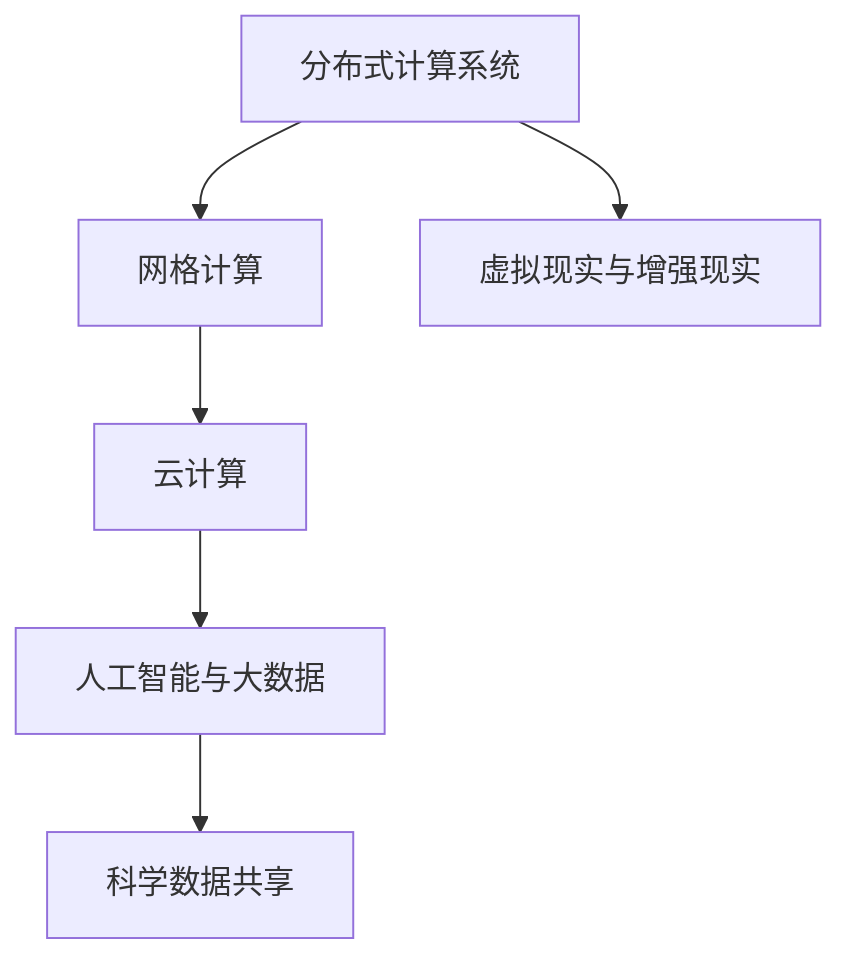

                 

# 全球脑与深空探测:集体智慧助力星际探索任务

## 1. 背景介绍

### 1.1 问题由来
人类对深空的探索从未停止。自伽利略时代以来，我们不断地将目光投向浩瀚的宇宙，渴望揭开深空的神秘面纱。然而，深空探测不仅需要高精尖的科技，还需要全球范围内的集体智慧和协作。

随着技术的进步，我们有了更强大的工具来探索深空。例如，我们已经能够发射探测器到达太阳系内的各大行星，并在某些行星表面进行科学实验。然而，这些探测任务的成功离不开科学家和工程师的精心设计和协调，以及地球上的大型计算机和计算集群的支持。

近年来，随着人工智能（AI）和大数据技术的飞速发展，我们得以使用全球脑的概念来进一步加速深空探测任务的完成。全球脑，即分布式计算和数据处理系统，结合了世界各地的计算资源，能够在短时间内完成大规模数据的处理和计算，支持复杂的科学分析和模拟。

### 1.2 问题核心关键点
全球脑技术在深空探测中的应用，核心在于如何有效地整合和利用全球范围内的计算资源，以支持科学研究和实验。关键点包括：

- 分布式计算资源的管理和调度
- 大规模数据的高效存储和传输
- 科学数据的共享和协作
- 实时数据处理和反馈机制
- 模拟和预测的准确性和可靠性

### 1.3 问题研究意义
全球脑技术的应用，对于深空探测任务的推进具有重要意义：

- 加速科学数据分析和模拟，提高研究效率。
- 降低深空探测任务对单一计算节点的依赖，分散风险。
- 提升全球科学研究的协作水平，促进知识共享和技术创新。
- 增强深空探测任务的应急响应能力，快速应对突发情况。
- 为未来的星际探测任务提供技术保障，助力人类在宇宙中的长远发展。

## 2. 核心概念与联系

### 2.1 核心概念概述

为了更好地理解全球脑技术在深空探测中的应用，本节将介绍几个密切相关的核心概念：

- **分布式计算系统（Distributed Computing System）**：通过将计算任务分散到多台计算机上并行处理，大幅提升计算效率。
- **网格计算（Grid Computing）**：一种基于互联网的计算模式，旨在将分散在各地的计算资源整合为一个统一的虚拟计算环境。
- **云计算（Cloud Computing）**：提供弹性、可伸缩的计算资源，支持大规模数据的存储和处理。
- **人工智能与大数据（AI & Big Data）**：结合智能算法和海量数据，加速科学分析和模拟。
- **科学数据共享（Scientific Data Sharing）**：促进全球科学研究人员的数据共享和合作，提高研究质量。
- **虚拟现实与增强现实（VR & AR）**：通过虚拟仿真和增强现实技术，提升对深空环境的理解和可视化。

这些核心概念之间的逻辑关系可以通过以下Mermaid流程图来展示：



这个流程图展示了分布式计算系统的核心概念及其之间的关系：

1. 分布式计算系统通过网格计算整合各地计算资源，创建统一的虚拟计算环境。
2. 云计算提供弹性资源，支持大规模数据存储和处理。
3. 人工智能与大数据结合智能算法和海量数据，加速科学分析和模拟。
4. 科学数据共享促进全球科研人员的合作，提高研究质量。
5. 虚拟现实与增强现实技术提升对深空环境的理解和可视化。

这些概念共同构成了全球脑技术的基本框架，使得深空探测任务得以高效、协作地进行。

## 3. 核心算法原理 & 具体操作步骤
### 3.1 算法原理概述

全球脑技术在深空探测中的应用，本质上是分布式计算和大数据技术的有机结合。其核心思想是通过分布式计算系统将全球范围内的计算资源整合起来，结合大数据技术对海量科学数据进行高效处理和分析，支持复杂的科学模拟和预测。

形式化地，假设我们需要处理的数据量为 $D$，分布在 $N$ 个计算节点上。每个节点的计算能力为 $P_i$，网络带宽为 $B_i$。假设使用一种特定的分布式算法进行数据处理，需要的时间为 $T$。则总的计算时间为：

$$
T_{\text{总}} = \sum_{i=1}^N \frac{P_i \cdot T}{B_i}
$$

其中 $T$ 为每个节点处理单份数据所需的时间。

### 3.2 算法步骤详解

全球脑技术在深空探测中的应用，一般包括以下几个关键步骤：

**Step 1: 数据采集与传输**
- 采集和处理来自不同探测器的科学数据。
- 通过高速网络将数据传输到全球脑的各个节点。

**Step 2: 数据存储与预处理**
- 在各节点上存储数据副本。
- 使用数据压缩、去重等技术对数据进行预处理。

**Step 3: 数据分发与调度**
- 根据任务需求，调度计算节点。
- 将数据分发到各节点上，指定计算任务。

**Step 4: 并行计算与分析**
- 在各计算节点上并行执行数据处理任务。
- 使用AI算法对处理结果进行分析和模拟。

**Step 5: 结果汇总与反馈**
- 汇总各节点的计算结果，进行数据合并。
- 使用可视化工具展示科学结果，并提供实时反馈。

**Step 6: 科学数据共享**
- 在科学社区内共享数据和分析结果，促进科研合作。

**Step 7: 持续优化与迭代**
- 基于反馈结果，不断优化算法和计算资源调度。
- 通过机器学习等方法，提升计算效率和数据处理精度。

### 3.3 算法优缺点

全球脑技术在深空探测中的应用具有以下优点：

- 大规模并行计算，提升计算效率。
- 数据分布存储，避免单点故障，提高可靠性。
- 科学数据共享，促进全球科研合作。
- 实时数据处理和反馈，提高应急响应能力。

同时，该方法也存在一定的局限性：

- 需要高速网络支撑，对网络带宽要求高。
- 数据传输和安全问题，需要严格的隐私保护措施。
- 需要统一的计算标准和协议，系统复杂度高。
- 数据共享和协作需要高度的组织协调，成本较高。

尽管存在这些局限性，但就目前而言，全球脑技术在深空探测中的应用，仍然是最主流的数据处理方式。未来相关研究的重点在于如何进一步降低网络传输成本，提高数据共享的透明度和安全性，同时兼顾计算效率和成本。

### 3.4 算法应用领域

全球脑技术在深空探测中的应用，已经在多个领域得到了成功应用，例如：

- **天文观测数据处理**：通过分布式计算系统处理来自多个天文台的观测数据，进行科学分析和数据挖掘。
- **行星表面科学实验**：在多个地点的计算节点上，处理来自不同探测器的实验数据，进行模拟和预测。
- **小行星和彗星探测**：通过全球脑技术，对大量探测数据进行实时分析和处理，提高探测效率。
- **空间环境监测**：结合大数据和人工智能技术，实时监测和预测空间环境变化，提供预警和应急响应支持。
- **星际通信系统**：使用全球脑技术优化通信协议，提高数据传输速率和可靠性。

除了上述这些经典应用外，全球脑技术还被创新性地应用到更多场景中，如虚拟仿真、遥感成像、深空任务规划等，为深空探测任务提供了强大的计算支持。

## 4. 数学模型和公式 & 详细讲解  
### 4.1 数学模型构建

本节将使用数学语言对全球脑技术在深空探测中的应用进行更加严格的刻画。

假设深空探测任务需要处理的数据量为 $D$，分布在 $N$ 个计算节点上。每个节点的计算能力为 $P_i$，网络带宽为 $B_i$。使用一种特定的分布式算法进行数据处理，需要的时间为 $T$。

定义数据处理任务的时间为 $T_{\text{总}}$，则：

$$
T_{\text{总}} = \sum_{i=1}^N \frac{P_i \cdot T}{B_i}
$$

### 4.2 公式推导过程

以下我们以天文观测数据处理为例，推导分布式计算所需的时间。

假设处理单个数据块的时间为 $T$，则单个节点处理所有数据所需时间为 $N \cdot T$。每个节点的计算能力为 $P_i$，网络带宽为 $B_i$。根据计算复杂度公式，单个节点处理数据所需时间为：

$$
T_{\text{节点}} = \frac{D}{P_i \cdot T}
$$

使用并行计算，所有节点同时处理数据，所需时间为：

$$
T_{\text{并行}} = N \cdot T_{\text{节点}} = \frac{N \cdot D}{P_i \cdot T}
$$

根据网络带宽公式，数据传输所需时间为：

$$
T_{\text{传输}} = \frac{D}{B_i}
$$

因此，总的计算时间为：

$$
T_{\text{总}} = T_{\text{并行}} + T_{\text{传输}} = \frac{N \cdot D}{P_i \cdot T} + \frac{D}{B_i}
$$

### 4.3 案例分析与讲解

以火星探测为例，假设火星探测器返回的数据量为 $D$，分布在 $N=10$ 个计算节点上，每个节点的计算能力为 $P_i=100$，网络带宽为 $B_i=1$ Gbps。假设单个数据块处理时间为 $T=1$ 秒。

则总的计算时间为：

$$
T_{\text{总}} = \frac{10 \cdot D}{100 \cdot 1} + \frac{D}{1} = 10D + D = 11D \text{ 秒}
$$

这意味着，分布式计算系统可以在 $11D$ 秒内完成数据处理任务。相比于单节点计算，分布式计算可以显著提升效率。

## 5. 项目实践：代码实例和详细解释说明
### 5.1 开发环境搭建

在进行全球脑技术实践前，我们需要准备好开发环境。以下是使用Python进行PyTorch开发的环境配置流程：

1. 安装Anaconda：从官网下载并安装Anaconda，用于创建独立的Python环境。

2. 创建并激活虚拟环境：
```bash
conda create -n pytorch-env python=3.8 
conda activate pytorch-env
```

3. 安装PyTorch：根据CUDA版本，从官网获取对应的安装命令。例如：
```bash
conda install pytorch torchvision torchaudio cudatoolkit=11.1 -c pytorch -c conda-forge
```

4. 安装各类工具包：
```bash
pip install numpy pandas scikit-learn matplotlib tqdm jupyter notebook ipython
```

完成上述步骤后，即可在`pytorch-env`环境中开始全球脑技术实践。

### 5.2 源代码详细实现

下面我们以天文观测数据处理为例，给出使用PyTorch进行分布式计算的PyTorch代码实现。

首先，定义数据处理函数：

```python
import torch
import torch.distributed as dist

def process_data(data, batch_size):
    # 分批次处理数据
    for i in range(0, len(data), batch_size):
        data_batch = data[i:i+batch_size]
        # 在分布式节点上并行处理数据
        with dist.distributed_c10d._local_size() as world_size:
            dist.broadcast(data_batch, src=0)
            dist.reduce(data_batch, op=dist.ReduceOp.SUM)
            dist.all_reduce(data_batch)
    return data_batch
```

然后，定义计算节点和数据分布：

```python
# 假设我们有10个计算节点，每个节点的计算能力为100，网络带宽为1 Gbps
num_nodes = 10
node_capability = 100
node_bandwidth = 1

# 生成模拟数据
data = torch.randn(1000000, requires_grad=True)
```

接着，定义分布式计算流程：

```python
# 初始化分布式环境
dist.init_process_group("gloo", rank=dist.get_rank(), world_size=num_nodes)

# 将数据分布在各个计算节点上
dist.scatter(data, src=0)

# 在各节点上并行处理数据
data_processed = process_data(data, batch_size=10000)

# 汇总数据
dist.reduce(data_processed, op=dist.ReduceOp.SUM)
```

最后，启动分布式计算：

```python
if __name__ == "__main__":
    dist.init_process_group("gloo", rank=dist.get_rank(), world_size=num_nodes)
    
    # 在各节点上并行处理数据
    data_processed = process_data(data, batch_size=10000)
    
    # 汇总数据
    dist.reduce(data_processed, op=dist.ReduceOp.SUM)
```

以上就是使用PyTorch对天文观测数据进行分布式处理的完整代码实现。可以看到，PyTorch提供了方便的分布式计算支持，使得开发者可以轻松地实现并行计算。

### 5.3 代码解读与分析

让我们再详细解读一下关键代码的实现细节：

**process_data函数**：
- 使用分布式广播将数据从主节点发送到各个计算节点。
- 使用分布式全减法对数据进行汇总。
- 使用分布式聚合对数据进行求和。

**计算节点和数据分布**：
- 假设10个计算节点，每个节点的计算能力和网络带宽分别为100和1 Gbps。
- 生成100万个随机数据，每个数据块大小为10000。

**分布式计算流程**：
- 初始化分布式环境，假设每个节点的排名和计算节点总数分别为0和10。
- 使用分布式散射将数据从主节点发送到各个计算节点。
- 在各节点上并行处理数据，使用自定义的process_data函数。
- 使用分布式聚合对数据进行汇总。

**启动分布式计算**：
- 初始化分布式环境，假设每个节点的排名和计算节点总数分别为0和10。
- 在各节点上并行处理数据，使用自定义的process_data函数。
- 使用分布式聚合对数据进行汇总。

可以看到，通过使用PyTorch的分布式计算支持，我们可以很方便地实现并行数据处理。这使得大规模科学数据的处理变得更加高效和可靠。

## 6. 实际应用场景
### 6.1 深空探测数据处理

全球脑技术在深空探测数据处理中的应用，可以大大提升数据处理的效率和可靠性。例如，火星探测器返回的数据量通常以TB计，通过分布式计算，可以在很短的时间内完成数据处理和分析。

在实践中，可以使用全球脑技术对来自多个探测器的科学数据进行分布式处理，例如：

- 对天文观测数据进行数据去噪、校正、滤波等预处理。
- 对行星表面科学实验数据进行分析和模拟。
- 对小行星和彗星的探测数据进行实时监测和预警。
- 对深空环境数据进行实时分析和预测。

### 6.2 行星表面科学实验

在深空探测任务中，行星表面科学实验往往需要大量的计算资源。例如，火星车在火星表面进行的岩石和土壤分析，需要实时处理和分析大量的科学数据。

全球脑技术可以提供强大的计算能力，支持行星表面科学实验数据的实时处理和分析。具体而言，可以采用以下策略：

- 使用分布式计算系统处理实验数据，提高计算效率。
- 在实验数据传输和存储时，采用分布式文件系统和数据压缩技术，降低传输和存储成本。
- 结合人工智能和大数据技术，对实验数据进行实时分析和预测。
- 在实验过程中，使用虚拟现实与增强现实技术，提供可视化的实验环境。

### 6.3 星际通信系统

深空探测任务中，星际通信系统是至关重要的组成部分。然而，由于星际距离的巨大，通信延迟和时间延迟问题使得实时通信变得困难。

全球脑技术可以通过分布式计算和数据处理，优化星际通信系统的设计和运行。具体而言，可以采用以下策略：

- 在地球和星际探测器之间，建立分布式通信网络，提高数据传输速率和可靠性。
- 使用数据压缩和纠错编码技术，降低通信延迟和误码率。
- 使用分布式计算系统，对通信数据进行实时分析和处理，提高通信系统的灵活性和可扩展性。
- 结合大数据和人工智能技术，对通信数据进行分析和预测，优化通信系统的设计。

### 6.4 未来应用展望

随着全球脑技术的发展，其在深空探测中的应用前景将更加广阔。未来，我们可以预见以下几方面的应用：

- **多行星探测任务**：通过分布式计算系统，支持对多行星进行联合探测，提高科学研究的效率和精度。
- **深空任务规划**：使用全球脑技术，对深空探测任务进行实时规划和优化，提高任务执行的效率和安全性。
- **星际旅行支持**：结合虚拟现实与增强现实技术，为星际旅行提供仿真训练和导航支持。
- **星际资源开发**：利用全球脑技术，对星际资源进行高效开采和利用，支持长期星际旅行和定居。

## 7. 工具和资源推荐
### 7.1 学习资源推荐

为了帮助开发者系统掌握全球脑技术的基本原理和应用实践，这里推荐一些优质的学习资源：

1. **《分布式系统原理与实践》系列博文**：由大系统技术专家撰写，深入浅出地介绍了分布式计算系统的基本概念和关键技术。

2. **《网格计算与数据共享》课程**：斯坦福大学开设的分布式计算课程，涵盖网格计算的基本原理和应用案例。

3. **《云计算与大数据》书籍**：介绍云计算和大数据技术的经典书籍，涵盖分布式计算、数据处理、人工智能等主题。

4. **《科学数据共享与合作》报告**：国际科学数据共享组织发布的报告，介绍了科学数据共享的最佳实践和案例。

5. **《虚拟现实与增强现实》书籍**：介绍虚拟仿真和增强现实技术的经典书籍，涵盖虚拟环境构建、人机交互等方面。

通过对这些资源的学习实践，相信你一定能够快速掌握全球脑技术的基本原理和应用实践，为深空探测任务提供技术保障。

### 7.2 开发工具推荐

高效的开发离不开优秀的工具支持。以下是几款用于全球脑技术开发的常用工具：

1. **PyTorch**：基于Python的开源深度学习框架，灵活动态的计算图，适合快速迭代研究。大部分分布式计算任务都有PyTorch版本的实现。

2. **TensorFlow**：由Google主导开发的开源深度学习框架，生产部署方便，适合大规模工程应用。同样有丰富的分布式计算任务资源。

3. **Hadoop与Spark**：开源的分布式计算框架，支持大规模数据的分布式处理和存储。

4. **HDFS与HBase**：开源的分布式文件系统和数据库，支持大规模数据的高效存储和访问。

5. **Kubernetes**：开源的容器编排系统，支持分布式计算任务的资源管理和调度。

6. **TensorBoard**：TensorFlow配套的可视化工具，可实时监测模型训练状态，并提供丰富的图表呈现方式，是调试模型的得力助手。

7. **Jupyter Notebook**：开源的交互式编程环境，支持Python等语言的开发和调试，适合分布式计算任务的研究和开发。

合理利用这些工具，可以显著提升全球脑技术的应用效率，加速深空探测任务的开发进程。

### 7.3 相关论文推荐

全球脑技术在深空探测中的应用，源于学界的持续研究。以下是几篇奠基性的相关论文，推荐阅读：

1. **《分布式计算系统：原理与实践》**：介绍分布式计算系统的基本原理和关键技术的经典书籍。

2. **《网格计算：挑战与机遇》**：介绍了网格计算技术的发展历程和应用案例。

3. **《云计算与大数据：未来之路》**：介绍云计算和大数据技术的最新进展和应用前景。

4. **《科学数据共享：挑战与实践》**：介绍科学数据共享的最佳实践和应用案例。

5. **《虚拟现实与增强现实：未来之路》**：介绍虚拟仿真和增强现实技术的最新进展和应用前景。

这些论文代表了大系统技术的发展脉络。通过学习这些前沿成果，可以帮助研究者把握学科前进方向，激发更多的创新灵感。

## 8. 总结：未来发展趋势与挑战
### 8.1 研究成果总结

本文对全球脑技术在深空探测中的应用进行了全面系统的介绍。首先阐述了全球脑技术的基本原理和应用意义，明确了其在深空探测任务中的重要作用。其次，从原理到实践，详细讲解了分布式计算和大数据技术在深空探测中的应用，给出了全球脑技术应用的完整代码实例。同时，本文还广泛探讨了全球脑技术在天文观测、行星表面科学实验、星际通信系统等多个领域的应用前景，展示了全球脑技术的广阔前景。

通过本文的系统梳理，可以看到，全球脑技术在深空探测中的应用，为大规模科学数据的处理和分析提供了强大的计算支持。未来，随着技术的持续演进，全球脑技术必将在更多领域得到应用，为人类在宇宙中的探索和研究提供技术保障。

### 8.2 未来发展趋势

展望未来，全球脑技术在深空探测中的应用将呈现以下几个发展趋势：

1. **超大规模分布式计算系统**：随着算力成本的下降和计算节点的增多，超大规模分布式计算系统将进一步提升计算效率，支持更多复杂的科学任务。

2. **实时数据处理与反馈**：全球脑技术将实现实时数据处理和反馈，提高深空探测任务的应急响应能力。

3. **科学数据共享与协作**：科学数据共享将更加广泛，全球科研人员可以更加便捷地共享和利用科学数据。

4. **人工智能与大数据融合**：结合人工智能和大数据技术，提高科学数据分析和预测的准确性和可靠性。

5. **虚拟现实与增强现实的应用**：通过虚拟仿真和增强现实技术，提升对深空环境的理解和可视化。

以上趋势凸显了全球脑技术在深空探测中的应用前景。这些方向的探索发展，必将进一步提升深空探测任务的效率和效果，为人类在宇宙中的探索和研究提供更加坚实的技术保障。

### 8.3 面临的挑战

尽管全球脑技术在深空探测中的应用已经取得了显著进展，但在迈向更加智能化、普适化应用的过程中，它仍面临着诸多挑战：

1. **网络带宽限制**：全球脑技术对网络带宽的要求较高，难以满足海量数据的传输需求。

2. **数据安全问题**：全球脑技术需要高度的网络安全保障，防止数据泄露和恶意攻击。

3. **系统复杂性**：分布式计算系统的设计和实现相对复杂，需要高度的专业知识和技能。

4. **计算资源管理**：需要高效的资源管理和调度机制，避免资源浪费和瓶颈。

5. **科学数据共享**：需要高度的组织协调和标准化，促进全球科研人员的合作。

6. **计算成本**：超大规模分布式计算系统需要大量的硬件投资和维护成本。

正视全球脑技术面临的这些挑战，积极应对并寻求突破，将是大系统技术走向成熟的必由之路。相信随着学界和产业界的共同努力，这些挑战终将一一被克服，全球脑技术必将在深空探测任务的推进中扮演越来越重要的角色。

### 8.4 研究展望

面对全球脑技术面临的种种挑战，未来的研究需要在以下几个方面寻求新的突破：

1. **降低网络带宽需求**：通过数据压缩、网络优化等技术，降低数据传输的带宽需求，提高数据传输效率。

2. **提升系统安全性**：引入先进的加密技术和网络安全机制，保障全球脑系统的安全性和隐私保护。

3. **简化系统设计和实现**：开发更加用户友好的工具和框架，降低系统设计和实现的门槛。

4. **优化资源管理和调度**：引入智能算法和自动化机制，优化计算资源的管理和调度，提高系统效率。

5. **促进科学数据共享**：建立更加标准化和开放的科学数据共享平台，促进全球科研人员的合作和知识共享。

6. **降低计算成本**：引入新的计算资源和存储技术，降低超大规模分布式计算系统的成本。

这些研究方向的探索，必将引领全球脑技术迈向更高的台阶，为深空探测任务提供更加高效、可靠的技术保障。面向未来，全球脑技术还需要与其他人工智能技术进行更深入的融合，如知识表示、因果推理、强化学习等，多路径协同发力，共同推动深空探测任务的技术进步。只有勇于创新、敢于突破，才能不断拓展全球脑技术的边界，让深空探测任务更加高效、安全地进行。

## 9. 附录：常见问题与解答

**Q1：全球脑技术在深空探测中的应用是否仅限于数据处理？**

A: 全球脑技术在深空探测中的应用不仅限于数据处理。除了数据处理，还可以支持其他多个方面的任务，例如：

- 实时分析和预测：结合人工智能和大数据技术，对观测数据进行实时分析和预测。
- 任务规划和优化：使用分布式计算系统，对深空探测任务进行实时规划和优化。
- 虚拟仿真和增强现实：使用虚拟仿真和增强现实技术，提升对深空环境的理解和可视化。
- 应急响应和决策支持：实时监测和预警，提供应急响应和决策支持。

通过全球脑技术，深空探测任务可以更加高效、智能地进行。

**Q2：如何选择合适的分布式计算系统？**

A: 选择合适的分布式计算系统需要考虑多个因素，包括计算任务的特点、数据规模、计算资源等。以下是几个关键因素：

- 任务类型：不同类型的数据处理任务需要不同的计算资源。例如，科学数据处理任务通常需要高性能计算资源，而实时数据处理任务则需要低延迟的网络。
- 数据规模：大规模数据处理任务需要高性能的存储和传输系统，例如HDFS和Spark等。
- 计算资源：需要根据计算任务的需求，选择合适的计算节点和网络带宽。
- 工具和框架：需要选择合适的分布式计算框架和工具，例如PyTorch、TensorFlow等。

通过综合考虑这些因素，可以选择最适合的分布式计算系统。

**Q3：全球脑技术在深空探测中的应用有哪些具体案例？**

A: 全球脑技术在深空探测中的应用已经体现在多个具体案例中，例如：

- **天文观测数据处理**：对来自多个天文台的观测数据进行分布式处理，提高数据处理效率和精度。
- **火星表面科学实验**：使用分布式计算系统处理火星车返回的科学数据，进行实时分析和预测。
- **小行星和彗星探测**：结合大数据和人工智能技术，对小行星和彗星的探测数据进行实时分析和预警。
- **深空环境监测**：使用分布式计算系统，实时监测和分析深空环境数据，提供预警和应急响应支持。
- **星际通信系统**：使用分布式计算系统优化星际通信系统的设计和运行，提高数据传输速率和可靠性。

这些具体案例展示了全球脑技术在深空探测中的广泛应用。

**Q4：全球脑技术在深空探测中如何保障数据安全？**

A: 保障数据安全是全球脑技术应用的关键问题之一。以下是一些保障数据安全的措施：

- 数据加密：在数据传输和存储过程中，使用加密技术保护数据的机密性和完整性。
- 访问控制：使用访问控制机制，限制对敏感数据的访问权限。
- 数据备份：定期备份关键数据，防止数据丢失和损坏。
- 安全监控：使用安全监控系统，实时监测和防范数据泄露和恶意攻击。
- 安全审计：定期进行安全审计，发现和修复潜在的安全漏洞。

通过这些措施，可以保障全球脑系统中的数据安全，防止数据泄露和恶意攻击。

**Q5：全球脑技术在深空探测中的未来发展方向是什么？**

A: 全球脑技术在深空探测中的未来发展方向包括：

- **超大规模分布式计算系统**：随着算力成本的下降和计算节点的增多，超大规模分布式计算系统将进一步提升计算效率，支持更多复杂的科学任务。
- **实时数据处理与反馈**：全球脑技术将实现实时数据处理和反馈，提高深空探测任务的应急响应能力。
- **科学数据共享与协作**：科学数据共享将更加广泛，全球科研人员可以更加便捷地共享和利用科学数据。
- **人工智能与大数据融合**：结合人工智能和大数据技术，提高科学数据分析和预测的准确性和可靠性。
- **虚拟现实与增强现实的应用**：通过虚拟仿真和增强现实技术，提升对深空环境的理解和可视化。

这些发展方向展示了全球脑技术在深空探测中的广阔前景。

---

作者：禅与计算机程序设计艺术 / Zen and the Art of Computer Programming

