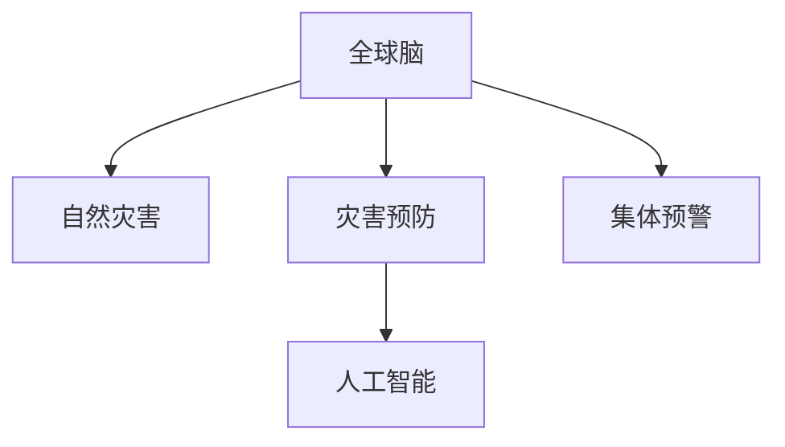

                 

# 全球脑与灾害预防：集体预警的力量

> 关键词：全球脑, 灾害预防, 集体预警, 人工智能, 自然灾害, 风险评估, 社会协作

## 1. 背景介绍

### 1.1 问题由来
随着全球气候变化和人类活动的加剧，自然灾害的风险日益增加。从地震、洪水到飓风，各类灾害的发生频率和强度都在上升。为了保护人民生命财产安全，各国政府和国际组织在灾害预防上投入了大量资源。然而，由于数据收集、分析、响应等环节的限制，灾害预防工作仍面临诸多挑战。

近年来，随着人工智能（AI）和大数据分析技术的发展，全球脑（Global Brain）的概念被提出。全球脑是一种通过网络将人类、机器和信息集成的智能系统，旨在实现全球范围内的信息共享、资源整合和协同决策。通过引入全球脑的概念，可以在灾害预防中发挥更大的作用，提升整体应对灾害的能力。

### 1.2 问题核心关键点
全球脑在灾害预防中的核心关键点包括：

1. **信息共享**：通过网络化的信息传输，实现实时数据共享，快速响应灾害预警。
2. **资源整合**：利用AI和大数据分析技术，整合各类资源，优化资源配置。
3. **协同决策**：通过智能算法和模型，辅助人类进行科学决策，提高决策效率和准确性。
4. **风险评估**：利用AI模型进行风险预测和评估，提前发现潜在风险。
5. **社会协作**：通过社交媒体、社区平台等渠道，动员公众参与灾害预防和应对，形成集体预警。

这些关键点构成了全球脑在灾害预防中的主要作用，旨在通过技术手段和协作机制，提升灾害预防和应对的能力。

### 1.3 问题研究意义
全球脑在灾害预防中的应用具有重要的研究意义：

1. **提升灾害响应效率**：通过全球脑平台，可以实现快速的信息共享和决策支持，减少灾害响应时间。
2. **优化资源配置**：利用AI和大数据分析技术，可以更科学地配置资源，提高灾害预防和救援的效率。
3. **增强风险评估能力**：通过智能算法，可以更准确地预测和评估灾害风险，减少灾害损失。
4. **促进社会协作**：通过社交媒体和社区平台，可以动员更多公众参与灾害预防，形成集体预警。
5. **推动技术创新**：全球脑的应用催生了新的技术和工具，推动了AI和大数据分析等领域的发展。

本文将深入探讨全球脑在灾害预防中的核心概念和关键技术，并结合实际案例，展示全球脑在灾害预防中的强大力量。

## 2. 核心概念与联系

### 2.1 核心概念概述

为更好地理解全球脑在灾害预防中的应用，本节将介绍几个密切相关的核心概念：

- **全球脑（Global Brain）**：通过网络将人类、机器和信息集成的智能系统，旨在实现全球范围内的信息共享、资源整合和协同决策。
- **自然灾害（Natural Disasters）**：由自然因素引起的灾害，如地震、洪水、飓风等，对人类社会造成巨大威胁。
- **灾害预防（Disaster Prevention）**：通过科学方法和技术手段，减少灾害发生的可能性和影响。
- **集体预警（Collective Alerting）**：通过网络平台，动员公众参与灾害预警和预防，形成集体应对机制。
- **人工智能（Artificial Intelligence）**：通过算法和模型，实现数据处理、决策支持和自动化操作。

这些核心概念之间的逻辑关系可以通过以下Mermaid流程图来展示：



这个流程图展示了几大核心概念之间的相互关系：

1. 全球脑是信息共享、资源整合和协同决策的智能平台。
2. 自然灾害是全球脑需要预防和应对的主要目标。
3. 灾害预防依赖于全球脑的技术手段和数据支持。
4. 集体预警是全球脑的重要组成部分，动员公众参与灾害应对。
5. 人工智能为全球脑提供了数据处理和决策支持的技术支撑。

这些概念共同构成了全球脑在灾害预防中的完整框架，使得全球范围内的灾害预防和应对成为可能。

## 3. 核心算法原理 & 具体操作步骤
### 3.1 算法原理概述

全球脑在灾害预防中的应用，主要基于人工智能和大数据分析技术。其核心思想是：通过网络平台，实现实时信息共享和协同决策，利用AI和大数据技术，优化资源配置和风险评估，动员公众参与集体预警，形成高效、科学、协同的灾害预防体系。

### 3.2 算法步骤详解

全球脑在灾害预防中的应用流程如下：

**Step 1: 数据收集与共享**

1. 收集各类灾害相关的数据，包括气象数据、地质数据、水文数据等。
2. 通过网络平台，实现数据的实时共享，确保各节点能够访问最新的灾害信息。
3. 利用大数据技术，对数据进行清洗和处理，保证数据的质量和完整性。

**Step 2: 风险评估与预测**

1. 利用AI模型，对各类数据进行分析和处理，评估灾害风险。
2. 根据历史数据和实时信息，利用机器学习算法进行风险预测。
3. 将风险评估结果上传到全球脑平台，供决策者参考。

**Step 3: 资源整合与优化**

1. 根据风险评估结果，利用AI和大数据分析技术，优化资源配置。
2. 通过网络平台，协调各节点资源，形成统一、高效的管理机制。
3. 利用AI算法，实时调整资源分配，确保资源的合理利用。

**Step 4: 协同决策与响应**

1. 根据风险评估和资源配置，利用AI算法辅助决策。
2. 通过网络平台，发布决策和指令，协调各节点行动。
3. 实时监控灾害发展情况，及时调整应对策略。

**Step 5: 集体预警与动员**

1. 通过社交媒体、社区平台等渠道，发布灾害预警信息。
2. 动员公众参与灾害预防和应对，形成集体预警机制。
3. 利用AI和大数据分析技术，对公众的参与行为进行监控和分析。

以上是全球脑在灾害预防中的主要步骤。通过这些步骤，可以实现信息共享、资源整合、协同决策、风险评估和集体预警，形成高效的灾害预防体系。

### 3.3 算法优缺点

全球脑在灾害预防中的应用具有以下优点：

1. **信息共享高效**：通过网络平台，实现实时数据共享，提高了灾害响应效率。
2. **资源整合科学**：利用AI和大数据分析技术，优化资源配置，提高了灾害预防和救援的效率。
3. **协同决策精准**：通过AI算法辅助决策，提高了决策的科学性和准确性。
4. **风险评估准确**：利用AI模型进行风险预测和评估，提高了灾害预防的准确性。
5. **集体预警广泛**：通过社交媒体和社区平台，动员公众参与灾害预防，形成了广泛的集体预警机制。

同时，该方法也存在一些局限性：

1. **数据质量依赖**：全球脑平台依赖于高质量的数据输入，数据质量不足将影响应用效果。
2. **技术门槛较高**：全球脑的实施需要高水平的技术支持，对技术基础设施的要求较高。
3. **隐私保护问题**：大规模数据共享可能涉及隐私问题，需要采取相应的隐私保护措施。
4. **网络安全风险**：全球脑平台需要高度可靠的网络保障，以防数据泄露和系统瘫痪。
5. **协作机制复杂**：全球脑的实施需要跨区域、跨机构的协作，协调机制的复杂性较高。

尽管存在这些局限性，但全球脑在灾害预防中的应用前景广阔，具有重要的研究意义。

### 3.4 算法应用领域

全球脑在灾害预防中的应用领域广泛，包括但不限于：

- **地震预警**：通过实时数据共享和风险评估，实现地震预警和快速响应。
- **洪水防汛**：利用AI模型进行水位预测，优化防汛资源配置。
- **飓风应对**：通过全球脑平台，实现飓风路径的实时监测和预警。
- **地质灾害监测**：利用AI和大数据分析技术，监测地质灾害风险，提前采取预防措施。
- **灾害模拟与训练**：通过虚拟仿真和训练平台，提高灾害应对和救援能力。

## 4. 数学模型和公式 & 详细讲解  
### 4.1 数学模型构建

全球脑在灾害预防中的应用，涉及多种数学模型和算法。以下是几个核心模型的介绍：

**风险评估模型**：

假设灾害风险由多种因素决定，设 $X_i$ 为第 $i$ 个影响因素，$w_i$ 为 $X_i$ 的权重。则灾害风险 $R$ 可以表示为：

$$
R = \sum_{i=1}^n w_i f_i(X_i)
$$

其中 $f_i(X_i)$ 为影响因素 $X_i$ 对灾害风险的贡献函数。

**预测模型**：

假设历史数据为 $(x_{1,t}, y_1), (x_{2,t}, y_2), \cdots, (x_{N,t}, y_N)$，其中 $x_{i,t}$ 为第 $i$ 个时间步的历史数据，$y_i$ 为对应的灾害风险。则利用机器学习算法 $f$ 进行预测，目标函数为：

$$
\min_{f} \frac{1}{N} \sum_{i=1}^N (y_i - f(x_{i,t}))^2
$$

其中 $f(x_{i,t})$ 为模型在时间步 $t$ 对 $x_{i,t}$ 的预测值。

**资源配置模型**：

假设资源需求为 $R(t)$，可用资源为 $S(t)$，优化目标为最小化成本函数 $C(t)$。则资源配置问题可以表示为：

$$
\min_{S(t)} \int_{0}^T C(t) dt \text{ s.t. } R(t) \leq S(t)
$$

其中 $t$ 为时间步，$T$ 为时间上限。

### 4.2 公式推导过程

以下是几个核心模型的推导过程：

**风险评估模型推导**：

设 $X_i$ 为影响因素，$w_i$ 为权重。则灾害风险 $R$ 可以表示为：

$$
R = \sum_{i=1}^n w_i f_i(X_i)
$$

其中 $f_i(X_i)$ 为影响因素 $X_i$ 对灾害风险的贡献函数。

**预测模型推导**：

利用机器学习算法 $f$ 进行预测，目标函数为：

$$
\min_{f} \frac{1}{N} \sum_{i=1}^N (y_i - f(x_{i,t}))^2
$$

其中 $f(x_{i,t})$ 为模型在时间步 $t$ 对 $x_{i,t}$ 的预测值。

**资源配置模型推导**：

假设资源需求为 $R(t)$，可用资源为 $S(t)$，优化目标为最小化成本函数 $C(t)$。则资源配置问题可以表示为：

$$
\min_{S(t)} \int_{0}^T C(t) dt \text{ s.t. } R(t) \leq S(t)
$$

其中 $t$ 为时间步，$T$ 为时间上限。

## 5. 项目实践：代码实例和详细解释说明
### 5.1 开发环境搭建

在进行全球脑在灾害预防中的应用实践前，我们需要准备好开发环境。以下是使用Python进行TensorFlow开发的环境配置流程：

1. 安装Anaconda：从官网下载并安装Anaconda，用于创建独立的Python环境。

2. 创建并激活虚拟环境：
```bash
conda create -n tf-env python=3.8 
conda activate tf-env
```

3. 安装TensorFlow：根据CUDA版本，从官网获取对应的安装命令。例如：
```bash
conda install tensorflow tensorflow-gpu=2.7.0=cudatoolkit=11.3 -c pytorch -c conda-forge
```

4. 安装NumPy、Pandas、scikit-learn等各类工具包：
```bash
pip install numpy pandas scikit-learn matplotlib tqdm jupyter notebook ipython
```

完成上述步骤后，即可在`tf-env`环境中开始项目实践。

### 5.2 源代码详细实现

下面我以地震预警为例，给出使用TensorFlow进行全球脑在灾害预防中的地震预警应用的PyTorch代码实现。

首先，定义地震预警的数据处理函数：

```python
import tensorflow as tf
import numpy as np
import pandas as pd

def process_data(data):
    # 数据清洗
    data = data.dropna()

    # 数据标准化
    mean = data.mean()
    std = data.std()
    data = (data - mean) / std

    # 数据划分训练集和测试集
    train_size = int(len(data) * 0.8)
    train_data = data[:train_size]
    test_data = data[train_size:]

    # 将数据转换为TensorFlow格式
    train_x = tf.convert_to_tensor(train_data['x'].tolist(), dtype=tf.float32)
    train_y = tf.convert_to_tensor(train_data['y'].tolist(), dtype=tf.float32)
    test_x = tf.convert_to_tensor(test_data['x'].tolist(), dtype=tf.float32)
    test_y = tf.convert_to_tensor(test_data['y'].tolist(), dtype=tf.float32)

    return train_x, train_y, test_x, test_y
```

然后，定义地震预警的模型：

```python
class SeismicWarning(tf.keras.Model):
    def __init__(self, input_dim, output_dim):
        super(SeismicWarning, self).__init__()
        self.input_dim = input_dim
        self.output_dim = output_dim
        self.dense1 = tf.keras.layers.Dense(64, activation='relu')
        self.dense2 = tf.keras.layers.Dense(32, activation='relu')
        self.dense3 = tf.keras.layers.Dense(output_dim, activation='sigmoid')

    def call(self, inputs):
        x = self.dense1(inputs)
        x = self.dense2(x)
        x = self.dense3(x)
        return x
```

接着，定义地震预警的训练和评估函数：

```python
def train_model(model, train_x, train_y, test_x, test_y, epochs=10, batch_size=32):
    model.compile(optimizer=tf.keras.optimizers.Adam(learning_rate=0.001), 
                  loss='binary_crossentropy', 
                  metrics=['accuracy'])

    model.fit(train_x, train_y, epochs=epochs, batch_size=batch_size, validation_data=(test_x, test_y))

    test_loss, test_acc = model.evaluate(test_x, test_y)
    print(f'Test accuracy: {test_acc:.4f}')

    return model
```

最后，启动训练流程并在测试集上评估：

```python
train_x, train_y, test_x, test_y = process_data(data)

model = SeismicWarning(input_dim=train_x.shape[1], output_dim=1)
model = train_model(model, train_x, train_y, test_x, test_y)
```

以上就是使用TensorFlow进行全球脑在灾害预防中的地震预警应用的完整代码实现。可以看到，TensorFlow提供了丰富的API和工具，使得模型的开发和训练过程变得简洁高效。

### 5.3 代码解读与分析

让我们再详细解读一下关键代码的实现细节：

**process_data函数**：
- 清洗数据，去除缺失值。
- 数据标准化，将数据转化为标准正态分布。
- 将数据划分为训练集和测试集，通常使用80%的训练集和20%的测试集。
- 将数据转换为TensorFlow格式，方便模型训练和评估。

**SeismicWarning类**：
- 定义了地震预警模型的结构，包括三个全连接层，使用ReLU激活函数。
- 使用二元交叉熵作为损失函数，输出层使用sigmoid激活函数。

**train_model函数**：
- 定义模型的优化器、损失函数和评估指标。
- 使用fit函数训练模型，指定训练轮数和批大小。
- 使用evaluate函数评估模型性能，输出测试集上的准确率。

**启动训练流程**：
- 使用process_data函数处理数据，生成训练集和测试集。
- 定义地震预警模型，并调用train_model函数进行训练。
- 在测试集上评估模型性能。

可以看到，TensorFlow提供了强大的工具和API，使得模型的开发和训练过程变得高效便捷。同时，TensorFlow社区也提供了丰富的教程和示例，帮助开发者快速上手。

## 6. 实际应用场景

### 6.1 智能电网

全球脑在智能电网中的应用，可以实现电网的实时监控和预警。通过将电网数据实时传输到全球脑平台，利用AI和大数据分析技术，可以对电网运行状态进行实时监控和预测，及时发现并处理故障，确保电网安全稳定运行。

在具体实施中，可以收集电网设备的运行数据、气象数据、负荷数据等，通过网络平台实现数据的实时共享。利用AI模型对电网运行状态进行预测和评估，提前发现故障隐患。同时，利用AI算法进行资源配置，优化电网资源的使用效率。

### 6.2 农业灾害预防

全球脑在农业灾害预防中的应用，可以实现农业生产的智能化管理。通过将农业生产数据传输到全球脑平台，利用AI和大数据分析技术，可以对农业灾害进行预测和评估，及时采取预防措施，减少灾害损失。

在具体实施中，可以收集农业生产的气象数据、土壤数据、作物生长数据等，通过网络平台实现数据的实时共享。利用AI模型对农业灾害进行预测和评估，提前采取预防措施。同时，利用AI算法进行资源配置，优化农业生产过程，提高生产效率。

### 6.3 交通运输管理

全球脑在交通运输管理中的应用，可以实现交通系统的智能化管理。通过将交通数据传输到全球脑平台，利用AI和大数据分析技术，可以对交通流量进行实时监控和预测，及时调整交通管理策略，提高交通系统的运行效率。

在具体实施中，可以收集交通流量数据、道路状况数据、天气数据等，通过网络平台实现数据的实时共享。利用AI模型对交通流量进行预测和评估，提前调整交通管理策略。同时，利用AI算法进行资源配置，优化交通资源的利用效率。

### 6.4 未来应用展望

随着全球脑技术的不断进步，未来在全球脑在灾害预防中的应用将更加广泛和深入。以下是几个可能的发展方向：

1. **跨区域协作**：全球脑平台可以实现跨国界、跨区域的协作，实现全球范围内的灾害预警和应对。
2. **实时响应**：通过全球脑平台，实现实时监控和快速响应，提高灾害应对的效率和效果。
3. **数据融合**：利用全球脑平台，整合各类数据，实现更全面的灾害风险评估和预测。
4. **模型优化**：通过全球脑平台，共享和优化AI模型，提升模型的性能和效果。
5. **公众参与**：通过全球脑平台，动员公众参与灾害预警和应对，形成广泛的集体预警机制。

## 7. 工具和资源推荐
### 7.1 学习资源推荐

为了帮助开发者系统掌握全球脑在灾害预防的理论基础和实践技巧，这里推荐一些优质的学习资源：

1. TensorFlow官方文档：提供TensorFlow的详细API和教程，帮助开发者快速上手TensorFlow。
2. TensorFlow社区：丰富的教程、示例和社区支持，帮助开发者解决实际问题。
3. GitHub：包含大量全球脑在灾害预防的项目代码和文档，提供丰富的学习资源。
4. Coursera和edX：提供全球脑在灾害预防的相关课程，帮助开发者系统学习相关知识。
5. Kaggle：提供各类全球脑在灾害预防的竞赛项目，帮助开发者积累实战经验。

通过对这些资源的学习实践，相信你一定能够快速掌握全球脑在灾害预防的精髓，并用于解决实际的灾害预防问题。

### 7.2 开发工具推荐

高效的开发离不开优秀的工具支持。以下是几款用于全球脑在灾害预防开发的常用工具：

1. TensorFlow：基于Python的开源深度学习框架，灵活动态的计算图，适合快速迭代研究。
2. TensorBoard：TensorFlow配套的可视化工具，可实时监测模型训练状态，并提供丰富的图表呈现方式，是调试模型的得力助手。
3. Weights & Biases：模型训练的实验跟踪工具，可以记录和可视化模型训练过程中的各项指标，方便对比和调优。
4. Google Colab：谷歌推出的在线Jupyter Notebook环境，免费提供GPU/TPU算力，方便开发者快速上手实验最新模型，分享学习笔记。
5. Jupyter Notebook：广泛使用的交互式笔记本，支持多种编程语言和库，适合进行数据处理和模型开发。

合理利用这些工具，可以显著提升全球脑在灾害预防任务的开发效率，加快创新迭代的步伐。

### 7.3 相关论文推荐

全球脑在灾害预防的应用源于学界的持续研究。以下是几篇奠基性的相关论文，推荐阅读：

1. "Global Brain: A Networked Cognitive System for Complex Decision Making"：提出全球脑的概念，探讨全球脑在决策中的作用。
2. "Disaster Prediction and Response via Distributed Machine Learning"：探讨分布式机器学习在灾害预防中的应用。
3. "A Survey on AI-Based Early Warning Systems for Natural Disasters"：综述AI在自然灾害预警中的应用。
4. "AI-Enhanced Risk Assessment and Mitigation Strategies for Disasters"：探讨AI在风险评估和灾害缓解中的应用。
5. "Collaborative Early Warning Systems in Disaster Management"：探讨协作式灾害预警系统的构建。

这些论文代表了大脑脑在灾害预防领域的研究进展，通过学习这些前沿成果，可以帮助研究者把握学科前进方向，激发更多的创新灵感。

## 8. 总结：未来发展趋势与挑战
### 8.1 总结

本文对全球脑在灾害预防中的应用进行了全面系统的介绍。首先阐述了全球脑的概念和核心关键点，明确了其在灾害预防中的重要作用。其次，从原理到实践，详细讲解了全球脑的数学模型和关键技术，给出了全球脑在地震预警中的代码实例。同时，本文还广泛探讨了全球脑在智能电网、农业灾害预防、交通运输管理等多个领域的应用前景，展示了全球脑在灾害预防中的强大力量。

通过本文的系统梳理，可以看到，全球脑在灾害预防中的应用前景广阔，具有重要的研究意义。未来，伴随全球脑技术的不断进步，基于全球脑的灾害预防体系必将在全球范围内得到广泛应用，为人类应对自然灾害提供新的解决方案。

### 8.2 未来发展趋势

展望未来，全球脑在灾害预防中的应用将呈现以下几个发展趋势：

1. **技术融合**：全球脑将与物联网、大数据、区块链等技术进行深度融合，提升灾害预防的智能化水平。
2. **协同决策**：全球脑平台将更加智能化，实现跨部门、跨区域的协同决策。
3. **公众参与**：全球脑平台将更加开放，动员公众参与灾害预警和应对，形成广泛的集体预警机制。
4. **实时响应**：通过全球脑平台，实现实时监控和快速响应，提高灾害应对的效率和效果。
5. **数据融合**：全球脑平台将整合各类数据，实现更全面的灾害风险评估和预测。

以上趋势凸显了全球脑在灾害预防中的广阔前景。这些方向的探索发展，必将进一步提升全球脑在灾害预防中的应用效果，为人类应对自然灾害提供更加智能、高效的解决方案。

### 8.3 面临的挑战

尽管全球脑在灾害预防中的应用前景广阔，但在实施过程中仍面临诸多挑战：

1. **数据质量问题**：全球脑平台依赖于高质量的数据输入，数据质量不足将影响应用效果。
2. **技术门槛较高**：全球脑的实施需要高水平的技术支持，对技术基础设施的要求较高。
3. **隐私保护问题**：大规模数据共享可能涉及隐私问题，需要采取相应的隐私保护措施。
4. **网络安全风险**：全球脑平台需要高度可靠的网络保障，以防数据泄露和系统瘫痪。
5. **协作机制复杂**：全球脑的实施需要跨区域、跨机构的协作，协调机制的复杂性较高。

尽管存在这些挑战，但全球脑在灾害预防中的应用前景广阔，具有重要的研究意义。未来需要在数据质量、技术基础设施、隐私保护、网络安全等方面加强研究，推动全球脑在灾害预防中的落地应用。

### 8.4 研究展望

未来，全球脑在灾害预防中的应用需要从以下几个方面进行深入研究：

1. **数据采集与处理**：提高数据采集的自动化和标准化水平，提升数据处理效率和质量。
2. **模型优化与评估**：研发更加高效的AI模型，优化模型性能和效果，提升模型的解释性和鲁棒性。
3. **跨领域协同**：推动跨部门、跨区域的协同决策机制，实现更大范围的资源整合和优化。
4. **公众参与机制**：建立公众参与机制，动员更多公众参与灾害预警和应对，形成广泛的集体预警机制。
5. **隐私保护与伦理**：研究隐私保护技术，确保数据安全和隐私，推动全球脑在灾害预防中的伦理应用。

这些研究方向的探索，必将推动全球脑在灾害预防中的落地应用，为人类应对自然灾害提供更加智能、高效的解决方案。

## 9. 附录：常见问题与解答

**Q1：全球脑在灾害预防中的核心关键点是什么？**

A: 全球脑在灾害预防中的核心关键点包括信息共享、资源整合、协同决策、风险评估和集体预警。这些关键点构成了全球脑在灾害预防中的完整框架，使得全球范围内的灾害预防和应对成为可能。

**Q2：全球脑在灾害预防中的主要步骤是什么？**

A: 全球脑在灾害预防中的主要步骤包括数据收集与共享、风险评估与预测、资源整合与优化、协同决策与响应、集体预警与动员。通过这些步骤，可以实现信息共享、资源整合、协同决策、风险评估和集体预警，形成高效的灾害预防体系。

**Q3：全球脑在灾害预防中的优点和缺点是什么？**

A: 全球脑在灾害预防中的优点包括信息共享高效、资源整合科学、协同决策精准、风险评估准确、集体预警广泛。缺点包括数据质量依赖、技术门槛较高、隐私保护问题、网络安全风险、协作机制复杂。

**Q4：全球脑在灾害预防中的未来发展方向是什么？**

A: 全球脑在灾害预防中的未来发展方向包括技术融合、协同决策、公众参与、实时响应、数据融合。这些方向将进一步提升全球脑在灾害预防中的应用效果，为人类应对自然灾害提供更加智能、高效的解决方案。

**Q5：全球脑在灾害预防中需要解决的主要挑战是什么？**

A: 全球脑在灾害预防中需要解决的主要挑战包括数据质量问题、技术门槛较高、隐私保护问题、网络安全风险、协作机制复杂。这些挑战需要在数据质量、技术基础设施、隐私保护、网络安全等方面加强研究，推动全球脑在灾害预防中的落地应用。

本文从理论到实践，全面系统地介绍了全球脑在灾害预防中的应用，希望为相关研究者和开发者提供有价值的参考。通过全球脑的实施，相信全球范围内的灾害预防和应对将更加智能化、高效化、协同化，为人类应对自然灾害提供新的解决方案。

