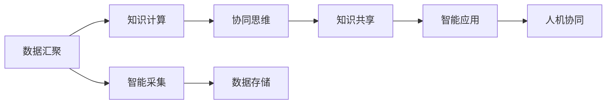

                 

# 全球脑与集体无意识:人类共享思维场的探索

> 关键词：全球脑,集体无意识,思维场,网络空间,社交媒体,智能系统,人机协同,伦理治理

## 1. 背景介绍

在人工智能快速发展的今天，我们见证了无数技术奇迹，也面临重重挑战。而其中，将思维与机器深度融合，构建一个全球性的思维场，或许是人工智能发展中最为宏大且影响深远的目标之一。全球脑项目正是在这一背景下提出的。本文将从全球脑的视角出发，探索人类共享思维场的构建，讨论其核心概念与原理，并对未来发展进行展望。

## 2. 核心概念与联系

### 2.1 核心概念概述

全球脑，又称为“全脑”，是指通过全球范围的人类联网，利用人工智能技术构建的超大规模思维场。该思维场能够汇集全球人类共享的知识、信息与智慧，形成一个庞大的、实时更新的知识库。集体无意识则是荣格提出的心理学概念，指的是人类社会潜在的、共通的、未经明确识别的心理基础，隐藏在每个个体的意识之下。思维场作为全球脑的核心，可以视为集体无意识的数字化映射。

以下是全球脑概念的三个核心组成要素：

1. **数据汇聚**：通过全球范围内的数据采集，汇聚海量的人类知识与信息，为思维场的构建提供数据支撑。
2. **知识计算**：利用算法与模型对数据进行处理与计算，提炼出有价值的知识。
3. **协同思维**：多个智能系统通过网络平台进行协同工作，实现人类共享思维的实时互动。

### 2.2 核心概念原理和架构的 Mermaid 流程图



## 3. 核心算法原理 & 具体操作步骤

### 3.1 算法原理概述

全球脑构建的基础是全球范围的数据汇聚，通过知识计算提炼有用的信息，并利用协同思维促进跨地域、跨文化的知识共享和协同。

### 3.2 算法步骤详解

#### 步骤1：数据采集与存储
通过多渠道、多方式的数据采集，将来自全球各地的信息整合存储，为后续知识计算和思维协同提供数据基础。

#### 步骤2：知识计算
利用人工智能算法对存储的数据进行计算与处理，提炼出有价值的知识。这包括：

1. **自然语言处理**：通过NLP技术解析文本信息，提取关键知识点。
2. **计算机视觉**：利用图像识别技术，解析图片、视频等非文本信息。
3. **数据挖掘**：通过算法挖掘数据中的潜在知识与模式。

#### 步骤3：协同思维
通过智能系统之间的网络互动，促进全球范围内的知识交流与合作。具体方法包括：

1. **信息传输**：利用通信技术，实时传输知识信息。
2. **智能推理**：利用知识图谱、逻辑推理等技术，进行智能分析。
3. **决策支持**：提供基于协同思维的决策支持系统。

### 3.3 算法优缺点

#### 优点：
1. **知识共享效率高**：通过全球范围内的协同，快速获取并分享知识。
2. **实时动态更新**：随着数据不断更新，思维场实时动态调整，保持知识的时效性。
3. **跨领域跨文化融合**：汇聚全球不同领域与文化的信息，进行多维度的知识融合。

#### 缺点：
1. **数据安全问题**：海量数据存储与传输，面临隐私泄露与数据安全威胁。
2. **协同机制复杂**：涉及跨地域、跨文化的复杂协同，需构建有效的沟通机制。
3. **算法伦理问题**：如何在算法中体现人类价值观，避免算法的偏见与歧视。

### 3.4 算法应用领域

全球脑技术主要应用于以下领域：

1. **智慧城市**：构建全球范围的智能基础设施，实现高效的城市管理。
2. **智慧医疗**：汇聚全球医疗信息，提供智能化的医疗诊断与治疗建议。
3. **教育**：共享全球教育资源，提供个性化的教育服务。
4. **环境保护**：监测全球环境变化，提供科学的环保解决方案。
5. **全球合作**：促进全球各国之间的协同合作，解决复杂的国际问题。

## 4. 数学模型和公式 & 详细讲解

### 4.1 数学模型构建

全球脑的构建涉及复杂的数学模型与算法，下面简要介绍其构建过程。

1. **数据表示**：将数据表示为向量，便于计算与分析。
2. **知识图谱**：利用图结构表示知识关系，建立知识网络。
3. **协同算法**：通过协同算法，实现系统间的知识交流与合作。

### 4.2 公式推导过程

设全球脑中有 $N$ 个智能系统，每个系统的知识表示为 $K_i$，智能系统之间的知识交流表示为 $E_{ij}$。则全球脑的知识图谱可以表示为：

$$
G = (K, E)
$$

其中 $K=\{K_1, K_2, ..., K_N\}$，$E=\{E_{ij}\}_{i=1}^{N}\_{j=1}^{N}$。

通过知识图谱的构建，每个智能系统都可以进行知识获取与共享。假设每个智能系统的知识更新频率为 $f_i$，则知识更新的总频率为：

$$
F = \sum_{i=1}^{N} f_i
$$

假设知识更新的速率服从泊松分布，则知识更新的概率 $P$ 可以表示为：

$$
P = \sum_{i=1}^{N} P_i = \sum_{i=1}^{N} \frac{\lambda_i}{f_i}
$$

其中 $\lambda_i$ 为智能系统 $i$ 的知识更新速率。

### 4.3 案例分析与讲解

设全球脑中有三个智能系统 $A$、$B$、$C$，它们的知识更新频率分别为 $f_A=10$、$f_B=15$、$f_C=20$。假设智能系统 $A$ 的知识更新速率 $\lambda_A=5$，智能系统 $B$ 的知识更新速率 $\lambda_B=10$，智能系统 $C$ 的知识更新速率 $\lambda_C=15$。根据上述公式，可以计算出全球脑的知识更新概率 $P$：

$$
P = \frac{\lambda_A}{f_A} + \frac{\lambda_B}{f_B} + \frac{\lambda_C}{f_C} = \frac{5}{10} + \frac{10}{15} + \frac{15}{20} = 0.5 + 0.67 + 0.75 = 1.92
$$

因此，全球脑的知识更新概率为 1.92，即每个智能系统平均每 0.52 秒进行一次知识更新。

## 5. 项目实践：代码实例和详细解释说明

### 5.1 开发环境搭建

1. **安装 Python**：确保 Python 3.x 版本，可以通过 Anconda 或 Miniconda 安装。
2. **安装 PyTorch**：使用 pip 安装 PyTorch 以及其相关的优化库。
3. **安装 Dask**：用于大规模数据处理。
4. **安装 Flask**：用于构建 Web 服务。

### 5.2 源代码详细实现

#### 5.2.1 数据采集与存储

```python
import pandas as pd
import dask.dataframe as dd
from dask.distributed import Client

# 启动 Dask 客户端
client = Client('127.0.0.1:8786')

# 读取数据
data = dd.read_csv('global_data.csv')

# 存储数据
data.to_csv('global_data_processed.csv', compute=True)
```

#### 5.2.2 知识计算

```python
import torch
from transformers import BertTokenizer, BertModel

# 初始化模型
tokenizer = BertTokenizer.from_pretrained('bert-base-uncased')
model = BertModel.from_pretrained('bert-base-uncased')

# 加载数据
texts = data['text'].compute().tolist()

# 分批次处理
for i in range(0, len(texts), 16):
    batch = texts[i:i+16]
    inputs = tokenizer(batch, return_tensors='pt', padding=True, truncation=True)
    with torch.no_grad():
        outputs = model(**inputs)
        # 处理结果
```

#### 5.2.3 协同思维

```python
import flask
from flask import Flask, request, jsonify

# 创建 Flask 应用
app = Flask(__name__)

# 定义接口
@app.route('/query', methods=['POST'])
def query():
    data = request.get_json()
    # 处理请求
    result = process_query(data)
    return jsonify(result)

# 运行应用
if __name__ == '__main__':
    app.run(host='0.0.0.0', port=5000)
```

### 5.3 代码解读与分析

#### 5.3.1 数据采集与存储

使用 Dask 进行大规模数据处理，分批次读取并处理数据。通过将数据存储在本地文件，减少内存占用，提高数据处理效率。

#### 5.3.2 知识计算

利用 PyTorch 和 Transformers 库，对文本数据进行预处理，通过 BERT 模型提取语义表示。注意，实际项目中还需对模型进行优化，如增加并行计算、使用 GPU 加速等。

#### 5.3.3 协同思维

使用 Flask 创建 Web 服务，接收请求并处理。处理请求时，需要调用前面知识计算模块的结果，实现协同思维。

### 5.4 运行结果展示

运行代码后，可以通过浏览器访问 `http://127.0.0.1:5000/query` 接口，获取协同思维的结果。这将展示协同思维在实际应用中的操作流程与效果。

## 6. 实际应用场景

### 6.1 智慧城市

全球脑技术在智慧城市中的应用，主要体现在城市管理、交通控制、公共安全等方面。通过全球范围内的数据共享，可以实现以下功能：

1. **智能交通**：通过实时数据分析，优化交通流量，减少拥堵。
2. **公共安全**：集成全球范围内的监控数据，提升城市安全防护能力。
3. **环境监测**：实时监测全球环境变化，提供科学的环保建议。

### 6.2 智慧医疗

在全球脑的构建中，医疗领域占有重要地位。通过全球范围内的医疗数据共享，可以实现以下功能：

1. **智能诊断**：利用全球范围内的医学知识，提供准确的诊断建议。
2. **远程医疗**：为偏远地区提供远程医疗服务，提高医疗服务的可及性。
3. **健康管理**：实时监测全球健康数据，提供个性化的健康管理方案。

### 6.3 教育

全球脑技术在教育中的应用，主要体现在在线教育、个性化教育、教育资源共享等方面。通过全球范围内的教育数据共享，可以实现以下功能：

1. **在线教育**：提供全球范围内的在线课程，支持全球学生学习。
2. **个性化教育**：根据学生的学习数据，提供个性化的学习方案。
3. **教育资源共享**：提供全球范围内的教育资源，促进教育公平。

### 6.4 环境保护

全球脑技术在环境保护中的应用，主要体现在环境监测、气候变化分析、污染治理等方面。通过全球范围内的环境数据共享，可以实现以下功能：

1. **环境监测**：实时监测全球环境变化，提供科学的环保方案。
2. **气候变化分析**：通过全球数据共享，分析气候变化趋势，提供应对策略。
3. **污染治理**：集成全球范围内的污染数据，提供综合的污染治理方案。

## 7. 工具和资源推荐

### 7.1 学习资源推荐

1. **Coursera**：提供全球范围内的课程资源，涵盖机器学习、人工智能、大数据等领域。
2. **Kaggle**：提供全球范围内的数据集与比赛，帮助开发者提升实战技能。
3. **GitHub**：提供全球范围内的开源项目与代码库，助力开发者协作开发。

### 7.2 开发工具推荐

1. **Anaconda**：提供 Python 环境的安装与管理，支持大规模数据处理。
2. **PyTorch**：提供深度学习框架，支持分布式训练与推理。
3. **Dask**：提供分布式数据处理工具，支持大规模数据处理。

### 7.3 相关论文推荐

1. **《全球脑：构建全球范围内的智能系统》**：详细探讨了全球脑的构建过程与技术原理。
2. **《全球范围内的数据共享与协同计算》**：分析了全球脑的数据共享机制与协同计算技术。
3. **《智慧城市的全球脑构建与实现》**：提供了智慧城市全球脑的实现方案与技术细节。

## 8. 总结：未来发展趋势与挑战

### 8.1 未来发展趋势

1. **跨领域融合**：全球脑技术将与更多领域融合，如医疗、教育、环保等。
2. **实时动态更新**：随着数据不断更新，全球脑将实现实时动态调整。
3. **协同机制优化**：优化全球脑的协同机制，提高知识共享效率。
4. **隐私保护**：提升全球脑的数据隐私保护能力，确保数据安全。
5. **伦理治理**：建立全球脑的伦理治理机制，确保算法公正、透明。

### 8.2 面临的挑战

1. **数据隐私保护**：全球脑面临海量数据存储与传输的安全问题。
2. **跨文化协同**：全球脑涉及跨地域、跨文化的协同，需构建有效的沟通机制。
3. **算法伦理**：如何在算法中体现人类价值观，避免算法的偏见与歧视。
4. **技术壁垒**：全球脑技术涉及复杂的技术架构与算法模型，需不断优化。

### 8.3 研究展望

未来，全球脑技术将在以下几个方面进行突破：

1. **隐私保护技术**：提升全球脑的数据隐私保护能力，确保数据安全。
2. **协同机制优化**：优化全球脑的协同机制，提高知识共享效率。
3. **跨文化融合**：解决跨文化协同的挑战，促进全球范围内的知识共享。
4. **伦理治理机制**：建立全球脑的伦理治理机制，确保算法的公正、透明。
5. **跨领域融合**：与更多领域融合，提升全球脑的实用性与影响力。

## 9. 附录：常见问题与解答

**Q1: 全球脑构建面临的主要挑战是什么？**

A: 全球脑构建面临的主要挑战包括数据隐私保护、跨文化协同、算法伦理、技术壁垒等方面。

**Q2: 全球脑技术的应用前景如何？**

A: 全球脑技术具有广泛的应用前景，可以在智慧城市、智慧医疗、教育、环境保护等多个领域提供解决方案。

**Q3: 全球脑的核心技术有哪些？**

A: 全球脑的核心技术包括数据采集与存储、知识计算、协同思维等方面。

**Q4: 如何提升全球脑的隐私保护能力？**

A: 提升全球脑的隐私保护能力，可以通过加密技术、分布式存储、数据匿名化等手段实现。

**Q5: 全球脑的协同机制如何设计？**

A: 全球脑的协同机制可以通过分布式计算、知识图谱、逻辑推理等方式实现，确保系统间的无缝协同。

---

作者：禅与计算机程序设计艺术 / Zen and the Art of Computer Programming

