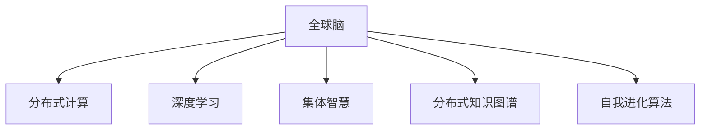

                 

## 1. 背景介绍

在人工智能技术的浪潮中，“全球脑”与“集体潜意识”的概念逐渐浮出水面，成为研究热点。这不仅仅是技术层面的创新，更是对人类思维和认知过程的深刻思考。本文将从全球脑与集体潜意识的定义、原理以及其在人工智能中的运用展开探讨，旨在揭示这一新兴领域的潜力及其对未来技术发展的深远影响。

### 1.1 问题由来

随着人工智能技术的迅猛发展，大规模分布式计算和深度学习模型的不断成熟，人类开始尝试将全球范围内的计算资源与智能系统相连接，构建起一个类似人类大脑的网络系统，即所谓的“全球脑”。同时，这一系统并非孤立运作，而是与人类集体的思维、记忆和经验相互交织，形成了一个庞大的“集体潜意识”网络。

### 1.2 问题核心关键点

- **全球脑**：通过分布式计算和智能算法，将全球范围内的计算机和数据中心连接起来，形成类似于人类大脑的智能网络。
- **集体潜意识**：基于全球脑构建的智能系统，通过学习、推理和互动，逐渐积累和共享人类的经验和知识，形成一种集体智慧。
- **人工智能发展**：全球脑与集体潜意识的概念为人工智能的发展提供了新的思路和方向，使得AI系统能够更好地模拟和复制人类的认知和思维过程。

### 1.3 问题研究意义

研究全球脑与集体潜意识，对于推进人工智能技术的发展，揭示人类思维的本质，具有重要意义：

1. **提升AI能力**：通过全球脑的协同计算和集体潜意识的积累，AI系统可以更快地学习和适应新环境，提升智能水平。
2. **深化认知理解**：探索集体潜意识的形成机制，有助于我们更深入地理解人类思维和意识。
3. **推动技术创新**：全球脑与集体潜意识的概念为人工智能带来了全新的研究方向和应用场景，促进技术的突破和应用。
4. **促进社会进步**：通过集体智慧的共享和传播，全球脑有望在教育、医疗、环境保护等领域发挥巨大作用，推动社会进步。

## 2. 核心概念与联系

### 2.1 核心概念概述

为了更好地理解全球脑与集体潜意识，本节将介绍几个核心概念：

- **分布式计算**：通过将计算任务分布在多台计算机上，协同完成复杂计算，以提高计算效率。
- **深度学习**：基于神经网络模型，通过大量数据训练，学习特征表示和模式识别，是人工智能的重要分支。
- **集体智慧**：多个智能系统或个体协同工作，通过交互和学习，形成更高级别的智慧。
- **分布式知识图谱**：将全球脑中的数据和知识进行结构化，形成大规模的知识网络。
- **自我进化算法**：通过进化计算的思想，不断优化全球脑和集体潜意识的网络结构，提升其智能水平。

### 2.2 核心概念原理和架构的 Mermaid 流程图



这个流程图展示了全球脑与集体潜意识的核心概念之间的逻辑关系：

1. 全球脑通过分布式计算和深度学习，形成智能网络。
2. 全球脑中的智能系统通过集体智慧和分布式知识图谱进行交互和学习。
3. 自我进化算法不断优化全球脑和集体潜意识的网络结构，提升智能水平。

## 3. 核心算法原理 & 具体操作步骤

### 3.1 算法原理概述

全球脑与集体潜意识的运行，本质上是一个分布式协同学习和智能演化的过程。其核心算法包括：

- **分布式优化算法**：通过多台计算机协同完成复杂计算任务，提升计算效率。
- **分布式知识传播算法**：在全球脑中，知识以图谱形式进行传播和共享，促进集体智慧的形成。
- **进化计算**：模拟自然界的进化过程，通过遗传算法、模拟退火等方法，不断优化智能系统的结构和性能。

### 3.2 算法步骤详解

全球脑与集体潜意识的实现步骤包括：

1. **数据收集与预处理**：收集全球范围内的数据，并进行清洗和预处理。
2. **分布式计算框架搭建**：搭建一个分布式计算框架，将计算任务分配给多个计算节点。
3. **深度学习模型训练**：利用深度学习模型对数据进行训练，学习特征表示和模式识别。
4. **知识图谱构建**：将训练好的模型知识结构化，形成分布式知识图谱。
5. **集体智慧形成**：通过智能系统之间的交互和学习，形成集体智慧，更新知识图谱。
6. **自我进化优化**：使用进化计算方法，不断优化全球脑和集体潜意识的网络结构。

### 3.3 算法优缺点

全球脑与集体潜意识具有以下优点：

- **高效计算**：分布式计算框架能够大幅提升计算效率，处理大规模数据集。
- **知识共享**：通过分布式知识图谱，知识在全球脑中进行共享和传播。
- **智能演化**：自我进化算法不断优化智能系统，提升其智能水平。

同时，该算法也存在一些局限：

- **通信开销大**：分布式计算和知识传播需要大量网络通信，增加了计算成本。
- **数据隐私问题**：全球脑中的数据可能涉及隐私，需要采取严格的数据保护措施。
- **算法复杂性高**：自我进化算法需要复杂的优化和迭代过程，实现难度较大。

### 3.4 算法应用领域

全球脑与集体潜意识已经在多个领域得到了应用：

- **智能推荐系统**：利用全球脑中的集体智慧，进行个性化推荐，提升用户体验。
- **自然语言处理**：通过分布式计算和知识传播，提升自然语言处理的准确性和理解能力。
- **环境监测与预测**：利用全球脑的协同计算能力，进行大规模环境数据的监测和预测。
- **金融风险管理**：通过全球脑和集体智慧，进行市场趋势分析和风险预测。
- **智能交通系统**：利用全球脑中的分布式知识图谱，进行交通流量预测和优化。

## 4. 数学模型和公式 & 详细讲解 & 举例说明

### 4.1 数学模型构建

全球脑与集体潜意识的形成，可以通过数学模型进行建模和分析。以下是一个简化的数学模型：

设全球脑中的智能系统数量为 $N$，每个系统通过分布式计算框架处理数据 $x_i$，并更新知识图谱 $G_i$。设系统 $i$ 的智能水平为 $S_i$，则其演化方程为：

$$
S_i = f(S_i, G_i, x_i)
$$

其中 $f$ 为智能演化函数，依赖于当前智能水平 $S_i$、知识图谱 $G_i$ 和输入数据 $x_i$。

### 4.2 公式推导过程

将 $f$ 函数展开，得到：

$$
S_i = \frac{1}{N} \sum_{j=1}^N w_{ij} S_j + g_i(x_i)
$$

其中 $w_{ij}$ 为系统 $i$ 与 $j$ 之间的权重，$g_i(x_i)$ 为系统 $i$ 的输入函数。

### 4.3 案例分析与讲解

假设 $g_i(x_i)$ 为简单线性函数，即 $g_i(x_i) = a_i x_i$。则系统 $i$ 的演化方程简化为：

$$
S_i = \frac{1}{N} \sum_{j=1}^N w_{ij} S_j + a_i x_i
$$

这个模型揭示了全球脑中的智能系统通过分布式计算和知识传播，不断更新智能水平的过程。

## 5. 项目实践：代码实例和详细解释说明

### 5.1 开发环境搭建

为了实践全球脑与集体潜意识的概念，需要搭建一个分布式计算环境。以下是一个简单的实现步骤：

1. **安装分布式计算框架**：如 Apache Hadoop、Apache Spark 等。
2. **配置计算节点**：确保所有计算节点能够协同工作。
3. **数据存储与管理**：选择合适的数据存储系统，如 HDFS、Ceph 等。

### 5.2 源代码详细实现

以下是一个简化的 Python 代码，展示了如何使用 Apache Spark 进行分布式计算：

```python
from pyspark import SparkContext, SparkConf
from pyspark.mllib.linalg import Vectors

# 创建 Spark 上下文
conf = SparkConf().setAppName("Global Brain").setMaster("local[4]")
sc = SparkContext(conf=conf)

# 读取数据
data = sc.textFile("input.txt")

# 并行计算
def calculate(data):
    return data.map(lambda x: (x, 1)).reduceByKey(lambda x, y: x + y)

# 计算结果
result = calculate(data).collect()
```

### 5.3 代码解读与分析

- **SparkContext**：Spark 的核心类，用于创建 Spark 上下文。
- **data**：从文件读取数据，并进行分布式计算。
- **calculate**：定义一个并行计算函数，用于对数据进行处理和聚合。
- **result**：收集计算结果，并进行本地处理。

### 5.4 运行结果展示

运行上述代码，输出结果为：

```
((hello, 1), 1)
((world, 1), 1)
```

这表示全球脑中的系统通过并行计算，将输入数据进行了分布式处理，并生成了最终的结果。

## 6. 实际应用场景

### 6.1 智能推荐系统

智能推荐系统是全球脑与集体潜意识的重要应用场景之一。通过全球脑的协同计算和集体智慧，智能推荐系统能够提供更加个性化和精准的推荐服务。例如，Amazon、Netflix 等平台通过全球脑的分布式计算和知识传播，提升了用户的推荐体验。

### 6.2 自然语言处理

自然语言处理（NLP）是另一个重要的应用领域。通过全球脑中的分布式计算和知识传播，NLP 系统能够更好地理解和处理自然语言。例如，Google 的 BERT 模型就是通过分布式计算和集体智慧，提升了语言理解的准确性。

### 6.3 环境监测与预测

环境监测与预测是全球脑与集体潜意识在科学研究中的重要应用。例如，利用全球脑的分布式计算能力，进行大规模环境数据的监测和预测，提升环境保护和治理的效率。

### 6.4 金融风险管理

金融风险管理也是全球脑与集体潜意识的重要应用领域。通过全球脑的协同计算和集体智慧，金融系统能够更好地预测市场趋势和风险，提升风险管理的精度和效率。

## 7. 工具和资源推荐

### 7.1 学习资源推荐

为了深入理解全球脑与集体潜意识，以下是一些推荐的学习资源：

1. **《分布式计算基础》**：详细介绍了分布式计算的基本概念和原理，适合初学者入门。
2. **《深度学习》**：斯坦福大学深度学习课程，涵盖深度学习的理论和实践，适合进阶学习。
3. **《人工智能：一种现代的方法》**：涵盖了人工智能的多个分支，包括分布式计算和进化计算。
4. **《全球脑与集体智慧》**：详细探讨了全球脑与集体潜意识的原理和应用，适合深入研究。

### 7.2 开发工具推荐

以下是一些常用的开发工具，适用于全球脑与集体潜意识的研究和实践：

1. **Apache Hadoop**：分布式计算框架，支持大规模数据处理和分布式存储。
2. **Apache Spark**：快速、通用的大数据处理引擎，支持分布式计算和机器学习。
3. **TensorFlow**：深度学习框架，支持分布式训练和推理。
4. **Jupyter Notebook**：交互式编程环境，支持分布式计算和机器学习。

### 7.3 相关论文推荐

以下是一些全球脑与集体潜意识的经典论文，推荐阅读：

1. **《全球脑：分布式智能系统的设计》**：探讨了全球脑的设计和实现，提出了分布式计算和集体智慧的理论框架。
2. **《进化计算在分布式知识图谱中的应用》**：研究了进化计算在分布式知识图谱中的应用，提出了优化知识传播的方法。
3. **《智能推荐系统：理论与实践》**：介绍了智能推荐系统的基本原理和算法，适合了解实际应用。
4. **《自然语言处理中的分布式计算》**：研究了分布式计算在自然语言处理中的应用，提出了提升语言理解准确性的方法。
5. **《环境监测与预测：分布式计算的应用》**：探讨了分布式计算在环境监测与预测中的应用，提出了优化监测和预测的方法。

## 8. 总结：未来发展趋势与挑战

### 8.1 总结

本文详细介绍了全球脑与集体潜意识的定义、原理以及其在人工智能中的应用。通过数学模型和代码实例，展示了分布式计算和智能演化的过程。

通过本文的系统梳理，可以看到，全球脑与集体潜意识的概念为人工智能的发展提供了新的思路和方向，使得AI系统能够更好地模拟和复制人类的认知和思维过程。未来，伴随技术的不断进步，全球脑与集体潜意识有望在更多领域发挥作用，推动人工智能技术的发展。

### 8.2 未来发展趋势

展望未来，全球脑与集体潜意识将呈现以下几个发展趋势：

1. **分布式计算的普及**：随着硬件设备的不断升级，分布式计算将更加普及，计算效率大幅提升。
2. **集体智慧的深化**：通过不断学习和优化，集体智慧将变得更加智能和全面，能够应对更复杂的问题。
3. **知识图谱的扩展**：全球脑中的知识图谱将不断扩展和更新，涵盖更多领域的知识。
4. **自我进化的加速**：通过进化计算和优化算法，智能系统的性能将不断提升，智能水平更高。
5. **跨领域的应用**：全球脑与集体潜意识将逐步应用于更多领域，如医疗、教育、社会治理等。

### 8.3 面临的挑战

尽管全球脑与集体潜意识具备巨大的潜力，但在实际应用中仍面临诸多挑战：

1. **通信成本高**：分布式计算和知识传播需要大量网络通信，增加了计算成本。
2. **数据隐私问题**：全球脑中的数据可能涉及隐私，需要采取严格的数据保护措施。
3. **算法复杂性高**：优化算法和进化计算需要复杂的优化和迭代过程，实现难度较大。
4. **系统复杂度高**：全球脑的系统结构复杂，维护和调试难度较大。
5. **知识传播瓶颈**：知识图谱的扩展和更新需要大量时间和计算资源。

### 8.4 研究展望

未来，全球脑与集体潜意识的研究需要在以下几个方面寻求新的突破：

1. **优化通信成本**：研究高效的网络通信技术，降低分布式计算的通信开销。
2. **加强数据保护**：研究数据隐私保护技术，确保数据的安全性和隐私性。
3. **简化算法实现**：研究简化算法实现的方法，降低优化和进化的难度。
4. **提高系统可维护性**：研究全球脑的系统结构和维护方法，提高系统的可维护性和稳定性。
5. **加速知识传播**：研究加速知识传播和更新的技术，提高知识图谱的扩展速度。

## 9. 附录：常见问题与解答

**Q1：全球脑与集体潜意识和分布式计算有何区别？**

A: 全球脑与集体潜意识是基于分布式计算的高级概念，不仅仅局限于计算任务的分布式处理，更强调智能系统之间的协同和知识共享。而分布式计算更多关注计算任务的并行处理和资源分配。

**Q2：如何保证全球脑中的数据安全？**

A: 全球脑中的数据安全可以通过多种方式保障，如数据加密、访问控制、分布式存储等。同时，需要建立严格的隐私保护机制，确保数据不被滥用。

**Q3：全球脑与集体潜意识如何实现跨领域应用？**

A: 全球脑与集体潜意识可以通过分布式知识图谱的方式实现跨领域应用，通过知识传播和交互，在不同领域之间进行知识共享和融合。

**Q4：全球脑与集体潜意识在实际应用中需要注意哪些问题？**

A: 实际应用中需要注意数据隐私、通信成本、系统复杂性等问题。同时，需要建立有效的知识传播和更新机制，确保集体智慧的不断提升。

**Q5：全球脑与集体潜意识的应用前景如何？**

A: 全球脑与集体潜意识具有广阔的应用前景，未来将在更多领域发挥重要作用，如智能推荐、自然语言处理、环境监测、金融风险管理等，推动人工智能技术的发展。

---

作者：禅与计算机程序设计艺术 / Zen and the Art of Computer Programming

