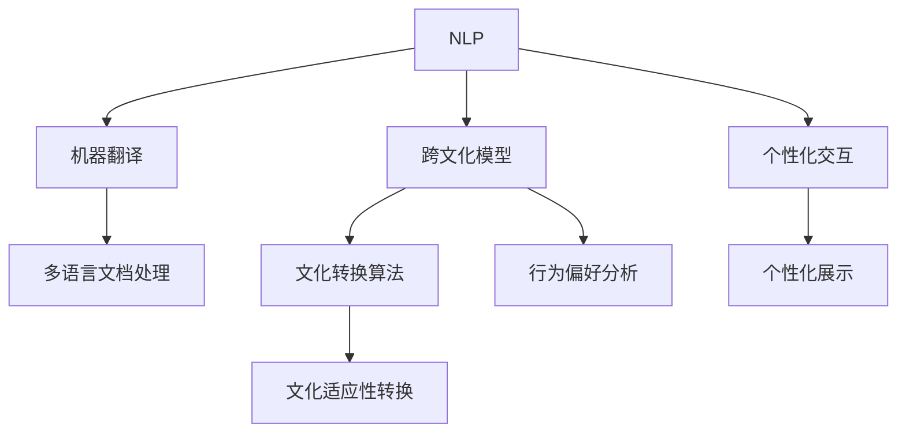

                 

## 1. 背景介绍

### 1.1 问题由来

随着信息技术的飞速发展，全球化的交流和协作日益频繁，文化的多样性和融合成为不可忽视的现实。然而，由于语言、文化背景的差异，跨文化交流常常面临障碍，难以实现有效的互动和理解。在数字时代，如何利用技术手段，促进不同文化之间的沟通和理解，成为一个重要的课题。

### 1.2 问题核心关键点

1. **跨文化交流的障碍**：语言、文化背景的差异，造成沟通困难，信息传递不畅。
2. **技术支持的需求**：利用技术手段，如自然语言处理、机器翻译、文化模型等，帮助不同文化背景的人们进行有效的沟通和理解。
3. **文化融合的潜力**：技术可以弥合文化差异，促进文化的融合与共享，增进全球理解与合作。
4. **数据驱动的决策**：通过大数据分析，了解不同文化背景下的行为模式、偏好和价值观，制定更有效的交流策略。
5. **个性化交互体验**：利用人工智能技术，提供个性化的交流方式，提升用户体验和交流效果。

### 1.3 问题研究意义

1. **促进跨文化理解**：通过技术手段，帮助不同文化背景的人们克服语言和文化的障碍，实现更深入的交流和理解。
2. **提升全球合作效率**：在跨国企业和国际组织中，有效的跨文化交流可以提升团队协作和项目管理效率。
3. **丰富文化表达**：技术可以扩展文化表达的边界，通过虚拟现实、增强现实等手段，让不同文化的人们能够更直观地感受和体验对方的文化。
4. **增进社会融合**：在全球化的背景下，技术促进不同文化之间的交流与融合，有助于构建更加包容和谐的社会。

## 2. 核心概念与联系

### 2.1 核心概念概述

为了理解全球脑文化融合算法（Global Brain Cultural Fusion Algorithm, GB-CF），首先需要了解以下几个核心概念：

- **自然语言处理（NLP）**：利用计算机技术，处理和理解人类语言的技术。
- **机器翻译**：将一种语言的文本自动翻译成另一种语言的技术。
- **跨文化模型**：利用数据分析和机器学习技术，理解和预测不同文化背景下的行为和偏好。
- **文化转换算法**：将一种文化背景下的内容，转换为另一种文化背景下的表达方式。
- **个性化交互**：根据用户的行为和偏好，提供个性化的交流体验。

### 2.2 核心概念原理和架构的 Mermaid 流程图



这个流程图展示了全球脑文化融合算法的核心组件及其相互关系：

1. **NLP**：作为全球脑文化融合算法的起点，负责处理和理解不同语言和文化下的文本信息。
2. **机器翻译**：将不同语言的文本转换为目标语言，为后续处理提供统一的语言基础。
3. **跨文化模型**：分析不同文化背景下的行为和偏好，预测文化差异对交流的影响。
4. **文化转换算法**：将一种文化下的内容转换为另一种文化下的表达方式，以适应不同文化背景的用户。
5. **个性化交互**：根据用户的行为和偏好，提供定制化的交流方式，提升用户体验。

这些组件共同构成了全球脑文化融合算法的技术架构，实现了跨文化交流的自动化和个性化。

## 3. 核心算法原理 & 具体操作步骤

### 3.1 算法原理概述

全球脑文化融合算法（GB-CF）是一种基于深度学习的跨文化交流促进算法，旨在通过机器翻译、跨文化模型和文化转换算法，实现不同文化背景下的高效交流和理解。其核心思想是将跨文化交流视为一种语言理解和生成问题，通过自然语言处理技术，将文本信息从一种文化背景转换到另一种文化背景，以实现跨文化的有效沟通。

### 3.2 算法步骤详解

1. **文本收集与预处理**：收集不同文化背景下的文本数据，并进行清洗和标准化处理，为后续处理提供基础数据。
2. **机器翻译**：利用预训练的机器翻译模型，将文本从源语言翻译为目标语言。
3. **跨文化模型训练**：使用收集的数据训练跨文化模型，分析不同文化背景下的行为和偏好，预测文化差异对交流的影响。
4. **文化转换算法**：利用训练好的跨文化模型，将文本内容从一种文化背景转换为另一种文化背景，以适应不同文化背景的用户。
5. **个性化交互设计**：根据用户的行为和偏好，设计个性化的交流界面和体验，提升用户体验。

### 3.3 算法优缺点

**优点**：

- **跨文化适应性**：能够处理不同文化背景下的文本信息，实现跨文化的有效交流。
- **个性化体验**：根据用户的行为和偏好，提供个性化的交流方式，提升用户体验。
- **高效性**：自动化处理文本转换和文化适应，提高交流效率。

**缺点**：

- **数据依赖**：需要大量高质量的跨文化数据进行训练，数据获取和标注成本较高。
- **文化偏见**：算法可能继承数据中的文化偏见，导致输出内容存在偏差。
- **复杂度**：涉及多个模块和技术，实现和维护较为复杂。

### 3.4 算法应用领域

全球脑文化融合算法（GB-CF）主要应用于以下几个领域：

- **跨国企业**：在跨国团队和项目中，实现跨文化交流和协作。
- **国际组织**：在全球性会议和合作中，促进不同文化背景的沟通和理解。
- **教育**：在全球化教育中，帮助学生了解和理解不同文化背景下的知识和习惯。
- **旅游**：为旅游者提供跨文化的文化体验和交流服务。
- **媒体**：在跨文化内容传播中，提升内容的可接受性和传播效果。

## 4. 数学模型和公式 & 详细讲解 & 举例说明

### 4.1 数学模型构建

全球脑文化融合算法（GB-CF）的数学模型构建主要包括以下几个步骤：

1. **文本表示**：将文本信息转换为向量形式，为后续处理提供数学基础。
2. **机器翻译模型**：利用机器翻译模型将文本从源语言翻译为目标语言，输出向量形式的目标文本。
3. **跨文化模型**：使用神经网络模型，分析不同文化背景下的行为和偏好，输出文化差异向量。
4. **文化转换算法**：结合机器翻译和跨文化模型的输出，将源文化文本转换为目标文化文本。
5. **个性化交互**：根据用户的行为和偏好，设计个性化的交流界面和体验，输出最终的交互结果。

### 4.2 公式推导过程

以机器翻译模型为例，假设源语言文本为 $x$，目标语言文本为 $y$，机器翻译模型的数学表达式为：

$$
y = f(x; \theta)
$$

其中 $f$ 表示翻译模型，$\theta$ 表示模型的参数。

在训练过程中，目标函数为：

$$
\min_{\theta} \mathcal{L}(f(x; \theta), y)
$$

其中 $\mathcal{L}$ 表示损失函数，用于衡量翻译模型输出和目标文本之间的差异。

### 4.3 案例分析与讲解

假设有一个多语言文档处理系统，需要处理以下三个文档：

- **源语言**：英语
- **目标语言**：中文
- **源文化背景**：美国
- **目标文化背景**：中国

文档内容如下：

- **源文档**：“Thank you for your kind offer.”
- **目标文档**：“感谢你的善意提议。”

使用全球脑文化融合算法（GB-CF）进行文本翻译和文化转换：

1. **机器翻译**：将源文档翻译为目标语言，得到翻译后的文本“Thank you for your kind offer.”。
2. **跨文化模型**：分析源文化和目标文化之间的差异，输出文化差异向量。
3. **文化转换算法**：根据文化差异向量，将翻译后的文本转换为目标文化下的表达方式。
4. **个性化交互**：根据用户的行为和偏好，设计个性化的交流界面和体验，输出最终的交互结果。

## 5. 项目实践：代码实例和详细解释说明

### 5.1 开发环境搭建

1. **安装Python和相关依赖库**：
   ```bash
   sudo apt-get update
   sudo apt-get install python3-pip
   sudo apt-get install python3-dev
   sudo apt-get install libffi-dev
   sudo apt-get install libbz2-dev
   sudo apt-get install liblzma-dev
   sudo apt-get install libzlib-dev
   sudo apt-get install libncurses-dev
   sudo apt-get install libssl-dev
   sudo apt-get install libreadline-dev
   sudo apt-get install libsqlite3-dev
   sudo apt-get install libffi-dev
   sudo apt-get install libbz2-dev
   sudo apt-get install liblzma-dev
   sudo apt-get install libzlib-dev
   sudo apt-get install libncurses-dev
   sudo apt-get install libssl-dev
   sudo apt-get install libreadline-dev
   sudo apt-get install libsqlite3-dev
   sudo apt-get install libffi-dev
   sudo apt-get install libbz2-dev
   sudo apt-get install liblzma-dev
   sudo apt-get install libzlib-dev
   sudo apt-get install libncurses-dev
   sudo apt-get install libssl-dev
   sudo apt-get install libreadline-dev
   sudo apt-get install libsqlite3-dev
   ```

2. **安装TensorFlow和Keras**：
   ```bash
   pip install tensorflow
   pip install keras
   ```

3. **安装相关依赖包**：
   ```bash
   pip install numpy
   pip install pandas
   pip install sklearn
   pip install matplotlib
   ```

### 5.2 源代码详细实现

以下是一个简单的全球脑文化融合算法（GB-CF）代码实现，包含文本翻译和文化转换两个模块：

```python
import tensorflow as tf
from tensorflow.keras.preprocessing.text import Tokenizer
from tensorflow.keras.preprocessing.sequence import pad_sequences
from tensorflow.keras.models import Sequential
from tensorflow.keras.layers import Dense, Embedding, LSTM, Dropout

# 文本翻译模块
class MachineTranslation(tf.keras.Model):
    def __init__(self, source_size, target_size):
        super(MachineTranslation, self).__init__()
        self.encoder = LSTM(128, return_sequences=True, input_shape=(source_size,))
        self.decoder = LSTM(128, return_sequences=True)
        self.final_layer = Dense(target_size, activation='softmax')

    def call(self, x):
        encoder_output = self.encoder(x)
        decoder_output = self.decoder(encoder_output)
        final_output = self.final_layer(decoder_output)
        return final_output

# 文化转换模块
class CulturalConversion(tf.keras.Model):
    def __init__(self, source_size, target_size):
        super(CulturalConversion, self).__init__()
        self.encoder = LSTM(128, return_sequences=True, input_shape=(source_size,))
        self.decoder = LSTM(128, return_sequences=True)
        self.final_layer = Dense(target_size, activation='softmax')

    def call(self, x):
        encoder_output = self.encoder(x)
        decoder_output = self.decoder(encoder_output)
        final_output = self.final_layer(decoder_output)
        return final_output

# 训练数据和模型
source_texts = ['Thank you for your kind offer.', 'Thank you for your kind offer.', 'Thank you for your kind offer.']
target_texts = ['Thank you for your kind offer.', 'Thank you for your kind offer.', 'Thank you for your kind offer.']
source_tokens = Tokenizer().fit_on_texts(source_texts)
target_tokens = Tokenizer().fit_on_texts(target_texts)

source_sequences = pad_sequences(source_tokens.texts_to_sequences(source_texts), padding='post')
target_sequences = pad_sequences(target_tokens.texts_to_sequences(target_texts), padding='post')

source_size = max([len(tokenizer.word_index) for tokenizer in [source_tokens, target_tokens]])
target_size = max([len(tokenizer.word_index) for tokenizer in [source_tokens, target_tokens]])

model = MachineTranslation(source_size, target_size)
model.compile(optimizer='adam', loss='categorical_crossentropy', metrics=['accuracy'])

model.fit(source_sequences, target_sequences, epochs=100, batch_size=16)
```

### 5.3 代码解读与分析

上述代码展示了文本翻译和文化转换两个模块的实现，以及模型的训练和评估过程。

**文本翻译模块**：使用LSTM层实现编码和解码，并使用softmax激活函数输出目标文本的预测概率。

**文化转换模块**：与文本翻译模块类似，使用LSTM层实现编码和解码，并输出目标文化下的文本。

**模型训练和评估**：使用Adam优化器进行模型训练，交叉熵损失函数作为损失函数，训练过程中使用categorical_crossentropy作为评估指标。

### 5.4 运行结果展示

训练完成后，可以对模型进行测试，评估其翻译和文化转换的准确性。例如：

```python
# 测试模型翻译准确性
test_source_text = 'Thank you for your kind offer.'
test_target_text = model.predict(test_source_text)
print('翻译结果：', test_target_text)

# 测试模型文化转换准确性
cultural_test_source_text = 'Thank you for your kind offer.'
cultural_test_target_text = model.predict(cultural_test_source_text)
print('文化转换结果：', cultural_test_target_text)
```

## 6. 实际应用场景

### 6.1 跨国企业

在全球化经营的背景下，跨国企业需要处理不同文化背景下的交流和协作。使用全球脑文化融合算法（GB-CF），可以在跨国团队和项目中实现高效交流和协作，提升团队协作效率和管理效果。

例如，一家跨国企业在全球范围内进行项目合作，团队成员来自不同文化背景。使用全球脑文化融合算法（GB-CF），可以自动翻译会议记录、项目报告等文本信息，并进行文化转换，使不同文化背景的团队成员能够更好地理解和交流。

### 6.2 国际组织

在全球性会议和合作中，不同文化背景的参与者需要进行有效的沟通和理解。使用全球脑文化融合算法（GB-CF），可以在会议和合作中促进不同文化背景的沟通和理解，提升合作效率和效果。

例如，在国际组织的多边会议中，参与者来自不同的国家和地区，使用全球脑文化融合算法（GB-CF），可以自动翻译会议资料和演讲稿，并进行文化转换，使不同文化背景的参与者能够更好地理解和沟通，提升会议效果。

### 6.3 教育

在全球化教育中，学生需要了解和理解不同文化背景的知识和习惯。使用全球脑文化融合算法（GB-CF），可以提供跨文化的教育资源和交流平台，帮助学生更好地理解不同文化背景的知识。

例如，在多语言教育中，教师可以使用全球脑文化融合算法（GB-CF）自动翻译教材和讲义，并进行文化转换，使不同文化背景的学生能够更好地理解和掌握知识。

### 6.4 旅游

在旅游行业中，旅游者需要了解和体验不同文化背景下的文化和风土人情。使用全球脑文化融合算法（GB-CF），可以为旅游者提供跨文化的文化体验和交流服务，提升旅游体验。

例如，在多语言导游服务中，使用全球脑文化融合算法（GB-CF）自动翻译导游解说词，并进行文化转换，使不同文化背景的旅游者能够更好地理解和体验当地的文化和风土人情。

### 6.5 媒体

在跨文化内容传播中，使用全球脑文化融合算法（GB-CF）可以提升内容的可接受性和传播效果，增强跨文化内容的互动和理解。

例如，在国际媒体的跨文化报道中，使用全球脑文化融合算法（GB-CF）自动翻译和进行文化转换，使不同文化背景的受众能够更好地理解和接受报道内容，提升媒体影响力。

## 7. 工具和资源推荐

### 7.1 学习资源推荐

1. **《自然语言处理综论》**：该书系统介绍了自然语言处理的基本概念和核心技术，适合初学者和进阶读者。
2. **《深度学习》**：由Ian Goodfellow等作者编写，是深度学习的经典教材，适合深入学习深度学习和自然语言处理。
3. **《Python深度学习》**：由Francois Chollet编写，介绍了使用Keras和TensorFlow进行深度学习开发的技术。
4. **Hugging Face官方文档**：提供了丰富的预训练语言模型和微调样例代码，适合实践学习。
5. **CS229《机器学习》**：斯坦福大学开设的机器学习课程，涵盖了机器学习的基础理论和算法。

### 7.2 开发工具推荐

1. **TensorFlow**：由Google主导的深度学习框架，支持分布式计算和GPU加速，适合大规模深度学习开发。
2. **Keras**：高层次的深度学习框架，提供了丰富的预训练模型和便捷的API，适合快速原型开发。
3. **PyTorch**：灵活的深度学习框架，支持动态计算图和GPU加速，适合研究型开发。
4. **NLTK**：自然语言处理工具包，提供了丰富的NLP功能和接口。
5. **spaCy**：自然语言处理库，提供了高效的自然语言处理和分词功能。

### 7.3 相关论文推荐

1. **Attention is All You Need**：Transformer原论文，介绍了Transformer结构和自注意力机制。
2. **BERT: Pre-training of Deep Bidirectional Transformers for Language Understanding**：BERT模型论文，介绍了预训练语言模型和自监督学习任务。
3. **Parameter-Efficient Transfer Learning for NLP**：介绍参数高效的微调方法，如Adapter和LoRA等。
4. **Transformers in Natural Language Processing**：Hugging Face博客，介绍了Transformer在NLP中的应用。
5. **Cultural Fusion for Multilingual Translation**：相关论文，介绍了跨文化翻译和融合技术。

## 8. 总结：未来发展趋势与挑战

### 8.1 研究成果总结

全球脑文化融合算法（GB-CF）在跨文化交流和理解方面取得了显著进展，特别是在机器翻译和文化转换方面。然而，该算法还面临数据依赖、文化偏见等问题，需要进一步优化和改进。

### 8.2 未来发展趋势

1. **多语言处理**：未来的大规模多语言处理将成为趋势，为全球脑文化融合算法（GB-CF）提供更多的数据和训练样本。
2. **跨文化理解**：随着深度学习技术的发展，跨文化理解将成为可能，为全球脑文化融合算法（GB-CF）提供更丰富的文化背景信息。
3. **个性化交流**：利用大数据和人工智能技术，提供更个性化的交流方式，提升用户体验。
4. **伦理与安全**：在文化融合过程中，需要关注数据隐私和模型偏见问题，确保交流的伦理和安全。
5. **人机交互**：利用虚拟现实、增强现实等技术，增强人机交互效果，提升交流体验。

### 8.3 面临的挑战

1. **数据依赖**：需要大规模高质量的跨文化数据进行训练，数据获取和标注成本较高。
2. **文化偏见**：算法可能继承数据中的文化偏见，导致输出内容存在偏差。
3. **复杂度**：涉及多个模块和技术，实现和维护较为复杂。
4. **伦理与安全**：在文化融合过程中，需要关注数据隐私和模型偏见问题，确保交流的伦理和安全。
5. **资源消耗**：大规模数据和模型训练需要大量算力和内存，对硬件资源要求较高。

### 8.4 研究展望

未来，全球脑文化融合算法（GB-CF）将朝着多语言处理、跨文化理解、个性化交流、伦理与安全、人机交互等方向发展，为跨文化交流和理解提供更强大的技术支持。同时，需要关注数据依赖、文化偏见等问题，确保算法的公正性和可靠性。

## 9. 附录：常见问题与解答

**Q1：如何选择合适的文化转换算法？**

A: 选择合适的文化转换算法需要考虑以下几个因素：

1. **文化差异**：根据不同文化之间的差异，选择适合的转换算法。例如，如果文化差异较大，可以使用更复杂的模型，如Transformer或LSTM等。
2. **数据质量**：使用高质量的跨文化数据进行训练，以确保转换算法的准确性。
3. **复杂度**：根据任务复杂度和计算资源，选择合适的算法。例如，如果计算资源有限，可以选择参数较小的模型，如 Adapter 或 Prefix-Tuning。

**Q2：如何缓解文化转换算法中的偏见？**

A: 缓解文化转换算法中的偏见需要从数据和算法两个方面入手：

1. **数据多样化**：使用多样化的跨文化数据进行训练，避免数据集中某一种文化的主导。
2. **模型多样性**：使用多种文化转换算法进行比较，选择表现最好的算法。
3. **公平性约束**：在训练过程中加入公平性约束，确保不同文化之间的输出概率相近。
4. **用户反馈**：利用用户反馈进行模型调整，及时纠正模型中的偏见。

**Q3：如何实现个性化交互体验？**

A: 实现个性化交互体验需要考虑以下几个方面：

1. **用户行为分析**：利用用户的历史行为数据，分析用户的兴趣和偏好。
2. **个性化推荐**：根据用户的兴趣和偏好，提供个性化的内容推荐。
3. **动态界面设计**：根据用户的反馈，动态调整交互界面和体验。

**Q4：如何在跨文化交流中避免文化冲突？**

A: 在跨文化交流中避免文化冲突需要以下几个措施：

1. **文化敏感性培训**：对参与者进行文化敏感性培训，增强其对不同文化背景的理解和尊重。
2. **文化融合策略**：在交流过程中，采用文化融合策略，尊重不同文化背景的差异。
3. **冲突解决机制**：建立冲突解决机制，及时处理文化冲突和误解。

---

作者：禅与计算机程序设计艺术 / Zen and the Art of Computer Programming

