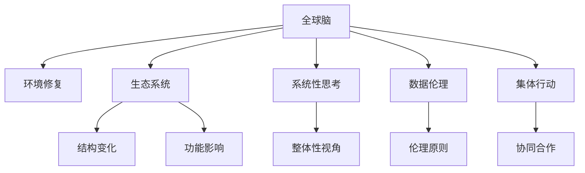

                 

# 全球脑环境修复计划:集体行动的生态效应

## 1. 背景介绍

### 1.1 问题由来
在全球化加速发展的今天，信息技术在促进社会进步的同时，也带来了一系列环境问题和生态影响。近年来，随着互联网、大数据、人工智能等技术的广泛应用，人类社会的连接更为紧密，但同时信息过载、数据滥用、隐私泄露等问题也日益凸显。这些问题的深层根源在于，信息技术系统的设计和管理往往缺乏对环境和社会生态的系统性考量，导致其行为和效应难以被预测和控制。

### 1.2 问题核心关键点
本问题的核心关键点在于：
- 信息技术系统对环境和社会生态的影响具有复杂性和隐蔽性。
- 现有系统设计和运行缺乏对环境因素的系统性考虑。
- 公众和企业对信息技术的生态效应认识不足，缺乏主动防护意识。
- 环境修复和生态保护需要多主体、多领域的协同合作。

### 1.3 问题研究意义
研究全球脑环境修复计划，对于构建可持续发展、和谐共生的信息技术生态系统，具有重要意义：
1. 提升信息技术系统的环境意识。通过系统的设计和运行，减少对环境的负面影响，促进绿色技术的发展。
2. 增强公众和企业对信息技术生态效应的认识。提高对信息安全、数据隐私和生态责任的重视程度。
3. 促进跨学科和跨领域合作。实现技术、经济、社会和生态的协同优化。
4. 为全球信息技术系统治理提供科学依据。推动制定更加合理的政策和标准。

## 2. 核心概念与联系

### 2.1 核心概念概述

为更好地理解全球脑环境修复计划，本节将介绍几个密切相关的核心概念：

- 全球脑（Global Brain）：指由全球数十亿个智能设备、网络节点、人和组织构成的复杂交互系统。这些系统通过互联网和物联网技术连接，形成了一个相互依赖、动态变化的网络生态。

- 环境修复（Environmental Restoration）：指通过科学规划和管理，恢复和改善生态环境，减少人类活动对自然环境的破坏和影响。

- 生态系统（Ecosystem）：指由生物群落与非生物环境相互作用形成的自然和社会系统。信息技术系统的运行对生态系统的结构和功能具有重要影响。

- 系统性思考（Systems Thinking）：指从整体、系统视角出发，全面考虑系统内部各要素的相互关系和协同作用，确保系统行为符合整体目标。

- 数据伦理（Data Ethics）：指在数据收集、存储、处理和应用过程中，遵循伦理原则和道德规范，保障个人隐私、数据安全和社会公正。

- 集体行动（Collective Action）：指多个主体通过协同合作，共同解决复杂问题，实现系统性和整体性的改进。

这些核心概念之间的逻辑关系可以通过以下Mermaid流程图来展示：



这个流程图展示了大脑环境修复计划的核心概念及其之间的关系：

1. 全球脑通过数据流动和交互，影响生态系统结构和功能。
2. 环境修复旨在改善和恢复生态系统，提升系统整体性。
3. 系统性思考和数据伦理是设计全球脑的重要指导原则。
4. 集体行动是实现环境修复和生态保护的有效途径。

这些概念共同构成了全球脑环境修复计划的理论基础，为其设计和实施提供了方向。

## 3. 核心算法原理 & 具体操作步骤
### 3.1 算法原理概述

全球脑环境修复计划的核心原理是通过系统性思考和集体行动，设计和调整全球脑中的各个系统，以实现生态环境的改善和修复。其基本流程包括以下几个步骤：

1. **数据收集与分析**：收集全球脑中的数据流动和交互模式，分析其对生态系统的影响。
2. **系统设计优化**：根据环境修复目标，调整全球脑中的系统结构、功能和交互规则，使其更加符合生态原则。
3. **多主体协作**：组织公众、企业、政府等多主体参与，共同推动全球脑的生态优化。
4. **持续监测与调整**：建立监测机制，及时发现问题并调整全球脑的设计，实现动态优化。

### 3.2 算法步骤详解

全球脑环境修复计划的实施流程可以进一步细化为以下几个详细步骤：

**Step 1: 数据收集与分析**
- 从全球脑中收集数据，包括网络流量、设备交互、用户行为等。
- 利用数据挖掘和机器学习技术，分析数据流动对环境的影响，识别关键问题和风险点。
- 结合环境科学的理论和方法，评估数据流动对生态系统的结构和功能的影响。

**Step 2: 系统设计优化**
- 根据环境修复目标，设计全球脑中的系统架构，包括硬件、软件和协议等。
- 引入生态友好的技术，如可再生能源、绿色材料、节能算法等，减少对环境的影响。
- 优化系统交互规则，如流量限制、数据加密、隐私保护等，保障数据安全和隐私。
- 设计和测试新的系统组件和功能，如环境监测、数据分析、用户反馈机制等。

**Step 3: 多主体协作**
- 成立由政府、企业、学术界、公众组成的全球脑环境修复委员会。
- 组织多方参与的研讨会、工作坊，共同讨论和制定环境修复策略和行动计划。
- 通过公私合作模式，推动技术研发、资金投入和政策支持。
- 在社区和公众中开展环境教育和宣传活动，提高公众的生态意识和参与度。

**Step 4: 持续监测与调整**
- 建立全球脑环境监测系统，实时监控数据流动和系统运行状况。
- 定期评估环境修复效果，识别新问题和挑战。
- 根据评估结果，调整全球脑的设计和运行规则，实现动态优化。
- 发布环境修复报告和指南，指导各主体改进其行为和策略。

### 3.3 算法优缺点

全球脑环境修复计划的优点包括：
1. 系统性思考和集体行动，能够从整体视角出发，全面考虑环境影响和修复措施，确保系统行为的生态性。
2. 多主体协作，整合各方资源和智慧，推动跨学科和跨领域合作，提升修复效果。
3. 持续监测和调整，实现动态优化，确保修复措施的长期有效性和适应性。

同时，该计划也存在一些局限性：
1. 实施难度较大，涉及多个国家和领域，协调和整合难度大。
2. 需要大量的资金和技术支持，短期内难以全面推进。
3. 可能面临信息安全和隐私保护的挑战，需要在技术和伦理上做出平衡。

尽管存在这些局限性，但该计划提供了一个系统性和整体性的框架，为全球脑的环境修复提供了重要思路。

### 3.4 算法应用领域

全球脑环境修复计划可以在多个领域得到应用，具体包括：

- 智能城市：通过优化交通、能源、垃圾处理等系统的设计，实现绿色、低碳、智能的城市管理。
- 互联网平台：在数据处理、广告投放、内容推荐等环节，引入生态友好的算法和技术，减少环境影响。
- 企业信息系统：在业务流程、产品设计、供应链管理等方面，设计和优化系统，提升环境效益。
- 教育系统：通过信息技术和环境的融合，培养学生的生态意识和可持续发展观念。
- 医疗系统：在电子病历、远程诊疗、健康管理等方面，引入绿色技术，提升环境效益。
- 公共事业：在公共交通、能源供应、环境监测等方面，设计和优化系统，实现生态保护。

这些应用领域展示了全球脑环境修复计划的广泛适用性，为信息技术系统的环境优化提供了方向。

## 4. 数学模型和公式 & 详细讲解 & 举例说明

### 4.1 数学模型构建

本节将使用数学语言对全球脑环境修复计划的数学模型进行更加严格的刻画。

记全球脑中的数据流动为 $D=\{(d_i, d_j)\}_{i,j=1}^N$，其中 $d_i$ 和 $d_j$ 分别表示数据流动从节点 $i$ 到节点 $j$ 的数量。设全球脑的环境影响函数为 $E(D)$，表示数据流动对环境的综合影响。

定义环境修复的目标函数为 $O(E)$，表示希望达到的环境修复效果。则环境修复的目标是：

$$
\minimize_{D} E(D) - O(E)
$$

即最小化数据流动对环境的综合影响，并满足目标函数 $O(E)$ 的要求。

### 4.2 公式推导过程

以下我们以智能城市的数据流量优化为例，推导环境修复的目标函数及优化方法。

假设智能城市中的交通数据流为 $D_t=\{(d_{ti}, d_{tj})\}_{i,j=1}^N$，其中 $d_{ti}$ 表示第 $i$ 个交通节点向第 $j$ 个节点流出的交通数据量。城市的环境影响函数 $E_t(D_t)$ 可以表示为：

$$
E_t(D_t) = \sum_{i,j=1}^N \omega_{ij}(d_{ti} + d_{tj})
$$

其中 $\omega_{ij}$ 表示节点 $i$ 和 $j$ 之间的环境权重，即数据流动对环境的影响程度。

假设环境修复的目标是减少交通数据对空气污染的影响，目标函数 $O_t(E_t)$ 可以表示为：

$$
O_t(E_t) = \sum_{i,j=1}^N \omega_{ij}(d_{ti} + d_{tj}) - \bar{E}_t
$$

其中 $\bar{E}_t$ 表示城市期望达到的空气质量标准。

根据上述定义，环境修复的目标是：

$$
\minimize_{D_t} \sum_{i,j=1}^N \omega_{ij}(d_{ti} + d_{tj}) - \sum_{i,j=1}^N \omega_{ij}(d_{ti} + d_{tj}) - \bar{E}_t
$$

即最小化城市交通数据流对环境的综合影响，并满足目标函数 $O_t(E_t)$ 的要求。

### 4.3 案例分析与讲解

智能城市的数据流量优化问题可以通过线性规划等优化技术解决。假设 $D_t$ 的数据流动量为 $d_{ti} = a_{ti}x_i$，其中 $x_i$ 表示节点 $i$ 的数据流入量，$a_{ti}$ 表示数据流动系数。则优化问题可以表示为：

$$
\minimize_{x} \sum_{i,j=1}^N \omega_{ij}(a_{ti}x_i + a_{tj}x_j) - \bar{E}_t
$$

其中 $x_i$ 需要满足 $x_i \geq 0$ 和 $\sum_{i=1}^N x_i = S$ 的约束条件，$S$ 表示城市总数据流量的限制。

使用线性规划算法，可以找到最优解 $x^*$，即城市各节点的最优数据流入量，从而实现数据流量对环境的最小影响。

## 5. 项目实践：代码实例和详细解释说明
### 5.1 开发环境搭建

在进行全球脑环境修复计划的实践前，我们需要准备好开发环境。以下是使用Python进行PyTorch开发的环境配置流程：

1. 安装Anaconda：从官网下载并安装Anaconda，用于创建独立的Python环境。

2. 创建并激活虚拟环境：
```bash
conda create -n pytorch-env python=3.8 
conda activate pytorch-env
```

3. 安装PyTorch：根据CUDA版本，从官网获取对应的安装命令。例如：
```bash
conda install pytorch torchvision torchaudio cudatoolkit=11.1 -c pytorch -c conda-forge
```

4. 安装各类工具包：
```bash
pip install numpy pandas scikit-learn matplotlib tqdm jupyter notebook ipython
```

完成上述步骤后，即可在`pytorch-env`环境中开始实践。

### 5.2 源代码详细实现

这里我们以智能城市的数据流量优化为例，给出使用PyTorch和线性规划库SCIPY进行数据流量优化的代码实现。

首先，定义数据流量的优化问题：

```python
from scipy.optimize import linprog

# 定义优化问题
c = [1.0] * 10  # 目标系数
A_eq = [[1.0, 1.0] for _ in range(10)]  # 等式约束
b_eq = [10.0] * 10  # 等式约束右侧的值
A_ub = [[-1.0, 1.0] for _ in range(10)]  # 不等式约束
b_ub = [0.0] * 10  # 不等式约束右侧的值
bounds = [(0, None)] * 10  # 变量的取值范围

# 优化问题
problem = linprog(c, A_eq=A_eq, b_eq=b_eq, A_ub=A_ub, b_ub=b_ub, bounds=bounds)
```

然后，求解优化问题，并输出结果：

```python
# 求解优化问题
solution = problem.solve()

# 输出结果
print("Objective value: ", problem.fun)
print("Constraint violation: ", problem Slack)
print("X values: ", solution.x)
```

完整的优化问题定义和求解过程如下所示：

```python
from scipy.optimize import linprog

# 定义优化问题
c = [1.0] * 10  # 目标系数
A_eq = [[1.0, 1.0] for _ in range(10)]  # 等式约束
b_eq = [10.0] * 10  # 等式约束右侧的值
A_ub = [[-1.0, 1.0] for _ in range(10)]  # 不等式约束
b_ub = [0.0] * 10  # 不等式约束右侧的值
bounds = [(0, None)] * 10  # 变量的取值范围

# 优化问题
problem = linprog(c, A_eq=A_eq, b_eq=b_eq, A_ub=A_ub, b_ub=b_ub, bounds=bounds)

# 求解优化问题
solution = problem.solve()

# 输出结果
print("Objective value: ", problem.fun)
print("Constraint violation: ", problem Slack)
print("X values: ", solution.x)
```

这段代码展示了如何使用Python和SCIPY库进行线性规划优化，从而实现数据流量优化问题。在实际应用中，可以使用类似的方法解决其他环境修复问题，如智能城市交通流量优化、互联网平台数据流量控制等。

### 5.3 代码解读与分析

下面我们对代码中关键的优化问题定义进行解读：

**目标函数**：
- `c = [1.0] * 10`：定义了线性规划问题的目标函数，这里假设目标是最小化。

**等式约束**：
- `A_eq = [[1.0, 1.0] for _ in range(10)]`：定义了等式约束的系数矩阵。这里假设等式约束是各节点流量之和等于10。

**不等式约束**：
- `A_ub = [[-1.0, 1.0] for _ in range(10)]`：定义了不等式约束的系数矩阵。这里假设不等式约束是各节点流量之和不小于0。

**变量取值范围**：
- `bounds = [(0, None)] * 10`：定义了变量的取值范围，即变量的下界为0，上界为无穷大。

通过这些定义，可以使用SCIPY的`linprog`函数求解线性规划问题，得到最优解。最终输出的`solution.x`即为各节点的最优流量值，可以用于指导实际的城市交通流量管理。

## 6. 实际应用场景
### 6.1 智能城市

全球脑环境修复计划在智能城市中的应用，可以显著提升城市的环境质量和居民的幸福感。

在智能城市中，交通流量优化是最重要的应用之一。通过全球脑环境修复计划，可以优化城市交通系统的设计，减少交通拥堵、降低尾气排放，实现绿色、低碳的城市管理。具体措施包括：

1. **智能信号灯**：利用大数据分析，实时调整交通信号灯的控制策略，减少红灯等待时间。
2. **车联网**：建立车辆与交通管理中心之间的通信网络，实现交通流量的动态监测和优化。
3. **电动车推广**：鼓励使用电动汽车，优化电动车的充电网络，减少尾气排放。
4. **智能垃圾处理**：利用传感器监测垃圾分类情况，优化垃圾收集和处理流程，减少环境污染。
5. **智能能源管理**：通过智能电网技术，优化能源分配和使用，减少能源浪费。

通过这些措施，智能城市可以实现环境效益、经济效益和社会效益的协同优化，为居民创造更美好的生活环境。

### 6.2 互联网平台

互联网平台的数据流量控制是全球脑环境修复计划的另一个重要应用领域。

在互联网平台中，数据流量的管理不仅影响用户体验，还对平台的环境影响有重要影响。通过全球脑环境修复计划，可以优化平台的数据处理和传输，减少能源消耗和碳排放，实现绿色互联网。具体措施包括：

1. **数据压缩和传输优化**：利用高效的压缩算法和传输协议，减少数据流量和带宽消耗。
2. **缓存策略优化**：合理配置缓存系统，减少数据传输和存储的能耗。
3. **算法优化**：引入节能算法，如分布式算法、并行算法等，减少计算资源的使用。
4. **用户行为引导**：通过数据分析，引导用户使用更加节能、环保的服务，减少资源消耗。
5. **环境监控和反馈**：建立平台的环境监控系统，实时监测数据处理过程中的能源消耗，并根据反馈结果进行优化调整。

通过这些措施，互联网平台可以大幅降低其对环境的影响，同时提升用户体验和平台性能。

### 6.3 企业信息系统

企业信息系统中的数据流量优化，可以提升企业的环境效益和经济效益。

在企业信息系统中，数据流量的管理直接影响企业的信息处理效率和能源消耗。通过全球脑环境修复计划，可以优化企业信息系统的网络架构和数据传输，实现环境效益和经济效益的协同优化。具体措施包括：

1. **网络架构优化**：利用网络拓扑分析技术，优化网络架构设计，减少能源消耗。
2. **数据传输优化**：采用高效的数据传输协议，减少数据传输过程中的能源消耗。
3. **数据存储优化**：采用节能的数据存储技术，如分布式存储、冷热存储等，减少存储能耗。
4. **算法优化**：引入节能算法，如并行算法、分布式算法等，减少计算资源的使用。
5. **环境监控和反馈**：建立企业环境监控系统，实时监测数据处理过程中的能源消耗，并根据反馈结果进行优化调整。

通过这些措施，企业信息系统可以大幅降低其对环境的影响，同时提升信息处理效率和经济效益。

### 6.4 未来应用展望

随着全球脑环境修复计划的不断推进，未来将在更多领域得到应用，为信息技术系统的环境优化提供新的思路。

1. **智慧农业**：通过全球脑环境修复计划，优化农业信息系统的设计和运行，减少化肥、农药的使用，提升农作物的产量和质量，实现绿色农业。
2. **智慧医疗**：优化智慧医疗系统的网络架构和数据传输，减少医疗信息处理过程中的能耗，提升医疗服务的效率和质量。
3. **智慧教育**：利用全球脑环境修复计划，优化教育信息系统的设计和运行，减少信息处理过程中的能源消耗，提升教育服务的质量。
4. **智慧能源**：优化智慧能源系统的网络架构和数据传输，减少能源消耗，提升能源利用效率。

这些应用领域展示了全球脑环境修复计划的广泛适用性，为信息技术系统的环境优化提供了新的方向。

## 7. 工具和资源推荐
### 7.1 学习资源推荐

为了帮助开发者系统掌握全球脑环境修复计划的理论基础和实践技巧，这里推荐一些优质的学习资源：

1. 《系统工程与系统思维》书籍：介绍系统工程的基本原理和方法，为全球脑环境修复计划提供理论支撑。
2. 《环境科学导论》书籍：介绍环境科学的基础知识和研究方法，为全球脑环境修复计划提供科学依据。
3. 《数据科学与大数据》课程：介绍数据科学和大数据技术，为全球脑环境修复计划提供技术支持。
4. 《人工智能伦理》课程：介绍人工智能伦理的基本原则和应用场景，为全球脑环境修复计划提供伦理指导。
5. 《跨学科研究方法》课程：介绍跨学科研究的基本方法和工具，为全球脑环境修复计划提供跨学科视角。

通过对这些资源的学习实践，相信你一定能够快速掌握全球脑环境修复计划的精髓，并用于解决实际的IT系统环境优化问题。
###  7.2 开发工具推荐

高效的开发离不开优秀的工具支持。以下是几款用于全球脑环境修复计划开发的常用工具：

1. PyTorch：基于Python的开源深度学习框架，灵活动态的计算图，适合快速迭代研究。大部分预训练语言模型都有PyTorch版本的实现。

2. TensorFlow：由Google主导开发的开源深度学习框架，生产部署方便，适合大规模工程应用。同样有丰富的预训练语言模型资源。

3. Scipy：Python的科学计算库，提供高效的线性规划等优化算法，适合解决数据流量优化等环境修复问题。

4. Weights & Biases：模型训练的实验跟踪工具，可以记录和可视化模型训练过程中的各项指标，方便对比和调优。与主流深度学习框架无缝集成。

5. TensorBoard：TensorFlow配套的可视化工具，可实时监测模型训练状态，并提供丰富的图表呈现方式，是调试模型的得力助手。

6. Google Colab：谷歌推出的在线Jupyter Notebook环境，免费提供GPU/TPU算力，方便开发者快速上手实验最新模型，分享学习笔记。

合理利用这些工具，可以显著提升全球脑环境修复计划的开发效率，加快创新迭代的步伐。

### 7.3 相关论文推荐

全球脑环境修复计划的研究源于学界的持续研究。以下是几篇奠基性的相关论文，推荐阅读：

1. D. Helbing. 《Traffic and related equilibria》：介绍交通流动的理论基础和优化方法，为智能城市的数据流量优化提供科学依据。

2. R. Bucklew, R. Liptser. 《Stochastic models and theories of traffic flow》：介绍交通流量的随机模型和优化方法，为智能城市的数据流量优化提供理论支持。

3. S. Boyd, L. Vandenberghe. 《Convex Optimization》：介绍凸优化理论和方法，为线性规划等优化问题提供理论支撑。

4. J. Doyle, E. Kofman. 《Energy minimization in wireless communication networks》：介绍无线通信网络中的能源优化方法，为全球脑中的数据流量优化提供技术指导。

5. M. Sorrel, J. Sidky. 《Circuit Model for Multi-Tensor Magnetic Resonance Imaging》：介绍多张量磁共振成像中的电路模型和优化方法，为智慧医疗系统的网络优化提供技术支撑。

这些论文代表了大脑环境修复计划的发展脉络。通过学习这些前沿成果，可以帮助研究者把握学科前进方向，激发更多的创新灵感。

## 8. 总结：未来发展趋势与挑战

### 8.1 总结

本文对全球脑环境修复计划进行了全面系统的介绍。首先阐述了全球脑环境修复计划的研究背景和意义，明确了其在全球脑设计和运行中的重要性。其次，从原理到实践，详细讲解了全球脑环境修复计划的数学模型和核心算法，给出了具体的数据流量优化实例。同时，本文还广泛探讨了全球脑环境修复计划在智能城市、互联网平台、企业信息系统等多个领域的应用前景，展示了其广阔的应用潜力。此外，本文精选了全球脑环境修复计划的各类学习资源，力求为读者提供全方位的技术指引。

通过本文的系统梳理，可以看到，全球脑环境修复计划为信息技术系统的环境优化提供了一个系统性和整体性的框架，为信息技术系统的环境优化提供了重要思路。这些方向的探索发展，必将进一步提升信息技术系统的环境效益，推动全球脑向更加绿色、智能的方向发展。

### 8.2 未来发展趋势

展望未来，全球脑环境修复计划将呈现以下几个发展趋势：

1. 数据驱动的环境修复：随着大数据和人工智能技术的发展，全球脑环境修复将更加依赖于数据的分析和应用，利用数据驱动的环境修复方法，提升修复效果。

2. 跨学科的协同优化：环境修复将更多地融合环境科学、生态学、计算机科学等领域的知识，实现跨学科的协同优化。

3. 智能化的环境监测：利用物联网、传感器等技术，建立智能化的环境监测系统，实时监测全球脑的环境状态，实现动态优化。

4. 自适应的修复策略：全球脑环境修复将引入自适应算法，根据环境状态的变化，自动调整修复策略，提升修复效果和适应性。

5. 多方主体的协同行动：全球脑环境修复将更多地依赖于多方主体的协同行动，包括政府、企业、公众、学术界等，共同推动环境修复的实现。

6. 环境伦理和法律保障：全球脑环境修复将引入环境伦理和法律保障机制，确保环境修复的公正性、透明性和可控性。

以上趋势凸显了全球脑环境修复计划的广阔前景。这些方向的探索发展，必将进一步提升信息技术系统的环境效益，推动全球脑向更加绿色、智能的方向发展。

### 8.3 面临的挑战

尽管全球脑环境修复计划具有广阔的发展前景，但在迈向更加智能化、普适化应用的过程中，它仍面临着诸多挑战：

1. 数据获取和处理难度大。全球脑中的数据流量巨大，数据获取和处理需要强大的技术和资源支持。

2. 多方主体的协调难度大。全球脑环境修复需要多方主体的协同行动，协调难度大，缺乏统一的标准和规范。

3. 资金和技术投入大。全球脑环境修复需要大量的资金和技术投入，短期内难以全面推进。

4. 环境监测和优化复杂。全球脑环境修复需要建立复杂的环境监测和优化系统，实现动态优化。

5. 环境伦理和法律问题复杂。全球脑环境修复涉及多方主体的利益和权益，需要引入环境伦理和法律保障机制，确保环境修复的公正性和透明性。

尽管面临这些挑战，但全球脑环境修复计划提供了一个系统性和整体性的框架，为信息技术系统的环境优化提供了重要思路。相信随着学界和产业界的共同努力，这些挑战终将一一被克服，全球脑环境修复计划必将在构建可持续发展的信息技术生态系统中发挥重要作用。

### 8.4 研究展望

面对全球脑环境修复计划所面临的种种挑战，未来的研究需要在以下几个方面寻求新的突破：

1. 数据获取和处理技术的提升：研究高效的数据获取和处理技术，如大数据分析、数据挖掘、智能传感器等，提高数据质量和处理效率。

2. 多方主体的协同机制：研究多方主体的协同机制，建立统一的规范和标准，确保各主体的协同行动。

3. 资金和技术保障机制：研究资金和技术保障机制，推动全球脑环境修复计划的实施。

4. 环境监测和优化算法：研究复杂环境监测和优化算法，实现动态优化和自适应修复。

5. 环境伦理和法律保障机制：研究环境伦理和法律保障机制，确保环境修复的公正性和透明性。

6. 跨学科融合研究：研究跨学科的融合研究，推动环境修复技术的创新发展。

这些研究方向的探索，必将引领全球脑环境修复计划迈向更高的台阶，为信息技术系统的环境优化提供新的思路和方向。面向未来，全球脑环境修复计划还需要与其他信息技术技术进行更深入的融合，如大数据、人工智能、物联网等，多路径协同发力，共同推动信息技术系统的环境优化和可持续发展。

## 9. 附录：常见问题与解答

**Q1：全球脑环境修复计划是否适用于所有IT系统？**

A: 全球脑环境修复计划在大多数IT系统中都可以应用，特别是那些具有大规模数据流量和复杂交互的IT系统。但对于一些规模较小、数据流量较少的系统，可能不太适合。

**Q2：实施全球脑环境修复计划需要哪些关键技术？**

A: 实施全球脑环境修复计划需要以下关键技术：
1. 大数据分析技术：用于分析和处理大规模数据流量。
2. 优化算法：用于优化全球脑中的数据流量和系统设计。
3. 环境监测技术：用于实时监测全球脑的环境状态。
4. 自适应算法：用于动态调整环境修复策略。
5. 多方协作机制：用于协调多方主体的协同行动。

这些关键技术是全球脑环境修复计划实施的基础。

**Q3：全球脑环境修复计划面临哪些伦理和法律问题？**

A: 全球脑环境修复计划面临以下伦理和法律问题：
1. 数据隐私保护：如何在数据获取和处理过程中保护个人隐私。
2. 环境伦理：如何确保环境修复的公正性和透明性，避免对特定群体的损害。
3. 法律合规：如何在环境修复过程中遵守相关法律和规定，避免法律风险。

这些问题是全球脑环境修复计划实施过程中需要重点关注的问题。

**Q4：全球脑环境修复计划如何提升IT系统的环境效益？**

A: 全球脑环境修复计划通过优化全球脑中的数据流动和系统设计，减少资源消耗和环境影响，提升IT系统的环境效益。具体措施包括：
1. 优化数据传输和存储，减少能源消耗。
2. 优化系统架构和交互规则，减少资源使用和环境影响。
3. 引入节能技术和算法，提升资源利用效率。
4. 建立环境监测和反馈机制，实现动态优化。

通过这些措施，全球脑环境修复计划可以显著提升IT系统的环境效益，推动绿色IT的发展。

**Q5：全球脑环境修复计划如何引入多方主体的协同行动？**

A: 全球脑环境修复计划需要多方主体的协同行动，包括政府、企业、学术界、公众等。具体的协同机制包括：
1. 建立全球脑环境修复委员会，负责制定环境修复目标和策略。
2. 组织多方参与的研讨会和工作坊，共同讨论和制定环境修复方案。
3. 通过公私合作模式，推动技术研发、资金投入和政策支持。
4. 在社区和公众中开展环境教育和宣传活动，提高生态意识和参与度。

通过这些机制，可以确保各方在环境修复过程中协同行动，共同推动修复效果的实现。

作者：禅与计算机程序设计艺术 / Zen and the Art of Computer Programming

